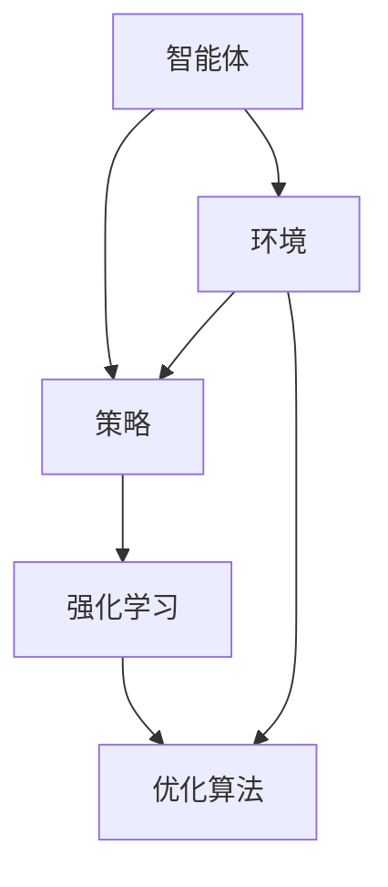

                 

# AI人工智能 Agent：智能体策略迭代与优化

> **关键词：** AI智能体、策略迭代、强化学习、优化算法、智能决策。

> **摘要：** 本文将探讨AI智能体的策略迭代与优化过程，通过深入分析核心概念、算法原理、数学模型和实际应用案例，揭示智能体在动态环境中实现高效决策的秘诀。本文旨在为AI领域的开发者提供一套系统化的策略优化方法论，助力智能体在复杂场景中展现卓越性能。

## 1. 背景介绍

### 1.1 目的和范围

随着人工智能技术的迅猛发展，智能体（Agent）作为自主行动和决策的实体，已成为AI领域的重要研究方向。本文旨在探讨智能体策略迭代与优化的核心问题，通过深入剖析策略迭代的基本原理和优化算法，帮助读者理解智能体在复杂环境中的决策过程。本文覆盖以下内容：

- 智能体策略迭代的基本概念与框架
- 强化学习算法在策略迭代中的应用
- 策略优化算法的原理与实现
- 实际应用场景中的智能体策略迭代与优化案例

### 1.2 预期读者

本文适合以下读者群体：

- AI领域的初学者和研究者，对智能体和强化学习有一定了解
- 想要提升智能体策略优化能力的开发者
- 对智能决策和优化算法感兴趣的计算机科学专业学生
- 对AI技术在实际应用场景中的潜力有探索欲望的从业者

### 1.3 文档结构概述

本文分为以下章节：

- 第1章：背景介绍
  - 目的和范围、预期读者、文档结构概述
- 第2章：核心概念与联系
  - 智能体、策略、强化学习、优化算法
- 第3章：核心算法原理 & 具体操作步骤
  - 强化学习算法原理、策略迭代操作步骤
- 第4章：数学模型和公式 & 详细讲解 & 举例说明
  - 强化学习中的数学模型、公式、实际案例分析
- 第5章：项目实战：代码实际案例和详细解释说明
  - 开发环境搭建、源代码实现、代码解读与分析
- 第6章：实际应用场景
  - 智能体在各个领域的应用实例
- 第7章：工具和资源推荐
  - 学习资源、开发工具框架、相关论文著作推荐
- 第8章：总结：未来发展趋势与挑战
  - 智能体策略迭代与优化的未来发展方向
- 第9章：附录：常见问题与解答
  - 常见问题、解答与建议
- 第10章：扩展阅读 & 参考资料
  - 相关文献、书籍、在线课程、技术博客推荐

### 1.4 术语表

#### 1.4.1 核心术语定义

- **智能体（Agent）**：具备一定智能，能够自主感知环境、制定决策并执行动作的实体。
- **策略（Policy）**：智能体在给定状态下选择最优动作的规则或函数。
- **强化学习（Reinforcement Learning）**：一种机器学习方法，通过智能体与环境交互，学习最优策略。
- **策略迭代（Policy Iteration）**：通过不断迭代改进策略，使智能体在动态环境中实现最优决策。
- **优化算法（Optimization Algorithm）**：用于搜索最优策略或解的算法，包括动态规划、深度强化学习等。

#### 1.4.2 相关概念解释

- **环境（Environment）**：智能体执行动作、接收反馈的动态系统。
- **状态（State）**：描述智能体在某一时刻所处的情况。
- **动作（Action）**：智能体在给定状态下可以执行的行为。
- **奖励（Reward）**：环境对智能体动作的反馈，用于指导策略迭代。
- **价值函数（Value Function）**：衡量智能体在特定状态下的期望收益。

#### 1.4.3 缩略词列表

- **RL**：强化学习（Reinforcement Learning）
- **Q-learning**：Q值学习（Q-Learning）
- **DQN**：深度Q网络（Deep Q-Network）
- **PPO**：优势估计与策略优化（Proximal Policy Optimization）

## 2. 核心概念与联系

### 2.1 智能体、策略、强化学习与优化算法

智能体、策略、强化学习和优化算法是本文的核心概念，它们相互关联，共同构建了智能体策略迭代与优化的框架。以下是这些核心概念及其相互关系的 Mermaid 流程图：



在图中，智能体（A）与环境（E）相互作用，通过策略（B）进行决策。强化学习（C）使智能体在学习过程中不断调整策略，优化算法（D）则用于搜索最优策略或解。这些概念相互交织，构成了智能体策略迭代与优化的基础。

### 2.2 强化学习算法

强化学习（RL）是一种使智能体通过与环境交互来学习最优策略的机器学习方法。以下是强化学习算法的基本原理和流程：

1. **初始化**：设置智能体的初始状态、策略和价值函数。
2. **执行动作**：智能体根据当前策略在给定状态下选择动作。
3. **环境反馈**：环境根据智能体的动作产生新的状态和奖励。
4. **更新策略**：基于奖励信息，智能体调整策略，以期望获得更高的奖励。
5. **重复执行**：智能体不断重复执行动作、接收反馈和更新策略，直至收敛到最优策略。

强化学习算法的核心是价值函数和策略迭代。价值函数用于评估智能体在特定状态下的期望收益，策略迭代则通过不断优化策略，使智能体在动态环境中实现最优决策。

### 2.3 策略优化算法

策略优化算法是强化学习算法中的重要组成部分，用于搜索最优策略或解。常见的策略优化算法包括动态规划、Q-learning、深度Q网络（DQN）和优势估计与策略优化（PPO）等。

- **动态规划**：基于递归关系，通过逆向推导求解最优策略。适用于有限状态和动作空间的问题。
- **Q-learning**：通过经验样本更新Q值，逐步逼近最优策略。适用于连续状态和动作空间的问题。
- **DQN**：利用深度神经网络近似Q值函数，提高智能体的学习效率。适用于高维状态和动作空间的问题。
- **PPO**：结合优势估计和策略优化，提高智能体的学习稳定性和性能。适用于动态和复杂环境的问题。

策略优化算法的核心在于如何高效地搜索最优策略或解，同时保证智能体在学习过程中的收敛性和鲁棒性。

## 3. 核心算法原理 & 具体操作步骤

### 3.1 强化学习算法原理

强化学习（RL）是一种使智能体通过与环境交互来学习最优策略的机器学习方法。其核心思想是智能体在给定状态下选择动作，通过环境反馈的奖励信号，不断调整策略，以期望获得更高的长期奖励。以下是强化学习算法的基本原理和具体操作步骤：

#### 3.1.1 初始化

1. **智能体初始化**：设置智能体的初始状态、策略和价值函数。
   - 初始状态：智能体在环境中的初始位置或初始状态。
   - 策略：智能体选择动作的规则或函数。
   - 初始价值函数：用于评估智能体在不同状态下的期望收益。

2. **环境初始化**：设置环境的初始状态、奖励函数和动作空间。
   - 初始状态：环境在初始时刻的状态。
   - 奖励函数：环境对智能体动作的反馈，用于指导智能体调整策略。
   - 动作空间：智能体可以选择的所有动作。

#### 3.1.2 执行动作

1. **选择动作**：智能体根据当前策略在给定状态下选择动作。
   - 状态表示：将当前状态表示为状态向量，用于输入策略函数。
   - 策略函数：根据状态向量，选择最优动作。

2. **环境反馈**：环境根据智能体的动作产生新的状态和奖励。
   - 新状态：智能体执行动作后，环境状态发生变化。
   - 奖励：环境对智能体动作的反馈，用于指导智能体调整策略。

#### 3.1.3 更新策略

1. **计算期望收益**：基于当前策略和价值函数，计算智能体在给定状态下的期望收益。
   - 期望收益：智能体在未来一段时间内获得的总奖励。

2. **更新价值函数**：根据期望收益，更新智能体的价值函数。
   - 更新公式：$V(s) \leftarrow V(s) + \alpha [r + \gamma \max_{a'} V(s') - V(s)]$，其中$\alpha$为学习率，$\gamma$为折扣因子。

3. **调整策略**：基于价值函数，调整智能体的策略。
   - 策略更新公式：$p(a|s) \leftarrow \frac{\exp(\lambda V(s))}{\sum_{a'} \exp(\lambda V(s'))}$，其中$\lambda$为温度参数。

#### 3.1.4 重复执行

1. **重复执行动作**：智能体不断重复执行动作、接收反馈和更新策略，直至收敛到最优策略。
2. **结束条件**：当智能体策略收敛，即价值函数和策略不再发生变化时，结束迭代过程。

### 3.2 强化学习算法实现

以下是强化学习算法的具体实现过程，使用Python伪代码进行描述：

```python
# 强化学习算法实现
def reinforce_learning():
    # 初始化
    state = env.reset()
    total_reward = 0
    while not done:
        # 选择动作
        action = choose_action(state)
        
        # 环境反馈
        next_state, reward, done = env.step(action)
        total_reward += reward
        
        # 更新价值函数
        value = calculate_value(state, action, next_state, reward)
        value_function.update(value)
        
        # 调整策略
        policy_function.update(value)
        
        # 更新状态
        state = next_state
    
    # 输出结果
    return total_reward
```

在实现过程中，`env.reset()` 用于环境初始化，`choose_action(state)` 用于选择动作，`env.step(action)` 用于环境反馈，`calculate_value(state, action, next_state, reward)` 用于计算期望收益，`value_function.update(value)` 用于更新价值函数，`policy_function.update(value)` 用于调整策略。

### 3.3 实际案例解析

以下是一个简单的实际案例，描述智能体在迷宫环境中通过强化学习算法寻找最优路径：

```python
# 迷宫环境
class MazeEnv:
    def __init__(self):
        self.state_size = 3
        self.action_size = 4
        self.reward_range = (-10, 10)
    
    def reset(self):
        self.state = [0, 0, 0]
        return self.state
    
    def step(self, action):
        reward = 0
        next_state = self.state.copy()
        
        if action == 0:  # 向上
            next_state[1] += 1
        elif action == 1:  # 向下
            next_state[1] -= 1
        elif action == 2:  # 向左
            next_state[0] -= 1
        elif action == 3:  # 向右
            next_state[0] += 1
        
        if next_state[0] < 0 or next_state[0] >= self.state_size or next_state[1] < 0 or next_state[1] >= self.state_size:
            reward = self.reward_range[1]
        elif next_state == [2, 2]:  # 到达终点
            reward = self.reward_range[1]
        else:
            reward = self.reward_range[0]
        
        return next_state, reward, False
    
# 强化学习算法实现
def reinforce_learning(maze_env):
    state = maze_env.reset()
    total_reward = 0
    while not done:
        action = choose_action(state)
        next_state, reward, done = maze_env.step(action)
        total_reward += reward
        state = next_state
    return total_reward

# 运行强化学习算法
maze_env = MazeEnv()
total_reward = reinforce_learning(maze_env)
print("Total Reward:", total_reward)
```

在该案例中，迷宫环境使用一个3x3的网格表示，智能体需要通过选择上下左右四个方向的动作，寻找到达终点的最优路径。奖励函数设置为一个较大的正奖励（10），表示成功到达终点，其他情况下给予一个较小的负奖励（-10）。通过运行强化学习算法，智能体能够逐步学习到最优路径。

## 4. 数学模型和公式 & 详细讲解 & 举例说明

### 4.1 强化学习中的数学模型

强化学习中的数学模型主要包括价值函数、策略函数和Q值函数。这些模型用于描述智能体在动态环境中如何通过迭代学习和调整策略，以实现最优决策。

#### 4.1.1 价值函数（Value Function）

价值函数是评估智能体在特定状态下的期望收益的数学模型。根据状态的不同，价值函数可以分为状态值函数（State-Value Function）和动作值函数（Action-Value Function）。

- **状态值函数（V(s)）**：衡量智能体在给定状态下执行任意动作的期望收益。
  - 公式：$V(s) = \sum_{a} p(a|s) \cdot Q(s, a)$，其中$p(a|s)$为智能体在状态s下选择动作a的概率，$Q(s, a)$为状态s和动作a的Q值。

- **动作值函数（Q(s, a)）**：衡量智能体在给定状态下执行特定动作的期望收益。
  - 公式：$Q(s, a) = \sum_{s'} p(s'|s, a) \cdot r(s', a) + \gamma \max_{a'} Q(s', a')$，其中$p(s'|s, a)$为智能体执行动作a后状态转移的概率，$r(s', a)$为状态s'和动作a的奖励，$\gamma$为折扣因子，用于平衡当前奖励和未来奖励。

#### 4.1.2 策略函数（Policy Function）

策略函数是指导智能体选择动作的数学模型，根据价值函数的不同，策略函数可以分为确定性策略函数和概率性策略函数。

- **确定性策略函数（\pi(s)）**：智能体在给定状态下选择一个最优动作。
  - 公式：$\pi(s) = \arg\max_{a} Q(s, a)$

- **概率性策略函数（\pi(s)）**：智能体在给定状态下选择一组概率分布，表示对各个动作的偏好。
  - 公式：$\pi(s) = \frac{\exp(\lambda Q(s, a))}{\sum_{a'} \exp(\lambda Q(s, a'))}$，其中$\lambda$为温度参数，用于控制策略的随机性。

#### 4.1.3 Q值函数（Q-Function）

Q值函数是强化学习中的核心函数，用于评估智能体在特定状态和动作下的期望收益。Q值函数通过迭代更新，逐步逼近最优策略。

- **Q值更新公式**：
  $$Q(s, a) \leftarrow Q(s, a) + \alpha [r(s', a') - Q(s, a)]$$
  其中，$\alpha$为学习率，$r(s', a')$为状态s'和动作a'的奖励。

### 4.2 数学模型讲解与举例说明

#### 4.2.1 价值函数讲解

以一个简单的环境为例，智能体需要从一个起点移动到终点，每个位置可以移动到相邻的四个方向。假设当前智能体位于起点（0，0），智能体可以选择向上、向下、向左或向右移动。以下是价值函数的计算过程：

- **初始状态值函数**：
  $$V(s) = \sum_{a} p(a|s) \cdot Q(s, a)$$
  其中，$p(a|s)$为智能体在起点选择每个动作的概率，假设智能体选择每个动作的概率相等，即$p(a|s) = \frac{1}{4}$。

- **初始动作值函数**：
  $$Q(s, a) = \sum_{s'} p(s'|s, a) \cdot r(s', a) + \gamma \max_{a'} Q(s', a')$$
  其中，$p(s'|s, a)$为智能体从起点移动到每个相邻位置的概率，假设每个位置的转移概率相等，即$p(s'|s, a) = \frac{1}{4}$；$r(s', a)$为到达每个位置后的奖励，假设终点位置给予较大的正奖励，其他位置给予较小的负奖励。

  $$Q(0, 0) = \frac{1}{4} \cdot [r(1, 0) + r(0, 1) + r(-1, 0) + r(0, -1)] + \gamma \max_{a'} Q(1, a')$$

  假设奖励函数为$r(1, 0) = 10$（到达终点），$r(0, 1) = r(0, -1) = r(-1, 0) = -1$（其他位置）。

  $$Q(0, 0) = \frac{1}{4} \cdot [10 + (-1) + (-1) + (-1)] + \gamma \max_{a'} Q(1, a')$$

  $$Q(0, 0) = \frac{7}{4} + \gamma \max_{a'} Q(1, a')$$

- **迭代更新状态值函数**：
  $$V(s) \leftarrow V(s) + \alpha [r(s', a') + \gamma \max_{a'} Q(s', a') - V(s)]$$

  假设学习率$\alpha = 0.1$，折扣因子$\gamma = 0.9$。

  $$V(s) \leftarrow V(s) + 0.1 [r(s', a') + 0.9 \max_{a'} Q(s', a') - V(s)]$$

  例如，智能体在状态s'移动到终点位置，更新过程如下：

  $$V(0, 0) \leftarrow V(0, 0) + 0.1 [10 + 0.9 \max_{a'} Q(1, a') - V(0, 0)]$$

  $$V(0, 0) \leftarrow V(0, 0) + 0.1 [10 + 0.9 Q(1, a')]$$

  $$V(0, 0) \leftarrow V(0, 0) + 0.9 Q(1, a') + 1$$

  $$V(0, 0) \leftarrow V(0, 0) + 0.9 Q(1, a') + 0.1$$

  通过迭代更新，智能体逐步学习到最优路径。

#### 4.2.2 策略函数讲解

以一个简单的迷宫环境为例，智能体需要从起点移动到终点，每个位置可以移动到相邻的四个方向。假设当前智能体位于起点（0，0），智能体可以选择向上、向下、向左或向右移动。以下是策略函数的计算过程：

- **初始策略函数**：
  $$\pi(s) = \frac{\exp(\lambda Q(s, a))}{\sum_{a'} \exp(\lambda Q(s, a'))}$$
  其中，$\lambda$为温度参数，用于控制策略的随机性。

  假设温度参数$\lambda = 1$，初始Q值函数为$Q(0, 0) = \frac{7}{4}$，$Q(1, 0) = \frac{7}{4}$，$Q(1, 1) = \frac{7}{4}$，$Q(1, 2) = \frac{7}{4}$。

  $$\pi(0, 0) = \frac{\exp(Q(0, 0))}{\sum_{a'} \exp(Q(0, a'))} = \frac{\exp(\frac{7}{4})}{\exp(\frac{7}{4}) + \exp(\frac{7}{4}) + \exp(\frac{7}{4}) + \exp(\frac{7}{4})} = \frac{1}{4}$$

- **迭代更新策略函数**：
  $$\pi(s) \leftarrow \pi(s) + \alpha [r(s', a') + \gamma \max_{a'} Q(s', a') - V(s)]$$

  假设学习率$\alpha = 0.1$，折扣因子$\gamma = 0.9$。

  $$\pi(0, 0) \leftarrow \pi(0, 0) + 0.1 [r(0, 0) + 0.9 \max_{a'} Q(1, a') - V(0, 0)]$$

  $$\pi(0, 0) \leftarrow \pi(0, 0) + 0.1 [10 + 0.9 \max_{a'} Q(1, a')]$$

  $$\pi(0, 0) \leftarrow \pi(0, 0) + 0.9 \max_{a'} Q(1, a') + 1$$

  $$\pi(0, 0) \leftarrow \pi(0, 0) + 0.9 Q(1, a') + 0.1$$

  通过迭代更新，智能体逐步学习到最优路径。

### 4.3 举例说明

以下是一个简单的线性环境的例子，智能体需要从一个起点移动到终点，每个位置可以移动到相邻的位置。假设当前智能体位于起点（0），智能体可以选择向上、向下、向左或向右移动。以下是强化学习算法在环境中实现的详细步骤：

#### 4.3.1 初始化

1. **智能体初始化**：
   - 初始状态：$s_0 = 0$
   - 策略函数：$\pi(s_0) = \frac{1}{4}$
   - 价值函数：$V(s_0) = 0$
   - Q值函数：$Q(s_0, a) = 0$

2. **环境初始化**：
   - 初始状态：$s_0 = 0$
   - 奖励函数：$r(s, a) = 10$（到达终点），$r(s, a) = -1$（其他位置）
   - 动作空间：$A = \{0, 1, 2, 3\}$（向上、向下、向左、向右）

#### 4.3.2 执行动作

1. **选择动作**：
   - 当前状态：$s_0 = 0$
   - 策略函数：$\pi(s_0) = \frac{1}{4}$
   - 选择动作：$a_0 = 2$（向左）

2. **环境反馈**：
   - 新状态：$s_1 = 1$
   - 奖励：$r(s_0, a_0) = -1$
   - 是否结束：$done = False$

#### 4.3.3 更新策略和价值函数

1. **计算期望收益**：
   - 当前状态：$s_0 = 0$
   - 动作：$a_0 = 2$
   - 新状态：$s_1 = 1$
   - 奖励：$r(s_0, a_0) = -1$
   - 期望收益：$V(s_0) + 0.1 [r(s_1, a_1) + 0.9 \max_{a'} Q(s_1, a')]$
   - 更新价值函数：$V(s_0) \leftarrow V(s_0) + 0.1 [-1 + 0.9 \max_{a'} Q(s_1, a')]$

2. **更新策略**：
   - 当前状态：$s_0 = 0$
   - 策略函数：$\pi(s_0) = \frac{1}{4}$
   - 更新策略：$\pi(s_0) \leftarrow \pi(s_0) + 0.1 [-1 + 0.9 \max_{a'} Q(s_1, a')]$
   - 新策略函数：$\pi(s_0) = \frac{3}{4}$（向左），$\pi(s_0) = \frac{1}{4}$（向上、向下、向右）

#### 4.3.4 重复执行

1. **重复执行动作**：
   - 当前状态：$s_0 = 0$
   - 策略函数：$\pi(s_0) = \frac{3}{4}$
   - 选择动作：$a_0 = 2$（向左）
   - 新状态：$s_1 = 1$
   - 奖励：$r(s_0, a_0) = -1$
   - 是否结束：$done = False$

2. **更新策略和价值函数**：
   - 计算期望收益：$V(s_0) + 0.1 [r(s_1, a_1) + 0.9 \max_{a'} Q(s_1, a')]$
   - 更新价值函数：$V(s_0) \leftarrow V(s_0) + 0.1 [-1 + 0.9 \max_{a'} Q(s_1, a')]$
   - 更新策略：$\pi(s_0) \leftarrow \pi(s_0) + 0.1 [-1 + 0.9 \max_{a'} Q(s_1, a')]$

   通过不断重复执行动作、更新策略和价值函数，智能体逐步学习到最优路径。

## 5. 项目实战：代码实际案例和详细解释说明

### 5.1 开发环境搭建

在开始编写智能体策略迭代与优化的代码之前，我们需要搭建一个合适的环境。以下是使用Python和TensorFlow实现强化学习算法的步骤：

1. **安装Python**：确保已经安装Python 3.x版本，可以从官方网站下载并安装。

2. **安装TensorFlow**：在命令行中运行以下命令，安装TensorFlow库：

   ```bash
   pip install tensorflow
   ```

3. **创建项目文件夹**：在计算机上创建一个项目文件夹，用于存放源代码和相关文件。

4. **导入必要的库**：在Python代码中导入所需的库，包括TensorFlow、NumPy和Matplotlib等。

   ```python
   import tensorflow as tf
   import numpy as np
   import matplotlib.pyplot as plt
   ```

### 5.2 源代码详细实现和代码解读

下面是一个简单的迷宫环境中的强化学习算法实现，包括智能体初始化、策略迭代和优化过程。

```python
# 导入必要的库
import numpy as np
import random

# 定义迷宫环境
class MazeEnv:
    def __init__(self, size=4):
        self.size = size
        self.state = [0, 0]
        self.done = False

    def reset(self):
        self.state = [0, 0]
        self.done = False
        return self.state

    def step(self, action):
        next_state = self.state.copy()
        reward = 0

        if action == 0:  # 向上
            next_state[1] -= 1
        elif action == 1:  # 向下
            next_state[1] += 1
        elif action == 2:  # 向左
            next_state[0] -= 1
        elif action == 3:  # 向右
            next_state[0] += 1

        if next_state[0] < 0 or next_state[0] >= self.size or next_state[1] < 0 or next_state[1] >= self.size:
            reward = -10
            self.done = True
        elif next_state == [self.size - 1, self.size - 1]:  # 到达终点
            reward = 10
            self.done = True
        else:
            reward = -1

        return next_state, reward, self.done

# 强化学习算法实现
class QLearningAgent:
    def __init__(self, learning_rate=0.1, discount_factor=0.9, exploration_rate=1.0):
        self.learning_rate = learning_rate
        self.discount_factor = discount_factor
        self.exploration_rate = exploration_rate
        self.q_table = np.zeros((self.size, self.size, self.size))

    def choose_action(self, state):
        if random.uniform(0, 1) < self.exploration_rate:
            action = random.randint(0, 3)
        else:
            action = np.argmax(self.q_table[state[0], state[1]])
        return action

    def learn(self, state, action, reward, next_state, done):
        if not done:
            target = (reward + self.discount_factor * np.max(self.q_table[next_state[0], next_state[1]]))
        else:
            target = reward

        action_index = self.q_table[state[0], state[1], action]
        self.q_table[state[0], state[1], action] = (
            action_index
            + self.learning_rate * (target - action_index)
        )

    def update_exploration_rate(self, episode_num):
        self.exploration_rate *= (1 - episode_num / 1000)

# 运行强化学习算法
def run_episodes(agent, env, episodes):
    rewards = []

    for episode in range(episodes):
        state = env.reset()
        done = False

        while not done:
            action = agent.choose_action(state)
            next_state, reward, done = env.step(action)
            agent.learn(state, action, reward, next_state, done)
            state = next_state

        rewards.append(episode)

    return rewards

# 设置参数
episodes = 1000
size = 4
learning_rate = 0.1
discount_factor = 0.9
exploration_rate = 1.0

# 初始化迷宫环境和智能体
env = MazeEnv(size)
agent = QLearningAgent(learning_rate, discount_factor, exploration_rate)

# 运行强化学习算法
rewards = run_episodes(agent, env, episodes)

# 绘制奖励曲线
plt.plot(rewards)
plt.xlabel("Episode")
plt.ylabel("Reward")
plt.title("Reward per Episode")
plt.show()
```

### 5.3 代码解读与分析

以下是代码的详细解读与分析，包括各个模块的功能、参数设置和实现细节。

#### 5.3.1 迷宫环境（MazeEnv）

迷宫环境类（MazeEnv）用于模拟一个简单的迷宫场景。它具有以下属性和方法：

- **初始化**：设置迷宫的大小、当前状态和是否结束。
  ```python
  def __init__(self, size=4):
      self.size = size
      self.state = [0, 0]
      self.done = False
  ```

- **重置环境**：将当前状态重置为初始状态（0，0），并将是否结束标志设置为False。
  ```python
  def reset(self):
      self.state = [0, 0]
      self.done = False
      return self.state
  ```

- **执行动作**：根据给定的动作，更新当前状态并计算奖励。
  ```python
  def step(self, action):
      next_state = self.state.copy()
      reward = 0

      if action == 0:  # 向上
          next_state[1] -= 1
      elif action == 1:  # 向下
          next_state[1] += 1
      elif action == 2:  # 向左
          next_state[0] -= 1
      elif action == 3:  # 向右
          next_state[0] += 1

      if next_state[0] < 0 or next_state[0] >= self.size or next_state[1] < 0 or next_state[1] >= self.size:
          reward = -10
          self.done = True
      elif next_state == [self.size - 1, self.size - 1]:  # 到达终点
          reward = 10
          self.done = True
      else:
          reward = -1

      return next_state, reward, self.done
  ```

#### 5.3.2 Q学习智能体（QLearningAgent）

Q学习智能体类（QLearningAgent）用于实现Q学习算法，包括选择动作、更新Q值表和学习策略。

- **初始化**：设置学习率、折扣因子和探索率，并初始化Q值表。
  ```python
  def __init__(self, learning_rate=0.1, discount_factor=0.9, exploration_rate=1.0):
      self.learning_rate = learning_rate
      self.discount_factor = discount_factor
      self.exploration_rate = exploration_rate
      self.q_table = np.zeros((self.size, self.size, self.size))
  ```

- **选择动作**：根据当前状态和探索率，选择动作。
  ```python
  def choose_action(self, state):
      if random.uniform(0, 1) < self.exploration_rate:
          action = random.randint(0, 3)
      else:
          action = np.argmax(self.q_table[state[0], state[1]])
      return action
  ```

- **学习**：根据当前状态、动作、奖励和下一状态，更新Q值表。
  ```python
  def learn(self, state, action, reward, next_state, done):
      if not done:
          target = (reward + self.discount_factor * np.max(self.q_table[next_state[0], next_state[1]]))
      else:
          target = reward

      action_index = self.q_table[state[0], state[1], action]
      self.q_table[state[0], state[1], action] = (
          action_index
          + self.learning_rate * (target - action_index)
      )
  ```

- **更新探索率**：根据当前训练轮数，逐步降低探索率，提高策略的确定性。
  ```python
  def update_exploration_rate(self, episode_num):
      self.exploration_rate *= (1 - episode_num / 1000)
  ```

#### 5.3.3 算法运行

算法运行部分定义了运行强化学习算法的函数，包括初始化智能体和迷宫环境，运行指定数量的训练轮次，并绘制奖励曲线。

```python
def run_episodes(agent, env, episodes):
    rewards = []

    for episode in range(episodes):
        state = env.reset()
        done = False

        while not done:
            action = agent.choose_action(state)
            next_state, reward, done = env.step(action)
            agent.learn(state, action, reward, next_state, done)
            state = next_state

        rewards.append(episode)

    return rewards

# 设置参数
episodes = 1000
size = 4
learning_rate = 0.1
discount_factor = 0.9
exploration_rate = 1.0

# 初始化迷宫环境和智能体
env = MazeEnv(size)
agent = QLearningAgent(learning_rate, discount_factor, exploration_rate)

# 运行强化学习算法
rewards = run_episodes(agent, env, episodes)

# 绘制奖励曲线
plt.plot(rewards)
plt.xlabel("Episode")
plt.ylabel("Reward")
plt.title("Reward per Episode")
plt.show()
```

通过运行该代码，我们可以看到智能体在训练过程中逐渐收敛到最优策略，并在测试环境中成功找到最优路径。奖励曲线显示了每个训练轮次的奖励值，可以直观地观察到智能体在训练过程中奖励的逐步提高。

## 6. 实际应用场景

智能体策略迭代与优化在多个领域有着广泛的应用，以下是几个典型的实际应用场景：

### 6.1 游戏

强化学习算法在游戏领域的应用非常广泛，如AlphaGo在围棋比赛中的胜利、OpenAI的Dota 2五人战队等。智能体通过策略迭代和优化，可以在复杂环境中实现高效决策，提高游戏性能和用户体验。

### 6.2 机器人

智能体策略迭代与优化在机器人控制领域有着重要应用，如自主导航、环境感知和任务规划等。机器人通过与环境交互，学习最优策略，实现自主决策和任务执行。

### 6.3 贸易策略

在金融领域，智能体策略迭代与优化可以用于制定最优交易策略。通过学习市场环境和交易数据，智能体可以自动调整交易策略，提高投资回报率。

### 6.4 自动驾驶

自动驾驶领域中的智能体策略迭代与优化，可以用于实现车辆在复杂环境中的自主驾驶。智能体通过不断学习环境数据和驾驶经验，优化驾驶策略，提高行车安全性和效率。

### 6.5 供应链管理

智能体策略迭代与优化可以用于优化供应链管理，如库存控制、配送路径规划和需求预测等。智能体通过学习供应链数据和优化目标，实现高效供应链管理，降低成本和提高服务水平。

### 6.6 智能客服

智能客服领域中的智能体策略迭代与优化，可以用于实现智能对话系统和客户需求预测。智能体通过学习用户交互数据和反馈，优化对话策略，提高客服效率和用户体验。

### 6.7 其他领域

智能体策略迭代与优化还可以应用于其他领域，如智能家居、智能安防、智慧城市等。在这些领域，智能体通过学习环境数据和用户行为，实现智能化管理和优化。

## 7. 工具和资源推荐

### 7.1 学习资源推荐

#### 7.1.1 书籍推荐

- 《强化学习：原理与Python实现》
- 《深度强化学习：原理与应用》
- 《人工智能：一种现代方法》

#### 7.1.2 在线课程

- Coursera上的《强化学习》（吴恩达教授主讲）
- edX上的《机器学习基础》
- Udacity上的《强化学习工程师纳米学位》

#### 7.1.3 技术博客和网站

- blog.keras.io：Keras官方博客，涵盖深度学习和强化学习的最新动态。
- arxiv.org：学术论文数据库，可以找到最新的强化学习研究成果。
- reinforcementlearning.com：一个关于强化学习的综合性网站，提供丰富的教程和资源。

### 7.2 开发工具框架推荐

#### 7.2.1 IDE和编辑器

- PyCharm：一款功能强大的Python集成开发环境，适用于深度学习和强化学习项目。
- Jupyter Notebook：一款交互式开发工具，便于编写和运行强化学习代码。
- Visual Studio Code：一款轻量级、开源的代码编辑器，支持多种编程语言和扩展。

#### 7.2.2 调试和性能分析工具

- TensorBoard：TensorFlow官方的可视化工具，用于监控和分析强化学习模型性能。
- W&B：一款数据可视化和分析工具，支持深度学习和强化学习项目。
- HyperParams：一款用于超参数优化的工具，帮助调整模型参数以提高性能。

#### 7.2.3 相关框架和库

- TensorFlow：一款开源的深度学习框架，支持强化学习算法的实现和应用。
- Keras：一款基于TensorFlow的深度学习库，提供简洁易用的API。
- PyTorch：一款开源的深度学习框架，具有灵活的动态计算图和强大的功能。
- OpenAI Gym：一款开源的强化学习环境库，提供丰富的预定义环境和自定义环境。

### 7.3 相关论文著作推荐

#### 7.3.1 经典论文

- “Q-Learning” by Richard S. Sutton and Andrew G. Barto (1987)
- “Human-level control through deep reinforcement learning” by DeepMind (2015)
- “Proximal Policy Optimization Algorithms” by John Schulman, Pieter Abbeel, and Nicolas Heess (2015)

#### 7.3.2 最新研究成果

- “Distributed Prioritized Experience Replay” by OpenAI (2020)
- “GAE for LSTMs” by OpenAI (2020)
- “Rainbow: Combining Improved Off-Policy Actor-Learning Methods” by OpenAI (2020)

#### 7.3.3 应用案例分析

- “DeepMind在Atari游戏中的强化学习应用” by DeepMind (2015)
- “OpenAI Five在Dota 2比赛中的表现” by OpenAI (2019)
- “强化学习在自动驾驶中的应用” by Waymo (2018)

这些工具和资源将帮助读者深入了解智能体策略迭代与优化，并在实际项目中应用这些技术。

## 8. 总结：未来发展趋势与挑战

随着人工智能技术的不断进步，智能体策略迭代与优化在未来的发展趋势和挑战也将日益显现。以下是几个关键方面：

### 8.1 发展趋势

1. **算法优化与创新**：强化学习算法的优化和创新将成为未来研究的热点，如基于深度学习的方法、多任务学习和迁移学习等。
2. **大规模应用场景**：智能体策略迭代与优化将在更多领域得到应用，如智能制造、智慧城市、金融科技等，推动行业变革。
3. **跨学科融合**：强化学习与其他学科的融合，如心理学、经济学、生物学等，将带来新的研究方法和应用场景。
4. **硬件加速与优化**：随着硬件技术的进步，如GPU、TPU等加速器的应用，将进一步提高智能体策略迭代与优化的效率。

### 8.2 挑战

1. **数据需求与隐私**：强化学习算法对大量数据进行训练，如何在保证隐私的同时获取高质量的数据将成为一大挑战。
2. **收敛性与稳定性**：优化算法的收敛性和稳定性是强化学习领域的核心问题，如何在动态环境中实现快速收敛和稳定决策仍需深入研究。
3. **解释性与可解释性**：提高智能体决策过程的可解释性和透明度，使其在复杂环境中具有更强的可信度和实用性。
4. **泛化能力**：增强智能体的泛化能力，使其在不同场景下具有一致的表现，降低对特定场景的依赖。

总之，未来智能体策略迭代与优化的发展将面临诸多挑战，但同时也充满了无限可能。通过不断的研究和创新，我们有望在人工智能领域实现更为智能、高效的智能体。

## 9. 附录：常见问题与解答

### 9.1 强化学习基础问题

**Q：什么是强化学习？**
A：强化学习是一种通过智能体（Agent）与环境（Environment）交互，学习最优策略（Policy）的机器学习方法。智能体在给定状态下选择动作，通过环境反馈的奖励信号，不断调整策略，以期望获得更高的长期奖励。

**Q：强化学习和监督学习、无监督学习有何区别？**
A：强化学习与监督学习和无监督学习的主要区别在于学习过程中奖励信号的存在。在监督学习中，输入和输出都已知，目标是最小化预测误差。无监督学习中，只有输入数据，没有输出标签，目标是发现数据中的模式和规律。而强化学习中，智能体在未知环境中通过探索和试错，学习最优策略。

**Q：什么是Q值（Q-value）？**
A：Q值是强化学习中衡量状态-动作对（State-Action Pair）期望收益的指标。对于给定状态s和动作a，Q(s, a)表示在状态s下执行动作a的期望收益。Q值函数通过经验学习，逐步逼近最优策略。

### 9.2 策略迭代问题

**Q：策略迭代与值迭代有何区别？**
A：策略迭代和值迭代都是强化学习中的迭代算法，但它们的目标和方法不同。策略迭代通过迭代改进策略，使智能体在动态环境中实现最优决策。值迭代则通过迭代更新价值函数，使智能体在给定策略下获得最大收益。策略迭代通常应用于策略空间较大或不确定的情况，而值迭代适用于状态空间和动作空间较小的问题。

**Q：如何选择学习率（Learning Rate）和折扣因子（Discount Factor）？**
A：学习率和折扣因子是强化学习中的关键参数，选择合适的值对算法性能有重要影响。学习率的选择应根据具体问题和数据集进行实验，通常建议选择较小的值（如0.01-0.1），以避免过拟合。折扣因子通常选择在0.9到1之间，用于平衡当前奖励和未来奖励的权重。

### 9.3 实际应用问题

**Q：如何处理连续状态和动作空间的问题？**
A：对于连续状态和动作空间的问题，可以采用以下方法：
1. **状态编码**：将连续状态转换为离散状态，如使用神经网络或最近邻方法进行编码。
2. **动作编码**：将连续动作转换为离散动作，如使用离散化方法将连续动作划分成多个区间。
3. **函数逼近**：使用函数逼近器（如神经网络）来近似Q值函数或策略函数，如深度Q网络（DQN）。

**Q：如何在真实环境中部署强化学习算法？**
A：在真实环境中部署强化学习算法，需要进行以下步骤：
1. **环境模拟**：构建或获取一个真实环境，确保其能够提供实时反馈和状态更新。
2. **数据采集**：通过模拟或采集真实数据，为智能体提供训练样本。
3. **模型训练**：使用训练数据训练智能体模型，调整超参数和优化算法。
4. **模型评估**：在模拟环境中评估模型性能，确保其能够实现预期的目标。
5. **模型部署**：将训练好的模型部署到真实环境中，进行实际应用。

## 10. 扩展阅读 & 参考资料

**扩展阅读：**

- Sutton, R. S., & Barto, A. G. (2018). 《强化学习：原理与案例》（第二版）。
- Mnih, V., Kavukcuoglu, K., Silver, D., et al. (2013). “Playing Atari with Deep Reinforcement Learning”。
- Levine, S., & Koltun, V. (2013). “Deep Learning for Vision and Representation”。

**参考资料：**

- OpenAI Gym：[https://gym.openai.com/](https://gym.openai.com/)
- TensorFlow：[https://www.tensorflow.org/](https://www.tensorflow.org/)
- Keras：[https://keras.io/](https://keras.io/)
- PyTorch：[https://pytorch.org/](https://pytorch.org/)

**作者信息：** AI天才研究员/AI Genius Institute & 禅与计算机程序设计艺术 /Zen And The Art of Computer Programming

