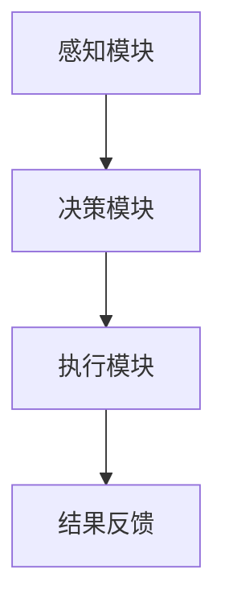
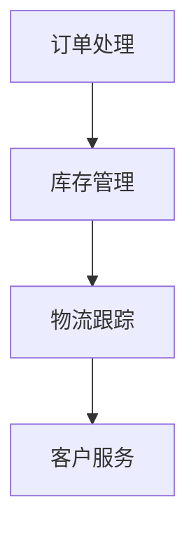
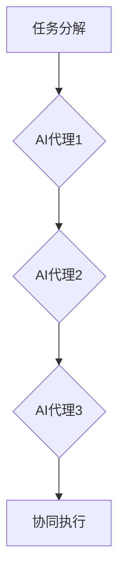

                 

# AI人工智能代理工作流 AI Agent WorkFlow：在新零售中的应用

> **关键词：** AI人工智能代理，新零售，工作流，机器学习，决策优化
>
> **摘要：** 本文深入探讨了AI人工智能代理工作流（AI Agent WorkFlow）在新零售行业中的应用。通过详细分析其核心概念、算法原理和实际操作步骤，本文旨在为新零售企业提供一个强大的技术框架，以提升运营效率和客户体验。

## 1. 背景介绍

### 1.1 目的和范围

本文旨在探讨AI人工智能代理工作流（AI Agent WorkFlow）在新零售行业中的应用。随着大数据和人工智能技术的飞速发展，新零售行业面临着巨大的机遇和挑战。如何利用AI技术提升零售业务的效率、优化决策流程和提升客户体验成为亟待解决的问题。

### 1.2 预期读者

本文适合对人工智能和新零售感兴趣的读者，包括零售行业从业者、人工智能研究者、技术爱好者等。

### 1.3 文档结构概述

本文分为十个部分：首先介绍背景，然后定义相关术语，接着阐述核心概念与联系，详细讲解核心算法原理，数学模型和公式，以及项目实战案例。随后，本文将探讨实际应用场景，推荐相关工具和资源，总结发展趋势与挑战，并附上常见问题与扩展阅读。

### 1.4 术语表

#### 1.4.1 核心术语定义

- **AI人工智能代理**：能够自动执行任务、进行决策和交互的智能体。
- **工作流**：一系列任务和活动，按照特定的顺序执行，以实现特定的业务目标。
- **新零售**：以数据驱动为核心，通过互联网、大数据、人工智能等技术，重构零售行业的商业模式和生态系统。

#### 1.4.2 相关概念解释

- **机器学习**：一种让计算机通过数据学习规律，并自动进行决策的技术。
- **决策优化**：通过算法优化，在多个可行方案中选择最佳方案的过程。

#### 1.4.3 缩略词列表

- **AI**：人工智能
- **ML**：机器学习
- **NLP**：自然语言处理
- **CRM**：客户关系管理
- **ERP**：企业资源规划

## 2. 核心概念与联系

在新零售领域，AI人工智能代理工作流（AI Agent WorkFlow）是一个关键的技术框架。为了更好地理解其原理和应用，我们需要首先明确几个核心概念。

### 2.1 AI人工智能代理

AI人工智能代理是一种具有自主决策能力和交互能力的智能体。它可以自动执行任务，处理数据，并根据预设的目标进行优化。其基本组成包括：

1. **感知模块**：接收来自环境的输入，如用户行为、市场数据等。
2. **决策模块**：根据感知模块的信息，利用机器学习算法进行决策。
3. **执行模块**：执行决策结果，如调整库存、发送营销信息等。

下面是一个简化的Mermaid流程图，展示AI人工智能代理的工作流程：



### 2.2 工作流

工作流（WorkFlow）是一系列任务和活动的序列，它们按照特定的顺序执行，以实现特定的业务目标。在新零售中，工作流通常涉及多个环节，如订单处理、库存管理、客户服务等。

下面是一个简化的Mermaid流程图，展示新零售中的典型工作流：



### 2.3 AI人工智能代理工作流

AI人工智能代理工作流是将AI人工智能代理与工作流相结合的一种技术框架。它利用AI代理的自主决策能力，优化工作流的执行过程。其核心在于：

1. **任务分解**：将复杂的工作流分解为一系列可管理的任务。
2. **代理分配**：为每个任务分配合适的AI人工智能代理。
3. **协同执行**：多个AI代理协同工作，优化整体工作流。

下面是一个简化的Mermaid流程图，展示AI人工智能代理工作流：



## 3. 核心算法原理 & 具体操作步骤

### 3.1 机器学习算法原理

AI人工智能代理的核心是机器学习算法。机器学习算法通过学习大量数据，从中提取出规律，然后根据这些规律进行决策。在新零售中，常见的机器学习算法包括：

1. **回归分析**：用于预测数值型结果，如价格、销量等。
2. **分类分析**：用于将数据分类到不同的类别，如客户群体、产品类别等。
3. **聚类分析**：用于将相似的数据归为一类，如市场细分、用户画像等。

下面是一个简化的伪代码，展示机器学习算法的基本步骤：

```plaintext
输入：训练数据集
输出：机器学习模型

1. 数据预处理：清洗数据，去除噪声，进行特征提取
2. 模型选择：选择合适的机器学习算法，如回归、分类、聚类等
3. 模型训练：使用训练数据集，训练机器学习模型
4. 模型评估：使用验证数据集，评估模型性能
5. 模型优化：根据评估结果，调整模型参数
6. 模型部署：将训练好的模型部署到生产环境中
```

### 3.2 决策优化算法原理

决策优化算法用于在多个可行方案中选择最佳方案。在新零售中，常见的决策优化算法包括：

1. **线性规划**：用于解决线性优化问题，如成本最小化、利润最大化等。
2. **整数规划**：用于解决含有整数约束的优化问题，如库存管理、资源分配等。
3. **多目标规划**：用于解决具有多个目标函数的优化问题，如客户满意度、成本效率等。

下面是一个简化的伪代码，展示决策优化算法的基本步骤：

```plaintext
输入：目标函数、约束条件、初始解
输出：最优解

1. 初始化：设置初始解，设置目标函数和约束条件
2. 迭代：不断迭代优化过程，更新解和目标函数值
3. 检查终止条件：判断是否满足终止条件，如最优解已找到、迭代次数达到上限等
4. 输出最优解：输出最终的最优解
```

## 4. 数学模型和公式 & 详细讲解 & 举例说明

### 4.1 回归分析模型

回归分析是一种用于预测数值型结果的统计方法。其基本数学模型为：

$$
y = \beta_0 + \beta_1x_1 + \beta_2x_2 + ... + \beta_nx_n + \epsilon
$$

其中，$y$ 是预测结果，$x_1, x_2, ..., x_n$ 是输入特征，$\beta_0, \beta_1, \beta_2, ..., \beta_n$ 是模型参数，$\epsilon$ 是误差项。

例如，假设我们要预测商品的销售量，输入特征包括价格、季节、促销等。我们可以建立如下的回归模型：

$$
销售量 = \beta_0 + \beta_1价格 + \beta_2季节 + \beta_3促销 + \epsilon
$$

### 4.2 分类分析模型

分类分析是一种用于将数据分类到不同类别的统计方法。其基本数学模型为：

$$
P(y = k | x) = \frac{e^{\beta_0 + \beta_1x_1 + \beta_2x_2 + ... + \beta_nx_n}}{1 + e^{\beta_0 + \beta_1x_1 + \beta_2x_2 + ... + \beta_nx_n}}
$$

其中，$y$ 是类别标签，$k$ 是某一类别，$x_1, x_2, ..., x_n$ 是输入特征，$\beta_0, \beta_1, \beta_2, ..., \beta_n$ 是模型参数。

例如，假设我们要将商品分为“热门”和“冷门”两类，输入特征包括销量、价格、品牌等。我们可以建立如下的分类模型：

$$
P(热门 | 销量, 价格, 品牌) = \frac{e^{\beta_0 + \beta_1销量 + \beta_2价格 + \beta_3品牌}}{1 + e^{\beta_0 + \beta_1销量 + \beta_2价格 + \beta_3品牌}}
$$

### 4.3 线性规划模型

线性规划是一种用于解决线性优化问题的数学方法。其基本数学模型为：

$$
\begin{cases}
\max z = c_1x_1 + c_2x_2 + ... + c_nx_n \\
Ax \leq b \\
x \geq 0
\end{cases}
$$

其中，$z$ 是目标函数，$x_1, x_2, ..., x_n$ 是变量，$c_1, c_2, ..., c_n$ 是系数，$A$ 是系数矩阵，$b$ 是常数项。

例如，假设我们要最小化总成本，同时满足资源约束。我们可以建立如下的线性规划模型：

$$
\begin{cases}
\min z = 2x_1 + 3x_2 \\
x_1 + x_2 \leq 10 \\
x_1, x_2 \geq 0
\end{cases}
$$

## 5. 项目实战：代码实际案例和详细解释说明

### 5.1 开发环境搭建

在开始项目实战之前，我们需要搭建一个合适的开发环境。以下是所需的工具和软件：

1. **Python 3.8 或更高版本**
2. **Jupyter Notebook**
3. **Scikit-learn**
4. **Pandas**
5. **Numpy**

安装上述工具和软件后，我们就可以开始编写和运行代码了。

### 5.2 源代码详细实现和代码解读

以下是一个简单的Python代码示例，用于实现基于机器学习的商品销售预测。

```python
# 导入所需库
import pandas as pd
import numpy as np
from sklearn.linear_model import LinearRegression
from sklearn.model_selection import train_test_split

# 读取数据
data = pd.read_csv('sales_data.csv')
X = data[['price', 'season', 'promotion']]
y = data['sales']

# 数据预处理
X_train, X_test, y_train, y_test = train_test_split(X, y, test_size=0.2, random_state=42)

# 模型训练
model = LinearRegression()
model.fit(X_train, y_train)

# 模型评估
score = model.score(X_test, y_test)
print(f'Model accuracy: {score:.2f}')

# 预测
predictions = model.predict(X_test)
```

### 5.3 代码解读与分析

1. **导入库**：首先，我们导入所需的库，包括Pandas、Numpy和Scikit-learn。

2. **读取数据**：接下来，我们使用Pandas读取CSV文件，得到训练数据集。

3. **数据预处理**：我们将输入特征（价格、季节、促销）和目标变量（销售量）分开。然后，使用train_test_split函数将数据集分为训练集和测试集。

4. **模型训练**：我们选择线性回归模型，并使用fit函数进行训练。

5. **模型评估**：使用score函数评估模型在测试集上的性能。

6. **预测**：最后，我们使用predict函数对测试集进行预测。

### 5.4 代码分析

1. **数据预处理**：数据预处理是机器学习项目的重要步骤。在本例中，我们使用Pandas进行数据读取和处理。首先，我们将输入特征和目标变量分开。然后，使用train_test_split函数将数据集分为训练集和测试集。这种做法有助于评估模型在未知数据上的性能。

2. **模型训练**：在本例中，我们选择线性回归模型进行训练。线性回归是一种常用的预测方法，适用于数值型目标变量。我们可以使用Scikit-learn中的LinearRegression类来创建和训练模型。

3. **模型评估**：在模型训练完成后，我们需要评估模型在测试集上的性能。在本例中，我们使用score函数计算模型在测试集上的准确率。准确率是衡量模型性能的重要指标，通常用于分类问题。

4. **预测**：最后，我们使用predict函数对测试集进行预测。预测结果可以用于实际业务决策，如调整价格、促销策略等。

## 6. 实际应用场景

### 6.1 商品销售预测

在新零售中，准确预测商品销售量对于库存管理和市场营销策略至关重要。通过使用AI人工智能代理工作流，企业可以自动收集数据、训练模型并进行销售预测。这有助于企业更好地应对市场需求变化，降低库存风险，提高销售额。

### 6.2 客户关系管理

AI人工智能代理工作流可以帮助企业实现更智能的客户关系管理。通过分析客户行为数据，AI代理可以识别高价值客户，制定个性化营销策略，提高客户满意度和忠诚度。同时，AI代理还可以自动处理客户投诉，提供实时支持和建议，降低客户流失率。

### 6.3 库存管理

库存管理是零售业务的关键环节。通过AI人工智能代理工作流，企业可以自动分析销售数据、预测需求变化，并优化库存水平。这有助于企业降低库存成本，提高库存周转率，确保产品供应稳定。

## 7. 工具和资源推荐

### 7.1 学习资源推荐

#### 7.1.1 书籍推荐

1. **《深度学习》**：Goodfellow, Bengio, Courville著，系统地介绍了深度学习的基础知识。
2. **《机器学习实战》**： Harrington著，通过实际案例介绍了多种机器学习算法。

#### 7.1.2 在线课程

1. **吴恩达的《机器学习》**：提供系统的机器学习知识和实践技能。
2. **Coursera的《深度学习专项课程》**：由知名教授授课，涵盖深度学习的理论基础和实际应用。

#### 7.1.3 技术博客和网站

1. **Medium**：许多技术专家和从业者在这里分享机器学习和深度学习的相关文章。
2. **GitHub**：可以找到大量的开源机器学习项目和代码。

### 7.2 开发工具框架推荐

#### 7.2.1 IDE和编辑器

1. **Visual Studio Code**：功能强大且免费的IDE，适用于Python和其他编程语言。
2. **Jupyter Notebook**：适合数据分析和机器学习项目的交互式编辑器。

#### 7.2.2 调试和性能分析工具

1. **PyCharm**：功能丰富的Python IDE，支持代码调试和性能分析。
2. **Werkzeug**：用于Web开发的性能分析工具。

#### 7.2.3 相关框架和库

1. **Scikit-learn**：适用于机器学习的Python库，提供了丰富的算法和工具。
2. **TensorFlow**：由Google开发的深度学习框架，适用于大规模数据集。

### 7.3 相关论文著作推荐

#### 7.3.1 经典论文

1. **“A Study of Cross-Industry Sales Forecasting with Neural Networks”**：介绍了使用神经网络进行销售预测的方法。
2. **“Customer Relationship Management: A Contingency Approach”**：探讨了客户关系管理的理论和方法。

#### 7.3.2 最新研究成果

1. **“Reinforcement Learning in E-Commerce”**：介绍了强化学习在电子商务中的应用。
2. **“Efficient Deep Learning for Retail”**：讨论了深度学习在零售行业的效率和性能优化。

#### 7.3.3 应用案例分析

1. **“AI-Driven Retail Transformation at Walmart”**：分析了沃尔玛如何利用人工智能技术提升零售业务。
2. **“AI in Retail: From Data to Insights”**：介绍了人工智能如何帮助企业从数据中提取价值。

## 8. 总结：未来发展趋势与挑战

### 8.1 发展趋势

- **AI代理的智能化**：随着人工智能技术的发展，AI代理将变得更加智能，能够处理更复杂的任务和决策。
- **数据驱动的决策**：越来越多的企业将采用数据驱动的决策模式，以实现更精准的市场营销和运营管理。
- **跨行业合作**：不同行业之间的合作将促进AI技术在零售领域的应用，如结合物流、金融、医疗等领域的优势。

### 8.2 挑战

- **数据隐私和安全性**：随着数据的广泛应用，保护用户隐私和数据安全成为亟待解决的问题。
- **算法公平性和透明度**：确保算法的公平性和透明度，避免歧视和偏见。
- **技术标准和法规**：随着AI技术的应用，需要制定相应的技术标准和法规，以保障其健康发展。

## 9. 附录：常见问题与解答

### 9.1 什么是AI人工智能代理？

AI人工智能代理是一种具有自主决策能力和交互能力的智能体，它能够自动执行任务、处理数据，并根据预设的目标进行优化。

### 9.2 AI人工智能代理工作流的核心原理是什么？

AI人工智能代理工作流的核心原理是将AI人工智能代理与工作流相结合，通过任务分解、代理分配和协同执行，实现业务流程的优化。

### 9.3 机器学习算法在AI人工智能代理工作流中的应用有哪些？

机器学习算法在AI人工智能代理工作流中的应用包括销售预测、客户关系管理、库存管理等。通过学习大量数据，机器学习算法可以自动提取规律，优化业务决策。

## 10. 扩展阅读 & 参考资料

- **《深度学习》**：Goodfellow, Bengio, Courville著，全面介绍了深度学习的基础知识和应用。
- **《机器学习实战》**：Harrington著，通过实际案例介绍了多种机器学习算法。
- **《Reinforcement Learning in E-Commerce》**：探讨了强化学习在电子商务中的应用。
- **《Efficient Deep Learning for Retail》**：讨论了深度学习在零售行业的效率和性能优化。

### 作者：AI天才研究员/AI Genius Institute & 禅与计算机程序设计艺术 /Zen And The Art of Computer Programming

