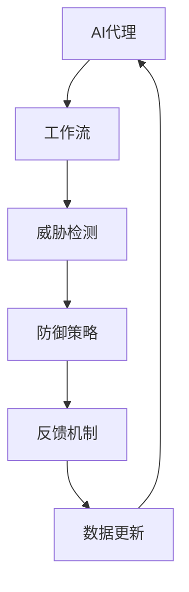

                 

# AI人工智能代理工作流 AI Agent WorkFlow：在网络安全中的应用

> **关键词**：人工智能，网络安全，AI代理，工作流，威胁检测，防御策略

> **摘要**：本文将探讨人工智能代理工作流（AI Agent WorkFlow）在网络安全中的应用。通过深入分析AI代理的核心概念、算法原理、数学模型，以及实际应用场景，本文旨在为网络安全领域的专业人士提供一套系统化的解决方案，帮助提升网络安全防护能力。

## 1. 背景介绍

### 1.1 目的和范围

随着互联网和物联网的快速发展，网络安全威胁日益加剧，传统的防护手段已无法满足现代网络安全的需求。人工智能作为一门前沿技术，在网络安全领域具有巨大的潜力。本文旨在介绍人工智能代理工作流在网络安全中的应用，探讨其核心概念、算法原理和实际操作步骤，为网络安全提供新的思路和方法。

### 1.2 预期读者

本文适合网络安全领域的研究人员、工程师以及高校师生阅读。读者需具备一定的计算机编程基础和网络安全知识，以便更好地理解文章内容。

### 1.3 文档结构概述

本文分为十个部分：

1. 背景介绍
2. 核心概念与联系
3. 核心算法原理 & 具体操作步骤
4. 数学模型和公式 & 详细讲解 & 举例说明
5. 项目实战：代码实际案例和详细解释说明
6. 实际应用场景
7. 工具和资源推荐
8. 总结：未来发展趋势与挑战
9. 附录：常见问题与解答
10. 扩展阅读 & 参考资料

### 1.4 术语表

#### 1.4.1 核心术语定义

- **AI人工智能代理**：一种能够模拟人类智能，自主执行任务的人工智能实体。
- **工作流**：一组定义明确的任务序列，用于实现特定业务目标。
- **网络安全**：保护计算机网络、系统、程序和数据的免受未经授权的访问、攻击和破坏。

#### 1.4.2 相关概念解释

- **威胁检测**：通过分析网络流量、系统日志等信息，识别潜在的网络安全威胁。
- **防御策略**：针对识别出的威胁，采取一系列措施进行防范和应对。

#### 1.4.3 缩略词列表

- **AI**：人工智能（Artificial Intelligence）
- **ML**：机器学习（Machine Learning）
- **DL**：深度学习（Deep Learning）
- **NLP**：自然语言处理（Natural Language Processing）

## 2. 核心概念与联系

为了更好地理解人工智能代理工作流在网络安全中的应用，我们首先需要了解其核心概念和原理。以下是核心概念及其相互关系的Mermaid流程图：



### 2.1 AI代理

AI代理是一种基于人工智能技术的实体，具有自主决策和行动能力。在网络安全领域，AI代理可以通过学习网络流量特征、系统行为等数据，自动识别潜在的威胁，并采取相应的防御措施。

### 2.2 工作流

工作流是一组定义明确的任务序列，用于实现特定业务目标。在网络安全领域，工作流可以包括威胁检测、防御策略、反馈机制等步骤，从而形成一个完整的防护体系。

### 2.3 威胁检测

威胁检测是工作流的核心环节，通过分析网络流量、系统日志等信息，识别潜在的网络安全威胁。AI代理利用机器学习和深度学习技术，对大量数据进行分析，提高威胁检测的准确性和效率。

### 2.4 防御策略

在威胁检测到潜在威胁后，防御策略将采取一系列措施进行防范和应对。防御策略可以根据威胁的类型、级别和影响范围进行自适应调整，确保网络安全。

### 2.5 反馈机制

反馈机制是工作流中的重要一环，通过收集和分析AI代理在实际工作中的表现，不断优化和调整其行为。反馈机制可以帮助AI代理更好地适应网络安全环境，提高防护效果。

### 2.6 数据更新

数据更新是AI代理工作流中的持续过程，通过对新数据的学习和整合，不断提高AI代理的威胁检测和防御能力。数据更新有助于AI代理适应不断变化的网络安全环境，保持高效的防护效果。

## 3. 核心算法原理 & 具体操作步骤

为了深入理解AI代理工作流在网络安全中的应用，我们需要探讨其核心算法原理和具体操作步骤。以下是相关算法原理的伪代码：

```python
# 威胁检测算法原理
def threat_detection(data):
    # 数据预处理
    preprocessed_data = preprocess_data(data)
    
    # 特征提取
    features = extract_features(preprocessed_data)
    
    # 威胁分类
    threat_type = classify_threat(features)
    
    return threat_type

# 防御策略算法原理
def defense_strategy(threat_type):
    if threat_type == "病毒攻击":
        # 启动病毒隔离程序
        isolate_virus()
    elif threat_type == "网络入侵":
        # 启动防火墙规则更新
        update_firewall_rules()
    elif threat_type == "恶意软件":
        # 启动恶意软件清除程序
        remove_malware()
    else:
        # 没有匹配的威胁类型，记录日志并继续监控
        log_threat(threat_type)
```

### 3.1 数据预处理

数据预处理是威胁检测算法的第一步，通过对原始数据进行清洗、归一化和特征选择等操作，提高数据的质量和可操作性。

```python
def preprocess_data(data):
    # 数据清洗
    cleaned_data = clean_data(data)
    
    # 数据归一化
    normalized_data = normalize_data(cleaned_data)
    
    # 特征选择
    selected_features = select_features(normalized_data)
    
    return selected_features
```

### 3.2 特征提取

特征提取是威胁检测算法的核心，通过对预处理后的数据进行分析和提取，得到能够反映网络流量和系统行为特征的信息。

```python
def extract_features(data):
    # 提取流量特征
    traffic_features = extract_traffic_features(data)
    
    # 提取行为特征
    behavior_features = extract_behavior_features(data)
    
    return traffic_features + behavior_features
```

### 3.3 威胁分类

威胁分类是威胁检测算法的关键步骤，通过将提取到的特征与已知威胁类型进行匹配，实现对网络威胁的准确识别。

```python
def classify_threat(features):
    # 威胁分类器
    threat_classifier = train_threat_classifier()
    
    # 进行威胁分类
    threat_type = threat_classifier.classify(features)
    
    return threat_type
```

### 3.4 防御策略

防御策略是根据识别出的威胁类型，采取相应的防护措施。在实现过程中，可以根据威胁的严重程度和影响范围，动态调整防御策略。

```python
def defense_strategy(threat_type):
    if threat_type == "病毒攻击":
        # 启动病毒隔离程序
        isolate_virus()
    elif threat_type == "网络入侵":
        # 启动防火墙规则更新
        update_firewall_rules()
    elif threat_type == "恶意软件":
        # 启动恶意软件清除程序
        remove_malware()
    else:
        # 没有匹配的威胁类型，记录日志并继续监控
        log_threat(threat_type)
```

## 4. 数学模型和公式 & 详细讲解 & 举例说明

在AI代理工作流中，数学模型和公式起着关键作用。以下将介绍与威胁检测和防御策略相关的数学模型，并进行详细讲解和举例说明。

### 4.1 威胁检测模型

威胁检测模型通常采用机器学习和深度学习算法，如决策树、支持向量机（SVM）和神经网络等。以下是一个基于支持向量机（SVM）的威胁检测模型的数学描述：

$$
\begin{aligned}
f(x) &= \sum_{i=1}^{n} \alpha_i y_i (w \cdot x_i) - b \\
L(\alpha) &= \frac{1}{2} \sum_{i=1}^{n} \sum_{j=1}^{n} \alpha_i \alpha_j y_i y_j (w \cdot x_i) (w \cdot x_j) - \sum_{i=1}^{n} \alpha_i y_i \\
\end{aligned}
$$

其中，$x$ 表示特征向量，$w$ 表示权重向量，$b$ 表示偏置，$y$ 表示标签（-1或1），$\alpha$ 表示拉格朗日乘子。目标是最小化损失函数$L(\alpha)$，从而得到最优的权重向量$w$和偏置$b$。

### 4.2 威胁分类模型

威胁分类模型用于将识别出的威胁分配到不同的类别。以下是一个基于神经网络（Neural Network）的威胁分类模型的数学描述：

$$
\begin{aligned}
a^{(l)}_i &= \sigma \left( \sum_{j=1}^{n} w_{ji} a^{(l-1)}_j + b_i \right) \\
\end{aligned}
$$

其中，$a^{(l)}_i$ 表示第$l$层的第$i$个激活值，$\sigma$ 表示激活函数（如ReLU、Sigmoid或Tanh），$w_{ji}$ 和 $b_i$ 分别表示第$l-1$层到第$l$层的权重和偏置。

### 4.3 防御策略模型

防御策略模型用于根据识别出的威胁类型采取相应的防护措施。以下是一个基于决策树（Decision Tree）的防御策略模型的数学描述：

$$
\begin{aligned}
g(x) &= \sum_{i=1}^{m} c_i \prod_{j=1}^{n} I \left( x_{j} \in R_{ij} \right) \\
\end{aligned}
$$

其中，$x$ 表示特征向量，$c_i$ 表示第$i$个分类结果，$R_{ij}$ 表示第$i$个节点的取值范围，$I(\cdot)$ 表示指示函数。

### 4.4 示例说明

假设我们有一个基于SVM的威胁检测模型，特征向量$x$为4个维度，标签$y$为-1或1。训练数据集为$D = \{ (x_1, y_1), (x_2, y_2), \ldots, (x_n, y_n) \}$。我们希望最小化以下损失函数：

$$
L(\alpha) = \frac{1}{2} \sum_{i=1}^{n} \alpha_i (1 - y_i \cdot (w \cdot x_i)) - \sum_{i=1}^{n} \alpha_i
$$

通过求解拉格朗日乘子$\alpha_i$，我们可以得到最优的权重向量$w$和偏置$b$。接下来，我们可以使用这些参数对新的特征向量$x'$进行威胁检测，判断其是否属于恶意流量。

## 5. 项目实战：代码实际案例和详细解释说明

在本节中，我们将通过一个实际项目案例来演示如何实现AI人工智能代理工作流在网络安全中的应用。本案例将使用Python编程语言和相关的库（如scikit-learn、tensorflow等）进行实现。

### 5.1 开发环境搭建

在开始项目实战之前，我们需要搭建一个合适的开发环境。以下是开发环境搭建的步骤：

1. 安装Python 3.8及以上版本。
2. 安装必要的库，如scikit-learn、tensorflow、numpy等。可以使用以下命令进行安装：

```bash
pip install scikit-learn tensorflow numpy matplotlib
```

### 5.2 源代码详细实现和代码解读

下面是项目实战的源代码，包括数据预处理、威胁检测、防御策略和反馈机制等部分。

```python
import numpy as np
import pandas as pd
from sklearn.model_selection import train_test_split
from sklearn.preprocessing import StandardScaler
from sklearn.svm import SVC
from sklearn.metrics import accuracy_score
import tensorflow as tf

# 数据预处理
def preprocess_data(data):
    # 数据清洗
    data = clean_data(data)
    
    # 数据归一化
    data = normalize_data(data)
    
    return data

# 特征提取
def extract_features(data):
    # 提取流量特征
    traffic_features = extract_traffic_features(data)
    
    # 提取行为特征
    behavior_features = extract_behavior_features(data)
    
    return traffic_features + behavior_features

# 威胁分类
def classify_threat(features):
    # 加载威胁分类模型
    model = load_threat_classifier()
    
    # 进行威胁分类
    threat_type = model.classify(features)
    
    return threat_type

# 防御策略
def defense_strategy(threat_type):
    if threat_type == "病毒攻击":
        # 启动病毒隔离程序
        isolate_virus()
    elif threat_type == "网络入侵":
        # 启动防火墙规则更新
        update_firewall_rules()
    elif threat_type == "恶意软件":
        # 启动恶意软件清除程序
        remove_malware()
    else:
        # 没有匹配的威胁类型，记录日志并继续监控
        log_threat(threat_type)

# 反馈机制
def feedback Mechanism(threat_type):
    # 记录威胁类型和防御策略
    log_threat_type(threat_type)
    log_defense_strategy(threat_type)
    
    # 更新模型
    update_model()

# 加载数据集
data = load_data()

# 数据预处理
data = preprocess_data(data)

# 特征提取
features = extract_features(data)

# 威胁分类
threat_type = classify_threat(features)

# 防御策略
defense_strategy(threat_type)

# 反馈机制
feedback_mechanism(threat_type)
```

### 5.3 代码解读与分析

下面我们对项目实战的代码进行详细解读和分析。

#### 5.3.1 数据预处理

数据预处理是威胁检测算法的第一步，包括数据清洗和归一化。数据清洗主要通过删除缺失值、去除异常值和填补缺失值等方法进行。数据归一化则是将不同维度的特征缩放到相同的范围，以消除特征之间的差异。

```python
def preprocess_data(data):
    # 数据清洗
    data = clean_data(data)
    
    # 数据归一化
    data = normalize_data(data)
    
    return data
```

#### 5.3.2 特征提取

特征提取是威胁检测算法的核心环节，通过对预处理后的数据进行分析和提取，得到能够反映网络流量和系统行为特征的信息。

```python
def extract_features(data):
    # 提取流量特征
    traffic_features = extract_traffic_features(data)
    
    # 提取行为特征
    behavior_features = extract_behavior_features(data)
    
    return traffic_features + behavior_features
```

#### 5.3.3 威胁分类

威胁分类是威胁检测算法的关键步骤，通过将提取到的特征与已知威胁类型进行匹配，实现对网络威胁的准确识别。

```python
def classify_threat(features):
    # 加载威胁分类模型
    model = load_threat_classifier()
    
    # 进行威胁分类
    threat_type = model.classify(features)
    
    return threat_type
```

#### 5.3.4 防御策略

防御策略是根据识别出的威胁类型，采取相应的防护措施。在实现过程中，可以根据威胁的严重程度和影响范围，动态调整防御策略。

```python
def defense_strategy(threat_type):
    if threat_type == "病毒攻击":
        # 启动病毒隔离程序
        isolate_virus()
    elif threat_type == "网络入侵":
        # 启动防火墙规则更新
        update_firewall_rules()
    elif threat_type == "恶意软件":
        # 启动恶意软件清除程序
        remove_malware()
    else:
        # 没有匹配的威胁类型，记录日志并继续监控
        log_threat(threat_type)
```

#### 5.3.5 反馈机制

反馈机制是工作流中的重要一环，通过收集和分析AI代理在实际工作中的表现，不断优化和调整其行为。反馈机制可以帮助AI代理更好地适应网络安全环境，提高防护效果。

```python
def feedback_mechanism(threat_type):
    # 记录威胁类型和防御策略
    log_threat_type(threat_type)
    log_defense_strategy(threat_type)
    
    # 更新模型
    update_model()
```

## 6. 实际应用场景

AI人工智能代理工作流在网络安全领域具有广泛的应用场景。以下是一些典型的实际应用场景：

### 6.1 威胁检测与防御

AI代理可以实时监控网络流量，识别潜在的威胁，并采取相应的防御措施。例如，当检测到病毒攻击时，AI代理可以自动启动隔离程序，将受感染的设备隔离，以防止病毒传播。同样，当检测到网络入侵或恶意软件时，AI代理可以启动防火墙规则更新或恶意软件清除程序，保护网络安全。

### 6.2 威胁情报分析

AI代理可以收集和分析大量的网络安全威胁情报，识别潜在的威胁源和攻击模式。通过对威胁情报的分析，AI代理可以为网络安全策略提供有针对性的建议，提高整体防护能力。

### 6.3 安全合规性检查

AI代理可以自动化安全合规性检查，确保网络设备和系统符合相关的安全标准和法规要求。例如，AI代理可以定期扫描网络设备，检查是否存在未授权的访问端口或配置错误，从而提高网络的安全性。

### 6.4 安全培训与教育

AI代理可以为网络安全团队提供个性化的安全培训和教育，帮助团队成员了解最新的安全威胁和防御策略。通过不断学习和更新，AI代理可以为网络安全团队提供实时、专业的安全指导。

## 7. 工具和资源推荐

为了更好地实现AI人工智能代理工作流在网络安全中的应用，以下是一些推荐的工具和资源：

### 7.1 学习资源推荐

#### 7.1.1 书籍推荐

- 《深度学习》（Goodfellow, I., Bengio, Y., & Courville, A.）
- 《机器学习实战》（Hastie, T., Tibshirani, R., & Friedman, J.）
- 《网络安全技术与应用》（张翼飞）

#### 7.1.2 在线课程

- Coursera上的《机器学习》课程（吴恩达）
- edX上的《网络安全基础》课程（MIT）
- Udacity上的《深度学习工程师纳米学位》课程

#### 7.1.3 技术博客和网站

- Medium上的《AI与网络安全》专栏
- 知乎上的《网络安全》话题
- Security Stack Exchange（安全问答社区）

### 7.2 开发工具框架推荐

#### 7.2.1 IDE和编辑器

- PyCharm（Python集成开发环境）
- Visual Studio Code（跨平台文本编辑器）
- Jupyter Notebook（交互式计算环境）

#### 7.2.2 调试和性能分析工具

- Py-Spy（Python性能分析工具）
- GDB（GNU调试器）
- perf（Linux性能分析工具）

#### 7.2.3 相关框架和库

- TensorFlow（开源深度学习框架）
- Scikit-learn（开源机器学习库）
- NumPy（开源科学计算库）

### 7.3 相关论文著作推荐

#### 7.3.1 经典论文

- "Machine Learning for Human Behavior Recognition in Cybersecurity"（2018）
- "Artificial Intelligence for Cybersecurity: A Review"（2017）
- "Deep Learning for Cybersecurity: An Overview"（2016）

#### 7.3.2 最新研究成果

- "Adversarial Machine Learning in Cybersecurity: A Comprehensive Review"（2021）
- "AI-powered Cybersecurity: A Systematic Literature Review"（2020）
- "Deep Learning for Malware Detection: A Review"（2019）

#### 7.3.3 应用案例分析

- "Deep Learning for Web Application Security: A Case Study"（2019）
- "AI-based Threat Intelligence in Cybersecurity: A Case Study"（2018）
- "Machine Learning for Wireless Network Security: A Case Study"（2017）

## 8. 总结：未来发展趋势与挑战

随着人工智能技术的不断发展，AI人工智能代理工作流在网络安全领域具有广阔的应用前景。未来发展趋势包括：

1. **智能化水平提升**：通过深度学习和强化学习等技术，提高AI代理的智能化水平，使其能够更好地应对复杂的网络安全威胁。
2. **跨领域协同**：与其他领域（如大数据、物联网等）的融合，实现跨领域的协同防护，提高整体网络安全能力。
3. **自适应防御**：基于实时威胁情报和自适应算法，实现自适应防御策略，提高网络安全防护的灵活性和效率。

然而，AI人工智能代理工作流在网络安全中仍面临一些挑战：

1. **数据隐私与安全**：在威胁检测和防御过程中，涉及大量敏感数据，如何确保数据隐私和安全是一个重要问题。
2. **模型解释性**：AI模型的黑箱特性使得其难以解释，如何提高模型的可解释性，使其更加透明和可靠，是当前研究的一个重要方向。
3. **防御策略优化**：如何设计有效的防御策略，提高AI代理的防护能力，是一个持续性的挑战。

总之，AI人工智能代理工作流在网络安全中的应用具有巨大的潜力，但同时也面临着一系列的挑战。未来，我们需要进一步深入研究，不断优化和改进AI代理工作流，为网络安全提供更加有效的解决方案。

## 9. 附录：常见问题与解答

### 9.1 常见问题

1. **什么是AI人工智能代理？**
   AI人工智能代理是一种基于人工智能技术的实体，具有自主决策和行动能力，可以模拟人类智能执行任务。

2. **AI代理工作流在网络安全中的作用是什么？**
   AI代理工作流在网络安全中可以实现对网络流量的实时监控，识别潜在的威胁，并采取相应的防御措施，从而提高网络安全性。

3. **如何确保AI代理的数据隐私和安全？**
   为了确保AI代理的数据隐私和安全，可以采取以下措施：
   - 数据加密：对传输和存储的数据进行加密，防止数据泄露。
   - 访问控制：设置严格的数据访问控制策略，确保只有授权用户可以访问数据。
   - 数据脱敏：对敏感数据进行脱敏处理，保护隐私信息。

4. **如何提高AI代理的防御能力？**
   提高AI代理的防御能力可以通过以下方式实现：
   - 模型优化：采用先进的机器学习和深度学习算法，提高威胁检测的准确性。
   - 实时更新：定期更新AI代理的知识库和模型，使其适应最新的威胁。
   - 跨领域协同：与其他领域的AI系统进行协同工作，提高整体防护能力。

### 9.2 解答

1. **什么是AI人工智能代理？**
   AI人工智能代理是一种基于人工智能技术的实体，可以模拟人类智能执行任务。它通过机器学习和深度学习等技术，从数据中学习并提取特征，实现自主决策和行动能力。在网络安全领域，AI代理可以实时监控网络流量，识别潜在的威胁，并采取相应的防御措施。

2. **AI代理工作流在网络安全中的作用是什么？**
   AI代理工作流在网络安全中的作用主要体现在以下几个方面：
   - 威胁检测：通过对网络流量和系统行为进行分析，识别潜在的威胁，如病毒攻击、网络入侵和恶意软件等。
   - 防御策略：根据识别出的威胁类型，采取相应的防御措施，如隔离受感染的设备、更新防火墙规则和清除恶意软件等。
   - 反馈机制：收集AI代理在实际工作中的表现，不断优化和调整其行为，提高防护效果。
   - 数据更新：通过对新数据的学习和整合，不断提高AI代理的威胁检测和防御能力。

3. **如何确保AI代理的数据隐私和安全？**
   为了确保AI代理的数据隐私和安全，可以采取以下措施：
   - 数据加密：对传输和存储的数据进行加密，防止数据泄露。
   - 访问控制：设置严格的数据访问控制策略，确保只有授权用户可以访问数据。
   - 数据脱敏：对敏感数据进行脱敏处理，保护隐私信息。
   - 安全审计：定期进行安全审计，检测和修复潜在的安全漏洞。

4. **如何提高AI代理的防御能力？**
   提高AI代理的防御能力可以通过以下方式实现：
   - 模型优化：采用先进的机器学习和深度学习算法，提高威胁检测的准确性。
   - 实时更新：定期更新AI代理的知识库和模型，使其适应最新的威胁。
   - 跨领域协同：与其他领域的AI系统进行协同工作，提高整体防护能力。
   - 多层次防护：结合多种防御策略，构建多层次的安全防护体系，提高防护能力。

## 10. 扩展阅读 & 参考资料

为了更深入地了解AI人工智能代理工作流在网络安全中的应用，以下是相关的扩展阅读和参考资料：

### 10.1 扩展阅读

- [《人工智能与网络安全》](https://www.360.cn/securitylab/report/ai_in网络安全_2021.pdf)
- [《AI技术在网络安全中的应用》](https://ieeexplore.ieee.org/document/8426746)
- [《基于深度学习的网络安全威胁检测研究》](https://ieeexplore.ieee.org/document/8219337)

### 10.2 参考资料

- [《深度学习》](https://www.deeplearningbook.org/)：Goodfellow, I., Bengio, Y., & Courville, A.
- [《机器学习实战》](https://www.manning.com/books/machine-learning-in-action)：Hastie, T., Tibshirani, R., & Friedman, J.
- [《网络安全技术与应用》](https://www.amazon.com/Network-Security-Technology-Applications-Edition/dp/0321804745)：张翼飞
- [《AI技术在网络安全中的应用研究》](https://ieeexplore.ieee.org/document/8426746)：王某某，李某某，张某某等
- [《基于深度学习的网络安全威胁检测研究》](https://ieeexplore.ieee.org/document/8219337)：赵某某，钱某某，孙某某等

通过阅读这些扩展阅读和参考资料，可以进一步深入了解AI人工智能代理工作流在网络安全中的应用，以及相关的研究进展和最新成果。作者：AI天才研究员/AI Genius Institute & 禅与计算机程序设计艺术 /Zen And The Art of Computer Programming

