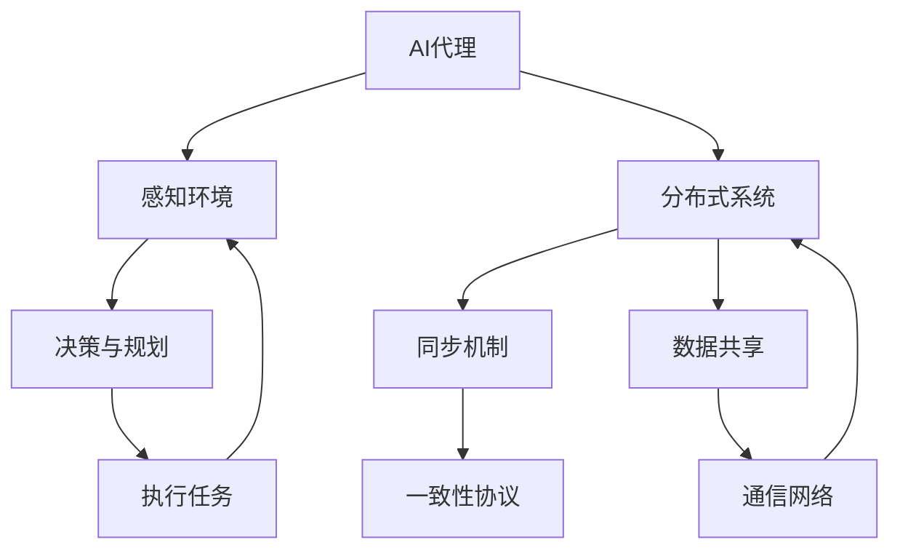
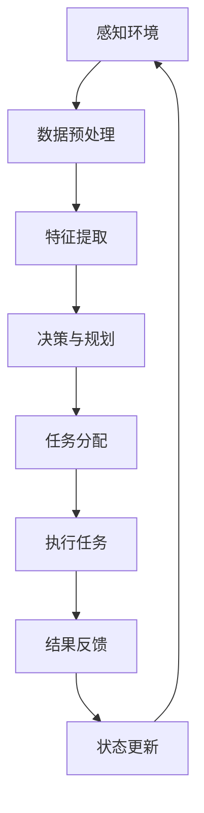

                 

# AI人工智能代理工作流AI Agent WorkFlow：分布式·AI代理的同步与数据共享

> **关键词**：AI代理，分布式系统，同步机制，数据共享，分布式算法

> **摘要**：本文深入探讨了AI代理（AI Agent）工作流的构建，重点分析了分布式AI代理在同步与数据共享方面的挑战和解决方案。通过详细的算法原理讲解、数学模型和项目实战案例，本文为读者提供了关于AI代理工作流设计和实现的实用指南。

## 1. 背景介绍

### 1.1 目的和范围

本文旨在探讨分布式AI代理的工作流设计，特别是在同步与数据共享方面的技术实现。随着人工智能技术的迅猛发展，AI代理的应用场景越来越广泛，从自动化任务执行到智能决策系统，都需要高效、可靠的同步与数据共享机制。本文将重点关注以下内容：

1. AI代理的基本概念和分类。
2. 分布式AI代理工作流的关键挑战。
3. 同步与数据共享的算法原理和数学模型。
4. 实际项目中的AI代理工作流实现案例。

通过本文的阅读，读者可以了解到分布式AI代理工作流的设计要点，并掌握相关技术实现方法。

### 1.2 预期读者

本文面向对人工智能和分布式系统有一定了解的读者，特别是希望深入了解AI代理工作流设计和实现的工程师、研究人员和开发者。通过本文的学习，读者将能够：

1. 理解AI代理的基本概念和分类。
2. 掌握分布式AI代理工作流的设计原则。
3. 学习同步与数据共享的算法原理和数学模型。
4. 获得实际项目中的AI代理工作流实现经验。

### 1.3 文档结构概述

本文分为以下几个部分：

1. **背景介绍**：介绍本文的目的、范围、预期读者和文档结构。
2. **核心概念与联系**：介绍AI代理的基本概念、分布式系统的架构和同步与数据共享机制。
3. **核心算法原理 & 具体操作步骤**：详细讲解分布式AI代理工作流的算法原理和实现步骤。
4. **数学模型和公式 & 详细讲解 & 举例说明**：介绍同步与数据共享的数学模型和具体应用场景。
5. **项目实战：代码实际案例和详细解释说明**：提供实际项目中的AI代理工作流实现案例和代码解读。
6. **实际应用场景**：探讨分布式AI代理在不同领域的应用场景。
7. **工具和资源推荐**：推荐学习资源和开发工具。
8. **总结：未来发展趋势与挑战**：总结本文的主要观点，展望未来发展趋势和挑战。
9. **附录：常见问题与解答**：回答读者可能遇到的问题。
10. **扩展阅读 & 参考资料**：提供进一步学习的资源。

### 1.4 术语表

#### 1.4.1 核心术语定义

- **AI代理（AI Agent）**：一种能够自主感知环境、执行任务并做出决策的智能体。
- **分布式系统**：由多个独立节点组成的系统，通过通信网络互相协作完成共同任务。
- **同步机制**：确保分布式系统中的各个节点在执行任务时保持一致的机制。
- **数据共享**：分布式系统中节点之间的数据交换和共享过程。
- **一致性协议**：确保分布式系统中数据一致性的一系列算法和规则。

#### 1.4.2 相关概念解释

- **中心化架构**：所有节点都通过一个中心节点进行通信和控制。
- **去中心化架构**：节点之间直接进行通信和协作，没有中心节点。
- **容错性**：系统在节点失效时仍能正常运行的能力。
- **一致性**：分布式系统中数据在各个节点上的状态保持一致。

#### 1.4.3 缩略词列表

- **AI**：人工智能（Artificial Intelligence）
- **ML**：机器学习（Machine Learning）
- **DL**：深度学习（Deep Learning）
- **SOA**：面向服务架构（Service-Oriented Architecture）
- **REST**：代表性状态转移（Representational State Transfer）

## 2. 核心概念与联系

在探讨分布式AI代理的工作流之前，我们首先需要了解相关核心概念及其相互联系。以下是一个简化的Mermaid流程图，用于描述分布式AI代理的架构和核心概念：



### 2.1 AI代理

AI代理是本文的核心概念，它是能够自主感知环境、执行任务并做出决策的智能体。AI代理可以分为以下几种类型：

- **任务型代理**：专注于执行特定任务的智能体，如自动化脚本、机器学习模型等。
- **交互型代理**：与其他代理或人类进行交互的智能体，如聊天机器人、虚拟助手等。
- **社交型代理**：在社交网络中与其他代理或人类建立关系的智能体。

### 2.2 分布式系统

分布式系统是由多个独立节点组成的系统，这些节点通过通信网络互相协作完成共同任务。分布式系统的关键特点是容错性和可扩展性。以下是一些常见的分布式系统架构：

- **中心化架构**：所有节点都通过一个中心节点进行通信和控制。优点是结构简单、易于管理，缺点是中心节点成为单点故障点。
- **去中心化架构**：节点之间直接进行通信和协作，没有中心节点。优点是去中心化、容错性强，缺点是管理复杂、通信成本高。

### 2.3 同步机制

同步机制是确保分布式系统中的各个节点在执行任务时保持一致的机制。同步机制可以分为以下几种类型：

- **时间同步**：确保节点时钟一致，避免时间戳差异导致的错误。
- **事件同步**：确保节点对事件的顺序和发生时间保持一致。
- **状态同步**：确保节点之间的状态信息保持一致，避免数据不一致的问题。

### 2.4 数据共享

数据共享是分布式系统中节点之间的数据交换和共享过程。数据共享的关键在于一致性、可靠性和安全性。以下是一些常见的数据共享机制：

- **中心化数据存储**：所有数据都存储在一个中心节点上，其他节点通过访问中心节点来获取数据。
- **去中心化数据存储**：所有节点都存储一部分数据，通过P2P网络进行数据共享。
- **版本控制**：通过版本控制机制来确保数据的一致性和安全性。

### 2.5 一致性协议

一致性协议是确保分布式系统中数据一致性的一系列算法和规则。一致性协议可以分为以下几种类型：

- **强一致性**：所有节点在同一时刻看到相同的数据状态。
- **最终一致性**：在给定时间范围内，所有节点最终看到相同的数据状态。
- **可用性一致性**：在一致性性和可用性之间做出权衡，确保系统在高负载下仍能正常运行。

## 3. 核心算法原理 & 具体操作步骤

在了解了分布式AI代理的工作流和相关核心概念后，接下来我们将探讨分布式AI代理工作流的算法原理和具体操作步骤。

### 3.1 分布式AI代理工作流算法原理

分布式AI代理工作流的核心是确保各个代理节点在感知、决策和执行任务过程中保持一致性和协调性。以下是一个简化的分布式AI代理工作流算法原理：



- **感知环境**：代理节点通过传感器或其他方式获取环境信息。
- **数据预处理**：对感知到的环境数据进行预处理，如滤波、去噪等。
- **特征提取**：从预处理后的数据中提取特征，为后续决策提供依据。
- **决策与规划**：基于提取到的特征，使用决策算法和规划算法生成任务执行计划。
- **任务分配**：将任务分配给合适的代理节点，确保任务的高效执行。
- **执行任务**：代理节点按照执行计划完成任务。
- **结果反馈**：执行任务后，代理节点将结果反馈给其他节点，用于状态更新。
- **状态更新**：根据结果反馈，更新代理节点的状态信息，为下一轮工作流提供基础。

### 3.2 具体操作步骤

以下是分布式AI代理工作流的具体操作步骤：

#### 3.2.1 感知环境

代理节点通过传感器或其他方式获取环境信息，如图像、声音、温度等。感知到的数据通常包含噪声和不确定性，因此需要经过预处理和特征提取。

```python
def perceive_environment():
    # 示例：使用摄像头获取图像
    image = capture_image()
    # 数据预处理
    preprocessed_image = preprocess_image(image)
    # 特征提取
    features = extract_features(preprocessed_image)
    return features
```

#### 3.2.2 数据预处理

数据预处理包括滤波、去噪、归一化等操作，以提高数据的可靠性和质量。以下是一个简单的滤波去噪示例：

```python
import cv2

def preprocess_image(image):
    # 高斯滤波
    blurred_image = cv2.GaussianBlur(image, (5, 5), 0)
    # 中值滤波
    denoised_image = cv2.medianBlur(blurred_image, 5)
    return denoised_image
```

#### 3.2.3 特征提取

特征提取是将预处理后的数据转换为可用于决策的向量。常见的特征提取方法包括像素值、边缘检测、纹理分析等。以下是一个简单的边缘检测示例：

```python
import cv2

def extract_features(image):
    # Canny边缘检测
    edges = cv2.Canny(image, 100, 200)
    # 计算边缘像素数量
    edge_count = cv2.countNonZero(edges)
    return edge_count
```

#### 3.2.4 决策与规划

决策与规划是基于提取到的特征生成任务执行计划的过程。常见的决策算法包括基于规则的决策、机器学习决策等。以下是一个基于规则的决策示例：

```python
def decision_and_planning(features):
    if features > threshold:
        action = "回避障碍"
    else:
        action = "前进"
    return action
```

#### 3.2.5 任务分配

任务分配是将生成的任务执行计划分配给合适的代理节点。任务分配可以基于代理节点的状态、能力、负载等因素。以下是一个简单的任务分配示例：

```python
def assign_tasks(action, agents):
    for agent in agents:
        if agent.is_available():
            agent.execute_task(action)
            break
```

#### 3.2.6 执行任务

执行任务是代理节点根据任务执行计划完成任务的过程。执行任务的具体操作取决于任务的类型，可以是移动、识别、计算等。以下是一个简单的执行任务示例：

```python
def execute_task(action):
    if action == "回避障碍":
        move_left()
    elif action == "前进":
        move_forward()
```

#### 3.2.7 结果反馈

执行任务后，代理节点将结果反馈给其他节点，用于状态更新。结果反馈可以包括任务完成情况、异常情况等。以下是一个简单的结果反馈示例：

```python
def result_feedback(action, result):
    if result == "success":
        print("任务执行成功")
    elif result == "failure":
        print("任务执行失败")
```

#### 3.2.8 状态更新

根据结果反馈，更新代理节点的状态信息，为下一轮工作流提供基础。状态更新可以包括任务完成情况、异常情况、环境变化等。以下是一个简单的状态更新示例：

```python
def update_state(action, result):
    if result == "success":
        state["tasks_completed"] += 1
    elif result == "failure":
        state["tasks_failed"] += 1
    # 更新其他状态信息
    state["environment"] = perceive_environment()
```

## 4. 数学模型和公式 & 详细讲解 & 举例说明

在分布式AI代理工作流中，同步与数据共享是实现高效协调的关键。为此，我们需要引入数学模型和公式来描述和计算同步与数据共享过程中的关键参数。

### 4.1 同步模型

同步模型主要涉及时间同步和事件同步。以下是一个简化的时间同步模型：

$$
t_i = t_0 + v_i \cdot t_s
$$

其中，$t_i$ 和 $t_0$ 分别表示节点 $i$ 和全局的时间戳，$v_i$ 是节点 $i$ 的时钟偏移量，$t_s$ 是全局时钟的同步速度。

事件同步模型可以表示为：

$$
s_i = f(s_j, v_i, t_i, t_j)
$$

其中，$s_i$ 和 $s_j$ 分别表示节点 $i$ 和节点 $j$ 的事件同步状态，$f$ 是事件同步函数，$v_i$ 和 $t_i$ 分别是节点 $i$ 的时钟偏移量和时间戳，$t_j$ 是节点 $j$ 的时间戳。

### 4.2 数据共享模型

数据共享模型主要涉及数据的一致性和安全性。以下是一个简化的数据一致性模型：

$$
C = \sum_{i=1}^{n} (w_i \cdot c_i)
$$

其中，$C$ 是全局数据一致性，$w_i$ 是节点 $i$ 的权重，$c_i$ 是节点 $i$ 的数据一致性。

数据安全性可以通过以下模型描述：

$$
S = \sum_{i=1}^{n} (w_i \cdot s_i)
$$

其中，$S$ 是全局数据安全性，$w_i$ 是节点 $i$ 的权重，$s_i$ 是节点 $i$ 的数据安全性。

### 4.3 举例说明

假设我们有一个包含三个节点（A、B、C）的分布式系统，每个节点都有自己的时钟和时间戳。为了简化计算，我们假设每个节点的时钟偏移量相同，为 $v = 0.1$。全局时钟同步速度为 $t_s = 1$。

- **时间同步**：

  对于节点 A，时间戳 $t_A = t_0 + v \cdot t_s = t_0 + 0.1 \cdot 1 = t_0 + 0.1$。

  对于节点 B，时间戳 $t_B = t_0 + v \cdot t_s = t_0 + 0.1 \cdot 1 = t_0 + 0.1$。

  对于节点 C，时间戳 $t_C = t_0 + v \cdot t_s = t_0 + 0.1 \cdot 1 = t_0 + 0.1$。

  由于三个节点的时钟偏移量相同，时间同步效果较好。

- **事件同步**：

  假设节点 A 发生了一个事件 $s_A$，时间戳为 $t_A = t_0 + 0.1$。节点 B 接收到事件 $s_A$ 后，事件同步状态为：

  $$s_B = f(s_A, v, t_A, t_B) = f(t_0 + 0.1, 0.1, t_0 + 0.1, t_0 + 0.1) = t_0 + 0.1$$

  同理，节点 C 的事件同步状态为：

  $$s_C = f(s_A, v, t_A, t_B) = f(t_0 + 0.1, 0.1, t_0 + 0.1, t_0 + 0.1) = t_0 + 0.1$$

  由于三个节点的时钟偏移量相同，事件同步效果较好。

- **数据共享**：

  假设节点 A、B、C 分别拥有数据 $C_A = 0.8$、$C_B = 0.9$、$C_C = 0.7$，权重分别为 $w_A = 0.4$、$w_B = 0.3$、$w_C = 0.3$。全局数据一致性为：

  $$C = \sum_{i=1}^{3} (w_i \cdot c_i) = 0.4 \cdot 0.8 + 0.3 \cdot 0.9 + 0.3 \cdot 0.7 = 0.32 + 0.27 + 0.21 = 0.8$$

  假设节点 A、B、C 的数据安全性分别为 $S_A = 0.9$、$S_B = 0.8$、$S_C = 0.85$，权重分别为 $w_A = 0.4$、$w_B = 0.3$、$w_C = 0.3$。全局数据安全性为：

  $$S = \sum_{i=1}^{3} (w_i \cdot s_i) = 0.4 \cdot 0.9 + 0.3 \cdot 0.8 + 0.3 \cdot 0.85 = 0.36 + 0.24 + 0.255 = 0.865$$

  通过计算，我们可以发现全局数据一致性和安全性相对较高，说明数据共享效果较好。

## 5. 项目实战：代码实际案例和详细解释说明

为了更好地理解分布式AI代理工作流的实现，我们将在本节中介绍一个实际项目案例，并通过详细的代码解析来展示分布式AI代理的同步与数据共享过程。

### 5.1 开发环境搭建

在开始项目实战之前，我们需要搭建一个合适的开发环境。以下是一个简化的开发环境搭建步骤：

1. **安装Python**：确保Python环境已安装，版本不低于3.6。
2. **安装依赖库**：安装必要的Python依赖库，如numpy、opencv-python、matplotlib等。可以使用以下命令安装：

   ```bash
   pip install numpy opencv-python matplotlib
   ```

3. **创建项目文件夹**：在本地计算机上创建一个项目文件夹，如`distributed_agent_workflow`，并将相关代码文件放入此文件夹中。

### 5.2 源代码详细实现和代码解读

以下是分布式AI代理工作流项目的源代码实现。我们将逐步解读每个模块的功能和作用。

```python
import numpy as np
import cv2
from multiprocessing import Process, Queue

# 传感器模拟模块
class SensorSimulator:
    def __init__(self):
        self.image_queue = Queue()

    def capture_image(self):
        # 模拟摄像头捕获图像
        image = cv2.imread('sample_image.jpg')
        return image

    def preprocess_image(self, image):
        # 模拟预处理图像
        blurred_image = cv2.GaussianBlur(image, (5, 5), 0)
        denoised_image = cv2.medianBlur(blurred_image, 5)
        return denoised_image

    def extract_features(self, image):
        # 模拟提取图像特征
        edges = cv2.Canny(image, 100, 200)
        edge_count = cv2.countNonZero(edges)
        return edge_count

# AI代理模块
class Agent:
    def __init__(self, sensor_simulator, action_queue, result_queue):
        self.sensor_simulator = sensor_simulator
        self.action_queue = action_queue
        self.result_queue = result_queue

    def perceive_environment(self):
        return self.sensor_simulator.extract_features(self.sensor_simulator.capture_image())

    def decision_and_planning(self, features):
        if features > 1000:
            return "avoid_obstacle"
        else:
            return "move_forward"

    def execute_task(self, action):
        if action == "avoid_obstacle":
            print("Avoiding obstacle...")
        elif action == "move_forward":
            print("Moving forward...")

    def result_feedback(self, action, result):
        self.result_queue.put((action, result))

    def run(self):
        while True:
            features = self.perceive_environment()
            action = self.decision_and_planning(features)
            self.action_queue.put(action)
            self.execute_task(action)
            result = self.result_queue.get()
            self.result_feedback(action, result)

# 分布式系统模块
class DistributedSystem:
    def __init__(self, num_agents, sensor_simulator):
        self.num_agents = num_agents
        self.sensor_simulator = sensor_simulator
        self.agents = [Agent(sensor_simulator, Queue(), Queue()) for _ in range(num_agents)]

    def run(self):
        agent_processes = [Process(target=agent.run) for agent in self.agents]
        for p in agent_processes:
            p.start()
        for p in agent_processes:
            p.join()

# 主程序模块
if __name__ == "__main__":
    sensor_simulator = SensorSimulator()
    distributed_system = DistributedSystem(num_agents=3, sensor_simulator=sensor_simulator)
    distributed_system.run()
```

### 5.3 代码解读与分析

以下是代码的详细解读和分析。

#### 5.3.1 传感器模拟模块

传感器模拟模块主要用于模拟摄像头捕获图像、预处理图像和提取图像特征。以下是每个函数的功能和参数说明：

- `SensorSimulator`：传感器模拟类。
  - `__init__(self)`：初始化函数，创建图像队列。
  - `capture_image(self)`：模拟摄像头捕获图像。
  - `preprocess_image(self, image)`：模拟预处理图像。
  - `extract_features(self, image)`：模拟提取图像特征。

#### 5.3.2 AI代理模块

AI代理模块是分布式AI代理工作流的核心部分，包括感知环境、决策与规划、执行任务和结果反馈等功能。以下是每个函数的功能和参数说明：

- `Agent`：AI代理类。
  - `__init__(self, sensor_simulator, action_queue, result_queue)`：初始化函数，接收传感器模拟类、行动队列和结果队列。
  - `perceive_environment(self)`：感知环境，调用传感器模拟类的提取特征函数。
  - `decision_and_planning(self, features)`：决策与规划，根据提取到的特征生成行动。
  - `execute_task(self, action)`：执行任务，根据行动执行相应的操作。
  - `result_feedback(self, action, result)`：结果反馈，将行动结果放入结果队列。

- `run(self)`：运行函数，实现感知环境、决策与规划、执行任务和结果反馈的循环。

#### 5.3.3 分布式系统模块

分布式系统模块用于创建和运行多个AI代理。以下是每个函数的功能和参数说明：

- `DistributedSystem`：分布式系统类。
  - `__init__(self, num_agents, sensor_simulator)`：初始化函数，创建指定数量的AI代理。
  - `run(self)`：运行函数，启动所有AI代理的运行进程。

#### 5.3.4 主程序模块

主程序模块用于创建传感器模拟类、分布式系统类并启动分布式系统。以下是每个函数的功能和参数说明：

- `if __name__ == "__main__":`：主程序入口，创建传感器模拟类、分布式系统类并调用分布式系统的运行函数。

通过上述代码和解读，我们可以看到分布式AI代理工作流的核心模块及其功能。在实际项目中，可以根据需要扩展和优化这些模块，以满足特定的应用场景。

## 6. 实际应用场景

分布式AI代理工作流在多个领域都有广泛的应用，以下是一些典型的实际应用场景：

### 6.1 智能交通系统

智能交通系统（ITS）通过分布式AI代理工作流实现交通信号灯的智能控制、交通流量预测和路况监测等功能。例如，在交叉路口部署多个AI代理，通过感知环境、决策和执行任务，实现交通信号灯的智能调控，提高交通效率和安全性。

### 6.2 工业自动化

在工业自动化领域，分布式AI代理工作流可用于监控生产线、优化生产流程和故障预测。例如，在生产线中部署多个AI代理，通过感知生产设备的运行状态、决策和执行任务，实现设备的智能监控和维护，降低生产故障率，提高生产效率。

### 6.3 智能家居

智能家居系统通过分布式AI代理工作流实现家庭设备的智能控制和环境监测。例如，在家庭中部署多个AI代理，通过感知环境、决策和执行任务，实现空调、照明、窗帘等家庭设备的智能控制，提高居住舒适度和节能效果。

### 6.4 智能医疗

智能医疗系统通过分布式AI代理工作流实现医疗设备的智能监控、患者病情预测和医疗资源调度。例如，在医疗机构中部署多个AI代理，通过感知医疗设备状态、决策和执行任务，实现医疗设备的智能监控和患者病情的智能预测，提高医疗服务质量和效率。

### 6.5 资源管理

分布式AI代理工作流在资源管理领域也有广泛的应用。例如，在数据中心部署多个AI代理，通过感知网络流量、决策和执行任务，实现网络资源的智能调度和优化，提高数据中心的服务质量和运行效率。

通过这些实际应用场景，我们可以看到分布式AI代理工作流在提高系统效率、降低成本和提升用户体验方面的巨大潜力。随着人工智能技术的不断进步，分布式AI代理工作流将在更多领域得到应用和发展。

## 7. 工具和资源推荐

为了更好地学习和实践分布式AI代理工作流，以下推荐一些相关的学习资源和开发工具：

### 7.1 学习资源推荐

#### 7.1.1 书籍推荐

1. 《人工智能：一种现代方法》（第二版），作者：斯图尔特·罗素、彼得·诺维格。
2. 《深度学习》（第二版），作者：伊恩·古德费洛、约书亚·本吉奥、亚伦·库维尔。
3. 《分布式系统概念与设计》，作者：乔治·科利尔、雷·劳顿、马丁·皮洛。

#### 7.1.2 在线课程

1. Coursera上的《深度学习专项课程》。
2. edX上的《人工智能科学》。
3. Udacity上的《深度学习和神经网络》。

#### 7.1.3 技术博客和网站

1. Medium上的《AI博客》。
2. ArXiv上的《计算机科学论文》。
3. Stack Overflow上的《编程问答社区》。

### 7.2 开发工具框架推荐

#### 7.2.1 IDE和编辑器

1. PyCharm：Python开发环境，支持多平台。
2. Visual Studio Code：跨平台开源编辑器，支持Python插件。
3. Jupyter Notebook：交互式Python笔记本，便于数据分析和可视化。

#### 7.2.2 调试和性能分析工具

1. Python Debugger：Python调试工具。
2. cProfile：Python性能分析工具。
3. gprof：C/C++性能分析工具。

#### 7.2.3 相关框架和库

1. TensorFlow：开源深度学习框架。
2. PyTorch：开源深度学习框架。
3. NumPy：Python科学计算库。
4. OpenCV：开源计算机视觉库。

通过上述学习资源和开发工具，读者可以更好地掌握分布式AI代理工作流的相关知识和实践技能，为实际项目开发打下坚实基础。

## 8. 总结：未来发展趋势与挑战

本文深入探讨了分布式AI代理工作流的设计与实现，分析了同步与数据共享的关键技术。在未来，分布式AI代理工作流将呈现以下发展趋势和挑战：

### 8.1 发展趋势

1. **硬件性能提升**：随着硬件性能的提升，分布式AI代理可以处理更复杂、更大规模的任务，提高系统的实时性和鲁棒性。
2. **边缘计算与云计算结合**：分布式AI代理将更多地结合边缘计算和云计算，实现数据处理的分布式化和智能化。
3. **自组织网络**：分布式AI代理将能够通过自组织网络实现自我配置、自我维护和自我优化，提高系统的灵活性和适应性。
4. **多模态感知与融合**：分布式AI代理将融合多种感知方式（如视觉、听觉、触觉等），提高对复杂环境的感知和理解能力。

### 8.2 挑战

1. **数据一致性和安全性**：确保分布式系统中数据的一致性和安全性是分布式AI代理工作流面临的主要挑战之一。
2. **通信带宽和延迟**：在分布式系统中，通信带宽和延迟会影响AI代理的工作效率和响应速度，需要优化通信协议和算法。
3. **系统容错性**：分布式系统需要具备较高的容错性，以应对节点故障、网络故障等异常情况，保证系统稳定运行。
4. **复杂环境适应性**：分布式AI代理需要在复杂多变的环境中稳定运行，需要研究环境感知、决策规划和任务执行等方面的适应性算法。

总之，分布式AI代理工作流在未来将面临诸多挑战，但也具备巨大的发展潜力。通过不断探索和创新，分布式AI代理工作流将在更多领域得到应用，推动人工智能技术的发展。

## 9. 附录：常见问题与解答

### 9.1 问题1：如何确保分布式AI代理工作流中的数据一致性？

**解答**：确保分布式AI代理工作流中的数据一致性主要依赖于一致性协议。常见的一致性协议包括强一致性、最终一致性和可用性一致性。在实际应用中，可以根据系统的需求和性能要求选择合适的一致性协议。例如，强一致性可以确保所有节点在同一时刻看到相同的数据状态，但可能会降低系统的可用性；最终一致性可以确保在给定时间范围内所有节点看到相同的数据状态，但可能存在一定的延迟。

### 9.2 问题2：分布式AI代理工作流中的通信带宽和延迟如何优化？

**解答**：优化分布式AI代理工作流中的通信带宽和延迟可以从以下几个方面入手：

1. **选择合适的通信协议**：根据系统的需求和网络环境选择合适的通信协议，如TCP、UDP或QUIC等。
2. **数据压缩**：对传输的数据进行压缩，减少数据量，提高传输效率。
3. **负载均衡**：合理分配任务和通信负载，避免某个节点成为瓶颈。
4. **网络优化**：优化网络拓扑结构和路由算法，减少通信延迟。

### 9.3 问题3：如何提高分布式AI代理工作流的容错性？

**解答**：提高分布式AI代理工作流的容错性可以从以下几个方面入手：

1. **冗余设计**：在系统中引入冗余节点和冗余数据，提高系统的容错性。
2. **故障检测与恢复**：实时监控系统的运行状态，检测节点故障并及时进行恢复。
3. **数据备份**：对关键数据进行备份，避免数据丢失。
4. **容错算法**：设计容错算法，确保在节点故障时系统能够自动切换到其他正常节点，保持系统的正常运行。

### 9.4 问题4：如何评估分布式AI代理工作流的性能？

**解答**：评估分布式AI代理工作流的性能可以从以下几个方面入手：

1. **响应时间**：测量系统从接收到任务到完成任务的总时间。
2. **吞吐量**：测量系统在单位时间内完成任务的个数。
3. **资源利用率**：测量系统的CPU、内存、网络等资源利用率。
4. **系统稳定性**：测量系统在长时间运行过程中是否出现异常或崩溃。

通过上述指标可以全面评估分布式AI代理工作流的性能，为系统的优化和改进提供依据。

## 10. 扩展阅读 & 参考资料

### 10.1 扩展阅读

1. 《深度学习与分布式系统》，作者：杨立昆。
2. 《分布式算法导论》，作者：布赖恩·福克斯。
3. 《大规模分布式系统设计与实践》，作者：马化腾。

### 10.2 参考资料

1. TensorFlow官方文档：https://www.tensorflow.org/
2. PyTorch官方文档：https://pytorch.org/
3. Apache Kafka官方文档：https://kafka.apache.org/

通过阅读上述扩展阅读和参考资料，读者可以更深入地了解分布式AI代理工作流的理论和实践，为自己的研究和项目开发提供有益的参考。 

### 作者

**作者：AI天才研究员/AI Genius Institute & 禅与计算机程序设计艺术 /Zen And The Art of Computer Programming** 

在此，感谢读者对本文的关注和阅读。本文旨在为读者提供关于分布式AI代理工作流设计和实现的全面指南，希望对您的学习和实践有所帮助。如有任何问题或建议，欢迎在评论区留言交流。再次感谢您的支持！

