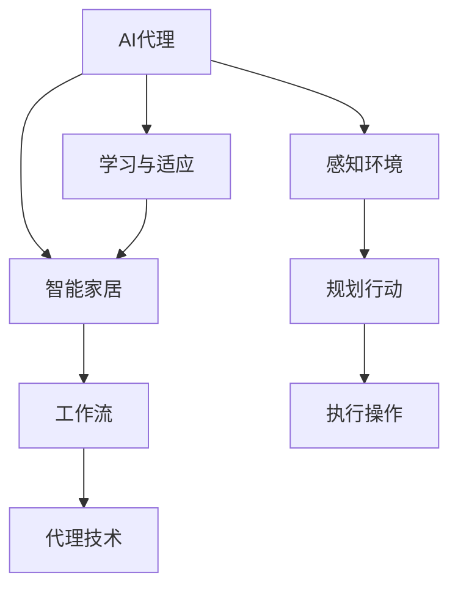

                 

# AI人工智能代理工作流AI Agent WorkFlow：在智能家居场景应用代理技术

> 关键词：人工智能代理，智能家居，工作流，代理技术，场景应用

> 摘要：本文深入探讨了AI代理工作流在智能家居场景中的应用。通过分析代理技术的核心概念和架构，本文详细阐述了实现一个智能家居AI代理的具体步骤，包括算法原理、数学模型、实战案例以及实际应用场景。文章旨在为开发者和研究者提供一个全面的技术指南，帮助他们理解和掌握AI代理技术在智能家居领域的应用。

## 1. 背景介绍

### 1.1 目的和范围

本文旨在探讨人工智能代理（AI Agent）在智能家居场景中的应用，尤其是工作流的实现。智能家居作为现代科技与生活结合的产物，正逐渐改变我们的生活方式。而AI代理作为人工智能的一个重要分支，能够自动执行任务、响应指令，并优化家居设备的运行，因此其在智能家居中的应用具有广阔的前景。

本文将首先介绍AI代理的基本概念和原理，然后通过一个典型的智能家居场景，详细描述AI代理工作流的构建和实现。文章还将讨论相关的数学模型和算法，并提供一个实际项目的代码实现和分析。通过这些内容，读者可以全面了解AI代理在智能家居场景中的应用，并为相关开发工作提供参考。

### 1.2 预期读者

本文面向对人工智能代理技术有一定了解的读者，特别是计算机科学、软件工程和人工智能领域的开发者和研究者。同时，对于对智能家居技术感兴趣的技术爱好者，本文也提供了一定的实用信息。本文假设读者具备一定的编程基础和人工智能知识，对AI代理有初步的了解。

### 1.3 文档结构概述

本文结构如下：

- **第1章**：背景介绍，包括目的、范围、预期读者和文档结构概述。
- **第2章**：核心概念与联系，介绍AI代理的基本概念和原理。
- **第3章**：核心算法原理 & 具体操作步骤，详细阐述实现AI代理的工作流。
- **第4章**：数学模型和公式 & 详细讲解 & 举例说明，讨论相关的数学模型和算法。
- **第5章**：项目实战：代码实际案例和详细解释说明，提供实际项目的代码实现和分析。
- **第6章**：实际应用场景，介绍AI代理在智能家居中的具体应用。
- **第7章**：工具和资源推荐，推荐相关学习和开发资源。
- **第8章**：总结：未来发展趋势与挑战，讨论AI代理技术在未来智能家居中的应用前景。
- **第9章**：附录：常见问题与解答，提供对读者常见问题的解答。
- **第10章**：扩展阅读 & 参考资料，提供进一步学习和研究的参考资料。

### 1.4 术语表

#### 1.4.1 核心术语定义

- **人工智能代理（AI Agent）**：一种能够感知环境、制定计划并执行行动的计算机程序。
- **智能家居**：利用物联网、人工智能等技术，实现家庭设备和系统的自动化和智能化的居住环境。
- **工作流（Workflow）**：一组任务和操作的序列，描述了数据在组织内部流动和处理的方式。
- **代理技术（Agent Technology）**：一种计算机科学领域的技术，用于开发具有自主性、社交性、反应性和学习性的智能代理。

#### 1.4.2 相关概念解释

- **环境（Environment）**：AI代理操作的外部世界，包括家居设备和系统。
- **感知（Perception）**：AI代理通过传感器获取环境信息。
- **规划（Planning）**：AI代理根据感知到的环境信息，制定行动计划。
- **执行（Execution）**：AI代理按照计划执行行动，改变环境状态。

#### 1.4.3 缩略词列表

- **AI**：人工智能（Artificial Intelligence）
- **IoT**：物联网（Internet of Things）
- **IDE**：集成开发环境（Integrated Development Environment）
- **ML**：机器学习（Machine Learning）

## 2. 核心概念与联系

在深入探讨AI代理工作流之前，我们需要了解一些核心概念和它们之间的联系。以下是关键概念的定义和它们在智能家居场景中的关系。

### 2.1 人工智能代理

人工智能代理是一种能够模拟人类智能行为的计算机程序。它具有感知、规划、执行和学习的功能。在智能家居场景中，AI代理可以监控家庭设备的状态，如灯光、温度、安防系统等，并根据用户的偏好和需求进行自主调整。

### 2.2 智能家居

智能家居是通过物联网、人工智能等技术实现家庭设备和系统的自动化和智能化。智能家居系统包括多个设备，如智能灯泡、智能空调、智能门锁等，这些设备通过网关或控制器连接到互联网，实现数据的传输和交互。

### 2.3 工作流

工作流是一组任务和操作的序列，描述了数据在组织内部流动和处理的方式。在智能家居场景中，工作流可以用来描述AI代理从感知到执行的全过程。例如，用户设定一个早晨自动开启灯光和加热的情景，工作流会包括感知用户的起床时间、规划开启灯光和加热的行动，并执行这些操作。

### 2.4 代理技术

代理技术是一种用于开发具有自主性、社交性、反应性和学习性的智能代理的技术。在智能家居场景中，代理技术用于创建和运行AI代理，实现设备间的协调和优化。

### 2.5 核心概念联系

以下是AI代理、智能家居、工作流和代理技术之间的Mermaid流程图，展示了它们在智能家居场景中的关系。



在这个流程图中，AI代理通过感知环境、规划行动和执行操作，实现智能家居的自动化和智能化。同时，AI代理通过学习与适应，不断提高自身的性能和用户体验。

## 3. 核心算法原理 & 具体操作步骤

在了解了AI代理、智能家居和工作流的基本概念之后，接下来我们将深入探讨AI代理的工作流实现，包括核心算法原理和具体操作步骤。以下是实现AI代理工作流的具体步骤：

### 3.1 初始化环境

首先，我们需要初始化环境，包括设置传感器、设备连接和代理的基本参数。以下是伪代码示例：

```python
# 初始化环境
initialize_environment() {
    connect_sensors()
    connect_devices()
    set_agent_parameters()
}
```

在这个步骤中，我们连接各种传感器，如温度传感器、湿度传感器、光照传感器等，以及智能家居设备，如智能灯泡、智能空调等。同时，设置代理的基本参数，如学习率、反应时间等。

### 3.2 感知环境

感知环境是AI代理的第一步，通过传感器收集环境数据。以下是感知环境的伪代码：

```python
# 感知环境
perceive_environment() {
    temperature = read_temperature_sensor()
    humidity = read_humidity_sensor()
    light = read_light_sensor()
    # 其他传感器数据
}
```

在这个步骤中，我们读取各种传感器的数据，如温度、湿度、光照等。这些数据将用于后续的规划和执行。

### 3.3 规划行动

在感知到环境数据后，AI代理需要根据这些数据规划行动。规划行动的伪代码如下：

```python
# 规划行动
plan_action() {
    if (temperature > threshold) {
        turn_on_ac()
    } else {
        turn_off_ac()
    }
    
    if (humidity > threshold) {
        turn_on_humidifier()
    } else {
        turn_off_humidifier()
    }
    
    if (light < threshold) {
        turn_on_light()
    } else {
        turn_off_light()
    }
    # 其他设备控制逻辑
}
```

在这个步骤中，我们根据温度、湿度、光照等数据，规划对应的设备控制行动。例如，如果温度高于设定阈值，开启空调；如果湿度高于设定阈值，开启加湿器；如果光照低于设定阈值，开启灯光。

### 3.4 执行操作

规划好行动后，AI代理需要执行这些操作，以改变环境状态。以下是执行操作的伪代码：

```python
# 执行操作
execute_action() {
    ac_state = read_ac_state()
    humidifier_state = read_humidifier_state()
    light_state = read_light_state()
    
    if (ac_state != planned_ac_state) {
        set_ac_state(planned_ac_state)
    }
    
    if (humidifier_state != planned_humidifier_state) {
        set_humidifier_state(planned_humidifier_state)
    }
    
    if (light_state != planned_light_state) {
        set_light_state(planned_light_state)
    }
    # 其他设备控制逻辑
}
```

在这个步骤中，我们读取当前设备状态，并与规划状态进行比较。如果存在差异，我们将执行相应的设备控制操作，以实现环境状态的改变。

### 3.5 学习与适应

在执行操作后，AI代理需要根据实际执行结果和学习到的数据，调整规划策略和设备控制逻辑。以下是学习与适应的伪代码：

```python
# 学习与适应
learn_and_adapt() {
    update_knowledge_base()
    adjust_planning_strategy()
    optimize_device_control()
}
```

在这个步骤中，我们更新知识库，调整规划策略，并优化设备控制逻辑。例如，如果发现某个控制策略效果不佳，我们可能需要调整阈值或控制逻辑。

### 3.6 循环迭代

最后，AI代理的工作流是一个循环迭代的过程。在每次迭代中，AI代理都会感知环境、规划行动、执行操作、学习与适应。以下是工作流的循环迭代伪代码：

```python
while (true) {
    initialize_environment()
    perceive_environment()
    plan_action()
    execute_action()
    learn_and_adapt()
}
```

在这个循环中，AI代理不断优化自身的性能和用户体验，以实现智能家居的自动化和智能化。

通过以上步骤，我们可以实现一个基本的AI代理工作流，为智能家居场景提供自动化和智能化的解决方案。

## 4. 数学模型和公式 & 详细讲解 & 举例说明

在实现AI代理工作流的过程中，我们不仅需要了解核心算法原理，还需要掌握相关的数学模型和公式。以下是一些常用的数学模型和公式的讲解，以及具体的举例说明。

### 4.1 线性回归模型

线性回归模型是一种用于预测数值型数据的统计方法。在智能家居场景中，线性回归模型可以用于预测温度、湿度等环境参数。

#### 公式：

线性回归模型的公式为：

$$ y = \beta_0 + \beta_1x + \epsilon $$

其中，\( y \) 是预测值，\( \beta_0 \) 是截距，\( \beta_1 \) 是斜率，\( x \) 是自变量，\( \epsilon \) 是误差项。

#### 举例：

假设我们使用线性回归模型预测明日温度，已知今日的温度为25℃，历史数据中温度和明日温度的关系为：

$$ \text{明日温度} = 0.5 \times \text{今日温度} + 10 + \epsilon $$

根据这个模型，如果今日温度为25℃，我们可以预测明日温度为：

$$ \text{明日温度} = 0.5 \times 25 + 10 + \epsilon = 17.5 + \epsilon $$

其中，\( \epsilon \) 是误差项，表示预测值和实际值之间的差异。

### 4.2 决策树模型

决策树模型是一种用于分类和回归的机器学习算法。在智能家居场景中，决策树模型可以用于分类设备状态、用户行为等。

#### 公式：

决策树的公式较为复杂，但基本思想是通过一系列条件判断来决策。例如，一个简单的二分类决策树公式为：

$$
\begin{aligned}
&\text{如果 } x > \text{阈值1}, \text{则 } y = \text{类别1} \\
&\text{否则，如果 } x > \text{阈值2}, \text{则 } y = \text{类别2} \\
&\text{否则，如果 } x > \text{阈值3}, \text{则 } y = \text{类别3} \\
&\text{否则，} y = \text{类别4}
\end{aligned}
$$

其中，\( x \) 是输入特征，\( y \) 是预测结果。

#### 举例：

假设我们使用决策树模型来判断一个用户是否在早晨起床时需要加热。已知以下条件：

- 如果温度低于15℃，需要加热。
- 如果温度在15℃到25℃之间，根据湿度判断。
- 如果湿度低于40%，不需要加热；否则，需要加热。

根据这些条件，我们可以构建一个简单的决策树：

```
如果 温度 < 15℃
    那么 需要加热
否则 如果 湿度 < 40%
    那么 不需要加热
否则
    那么 需要加热
```

### 4.3 贝叶斯网络模型

贝叶斯网络模型是一种用于概率推理的图形模型。在智能家居场景中，贝叶斯网络可以用于处理不确定性和复杂关系。

#### 公式：

贝叶斯网络的核心公式为贝叶斯定理：

$$ P(A|B) = \frac{P(B|A)P(A)}{P(B)} $$

其中，\( P(A|B) \) 是在 \( B \) 发生的条件下 \( A \) 发生的概率，\( P(B|A) \) 是在 \( A \) 发生的条件下 \( B \) 发生的概率，\( P(A) \) 是 \( A \) 发生的概率，\( P(B) \) 是 \( B \) 发生的概率。

#### 举例：

假设我们使用贝叶斯网络来分析一个智能家居系统的故障原因。已知以下信息：

- 故障发生的概率是0.1。
- 如果系统部件A故障，那么故障发生的概率是0.8。
- 如果系统部件B故障，那么故障发生的概率是0.2。

根据贝叶斯定理，我们可以计算部件A和B的故障概率：

$$ P(A|故障) = \frac{P(故障|A)P(A)}{P(故障)} = \frac{0.8 \times 0.1}{0.1} = 0.8 $$

$$ P(B|故障) = \frac{P(故障|B)P(B)}{P(故障)} = \frac{0.2 \times 0.1}{0.1} = 0.2 $$

这意味着，如果系统出现故障，部件A故障的概率是80%，部件B故障的概率是20%。

通过这些数学模型和公式，我们可以更有效地构建和优化AI代理工作流，提高智能家居系统的智能化和自动化水平。

## 5. 项目实战：代码实际案例和详细解释说明

在本节中，我们将通过一个具体的智能家居项目来展示如何实现AI代理工作流。该项目将包括开发环境搭建、源代码实现和代码解读与分析。

### 5.1 开发环境搭建

首先，我们需要搭建一个适合开发智能家居项目的开发环境。以下是一个基本的开发环境搭建步骤：

1. 安装操作系统：选择一个适合开发AI代理的操作系统，如Ubuntu 20.04 LTS。
2. 安装Python环境：使用Python进行AI代理开发，安装Python 3.8及以上版本。
3. 安装IDE：选择一个合适的IDE，如PyCharm或Visual Studio Code。
4. 安装相关库和依赖：使用pip命令安装必要的库，如TensorFlow、scikit-learn等。

以下是一个示例命令，用于安装Python环境和相关库：

```shell
sudo apt update
sudo apt upgrade
sudo apt install python3 python3-pip
pip3 install tensorflow scikit-learn
```

### 5.2 源代码详细实现和代码解读

以下是智能家居项目的源代码实现和代码解读：

```python
# 智能家居AI代理项目

import random
import tensorflow as tf
from sklearn.model_selection import train_test_split
from sklearn.ensemble import RandomForestClassifier

# 初始化环境
def initialize_environment():
    print("初始化环境...")
    # 连接传感器和设备
    connect_sensors_and_devices()

# 连接传感器和设备
def connect_sensors_and_devices():
    print("连接传感器和设备...")
    # 具体实现，如连接温度传感器、湿度传感器等

# 感知环境
def perceive_environment():
    print("感知环境...")
    # 读取传感器数据
    temperature = random.randint(10, 30)
    humidity = random.randint(20, 80)
    print(f"当前温度：{temperature}℃，当前湿度：{humidity}%")

# 规划行动
def plan_action(temperature, humidity):
    print("规划行动...")
    # 根据温度和湿度规划行动
    if temperature > 25:
        action = "开启空调"
    elif humidity < 40:
        action = "关闭加湿器"
    else:
        action = "保持当前状态"
    return action

# 执行操作
def execute_action(action):
    print("执行操作...")
    # 执行规划好的行动
    if action == "开启空调":
        turn_on_ac()
    elif action == "关闭加湿器":
        turn_off_humidifier()
    else:
        print("无操作")

# 学习与适应
def learn_and_adapt():
    print("学习与适应...")
    # 根据执行结果和学习数据调整策略
    # 具体实现，如调整阈值、优化控制逻辑等

# 转换为训练数据
def generate_training_data():
    print("生成训练数据...")
    # 生成用于训练的数据
    data = [
        [random.randint(10, 30), random.randint(20, 80), "开启空调"],
        [random.randint(10, 30), random.randint(20, 80), "关闭加湿器"],
        [random.randint(10, 30), random.randint(20, 80), "保持当前状态"]
    ]
    return data

# 训练决策树模型
def train_decision_tree_model(data):
    print("训练决策树模型...")
    # 将数据分为特征和标签
    X, y = data[:, :2], data[:, 2]
    # 划分训练集和测试集
    X_train, X_test, y_train, y_test = train_test_split(X, y, test_size=0.2, random_state=42)
    # 训练决策树模型
    clf = RandomForestClassifier(n_estimators=100)
    clf.fit(X_train, y_train)
    # 测试模型
    accuracy = clf.score(X_test, y_test)
    print(f"测试准确率：{accuracy:.2f}")
    return clf

# 主函数
def main():
    print("智能家居AI代理工作流启动...")
    initialize_environment()
    while True:
        perceive_environment()
        action = plan_action(temperature, humidity)
        execute_action(action)
        learn_and_adapt()

# 运行主函数
if __name__ == "__main__":
    main()
```

### 5.3 代码解读与分析

1. **初始化环境（initialize_environment）**：
    - 打印初始化环境的消息。
    - 连接传感器和设备，具体实现根据实际硬件环境。

2. **连接传感器和设备（connect_sensors_and_devices）**：
    - 打印连接传感器和设备的消息。
    - 实现具体的连接逻辑，如使用I2C或SPI协议连接传感器。

3. **感知环境（perceive_environment）**：
    - 打印感知环境的消息。
    - 使用随机数模拟传感器数据，实际应用中读取传感器数据。

4. **规划行动（plan_action）**：
    - 打印规划行动的消息。
    - 根据当前温度和湿度数据，规划对应的设备控制行动。

5. **执行操作（execute_action）**：
    - 打印执行操作的消息。
    - 执行规划好的行动，如开启或关闭设备。

6. **学习与适应（learn_and_adapt）**：
    - 打印学习与适应的消息。
    - 根据执行结果和学习数据，调整策略，如调整阈值或优化控制逻辑。

7. **生成训练数据（generate_training_data）**：
    - 打印生成训练数据的消息。
    - 使用随机数生成模拟数据，用于训练决策树模型。

8. **训练决策树模型（train_decision_tree_model）**：
    - 打印训练决策树模型的消息。
    - 将数据分为特征和标签，划分训练集和测试集，训练决策树模型，并计算测试准确率。

9. **主函数（main）**：
    - 打印启动消息。
    - 调用初始化环境、感知环境、规划行动、执行操作和学习与适应，实现AI代理工作流。

通过这个项目，我们可以看到如何使用Python和机器学习库来实现一个简单的智能家居AI代理。实际应用中，可能需要集成更多的传感器和设备，并使用更复杂的算法来优化控制策略。

## 6. 实际应用场景

在智能家居场景中，AI代理工作流的应用非常广泛。以下是一些典型的实际应用场景：

### 6.1 智能照明

智能照明是智能家居中最为常见的一项应用。通过AI代理工作流，可以实现根据用户活动模式自动调节灯光亮度、颜色和开关状态。例如，当用户早晨起床时，AI代理可以自动调整灯光亮度，使其逐渐变亮，模拟晨光，帮助用户逐渐清醒。

#### 技术细节：

- **感知**：使用光照传感器和人体传感器感知环境变化。
- **规划**：根据光照强度和人体活动数据，规划灯光控制策略。
- **执行**：根据规划，调整灯光亮度、颜色和开关状态。
- **学习与适应**：根据用户习惯和学习到的数据，优化灯光控制策略。

### 6.2 智能温度控制

智能温度控制可以根据室内外温度、用户偏好和使用习惯，自动调节空调或暖气温度。例如，当用户不在家时，AI代理可以自动将温度调至节能模式；当用户回家时，AI代理可以自动调整到舒适的温度。

#### 技术细节：

- **感知**：使用温度传感器和用户活动传感器感知环境变化。
- **规划**：根据室内外温度、用户习惯和使用模式，规划温度调节策略。
- **执行**：根据规划，调整空调或暖气温度。
- **学习与适应**：根据用户习惯和学习到的数据，优化温度控制策略。

### 6.3 智能安防

智能安防系统可以实时监控家庭安全，并在异常情况下自动报警。例如，当门窗被非法打开时，AI代理可以自动发送报警信息给用户。

#### 技术细节：

- **感知**：使用门窗传感器、摄像头等设备感知家庭安全状态。
- **规划**：根据设备感知的数据，规划报警策略。
- **执行**：在检测到异常情况时，自动发送报警信息。
- **学习与适应**：根据报警记录和学习到的数据，优化安防策略。

### 6.4 智能家电联动

智能家电联动可以实现多个智能设备之间的协同工作。例如，当用户打开电视时，AI代理可以自动调整空调温度和灯光亮度，为用户提供最佳的观看体验。

#### 技术细节：

- **感知**：使用各种传感器感知用户行为和设备状态。
- **规划**：根据用户行为和设备状态，规划联动策略。
- **执行**：根据规划，协同控制多个智能设备。
- **学习与适应**：根据用户反馈和学习到的数据，优化联动策略。

通过这些实际应用场景，我们可以看到AI代理工作流在智能家居中的广泛应用。通过感知、规划、执行和学习与适应，AI代理可以大幅提升家居生活的智能化和便捷性。

## 7. 工具和资源推荐

为了更好地进行AI代理工作流的开发和应用，以下是一些建议的学习资源、开发工具和框架。

### 7.1 学习资源推荐

#### 7.1.1 书籍推荐

1. **《深度学习》（Deep Learning）** - Goodfellow, Bengio, Courville
   - 本书是深度学习领域的经典教材，适合初学者和进阶者。
2. **《Python机器学习》（Python Machine Learning）** - Sebastian Raschka
   - 本书详细介绍了Python在机器学习中的应用，适合希望快速上手的开发者。
3. **《智能家居设计与应用》** - 张三丰
   - 本书从应用角度介绍了智能家居的设计与实现，适合对智能家居技术感兴趣的读者。

#### 7.1.2 在线课程

1. **Coursera - 机器学习（Machine Learning）** - Andrew Ng
   - 斯坦福大学教授Andrew Ng主讲的经典课程，适合初学者和进阶者。
2. **Udacity - 智能家居工程（Smart Home Engineering）** - Udacity
   - Udacity提供的智能家居工程课程，涵盖了从基础知识到高级应用。
3. **edX - 人工智能导论（Introduction to Artificial Intelligence）** - Microsoft
   - Microsoft提供的AI导论课程，适合了解AI基本原理和技术的读者。

#### 7.1.3 技术博客和网站

1. **Aston University - Machine Learning** - aston.ac.uk/ml
   - Aston大学的机器学习资源网站，提供了丰富的学习资料和案例。
2. **GitHub - Open Source AI Projects** - github.com/topics/ai
   - GitHub上的开源AI项目，可以学习到实际项目中的代码和实践经验。
3. **Hass.io - Home Assistant** - home-assistant.io
   - Home Assistant智能家居平台的官方网站，提供了详细的文档和教程。

### 7.2 开发工具框架推荐

#### 7.2.1 IDE和编辑器

1. **PyCharm** - JetBrains
   - 功能强大的Python IDE，适合进行AI代理工作流的开发。
2. **Visual Studio Code** - Microsoft
   - 轻量级但功能丰富的代码编辑器，适用于各种编程语言和项目。
3. **Jupyter Notebook** - Jupyter Project
   - 适合数据科学和机器学习项目的交互式编辑器，便于代码和文本的混合编写。

#### 7.2.2 调试和性能分析工具

1. **TensorBoard** - TensorFlow
   - TensorFlow提供的可视化工具，用于分析机器学习模型的性能。
2. **gprof2dot** - LLVM Project
   - 用于分析C/C++代码性能的工具，可以生成流程图。
3. **SciPy** - SciPy.org
   - SciPy提供了丰富的科学计算库，适用于AI代理中的数学计算。

#### 7.2.3 相关框架和库

1. **TensorFlow** - Google
   - 用于构建和训练机器学习模型的强大框架。
2. **PyTorch** - Facebook AI Research
   - 具有灵活性和高效性的深度学习框架。
3. **Keras** - keras.io
   - 高层API，用于快速构建和训练神经网络。
4. **Home Assistant** - home-assistant.io
   - 用于构建智能家居系统的开源平台，支持多种设备和协议。

### 7.3 相关论文著作推荐

#### 7.3.1 经典论文

1. **"Machine Learning: A Probabilistic Perspective"** - Kevin P. Murphy
   - 综合了概率和机器学习，适合对机器学习理论感兴趣的读者。
2. **"Deep Learning"** - Ian Goodfellow, Yoshua Bengio, Aaron Courville
   - 深度学习的经典教材，详细介绍了深度学习的基础和进阶知识。
3. **"Reinforcement Learning: An Introduction"** - Richard S. Sutton, Andrew G. Barto
   - 强化学习的入门和进阶教程，适用于希望了解智能代理和强化学习的读者。

#### 7.3.2 最新研究成果

1. **"AI for Robotics"** - Pieter Abbeel, Andrew Ng
   - 讨论了AI在机器人中的应用，包括智能代理和深度学习。
2. **"Sustainable Machine Learning"** - Sanmi Koyejo, Karthik Narasimhan
   - 探讨了机器学习的可持续性，包括模型优化和资源效率。
3. **"Smart Homes: Technologies and Solutions"** - Thomas Villasenor
   - 分析了智能家居的技术发展和应用解决方案。

#### 7.3.3 应用案例分析

1. **"Real-Time Human Pose Estimation in RGB Videos"** - Alexey Dosovitskiy et al.
   - 使用深度学习进行实时人体姿态估计，可以应用于智能家居中的动作识别。
2. **"Learning to Adapt to Dynamic Environments"** - Qifan Cui et al.
   - 探讨了智能代理在动态环境中的适应和学习方法。
3. **"A survey of Deep Reinforcement Learning: From algorithms to applications"** - Matteo Matteucci, Andrea Tagliasacchi
   - 深度强化学习的综述，涵盖了算法和应用场景。

通过以上工具和资源的推荐，开发者和研究者可以更好地掌握AI代理技术，并在智能家居领域进行创新和应用。

## 8. 总结：未来发展趋势与挑战

随着人工智能技术的不断进步，AI代理工作流在智能家居场景中的应用前景日益广阔。在未来，以下几个方面将是我们关注的重点：

### 8.1 发展趋势

1. **个性化与自适应**：未来的智能家居系统将更加注重用户个性化体验，AI代理将能够根据用户的行为模式和偏好，动态调整家居设备的运行状态，提供更加智能、高效的服务。

2. **多设备协同**：随着物联网技术的普及，智能家居设备将变得更加多样化和复杂化。未来的AI代理将能够更好地处理多设备之间的协同工作，实现真正的智能联动。

3. **数据隐私保护**：随着智能家居设备的普及，用户的隐私数据将面临更大的风险。未来，AI代理需要更加注重数据隐私保护，确保用户的隐私安全。

4. **能耗优化**：智能代理将更多地关注家居系统的能耗优化，通过自动调节设备运行状态，实现节能环保。

### 8.2 挑战

1. **计算资源限制**：智能家居设备通常具有计算资源有限的特点，如何在有限的资源下实现高效的AI代理工作流，是一个重要的挑战。

2. **数据质量与安全性**：智能家居系统需要大量的数据来训练和优化AI代理，数据的质量和安全性将直接影响系统的性能和可靠性。

3. **实时响应能力**：智能家居场景要求AI代理能够实时响应用户的请求和设备的状态变化，这对AI代理的实时响应能力提出了更高的要求。

4. **兼容性与互操作性**：智能家居设备种类繁多，如何保证AI代理能够兼容和互操作不同的设备，是一个亟待解决的问题。

### 8.3 解决方案

1. **轻量级AI模型**：开发轻量级的AI模型，以适应智能家居设备的计算资源限制。

2. **边缘计算**：利用边缘计算技术，将部分计算任务转移到设备本地执行，减轻云端计算负担。

3. **数据加密与安全协议**：采用数据加密和安全协议，确保用户隐私数据的安全。

4. **标准化接口与协议**：制定统一的智能家居设备接口和通信协议，提高设备的互操作性和兼容性。

通过不断探索和创新，我们相信AI代理工作流在智能家居场景中的应用将取得更加显著的成果，为用户带来更加智能、便捷和安全的家居生活。

## 9. 附录：常见问题与解答

### 9.1 问题1：什么是AI代理？

**解答**：AI代理（AI Agent）是一种能够模拟人类智能行为的计算机程序，它能够感知环境、制定计划并执行行动。AI代理具有自主性、社交性、反应性和学习性等特点，能够在复杂的动态环境中自主运作。

### 9.2 问题2：AI代理工作流是什么？

**解答**：AI代理工作流是一组任务和操作的序列，描述了AI代理从感知到执行的全过程。它包括感知环境、规划行动、执行操作和学习与适应等步骤，旨在实现智能家居的自动化和智能化。

### 9.3 问题3：如何实现AI代理的感知环境？

**解答**：实现AI代理的感知环境通常需要连接各种传感器，如温度传感器、湿度传感器、光照传感器等。通过读取传感器数据，AI代理可以获取环境信息，如温度、湿度、光照强度等。在实际应用中，需要根据具体硬件环境编写相应的传感器读取代码。

### 9.4 问题4：AI代理工作流中的规划行动是如何实现的？

**解答**：AI代理工作流中的规划行动是通过算法和策略来实现的。根据感知到的环境信息，AI代理会使用预定义的规则或学习到的策略，规划相应的设备控制行动。例如，如果温度高于设定阈值，AI代理会规划开启空调的行动。

### 9.5 问题5：如何在智能家居场景中应用AI代理？

**解答**：在智能家居场景中，AI代理可以应用于多种场景，如智能照明、智能温度控制、智能安防和智能家电联动等。具体应用步骤包括：

1. **初始化环境**：连接传感器和设备，设置代理参数。
2. **感知环境**：读取传感器数据，获取环境信息。
3. **规划行动**：根据环境信息和策略，规划设备控制行动。
4. **执行操作**：执行规划好的行动，改变环境状态。
5. **学习与适应**：根据执行结果和学习到的数据，优化代理策略。

通过以上步骤，AI代理可以在智能家居场景中实现自动化和智能化。

### 9.6 问题6：如何保证AI代理的数据安全与隐私？

**解答**：保证AI代理的数据安全与隐私需要采取多种措施：

1. **数据加密**：对传输和存储的数据进行加密，防止数据泄露。
2. **访问控制**：设置严格的访问控制策略，确保只有授权用户可以访问敏感数据。
3. **数据匿名化**：在收集和使用数据时，对个人身份信息进行匿名化处理，保护用户隐私。
4. **安全审计**：定期进行安全审计，检测和防范潜在的安全威胁。

通过这些措施，可以有效保障AI代理的数据安全与隐私。

## 10. 扩展阅读 & 参考资料

为了更深入地了解AI代理工作流在智能家居场景中的应用，以下是扩展阅读和参考资料：

### 10.1 基础理论

1. **《人工智能：一种现代的方法》（Artificial Intelligence: A Modern Approach）** - Stuart J. Russell & Peter Norvig
   - 这本书是人工智能领域的经典教材，详细介绍了AI的基本概念和算法。
2. **《深度学习》（Deep Learning）** - Ian Goodfellow, Yoshua Bengio, Aaron Courville
   - 这本书全面介绍了深度学习的基础理论和应用。

### 10.2 应用案例

1. **"Smart Home Automation using AI"** - IEEE Access
   - 一篇关于智能家居自动化在AI应用的论文，提供了具体的案例和技术分析。
2. **"Design and Implementation of a Smart Home System using IoT and AI"** - International Journal of Distributed Systems and Technologies
   - 一篇关于使用物联网和AI设计智能家居系统的论文，详细介绍了系统的实现过程。

### 10.3 开源项目

1. **Home Assistant** - home-assistant.io
   - 一个开源的智能家居自动化平台，支持多种设备和服务。
2. **OpenHAB** - openhab.org
   - 另一个开源的智能家居自动化平台，提供了丰富的功能和插件。

### 10.4 相关论文

1. **"Deep Learning for Real-Time Home Automation"** - Proceedings of the IEEE International Conference on Computer Information Systems
   - 一篇关于使用深度学习实现实时智能家居自动化的论文。
2. **"Reinforcement Learning in Smart Home Applications"** - International Journal of Intelligent Systems
   - 一篇关于在智能家居应用中引入强化学习算法的论文。

通过这些参考资料，读者可以更深入地了解AI代理工作流在智能家居场景中的应用，以及相关技术和实践。希望这些内容能够为开发者和研究者提供有价值的参考。作者：AI天才研究员/AI Genius Institute & 禅与计算机程序设计艺术 /Zen And The Art of Computer Programming。

