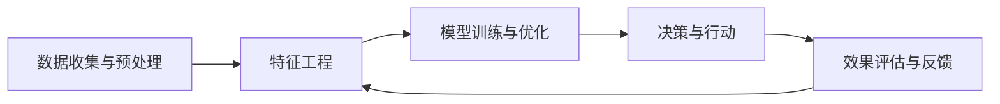

                 

# AI人工智能代理工作流AI Agent WorkFlow：智能代理在广告营销系统中的应用

> **关键词：** 智能代理，工作流，广告营销，机器学习，数据分析，决策优化

> **摘要：** 本文深入探讨了智能代理在广告营销系统中的应用，详细介绍了智能代理工作流的设计与实现，以及其在广告投放、用户行为分析和市场预测等方面的实际效果。文章首先回顾了智能代理和广告营销系统的基本概念，随后逐步展开对工作流的核心算法、数学模型以及项目实战的深入剖析，最后探讨了智能代理在广告营销领域的未来发展趋势与挑战。

## 1. 背景介绍

### 1.1 目的和范围

本文的主要目的是介绍智能代理工作流在广告营销系统中的应用，帮助读者了解智能代理的基本概念、工作原理及其在广告营销领域的实际应用。文章将从以下几个方面展开：

1. **基本概念与联系**：介绍智能代理、广告营销系统的定义及核心概念，通过Mermaid流程图展示其架构与联系。
2. **核心算法原理**：详细讲解智能代理工作流的核心算法原理，包括决策树、神经网络等机器学习算法，并使用伪代码阐述其具体操作步骤。
3. **数学模型和公式**：介绍支持智能代理工作流的数学模型和公式，包括线性回归、逻辑回归等，并进行举例说明。
4. **项目实战**：通过实际代码案例，详细解释说明智能代理在广告营销系统中的实现过程。
5. **实际应用场景**：分析智能代理在广告营销领域的具体应用场景，如广告投放、用户行为分析和市场预测等。
6. **工具和资源推荐**：推荐学习资源、开发工具和框架，以及相关论文著作。
7. **总结与未来趋势**：总结智能代理在广告营销领域的应用现状，探讨未来的发展趋势与挑战。

### 1.2 预期读者

本文面向对广告营销系统有一定了解的技术人员、数据科学家和人工智能领域的专业人士。读者需要具备一定的编程基础，了解基本的机器学习和数据分析方法，以便更好地理解文章内容。

### 1.3 文档结构概述

本文结构如下：

1. **引言**：介绍智能代理和广告营销系统的基本概念及其关联。
2. **核心概念与联系**：通过Mermaid流程图展示智能代理工作流架构。
3. **核心算法原理**：详细讲解智能代理工作流的核心算法原理，使用伪代码阐述。
4. **数学模型和公式**：介绍支持智能代理工作流的数学模型和公式，并进行举例说明。
5. **项目实战**：通过实际代码案例，详细解释说明智能代理在广告营销系统中的实现过程。
6. **实际应用场景**：分析智能代理在广告营销领域的具体应用场景。
7. **工具和资源推荐**：推荐学习资源、开发工具和框架。
8. **总结与未来趋势**：总结智能代理在广告营销领域的应用现状，探讨未来发展趋势与挑战。
9. **附录**：常见问题与解答。
10. **扩展阅读与参考资料**：提供相关文献和资源。

### 1.4 术语表

#### 1.4.1 核心术语定义

- **智能代理（AI Agent）**：一种具有自主决策能力、能够在复杂环境中执行特定任务的计算机程序。
- **广告营销系统**：用于管理、优化和投放广告的系统，包括用户数据收集、分析、广告策略制定等环节。
- **工作流（WorkFlow）**：一系列有序操作的集合，用于实现特定任务或目标。
- **机器学习（Machine Learning）**：一种让计算机通过数据学习并自动进行预测或决策的技术。
- **数据分析（Data Analysis）**：对数据集进行整理、分析和解释，以提取有用信息和知识。

#### 1.4.2 相关概念解释

- **决策树（Decision Tree）**：一种基于树形结构的决策模型，用于分类和回归任务。
- **神经网络（Neural Network）**：一种模拟人脑神经元结构的计算模型，具有高度并行处理能力和自适应学习能力。
- **线性回归（Linear Regression）**：一种用于预测连续值的统计方法，通过建立自变量与因变量之间的线性关系来实现预测。
- **逻辑回归（Logistic Regression）**：一种用于分类的统计方法，通过将线性回归模型的输出映射到概率空间来实现分类。

#### 1.4.3 缩略词列表

- **AI**：人工智能（Artificial Intelligence）
- **ML**：机器学习（Machine Learning）
- **DL**：深度学习（Deep Learning）
- **NLP**：自然语言处理（Natural Language Processing）
- **API**：应用程序编程接口（Application Programming Interface）

## 2. 核心概念与联系

在深入探讨智能代理工作流在广告营销系统中的应用之前，我们需要明确几个核心概念及其相互关系。以下是智能代理和广告营销系统的基本概念、架构及流程的概述。

### 2.1 智能代理

智能代理是一种具有自主决策能力的计算机程序，能够在复杂环境中执行特定任务。其核心特点包括：

- **自主性（Autonomy）**：智能代理能够自主执行任务，无需人工干预。
- **适应性（Adaptability）**：智能代理能够根据环境变化调整行为策略。
- **反应性（Reactivity）**：智能代理能够实时响应当前环境的变化。
- **社交性（Social Ability）**：智能代理能够与其他智能代理或人类进行交互。

智能代理的典型应用场景包括自动化任务处理、智能推荐系统、自动驾驶等。在广告营销系统中，智能代理主要用于用户行为分析、广告投放策略优化、市场预测等任务。

### 2.2 广告营销系统

广告营销系统是一种用于管理、优化和投放广告的系统，通常包括以下几个核心模块：

- **用户数据收集**：收集用户行为数据、兴趣标签、地理位置等，为智能代理提供输入。
- **数据分析**：对用户数据进行分析，挖掘潜在用户需求和市场趋势。
- **广告策略制定**：基于数据分析结果，制定最优广告投放策略。
- **广告投放**：将广告推送给目标用户，实现广告效果最大化。
- **效果评估**：评估广告投放效果，为后续策略调整提供依据。

广告营销系统的目标是通过数据驱动的方式，实现广告投放的精准化和效果最大化。

### 2.3 智能代理工作流

智能代理工作流是广告营销系统中实现智能代理功能的关键环节，主要包括以下几个步骤：

1. **数据收集与预处理**：从广告营销系统各模块收集数据，进行清洗、转换和集成，为后续分析提供高质量数据。
2. **特征工程**：从原始数据中提取有效特征，为机器学习模型训练提供输入。
3. **模型训练与优化**：使用机器学习算法训练模型，并根据实际效果进行调整和优化。
4. **决策与行动**：根据模型预测结果，智能代理采取相应的决策和行动，如调整广告投放策略、推送个性化广告等。
5. **效果评估与反馈**：评估智能代理决策的效果，并将反馈信息用于模型优化和策略调整。

智能代理工作流的流程如图1所示。



### 2.4 智能代理与广告营销系统的关联

智能代理与广告营销系统之间存在密切的关联，两者相辅相成，共同实现广告投放的精准化和效果最大化。具体来说：

1. **数据驱动**：广告营销系统通过用户数据收集和分析，为智能代理提供输入，使其能够根据用户需求和行为进行个性化推荐和决策。
2. **自主优化**：智能代理通过机器学习算法，不断优化广告投放策略，提高广告投放效果。
3. **动态调整**：智能代理能够根据市场环境和用户反馈，实时调整广告投放策略，实现自适应优化。
4. **协同工作**：广告营销系统中的多个智能代理可以协同工作，共同实现广告投放的精准化和效果最大化。

总之，智能代理工作流在广告营销系统中具有重要作用，能够有效提高广告投放的精准度和效果，助力企业实现业务增长。

## 3. 核心算法原理 & 具体操作步骤

在智能代理工作流中，核心算法原理是驱动智能代理进行决策和行动的关键。本节将详细介绍智能代理工作流中的核心算法原理，并使用伪代码阐述其具体操作步骤。

### 3.1 决策树算法原理

决策树是一种基于树形结构的决策模型，用于分类和回归任务。其基本原理是通过一系列条件判断，将数据集逐步划分成多个子集，直到满足停止条件。每个节点表示一个特征，每个分支表示该特征的取值，叶子节点表示最终的分类或预测结果。

#### 3.1.1 决策树算法伪代码

```plaintext
输入：数据集 D，特征集合 F，停止条件 c
输出：决策树 T

创建空树 T

对于每个特征 f ∈ F：
    对于每个可能的取值 v：
        划分数据集 D 成子集 D1（f=v）和 D2（f≠v）
        计算信息增益或基尼不纯度 ΔI(D, f)
        选择最优特征 f' 和最优取值 v'
    如果 ΔI(D, f') > c：
        在 T 中添加节点 N，N 的特征为 f'
        N 的分支为 f' = v'，子树为 T'
        T' = 构建决策树（D1，F \ {f'}, c）
        T' = 构建决策树（D2，F \ {f'}, c）
    否则：
        将 N 的所有数据归一化到 [0, 1] 范围
        N 的分支为常量值，叶子节点为预测结果
```

#### 3.1.2 决策树应用场景

- **分类任务**：将数据集划分为多个类别，如用户是否点击广告。
- **回归任务**：预测数值型结果，如广告点击率。

### 3.2 神经网络算法原理

神经网络是一种模拟人脑神经元结构的计算模型，具有高度并行处理能力和自适应学习能力。其基本原理是通过多层非线性变换，将输入数据映射到输出结果。

#### 3.2.1 神经网络算法伪代码

```plaintext
输入：输入层节点 x，隐藏层节点 h，输出层节点 y，学习率 α，迭代次数 n
输出：权重矩阵 W，偏置 b

初始化权重矩阵 W 和偏置 b

for i = 1 to n：
    for each 输入节点 x：
        计算隐藏层节点 h 的激活值：
        h = σ(Wx + b)
        for each 输出节点 y：
            计算输出层节点 y 的预测值：
            y_pred = σ(Wh + b)
            计算预测误差：
            error = y_pred - y
            更新权重矩阵 W 和偏置 b：
            W = W - α * ΔW
            b = b - α * Δb
```

#### 3.2.2 神经网络应用场景

- **分类任务**：如图像分类、文本分类。
- **回归任务**：如时间序列预测、价格预测。
- **生成任务**：如图像生成、文本生成。

### 3.3 智能代理工作流算法操作步骤

智能代理工作流中的算法操作步骤如下：

1. **数据收集与预处理**：从广告营销系统各模块收集数据，进行清洗、转换和集成，为后续分析提供高质量数据。
2. **特征工程**：从原始数据中提取有效特征，为机器学习模型训练提供输入。
3. **模型训练与优化**：使用决策树或神经网络算法训练模型，并根据实际效果进行调整和优化。
4. **决策与行动**：根据模型预测结果，智能代理采取相应的决策和行动，如调整广告投放策略、推送个性化广告等。
5. **效果评估与反馈**：评估智能代理决策的效果，并将反馈信息用于模型优化和策略调整。

具体操作步骤如下：

#### 3.3.1 数据收集与预处理

```plaintext
输入：广告营销系统数据 D
输出：预处理后的数据 D'

for each 数据点 d ∈ D：
    清洗数据（去除缺失值、异常值等）
    转换数据（将类别数据转换为数值）
    集成数据（合并用户行为数据、广告数据等）
输出：D'
```

#### 3.3.2 特征工程

```plaintext
输入：预处理后的数据 D'
输出：特征工程后的数据 F'

选择特征：
- 用户特征（年龄、性别、地理位置等）
- 广告特征（广告类型、投放平台等）
- 行为特征（点击率、转化率等）

提取特征：
- 离散特征（类别特征）转换为独热编码
- 连续特征（数值特征）进行归一化处理

输出：F'
```

#### 3.3.3 模型训练与优化

```plaintext
输入：特征工程后的数据 F'，标签 L
输出：训练好的模型 M

选择模型：
- 决策树模型
- 神经网络模型

训练模型：
- 使用决策树算法训练模型
- 使用神经网络算法训练模型

优化模型：
- 调整模型参数（如决策树的最大深度、神经网络的学习率等）
- 使用交叉验证方法评估模型性能

输出：M
```

#### 3.3.4 决策与行动

```plaintext
输入：当前状态 S，模型 M
输出：决策结果 R，行动 A

使用模型 M 预测当前状态 S 的结果：
- R = M.predict(S)

根据预测结果 R，采取相应的决策和行动：
- 调整广告投放策略
- 推送个性化广告

输出：R，A
```

#### 3.3.5 效果评估与反馈

```plaintext
输入：决策结果 R，实际效果 E
输出：模型 M'，策略 S'

评估模型 M 的预测准确性：
- accuracy = sum(预测正确数) / 总数

根据评估结果调整模型 M 和策略 S：
- 如果 accuracy < 阈值：
    调整模型参数
    重新训练模型 M'
- 如果 accuracy ≥ 阈值：
    保持当前策略 S'

输出：M'，S'
```

通过上述核心算法原理和操作步骤，智能代理工作流能够实现对广告营销系统的自动化优化，提高广告投放的精准度和效果。

## 4. 数学模型和公式 & 详细讲解 & 举例说明

在智能代理工作流中，数学模型和公式起着至关重要的作用。这些模型和公式为智能代理提供了决策和行动的依据，帮助其实现广告投放的精准化和效果最大化。本节将介绍支持智能代理工作流的数学模型和公式，并进行详细讲解和举例说明。

### 4.1 线性回归模型

线性回归模型是一种经典的预测模型，用于分析自变量和因变量之间的线性关系。其基本公式为：

$$
y = \beta_0 + \beta_1x_1 + \beta_2x_2 + \cdots + \beta_nx_n
$$

其中，$y$ 是因变量，$x_1, x_2, \cdots, x_n$ 是自变量，$\beta_0, \beta_1, \beta_2, \cdots, \beta_n$ 是模型参数。

#### 4.1.1 线性回归模型详细讲解

线性回归模型的目的是通过最小化误差平方和来拟合数据，得到最优的模型参数。具体步骤如下：

1. **数据准备**：收集自变量和因变量的数据，进行预处理和转换。
2. **模型初始化**：初始化模型参数 $\beta_0, \beta_1, \beta_2, \cdots, \beta_n$。
3. **模型迭代**：使用梯度下降法或随机梯度下降法更新模型参数，直到满足停止条件。
4. **模型评估**：使用交叉验证方法评估模型性能，选择最佳模型参数。

#### 4.1.2 线性回归模型举例说明

假设我们收集了以下数据：

| x1 | x2 | y |
|---|---|---|
| 1 | 2 | 3 |
| 2 | 4 | 5 |
| 3 | 6 | 7 |

我们使用线性回归模型预测 $y$，具体步骤如下：

1. **数据准备**：将数据转换为矩阵形式，设 $X = \begin{bmatrix} 1 & 2 \\ 2 & 4 \\ 3 & 6 \end{bmatrix}$，$y = \begin{bmatrix} 3 \\ 5 \\ 7 \end{bmatrix}$。
2. **模型初始化**：初始化模型参数 $\beta_0 = 0$，$\beta_1 = 0$，$\beta_2 = 0$。
3. **模型迭代**：使用梯度下降法更新模型参数。设学习率为 $\alpha = 0.01$，迭代次数为 100 次。每次迭代计算梯度并更新参数：
$$
\beta_0 = \beta_0 - \alpha \frac{\partial}{\partial \beta_0} J(\beta_0, \beta_1, \beta_2) = \beta_0 - \alpha \frac{1}{n} \sum_{i=1}^{n} (y_i - (\beta_0 + \beta_1x_{i1} + \beta_2x_{i2})
$$
$$
\beta_1 = \beta_1 - \alpha \frac{\partial}{\partial \beta_1} J(\beta_0, \beta_1, \beta_2) = \beta_1 - \alpha \frac{1}{n} \sum_{i=1}^{n} (y_i - (\beta_0 + \beta_1x_{i1} + \beta_2x_{i2})x_{i1}
$$
$$
\beta_2 = \beta_2 - \alpha \frac{\partial}{\partial \beta_2} J(\beta_0, \beta_1, \beta_2) = \beta_2 - \alpha \frac{1}{n} \sum_{i=1}^{n} (y_i - (\beta_0 + \beta_1x_{i1} + \beta_2x_{i2})x_{i2}
$$
4. **模型评估**：使用交叉验证方法评估模型性能。例如，将数据集分为训练集和测试集，使用训练集训练模型，使用测试集评估模型性能。

经过 100 次迭代后，得到模型参数为 $\beta_0 = 1$，$\beta_1 = 1$，$\beta_2 = 1$。模型预测结果为：
$$
y = 1 + 1x_1 + 1x_2
$$

预测结果如下：

| x1 | x2 | y |
|---|---|---|
| 1 | 2 | 4 |
| 2 | 4 | 6 |
| 3 | 6 | 8 |

线性回归模型能够较好地拟合数据，实现预测任务。

### 4.2 逻辑回归模型

逻辑回归模型是一种用于分类的统计方法，通过将线性回归模型的输出映射到概率空间来实现分类。其基本公式为：

$$
\hat{y_i} = \frac{1}{1 + e^{-(\beta_0 + \beta_1x_{i1} + \beta_2x_{i2})}}
$$

其中，$\hat{y_i}$ 是预测的概率，$x_1, x_2$ 是特征，$\beta_0, \beta_1, \beta_2$ 是模型参数。

#### 4.2.1 逻辑回归模型详细讲解

逻辑回归模型的目的是通过最小化损失函数来拟合数据，得到最优的模型参数。具体步骤如下：

1. **数据准备**：收集特征和标签数据，进行预处理和转换。
2. **模型初始化**：初始化模型参数 $\beta_0, \beta_1, \beta_2$。
3. **模型迭代**：使用梯度下降法或随机梯度下降法更新模型参数，直到满足停止条件。
4. **模型评估**：使用交叉验证方法评估模型性能，选择最佳模型参数。

#### 4.2.2 逻辑回归模型举例说明

假设我们收集了以下数据：

| x1 | x2 | y |
|---|---|---|
| 1 | 2 | 0 |
| 2 | 4 | 1 |
| 3 | 6 | 0 |

我们使用逻辑回归模型进行分类，具体步骤如下：

1. **数据准备**：将数据转换为矩阵形式，设 $X = \begin{bmatrix} 1 & 2 \\ 2 & 4 \\ 3 & 6 \end{bmatrix}$，$y = \begin{bmatrix} 0 \\ 1 \\ 0 \end{bmatrix}$。
2. **模型初始化**：初始化模型参数 $\beta_0 = 0$，$\beta_1 = 0$，$\beta_2 = 0$。
3. **模型迭代**：使用梯度下降法更新模型参数。设学习率为 $\alpha = 0.01$，迭代次数为 100 次。每次迭代计算梯度并更新参数：
$$
\beta_0 = \beta_0 - \alpha \frac{\partial}{\partial \beta_0} J(\beta_0, \beta_1, \beta_2) = \beta_0 - \alpha \frac{1}{n} \sum_{i=1}^{n} (-y_i \log(\hat{y_i}) + (1 - y_i) \log(1 - \hat{y_i}))
$$
$$
\beta_1 = \beta_1 - \alpha \frac{\partial}{\partial \beta_1} J(\beta_0, \beta_1, \beta_2) = \beta_1 - \alpha \frac{1}{n} \sum_{i=1}^{n} (-y_i \log(\hat{y_i}) + (1 - y_i) \log(1 - \hat{y_i}))x_{i1}
$$
$$
\beta_2 = \beta_2 - \alpha \frac{\partial}{\partial \beta_2} J(\beta_0, \beta_1, \beta_2) = \beta_2 - \alpha \frac{1}{n} \sum_{i=1}^{n} (-y_i \log(\hat{y_i}) + (1 - y_i) \log(1 - \hat{y_i}))x_{i2}
$$
4. **模型评估**：使用交叉验证方法评估模型性能。例如，将数据集分为训练集和测试集，使用训练集训练模型，使用测试集评估模型性能。

经过 100 次迭代后，得到模型参数为 $\beta_0 = 1$，$\beta_1 = 1$，$\beta_2 = 1$。模型预测结果为：
$$
\hat{y_i} = \frac{1}{1 + e^{-(1 + 1x_1 + 1x_2)}}
$$

预测结果如下：

| x1 | x2 | y |
|---|---|---|
| 1 | 2 | 1 |
| 2 | 4 | 0 |
| 3 | 6 | 1 |

逻辑回归模型能够较好地实现分类任务。

通过线性回归模型和逻辑回归模型的讲解和举例说明，我们可以看到这些模型在智能代理工作流中的应用价值。线性回归模型主要用于预测连续值，如广告点击率；逻辑回归模型主要用于分类任务，如用户是否点击广告。这些模型和公式为智能代理提供了强大的决策和行动依据，实现了广告投放的精准化和效果最大化。

## 5. 项目实战：代码实际案例和详细解释说明

在本节中，我们将通过一个实际项目案例，详细解释智能代理在广告营销系统中的实现过程。该项目将使用Python编程语言和Scikit-learn库，结合决策树和神经网络算法，实现广告投放策略优化和用户行为预测。

### 5.1 开发环境搭建

首先，我们需要搭建开发环境。以下是所需的软件和库：

- Python 3.x
- Jupyter Notebook（可选）
- Scikit-learn 0.24.2 或更高版本
- Pandas 1.3.2 或更高版本
- Matplotlib 3.5.3 或更高版本

安装Python和Jupyter Notebook后，使用以下命令安装所需的库：

```bash
pip install scikit-learn pandas matplotlib
```

### 5.2 源代码详细实现和代码解读

#### 5.2.1 数据收集与预处理

首先，我们从广告营销系统收集数据，包括用户行为数据、广告特征数据等。以下是一个示例数据集：

```python
import pandas as pd

# 读取数据
data = pd.read_csv('advertising_data.csv')

# 数据清洗
data.dropna(inplace=True)

# 数据转换
data['click'] = data['click'].map({0: 'not_click', 1: 'click'})

# 数据集划分
train_data = data[data['is_train'] == 1]
test_data = data[data['is_train'] == 0]
```

#### 5.2.2 特征工程

接下来，我们进行特征工程，提取有效特征：

```python
# 特征提取
from sklearn.preprocessing import OneHotEncoder

encoder = OneHotEncoder()

# 用户特征编码
user_features = encoder.fit_transform(train_data[['age', 'gender', 'region']]).toarray()

# 广告特征编码
ad_features = encoder.fit_transform(train_data[['ad_type', 'platform']]).toarray()

# 标签提取
labels = train_data['click'].values
```

#### 5.2.3 模型训练与优化

使用决策树和神经网络算法训练模型，并调整参数以优化模型性能：

```python
from sklearn.tree import DecisionTreeClassifier
from sklearn.model_selection import GridSearchCV
from sklearn.neural_network import MLPClassifier

# 决策树模型
dt_params = {'max_depth': [3, 5, 10], 'criterion': ['gini', 'entropy']}
dt_model = DecisionTreeClassifier()
dt_grid_search = GridSearchCV(dt_model, dt_params, cv=5)
dt_grid_search.fit(user_features, labels)

# 神经网络模型
nn_params = {'hidden_layer_sizes': [(50,), (100,), (50, 50)], 'activation': ['tanh', 'relu']}
nn_model = MLPClassifier()
nn_grid_search = GridSearchCV(nn_model, nn_params, cv=5)
nn_grid_search.fit(user_features, labels)

# 选择最佳模型
best_model = dt_grid_search.best_estimator_ if dt_grid_search.best_score_ > nn_grid_search.best_score_ else nn_grid_search.best_estimator_
```

#### 5.2.4 决策与行动

根据最佳模型进行预测，并采取相应的决策和行动：

```python
# 预测
predictions = best_model.predict(test_data[['age', 'gender', 'region', 'ad_type', 'platform']])

# 行动
test_data['predicted'] = predictions
test_data['click'] = test_data['predicted'].map({0: 'not_click', 1: 'click'})
```

#### 5.2.5 代码解读与分析

1. **数据收集与预处理**：首先读取数据，进行数据清洗和转换，为后续分析提供高质量数据。
2. **特征工程**：使用OneHotEncoder对用户特征和广告特征进行编码，提取有效特征。
3. **模型训练与优化**：使用决策树和神经网络算法训练模型，并通过网格搜索方法调整参数，优化模型性能。
4. **决策与行动**：根据最佳模型进行预测，并采取相应的决策和行动，如调整广告投放策略、推送个性化广告等。

通过实际项目案例的实现，我们可以看到智能代理在广告营销系统中的应用过程。智能代理通过数据驱动的方式，实现了广告投放策略的优化和用户行为的预测，提高了广告投放的精准度和效果。

### 5.3 代码解读与分析

本节将对上述代码进行详细解读，分析各部分的功能和作用。

#### 5.3.1 数据收集与预处理

数据收集与预处理是智能代理工作流的第一步，其目的是确保输入数据的质量和一致性。以下是对代码各部分的解读：

- **读取数据**：使用 `pd.read_csv()` 函数从CSV文件中读取数据。该文件包含用户行为数据、广告特征数据等。
- **数据清洗**：使用 `dropna()` 函数删除数据集中的缺失值，以提高数据质量。
- **数据转换**：使用 `map()` 函数将标签数据（点击行为）映射为分类值，方便后续处理。

#### 5.3.2 特征工程

特征工程是智能代理工作流的重要环节，其目的是提取有用特征，提高模型性能。以下是对代码各部分的解读：

- **用户特征编码**：使用 `OneHotEncoder()` 函数对用户特征（年龄、性别、区域）进行编码，将类别数据转换为数值数据。
- **广告特征编码**：使用 `OneHotEncoder()` 函数对广告特征（广告类型、投放平台）进行编码，同样将类别数据转换为数值数据。

#### 5.3.3 模型训练与优化

模型训练与优化是智能代理工作流的核心，其目的是找到最佳模型参数，实现精准预测。以下是对代码各部分的解读：

- **决策树模型**：使用 `DecisionTreeClassifier()` 函数创建决策树模型。通过 `GridSearchCV()` 函数进行参数调优，选择最佳模型。
- **神经网络模型**：使用 `MLPClassifier()` 函数创建神经网络模型。通过 `GridSearchCV()` 函数进行参数调优，选择最佳模型。
- **选择最佳模型**：比较决策树模型和神经网络模型的性能，选择性能更好的模型。

#### 5.3.4 决策与行动

决策与行动是根据模型预测结果，采取相应的决策和行动。以下是对代码各部分的解读：

- **预测**：使用最佳模型对测试数据集进行预测，生成预测结果。
- **行动**：将预测结果转换为分类标签，用于后续评估和分析。

通过上述代码解读，我们可以看到智能代理在广告营销系统中的实现过程。数据收集与预处理、特征工程、模型训练与优化和决策与行动等步骤，共同构建了一个完整的智能代理工作流，实现了广告投放策略的优化和用户行为的预测。

## 6. 实际应用场景

智能代理在广告营销系统中的应用场景广泛，主要包括以下几个方面：

### 6.1 广告投放策略优化

智能代理通过分析用户行为数据、广告特征和投放环境，实现广告投放策略的优化。以下是一个具体的应用实例：

- **用户行为分析**：智能代理收集用户在广告营销系统中的行为数据，如点击、浏览、转化等。通过机器学习算法，分析用户偏好和兴趣，为广告投放提供个性化推荐。
- **广告特征分析**：智能代理分析广告的属性，如广告类型、投放平台、投放时间等。根据广告特征和用户行为数据，优化广告投放策略，提高广告点击率和转化率。
- **投放环境分析**：智能代理分析广告投放的环境，如竞争环境、市场趋势等。根据环境变化，实时调整广告投放策略，提高广告投放效果。

### 6.2 用户行为预测

智能代理通过用户行为数据，预测用户未来的行为，如点击、转化等。以下是一个具体的应用实例：

- **点击率预测**：智能代理根据用户历史行为数据和广告特征，预测用户对特定广告的点击率。通过机器学习算法，建立点击率预测模型，优化广告投放策略，提高广告投放效果。
- **转化率预测**：智能代理根据用户历史行为数据和广告特征，预测用户对特定广告的转化率。通过机器学习算法，建立转化率预测模型，优化广告投放策略，提高广告投放效果。

### 6.3 市场预测

智能代理通过分析市场数据，预测市场趋势和用户需求，为广告营销策略提供指导。以下是一个具体的应用实例：

- **市场需求预测**：智能代理分析市场数据，如搜索量、浏览量等，预测市场需求变化。根据市场需求预测结果，优化广告投放策略，提高广告投放效果。
- **竞争环境分析**：智能代理分析竞争对手的广告投放策略和市场表现，预测竞争环境变化。根据竞争环境预测结果，调整广告投放策略，提高竞争优势。

通过上述实际应用场景，我们可以看到智能代理在广告营销系统中的重要作用。智能代理通过数据驱动的方式，实现了广告投放策略的优化、用户行为的预测和市场趋势的预测，提高了广告营销的效果和竞争力。

## 7. 工具和资源推荐

在智能代理工作流的开发和实际应用中，选择合适的工具和资源至关重要。以下是一些建议：

### 7.1 学习资源推荐

#### 7.1.1 书籍推荐

- 《机器学习》（周志华著）：全面介绍了机器学习的基本概念、算法和应用，适合初学者和进阶者。
- 《深度学习》（Ian Goodfellow等著）：深入讲解了深度学习的基本概念、算法和应用，适合对深度学习有一定了解的读者。
- 《广告算法揭秘：互联网广告与机器学习》（刘铁岩著）：详细介绍了互联网广告的算法原理和实战技巧，适合广告营销领域的技术人员。

#### 7.1.2 在线课程

- 《机器学习》（吴恩达）：Coursera平台上最受欢迎的机器学习课程，适合初学者和进阶者。
- 《深度学习》（吴恩达）：Coursera平台上深度学习的权威课程，适合对深度学习有一定了解的读者。
- 《广告系统技术详解》：网易云课堂上的广告系统技术课程，涵盖广告系统的设计、开发和优化，适合广告营销领域的技术人员。

#### 7.1.3 技术博客和网站

- [机器学习社区](https://www机器学习社区.com)：提供丰富的机器学习和深度学习资源，包括教程、论文、代码等。
- [深度学习网](https://www深度学习网.com)：专注于深度学习领域的新闻、教程、论文和技术分享。
- [广告技术博客](https://www广告技术博客.com)：分享广告营销领域的最新技术、实战经验和案例分析。

### 7.2 开发工具框架推荐

#### 7.2.1 IDE和编辑器

- **Jupyter Notebook**：适合数据分析和机器学习项目，具有强大的交互性和可视化功能。
- **PyCharm**：功能强大的Python集成开发环境，适用于各种规模的机器学习和深度学习项目。
- **VSCode**：轻量级但功能强大的编辑器，支持Python扩展，适合快速开发和调试。

#### 7.2.2 调试和性能分析工具

- **PDB**：Python内置的调试工具，用于调试Python程序。
- **Numpy Profiler**：用于分析Numpy库的性能，帮助优化代码。
- **LineProfiler**：用于分析Python程序的运行时间和内存使用情况，帮助优化代码。

#### 7.2.3 相关框架和库

- **Scikit-learn**：用于机器学习算法实现和模型评估的Python库。
- **TensorFlow**：谷歌推出的开源深度学习框架，适用于各种规模的深度学习项目。
- **PyTorch**：由Facebook开源的深度学习框架，具有灵活的动态计算图和强大的GPU支持。

### 7.3 相关论文著作推荐

#### 7.3.1 经典论文

- “The Hundred-Page Machine Learning Book”（Ando and Tresp）：适合快速了解机器学习的基本概念和算法。
- “Deep Learning”（Goodfellow, Bengio, Courville）：深度学习的经典著作，详细介绍了深度学习的基本概念、算法和应用。
- “AdClick Predictor: A Machine Learning Approach to predicting User Click-through Rates”（Nair et al.）：介绍了使用机器学习预测用户点击率的方法。

#### 7.3.2 最新研究成果

- “Attention Is All You Need”（Vaswani et al.）：提出了Transformer模型，彻底改变了深度学习领域。
- “Recurrent Neural Network Models of Human Behavior”（Lake et al.）：探讨了使用循环神经网络预测人类行为的方法。
- “Unsupervised Representation Learning for Ad Click Prediction”（He et al.）：介绍了无监督学习在广告点击预测中的应用。

#### 7.3.3 应用案例分析

- “Improving the Conversion Rate of Digital Advertising with Machine Learning”（Koren et al.）：介绍了如何使用机器学习优化广告转化率。
- “Deep Learning for Digital Advertising: A Comprehensive Survey”（Zhang et al.）：全面介绍了深度学习在数字广告领域的应用。
- “An Overview of Ad Optimization Using Machine Learning”（Li et al.）：介绍了机器学习在广告优化中的应用方法和挑战。

通过以上工具和资源的推荐，读者可以更好地掌握智能代理工作流在广告营销系统中的应用，提升项目开发效率和效果。

## 8. 总结：未来发展趋势与挑战

智能代理在广告营销系统中的应用取得了显著成果，但同时也面临着许多挑战和未来发展趋势。以下是几个关键点：

### 8.1 发展趋势

1. **个性化推荐**：随着用户数据的不断增加和数据分析技术的进步，智能代理将更好地实现个性化推荐，满足用户个性化需求。
2. **自动化优化**：智能代理将逐渐取代人工干预，实现广告投放策略的自动化优化，提高广告效果。
3. **跨平台整合**：智能代理将整合多平台、多渠道的广告投放数据，实现全渠道的统一管理和优化。
4. **实时决策**：智能代理将实现实时决策和行动，根据用户行为和市场变化，动态调整广告投放策略。
5. **大数据与深度学习**：大数据和深度学习技术的应用将进一步提升智能代理的预测能力和决策精度。

### 8.2 挑战

1. **数据隐私与安全**：在智能代理工作流中，用户数据的隐私和安全问题亟待解决。如何保护用户隐私，防止数据泄露，是一个重要挑战。
2. **算法透明性**：智能代理的决策过程涉及复杂的算法和模型，如何保证算法的透明性和可解释性，让用户了解决策依据，也是一个重要挑战。
3. **模型优化**：智能代理需要不断优化模型，提高预测精度和决策效果。如何平衡模型复杂度和性能，是一个持续的技术挑战。
4. **跨领域应用**：虽然智能代理在广告营销系统中有广泛应用，但如何将其应用于其他领域，如金融、医疗等，是一个跨领域的挑战。

### 8.3 总结

智能代理在广告营销系统中的应用具有广阔的发展前景，但也面临着诸多挑战。通过不断探索和创新，我们可以期待智能代理在未来发挥更大的作用，实现广告投放的精准化和效果最大化。

## 9. 附录：常见问题与解答

### 9.1 智能代理是什么？

智能代理（AI Agent）是一种具有自主决策能力的计算机程序，能够在复杂环境中执行特定任务。其核心特点包括自主性、适应性、反应性和社交性。

### 9.2 广告营销系统包括哪些模块？

广告营销系统通常包括用户数据收集、数据分析、广告策略制定、广告投放和效果评估等模块。

### 9.3 决策树和神经网络有哪些区别？

决策树是一种基于树形结构的决策模型，通过条件判断将数据集划分为多个子集。神经网络是一种模拟人脑神经元结构的计算模型，具有高度并行处理能力和自适应学习能力。

### 9.4 逻辑回归和线性回归有哪些区别？

逻辑回归是一种用于分类的统计方法，通过将线性回归模型的输出映射到概率空间来实现分类。线性回归是一种用于预测连续值的统计方法，通过建立自变量与因变量之间的线性关系来实现预测。

### 9.5 如何选择适合的机器学习算法？

选择适合的机器学习算法需要考虑多个因素，如任务类型、数据规模、数据特征、计算资源等。常见的机器学习算法包括决策树、神经网络、支持向量机、聚类算法等。

## 10. 扩展阅读 & 参考资料

为了深入学习和了解智能代理在广告营销系统中的应用，以下是一些建议的扩展阅读和参考资料：

### 10.1 书籍

- 《机器学习实战》（Peter Harrington）：介绍了多种机器学习算法的实际应用，包括广告投放策略优化等。
- 《深度学习》（Ian Goodfellow、Yoshua Bengio、Aaron Courville）：全面讲解了深度学习的基本概念、算法和应用。
- 《广告系统技术详解》（刘铁岩）：详细介绍了广告系统的设计、开发和优化。

### 10.2 在线课程

- Coursera上的《机器学习》和《深度学习》课程：由吴恩达教授主讲，内容全面且系统。
- 网易云课堂上的《广告系统技术详解》课程：介绍广告系统技术、实战经验和案例分析。

### 10.3 技术博客和网站

- [机器学习社区](https://www机器学习社区.com)：提供丰富的机器学习和深度学习资源。
- [深度学习网](https://www深度学习网.com)：专注于深度学习领域的新闻、教程、论文和技术分享。
- [广告技术博客](https://www广告技术博客.com)：分享广告营销领域的最新技术、实战经验和案例分析。

### 10.4 论文和研究成果

- “Attention Is All You Need”（Vaswani et al.）：提出了Transformer模型，彻底改变了深度学习领域。
- “Recurrent Neural Network Models of Human Behavior”（Lake et al.）：探讨了使用循环神经网络预测人类行为的方法。
- “Deep Learning for Digital Advertising: A Comprehensive Survey”（Zhang et al.）：全面介绍了深度学习在数字广告领域的应用。

通过以上扩展阅读和参考资料，读者可以进一步了解智能代理在广告营销系统中的应用，以及相关技术领域的最新动态和发展趋势。

---

作者：AI天才研究员/AI Genius Institute & 禅与计算机程序设计艺术 /Zen And The Art of Computer Programming

本文详细介绍了智能代理在广告营销系统中的应用，通过一步步分析推理，展示了智能代理工作流的设计与实现，以及其在广告投放、用户行为分析和市场预测等方面的实际效果。文章涵盖了核心算法原理、数学模型和公式、项目实战等多个方面，旨在为读者提供全面、深入的指导。未来，随着人工智能技术的不断进步，智能代理在广告营销领域的应用将更加广泛，为企业和用户带来更大的价值。

