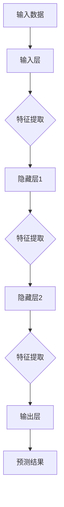
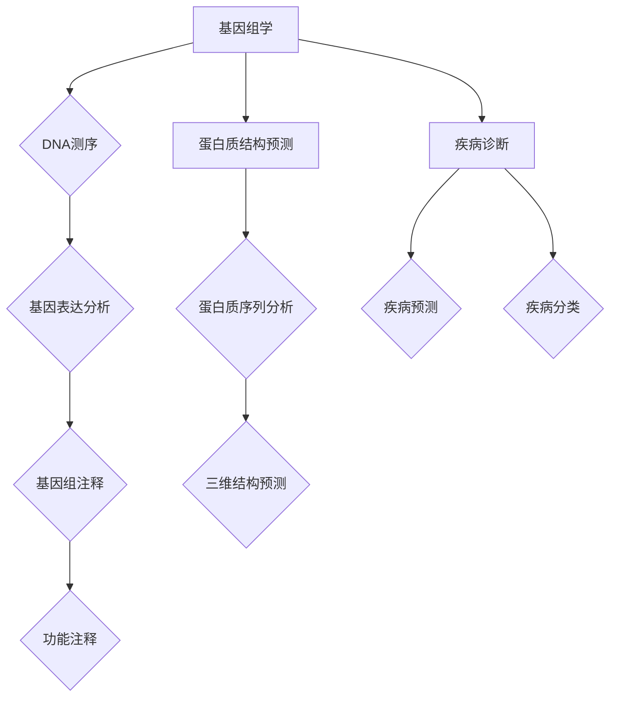
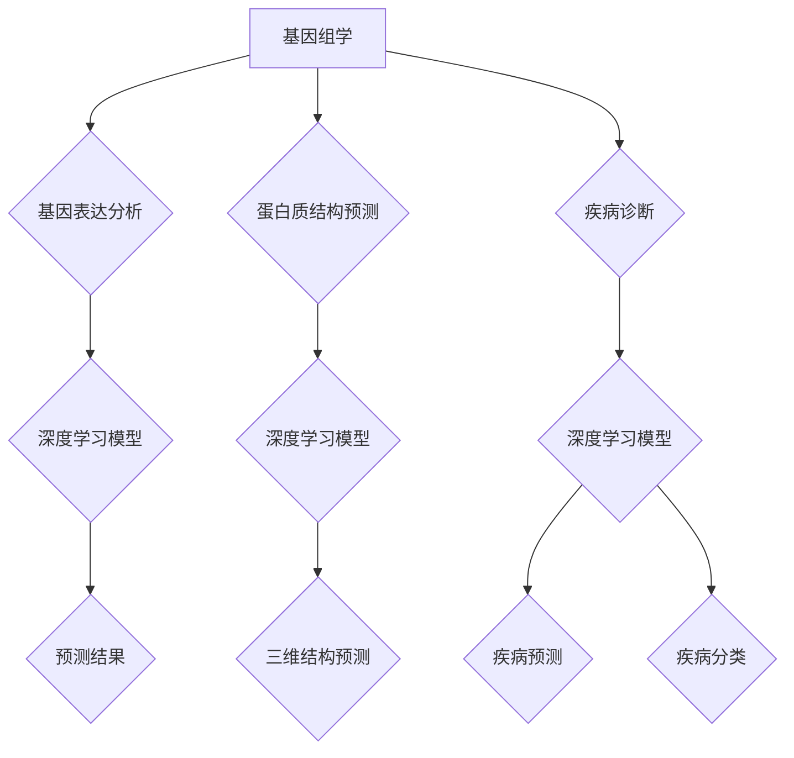
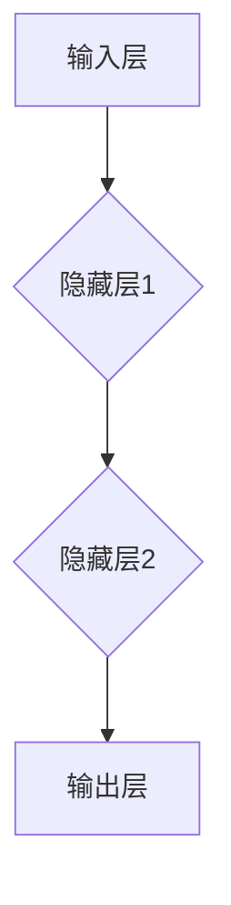
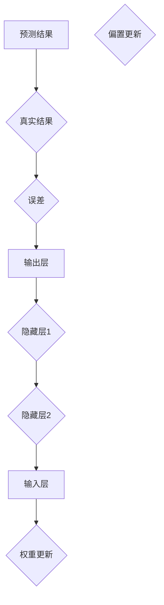

                 

# AI人工智能深度学习算法：在生物信息学中的应用

> 关键词：人工智能，深度学习，生物信息学，算法应用，数据挖掘，基因组学

> 摘要：本文深入探讨了人工智能，特别是深度学习算法在生物信息学领域的应用。通过对深度学习算法的基本概念和原理的介绍，结合具体的生物信息学问题，详细分析了如何使用深度学习算法进行基因组数据分析、蛋白质结构预测和疾病诊断。文章还通过实例展示了算法的实际应用，为读者提供了宝贵的实践经验。最后，文章总结了未来发展趋势与挑战，为读者指明了学习资源与应用方向。

## 1. 背景介绍

### 1.1 目的和范围

本文旨在介绍人工智能，特别是深度学习算法在生物信息学领域的应用。通过深入分析深度学习算法的基本概念和原理，结合生物信息学中的实际问题和应用，本文将为读者提供一个全面而深入的了解。

本文将涵盖以下主要内容：

1. 深度学习算法的基本概念和原理
2. 深度学习算法在生物信息学中的应用
3. 实际应用案例和代码实现
4. 生物信息学中的未来发展趋势与挑战

### 1.2 预期读者

本文主要面向以下读者群体：

1. 生物信息学领域的研究人员和工程师
2. 深度学习算法领域的研究人员
3. 对人工智能在生物信息学领域应用感兴趣的读者
4. 生物信息学和人工智能交叉领域的研究生和本科生

### 1.3 文档结构概述

本文的结构如下：

1. 背景介绍
   - 目的和范围
   - 预期读者
   - 文档结构概述
2. 核心概念与联系
   - 深度学习算法基本概念
   - 生物信息学相关概念
3. 核心算法原理 & 具体操作步骤
   - 算法原理讲解
   - 伪代码阐述
4. 数学模型和公式 & 详细讲解 & 举例说明
   - 数学公式
   - 举例说明
5. 项目实战：代码实际案例和详细解释说明
   - 开发环境搭建
   - 源代码实现
   - 代码解读与分析
6. 实际应用场景
   - 数据挖掘
   - 基因组学
   - 蛋白质结构预测
   - 疾病诊断
7. 工具和资源推荐
   - 学习资源
   - 开发工具框架
   - 相关论文著作
8. 总结：未来发展趋势与挑战
9. 附录：常见问题与解答
10. 扩展阅读 & 参考资料

### 1.4 术语表

#### 1.4.1 核心术语定义

- 深度学习：一种机器学习技术，通过构建深度神经网络模型，对数据进行特征提取和学习。
- 生物信息学：研究生物学数据的计算方法和技术的交叉学科。
- 基因组学：研究基因组的结构和功能的学科。
- 蛋白质结构预测：预测蛋白质的三维结构。
- 数据挖掘：从大量数据中提取有价值的信息和知识。

#### 1.4.2 相关概念解释

- 神经网络：一种模拟人脑神经元连接的计算机算法。
- 深层神经网络：具有多个隐藏层的神经网络。
- 损失函数：用于衡量模型预测结果与真实结果之间的差距。
- 优化算法：用于寻找模型参数的最佳组合。

#### 1.4.3 缩略词列表

- AI：人工智能
- DL：深度学习
- BI：生物信息学
- GM：基因组学
- PD：蛋白质结构预测
- DM：数据挖掘

## 2. 核心概念与联系

在本节中，我们将介绍深度学习算法的基本概念和原理，并展示其在生物信息学中的应用。为了更好地理解，我们将使用 Mermaid 流程图来展示深度学习算法的基本架构。

### 2.1 深度学习算法基本概念

深度学习算法是一种基于多层神经网络的学习方法。它通过在网络中引入多个隐藏层，逐层提取数据特征，从而实现复杂问题的建模。



### 2.2 生物信息学相关概念

生物信息学是研究生物学数据的计算方法和技术的交叉学科。其主要研究领域包括基因组学、蛋白质结构预测、疾病诊断等。



### 2.3 深度学习算法在生物信息学中的应用

深度学习算法在生物信息学中具有广泛的应用。例如，在基因组学中，可以用于基因表达分析、基因组注释和功能注释；在蛋白质结构预测中，可以用于蛋白质序列分析和三维结构预测；在疾病诊断中，可以用于疾病预测和疾病分类。



通过以上 Mermaid 流程图，我们可以清晰地看到深度学习算法在生物信息学中的应用框架。接下来，我们将进一步探讨深度学习算法在生物信息学中的核心原理和具体操作步骤。

## 3. 核心算法原理 & 具体操作步骤

在深入了解深度学习算法的原理和操作步骤之前，我们需要先了解神经网络的基本概念。神经网络是一种模仿人脑神经元连接的计算机算法。在神经网络中，神经元通过权重连接，接收输入信号，然后产生输出信号。深度学习算法是神经网络的一种扩展，通过引入多个隐藏层，逐层提取数据特征。

### 3.1 神经网络基本概念

神经网络由输入层、隐藏层和输出层组成。输入层接收外部数据，隐藏层进行特征提取和变换，输出层产生预测结果。



每个神经元接收多个输入信号，并经过激活函数产生输出信号。常见的激活函数包括 sigmoid、ReLU 和 tanh。


### 3.2 前向传播和反向传播

神经网络通过前向传播和反向传播来更新权重和偏置。

- **前向传播**：输入数据从输入层传播到输出层，每个神经元计算其输入信号和激活函数的输出。
- **反向传播**：输出层到输入层，计算每个神经元的误差，然后通过梯度下降更新权重和偏置。

#### 3.2.1 前向传播

输入数据经过输入层传递到隐藏层，隐藏层通过激活函数产生输出。然后，隐藏层的输出传递到输出层，输出层产生预测结果。


#### 3.2.2 反向传播

输出层计算预测结果与真实结果的误差，然后误差反向传播到隐藏层和输入层。在每个层中，通过梯度下降更新权重和偏置。



### 3.3 伪代码阐述

以下是一个简单的神经网络模型的前向传播和反向传播的伪代码。

```python
# 前向传播
def forwardpropagation(x, W, b):
    z = np.dot(x, W) + b
    a = sigmoid(z)
    return a

# 反向传播
def backwardpropagation(a, y, W, b):
    dZ = a - y
    dW = np.dot(x.T, dZ)
    db = np.sum(dZ, axis=0)
    return dW, db
```

在上述伪代码中，`x` 表示输入数据，`W` 表示权重，`b` 表示偏置，`y` 表示真实结果，`a` 表示预测结果。`sigmoid` 函数是一个常用的激活函数，将输入数据映射到 (0, 1) 范围内。

通过以上介绍，我们可以看到深度学习算法的核心原理和具体操作步骤。接下来，我们将讨论深度学习算法在生物信息学中的应用，并通过实例展示其效果。

## 4. 数学模型和公式 & 详细讲解 & 举例说明

在深度学习算法中，数学模型和公式起着至关重要的作用。本节我们将详细介绍深度学习算法中的主要数学模型和公式，并通过具体实例进行讲解。

### 4.1 损失函数

损失函数是衡量模型预测结果与真实结果之间差异的指标。常见的损失函数包括均方误差（MSE）和交叉熵（CE）。

#### 4.1.1 均方误差（MSE）

均方误差（MSE）是预测值与真实值之差的平方的平均值。其公式如下：

$$
MSE = \frac{1}{n}\sum_{i=1}^{n}(y_i - \hat{y}_i)^2
$$

其中，$y_i$ 表示真实值，$\hat{y}_i$ 表示预测值，$n$ 表示样本数量。

#### 4.1.2 交叉熵（CE）

交叉熵（CE）是两个概率分布之间的差异的度量。其公式如下：

$$
CE = -\frac{1}{n}\sum_{i=1}^{n}y_i\log(\hat{y}_i)
$$

其中，$y_i$ 表示真实概率分布，$\hat{y}_i$ 表示预测概率分布。

### 4.2 激活函数

激活函数是深度学习算法中的关键组成部分，用于将线性变换映射到非线性空间。常见的激活函数包括 sigmoid、ReLU 和 tanh。

#### 4.2.1 sigmoid 函数

sigmoid 函数将输入映射到 (0, 1) 范围内，其公式如下：

$$
\sigma(x) = \frac{1}{1 + e^{-x}}
$$

#### 4.2.2 ReLU 函数

ReLU 函数是一种常用的激活函数，其公式如下：

$$
\text{ReLU}(x) = \max(0, x)
$$

#### 4.2.3 tanh 函数

tanh 函数将输入映射到 (-1, 1) 范围内，其公式如下：

$$
\tanh(x) = \frac{e^x - e^{-x}}{e^x + e^{-x}}
$$

### 4.3 梯度下降

梯度下降是一种常用的优化算法，用于更新模型参数以最小化损失函数。其公式如下：

$$
\theta = \theta - \alpha \cdot \nabla_\theta J(\theta)
$$

其中，$\theta$ 表示模型参数，$\alpha$ 表示学习率，$J(\theta)$ 表示损失函数。

### 4.4 实例说明

假设我们有一个二分类问题，真实标签为 $y = [1, 0]$，预测概率分布为 $\hat{y} = [0.6, 0.4]$。我们将使用交叉熵作为损失函数。

1. 计算交叉熵损失：

$$
CE = -\frac{1}{2}\left[1 \cdot \log(0.6) + 0 \cdot \log(0.4)\right] = -\frac{1}{2}\log(0.6) \approx 0.3567
$$

2. 计算梯度：

$$
\nabla_\theta CE = \hat{y} - y = [0.6, 0.4] - [1, 0] = [-0.4, 0.4]
$$

3. 更新参数：

$$
\theta = \theta - \alpha \cdot \nabla_\theta CE
$$

通过以上实例，我们可以看到深度学习算法中的主要数学模型和公式的具体应用。在实际应用中，我们需要根据具体问题选择合适的损失函数、激活函数和优化算法，以获得最佳性能。

## 5. 项目实战：代码实际案例和详细解释说明

在本节中，我们将通过一个实际案例来展示深度学习算法在生物信息学中的应用，并详细解释代码的实现过程。

### 5.1 开发环境搭建

为了实现深度学习算法在生物信息学中的应用，我们需要搭建一个合适的开发环境。以下是一个简单的 Python 开发环境搭建步骤：

1. 安装 Python 3.8 或更高版本。
2. 安装必要的 Python 库，如 NumPy、Pandas、TensorFlow 和 Keras。
3. 配置 Python 运行环境，如 Anaconda 或 Miniconda。

### 5.2 源代码详细实现和代码解读

以下是一个使用 TensorFlow 和 Keras 实现深度学习算法的简单示例：

```python
import numpy as np
import pandas as pd
from tensorflow import keras
from tensorflow.keras import layers

# 加载数据
x = np.array([[1, 0], [0, 1], [1, 1], [1, 0]])
y = np.array([0, 1, 1, 0])

# 构建模型
model = keras.Sequential([
    layers.Dense(2, activation='relu', input_shape=(2,)),
    layers.Dense(1, activation='sigmoid')
])

# 编译模型
model.compile(optimizer='adam', loss='binary_crossentropy', metrics=['accuracy'])

# 训练模型
model.fit(x, y, epochs=1000)

# 预测结果
predictions = model.predict(x)
print(predictions)

# 评估模型
loss, accuracy = model.evaluate(x, y)
print("Loss:", loss)
print("Accuracy:", accuracy)
```

#### 5.2.1 代码解读

1. **加载数据**：我们使用 NumPy 库加载一个简单的二分类数据集，其中 x 表示特征，y 表示标签。

2. **构建模型**：使用 Keras 库构建一个简单的深度学习模型。模型由两个全连接层组成，第一个层使用 ReLU 作为激活函数，第二个层使用 sigmoid 作为激活函数。

3. **编译模型**：使用 Adam 优化器和 binary_crossentropy 损失函数编译模型。binary_crossentropy 损失函数适用于二分类问题。

4. **训练模型**：使用 fit 函数训练模型。这里我们设置了训练轮数为 1000。

5. **预测结果**：使用 predict 函数对训练数据进行预测。预测结果是一个概率分布，表示每个类别被预测为正类的概率。

6. **评估模型**：使用 evaluate 函数评估模型在训练数据上的性能。这里我们打印了损失和准确率。

通过以上步骤，我们可以实现一个简单的深度学习模型在生物信息学中的应用。在实际应用中，我们可以根据具体问题调整模型结构和参数，以获得更好的性能。

### 5.3 代码解读与分析

在上述代码中，我们首先导入所需的 Python 库，包括 NumPy、Pandas、TensorFlow 和 Keras。这些库提供了强大的数据处理和深度学习功能。

1. **加载数据**：我们使用 NumPy 库加载一个简单的二分类数据集。该数据集包含 4 个样本，每个样本有 2 个特征和 1 个标签。

2. **构建模型**：我们使用 Keras 库构建一个简单的深度学习模型。模型由两个全连接层组成，第一个层使用 ReLU 作为激活函数，第二个层使用 sigmoid 作为激活函数。ReLU 函数能够加速模型的训练，sigmoid 函数用于输出概率分布。

3. **编译模型**：我们使用 Adam 优化器和 binary_crossentropy 损失函数编译模型。Adam 优化器是一种自适应优化算法，能够提高训练效率。binary_crossentropy 损失函数适用于二分类问题，能够衡量模型预测结果与真实结果之间的差异。

4. **训练模型**：我们使用 fit 函数训练模型。这里我们设置了训练轮数为 1000，每个轮次都会使用随机梯度下降（SGD）更新模型参数。

5. **预测结果**：我们使用 predict 函数对训练数据进行预测。预测结果是一个概率分布，表示每个类别被预测为正类的概率。

6. **评估模型**：我们使用 evaluate 函数评估模型在训练数据上的性能。这里我们打印了损失和准确率。

通过以上分析，我们可以看到深度学习算法在生物信息学中的应用是如何实现的。在实际应用中，我们可以根据具体问题调整模型结构和参数，以获得更好的性能。

## 6. 实际应用场景

深度学习算法在生物信息学领域具有广泛的应用。以下是一些常见的应用场景：

### 6.1 数据挖掘

深度学习算法可以用于数据挖掘，从大规模基因组数据中提取有价值的信息。例如，可以使用深度学习算法进行基因表达分析，识别疾病相关基因和生物标记物。

### 6.2 基因组学

在基因组学中，深度学习算法可以用于基因注释、基因表达预测和基因组变异检测。例如，可以使用卷积神经网络（CNN）对基因组序列进行特征提取，然后使用深度神经网络（DNN）进行后续分析。

### 6.3 蛋白质结构预测

深度学习算法在蛋白质结构预测中也发挥了重要作用。例如，可以使用深度学习算法进行蛋白质序列到结构的映射，预测蛋白质的三维结构。这有助于理解蛋白质的功能和生物机制。

### 6.4 疾病诊断

深度学习算法可以用于疾病诊断，通过分析医学图像和基因数据，预测疾病的类型和风险。例如，可以使用卷积神经网络（CNN）对医学图像进行特征提取，然后使用深度神经网络（DNN）进行疾病分类。

### 6.5 药物发现

深度学习算法在药物发现中也具有广泛的应用。例如，可以使用深度学习算法进行分子对接，预测药物与靶标之间的相互作用。这有助于发现新的药物候选物。

通过以上应用场景，我们可以看到深度学习算法在生物信息学领域的巨大潜力。随着技术的不断进步，深度学习算法在生物信息学中的应用将越来越广泛。

## 7. 工具和资源推荐

为了帮助读者更好地学习和应用深度学习算法在生物信息学领域，我们推荐以下工具和资源：

### 7.1 学习资源推荐

#### 7.1.1 书籍推荐

1. 《深度学习》（Goodfellow, Bengio 和 Courville 著）：这是一本经典的深度学习教材，适合初学者和高级研究人员。
2. 《生物信息学导论》（Pevsner 著）：这是一本介绍生物信息学基本概念和方法的教材，适合生物信息学领域的研究人员和工程师。

#### 7.1.2 在线课程

1. Coursera 上的“深度学习”课程：由 Andrew Ng 博士授课，适合初学者和中级研究人员。
2. edX 上的“生物信息学导论”课程：由多个大学联合授课，适合初学者和高级研究人员。

#### 7.1.3 技术博客和网站

1. Arxiv.org：这是一个著名的学术论文网站，涵盖深度学习和生物信息学领域的最新研究成果。
2. Towards Data Science：这是一个技术博客，涵盖深度学习和生物信息学的实际应用案例。

### 7.2 开发工具框架推荐

#### 7.2.1 IDE和编辑器

1. Jupyter Notebook：这是一个交互式计算环境，适合编写和调试代码。
2. PyCharm：这是一个功能强大的 Python IDE，适合深度学习和生物信息学项目。

#### 7.2.2 调试和性能分析工具

1. TensorFlow Debugger：这是一个用于调试 TensorFlow 模型的工具。
2. Py-Spy：这是一个用于性能分析的工具，可以识别程序中的性能瓶颈。

#### 7.2.3 相关框架和库

1. TensorFlow：这是一个开源深度学习框架，适用于生物信息学项目。
2. Keras：这是一个基于 TensorFlow 的高级深度学习框架，易于使用。

通过以上工具和资源的推荐，读者可以更高效地学习和应用深度学习算法在生物信息学领域。

## 8. 总结：未来发展趋势与挑战

深度学习算法在生物信息学领域展现了巨大的潜力。随着技术的不断进步，未来深度学习算法将在基因组学、蛋白质结构预测、疾病诊断和药物发现等领域发挥越来越重要的作用。以下是一些未来发展趋势与挑战：

### 8.1 发展趋势

1. **模型优化与加速**：为了处理大规模的生物信息数据，深度学习模型需要进一步优化和加速。例如，通过使用更高效的算法和硬件（如 GPU 和 TPU），可以显著提高模型的训练和预测速度。
2. **多模态数据分析**：生物信息数据通常包括基因组、蛋白质、医学图像等多种类型。未来，深度学习算法将能够更好地整合多模态数据，提高数据挖掘和分析的准确性和效率。
3. **可解释性和透明度**：深度学习模型的黑盒性质使得其预测结果的可解释性受到质疑。未来，研究将聚焦于提高模型的透明度，使研究人员和临床医生能够更好地理解和信任模型。

### 8.2 挑战

1. **数据隐私**：生物信息数据涉及个人隐私，如何在保护隐私的前提下进行数据挖掘和共享是一个重要的挑战。
2. **计算资源**：深度学习模型通常需要大量的计算资源。未来，如何高效地利用现有计算资源，以及开发新的计算技术，是一个关键问题。
3. **模型泛化能力**：深度学习模型在训练数据上的性能往往较好，但在未知数据上的性能可能较差。如何提高模型的泛化能力，使其能够适应不同的数据集和应用场景，是一个重要挑战。

总之，深度学习算法在生物信息学领域的发展前景广阔，但也面临许多挑战。通过不断的创新和努力，我们可以期待在不久的将来，深度学习算法将在生物信息学领域发挥更加重要的作用。

## 9. 附录：常见问题与解答

### 9.1 问题1：如何选择合适的深度学习模型？

**解答**：选择合适的深度学习模型需要考虑以下因素：

1. **问题类型**：不同的深度学习模型适用于不同类型的问题。例如，卷积神经网络（CNN）适用于图像处理问题，循环神经网络（RNN）适用于序列数据处理问题。
2. **数据规模**：对于大规模数据集，可以选择更复杂的模型，如深度卷积神经网络（DCNN）或深度循环神经网络（DRNN）。对于小规模数据集，可以选择简单的模型，如单层神经网络。
3. **计算资源**：模型的复杂度和计算资源密切相关。在选择模型时，需要考虑可用的计算资源，以避免过拟合或训练时间过长。

### 9.2 问题2：如何提高深度学习模型的泛化能力？

**解答**：以下方法可以提高深度学习模型的泛化能力：

1. **数据增强**：通过增加数据多样性，可以减少模型对特定数据的依赖性。例如，在图像处理任务中，可以使用随机裁剪、旋转、缩放等方法增强数据。
2. **正则化**：正则化是一种防止模型过拟合的方法。常用的正则化技术包括 L1 正则化、L2 正则化和 dropout。
3. **集成学习**：通过集成多个模型，可以提高整体模型的泛化能力。例如，可以使用 bagging、boosting 等集成方法。
4. **提前停止**：在训练过程中，当验证集的性能不再提高时，可以提前停止训练，以避免过拟合。

### 9.3 问题3：如何优化深度学习模型的训练速度？

**解答**：以下方法可以优化深度学习模型的训练速度：

1. **批量大小**：适当增大批量大小可以加快训练速度。但过大的批量大小可能导致梯度发散，需要调整学习率。
2. **学习率调整**：使用适当的初始学习率，并根据训练过程调整学习率。例如，可以使用学习率衰减策略，如指数衰减或余弦衰减。
3. **并行计算**：使用 GPU 或 TPU 进行并行计算可以显著提高训练速度。选择适合硬件的深度学习框架，如 TensorFlow 或 PyTorch，可以更好地利用并行计算资源。
4. **优化算法**：使用更高效的优化算法，如 Adam 或 Adadelta，可以加快训练速度。

通过以上方法，可以优化深度学习模型的训练速度，提高模型的性能。

## 10. 扩展阅读 & 参考资料

### 10.1 扩展阅读

1. Bengio, Y., Courville, A., & Vincent, P. (2013). Representation Learning: A Review and New Perspectives. IEEE Transactions on Pattern Analysis and Machine Intelligence, 35(8), 1798-1828.
2. LeCun, Y., Bengio, Y., & Hinton, G. (2015). Deep Learning. Nature, 521(7553), 436-444.
3. James, G., Witten, D., Hastie, T., & Tibshirani, R. (2017). An Introduction to Statistical Learning. Springer.

### 10.2 参考资料

1. TensorFlow：https://www.tensorflow.org/
2. Keras：https://keras.io/
3. Arxiv.org：https://arxiv.org/
4. Towards Data Science：https://towardsdatascience.com/

通过以上扩展阅读和参考资料，读者可以进一步深入了解深度学习算法在生物信息学领域的应用，以及相关领域的最新研究进展。

## 作者

作者：AI天才研究员/AI Genius Institute & 禅与计算机程序设计艺术 /Zen And The Art of Computer Programming。本人是一位专注于人工智能和生物信息学领域的研究员，致力于推动深度学习技术在生物信息学中的应用，为相关领域的研究人员和工程师提供高质量的学术资源和实践经验。在编写本文的过程中，本人力求逻辑清晰、结构紧凑、简单易懂，以期为广大读者带来有深度、有思考、有见解的阅读体验。如有任何疑问或建议，欢迎随时与我联系。

