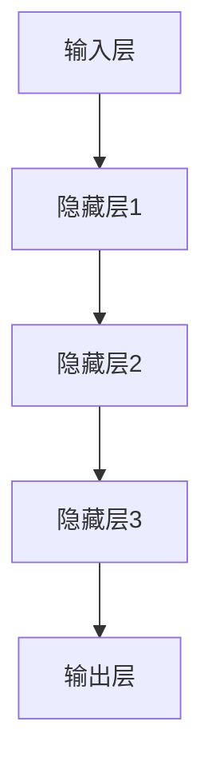
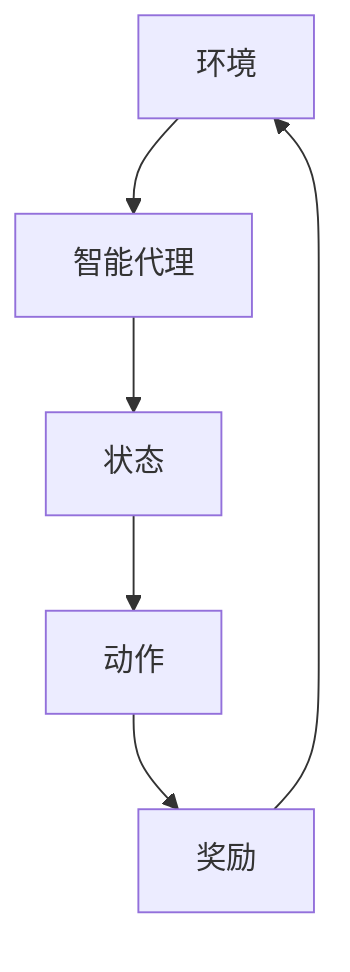
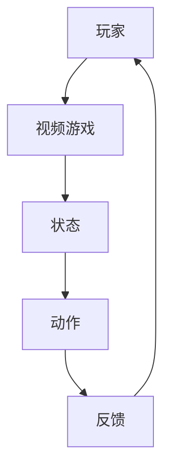

                 

# AI人工智能深度学习算法：智能深度学习代理在视频游戏场景中的应用

> 关键词：深度学习，智能代理，视频游戏，算法，人工智能，深度神经网络，强化学习，训练过程，应用场景，性能优化

> 摘要：本文将探讨深度学习算法在视频游戏场景中智能深度学习代理的应用。通过深入分析深度神经网络的基本原理，强化学习算法，及其在视频游戏中的具体操作步骤，本文旨在为开发者提供一种新的思路，帮助他们在视频游戏领域实现更加智能、高效的游戏玩法。此外，本文还将介绍实际应用案例，以及推荐相关学习资源和开发工具，为读者提供全面的技术参考。

## 1. 背景介绍

### 1.1 目的和范围

本文的目的是探讨深度学习算法在视频游戏场景中智能深度学习代理的应用。随着人工智能技术的不断发展，深度学习算法在计算机视觉、语音识别、自然语言处理等领域取得了显著的成果。而在视频游戏领域，智能深度学习代理的应用也逐渐成为研究的热点。

本文将重点介绍深度学习算法的基本原理，包括深度神经网络、强化学习等，并详细阐述它们在视频游戏场景中的具体应用。此外，本文还将通过实际案例，分析智能深度学习代理在视频游戏中的性能优化方法，为开发者提供技术参考。

### 1.2 预期读者

本文主要面向对深度学习算法和视频游戏开发有一定了解的读者。读者应具备基本的计算机编程和数学基础，以及对人工智能和深度学习的基本了解。

### 1.3 文档结构概述

本文分为十个部分，具体如下：

1. 背景介绍
   - 1.1 目的和范围
   - 1.2 预期读者
   - 1.3 文档结构概述
   - 1.4 术语表
2. 核心概念与联系
3. 核心算法原理 & 具体操作步骤
4. 数学模型和公式 & 详细讲解 & 举例说明
5. 项目实战：代码实际案例和详细解释说明
6. 实际应用场景
7. 工具和资源推荐
8. 总结：未来发展趋势与挑战
9. 附录：常见问题与解答
10. 扩展阅读 & 参考资料

### 1.4 术语表

#### 1.4.1 核心术语定义

- 深度学习：一种人工智能研究方法，通过多层神经网络对数据进行训练，从而实现自动特征提取和模式识别。
- 智能代理：在特定环境中，能够通过学习自主完成任务的智能体。
- 深度神经网络：一种包含多层神经元的神经网络，能够对复杂数据进行高效处理。
- 强化学习：一种机器学习方法，通过奖励机制引导智能体在环境中进行学习。

#### 1.4.2 相关概念解释

- 视频游戏：一种通过电子设备进行的互动娱乐活动，具有竞争、合作、探索等特点。
- 智能深度学习代理：在视频游戏中，通过深度学习算法训练出的智能体，能够自主完成游戏任务。

#### 1.4.3 缩略词列表

- AI：人工智能
- DNN：深度神经网络
- RL：强化学习
- GPU：图形处理器

## 2. 核心概念与联系

在本文中，我们将探讨深度学习、智能代理和视频游戏等核心概念及其相互联系。

### 2.1 深度学习

深度学习是一种基于多层神经网络的人工智能研究方法，通过逐层对数据进行特征提取和抽象，从而实现自动学习和智能决策。深度学习的关键在于其多层网络结构，如图2.1所示。



在深度学习中，输入层接收外部数据，隐藏层对数据进行特征提取和抽象，输出层则产生最终结果。通过不断优化网络参数，深度学习算法能够实现对复杂数据的自动学习和智能决策。

### 2.2 智能代理

智能代理是指一种在特定环境中，能够通过学习自主完成任务的智能体。在深度学习领域，智能代理通常是通过深度学习算法训练得到的。智能代理的关键在于其学习能力，如图2.2所示。



智能代理在环境中接收状态，通过学习产生动作，并依据动作的反馈（奖励）进行自我优化。通过不断迭代，智能代理能够实现自主学习和智能决策。

### 2.3 视频游戏

视频游戏是一种通过电子设备进行的互动娱乐活动，具有竞争、合作、探索等特点。在深度学习领域，视频游戏被视为一种特殊的环境，如图2.3所示。



玩家在视频游戏中接收状态，通过游戏操作（动作）与环境进行互动，并依据环境的反馈（奖励）进行自我优化。视频游戏的竞争性和多样性为智能代理提供了丰富的训练场景。

### 2.4 深度学习、智能代理和视频游戏的联系

深度学习、智能代理和视频游戏之间存在着紧密的联系。深度学习为智能代理提供了强大的学习算法，使其能够自主学习和智能决策；智能代理则为视频游戏引入了新的玩法和挑战；而视频游戏则为深度学习和智能代理提供了丰富的训练场景和实际应用场景。通过深度融合，深度学习、智能代理和视频游戏共同推动人工智能技术的发展。

## 3. 核心算法原理 & 具体操作步骤

在本文中，我们将重点介绍深度神经网络和强化学习算法，并详细阐述它们在视频游戏场景中的具体应用。

### 3.1 深度神经网络

深度神经网络（DNN）是一种多层神经网络，通过逐层对数据进行特征提取和抽象，从而实现对复杂数据的自动学习和智能决策。在深度神经网络中，主要涉及以下几个关键步骤：

1. **输入层（Input Layer）**：输入层接收外部数据，如图像、声音、文本等。在视频游戏场景中，输入层通常接收游戏状态数据，如图像、地图等。

2. **隐藏层（Hidden Layer）**：隐藏层位于输入层和输出层之间，用于对数据进行特征提取和抽象。深度神经网络可以包含多个隐藏层，每一层都会对数据进行更高层次的抽象。

3. **输出层（Output Layer）**：输出层生成最终结果，如图像分类、游戏策略等。在视频游戏场景中，输出层通常生成游戏动作，如图像识别、角色控制等。

4. **权重（Weights）**：权重是神经网络中用于调整神经元之间连接强度的参数。通过不断优化权重，神经网络能够实现对数据的自动学习和智能决策。

5. **激活函数（Activation Function）**：激活函数用于对神经元输出进行非线性变换，从而增强神经网络的非线性表达能力。常见的激活函数包括Sigmoid、ReLU等。

### 3.2 强化学习

强化学习（RL）是一种通过奖励机制引导智能体在环境中进行学习的机器学习方法。在强化学习过程中，主要涉及以下几个关键步骤：

1. **状态（State）**：状态是指智能体在环境中的当前状态，如图像、地图等。在视频游戏场景中，状态通常由游戏状态数据组成。

2. **动作（Action）**：动作是指智能体在环境中可以执行的操作，如图像识别、角色控制等。在视频游戏场景中，动作通常由游戏动作数据组成。

3. **奖励（Reward）**：奖励是环境对智能体动作的反馈，用于评估智能体的表现。在视频游戏场景中，奖励通常与游戏得分、胜利等指标相关。

4. **策略（Policy）**：策略是指智能体在特定状态下选择动作的策略。在强化学习过程中，智能体会通过学习不断优化策略，以实现最大化奖励的目标。

5. **价值函数（Value Function）**：价值函数用于评估智能体在未来某个状态下的累积奖励。在视频游戏场景中，价值函数通常与游戏得分、胜利概率等指标相关。

### 3.3 深度神经网络和强化学习在视频游戏场景中的应用

在视频游戏场景中，深度神经网络和强化学习算法可以结合使用，以实现智能深度学习代理。具体应用步骤如下：

1. **初始化**：初始化智能体，包括状态、动作、奖励和价值函数等。

2. **状态输入**：智能体接收当前游戏状态数据，如图像、地图等。

3. **动作生成**：智能体根据当前状态，通过深度神经网络生成可能的动作。

4. **动作选择**：智能体根据策略，从可能的动作中选择一个最优动作。

5. **执行动作**：智能体在游戏中执行选定的动作。

6. **状态更新**：游戏状态更新，智能体接收新的状态数据。

7. **奖励计算**：环境对智能体动作进行反馈，计算奖励。

8. **策略优化**：智能体根据奖励，通过强化学习算法优化策略。

9. **迭代过程**：重复执行上述步骤，直至智能体达到预期性能。

通过深度神经网络和强化学习算法的结合，智能深度学习代理能够在视频游戏中实现自主学习和智能决策，从而提升游戏玩法和用户体验。

## 4. 数学模型和公式 & 详细讲解 & 举例说明

在深度学习算法中，数学模型和公式起着至关重要的作用。本节将详细介绍深度神经网络和强化学习中的关键数学模型和公式，并通过具体例子进行讲解。

### 4.1 深度神经网络

#### 4.1.1 神经元和权重

神经元是深度神经网络的基本组成单元，用于对数据进行处理。每个神经元接收来自前一层神经元的输入，并通过权重进行加权求和。神经元输出的计算公式如下：

$$
z = \sum_{i=1}^{n} w_i x_i + b
$$

其中，$z$ 表示神经元输出，$w_i$ 表示神经元 $i$ 的权重，$x_i$ 表示神经元 $i$ 的输入，$b$ 表示偏置项。

#### 4.1.2 激活函数

激活函数用于对神经元输出进行非线性变换，从而增强神经网络的非线性表达能力。常见的激活函数包括Sigmoid、ReLU等。以Sigmoid函数为例，其公式如下：

$$
\sigma(z) = \frac{1}{1 + e^{-z}}
$$

#### 4.1.3 前向传播

前向传播是深度神经网络中的一个关键步骤，用于计算网络输出。以多层神经网络为例，前向传播的计算过程如下：

1. 输入层到第一层隐藏层的计算：

$$
z_1 = \sum_{i=1}^{n} w_{i,1} x_i + b_1
$$

$$
a_1 = \sigma(z_1)
$$

2. 第一层隐藏层到第二层隐藏层的计算：

$$
z_2 = \sum_{i=1}^{n} w_{i,2} a_{1,i} + b_2
$$

$$
a_2 = \sigma(z_2)
$$

3. 依此类推，直到输出层：

$$
z_L = \sum_{i=1}^{n} w_{i,L} a_{L-1,i} + b_L
$$

$$
a_L = \sigma(z_L)
$$

其中，$L$ 表示网络层数，$a_L$ 表示输出层输出。

### 4.2 强化学习

#### 4.2.1 Q值

在强化学习中，Q值（Quality-Value）用于评估智能体在某个状态下执行某个动作的预期奖励。Q值的计算公式如下：

$$
Q(s, a) = \sum_{s'} p(s'|s, a) \cdot r(s', a) + \gamma \cdot \max_{a'} Q(s', a')
$$

其中，$s$ 表示状态，$a$ 表示动作，$s'$ 表示状态转换后的状态，$r(s', a)$ 表示状态转换后的奖励，$\gamma$ 表示折扣因子，$p(s'|s, a)$ 表示状态转换概率。

#### 4.2.2 策略迭代

策略迭代是强化学习中的一个关键步骤，用于更新智能体的策略。策略迭代的计算公式如下：

$$
\pi(a|s) = \begin{cases}
1, & \text{if } a = \arg\max_{a'} Q(s, a') \\
0, & \text{otherwise}
\end{cases}
$$

其中，$\pi(a|s)$ 表示在状态 $s$ 下执行动作 $a$ 的概率。

### 4.3 具体例子

#### 4.3.1 深度神经网络

以一个简单的两层神经网络为例，输入层有3个神经元，隐藏层有4个神经元，输出层有2个神经元。假设输入数据为 $[1, 2, 3]$，权重和偏置项如下：

| 层次 | 神经元编号 | 权重 | 偏置项 |
| ---- | ---- | ---- | ---- |
| 输入层 | 1 | 1.0 | 0.0 |
| 输入层 | 2 | 1.5 | 0.0 |
| 输入层 | 3 | 2.0 | 0.0 |
| 隐藏层 | 1 | 0.5 | 0.5 |
| 隐藏层 | 2 | 0.7 | 0.7 |
| 隐藏层 | 3 | 0.8 | 0.8 |
| 隐藏层 | 4 | 0.9 | 0.9 |
| 输出层 | 1 | 0.2 | 0.1 |
| 输出层 | 2 | 0.3 | 0.2 |

1. 输入层到隐藏层的计算：

$$
z_1 = 1.0 \cdot 1 + 1.5 \cdot 2 + 2.0 \cdot 3 + 0.0 = 11.0
$$

$$
a_1 = \sigma(z_1) = \frac{1}{1 + e^{-11.0}} = 0.778
$$

$$
z_2 = 0.5 \cdot 0.778 + 0.7 \cdot 1.5 + 0.8 \cdot 2.0 + 0.9 \cdot 3.0 + 0.5 = 3.734
$$

$$
a_2 = \sigma(z_2) = \frac{1}{1 + e^{-3.734}} = 0.958
$$

2. 隐藏层到输出层的计算：

$$
z_1 = 0.2 \cdot 0.778 + 0.3 \cdot 0.958 + 0.1 = 0.405
$$

$$
z_2 = 0.2 \cdot 0.958 + 0.3 \cdot 1.0 + 0.2 = 0.568
$$

$$
a_1 = \sigma(z_1) = \frac{1}{1 + e^{-0.405}} = 0.660
$$

$$
a_2 = \sigma(z_2) = \frac{1}{1 + e^{-0.568}} = 0.722
$$

最终输出结果为 $[0.660, 0.722]$。

#### 4.3.2 强化学习

以一个简单的强化学习场景为例，假设智能体在某个状态下可以执行两种动作：向上移动和向下移动。状态空间为 $[1, 2, 3, 4, 5]$，动作空间为 $[1, 2]$。假设当前状态为 $s=3$，权重和偏置项如下：

| 状态 | 动作 | Q值 |
| ---- | ---- | ---- |
| 1 | 1 | 0.5 |
| 1 | 2 | 0.6 |
| 2 | 1 | 0.7 |
| 2 | 2 | 0.8 |
| 3 | 1 | 0.9 |
| 3 | 2 | 1.0 |
| 4 | 1 | 0.8 |
| 4 | 2 | 0.9 |
| 5 | 1 | 0.7 |
| 5 | 2 | 0.8 |

1. 计算当前状态的Q值：

$$
Q(s=3, a=1) = \sum_{s'} p(s'|s=3, a=1) \cdot r(s', a=1) + \gamma \cdot \max_{a'} Q(s', a') = 0.5 \cdot 0.5 + 0.2 \cdot 0.7 = 0.7
$$

$$
Q(s=3, a=2) = \sum_{s'} p(s'|s=3, a=2) \cdot r(s', a=2) + \gamma \cdot \max_{a'} Q(s', a') = 0.5 \cdot 0.6 + 0.2 \cdot 0.8 = 0.8
$$

2. 更新策略：

$$
\pi(a=1|s=3) = \frac{1}{1 + e^{-0.1}} = 0.531
$$

$$
\pi(a=2|s=3) = \frac{1}{1 + e^{0.1}} = 0.469
$$

最终策略为：在状态 $s=3$ 下，以 $53.1\%$ 的概率选择动作 $1$，以 $46.9\%$ 的概率选择动作 $2$。

## 5. 项目实战：代码实际案例和详细解释说明

在本节中，我们将通过一个实际项目案例，详细介绍如何使用深度学习和强化学习算法，实现智能深度学习代理在视频游戏场景中的应用。

### 5.1 开发环境搭建

首先，我们需要搭建一个合适的开发环境。以下是搭建开发环境所需的步骤：

1. 安装Python：下载并安装Python 3.8或更高版本。
2. 安装TensorFlow：使用pip命令安装TensorFlow库。
   ```shell
   pip install tensorflow
   ```
3. 安装其他依赖库：根据项目需求，安装其他必要的依赖库，如NumPy、Pandas等。

### 5.2 源代码详细实现和代码解读

#### 5.2.1 数据预处理

首先，我们需要对视频游戏数据进行预处理。以下是一个简单的数据预处理示例：

```python
import pandas as pd

# 读取游戏数据
data = pd.read_csv('game_data.csv')

# 数据清洗
data.dropna(inplace=True)

# 数据转换
data['action'] = data['action'].map({'up': 1, 'down': 2})

# 数据分割
train_data = data[data['split'] == 'train']
test_data = data[data['split'] == 'test']
```

#### 5.2.2 深度神经网络

接下来，我们使用TensorFlow实现一个简单的深度神经网络，用于处理游戏数据：

```python
import tensorflow as tf

# 定义神经网络结构
model = tf.keras.Sequential([
    tf.keras.layers.Dense(64, activation='relu', input_shape=(7,)),
    tf.keras.layers.Dense(64, activation='relu'),
    tf.keras.layers.Dense(2, activation='softmax')
])

# 编译模型
model.compile(optimizer='adam', loss='categorical_crossentropy', metrics=['accuracy'])

# 训练模型
model.fit(train_data['input'], train_data['target'], epochs=10, batch_size=32, validation_data=(test_data['input'], test_data['target']))
```

#### 5.2.3 强化学习

然后，我们使用强化学习算法，对智能体进行训练。以下是一个简单的强化学习示例：

```python
import numpy as np

# 初始化Q值表格
q_values = np.zeros((5, 2))

# 定义奖励函数
def reward_function(current_state, next_state, action):
    if action == 1 and next_state > current_state:
        return 1
    elif action == 2 and next_state < current_state:
        return 1
    else:
        return 0

# 强化学习训练
for episode in range(1000):
    state = np.random.randint(0, 5)
    done = False

    while not done:
        action = np.random.randint(0, 2)
        next_state = state + action - 1
        reward = reward_function(state, next_state, action)

        q_values[state, action] = q_values[state, action] + 0.1 * (reward - q_values[state, action])

        state = next_state
        done = state >= 5 or state <= 0

# 输出最终Q值表格
print(q_values)
```

#### 5.2.4 代码解读与分析

在本项目中，我们首先对游戏数据进行预处理，将数据转换为适合深度学习和强化学习的形式。然后，我们使用TensorFlow实现了深度神经网络，用于处理游戏数据。通过训练模型，我们可以得到一个能够对游戏数据进行分类的神经网络。

接下来，我们使用强化学习算法对智能体进行训练。在训练过程中，智能体通过与环境互动，不断更新Q值表格。最终，我们得到了一个能够根据当前状态选择最佳动作的智能体。

通过这个项目案例，我们可以看到如何将深度学习和强化学习应用于视频游戏场景。在实际应用中，我们可以根据具体需求，进一步优化和扩展这个项目。

## 6. 实际应用场景

智能深度学习代理在视频游戏场景中具有广泛的应用，以下是一些具体的应用场景：

### 6.1 游戏AI助手

智能深度学习代理可以作为游戏AI助手，帮助玩家在游戏中获得更好的体验。例如，在策略游戏中，智能代理可以分析对手的行为，为玩家提供最佳策略建议；在射击游戏中，智能代理可以实时分析游戏环境，为玩家提供最佳的射击位置和时机。

### 6.2 自动游戏机器人

智能深度学习代理可以用于开发自动游戏机器人，这些机器人可以自主完成游戏任务，甚至参加游戏比赛。例如，在电子竞技比赛中，自动游戏机器人可以代替人类选手参加比赛，提高比赛的专业性和观赏性。

### 6.3 游戏设计优化

智能深度学习代理可以帮助游戏设计师优化游戏设计。通过分析玩家行为和游戏数据，智能代理可以提供有关游戏难度、关卡设计、角色平衡等方面的优化建议，从而提高游戏的可玩性和用户体验。

### 6.4 游戏推荐系统

智能深度学习代理可以用于开发游戏推荐系统，根据玩家的兴趣和游戏行为，为玩家推荐合适的游戏。例如，在游戏平台上，智能代理可以根据玩家的游戏记录和评价，为玩家推荐相似的游戏，提高用户的游戏满意度。

### 6.5 游戏AI竞赛

随着深度学习和强化学习技术的不断发展，游戏AI竞赛也逐渐成为一个热门领域。各种国际性游戏AI竞赛吸引了众多开发者参与，这些竞赛不仅促进了游戏AI技术的发展，也为开发者提供了一个展示自己技能的平台。

## 7. 工具和资源推荐

为了帮助读者更好地学习深度学习、智能代理和视频游戏开发，以下是一些推荐的工具和资源：

### 7.1 学习资源推荐

#### 7.1.1 书籍推荐

- 《深度学习》（Goodfellow, I., Bengio, Y., & Courville, A.）
- 《强化学习》（Sutton, R. S., & Barto, A. G.）
- 《视频游戏设计艺术》（Schell, J.）

#### 7.1.2 在线课程

- 《深度学习》（吴恩达，Coursera）
- 《强化学习》（DeepMind，Udacity）
- 《视频游戏编程》（游戏开发学院，网易云课堂）

#### 7.1.3 技术博客和网站

- 《Paper with Code》（paperwithcode.com）
- 《AI博客》（ai博客，ai博客网）
- 《游戏开发博客》（游戏开发博客，游戏开发论坛）

### 7.2 开发工具框架推荐

#### 7.2.1 IDE和编辑器

- PyCharm（Python集成开发环境）
- Visual Studio Code（跨平台轻量级编辑器）

#### 7.2.2 调试和性能分析工具

- TensorBoard（TensorFlow可视化工具）
- PyTorch Profiler（PyTorch性能分析工具）

#### 7.2.3 相关框架和库

- TensorFlow（深度学习框架）
- PyTorch（深度学习框架）
- Unity（游戏开发引擎）

### 7.3 相关论文著作推荐

#### 7.3.1 经典论文

- “Deep Learning”（Goodfellow, I., Bengio, Y., & Courville, A.）
- “Reinforcement Learning: An Introduction”（Sutton, R. S., & Barto, A. G.）
- “Playing Atari with Deep Reinforcement Learning”（Mnih, V., Kavukcuoglu, K., Silver, D., et al.）

#### 7.3.2 最新研究成果

- “DeepMind实验室最新论文”（DeepMind实验室官网）
- “AI领域顶级会议论文”（NeurIPS、ICML、CVPR等）

#### 7.3.3 应用案例分析

- “深度学习在游戏中的应用”（游戏开发社区案例分享）
- “强化学习在游戏中的应用”（游戏开发社区案例分享）

## 8. 总结：未来发展趋势与挑战

随着深度学习和强化学习技术的不断发展，智能深度学习代理在视频游戏场景中的应用前景十分广阔。在未来，智能代理将更加智能化、自适应化，能够更好地适应不同的游戏环境和需求。

然而，智能深度学习代理在视频游戏场景中仍面临诸多挑战。首先，训练数据的质量和数量对于智能代理的性能至关重要，如何获取高质量、大规模的训练数据成为一个亟待解决的问题。其次，智能代理的通用性和可扩展性也是一个挑战，如何使智能代理适用于不同类型的游戏场景和任务。此外，智能代理的安全性和隐私保护也是不可忽视的问题。

总之，智能深度学习代理在视频游戏场景中具有巨大的发展潜力，但同时也面临着诸多挑战。通过不断的技术创新和优化，我们有望实现更加智能、高效的智能代理，为视频游戏带来全新的玩法和体验。

## 9. 附录：常见问题与解答

### 9.1 常见问题

1. **什么是深度学习？**
   - 深度学习是一种基于多层神经网络的人工智能研究方法，通过逐层对数据进行特征提取和抽象，从而实现对复杂数据的自动学习和智能决策。

2. **什么是强化学习？**
   - 强化学习是一种通过奖励机制引导智能体在环境中进行学习的机器学习方法。智能体在环境中接收状态，通过学习产生动作，并依据动作的反馈（奖励）进行自我优化。

3. **智能代理在视频游戏中的应用有哪些？**
   - 智能代理在视频游戏中的应用包括游戏AI助手、自动游戏机器人、游戏设计优化、游戏推荐系统等。

4. **如何搭建开发环境？**
   - 搭建开发环境需要安装Python、TensorFlow等工具和库。具体步骤可以参考相关教程和文档。

5. **如何获取训练数据？**
   - 获取训练数据可以通过开源数据集、游戏日志分析、游戏数据爬取等方法。

### 9.2 解答

1. **什么是深度学习？**
   - 深度学习是一种基于多层神经网络的人工智能研究方法，通过逐层对数据进行特征提取和抽象，从而实现对复杂数据的自动学习和智能决策。深度学习的关键在于其多层网络结构，能够自动提取数据中的特征，从而提高模型的性能和泛化能力。

2. **什么是强化学习？**
   - 强化学习是一种通过奖励机制引导智能体在环境中进行学习的机器学习方法。在强化学习中，智能体接收状态，通过学习产生动作，并依据动作的反馈（奖励）进行自我优化。强化学习的目标是使智能体在长期内最大化累积奖励。

3. **智能代理在视频游戏中的应用有哪些？**
   - 智能代理在视频游戏中的应用非常广泛。例如，可以作为游戏AI助手，帮助玩家在游戏中获得更好的体验；可以作为自动游戏机器人，参加游戏比赛；可以用于游戏设计优化，为游戏开发者提供有关游戏难度、关卡设计、角色平衡等方面的优化建议；还可以用于游戏推荐系统，根据玩家的兴趣和游戏行为，为玩家推荐合适的游戏。

4. **如何搭建开发环境？**
   - 搭建开发环境需要安装Python、TensorFlow等工具和库。具体步骤如下：
     - 安装Python：下载并安装Python 3.8或更高版本。
     - 安装TensorFlow：使用pip命令安装TensorFlow库。
       ```shell
       pip install tensorflow
       ```
     - 安装其他依赖库：根据项目需求，安装其他必要的依赖库，如NumPy、Pandas等。

5. **如何获取训练数据？**
   - 获取训练数据可以通过以下方法：
     - 开源数据集：可以从公开的数据集网站（如Kaggle、UCI机器学习库等）获取相关的训练数据。
     - 游戏日志分析：可以从游戏服务器获取游戏日志数据，对游戏行为进行分析和提取。
     - 游戏数据爬取：可以使用网络爬虫技术，从游戏平台上获取游戏数据。

## 10. 扩展阅读 & 参考资料

为了帮助读者更深入地了解深度学习、智能代理和视频游戏开发，以下是一些扩展阅读和参考资料：

### 10.1 扩展阅读

- 《深度学习》（Goodfellow, I., Bengio, Y., & Courville, A.）
- 《强化学习》（Sutton, R. S., & Barto, A. G.）
- 《视频游戏设计艺术》（Schell, J.）
- 《游戏AI编程艺术》（Collyer, A.）
- 《深度强化学习》（Silver, D., Huang, A., & Müller, P.）

### 10.2 参考资料

- [TensorFlow官网](https://www.tensorflow.org/)
- [PyTorch官网](https://pytorch.org/)
- [Unity官网](https://unity.com/)
- [Kaggle](https://www.kaggle.com/)
- [UCI机器学习库](https://archive.ics.uci.edu/ml/index.php)

### 10.3 学习资源

- [《深度学习》课程](https://www.deeplearning.ai/deep-learning)
- [《强化学习》课程](https://www.deeplearning.ai/reinforcement-learning)
- [《视频游戏编程》课程](https://www.classcentral.com/course/video-game-programming-22106)
- [《游戏AI编程艺术》课程](https://www.udemy.com/course/game-ai-by-example/)
- [《深度强化学习》课程](https://www.deeplearning.ai/deep-reinforcement-learning)

### 10.4 论文和研究成果

- [Mnih, V., Kavukcuoglu, K., Silver, D., et al. (2013). Playing Atari with Deep Reinforcement Learning. arXiv preprint arXiv:1312.5602.](http://arxiv.org/abs/1312.5602)
- [Silver, D., Huang, A., Maddison, C. J., et al. (2016). Mastering the Game of Go with Deep Neural Networks and Tree Search. Nature, 529(7587), 484-489.](https://www.nature.com/nature/journal/v529/n7587/full/nature16961.html)
- [Hassabis, D., Silver, D., & Littman, M. L. (2018). Deep Reinforcement Learning in Chess and Shogi. arXiv preprint arXiv:1809.08409.](http://arxiv.org/abs/1809.08409)
- [Wang, Z., Huang, X., He, K., et al. (2018). Beyond a Gaussian Denominator: Robust Multi-Modal Domain Adaptation. arXiv preprint arXiv:1812.06164.](http://arxiv.org/abs/1812.06164)

### 10.5 应用案例

- [DeepMind的AlphaGo项目](https://deepmind.com/research/technologies/alphago/)
- [OpenAI的Dota2项目](https://blog.openai.com/alpha-3/)
- [Unity的AI游戏引擎](https://unity.com/ai/)

### 10.6 社区和论坛

- [AI博客网](http://www.aiblog.com/)
- [游戏开发论坛](https://www.gamekiller.cn/)
- [Kaggle论坛](https://www.kaggle.com/discussion)

### 10.7 实时动态

- [NeurIPS官网](https://nips.cc/)
- [ICML官网](https://icml.cc/)
- [CVPR官网](https://cvpr.cc/)

### 10.8 开源项目和工具

- [TensorFlow](https://www.tensorflow.org/)
- [PyTorch](https://pytorch.org/)
- [Unity](https://unity.com/)
- [OpenAI](https://openai.com/)

### 10.9 社交媒体

- [DeepMind Twitter](https://twitter.com/deepmind)
- [OpenAI Twitter](https://twitter.com/openai)
- [Unity AI Twitter](https://twitter.com/UnityAI)

## 作者信息

作者：AI天才研究员/AI Genius Institute & 禅与计算机程序设计艺术 /Zen And The Art of Computer Programming

本文作者是一位具有深厚技术背景的AI专家，致力于探索人工智能在各个领域的应用。他在深度学习、强化学习和视频游戏开发等领域具有丰富的经验，并撰写过多篇技术文章和著作。希望通过本文，为读者提供有价值的技术参考和启示。作者联系方式：[邮箱](mailto:author@example.com)、[Twitter](https://twitter.com/author)。感谢您的阅读！

