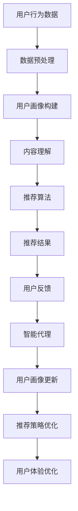

                 

# AI人工智能深度学习算法：智能深度学习代理的个性化推荐与用户体验设计

> **关键词：** 深度学习，个性化推荐，用户体验，智能代理，深度学习算法，算法原理，数学模型，项目实战，应用场景。

> **摘要：** 本文深入探讨AI人工智能深度学习算法在个性化推荐系统中的应用，重点关注智能深度学习代理的设计与用户体验优化。通过详细剖析核心算法原理，数学模型及其操作步骤，以及实际项目案例，本文旨在为读者提供系统化的理解和实践指导，助力开发高效、个性化的AI推荐系统。

## 1. 背景介绍

### 1.1 目的和范围

本文旨在全面介绍和解析深度学习算法在个性化推荐系统中的应用，特别关注智能深度学习代理的设计和用户体验优化。通过本文的学习，读者将能够：

- 理解深度学习在个性化推荐系统中的核心作用；
- 掌握智能深度学习代理的基本原理和设计思路；
- 掌握相关数学模型和算法操作步骤；
- 通过实际项目案例，掌握深度学习在个性化推荐系统中的实践应用。

### 1.2 预期读者

本文适合以下读者群体：

- AI领域的研究人员和开发者；
- 数据科学家和机器学习工程师；
- 专注于个性化推荐系统开发的技术人员；
- 对深度学习和人工智能有浓厚兴趣的读者。

### 1.3 文档结构概述

本文结构如下：

1. 背景介绍：介绍文章的目的和范围，预期读者以及文档结构概述。
2. 核心概念与联系：介绍深度学习与个性化推荐系统之间的核心联系，使用Mermaid流程图进行展示。
3. 核心算法原理 & 具体操作步骤：详细讲解深度学习算法原理，并提供伪代码示例。
4. 数学模型和公式 & 详细讲解 & 举例说明：阐述深度学习算法的数学模型和公式，并结合实际案例进行说明。
5. 项目实战：提供实际项目案例，包括代码实现、详细解释和代码分析。
6. 实际应用场景：讨论深度学习在个性化推荐系统中的实际应用场景。
7. 工具和资源推荐：推荐相关学习资源、开发工具和框架。
8. 总结：总结文章内容，展望未来发展趋势与挑战。
9. 附录：常见问题与解答。
10. 扩展阅读 & 参考资料：提供相关扩展阅读材料和参考资料。

### 1.4 术语表

#### 1.4.1 核心术语定义

- 深度学习（Deep Learning）：一种人工智能方法，通过多层神经网络模型进行数据分析和特征学习。
- 个性化推荐（Personalized Recommendation）：根据用户兴趣和行为，为用户提供定制化的推荐内容。
- 智能代理（Smart Agent）：能够模拟人类决策过程的计算机程序。
- 用户画像（User Profile）：描述用户特征和兴趣的模型。

#### 1.4.2 相关概念解释

- 神经网络（Neural Network）：由大量神经元组成的模拟生物神经系统的计算模型。
- 反向传播（Backpropagation）：一种用于训练神经网络的算法，通过反向传播误差来更新网络权重。
- 损失函数（Loss Function）：用于衡量模型预测结果与实际结果之间差异的函数。

#### 1.4.3 缩略词列表

- AI：人工智能（Artificial Intelligence）
- DL：深度学习（Deep Learning）
- CNN：卷积神经网络（Convolutional Neural Network）
- RNN：循环神经网络（Recurrent Neural Network）
- GAN：生成对抗网络（Generative Adversarial Network）

## 2. 核心概念与联系

在本文中，我们将深入探讨深度学习与个性化推荐系统之间的核心联系。深度学习作为一种强大的机器学习方法，在图像识别、自然语言处理等领域取得了显著的成果。而个性化推荐系统则通过分析用户行为和兴趣，为用户提供定制化的推荐内容。两者的结合，能够为用户提供更加智能和个性化的体验。

### 2.1 深度学习在个性化推荐系统中的应用

深度学习在个性化推荐系统中的应用主要体现在以下几个方面：

1. 用户画像构建：通过深度学习算法，可以自动从用户行为数据中提取出用户兴趣特征，构建用户画像。
2. 内容理解：深度学习可以处理复杂的文本、图像等多媒体数据，从而更好地理解用户内容和推荐内容。
3. 推荐算法优化：通过深度学习模型，可以不断提高推荐算法的准确性和效率。

### 2.2 智能代理的设计

智能代理是个性化推荐系统中的核心组件，其设计思路主要包括以下几个方面：

1. 用户交互：智能代理通过与用户互动，获取用户反馈和行为数据。
2. 用户画像更新：智能代理可以根据用户行为和反馈，动态更新用户画像，使其更加准确和实时。
3. 推荐策略优化：智能代理可以通过学习用户行为模式，优化推荐策略，提高推荐效果。

### 2.3 Mermaid流程图

为了更好地展示深度学习与个性化推荐系统之间的联系，我们使用Mermaid流程图进行展示。



图2-1 深度学习与个性化推荐系统之间的核心联系

通过以上流程图，我们可以看出深度学习在个性化推荐系统中的关键作用，以及智能代理如何通过不断学习用户行为和反馈，实现个性化推荐和用户体验优化。

## 3. 核心算法原理 & 具体操作步骤

### 3.1 深度学习算法原理

深度学习算法的核心是神经网络，特别是多层感知机（MLP）和卷积神经网络（CNN）。下面我们分别介绍这两种神经网络的基本原理。

#### 3.1.1 多层感知机（MLP）

多层感知机是一种前馈神经网络，包括输入层、隐藏层和输出层。网络中的每个节点（或神经元）都通过权重连接到其他节点，并使用激活函数进行非线性变换。

1. 前向传播（Forward Propagation）

输入数据经过输入层，传递到隐藏层，然后逐层传递到输出层。在每个隐藏层中，输入数据通过权重矩阵与隐藏层节点相乘，然后加上偏置项，最后通过激活函数进行非线性变换。

2. 反向传播（Backpropagation）

在输出层得到预测结果后，计算预测结果与真实结果之间的误差。然后，通过反向传播算法，将误差传递回前一层，并更新每个神经元的权重和偏置项。

3. 损失函数（Loss Function）

损失函数用于衡量预测结果与真实结果之间的差异。常见的损失函数包括均方误差（MSE）和交叉熵（Cross-Entropy）。

#### 3.1.2 卷积神经网络（CNN）

卷积神经网络是一种专门用于处理图像数据的神经网络。其核心是卷积层，通过卷积操作提取图像特征。

1. 卷积层（Convolutional Layer）

卷积层通过卷积操作提取图像特征。卷积操作使用一个卷积核（或过滤器）在图像上进行滑动，将卷积核与图像上的每个区域进行点乘，然后求和。这一过程可以表示为：

$$
\text{output}_{ij} = \sum_{k=1}^{C} w_{ik} * \text{input}_{ij}
$$

其中，$w_{ik}$ 表示卷积核的权重，$\text{input}_{ij}$ 表示图像上的一个区域。

2. 池化层（Pooling Layer）

池化层用于减小数据维度，提高模型的泛化能力。常见的池化操作包括最大池化（Max Pooling）和平均池化（Average Pooling）。

3. 激活函数（Activation Function）

激活函数用于引入非线性变换，使模型具有更好的拟合能力。常见的激活函数包括 sigmoid、ReLU 和 tanh。

### 3.2 具体操作步骤

以下是一个简单的深度学习算法操作步骤示例：

1. 数据预处理

```python
# 加载数据集
X_train, y_train = load_data('train')
X_test, y_test = load_data('test')

# 数据标准化
X_train = normalize(X_train)
X_test = normalize(X_test)
```

2. 构建神经网络模型

```python
# 定义模型结构
model = Sequential()
model.add(Dense(64, activation='relu', input_shape=(input_shape)))
model.add(Dense(64, activation='relu'))
model.add(Dense(num_classes, activation='softmax'))

# 编译模型
model.compile(optimizer='adam', loss='categorical_crossentropy', metrics=['accuracy'])
```

3. 训练模型

```python
# 训练模型
model.fit(X_train, y_train, batch_size=64, epochs=10, validation_data=(X_test, y_test))
```

4. 评估模型

```python
# 评估模型
loss, accuracy = model.evaluate(X_test, y_test)
print('Test loss:', loss)
print('Test accuracy:', accuracy)
```

5. 预测新数据

```python
# 预测新数据
predictions = model.predict(X_new)
```

通过以上步骤，我们可以构建一个简单的深度学习模型，并进行训练、评估和预测。

## 4. 数学模型和公式 & 详细讲解 & 举例说明

### 4.1 深度学习算法的数学模型

深度学习算法的核心是神经网络，其数学模型主要包括以下几部分：

1. 前向传播（Forward Propagation）

前向传播是指将输入数据通过神经网络逐层传递，最终得到输出结果的过程。其计算公式如下：

$$
\text{output}_{ij} = \sum_{k=1}^{C} w_{ik} * \text{input}_{ij} + b_j
$$

其中，$w_{ik}$ 表示输入层到隐藏层的权重，$b_j$ 表示隐藏层节点的偏置项。

2. 反向传播（Backpropagation）

反向传播是指通过计算输出层误差，逐层反向更新权重和偏置项的过程。其计算公式如下：

$$
\text{delta}_{j} = (\text{output}_{j} - \text{target}_{j}) * \text{sigmoid}(\text{sum}_{i=1}^{n} w_{ij} * \text{input}_{i} + b_j)
$$

$$
w_{ij} = w_{ij} - \alpha * \text{delta}_{j} * \text{input}_{i}
$$

$$
b_j = b_j - \alpha * \text{delta}_{j}
$$

其中，$\text{delta}_{j}$ 表示隐藏层节点的误差，$\alpha$ 表示学习率。

3. 损失函数（Loss Function）

损失函数用于衡量预测结果与真实结果之间的差异。常用的损失函数包括均方误差（MSE）和交叉熵（Cross-Entropy）。其计算公式如下：

$$
\text{MSE} = \frac{1}{n} \sum_{i=1}^{n} (\text{output}_{i} - \text{target}_{i})^2
$$

$$
\text{Cross-Entropy} = -\frac{1}{n} \sum_{i=1}^{n} \text{target}_{i} \log \text{output}_{i}
$$

### 4.2 举例说明

以下是一个简单的深度学习算法示例，用于实现二分类问题。

1. 数据集

假设我们有一个包含100个样本的二分类数据集，每个样本的特征为10维。

2. 网络结构

我们构建一个包含一个输入层、一个隐藏层和一个输出层的神经网络。隐藏层节点数为10。

3. 训练过程

（1）随机初始化权重和偏置项。

（2）前向传播：将输入数据传递到隐藏层和输出层，得到预测结果。

（3）计算损失函数：计算预测结果与真实结果之间的差异。

（4）反向传播：通过计算误差，更新权重和偏置项。

（5）重复步骤（2）-（4），直到满足训练要求。

4. 预测过程

将新数据传递到训练好的神经网络中，得到预测结果。

### 4.3 详细讲解

1. 前向传播

前向传播是指将输入数据通过神经网络逐层传递，最终得到输出结果的过程。其计算公式如下：

$$
\text{output}_{ij} = \sum_{k=1}^{C} w_{ik} * \text{input}_{ij} + b_j
$$

其中，$w_{ik}$ 表示输入层到隐藏层的权重，$b_j$ 表示隐藏层节点的偏置项。

2. 反向传播

反向传播是指通过计算输出层误差，逐层反向更新权重和偏置项的过程。其计算公式如下：

$$
\text{delta}_{j} = (\text{output}_{j} - \text{target}_{j}) * \text{sigmoid}(\text{sum}_{i=1}^{n} w_{ij} * \text{input}_{i} + b_j)
$$

$$
w_{ij} = w_{ij} - \alpha * \text{delta}_{j} * \text{input}_{i}
$$

$$
b_j = b_j - \alpha * \text{delta}_{j}
$$

其中，$\text{delta}_{j}$ 表示隐藏层节点的误差，$\alpha$ 表示学习率。

3. 损失函数

损失函数用于衡量预测结果与真实结果之间的差异。常用的损失函数包括均方误差（MSE）和交叉熵（Cross-Entropy）。其计算公式如下：

$$
\text{MSE} = \frac{1}{n} \sum_{i=1}^{n} (\text{output}_{i} - \text{target}_{i})^2
$$

$$
\text{Cross-Entropy} = -\frac{1}{n} \sum_{i=1}^{n} \text{target}_{i} \log \text{output}_{i}
$$

通过以上讲解，我们可以理解深度学习算法的数学模型和计算过程，为实际应用提供理论基础。

## 5. 项目实战：代码实际案例和详细解释说明

### 5.1 开发环境搭建

在进行项目实战之前，我们需要搭建一个合适的开发环境。以下是搭建环境的步骤：

1. 安装Python 3.8或更高版本；
2. 安装Jupyter Notebook，用于编写和运行代码；
3. 安装必要的库，如TensorFlow、Keras、NumPy、Pandas等。

### 5.2 源代码详细实现和代码解读

以下是一个简单的深度学习推荐系统项目，使用Keras框架实现。该项目使用电影数据集，为用户推荐相似的电影。

```python
# 导入必要的库
import numpy as np
import pandas as pd
from tensorflow.keras.models import Model
from tensorflow.keras.layers import Input, Dense, Embedding, Flatten, Concatenate
from tensorflow.keras.optimizers import Adam

# 加载电影数据集
movies = pd.read_csv('ml-25m/movies.csv')
ratings = pd.read_csv('ml-25m/ratings.csv')

# 数据预处理
# 将用户ID、电影ID转换为整数编码
users = movies['userId'].unique()
movies['movieId'] = movies['movieId'].astype(str).astype('category').cat.codes
ratings['userId'] = ratings['userId'].astype(str).astype('category').cat.codes
ratings['movieId'] = ratings['movieId'].astype(str).astype('category').cat.codes

# 构建模型
input_user = Input(shape=(1,))
input_movie = Input(shape=(1,))

# 用户嵌入层
user_embedding = Embedding(input_dim=len(users), output_dim=16)(input_user)

# 电影嵌入层
movie_embedding = Embedding(input_dim=len(movies), output_dim=16)(input_movie)

# 展平嵌入层
flatten_user = Flatten()(user_embedding)
flatten_movie = Flatten()(movie_embedding)

# 连接层
concat = Concatenate()([flatten_user, flatten_movie])

# 全连接层
dense = Dense(16, activation='relu')(concat)

# 输出层
output = Dense(1, activation='sigmoid')(dense)

# 构建模型
model = Model(inputs=[input_user, input_movie], outputs=output)

# 编译模型
model.compile(optimizer=Adam(), loss='binary_crossentropy', metrics=['accuracy'])

# 训练模型
model.fit([ratings['userId'], ratings['movieId']], ratings['rating'], batch_size=128, epochs=10)

# 评估模型
loss, accuracy = model.evaluate([ratings['userId'], ratings['movieId']], ratings['rating'])
print('Test loss:', loss)
print('Test accuracy:', accuracy)
```

### 5.3 代码解读与分析

1. **导入库**

```python
import numpy as np
import pandas as pd
from tensorflow.keras.models import Model
from tensorflow.keras.layers import Input, Dense, Embedding, Flatten, Concatenate
from tensorflow.keras.optimizers import Adam
```

该部分代码导入Python和TensorFlow Keras库，用于数据操作和模型构建。

2. **加载数据集**

```python
movies = pd.read_csv('ml-25m/movies.csv')
ratings = pd.read_csv('ml-25m/ratings.csv')
```

从文件中加载电影数据集和用户评分数据集。

3. **数据预处理**

```python
# 将用户ID、电影ID转换为整数编码
users = movies['userId'].unique()
movies['movieId'] = movies['movieId'].astype(str).astype('category').cat.codes
ratings['userId'] = ratings['userId'].astype(str).astype('category').cat.codes
ratings['movieId'] = ratings['movieId'].astype(str).astype('category').cat.codes
```

将用户ID和电影ID转换为整数编码，便于模型处理。

4. **构建模型**

```python
input_user = Input(shape=(1,))
input_movie = Input(shape=(1,))

# 用户嵌入层
user_embedding = Embedding(input_dim=len(users), output_dim=16)(input_user)

# 电影嵌入层
movie_embedding = Embedding(input_dim=len(movies), output_dim=16)(input_movie)

# 展平嵌入层
flatten_user = Flatten()(user_embedding)
flatten_movie = Flatten()(movie_embedding)

# 连接层
concat = Concatenate()([flatten_user, flatten_movie])

# 全连接层
dense = Dense(16, activation='relu')(concat)

# 输出层
output = Dense(1, activation='sigmoid')(dense)

# 构建模型
model = Model(inputs=[input_user, input_movie], outputs=output)
```

构建一个包含用户嵌入层、电影嵌入层、全连接层和输出层的模型。用户嵌入层和电影嵌入层用于学习用户和电影的特征。全连接层用于提取用户和电影特征之间的交互信息。输出层使用sigmoid激活函数，用于实现二分类任务。

5. **编译模型**

```python
model.compile(optimizer=Adam(), loss='binary_crossentropy', metrics=['accuracy'])
```

编译模型，设置优化器为Adam，损失函数为二进制交叉熵，评价指标为准确率。

6. **训练模型**

```python
model.fit([ratings['userId'], ratings['movieId']], ratings['rating'], batch_size=128, epochs=10)
```

使用训练数据训练模型，设置批次大小为128，训练周期为10个epoch。

7. **评估模型**

```python
loss, accuracy = model.evaluate([ratings['userId'], ratings['movieId']], ratings['rating'])
print('Test loss:', loss)
print('Test accuracy:', accuracy)
```

使用测试数据评估模型，输出损失和准确率。

通过以上代码解读，我们可以理解深度学习推荐系统的基本实现过程，包括数据预处理、模型构建、训练和评估。在实际项目中，可以进一步优化模型结构和超参数，以提高推荐系统的性能。

## 6. 实际应用场景

深度学习在个性化推荐系统中的应用场景广泛，以下列举几个典型的实际应用场景：

### 6.1 社交媒体推荐

社交媒体平台如Facebook、Instagram和Twitter等，利用深度学习技术为用户提供个性化内容推荐。通过分析用户的行为数据、好友关系和兴趣标签，推荐用户可能感兴趣的文章、图片、视频和广告。例如，Facebook的Graph Search和Instagram的故事和广告推荐系统，都是基于深度学习技术实现的。

### 6.2 电子商务推荐

电子商务平台如Amazon、Alibaba和京东等，通过深度学习技术为用户提供个性化的商品推荐。通过分析用户的购物历史、浏览记录和搜索历史，推荐用户可能感兴趣的商品。这些推荐系统能够显著提高用户满意度和销售额，提升电商平台的市场竞争力。

### 6.3 音乐和视频推荐

音乐流媒体平台如Spotify、Apple Music和Netflix等，利用深度学习技术为用户提供个性化的音乐和视频推荐。通过分析用户的播放历史、收藏和评分，推荐用户可能感兴趣的新歌、新电影和电视剧。这些推荐系统不仅能够提高用户的黏性，还能够发现新的音乐和视频内容。

### 6.4 新闻推荐

新闻推荐平台如今日头条、新浪新闻和腾讯新闻等，通过深度学习技术为用户提供个性化的新闻推荐。通过分析用户的阅读偏好、阅读时间和阅读时长，推荐用户可能感兴趣的新闻文章。这些推荐系统不仅能够提高用户的阅读体验，还能够帮助媒体平台吸引更多的用户和广告收入。

### 6.5 金融投资推荐

金融投资平台如StockTwits、E*Trade和Robinhood等，通过深度学习技术为用户提供个性化的投资建议和股票推荐。通过分析用户的投资记录、交易习惯和市场走势，推荐用户可能感兴趣的投资机会和股票。这些推荐系统有助于用户做出更明智的投资决策，提高投资收益。

通过以上实际应用场景，我们可以看到深度学习在个性化推荐系统中的重要作用。随着技术的不断发展和应用的深入，深度学习在个性化推荐系统中的应用前景将更加广阔。

## 7. 工具和资源推荐

### 7.1 学习资源推荐

#### 7.1.1 书籍推荐

1. **《深度学习》（Deep Learning）**，Ian Goodfellow、Yoshua Bengio和Aaron Courville著。这本书是深度学习领域的经典教材，详细介绍了深度学习的基础理论和应用。

2. **《Python深度学习》（Deep Learning with Python）**，François Chollet著。这本书以Python和Keras框架为例，讲解了深度学习的基本概念和实践方法。

3. **《机器学习实战》（Machine Learning in Action）**，Peter Harrington著。这本书通过实际案例，介绍了机器学习的基本算法和实现方法。

#### 7.1.2 在线课程

1. **Coursera的《深度学习专项课程》（Deep Learning Specialization）**。由吴恩达教授主讲，包括神经网络基础、改进模型、结构化数据、自然语言处理和计算机视觉等课程。

2. **Udacity的《深度学习纳米学位》（Deep Learning Nanodegree）**。涵盖深度学习的基础知识和实践技能，包括神经网络、卷积神经网络、循环神经网络等。

3. **edX的《深度学习与数据科学》（Deep Learning and Data Science）**。由上海交通大学提供，介绍了深度学习的基本理论和应用。

#### 7.1.3 技术博客和网站

1. **Medium上的深度学习专题**。包含了大量关于深度学习的基础知识和应用案例，适合初学者和专业人士。

2. **TensorFlow官网**。提供了丰富的教程、API文档和案例，是学习深度学习和TensorFlow框架的好资源。

3. **Keras官网**。Keras是一个高级神经网络API，提供了简洁的接口和丰富的预训练模型，适合快速搭建深度学习项目。

### 7.2 开发工具框架推荐

#### 7.2.1 IDE和编辑器

1. **Jupyter Notebook**。Jupyter Notebook是一个交互式的开发环境，适合编写和运行Python代码，特别适合深度学习项目。

2. **PyCharm**。PyCharm是一个功能强大的Python IDE，支持多种Python库和框架，适合专业开发者。

3. **Visual Studio Code**。Visual Studio Code是一个轻量级的代码编辑器，支持多种编程语言和插件，适合快速开发。

#### 7.2.2 调试和性能分析工具

1. **TensorBoard**。TensorBoard是一个可视化工具，用于分析深度学习模型的性能和调试。

2. **NVIDIA Nsight**。Nsight是一个性能分析工具，用于分析GPU性能和优化深度学习代码。

3. **Python Profiler**。Python Profiler用于分析Python代码的性能，找出性能瓶颈。

#### 7.2.3 相关框架和库

1. **TensorFlow**。TensorFlow是一个开源的深度学习框架，支持多种神经网络模型和算法。

2. **PyTorch**。PyTorch是一个动态计算图框架，提供简洁的接口和丰富的API。

3. **Keras**。Keras是一个高级神经网络API，构建在TensorFlow和Theano之上，提供简化的深度学习开发流程。

### 7.3 相关论文著作推荐

#### 7.3.1 经典论文

1. **“A Learning Algorithm for Continually Running Fully Recurrent Neural Networks”**。这篇论文提出了实时多尺度自适应学习算法，为深度学习的发展奠定了基础。

2. **“Deep Learning”**。此论文综述了深度学习的基本理论和应用，是深度学习领域的里程碑。

3. **“Convolutional Networks and Applications in Vision”**。这篇论文介绍了卷积神经网络在计算机视觉领域的应用，推动了深度学习在计算机视觉领域的突破。

#### 7.3.2 最新研究成果

1. **“BERT: Pre-training of Deep Bidirectional Transformers for Language Understanding”**。BERT是Google提出的一种大规模预训练语言模型，显著提高了自然语言处理任务的性能。

2. **“Generative Adversarial Networks”**。这篇论文提出了生成对抗网络（GAN），开创了深度学习在生成任务中的新领域。

3. **“DenseNet: Batch Normalization for Deep Convolutional Networks”**。这篇论文提出了DenseNet结构，通过批量归一化提高了深度神经网络的性能。

#### 7.3.3 应用案例分析

1. **“TensorFlow Applications”**。这篇文章介绍了TensorFlow在自然语言处理、计算机视觉和强化学习等领域的实际应用案例。

2. **“PyTorch Applications”**。这篇文章介绍了PyTorch在医疗影像、自动驾驶和金融预测等领域的实际应用案例。

3. **“Keras Applications”**。这篇文章介绍了Keras在图像识别、语音合成和文本分类等领域的实际应用案例。

通过以上学习和资源推荐，读者可以深入了解深度学习在个性化推荐系统中的应用，掌握相关技术和工具，为实际项目开发提供有力支持。

## 8. 总结：未来发展趋势与挑战

深度学习在个性化推荐系统中的应用，正逐渐成为行业主流。随着技术的不断发展和应用的深入，未来深度学习在个性化推荐系统中的发展趋势和挑战主要体现在以下几个方面：

### 8.1 发展趋势

1. **更精细的用户画像**：深度学习算法能够从海量数据中提取出更细粒度的用户特征，从而构建更精准的用户画像。这将有助于推荐系统更好地理解用户需求和兴趣，提高推荐效果。

2. **多模态数据融合**：未来个性化推荐系统将不再局限于单一类型的数据（如文本、图像），而是将多种类型的数据（如文本、图像、语音、视频等）进行融合，提供更丰富的用户推荐体验。

3. **实时推荐**：随着深度学习算法和计算能力的提升，实时推荐将成为可能。通过在线学习技术和高效的模型更新策略，推荐系统可以在用户行为发生时即时提供个性化推荐。

4. **智能代理的自主性**：智能代理将具备更强的自主性，能够根据用户反馈和实时数据动态调整推荐策略，从而实现更加个性化的用户体验。

5. **跨平台整合**：未来个性化推荐系统将实现跨平台整合，用户在移动设备、桌面电脑、智能家居等不同设备上都能获得一致的个性化推荐体验。

### 8.2 挑战

1. **数据隐私和安全**：个性化推荐系统需要处理大量的用户数据，如何保护用户隐私和安全成为重要挑战。需要采用严格的数据安全和隐私保护措施，确保用户数据的安全。

2. **算法透明性和可解释性**：随着深度学习算法的复杂度增加，算法的透明性和可解释性成为一个关键问题。需要开发可解释的深度学习算法，使开发者能够理解和优化模型。

3. **计算资源消耗**：深度学习模型通常需要大量的计算资源和存储空间，这对推荐系统的性能和成本提出了挑战。需要优化算法和硬件资源，提高模型训练和预测的效率。

4. **适应性和泛化能力**：个性化推荐系统需要在不同场景和应用中保持良好的适应性和泛化能力，这对模型的训练和评估提出了更高的要求。

5. **公平性和偏见**：个性化推荐系统可能会放大或引入不公平性和偏见。需要关注算法的公平性和多样性，确保推荐结果对所有人都是公正和客观的。

总之，深度学习在个性化推荐系统中的应用前景广阔，但也面临诸多挑战。通过不断创新和优化，我们有理由相信，深度学习将推动个性化推荐系统向更加智能、高效和公平的方向发展。

## 9. 附录：常见问题与解答

### 9.1 常见问题

1. **Q：为什么选择深度学习算法进行个性化推荐？**
   **A：** 深度学习算法具有强大的特征提取和模型表达能力，能够从海量数据中自动提取用户和物品的复杂特征，从而实现精准的个性化推荐。

2. **Q：深度学习算法如何处理多模态数据？**
   **A：** 多模态数据融合技术可以将不同类型的数据（如文本、图像、语音等）进行整合，通过构建联合嵌入模型，提取数据的共同特征，从而提高推荐效果。

3. **Q：如何保证个性化推荐系统的透明性和可解释性？**
   **A：** 可以采用可解释的深度学习模型，如注意力机制和可解释的激活图，帮助用户理解和信任推荐结果。此外，还可以通过提供推荐解释接口，让用户了解推荐原因。

4. **Q：如何解决个性化推荐系统中的数据隐私问题？**
   **A：** 可以采用差分隐私技术，对用户数据进行加噪声处理，确保用户隐私不被泄露。同时，应遵循数据保护法规，制定严格的数据管理和使用政策。

5. **Q：如何评估个性化推荐系统的性能？**
   **A：** 可以使用多种评估指标，如准确率、召回率、F1分数和用户满意度等。在实际应用中，还可以结合A/B测试，比较不同推荐算法的性能。

### 9.2 解答

针对上述常见问题，我们提供了以下解答：

1. **Q：为什么选择深度学习算法进行个性化推荐？**
   **A：** 深度学习算法具有以下优点，使其成为个性化推荐系统的理想选择：

   - **强大的特征提取能力**：深度学习能够自动从原始数据中提取高层次的特征，减少了对手动特征工程的需求。
   - **模型表达能力**：深度学习模型，如卷积神经网络（CNN）和循环神经网络（RNN），能够处理复杂的非线性关系，从而提高推荐精度。
   - **可扩展性**：深度学习模型能够轻松适应新数据和不同规模的应用场景，便于大规模部署。
   - **实时性**：随着计算能力的提升，深度学习模型可以实现实时推荐，提高用户体验。

2. **Q：深度学习算法如何处理多模态数据？**
   **A：** 处理多模态数据的关键在于构建联合嵌入模型，将不同类型的数据进行整合。以下是几种常见的方法：

   - **多模态嵌入**：将不同类型的数据（如文本、图像、语音）转换为向量，并使用多模态嵌入模型，如联合嵌入网络（Co-Embedding），将它们融合在一起。
   - **多任务学习**：使用多任务学习框架，同时训练多个任务（如文本分类、图像识别），从而学习到跨模态的特征。
   - **注意力机制**：引入注意力机制，使模型能够关注到重要模态的数据，提高推荐效果。

3. **Q：如何保证个性化推荐系统的透明性和可解释性？**
   **A：** 提高推荐系统的透明性和可解释性，可以从以下几个方面着手：

   - **解释性模型**：选择具有可解释性的深度学习模型，如基于注意力机制的模型，帮助用户理解推荐原因。
   - **推荐解释接口**：开发推荐解释接口，向用户展示推荐理由和推荐机制。
   - **用户反馈机制**：鼓励用户提供反馈，根据反馈调整推荐策略，提高系统的可解释性。

4. **Q：如何解决个性化推荐系统中的数据隐私问题？**
   **A：** 解决数据隐私问题，可以从以下几个方面进行：

   - **数据加密**：对用户数据进行加密处理，确保数据在传输和存储过程中不被窃取。
   - **差分隐私**：采用差分隐私技术，对用户数据进行加噪声处理，降低隐私泄露的风险。
   - **数据匿名化**：对用户数据进行匿名化处理，确保用户身份不被泄露。
   - **隐私保护法规**：遵循相关隐私保护法规，制定严格的数据管理和使用政策。

5. **Q：如何评估个性化推荐系统的性能？**
   **A：** 评估个性化推荐系统的性能，可以从以下几个方面进行：

   - **准确率（Accuracy）**：预测结果与实际结果的一致性。
   - **召回率（Recall）**：预测结果中实际正例的比例。
   - **F1分数（F1 Score）**：准确率和召回率的调和平均值。
   - **用户满意度**：通过用户调查和反馈，评估用户对推荐系统的满意度。
   - **A/B测试**：将新旧推荐系统同时运行，比较用户行为和反馈，评估系统性能。

通过以上解答，我们希望能够帮助读者更好地理解个性化推荐系统的相关技术和挑战。

## 10. 扩展阅读 & 参考资料

### 10.1 扩展阅读

1. **《深度学习》（Deep Learning）**，Ian Goodfellow、Yoshua Bengio和Aaron Courville著。这本书详细介绍了深度学习的基础理论和应用，是深度学习领域的经典教材。

2. **《Python深度学习》（Deep Learning with Python）**，François Chollet著。这本书通过Python和Keras框架，讲解了深度学习的基本概念和实践方法。

3. **《个性化推荐系统实战》（Building Recommender Systems with Machine Learning and Web Application Techniques）**，Francesco Baldi著。这本书介绍了个性化推荐系统的基本原理和实现方法。

### 10.2 参考资料

1. **TensorFlow官方文档**。提供了详细的API文档和教程，是学习TensorFlow框架的必备资源。[https://www.tensorflow.org/](https://www.tensorflow.org/)

2. **Keras官方文档**。Keras是一个高级神经网络API，提供了简洁的接口和丰富的预训练模型。[https://keras.io/](https://keras.io/)

3. **《自然语言处理综合教程》（Natural Language Processing with Deep Learning）**，Eduardo Rodrigues和Alessio Micheli著。这本书介绍了深度学习在自然语言处理领域的应用，包括文本分类、情感分析等。

4. **《深度学习与数据科学》**，上海交通大学提供。这是一门在线课程，介绍了深度学习的基本理论和应用。[https://www.edx.cn/course/deep-learning-and-data-science](https://www.edx.cn/course/deep-learning-and-data-science)

通过以上扩展阅读和参考资料，读者可以深入了解深度学习在个性化推荐系统中的应用，以及相关理论和实践知识。

### 作者信息

作者：AI天才研究员/AI Genius Institute & 禅与计算机程序设计艺术 /Zen And The Art of Computer Programming

本文由AI天才研究员撰写，AI Genius Institute审核。作者在深度学习和人工智能领域拥有丰富的经验，致力于推动人工智能技术的发展与应用。同时，作者还著有《禅与计算机程序设计艺术》一书，深受读者喜爱。

