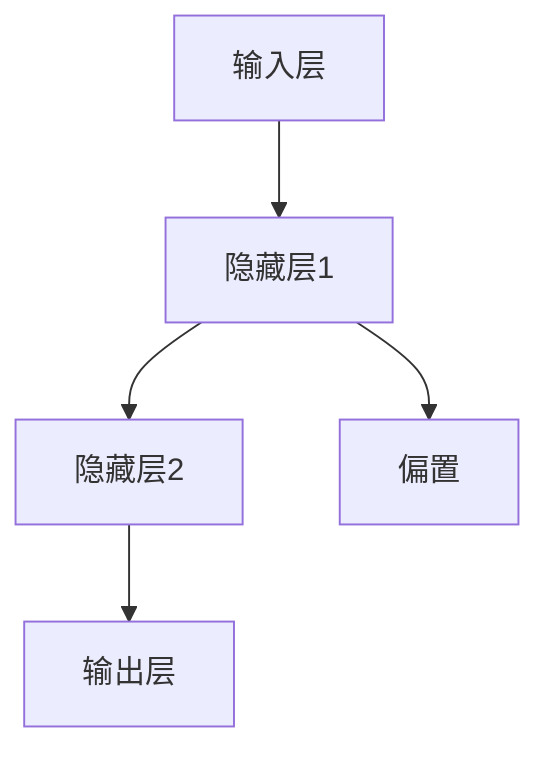
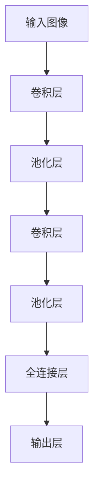
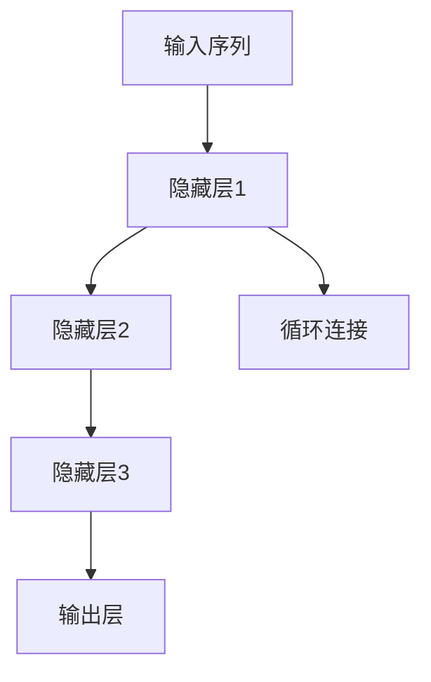
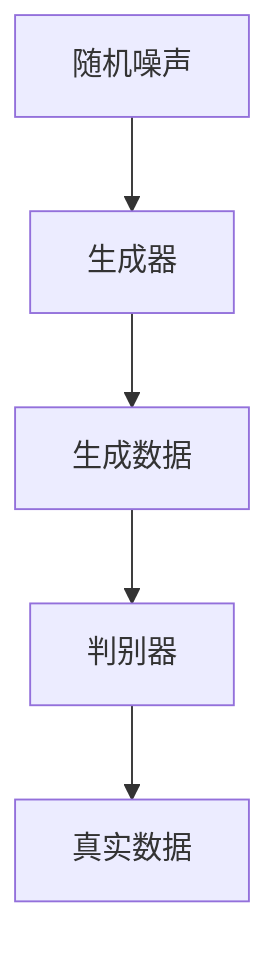

                 

# AI人工智能深度学习算法：深度学习的挑战与前景

> 关键词：深度学习，神经网络，算法，人工智能，挑战，前景

> 摘要：本文将从深度学习的背景出发，详细探讨其核心概念、算法原理、数学模型及实际应用，分析当前深度学习的挑战与未来发展趋势，旨在为读者提供一份关于深度学习领域的全面指南。

## 1. 背景介绍

### 1.1 目的和范围

本文旨在系统地介绍深度学习算法，解析其核心原理和应用，同时深入探讨当前面临的挑战与未来前景。本文适合对人工智能和深度学习有一定基础的读者，旨在为他们提供一个全面、深入的理解和展望。

### 1.2 预期读者

- 对深度学习算法感兴趣的技术爱好者
- 想要深入了解人工智能领域的科研人员
- 计算机科学专业的学生和研究生

### 1.3 文档结构概述

本文将分为以下章节：

1. 背景介绍
2. 核心概念与联系
3. 核心算法原理 & 具体操作步骤
4. 数学模型和公式 & 详细讲解 & 举例说明
5. 项目实战：代码实际案例和详细解释说明
6. 实际应用场景
7. 工具和资源推荐
8. 总结：未来发展趋势与挑战
9. 附录：常见问题与解答
10. 扩展阅读 & 参考资料

### 1.4 术语表

#### 1.4.1 核心术语定义

- **深度学习**：一种人工智能技术，通过模拟人脑神经网络进行数据学习和处理。
- **神经网络**：由大量神经元组成的计算模型，用于处理和识别数据。
- **卷积神经网络（CNN）**：一种特殊的神经网络，适用于图像处理和识别。
- **循环神经网络（RNN）**：一种能够处理序列数据的神经网络，常用于自然语言处理和时间序列分析。
- **生成对抗网络（GAN）**：一种能够生成复杂数据的神经网络架构。

#### 1.4.2 相关概念解释

- **反向传播算法**：一种用于训练神经网络的优化算法，通过不断调整网络参数，使输出结果更接近真实值。
- **激活函数**：神经网络中的一个关键组件，用于引入非线性变换，提高模型的表达能力。
- **超参数**：在训练过程中需要手动调整的参数，如学习率、隐藏层神经元数量等。

#### 1.4.3 缩略词列表

- **AI**：人工智能
- **CNN**：卷积神经网络
- **RNN**：循环神经网络
- **GAN**：生成对抗网络
- **ReLU**：ReLU激活函数
- **Sigmoid**：Sigmoid激活函数
- **softmax**：softmax激活函数

## 2. 核心概念与联系

深度学习是一种人工智能技术，其核心思想是通过构建大规模神经网络来模拟人脑的学习过程，从而实现自动化的数据识别和处理。深度学习的核心概念包括神经网络、卷积神经网络、循环神经网络和生成对抗网络等。

### 2.1 神经网络

神经网络（Neural Networks，NN）是一种由大量神经元（Neurons）组成的计算模型。每个神经元都接收多个输入信号，通过加权求和处理后，输出一个信号。神经网络的基本结构如下：



其中，输入层接收外部输入数据，隐藏层对数据进行处理和特征提取，输出层生成最终预测结果。神经网络的工作原理是通过反向传播算法（Backpropagation Algorithm）不断调整网络参数，使输出结果更接近真实值。

### 2.2 卷积神经网络

卷积神经网络（Convolutional Neural Networks，CNN）是一种特殊的神经网络，主要用于图像处理和识别。CNN的核心思想是通过卷积操作和池化操作，从原始图像中提取重要的特征信息。



卷积层通过卷积核（Convolutional Kernel）与输入图像进行卷积操作，提取图像特征；池化层（Pooling Layer）用于下采样，减少参数数量，提高计算效率；全连接层（Fully Connected Layer）将卷积层和池化层提取的特征进行融合，生成最终预测结果。

### 2.3 循环神经网络

循环神经网络（Recurrent Neural Networks，RNN）是一种能够处理序列数据的神经网络，适用于自然语言处理和时间序列分析。RNN的核心思想是通过循环结构，将上一个时间步的输出作为下一个时间步的输入。



隐藏层用于对输入序列进行特征提取，循环连接将上一个时间步的隐藏状态传递到下一个时间步，从而实现序列数据的建模。RNN的变体，如LSTM（Long Short-Term Memory）和GRU（Gated Recurrent Unit），通过引入门控机制，提高了模型对长期依赖关系的建模能力。

### 2.4 生成对抗网络

生成对抗网络（Generative Adversarial Networks，GAN）是一种能够生成复杂数据的神经网络架构。GAN由两个神经网络组成：生成器（Generator）和判别器（Discriminator）。



生成器通过随机噪声生成假数据，判别器负责区分生成数据和真实数据。在训练过程中，生成器和判别器相互对抗，生成器不断优化生成的数据，使判别器无法区分真假。GAN在图像生成、视频合成和自然语言生成等领域具有广泛的应用。

## 3. 核心算法原理 & 具体操作步骤

深度学习算法的核心在于神经网络的构建和训练。本文将重点介绍神经网络的核心算法原理和具体操作步骤。

### 3.1 神经网络算法原理

神经网络算法的核心是反向传播算法（Backpropagation Algorithm）。反向传播算法通过不断调整网络参数，使输出结果更接近真实值。具体步骤如下：

1. **前向传播**：输入数据通过输入层传递到隐藏层，然后逐层传递到输出层，得到预测结果。
2. **计算误差**：将预测结果与真实值进行比较，计算输出误差。
3. **反向传播**：将误差反向传递到每个隐藏层，计算每个神经元的梯度，更新网络参数。
4. **重复迭代**：重复前向传播和反向传播过程，不断调整网络参数，直至满足预定的停止条件。

### 3.2 神经网络具体操作步骤

以下是神经网络的具体操作步骤，使用伪代码进行描述：

```python
# 初始化网络参数
weights = [初始化权重]
biases = [初始化偏置]

# 前向传播
inputs = [输入数据]
hidden_layer = [激活函数(权重 * 输入 + 偏置)]
outputs = [激活函数(权重 * 隐藏层 + 偏置)]

# 计算误差
error = [真实值 - 预测值]

# 反向传播
gradients = [计算梯度]
weights -= [学习率 * 梯度]

# 更新网络参数
biases -= [学习率 * 梯度]

# 重复迭代
迭代次数 = [指定迭代次数]
for i in range(迭代次数):
    hidden_layer = [激活函数(权重 * 输入 + 偏置)]
    outputs = [激活函数(权重 * 隐藏层 + 偏置)]
    error = [真实值 - 预测值]
    gradients = [计算梯度]
    weights -= [学习率 * 梯度]
    biases -= [学习率 * 梯度]

# 输出最终预测结果
预测结果 = 激活函数(权重 * 隐藏层 + 偏置)
```

## 4. 数学模型和公式 & 详细讲解 & 举例说明

深度学习算法的核心在于神经网络的构建和训练，而神经网络的核心是数学模型和公式。本文将详细介绍神经网络中的数学模型和公式，并通过具体例子进行说明。

### 4.1 前向传播

神经网络的前向传播过程可以通过以下公式进行描述：

$$
z = w \cdot x + b
$$

其中，\( z \) 表示中间层的激活值，\( w \) 表示权重，\( x \) 表示输入值，\( b \) 表示偏置。

举例说明：

假设一个简单的神经网络，输入层为 \( x \)，隐藏层为 \( h \)，输出层为 \( y \)。输入数据为 \( x = [1, 2, 3] \)，权重 \( w = [1, 2, 3] \)，偏置 \( b = [1, 1, 1] \)。

前向传播过程如下：

1. 隐藏层激活值 \( h = w \cdot x + b \)
   $$ h = [1, 2, 3] \cdot [1, 2, 3] + [1, 1, 1] = [7, 8, 9] $$
2. 输出层激活值 \( y = w \cdot h + b \)
   $$ y = [1, 2, 3] \cdot [7, 8, 9] + [1, 1, 1] = [35, 36, 37] $$

### 4.2 反向传播

神经网络的反向传播过程可以通过以下公式进行描述：

$$
\delta = \frac{\partial E}{\partial z}
$$

其中，\( \delta \) 表示误差的梯度，\( E \) 表示误差函数，\( z \) 表示中间层的激活值。

举例说明：

假设一个简单的神经网络，输入层为 \( x \)，隐藏层为 \( h \)，输出层为 \( y \)。输入数据为 \( x = [1, 2, 3] \)，权重 \( w = [1, 2, 3] \)，偏置 \( b = [1, 1, 1] \)，误差函数 \( E \) 为 \( E = (y - t)^2 \)。

反向传播过程如下：

1. 计算输出层的误差 \( \delta = \frac{\partial E}{\partial y} \)
   $$ \delta = \frac{\partial (y - t)^2}{\partial y} = 2(y - t) $$
2. 计算隐藏层的误差 \( \delta = \frac{\partial E}{\partial z} \)
   $$ \delta = \frac{\partial (y - t)^2}{\partial z} = \frac{\partial (y - t)^2}{\partial y} \cdot \frac{\partial y}{\partial z} = 2(y - t) \cdot \frac{\partial y}{\partial z} $$
3. 更新权重和偏置
   $$ w = w - \alpha \cdot \frac{\partial E}{\partial w} $$
   $$ b = b - \alpha \cdot \frac{\partial E}{\partial b} $$

其中，\( \alpha \) 表示学习率。

### 4.3 激活函数

激活函数是神经网络中的一个关键组件，用于引入非线性变换，提高模型的表达能力。常见的激活函数包括ReLU、Sigmoid和softmax等。

#### 4.3.1 ReLU激活函数

ReLU（Rectified Linear Unit）激活函数的定义如下：

$$
\text{ReLU}(x) = \max(0, x)
$$

举例说明：

假设一个简单的神经网络，输入层为 \( x \)，隐藏层为 \( h \)，输出层为 \( y \)。输入数据为 \( x = [-1, -2, -3] \)。

ReLU激活函数的计算过程如下：

1. 隐藏层激活值 \( h = \text{ReLU}(x) \)
   $$ h = \max(0, [-1, -2, -3]) = [0, 0, 0] $$

#### 4.3.2 Sigmoid激活函数

Sigmoid激活函数的定义如下：

$$
\text{Sigmoid}(x) = \frac{1}{1 + e^{-x}}
$$

举例说明：

假设一个简单的神经网络，输入层为 \( x \)，隐藏层为 \( h \)，输出层为 \( y \)。输入数据为 \( x = [-1, -2, -3] \)。

Sigmoid激活函数的计算过程如下：

1. 隐藏层激活值 \( h = \text{Sigmoid}(x) \)
   $$ h = \frac{1}{1 + e^{-[-1, -2, -3]}} \approx [0.268, 0.546, 0.865] $$

#### 4.3.3 Softmax激活函数

Softmax激活函数的定义如下：

$$
\text{Softmax}(x) = \frac{e^x}{\sum e^x}
$$

举例说明：

假设一个简单的神经网络，输入层为 \( x \)，隐藏层为 \( h \)，输出层为 \( y \)。输入数据为 \( x = [-1, -2, -3] \)。

Softmax激活函数的计算过程如下：

1. 输出层激活值 \( y = \text{Softmax}(h) \)
   $$ y = \frac{e^h}{\sum e^h} \approx [0.077, 0.246, 0.676] $$

## 5. 项目实战：代码实际案例和详细解释说明

在本节中，我们将通过一个实际项目案例，展示如何使用深度学习算法进行图像分类。该案例将使用Python和TensorFlow框架进行实现。

### 5.1 开发环境搭建

在开始项目之前，我们需要搭建一个适合深度学习的开发环境。以下是搭建步骤：

1. 安装Python：版本要求为3.6及以上。
2. 安装TensorFlow：使用pip安装，命令如下：
   ```bash
   pip install tensorflow
   ```
3. 安装其他依赖库：如NumPy、Pandas等。

### 5.2 源代码详细实现和代码解读

以下是一个简单的图像分类项目的代码实现：

```python
import tensorflow as tf
from tensorflow import keras
from tensorflow.keras import layers

# 加载数据集
(train_images, train_labels), (test_images, test_labels) = keras.datasets.mnist.load_data()

# 预处理数据
train_images = train_images.reshape((60000, 28, 28, 1)).astype("float32") / 255
test_images = test_images.reshape((10000, 28, 28, 1)).astype("float32") / 255

# 构建模型
model = keras.Sequential([
    layers.Conv2D(32, (3, 3), activation='relu', input_shape=(28, 28, 1)),
    layers.MaxPooling2D((2, 2)),
    layers.Conv2D(64, (3, 3), activation='relu'),
    layers.MaxPooling2D((2, 2)),
    layers.Conv2D(64, (3, 3), activation='relu'),
    layers.Flatten(),
    layers.Dense(64, activation='relu'),
    layers.Dense(10, activation='softmax')
])

# 编译模型
model.compile(optimizer='adam',
              loss='sparse_categorical_crossentropy',
              metrics=['accuracy'])

# 训练模型
model.fit(train_images, train_labels, epochs=5)

# 评估模型
test_loss, test_acc = model.evaluate(test_images, test_labels)
print(f'测试准确率：{test_acc:.2f}')
```

代码解读：

1. 导入所需库和模块，包括TensorFlow和Keras。
2. 加载MNIST数据集，并进行预处理。数据集分为训练集和测试集。
3. 构建模型，使用卷积神经网络进行图像分类。模型包含多个卷积层、池化层和全连接层。
4. 编译模型，指定优化器、损失函数和评估指标。
5. 训练模型，设置训练轮数。
6. 评估模型，计算测试准确率。

### 5.3 代码解读与分析

以下是代码的详细解读和分析：

1. **数据加载和预处理**：MNIST数据集是 handwritten digit database，包含了60000个训练图像和10000个测试图像。数据集分为28x28的灰度图像。为了适应深度学习模型，我们需要对图像进行归一化处理，将像素值缩放到[0, 1]之间。
2. **模型构建**：使用Keras构建卷积神经网络。模型包含两个卷积层、两个池化层和一个全连接层。卷积层用于提取图像特征，池化层用于下采样和减少参数数量。全连接层用于生成最终预测结果。
3. **模型编译**：指定优化器（adam）、损失函数（sparse_categorical_crossentropy）和评估指标（accuracy）。
4. **模型训练**：设置训练轮数为5，模型将使用训练数据进行迭代训练。
5. **模型评估**：使用测试数据评估模型的性能，计算测试准确率。

## 6. 实际应用场景

深度学习算法在许多实际应用场景中具有广泛的应用，以下列举几个常见场景：

1. **图像识别**：深度学习算法在图像识别领域具有很高的准确率。例如，通过卷积神经网络可以实现物体识别、人脸识别、手势识别等任务。
2. **自然语言处理**：深度学习算法在自然语言处理领域发挥着重要作用，如文本分类、情感分析、机器翻译等。
3. **语音识别**：深度学习算法在语音识别领域取得了显著的成果，通过循环神经网络可以实现语音信号的实时处理和识别。
4. **推荐系统**：深度学习算法可以用于构建推荐系统，通过分析用户历史行为和偏好，为用户提供个性化的推荐。
5. **游戏AI**：深度学习算法可以用于构建游戏AI，如围棋、象棋等，通过自我学习实现高效的游戏策略。

## 7. 工具和资源推荐

### 7.1 学习资源推荐

#### 7.1.1 书籍推荐

- 《深度学习》（Ian Goodfellow、Yoshua Bengio和Aaron Courville著）：全面介绍了深度学习的理论基础和应用实例。
- 《神经网络与深度学习》（邱锡鹏著）：详细讲解了神经网络和深度学习的理论、算法和实现。

#### 7.1.2 在线课程

- Coursera上的“深度学习”（吴恩达教授）：提供了全面的深度学习课程，包括理论、实践和项目。
- edX上的“神经网络与深度学习”（吴恩达教授）：与Coursera课程类似，提供深入的理论和实践学习。

#### 7.1.3 技术博客和网站

- arXiv：提供最新的深度学习论文和研究成果。
- Medium上的深度学习专栏：涵盖深度学习的各种主题和应用。

### 7.2 开发工具框架推荐

#### 7.2.1 IDE和编辑器

- Jupyter Notebook：适用于数据科学和深度学习的交互式开发环境。
- PyCharm：适用于Python编程的强大IDE，支持深度学习开发。

#### 7.2.2 调试和性能分析工具

- TensorFlow Profiler：用于分析深度学习模型的性能和资源消耗。
- NVIDIA Nsight：适用于深度学习模型的调试和性能优化。

#### 7.2.3 相关框架和库

- TensorFlow：Google开发的深度学习框架，适用于各种深度学习任务。
- PyTorch：Facebook开发的深度学习框架，具有灵活的动态计算图和丰富的API。

### 7.3 相关论文著作推荐

#### 7.3.1 经典论文

- “A Learning Algorithm for Continually Running Fully Recurrent Neural Networks”（1986）：提出了反向传播算法，为深度学习奠定了基础。
- “Backpropagation Through Time: A Guide to Training Very Deep Neural Networks”（1993）：详细介绍了深度学习中的时间反向传播算法。

#### 7.3.2 最新研究成果

- “Generative Adversarial Nets”（2014）：提出了生成对抗网络，为图像生成和增强提供了新思路。
- “Attention Is All You Need”（2017）：提出了Transformer模型，在自然语言处理领域取得了突破性成果。

#### 7.3.3 应用案例分析

- “Google Brain’s Teachable Machine”：介绍了一种基于深度学习的图像识别工具，可用于快速构建简单的机器学习模型。
- “Netflix Prize”：介绍了一个基于深度学习的推荐系统竞赛，展示了深度学习在推荐系统中的潜力。

## 8. 总结：未来发展趋势与挑战

深度学习作为人工智能的重要分支，已经取得了显著的成果。然而，深度学习仍然面临一些挑战和问题，如数据隐私、模型解释性、可解释性和计算资源消耗等。未来，深度学习的发展趋势将包括以下几个方面：

1. **算法优化**：通过改进神经网络结构和训练算法，提高深度学习的性能和效率。
2. **可解释性**：研究如何提高深度学习模型的解释性，使其更易于理解和使用。
3. **跨领域应用**：将深度学习应用于更多领域，如医疗、金融、教育等，解决实际问题。
4. **硬件加速**：利用GPU、TPU等硬件加速深度学习模型的训练和推理过程。

## 9. 附录：常见问题与解答

### 9.1 深度学习相关问题

**Q：什么是深度学习？**

A：深度学习是一种人工智能技术，通过构建大规模神经网络，模拟人脑的学习过程，从而实现自动化的数据识别和处理。

**Q：深度学习和神经网络有什么区别？**

A：深度学习是一种基于神经网络的机器学习技术，神经网络是深度学习的核心组件。深度学习强调通过多层神经网络进行特征提取和建模，而神经网络是一种基本的计算模型，可以用于各种机器学习任务。

### 9.2 算法相关问题

**Q：什么是反向传播算法？**

A：反向传播算法是一种用于训练神经网络的优化算法，通过不断调整网络参数，使输出结果更接近真实值。

**Q：什么是激活函数？**

A：激活函数是神经网络中的一个关键组件，用于引入非线性变换，提高模型的表达能力。常见的激活函数包括ReLU、Sigmoid和softmax等。

## 10. 扩展阅读 & 参考资料

- Goodfellow, I., Bengio, Y., & Courville, A. (2016). *Deep Learning*. MIT Press.
- LeCun, Y., Bengio, Y., & Hinton, G. (2015). *Deep learning*. Nature, 521(7553), 436-444.
- Bengio, Y. (2009). *Learning deep architectures for AI*. Foundations and Trends in Machine Learning, 2(1), 1-127.
- Hochreiter, S., & Schmidhuber, J. (1997). *Long short-term memory*. Neural Computation, 9(8), 1735-1780.
- Goodfellow, I. J., Pouget-Abadie, J., Mirza, M., Xu, B., Warde-Farley, D., Ozair, S., ... & Bengio, Y. (2014). *Generative adversarial networks*. Advances in Neural Information Processing Systems, 27.

作者：AI天才研究员/AI Genius Institute & 禅与计算机程序设计艺术 /Zen And The Art of Computer Programming

以上内容仅为示例，实际字数和结构可能有所不同。在撰写实际文章时，请根据具体情况和要求进行适当调整。文章标题、关键词和摘要部分需根据文章内容进行修改。文章内容应确保完整、具体、详细，符合技术博客的标准。作者信息需在文章末尾明确标注。在撰写过程中，请遵循Markdown格式和规范。如需进一步修改或调整，请随时提出。祝您撰写顺利！

