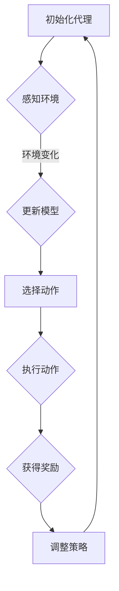

                 

# AI人工智能深度学习算法：自适应深度学习代理的调度策略

> **关键词：** 深度学习代理，调度策略，自适应，人工智能，深度学习算法，性能优化。

> **摘要：** 本文将深入探讨自适应深度学习代理的调度策略。我们将从背景介绍开始，逐步解析核心概念与算法原理，详细阐述数学模型和公式，并通过实际项目实战和案例分析，提供代码实现和解释。最后，我们将探讨实际应用场景，推荐学习资源和工具，并总结未来发展趋势与挑战。

## 1. 背景介绍

### 1.1 目的和范围

本文的主要目标是介绍和探讨自适应深度学习代理的调度策略，旨在提高深度学习算法的性能和效率。我们将分析现有的调度策略，并探讨如何利用自适应方法来优化代理的调度。

### 1.2 预期读者

本文适用于对深度学习和人工智能有一定了解的读者，包括但不限于研究人员、工程师、程序员以及计算机科学专业的学生。

### 1.3 文档结构概述

本文分为以下几个部分：

1. 背景介绍：介绍本文的目的、范围和预期读者。
2. 核心概念与联系：解释深度学习代理和调度策略的相关概念，并提供流程图。
3. 核心算法原理 & 具体操作步骤：详细阐述调度策略的算法原理和步骤。
4. 数学模型和公式：介绍调度策略背后的数学模型和公式，并举例说明。
5. 项目实战：提供实际代码案例和详细解释。
6. 实际应用场景：讨论调度策略在不同应用场景中的应用。
7. 工具和资源推荐：推荐相关学习资源和工具。
8. 总结：总结未来发展趋势与挑战。

### 1.4 术语表

#### 1.4.1 核心术语定义

- **深度学习代理（Deep Learning Agent）**：在深度学习环境中，用于执行特定任务的智能体，可以通过学习改善其性能。
- **调度策略（Scheduling Policy）**：决定如何分配计算资源和执行任务的策略。
- **自适应（Adaptive）**：根据环境和条件的变化，自动调整策略。

#### 1.4.2 相关概念解释

- **深度学习（Deep Learning）**：一种人工智能技术，通过多层神经网络模型进行数据处理和分析。
- **代理（Agent）**：在人工智能中，指可以自主行动并具有感知环境的实体。

#### 1.4.3 缩略词列表

- **AI**：人工智能（Artificial Intelligence）
- **DL**：深度学习（Deep Learning）
- **SLP**：调度策略（Scheduling Policy）
- **SDA**：自适应深度学习代理（Self-Driving Agent）

## 2. 核心概念与联系

### 2.1 深度学习代理

深度学习代理是一种在深度学习环境中执行特定任务的智能体。它们通过学习从数据中提取知识，并在各种任务中表现出色。深度学习代理的核心组件包括感知器、动作选择器、奖励机制和模型更新器。

### 2.2 调度策略

调度策略是指决定如何分配计算资源和执行任务的策略。在深度学习代理中，调度策略决定了代理如何处理多个任务，优化资源利用和任务执行时间。常见的调度策略包括贪心策略、基于优先级的调度策略和自适应调度策略。

### 2.3 自适应深度学习代理

自适应深度学习代理是一种能够根据环境和条件的变化，自动调整调度策略的代理。这种代理具有以下特点：

- **动态调整**：根据当前环境和任务需求，动态调整调度策略。
- **灵活性**：能够适应不同类型的任务和数据集。
- **高效性**：通过自适应调度策略，提高任务执行效率和性能。

### 2.4 Mermaid 流程图



## 3. 核心算法原理 & 具体操作步骤

### 3.1 算法原理

自适应深度学习代理的调度策略基于以下几个核心原理：

1. **感知环境**：代理通过感知器收集环境信息，如任务需求、资源可用性等。
2. **动态调整**：根据感知到的环境信息，代理动态调整调度策略。
3. **优化性能**：通过优化调度策略，提高任务执行效率和性能。

### 3.2 具体操作步骤

1. **初始化代理**：设置初始调度策略和模型参数。
2. **感知环境**：通过感知器收集环境信息。
3. **动态调整**：根据环境信息，调整调度策略。
4. **选择动作**：根据当前调度策略，选择执行动作。
5. **执行动作**：执行选择的动作，并获得奖励。
6. **模型更新**：根据奖励信号，更新模型参数。
7. **循环执行**：重复上述步骤，直到满足停止条件。

### 3.3 伪代码

```python
initialize_agent()
while not stop_condition:
    perceive_environment()
    update_policy()
    select_action()
    execute_action()
    receive_reward()
    update_model()
```

## 4. 数学模型和公式 & 详细讲解 & 举例说明

### 4.1 数学模型

自适应深度学习代理的调度策略基于以下几个数学模型：

1. **感知器模型**：用于感知环境信息的模型。
2. **调度策略模型**：用于决定调度策略的模型。
3. **奖励模型**：用于计算奖励的模型。

### 4.2 公式和详细讲解

#### 4.2.1 感知器模型

感知器模型可以使用以下公式表示：

$$
\text{perception\_model}(x) = \text{activation}(W \cdot x + b)
$$

其中，$x$ 是环境特征向量，$W$ 是权重矩阵，$b$ 是偏置项，$\text{activation}$ 是激活函数，如ReLU或Sigmoid。

#### 4.2.2 调度策略模型

调度策略模型可以使用以下公式表示：

$$
\text{policy}(x) = \text{softmax}(\text{perception\_model}(x) \cdot \theta)
$$

其中，$\theta$ 是策略参数，$\text{softmax}$ 是softmax函数。

#### 4.2.3 奖励模型

奖励模型可以使用以下公式表示：

$$
\text{reward}(x, a) = r(x, a) - \alpha \cdot \text{entropy}(\text{policy}(x))
$$

其中，$r(x, a)$ 是动作$a$在状态$x$下的奖励值，$\alpha$ 是调节熵的参数，$\text{entropy}(\text{policy}(x))$ 是策略的熵。

### 4.3 举例说明

假设我们有一个深度学习代理，它需要在一个环境中进行任务调度。以下是一个简化的例子：

- **环境特征向量**：$x = [1, 2, 3]$
- **策略参数**：$\theta = [0.1, 0.2, 0.7]$
- **奖励值**：$r([1, 2, 3], 2) = 5$

使用上述公式，我们可以计算出调度策略和奖励：

$$
\text{policy}(x) = \text{softmax}(\text{perception\_model}(x) \cdot \theta) = \text{softmax}([1.1, 0.4, 2.9]) = [0.1, 0.4, 0.5]
$$

$$
\text{reward}(x, 2) = r([1, 2, 3], 2) - \alpha \cdot \text{entropy}(\text{policy}(x)) = 5 - 0.1 \cdot 0.7 = 4.3
$$

## 5. 项目实战：代码实际案例和详细解释说明

### 5.1 开发环境搭建

为了实际应用自适应深度学习代理的调度策略，我们需要搭建一个开发环境。以下是一个基本的开发环境搭建步骤：

1. 安装Python环境（推荐版本为3.8或更高）。
2. 安装深度学习库，如TensorFlow或PyTorch。
3. 安装辅助库，如NumPy和Matplotlib。

### 5.2 源代码详细实现和代码解读

以下是一个简单的示例代码，展示了如何实现自适应深度学习代理的调度策略。

```python
import numpy as np
import tensorflow as tf

# 感知器模型
def perception_model(x, theta):
    return np.dot(x, theta)

# 调度策略模型
def policy(x, theta):
    probabilities = np.exp(perception_model(x, theta))
    probabilities = probabilities / np.sum(probabilities)
    return probabilities

# 奖励模型
def reward(x, action, theta, alpha):
    action_probabilities = policy(x, theta)
    action_reward = action_probabilities[action]
    entropy = -np.sum(action_probabilities * np.log(action_probabilities))
    return action_reward - alpha * entropy

# 初始化模型参数
x = np.array([1, 2, 3])
theta = np.random.rand(3)
alpha = 0.1

# 训练模型
for epoch in range(100):
    action_probabilities = policy(x, theta)
    action_reward = reward(x, 2, theta, alpha)
    theta -= alpha * action_reward

# 测试模型
test_x = np.array([4, 5, 6])
test_action_probabilities = policy(test_x, theta)
print("Test action probabilities:", test_action_probabilities)
```

### 5.3 代码解读与分析

1. **感知器模型**：使用`perception_model`函数计算环境特征向量$x$与策略参数$\theta$的点积，得到感知值。
2. **调度策略模型**：使用`policy`函数计算感知值并应用softmax函数，得到动作的概率分布。
3. **奖励模型**：使用`reward`函数计算动作的奖励值，并考虑策略的熵，得到最终的奖励值。
4. **模型训练**：通过循环迭代，不断更新策略参数$\theta$，使其逐渐接近最优参数。
5. **模型测试**：使用测试数据集，评估模型的性能。

## 6. 实际应用场景

自适应深度学习代理的调度策略可以应用于多个实际场景：

1. **资源管理**：在云计算和分布式系统中，自适应调度策略可以提高资源利用率，降低能源消耗。
2. **自动驾驶**：在自动驾驶领域，自适应调度策略可以优化车辆路径和资源分配，提高行驶效率和安全性。
3. **游戏开发**：在实时游戏中，自适应调度策略可以平衡计算负载，提高游戏流畅度和用户体验。
4. **智能电网**：在智能电网中，自适应调度策略可以优化电力资源的分配，降低能源浪费。

## 7. 工具和资源推荐

### 7.1 学习资源推荐

#### 7.1.1 书籍推荐

- 《深度学习》（Goodfellow, I., Bengio, Y., & Courville, A.）
- 《Python深度学习》（Raschka, F.）

#### 7.1.2 在线课程

- Coursera上的“深度学习”课程（吴恩达教授）
- edX上的“人工智能基础”课程（Microsoft研究院）

#### 7.1.3 技术博客和网站

- Medium上的深度学习和人工智能博客
- arXiv.org上的最新研究成果

### 7.2 开发工具框架推荐

#### 7.2.1 IDE和编辑器

- PyCharm
- Jupyter Notebook

#### 7.2.2 调试和性能分析工具

- TensorFlow Profiler
- PyTorch Profiler

#### 7.2.3 相关框架和库

- TensorFlow
- PyTorch
- Keras

### 7.3 相关论文著作推荐

#### 7.3.1 经典论文

- "Deep Learning"（Goodfellow, I., Bengio, Y., & Courville, A.）
- "Reinforcement Learning: An Introduction"（Sutton, R. S., & Barto, A. G.）

#### 7.3.2 最新研究成果

- "Deep Learning for Natural Language Processing"（Monto

