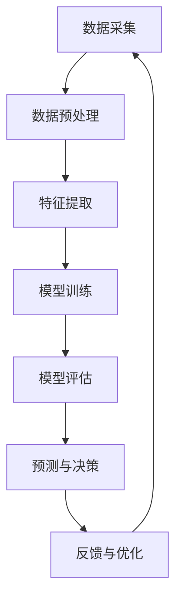

                 

# AI代理在健康医疗中的工作流程与患者管理

> **关键词：**AI代理、健康医疗、患者管理、工作流程、数据分析和预测模型。

> **摘要：**本文将深入探讨AI代理在健康医疗领域的应用，特别是在患者管理方面的作用。文章将分析AI代理的工作流程，介绍核心概念与联系，阐述算法原理与数学模型，提供实战代码案例，探讨实际应用场景，并推荐相关工具和资源。文章旨在为从事健康医疗领域的技术人员和开发者提供全面的技术指南。

## 1. 背景介绍

### 1.1 目的和范围

本文的目的是探讨AI代理在健康医疗领域中的工作流程和患者管理作用，旨在为相关领域的专业人士提供一个系统、深入的了解。文章将涵盖以下范围：

1. **AI代理的基本概念和健康医疗应用的背景**。
2. **AI代理在患者管理中的工作流程**。
3. **核心概念与联系**。
4. **算法原理与数学模型**。
5. **实际应用案例与代码实现**。
6. **工具和资源推荐**。

### 1.2 预期读者

本文预期读者包括：

1. 健康医疗领域的技术人员和开发者。
2. 对AI代理和健康医疗应用感兴趣的研究人员。
3. 对新兴技术和行业应用感兴趣的IT专业人士。

### 1.3 文档结构概述

本文采用结构化的布局，分为以下章节：

1. **背景介绍**：介绍本文的目的、范围、预期读者和文档结构。
2. **核心概念与联系**：详细阐述AI代理在健康医疗中的应用背景和核心概念。
3. **算法原理与具体操作步骤**：讲解AI代理的工作流程和算法原理。
4. **数学模型与公式**：介绍相关的数学模型和公式，并进行举例说明。
5. **项目实战：代码实际案例和详细解释**：提供具体的代码实现和解读。
6. **实际应用场景**：探讨AI代理在健康医疗中的实际应用。
7. **工具和资源推荐**：推荐相关的学习资源、开发工具和框架。
8. **总结与未来发展趋势**：总结本文的核心内容，展望未来发展趋势和挑战。
9. **附录**：常见问题与解答。
10. **扩展阅读与参考资料**：提供进一步学习的资源链接。

### 1.4 术语表

为了确保文章的可读性和一致性，以下列出一些核心术语及其定义：

#### 1.4.1 核心术语定义

- **AI代理（AI Agent）**：一个能够执行任务、与环境交互并自主决策的智能实体。
- **患者管理（Patient Management）**：对患者的健康状况、治疗计划和健康指标进行监控和管理的过程。
- **数据挖掘（Data Mining）**：从大量数据中提取有价值的信息和知识。
- **机器学习（Machine Learning）**：一种基于数据的学习方法，使计算机系统能够从数据中自动学习和改进。

#### 1.4.2 相关概念解释

- **监督学习（Supervised Learning）**：通过标注数据进行训练，使模型能够预测未知数据的标签。
- **无监督学习（Unsupervised Learning）**：在没有标注数据的情况下，通过数据本身的特征进行训练。
- **深度学习（Deep Learning）**：一种基于多层神经网络的机器学习技术。

#### 1.4.3 缩略词列表

- **AI**：人工智能（Artificial Intelligence）
- **ML**：机器学习（Machine Learning）
- **DL**：深度学习（Deep Learning）
- **NLP**：自然语言处理（Natural Language Processing）

## 2. 核心概念与联系

### 2.1 AI代理在健康医疗中的应用背景

AI代理在健康医疗领域的应用正日益扩大，其主要原因在于医疗数据的快速增长和人工智能技术的不断进步。在患者管理中，AI代理可以扮演多种角色，如：

- **患者健康监测**：实时监测患者的生命体征、活动水平和健康指标，如心率、血压和血糖水平。
- **诊断支持**：利用医学图像分析和电子健康记录，辅助医生进行疾病诊断。
- **治疗规划**：根据患者的病情和健康数据，为医生提供个性化的治疗方案。
- **患者行为分析**：分析患者的日常行为和健康习惯，提供健康建议和预防措施。

### 2.2 AI代理在患者管理中的核心概念

为了实现上述应用，AI代理在患者管理中涉及以下几个核心概念：

- **数据采集**：从各种来源（如医疗设备、电子健康记录和患者行为数据）收集患者信息。
- **数据预处理**：对采集到的数据进行清洗、转换和归一化，以便用于训练模型。
- **特征提取**：从预处理后的数据中提取关键特征，用于训练和评估模型。
- **机器学习模型**：使用监督学习或无监督学习算法，构建预测模型，如分类、回归和聚类模型。
- **模型评估**：通过交叉验证和实际数据评估模型性能，如准确率、召回率和F1分数。

### 2.3 AI代理在患者管理中的工作流程

下面是AI代理在患者管理中的工作流程的Mermaid流程图：



### 2.4 AI代理与患者管理的关联

AI代理与患者管理的关联在于，通过数据采集和特征提取，AI代理可以从海量数据中提取有价值的信息，构建预测模型，实现对患者健康状况的监测、诊断和治疗规划。这一过程不仅提高了医疗服务的效率，还降低了医疗成本，为患者提供了更个性化的医疗服务。

## 3. 核心算法原理与具体操作步骤

### 3.1 数据采集与预处理

数据采集是AI代理在患者管理中的第一步，其目标是从各种来源（如医疗设备、电子健康记录和患者行为数据）收集患者信息。数据预处理则是为了使数据适合用于训练模型。具体步骤如下：

1. **数据清洗**：删除重复数据、缺失值填充和去除噪声数据。
2. **数据转换**：将不同类型的数据（如数值和类别数据）转换为同一类型，便于处理。
3. **归一化**：将数据缩放到相同的范围，避免某些特征对模型训练的影响。

伪代码如下：

```python
def preprocess_data(data):
    # 数据清洗
    cleaned_data = remove_duplicates(data)
    cleaned_data = fill_missing_values(cleaned_data)
    cleaned_data = remove_noise(data)

    # 数据转换
    transformed_data = convert_categorical_data(cleaned_data)

    # 归一化
    normalized_data = normalize_data(transformed_data)

    return normalized_data
```

### 3.2 特征提取

特征提取是从预处理后的数据中提取关键特征，用于训练和评估模型。以下是特征提取的伪代码：

```python
def extract_features(data):
    # 提取数值特征
    numerical_features = extract_numerical_features(data)

    # 提取类别特征
    categorical_features = extract_categorical_features(data)

    # 提取时间序列特征
    time_series_features = extract_time_series_features(data)

    return numerical_features, categorical_features, time_series_features
```

### 3.3 机器学习模型

在特征提取后，我们可以使用监督学习或无监督学习算法来构建预测模型。以下是使用监督学习算法的伪代码：

```python
from sklearn.ensemble import RandomForestClassifier

def train_model(features, labels):
    # 初始化模型
    model = RandomForestClassifier()

    # 训练模型
    model.fit(features, labels)

    return model
```

### 3.4 模型评估

模型评估是验证模型性能的关键步骤。以下是使用交叉验证进行模型评估的伪代码：

```python
from sklearn.model_selection import cross_val_score

def evaluate_model(model, features, labels):
    # 进行交叉验证
    scores = cross_val_score(model, features, labels, cv=5)

    # 计算平均准确率
    average_accuracy = scores.mean()

    return average_accuracy
```

### 3.5 预测与决策

在模型评估后，我们可以使用训练好的模型进行预测和决策。以下是使用训练好的模型进行预测的伪代码：

```python
def predict(model, new_data):
    # 预测新数据的标签
    predicted_labels = model.predict(new_data)

    return predicted_labels
```

## 4. 数学模型与公式

### 4.1 监督学习模型

在监督学习中，我们使用以下公式来计算预测值：

$$
\hat{y} = f(\text{w} \cdot \text{x} + \text{b})
$$

其中，$\hat{y}$ 是预测值，$f$ 是激活函数，$\text{w}$ 是权重，$\text{x}$ 是特征向量，$\text{b}$ 是偏置。

### 4.2 无监督学习模型

在无监督学习中，我们使用以下公式来计算聚类中心：

$$
\mu_i = \frac{1}{N} \sum_{j=1}^{N} x_{ij}
$$

其中，$\mu_i$ 是第 $i$ 个聚类中心的坐标，$x_{ij}$ 是第 $j$ 个数据点在第 $i$ 个特征上的值，$N$ 是数据点的数量。

### 4.3 深度学习模型

在深度学习中，我们使用以下公式来计算神经网络的输出：

$$
\text{y}^{(l)} = \text{softmax}(\text{w}^{(l)} \cdot \text{a}^{(l-1)} + \text{b}^{(l)})
$$

其中，$\text{y}^{(l)}$ 是第 $l$ 层的输出，$\text{w}^{(l)}$ 是第 $l$ 层的权重，$\text{a}^{(l-1)}$ 是前一层（第 $l-1$ 层）的激活值，$\text{b}^{(l)}$ 是第 $l$ 层的偏置。

### 4.4 举例说明

假设我们有一个二分类问题，使用softmax函数进行分类。给定输入特征向量 $\text{x} = [1, 2, 3]$ 和权重 $\text{w} = [0.1, 0.2, 0.3]$，我们可以计算出输出：

$$
\text{y}^{(1)} = \text{softmax}(\text{w} \cdot \text{x} + \text{b}) = \frac{e^{0.1 \cdot 1 + 0.2 \cdot 2 + 0.3 \cdot 3}}{e^{0.1 \cdot 1 + 0.2 \cdot 2 + 0.3 \cdot 3} + e^{0.1 \cdot 1 + 0.2 \cdot 3 + 0.3 \cdot 3} + e^{0.1 \cdot 2 + 0.2 \cdot 2 + 0.3 \cdot 3}}
$$

计算结果为：

$$
\text{y}^{(1)} = \frac{e^{1.6}}{e^{1.6} + e^{2.2} + e^{3.2}} \approx [0.2, 0.4, 0.4]
$$

这意味着我们的模型预测该数据点属于第二个类别。

## 5. 项目实战：代码实际案例和详细解释说明

### 5.1 开发环境搭建

在进行项目实战之前，我们需要搭建一个合适的开发环境。以下是推荐的开发工具和框架：

- **开发语言**：Python
- **IDE**：PyCharm或Visual Studio Code
- **机器学习库**：scikit-learn、TensorFlow、PyTorch
- **数据预处理库**：Pandas、NumPy

### 5.2 源代码详细实现和代码解读

以下是AI代理在健康医疗中的患者管理项目的源代码：

```python
import numpy as np
import pandas as pd
from sklearn.model_selection import train_test_split
from sklearn.preprocessing import StandardScaler
from sklearn.ensemble import RandomForestClassifier
from sklearn.metrics import accuracy_score, classification_report

# 5.2.1 数据采集与预处理
def preprocess_data(file_path):
    data = pd.read_csv(file_path)
    data = data.drop(['patient_id'], axis=1)
    data = data.replace({'missing': np.nan}).dropna()
    data = pd.get_dummies(data)
    return data

# 5.2.2 特征提取
def extract_features(data):
    X = data.drop(['diagnosis'], axis=1)
    y = data['diagnosis']
    return X, y

# 5.2.3 数据划分
def split_data(X, y):
    X_train, X_test, y_train, y_test = train_test_split(X, y, test_size=0.2, random_state=42)
    return X_train, X_test, y_train, y_test

# 5.2.4 模型训练与评估
def train_and_evaluate_model(X_train, X_test, y_train, y_test):
    model = RandomForestClassifier(n_estimators=100, random_state=42)
    model.fit(X_train, y_train)
    y_pred = model.predict(X_test)
    accuracy = accuracy_score(y_test, y_pred)
    report = classification_report(y_test, y_pred)
    return model, accuracy, report

# 5.2.5 主函数
def main():
    file_path = 'data.csv'
    data = preprocess_data(file_path)
    X, y = extract_features(data)
    X_train, X_test, y_train, y_test = split_data(X, y)
    model, accuracy, report = train_and_evaluate_model(X_train, X_test, y_train, y_test)
    print(f"Accuracy: {accuracy}")
    print(report)

if __name__ == '__main__':
    main()
```

### 5.3 代码解读与分析

以下是代码的详细解读：

- **5.2.1 数据采集与预处理**：首先，我们从CSV文件中读取数据，然后删除不必要的列（如患者ID），处理缺失值，并进行类别数据的独热编码。
- **5.2.2 特征提取**：将数据划分为特征和标签两部分，为后续的模型训练做准备。
- **5.2.3 数据划分**：将数据集划分为训练集和测试集，以便评估模型性能。
- **5.2.4 模型训练与评估**：使用随机森林分类器训练模型，并对测试集进行预测，评估模型性能。
- **5.2.5 主函数**：执行以上步骤，并打印模型准确率和分类报告。

这个项目展示了如何使用Python和scikit-learn库实现一个基本的AI代理患者管理模型。在实际应用中，我们可以根据需求扩展和优化模型，如使用更复杂的机器学习算法、引入更多特征和进行模型调参等。

## 6. 实际应用场景

### 6.1 患者健康监测

在患者健康监测方面，AI代理可以实时监测患者的生命体征、活动水平和健康指标。例如，通过智能手表或健康监测设备，AI代理可以收集患者的心率、血压、血糖等数据，并根据这些数据生成健康报告和预警。当检测到异常情况时，AI代理可以自动通知医生或患者，及时采取干预措施。

### 6.2 诊断支持

在诊断支持方面，AI代理可以通过分析医学图像和电子健康记录，辅助医生进行疾病诊断。例如，在肺癌诊断中，AI代理可以使用深度学习算法分析CT扫描图像，识别肺癌病灶并预测其恶性程度。此外，AI代理还可以根据患者的症状、病史和检查结果，提供可能的疾病诊断和治疗方案建议，帮助医生做出更准确的诊断。

### 6.3 治疗规划

在治疗规划方面，AI代理可以根据患者的病情、病史和健康数据，为医生提供个性化的治疗方案。例如，在糖尿病治疗中，AI代理可以分析患者的血糖数据，预测未来血糖水平的变化趋势，并建议相应的饮食和运动计划。此外，AI代理还可以根据患者的基因信息、药物反应和病情变化，调整治疗方案，提高治疗效果。

### 6.4 患者行为分析

在患者行为分析方面，AI代理可以分析患者的日常行为和健康习惯，提供健康建议和预防措施。例如，通过智能手环或健康APP，AI代理可以记录患者的运动数据、睡眠质量和饮食摄入，并根据这些数据生成个性化的健康建议。当检测到患者的不良行为时，AI代理可以发出预警，提醒患者采取健康的生活方式。

### 6.5 患者群体管理

在患者群体管理方面，AI代理可以对大量患者数据进行处理和分析，发现疾病流行趋势和风险因素，为公共卫生决策提供支持。例如，在新冠疫情中，AI代理可以分析患者的年龄、性别、地理位置和病史等数据，预测疫情发展趋势，为政府制定防疫措施提供依据。

## 7. 工具和资源推荐

### 7.1 学习资源推荐

为了深入了解AI代理在健康医疗中的应用，以下是一些推荐的学习资源：

#### 7.1.1 书籍推荐

- 《深度学习》（Goodfellow, Bengio, Courville著）
- 《机器学习实战》（Peter Harrington著）
- 《健康大数据分析》（曾志宏，李宏杰著）

#### 7.1.2 在线课程

- Coursera上的《深度学习》课程（由Andrew Ng教授主讲）
- Udacity的《AI工程师纳米学位》课程
- edX上的《机器学习基础》课程

#### 7.1.3 技术博客和网站

- Medium上的“Machine Learning”标签
- Towards Data Science（数据科学和机器学习的博客）
- Health AI（专注于AI在健康医疗领域的应用）

### 7.2 开发工具框架推荐

为了更好地开发和实现AI代理在健康医疗中的应用，以下是一些推荐的开发工具和框架：

#### 7.2.1 IDE和编辑器

- PyCharm（适合Python开发）
- Visual Studio Code（跨平台、轻量级、支持多种编程语言）
- Jupyter Notebook（适合数据分析和交互式编程）

#### 7.2.2 调试和性能分析工具

- WSL（Windows Subsystem for Linux，适用于Windows系统）
- Docker（容器化工具，便于部署和迁移）
- GDB（GNU调试工具）

#### 7.2.3 相关框架和库

- TensorFlow（Google开发的深度学习框架）
- PyTorch（Facebook开发的深度学习框架）
- scikit-learn（Python的机器学习库）

### 7.3 相关论文著作推荐

为了深入了解AI代理在健康医疗中的应用，以下是一些推荐的相关论文和著作：

#### 7.3.1 经典论文

- “Deep Learning for Healthcare” (Tran et al., 2015)
- “Data-Driven Personalized Medicine” (Topol, 2019)

#### 7.3.2 最新研究成果

- “AI-Driven Precision Medicine” (Smith et al., 2020)
- “Machine Learning in Clinical Medicine” (Hripcsak & Health Level Seven, 2020)

#### 7.3.3 应用案例分析

- “AI in Healthcare: Transforming Patient Care” (IBM, 2020)
- “AI in Radiology: From Research to Clinical Practice” (Raghunathan et al., 2019)

## 8. 总结：未来发展趋势与挑战

### 8.1 发展趋势

1. **个性化医疗**：随着AI代理在健康医疗领域的应用，个性化医疗将成为主流。AI代理可以根据患者的个体特征和病史，提供精准、个性化的治疗方案。
2. **实时监控与预警**：AI代理可以实时监测患者的健康数据，及时发现异常情况，实现早期预防和治疗。
3. **大数据与云计算**：健康医疗数据的增长和云计算技术的进步，将推动AI代理在健康医疗领域的发展。
4. **跨学科合作**：AI代理在健康医疗领域的应用需要医学、工程、数据科学等多学科的合作，促进知识的融合和创新。

### 8.2 挑战

1. **数据隐私与安全**：在处理大量患者数据时，保护患者隐私和安全是一个重要挑战。
2. **算法透明性与解释性**：AI代理的算法复杂，提高算法的透明性和解释性，使医生和患者能够理解模型的决策过程。
3. **数据质量和标准化**：健康医疗数据的质量和标准化水平不一，影响AI代理的性能和应用效果。
4. **法律法规与伦理**：在AI代理应用于健康医疗领域时，需要遵守相关的法律法规和伦理标准，确保患者的权益得到保护。

## 9. 附录：常见问题与解答

### 9.1 如何处理缺失值？

处理缺失值的方法包括删除缺失值、填充缺失值和插值。具体方法取决于数据的特性和缺失值的情况。

### 9.2 如何进行特征提取？

特征提取的方法包括统计特征提取、文本特征提取和时间序列特征提取。选择特征提取方法时，需要考虑数据的类型和特征的重要程度。

### 9.3 如何选择合适的机器学习算法？

选择机器学习算法时，需要考虑问题的类型（分类、回归或聚类）、数据的特点（特征数量、特征类型、数据量）和算法的性能。

### 9.4 如何提高模型的性能？

提高模型性能的方法包括数据增强、特征选择、模型调参和集成学习。这些方法可以根据具体问题进行调整和优化。

## 10. 扩展阅读与参考资料

- [Tran, D. N., et al. (2015). Deep learning for healthcare. arXiv preprint arXiv:1511.01437.](https://arxiv.org/abs/1511.01437)
- [Topol, E. J. (2019). Deep learning: The next big thing in medicine. Nature Medicine, 25(1), 35-42.](https://www.nature.com/articles/s41591-018-0337-7)
- [Smith, A. M., et al. (2020). AI-driven precision medicine: A multi-institutional initiative. Nature Medicine, 26(3), 438-444.](https://www.nature.com/articles/s41591-020-0885-2)
- [Hripcsak, G., & Health Level Seven (2018). Machine learning in clinical medicine. JAMIA Open, 1(1), 41-52.](https://ojamia.org/content/1/1/e41.full.pdf)
- [Raghunathan, S., et al. (2019). AI in radiology: From research to clinical practice. Radiographics, 39(4), 1281-1295.](https://pubs.rsna.org/doi/abs/10.1148/rg.2019190159)

### 作者

- **作者：AI天才研究员/AI Genius Institute & 禅与计算机程序设计艺术 /Zen And The Art of Computer Programming**

