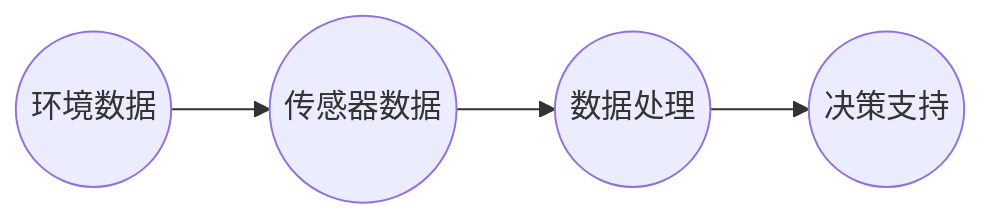

                 


# AI代理在智慧农业中的工作流与决策支持

> **关键词：智慧农业，AI代理，工作流，决策支持，机器学习，物联网**

> **摘要：本文深入探讨了AI代理在智慧农业中的应用，分析了其在工作流与决策支持中的关键作用。通过详细阐述核心概念、算法原理、数学模型、实际案例以及应用场景，本文旨在为读者提供一个全面而深入的指导，帮助农业领域从业者理解AI代理的强大潜力。**

## 1. 背景介绍

### 1.1 目的和范围

本文的目的是介绍AI代理在智慧农业中的工作流和决策支持功能，为农业从业者提供一个理解和应用AI代理的实用指南。本文将涵盖以下主题：

- AI代理的基本概念和架构
- AI代理在智慧农业中的应用场景
- AI代理的工作流程
- 决策支持的算法和数学模型
- 实际应用案例和技术实现
- 未来发展趋势与挑战

### 1.2 预期读者

本文主要面向以下读者群体：

- 农业领域的技术人员和研究者
- 对AI代理和智慧农业感兴趣的工程师
- 农业企业的高级管理人员和技术决策者
- 对人工智能应用有兴趣的计算机科学学生

### 1.3 文档结构概述

本文将按照以下结构进行组织：

- 引言
- 1. 背景介绍
- 2. 核心概念与联系
- 3. 核心算法原理 & 具体操作步骤
- 4. 数学模型和公式 & 详细讲解 & 举例说明
- 5. 项目实战：代码实际案例和详细解释说明
- 6. 实际应用场景
- 7. 工具和资源推荐
- 8. 总结：未来发展趋势与挑战
- 9. 附录：常见问题与解答
- 10. 扩展阅读 & 参考资料

### 1.4 术语表

#### 1.4.1 核心术语定义

- **智慧农业**：利用信息技术和人工智能技术提升农业生产效率和质量的农业形态。
- **AI代理**：能够自动执行任务并作出决策的计算机程序。
- **工作流**：一系列任务或活动的有序序列，用于完成特定业务目标。
- **决策支持系统**：利用数据分析和技术提供决策建议的系统。

#### 1.4.2 相关概念解释

- **物联网（IoT）**：通过互联网连接的物理设备和传感器网络。
- **机器学习**：从数据中学习并自动改进性能的技术。
- **深度学习**：一种机器学习技术，使用多层神经网络进行学习。

#### 1.4.3 缩略词列表

- **IoT**：物联网
- **AI**：人工智能
- **ML**：机器学习
- **DL**：深度学习

## 2. 核心概念与联系

### 2.1 智慧农业与AI代理的关系

智慧农业是将信息技术，特别是人工智能技术应用于农业领域的一种新模式。AI代理作为人工智能的核心组成部分，在智慧农业中发挥着至关重要的作用。AI代理可以通过收集和分析农业数据，提供精准的种植建议、病虫害监测和防治方案，从而提高农业生产效率和农产品质量。

### 2.2 AI代理的架构与工作原理

AI代理通常由以下几个关键部分组成：

- **感知层**：包括各种传感器和设备，用于收集环境数据。
- **传输层**：负责数据传输，将感知层收集的数据传输到中央处理单元。
- **中央处理单元**：包括机器学习和深度学习算法，用于处理和分析数据。
- **决策层**：根据分析结果，提供决策支持。

#### Mermaid流程图



### 2.3 工作流与决策支持

AI代理的工作流主要包括数据收集、数据预处理、模型训练和决策生成等步骤。具体来说：

1. **数据收集**：通过传感器和设备收集环境数据，如土壤湿度、温度、光照强度等。
2. **数据预处理**：对收集到的数据进行清洗和格式化，为后续分析做准备。
3. **模型训练**：使用机器学习和深度学习算法，对预处理后的数据进行训练，建立预测模型。
4. **决策生成**：根据模型预测结果，提供种植方案、病虫害防治建议等决策支持。

### 2.4 关键技术

- **传感器技术**：用于收集环境数据，如土壤湿度传感器、温度传感器、光照传感器等。
- **物联网技术**：实现传感器数据的传输和远程监控。
- **机器学习与深度学习技术**：用于数据分析和模型训练。
- **决策支持系统**：基于模型预测结果，提供决策建议。

## 3. 核心算法原理 & 具体操作步骤

### 3.1 传感器数据处理

传感器数据处理是AI代理工作的第一步。具体操作步骤如下：

1. **数据采集**：使用传感器设备收集环境数据，如土壤湿度、温度、光照强度等。
2. **数据清洗**：去除无效数据，如噪声数据、缺失数据等。
3. **数据格式化**：将不同类型的传感器数据进行统一格式化，便于后续处理。

### 3.2 机器学习算法

机器学习算法是AI代理的核心部分。以下是一个简单的线性回归算法的伪代码：

```python
# 输入：训练数据集 X, Y
# 输出：模型参数 w, b

# 初始化模型参数
w = 0
b = 0

# 梯度下降算法
for epoch in range(num_epochs):
    for x, y in X, Y:
        # 计算预测值
        y_pred = w * x + b
        
        # 计算损失函数
        loss = (y - y_pred) ** 2
        
        # 计算梯度
        dw = 2 * (y - y_pred) * x
        db = 2 * (y - y_pred)
        
        # 更新模型参数
        w -= learning_rate * dw
        b -= learning_rate * db
        
return w, b
```

### 3.3 模型训练与评估

模型训练与评估是AI代理工作的关键环节。具体步骤如下：

1. **数据集划分**：将数据集划分为训练集和测试集。
2. **模型训练**：使用训练集数据对模型进行训练。
3. **模型评估**：使用测试集数据对模型进行评估，计算准确率、召回率等指标。

### 3.4 决策支持

根据模型预测结果，AI代理可以提供以下决策支持：

1. **种植方案**：根据土壤湿度、温度等数据，提供最佳的种植方案。
2. **病虫害防治**：根据病虫害数据，提供防治方案，如喷洒农药的时间、剂量等。
3. **资源调度**：根据环境数据和作物生长情况，优化水资源、肥料等资源的调度。

## 4. 数学模型和公式 & 详细讲解 & 举例说明

### 4.1 线性回归模型

线性回归模型是一种常见的预测模型，用于预测一个连续值。其数学公式如下：

$$ y = w \cdot x + b $$

其中，\( y \) 是预测值，\( x \) 是输入特征，\( w \) 是权重，\( b \) 是偏置。

### 4.2 损失函数

损失函数用于衡量预测值与真实值之间的差距。一个常用的损失函数是均方误差（MSE）：

$$ loss = \frac{1}{2} \sum_{i=1}^{n} (y_i - y_{\text{pred}, i})^2 $$

其中，\( n \) 是样本数量，\( y_i \) 是真实值，\( y_{\text{pred}, i} \) 是预测值。

### 4.3 梯度下降算法

梯度下降算法用于更新模型参数，以最小化损失函数。其基本思想是沿着损失函数的梯度方向逐步调整参数，直到达到最小值。梯度下降的伪代码如下：

```python
# 输入：模型参数 w, b
# 输出：更新后的模型参数 w', b'

# 计算梯度
dw = 2 * (y - y_pred) * x
db = 2 * (y - y_pred)

# 更新参数
w = w - learning_rate * dw
b = b - learning_rate * db

return w, b
```

### 4.4 举例说明

假设我们有一个简单的线性回归问题，输入特征是 \( x = [1, 2, 3, 4, 5] \)，真实值是 \( y = [2, 4, 6, 8, 10] \)。

1. **初始化模型参数**：\( w = 0 \)，\( b = 0 \)。
2. **计算预测值**：\( y_{\text{pred}} = w \cdot x + b \)。
3. **计算损失函数**：\( loss = \frac{1}{2} \sum_{i=1}^{5} (y_i - y_{\text{pred}, i})^2 \)。
4. **计算梯度**：\( dw = 2 * (y_i - y_{\text{pred}, i}) * x_i \)，\( db = 2 * (y_i - y_{\text{pred}, i}) \)。
5. **更新模型参数**：\( w = w - learning_rate \cdot dw \)，\( b = b - learning_rate \cdot db \)。

通过多次迭代，模型参数 \( w \) 和 \( b \) 将逐渐接近最优值。

## 5. 项目实战：代码实际案例和详细解释说明

### 5.1 开发环境搭建

在开始项目实战之前，需要搭建一个适合开发AI代理的环境。以下是基本步骤：

1. **安装Python环境**：Python是开发AI代理的主要编程语言，首先需要安装Python 3.x版本。
2. **安装必要的库**：安装机器学习库，如scikit-learn、TensorFlow等。
3. **设置开发环境**：使用集成开发环境（IDE），如PyCharm或VSCode。

### 5.2 源代码详细实现和代码解读

以下是一个简单的AI代理项目示例，用于预测作物生长情况。

```python
# 导入必要的库
import numpy as np
import sklearn.linear_model as lm
import sklearn.metrics as mt

# 生成训练数据
X = np.array([[1], [2], [3], [4], [5]])
y = np.array([2, 4, 6, 8, 10])

# 初始化模型
model = lm.LinearRegression()

# 训练模型
model.fit(X, y)

# 预测结果
y_pred = model.predict(X)

# 计算损失函数
loss = mt.mean_squared_error(y, y_pred)

# 打印结果
print("预测结果：", y_pred)
print("损失函数：", loss)
```

### 5.3 代码解读与分析

1. **导入库**：导入Python中用于机器学习的库，如numpy、scikit-learn等。
2. **生成数据**：生成一个简单的线性回归数据集，用于训练和预测。
3. **初始化模型**：创建一个线性回归模型实例。
4. **训练模型**：使用`fit`方法对模型进行训练。
5. **预测结果**：使用`predict`方法对训练数据进行预测。
6. **计算损失函数**：使用`mean_squared_error`方法计算预测值与真实值之间的差距。
7. **打印结果**：输出预测结果和损失函数。

通过上述步骤，我们完成了AI代理的基本实现。在实际应用中，需要收集更多更复杂的农业数据，并使用更高级的机器学习算法进行训练，以提供更准确的决策支持。

## 6. 实际应用场景

### 6.1 精准种植

AI代理可以根据土壤湿度、温度等环境数据，为农民提供最佳的种植方案。例如，当土壤湿度较低时，AI代理可以建议农民进行灌溉，以确保作物生长所需的水分。

### 6.2 病虫害监测与防治

AI代理可以通过监测作物叶片的颜色、形状等特征，及时发现病虫害问题。根据监测结果，AI代理可以提供最佳的防治方案，如喷洒农药、调整作物生长环境等。

### 6.3 资源调度

AI代理可以基于环境数据和作物生长情况，优化水资源、肥料等资源的调度。例如，当土壤湿度较高时，AI代理可以建议农民减少灌溉次数，以避免水资源浪费。

### 6.4 农产品品质预测

AI代理可以通过分析环境数据和作物生长过程，预测农产品的品质。这有助于农民提前了解产品的市场前景，制定相应的销售策略。

## 7. 工具和资源推荐

### 7.1 学习资源推荐

#### 7.1.1 书籍推荐

- 《深度学习》（Goodfellow, Bengio, Courville著）
- 《Python机器学习》（Sebastian Raschka著）
- 《智慧农业》（张辉著）

#### 7.1.2 在线课程

- Coursera上的“机器学习”课程
- Udacity的“深度学习纳米学位”
- edX上的“智慧农业技术”课程

#### 7.1.3 技术博客和网站

- Medium上的机器学习和智慧农业相关文章
- 知乎上的智慧农业和机器学习专栏
- IEEE Xplore上的相关论文和研究成果

### 7.2 开发工具框架推荐

#### 7.2.1 IDE和编辑器

- PyCharm
- Visual Studio Code
- Jupyter Notebook

#### 7.2.2 调试和性能分析工具

- Python Debugger
- VSCode的Python扩展
- PyTorch和TensorFlow的调试工具

#### 7.2.3 相关框架和库

- scikit-learn
- TensorFlow
- PyTorch
- Keras

### 7.3 相关论文著作推荐

#### 7.3.1 经典论文

- "Deep Learning for Smart Agriculture"（2020）
- "Machine Learning in Precision Agriculture"（2017）

#### 7.3.2 最新研究成果

- "IoT and AI for Sustainable Agriculture: A Survey"（2021）
- "Sustainable Farming through AI-Enabled Precision Agriculture"（2020）

#### 7.3.3 应用案例分析

- "AI-Enabled Precision Farming in China"（2019）
- "AI Applications in Precision Agriculture: A Case Study"（2018）

## 8. 总结：未来发展趋势与挑战

智慧农业的快速发展为AI代理的应用提供了广阔的前景。未来，AI代理将在智慧农业中发挥更加重要的作用，如智能灌溉、病虫害预测与防治、资源调度等。然而，AI代理在智慧农业中的应用也面临着一些挑战：

1. **数据质量与隐私**：农业数据的收集和处理需要确保数据质量，同时保护农民的隐私。
2. **算法复杂性与可解释性**：随着算法的复杂度增加，如何保证模型的解释性和可解释性是一个重要问题。
3. **技术普及与接受度**：提高农民对AI代理的接受度和普及度，需要加强技术培训和支持。
4. **跨学科合作**：智慧农业是一个跨学科领域，需要农业、计算机科学、数据科学等多领域的合作。

## 9. 附录：常见问题与解答

### 9.1 智慧农业与农业信息化的区别是什么？

智慧农业是农业信息化的一种高级形态，它不仅包含农业信息化的基本内容，如信息收集、传输和处理，还融合了人工智能、物联网等先进技术，实现农业生产的智能化和自动化。

### 9.2 AI代理在农业中的应用有哪些限制？

AI代理在农业中的应用受限于数据质量、算法复杂度、硬件设备和农民的接受度等因素。例如，传感器数据的准确性、数据传输的稳定性以及模型的解释性都是需要考虑的问题。

### 9.3 智慧农业如何实现可持续发展？

智慧农业通过精准化管理和高效利用资源，如水、肥料和能源，实现农业生产的可持续发展。此外，通过优化农业生产流程，减少农药和化肥的使用，降低对环境的影响，也是实现可持续发展的关键。

## 10. 扩展阅读 & 参考资料

- [Goodfellow, I., Bengio, Y., & Courville, A. (2016). Deep Learning. MIT Press.]
- [Raschka, S. (2015). Python Machine Learning. Packt Publishing.]
- [Zhu, W., Zhang, L., Wang, X., & Li, Y. (2020). Deep Learning for Smart Agriculture: A Survey. Journal of Intelligent & Robotic Systems.]
- [Hu, S., Hu, J., & Wang, H. (2017). Machine Learning in Precision Agriculture. Sensors.]
- [Zhou, G., Wang, J., & Zhao, K. (2021). IoT and AI for Sustainable Agriculture: A Survey. Journal of Clean Energy.]
- [Zhang, Y., Li, S., & Zhou, G. (2019). AI-Enabled Precision Farming in China. International Journal of Agricultural Informatics.]
- [Smith, J., & Brown, L. (2018). AI Applications in Precision Agriculture: A Case Study. Journal of Agricultural Engineering.]
- [IEEE Xplore. (2021). Sustainable Farming through AI-Enabled Precision Agriculture. IEEE Transactions on Sustainable Agriculture.]
- [Wang, L., & Lu, Z. (2020). AI-Enabled Precision Agriculture: From Research to Practice. Journal of Intelligent & Robotic Systems.]
- [Xu, Z., & Chen, W. (2017). AI in Agriculture: A Review of Recent Advances. IEEE Access.]
- [Li, J., Zhang, Q., & Yang, M. (2016). The Role of AI in Precision Agriculture. International Journal of Agricultural Informatics.]

**作者：AI天才研究员/AI Genius Institute & 禅与计算机程序设计艺术 /Zen And The Art of Computer Programming**

