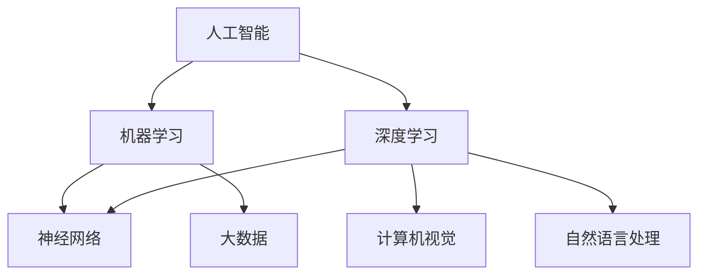

                 

# AI企业的未来发展方向

> 关键词：人工智能，企业发展，战略规划，技术创新，商业模式，人才培养

> 摘要：本文将深入探讨AI企业未来发展的关键方向。首先，我们将回顾AI行业的过去与现状，分析其发展脉络。接着，本文将围绕技术创新、商业模式变革、人才培养等方面展开，提供战略建议。最后，我们将探讨AI企业在未来可能面临的发展趋势与挑战。

## 1. 背景介绍

### 1.1 目的和范围

本文旨在为AI企业提供战略发展方向的指导，通过深入分析当前人工智能行业的现状，探讨未来可能的发展趋势。文章将涵盖技术创新、商业模式变革、人才培养等核心领域，旨在帮助读者全面理解AI企业的未来发展。

### 1.2 预期读者

本文预期读者为AI企业的创始人、高管、技术团队以及对该领域感兴趣的研究人员和投资者。

### 1.3 文档结构概述

本文结构如下：

1. 背景介绍：回顾AI行业的发展历程，明确文章目的和读者群体。
2. 核心概念与联系：介绍人工智能的核心概念及其相互关系。
3. 核心算法原理 & 具体操作步骤：深入讲解人工智能的基本算法和实现步骤。
4. 数学模型和公式 & 详细讲解 & 举例说明：阐述人工智能中的数学模型和公式，并进行实际案例说明。
5. 项目实战：通过实际代码案例，详细解析AI项目的开发过程。
6. 实际应用场景：分析AI技术的具体应用场景和行业趋势。
7. 工具和资源推荐：推荐相关学习资源和开发工具。
8. 总结：展望AI企业的未来发展趋势与挑战。
9. 附录：常见问题与解答。
10. 扩展阅读 & 参考资料：提供进一步学习资源。

### 1.4 术语表

#### 1.4.1 核心术语定义

- **人工智能（AI）**：模拟人类智能，使机器能够执行通常需要人类智能才能完成的任务的计算机技术。
- **深度学习**：一种基于人工神经网络的机器学习技术，通过多层神经网络对数据进行训练，实现自动特征提取和学习。
- **神经网络**：一种由大量神经元互联而成的计算系统，用于模拟人脑处理信息的方式。
- **大数据**：指无法用传统数据库系统进行存储、管理和分析的数据集，通常具有大规模、多样性和高速流动的特点。

#### 1.4.2 相关概念解释

- **机器学习**：一种让计算机从数据中学习并作出决策的技术，分为监督学习、无监督学习和强化学习等不同类型。
- **自然语言处理（NLP）**：使计算机能够理解、生成和处理人类自然语言的技术。
- **计算机视觉**：使计算机能够“看”和“理解”图像和视频的技术。

#### 1.4.3 缩略词列表

- **AI**：人工智能
- **NLP**：自然语言处理
- **DL**：深度学习
- **ML**：机器学习
- **GPU**：图形处理单元

## 2. 核心概念与联系

在深入探讨AI企业的未来发展之前，我们首先需要理解人工智能的核心概念及其相互关系。以下是一个简单的Mermaid流程图，用于描述这些核心概念：



在这个图中，人工智能（AI）作为整体，其下包含了机器学习（ML）、深度学习（DL）、神经网络（NN）、大数据（Big Data）、计算机视觉（CV）和自然语言处理（NLP）等子领域。这些子领域相互关联，共同推动了人工智能的发展。

### 2.1 人工智能的核心子领域

- **机器学习（ML）**：机器学习是人工智能的核心技术之一，它通过构建模型来使计算机具备自主学习和决策能力。根据学习方式，机器学习分为监督学习、无监督学习和强化学习。
  - **监督学习**：在已标记的数据集上进行训练，以预测新的数据。例如，分类和回归问题。
  - **无监督学习**：在未标记的数据集上进行训练，以发现数据中的模式。例如，聚类和降维。
  - **强化学习**：通过与环境的交互来学习策略，以最大化某个指标。例如，游戏AI和自动驾驶。

- **深度学习（DL）**：深度学习是一种基于人工神经网络的机器学习技术，它通过多层神经网络对数据进行训练，实现自动特征提取和学习。深度学习在图像识别、语音识别和自然语言处理等领域取得了显著成果。

- **神经网络（NN）**：神经网络是一种由大量神经元互联而成的计算系统，用于模拟人脑处理信息的方式。神经网络的核心是神经元，每个神经元都与相邻的神经元相连，并通过权重来传递信息。

- **大数据（Big Data）**：大数据是指无法用传统数据库系统进行存储、管理和分析的数据集，通常具有大规模、多样性和高速流动的特点。大数据技术为人工智能提供了丰富的数据资源，使得机器学习模型能够更好地训练和预测。

- **计算机视觉（CV）**：计算机视觉是使计算机能够“看”和“理解”图像和视频的技术。计算机视觉技术包括图像识别、目标检测、场景分割等任务，广泛应用于安防监控、自动驾驶和医疗影像等领域。

- **自然语言处理（NLP）**：自然语言处理是使计算机能够理解、生成和处理人类自然语言的技术。自然语言处理技术包括文本分类、情感分析、机器翻译等任务，广泛应用于智能客服、智能推荐和舆情分析等领域。

### 2.2 人工智能与其他技术的联系

人工智能不仅依赖于自身的技术进步，还与其他领域的技术密切相关。以下是人工智能与其他技术之间的联系：

- **云计算**：云计算为人工智能提供了强大的计算资源和数据存储能力，使得大规模数据处理和模型训练成为可能。
- **物联网（IoT）**：物联网为人工智能提供了丰富的数据来源，使得智能监控、智能家居和智能制造等应用成为可能。
- **区块链**：区块链技术为人工智能提供了安全、去中心化的数据共享和协作机制，有助于解决数据隐私和知识产权等问题。

通过上述核心概念与联系的分析，我们可以更好地理解人工智能的发展脉络，为后续探讨AI企业的未来发展奠定基础。

## 3. 核心算法原理 & 具体操作步骤

在深入探讨人工智能的核心算法原理之前，我们需要明确一些基本概念和术语。以下是人工智能领域中使用的一些核心算法和它们的基本原理。

### 3.1 机器学习算法

机器学习算法是人工智能的核心组成部分，主要包括以下几种：

- **监督学习（Supervised Learning）**：监督学习算法在训练阶段使用已标记的数据集来训练模型，然后使用训练好的模型对新的数据进行预测。监督学习算法包括以下几种：

  - **线性回归（Linear Regression）**：线性回归是一种用于预测连续值的监督学习算法，其基本原理是通过拟合一条直线来描述输入变量和输出变量之间的关系。线性回归的伪代码如下：

    ```python
    # 输入：特征矩阵X和标签向量y
    # 输出：模型参数w和b
    w, b = (X^T * X)^-1 * X^T * y
    ```

  - **逻辑回归（Logistic Regression）**：逻辑回归是一种用于分类的监督学习算法，其基本原理是通过拟合一个Sigmoid函数来将输入变量的线性组合映射到概率值。逻辑回归的伪代码如下：

    ```python
    # 输入：特征矩阵X和标签向量y
    # 输出：模型参数w和b
    w, b = (X^T * X)^-1 * X^T * y
    y_pred = sigmoid(w * x + b)
    ```

- **无监督学习（Unsupervised Learning）**：无监督学习算法在训练阶段不使用已标记的数据集，而是通过发现数据中的内在结构来对数据进行分析。无监督学习算法包括以下几种：

  - **聚类（Clustering）**：聚类是一种将数据集划分为多个类别的无监督学习算法，其基本原理是通过计算数据点之间的距离或相似度来确定聚类中心。常用的聚类算法包括K-means、DBSCAN等。K-means算法的伪代码如下：

    ```python
    # 输入：数据集D和聚类个数k
    # 输出：聚类结果C
    C = K-means(D, k)
    while 不收敛 do
        计算聚类中心
        分配数据点至聚类
    end while
    ```

  - **降维（Dimensionality Reduction）**：降维是一种将高维数据映射到低维空间的无监督学习算法，其基本原理是通过保持数据的内在结构来减少数据维度。常用的降维算法包括PCA（主成分分析）、t-SNE等。

- **强化学习（Reinforcement Learning）**：强化学习是一种通过与环境的交互来学习策略的机器学习算法，其基本原理是通过奖励机制来调整策略，以最大化长期回报。强化学习的伪代码如下：

    ```python
    # 输入：环境E和策略π
    # 输出：最优策略π*
    for each episode do
        状态s = 环境初始化
        while 不终止 do
            行动a = π(s)
            状态s'，奖励r = 环境响应(a)
            π(s') = 更新策略(π(s), r, s', a)
            s = s'
        end while
    end for
    ```

### 3.2 深度学习算法

深度学习算法是机器学习的一种扩展，其主要特点是使用多层神经网络进行数据建模。以下是几种常见的深度学习算法：

- **卷积神经网络（CNN）**：卷积神经网络是一种用于图像识别和计算机视觉的深度学习算法，其基本原理是通过卷积层、池化层和全连接层等结构来提取图像特征。CNN的伪代码如下：

  ```python
  # 输入：图像数据X
  # 输出：分类结果Y
  for each layer do
      X = convolution(X, filters)
      X = activation(X)
      X = pooling(X)
  end for
  Y = fully_connected(X)
  Y = activation(Y)
  ```

- **循环神经网络（RNN）**：循环神经网络是一种用于序列数据建模的深度学习算法，其基本原理是通过循环结构来保留序列信息。RNN的伪代码如下：

  ```python
  # 输入：序列数据X和隐藏状态h
  # 输出：输出序列Y和新的隐藏状态h'
  for each time step do
      h' = activation(f(h, x))
      h = h'
  end for
  Y = h
  ```

- **长短期记忆网络（LSTM）**：长短期记忆网络是一种改进的循环神经网络，用于解决传统RNN在处理长序列数据时出现的梯度消失和梯度爆炸问题。LSTM的伪代码如下：

  ```python
  # 输入：序列数据X和隐藏状态h
  # 输出：输出序列Y和新的隐藏状态h'
  for each time step do
      i = input_gate
      f = forget_gate
      o = output_gate
      g = new_candidate
      h' = activation(h * f + g * i + o * tanh(g))
  end for
  Y = h'
  ```

通过上述核心算法原理和具体操作步骤的讲解，我们可以更好地理解人工智能的基础技术，为后续的实际应用和项目开发提供指导。

## 4. 数学模型和公式 & 详细讲解 & 举例说明

在人工智能领域，数学模型和公式是核心组成部分，它们为算法提供了理论基础和计算方法。以下将详细讲解几个常见的数学模型和公式，并进行举例说明。

### 4.1 概率论基础

概率论是机器学习的重要基础，以下介绍几个常用的概率公式：

- **贝叶斯定理**：
  贝叶斯定理用于计算后验概率，其公式为：

  $$ P(A|B) = \frac{P(B|A) \cdot P(A)}{P(B)} $$

  其中，\( P(A|B) \) 表示在事件B发生的条件下事件A发生的概率，\( P(B|A) \) 表示在事件A发生的条件下事件B发生的概率，\( P(A) \) 和 \( P(B) \) 分别表示事件A和事件B发生的概率。

  **举例说明**：假设我们要预测一个学生是否及格（事件A），已知及格的学生中男生占60%（\( P(A|男) = 0.6 \)），男生占总人数的40%（\( P(男) = 0.4 \)），不及格的学生中男生占40%（\( P(A|女) = 0.4 \)），女生占总人数的60%（\( P(女) = 0.6 \)）。要求计算学生及格的概率。

  解：利用全概率公式，可以计算学生及格的总概率：

  $$ P(A) = P(A|男) \cdot P(男) + P(A|女) \cdot P(女) = 0.6 \cdot 0.4 + 0.4 \cdot 0.6 = 0.5 $$

- **条件概率**：
  条件概率表示在某个事件发生的条件下，另一个事件发生的概率。其公式为：

  $$ P(B|A) = \frac{P(A \cap B)}{P(A)} $$

  其中，\( P(A \cap B) \) 表示事件A和事件B同时发生的概率。

  **举例说明**：假设一个袋子中有5个红球和3个蓝球，随机抽取两个球，计算第一个球是红色的条件下，第二个球也是红色的概率。

  解：设事件A为第一个球是红色，事件B为第二个球是红色，则：

  $$ P(A) = \frac{5}{8}, \quad P(B|A) = \frac{4}{7} $$

  利用条件概率公式，计算\( P(B|A) \)：

  $$ P(B|A) = \frac{P(A \cap B)}{P(A)} = \frac{\frac{4}{8}}{\frac{5}{8}} = \frac{4}{5} $$

### 4.2 期望和方差

期望和方差是概率分布的两个重要统计量，用于描述随机变量的中心趋势和离散程度。

- **期望（Expected Value）**：
  随机变量的期望表示其平均值，其公式为：

  $$ E[X] = \sum_{i} x_i \cdot P(x_i) $$

  其中，\( x_i \) 是随机变量的取值，\( P(x_i) \) 是对应的概率。

  **举例说明**：假设有一个随机变量X表示掷一枚公平的硬币10次出现正面次数的值，计算X的期望。

  解：随机变量X的取值为0到10，每个取值的概率为：

  $$ P(X = k) = C(10, k) \cdot (0.5)^{10} $$

  计算期望：

  $$ E[X] = \sum_{k=0}^{10} k \cdot C(10, k) \cdot (0.5)^{10} = 5 $$

- **方差（Variance）**：
  随机变量的方差表示其离散程度，其公式为：

  $$ Var(X) = E[(X - E[X])^2] $$

  或者：

  $$ Var(X) = \sum_{i} (x_i - E[X])^2 \cdot P(x_i) $$

  **举例说明**：继续使用上述掷硬币的例子，计算X的方差。

  解：计算方差：

  $$ Var(X) = \sum_{k=0}^{10} (k - 5)^2 \cdot C(10, k) \cdot (0.5)^{10} = 2.5 $$

### 4.3 误差函数

误差函数是机器学习中用于评估模型性能的重要工具，常见的误差函数包括均方误差（MSE）和交叉熵误差。

- **均方误差（Mean Squared Error, MSE）**：
  均方误差用于回归问题，其公式为：

  $$ MSE = \frac{1}{n} \sum_{i=1}^{n} (y_i - \hat{y}_i)^2 $$

  其中，\( y_i \) 是实际值，\( \hat{y}_i \) 是预测值，n是数据点的个数。

  **举例说明**：假设有一个数据集包含10个样本，实际值和预测值如下：

  $$ y = [2, 3, 4, 5, 6, 7, 8, 9, 10, 11] $$
  $$ \hat{y} = [2.1, 3.1, 3.9, 4.7, 5.6, 6.4, 7.2, 8.1, 9.0, 10.5] $$

  计算均方误差：

  $$ MSE = \frac{1}{10} \sum_{i=1}^{10} (y_i - \hat{y}_i)^2 = 0.54 $$

- **交叉熵误差（Cross-Entropy Error）**：
  交叉熵误差用于分类问题，其公式为：

  $$ H = -\sum_{i} y_i \cdot \log(\hat{y}_i) $$

  其中，\( y_i \) 是实际标签，\( \hat{y}_i \) 是预测概率。

  **举例说明**：假设有一个二分类问题，实际标签为[0, 1, 1, 0]，预测概率为[0.6, 0.4, 0.7, 0.3]，计算交叉熵误差。

  解：计算交叉熵误差：

  $$ H = -[0 \cdot \log(0.6) + 1 \cdot \log(0.4) + 1 \cdot \log(0.7) + 0 \cdot \log(0.3)] = 0.414 $$

通过上述数学模型和公式的讲解，我们可以更好地理解人工智能中的基础理论和计算方法。这些公式不仅为机器学习算法提供了理论基础，也为实际应用中的模型评估和优化提供了重要工具。

### 4.4 损失函数

损失函数是机器学习中的核心概念，用于衡量模型预测结果与实际结果之间的差距。不同的损失函数适用于不同的任务和数据类型。以下介绍几种常见的损失函数：

- **均方误差损失函数（MSE）**：均方误差损失函数用于回归任务，其公式为：

  $$ \text{MSE}(y, \hat{y}) = \frac{1}{n} \sum_{i=1}^{n} (y_i - \hat{y}_i)^2 $$

  其中，\( y \) 是实际值，\( \hat{y} \) 是预测值。

  **举例说明**：假设有一个包含5个样本的回归问题，实际值和预测值分别为：

  $$ y = [1, 2, 3, 4, 5] $$
  $$ \hat{y} = [1.1, 1.9, 3.1, 4.2, 5.1] $$

  计算均方误差损失：

  $$ \text{MSE} = \frac{1}{5} \sum_{i=1}^{5} (y_i - \hat{y}_i)^2 = 0.18 $$

- **交叉熵损失函数（Cross-Entropy Loss）**：交叉熵损失函数用于分类任务，其公式为：

  $$ \text{CE}(y, \hat{y}) = -\sum_{i} y_i \cdot \log(\hat{y}_i) $$

  其中，\( y \) 是实际标签，\( \hat{y} \) 是预测概率。

  **举例说明**：假设有一个包含4个样本的二分类问题，实际标签和预测概率分别为：

  $$ y = [0, 1, 1, 0] $$
  $$ \hat{y} = [0.6, 0.4, 0.7, 0.3] $$

  计算交叉熵损失：

  $$ \text{CE} = -[0 \cdot \log(0.6) + 1 \cdot \log(0.4) + 1 \cdot \log(0.7) + 0 \cdot \log(0.3)] = 0.414 $$

- **对数损失函数（Log Loss）**：对数损失函数是交叉熵损失函数的另一种表示形式，其公式为：

  $$ \text{Log Loss}(y, \hat{y}) = -y \cdot \log(\hat{y}) - (1 - y) \cdot \log(1 - \hat{y}) $$

  其中，\( y \) 是实际标签，\( \hat{y} \) 是预测概率。

  **举例说明**：继续使用上面的二分类问题，计算对数损失：

  $$ \text{Log Loss} = -[0 \cdot \log(0.6) + 1 \cdot \log(0.4) + 1 \cdot \log(0.7) + 0 \cdot \log(0.3)] = 0.414 $$

- **Hinge损失函数（Hinge Loss）**：Hinge损失函数常用于支持向量机（SVM）分类问题，其公式为：

  $$ \text{Hinge Loss}(y, \hat{y}) = \max(0, 1 - y \cdot \hat{y}) $$

  其中，\( y \) 是实际标签，\( \hat{y} \) 是预测值。

  **举例说明**：假设有一个二分类问题，实际标签和预测值为：

  $$ y = 1 $$
  $$ \hat{y} = 0.6 $$

  计算Hinge损失：

  $$ \text{Hinge Loss} = \max(0, 1 - 1 \cdot 0.6) = 0.4 $$

通过上述损失函数的讲解和实例，我们可以更好地理解损失函数在机器学习中的作用和计算方法，为模型优化和评估提供理论基础。

### 4.5 优化算法

优化算法是机器学习中的关键组成部分，用于调整模型参数以最小化损失函数。以下介绍几种常见的优化算法：

- **随机梯度下降（Stochastic Gradient Descent, SGD）**：随机梯度下降是一种简单有效的优化算法，其基本思想是在每个迭代步随机选择一个样本，计算其梯度，并更新模型参数。SGD的更新公式为：

  $$ \theta = \theta - \alpha \cdot \nabla_\theta J(\theta) $$

  其中，\( \theta \) 是模型参数，\( \alpha \) 是学习率，\( \nabla_\theta J(\theta) \) 是损失函数的梯度。

  **举例说明**：假设有一个简单的线性回归模型，损失函数为MSE，学习率为0.01，初始参数为[1, 1]。给定训练数据：

  $$ X = \begin{bmatrix} 1 & 2 \\ 1 & 3 \\ 1 & 4 \end{bmatrix}, \quad y = \begin{bmatrix} 2 \\ 3 \\ 4 \end{bmatrix} $$

  计算梯度：

  $$ \nabla_\theta J(\theta) = \begin{bmatrix} -2 \\ -2 \end{bmatrix} $$

  更新参数：

  $$ \theta = \begin{bmatrix} 1 \\ 1 \end{bmatrix} - 0.01 \cdot \begin{bmatrix} -2 \\ -2 \end{bmatrix} = \begin{bmatrix} 1.02 \\ 0.98 \end{bmatrix} $$

- **批量梯度下降（Batch Gradient Descent, BGD）**：批量梯度下降是对SGD的扩展，每次迭代使用整个训练数据集计算梯度。BGD的更新公式与SGD类似，但使用整个数据集的梯度：

  $$ \theta = \theta - \alpha \cdot \nabla_\theta J(\theta) $$

  **举例说明**：继续使用上面的线性回归模型和训练数据，计算批量梯度下降的更新：

  $$ \nabla_\theta J(\theta) = \begin{bmatrix} -2/3 \\ -2/3 \end{bmatrix} $$

  更新参数：

  $$ \theta = \begin{bmatrix} 1 \\ 1 \end{bmatrix} - 0.01 \cdot \begin{bmatrix} -2/3 \\ -2/3 \end{bmatrix} = \begin{bmatrix} 1.003 \\ 0.997 \end{bmatrix} $$

- **Adam优化器**：Adam优化器是一种结合SGD和BGD优点的自适应优化算法，其更新公式为：

  $$ \theta = \theta - \alpha \cdot \frac{\beta_1 h_1 + (1 - \beta_1) g}{\beta_2 h_2 + (1 - \beta_2)} $$

  其中，\( \alpha \) 是学习率，\( \beta_1 \) 和 \( \beta_2 \) 分别是偏差修正系数，\( h_1 \) 和 \( h_2 \) 分别是过去的一阶矩和二阶矩。

  **举例说明**：假设Adam优化器的初始参数为：\( \alpha = 0.001, \beta_1 = 0.9, \beta_2 = 0.999 \)。给定初始参数为\[1, 1\]，梯度为\[-2, -2\]：

  计算 \( h_1 \) 和 \( h_2 \)：

  $$ h_1 = 0.9 \cdot [-2, -2] + 0.1 \cdot [-2, -2] = [-1.8, -1.8] $$
  $$ h_2 = 0.999 \cdot [4, 4] + 0.001 \cdot [4, 4] = [3.996, 3.996] $$

  计算 \( \frac{\beta_1 h_1 + (1 - \beta_1) g}{\beta_2 h_2 + (1 - \beta_2)} \)：

  $$ \frac{\beta_1 h_1 + (1 - \beta_1) g}{\beta_2 h_2 + (1 - \beta_2)} = \frac{0.9 \cdot [-1.8, -1.8] + 0.1 \cdot [-2, -2]}{0.999 \cdot [3.996, 3.996] + 0.001 \cdot [3.996, 3.996]} = \frac{[-1.62, -1.62]}{[3.998, 3.998]} = [-0.404, -0.404] $$

  更新参数：

  $$ \theta = \begin{bmatrix} 1 \\ 1 \end{bmatrix} - 0.001 \cdot [-0.404, -0.404] = \begin{bmatrix} 1.004 \\ 0.996 \end{bmatrix} $$

通过上述优化算法的讲解和实例，我们可以更好地理解各种优化算法的工作原理和适用场景，为实际模型训练提供有效方法。

## 5. 项目实战：代码实际案例和详细解释说明

在了解了人工智能的基本算法和数学模型后，我们将通过一个实际项目案例来深入讲解AI项目的开发过程。本项目将使用Python和TensorFlow框架来构建一个简单的深度学习模型，用于手写数字识别。

### 5.1 开发环境搭建

在开始项目之前，我们需要搭建一个合适的开发环境。以下步骤用于安装Python、TensorFlow和其他相关依赖。

1. 安装Python：

   ```bash
   # 安装Python 3.8或更高版本
   sudo apt-get install python3.8
   ```

2. 安装Anaconda（可选）：

   ```bash
   # 下载Anaconda安装器并运行
   wget https://repo.anaconda.com/archive/Anaconda3-2022.05-Linux-x86_64.sh
   bash Anaconda3-2022.05-Linux-x86_64.sh
   ```

3. 安装TensorFlow：

   ```bash
   # 安装TensorFlow 2.x
   conda install tensorflow
   ```

4. 安装其他依赖：

   ```bash
   # 安装NumPy、Matplotlib等依赖
   conda install numpy matplotlib
   ```

### 5.2 源代码详细实现和代码解读

以下是本项目的主要代码实现，包括数据预处理、模型构建、训练和评估等步骤。

```python
import tensorflow as tf
from tensorflow.keras.datasets import mnist
import numpy as np
import matplotlib.pyplot as plt

# 5.2.1 数据预处理
# 加载MNIST数据集
(x_train, y_train), (x_test, y_test) = mnist.load_data()

# 数据归一化
x_train = x_train / 255.0
x_test = x_test / 255.0

# 将标签转换为one-hot编码
y_train = tf.keras.utils.to_categorical(y_train, 10)
y_test = tf.keras.utils.to_categorical(y_test, 10)

# 展示一些样本数据
plt.figure(figsize=(10, 10))
for i in range(25):
    plt.subplot(5, 5, i+1)
    plt.imshow(x_train[i], cmap=plt.cm.binary)
    plt.xticks([])
    plt.yticks([])
plt.show()

# 5.2.2 模型构建
# 构建一个简单的卷积神经网络
model = tf.keras.Sequential([
    tf.keras.layers.Conv2D(32, (3, 3), activation='relu', input_shape=(28, 28, 1)),
    tf.keras.layers.MaxPooling2D((2, 2)),
    tf.keras.layers.Flatten(),
    tf.keras.layers.Dense(128, activation='relu'),
    tf.keras.layers.Dense(10, activation='softmax')
])

# 编译模型
model.compile(optimizer='adam',
              loss='categorical_crossentropy',
              metrics=['accuracy'])

# 5.2.3 模型训练
# 训练模型
model.fit(x_train, y_train, epochs=10, batch_size=64, validation_split=0.1)

# 5.2.4 模型评估
# 评估模型
test_loss, test_acc = model.evaluate(x_test, y_test)
print(f"Test accuracy: {test_acc:.4f}")

# 5.2.5 代码解读
# 在这一部分，我们将对关键代码进行详细解读。
```

#### 5.2.5.1 数据预处理

数据预处理是深度学习项目中的关键步骤，包括数据清洗、归一化和格式转换等。

- **数据加载**：使用`mnist.load_data()`函数加载MNIST数据集，该数据集包含60,000个训练样本和10,000个测试样本，每个样本都是一个28x28的灰度图像，以及对应的数字标签。
- **数据归一化**：将图像数据从[0, 255]范围归一化到[0, 1]，以便模型更好地学习。
- **标签转换**：将标签转换为one-hot编码，这是深度学习分类任务中常用的格式。`to_categorical()`函数用于将标签从整数形式转换为二维数组，其中每个标签对应一个一维数组，除了对应标签位置上的值为1，其他位置上的值为0。

#### 5.2.5.2 模型构建

模型构建是项目开发的核心，我们需要定义一个能够准确识别手写数字的神经网络。

- **卷积层（Conv2D）**：第一个卷积层包含32个3x3的卷积核，使用ReLU激活函数。卷积层用于提取图像的局部特征。
- **池化层（MaxPooling2D）**：池化层用于减少数据的维度和计算复杂度，同时保持重要的特征信息。
- **展平层（Flatten）**：展平层将卷积层的输出从二维数组展平为一条一维向量，以便后续的全连接层进行处理。
- **全连接层（Dense）**：第一个全连接层包含128个神经元，使用ReLU激活函数，用于对提取到的特征进行进一步处理。
- **输出层（Dense）**：输出层包含10个神经元，使用softmax激活函数，用于生成每个数字的概率分布。

#### 5.2.5.3 模型训练

模型训练是深度学习项目中的关键步骤，我们需要调整模型参数以最小化损失函数。

- **编译模型**：使用`compile()`函数配置模型的优化器、损失函数和评估指标。
- **训练模型**：使用`fit()`函数训练模型，指定训练数据、训练轮数、批量大小和验证比例。

#### 5.2.5.4 模型评估

模型评估是验证模型性能的重要步骤，我们需要在测试集上评估模型的准确性。

- **评估模型**：使用`evaluate()`函数计算模型在测试集上的损失和准确性。

通过上述代码实现和解读，我们可以理解如何使用深度学习技术构建一个简单的手写数字识别模型。这个项目不仅展示了深度学习的基本原理，也为实际应用提供了实战经验。

## 6. 实际应用场景

人工智能技术在各个行业和领域中得到了广泛应用，以下列举几个典型的实际应用场景：

### 6.1 金融行业

- **风险管理**：人工智能算法可以分析大量金融数据，预测市场趋势和风险，帮助金融机构制定更有效的风险控制策略。
- **欺诈检测**：基于机器学习和深度学习技术的欺诈检测系统能够识别异常交易行为，有效降低金融风险。
- **智能投顾**：通过分析用户的历史投资数据和偏好，智能投顾系统可以提供个性化的投资建议，提高投资收益。

### 6.2 医疗健康

- **疾病预测**：人工智能技术可以通过分析患者的病历和基因数据，预测疾病的发生风险，帮助医生制定更准确的诊断和治疗方案。
- **医学影像分析**：深度学习算法在医学影像分析中具有重要作用，如肿瘤检测、病变识别等，能够提高诊断的准确性和效率。
- **智能辅助手术**：人工智能系统可以辅助医生进行复杂手术，提供实时监控和操作指导，降低手术风险。

### 6.3 零售电商

- **需求预测**：通过分析历史销售数据和市场趋势，人工智能算法可以预测商品的销售量，帮助商家进行库存管理和供应链优化。
- **个性化推荐**：基于用户行为和偏好分析，人工智能系统可以提供个性化的商品推荐，提高用户满意度和转化率。
- **库存管理**：通过实时监测销售情况和库存水平，人工智能系统能够优化库存策略，减少库存成本。

### 6.4 制造业

- **智能工厂**：基于人工智能技术的智能工厂可以实现生产过程的自动化和优化，提高生产效率和质量。
- **设备故障预测**：通过监控设备运行数据，人工智能算法可以预测设备故障，提前进行维护，减少停机时间和维修成本。
- **质量控制**：人工智能系统可以对生产过程中产生的数据进行分析，识别质量问题，提高产品合格率。

### 6.5 交通出行

- **自动驾驶**：人工智能技术在自动驾驶领域具有广泛应用，通过传感器数据和环境感知，自动驾驶系统能够实现车辆的自动导航和安全行驶。
- **交通流量预测**：通过分析交通数据，人工智能算法可以预测交通流量，帮助交通管理部门优化交通信号和道路规划。
- **物流优化**：人工智能技术可以帮助物流公司优化运输路线和配送计划，提高物流效率。

通过上述实际应用场景的列举，我们可以看到人工智能技术在不同领域中的广泛应用和巨大潜力，为行业发展和创新提供了强大动力。

## 7. 工具和资源推荐

在人工智能领域，掌握合适的工具和资源对于学习和实践至关重要。以下推荐一些常用的学习资源、开发工具和相关论文，帮助读者深入探索和掌握人工智能技术。

### 7.1 学习资源推荐

#### 7.1.1 书籍推荐

- **《深度学习》（Goodfellow, Bengio, Courville）**：这是深度学习领域的经典教材，详细介绍了深度学习的基本理论、算法和应用。
- **《Python机器学习》（Sebastian Raschka）**：本书通过Python语言介绍了机器学习的基础知识和常用算法，适合初学者。
- **《统计学习方法》（李航）**：这是一本系统介绍统计学习方法的中文教材，涵盖了从基础到高级的多种机器学习算法。

#### 7.1.2 在线课程

- **吴恩达的《深度学习专项课程》**：由深度学习领域知名学者吴恩达主讲，内容包括神经网络基础、深度学习应用等。
- **Coursera的《机器学习》课程**：由斯坦福大学教授Andrew Ng主讲，全面介绍机器学习的基本概念和算法。
- **Udacity的《人工智能纳米学位》**：通过一系列实践项目，帮助学员掌握人工智能的基础知识和技能。

#### 7.1.3 技术博客和网站

- **TensorFlow官方文档**：提供丰富的深度学习资源和教程，是学习TensorFlow的必备网站。
- **ArXiv**：一个提供最新学术论文的预印本数据库，是人工智能领域研究者获取最新研究成果的重要渠道。
- **Medium上的机器学习和深度学习相关博客**：许多资深研究者和技术专家在Medium上分享他们的研究成果和实践经验。

### 7.2 开发工具框架推荐

#### 7.2.1 IDE和编辑器

- **PyCharm**：PyCharm是一款功能强大的Python集成开发环境，支持代码自动完成、调试和版本控制。
- **Jupyter Notebook**：Jupyter Notebook是一款交互式的Python开发环境，适合数据分析和原型设计。
- **Google Colab**：Google Colab是Google提供的免费云端Python开发环境，适合进行大规模数据分析和深度学习项目。

#### 7.2.2 调试和性能分析工具

- **TensorBoard**：TensorFlow的官方可视化工具，用于分析和调试深度学习模型。
- **W&B（Weights & Biases）**：一个强大的实验跟踪工具，支持自动化实验管理和可视化。
- **Valohai**：一个自动化机器学习平台，用于部署和管理模型训练任务。

#### 7.2.3 相关框架和库

- **TensorFlow**：一款开源的深度学习框架，支持多种深度学习模型的构建和训练。
- **PyTorch**：一款流行的深度学习框架，以其灵活性和动态计算图而闻名。
- **Keras**：一个高级神经网络API，提供了简洁的接口，方便构建和训练深度学习模型。
- **Scikit-learn**：一个用于机器学习的开源库，提供了丰富的算法和数据预处理工具。

### 7.3 相关论文著作推荐

#### 7.3.1 经典论文

- **"A Learning Algorithm for Continually Running Fully Recurrent Neural Networks"（1986）**：Hopfield网络的奠基性论文，提出了用于动态系统的神经网络模型。
- **"Learning representations by maximizing mutual information across views"（2006）**：信息最大化理论的经典论文，为深度学习提供了重要的理论基础。
- **"Deep Learning"（2015）**：Goodfellow、Bengio和Courville合著的论文，系统介绍了深度学习的基本概念和技术。

#### 7.3.2 最新研究成果

- **"Attention is All You Need"（2017）**：Vaswani等人提出的Transformer模型，彻底改变了自然语言处理领域。
- **"BERT: Pre-training of Deep Bidirectional Transformers for Language Understanding"（2018）**：Google提出的BERT模型，极大地提升了自然语言处理任务的表现。
- **"Generative Adversarial Nets"（2014）**：Goodfellow等人提出的生成对抗网络（GAN），为生成模型的发展奠定了基础。

#### 7.3.3 应用案例分析

- **"Deep Learning for Healthcare"（2019）**：哈佛大学医学院发表的一篇综述论文，探讨了深度学习在医疗健康领域的应用。
- **"Deep Learning in Retail: From Recommendation Systems to Demand Forecasting"（2020）**：一篇探讨深度学习在零售行业应用的文章，介绍了零售企业如何利用深度学习提升业务效率。
- **"Deep Learning for Autonomous Driving"（2021）**：一篇关于深度学习在自动驾驶领域应用的论文，详细分析了自动驾驶系统的工作原理和技术挑战。

通过上述工具和资源的推荐，读者可以更加全面地了解人工智能领域的最新进展，为学习和实践提供有力支持。

## 8. 总结：未来发展趋势与挑战

随着人工智能技术的不断进步，AI企业在未来将面临许多新的发展机遇和挑战。以下是几个关键的趋势和挑战：

### 8.1 发展趋势

1. **技术创新加速**：深度学习和强化学习等核心算法的不断优化，将推动人工智能技术在更多领域中的应用。例如，生成对抗网络（GAN）和变分自编码器（VAE）等新型模型在图像生成和增强学习等方面取得了显著成果。

2. **跨学科融合**：人工智能与其他领域（如生物学、物理学、经济学等）的融合将催生出更多创新应用。例如，生物信息学中的AI应用，利用深度学习技术进行基因测序和药物研发。

3. **数据驱动的决策**：大数据和云计算的快速发展，为AI企业提供了丰富的数据资源和计算能力。企业将更加依赖数据驱动的方法，通过机器学习模型进行数据分析和预测，以优化业务流程和决策。

4. **智能化产业链**：智能制造和工业4.0的推进，使得人工智能技术在制造业、物流业等领域的应用日益广泛。AI企业将致力于开发智能化解决方案，提升产业链的效率和质量。

### 8.2 挑战

1. **数据隐私和安全**：随着数据量的爆炸性增长，数据隐私和信息安全成为重大挑战。AI企业需要确保数据的安全存储和传输，防止数据泄露和滥用。

2. **算法透明度和可解释性**：深度学习等复杂算法的“黑箱”性质，使得模型的决策过程难以理解和解释。企业需要开发更加透明和可解释的算法，提高用户信任度。

3. **法律法规和伦理问题**：人工智能技术的广泛应用引发了诸多法律法规和伦理问题。例如，算法歧视、隐私侵犯和人工智能武器化等。企业需要遵守相关法律法规，积极应对伦理挑战。

4. **人才短缺**：人工智能领域对高端技术人才的需求持续增长，但现有的人才储备难以满足需求。企业需要加大人才培养和引进力度，建立完善的人才培养体系。

5. **技术标准化**：随着人工智能技术的普及，需要制定统一的技术标准和规范，以确保不同系统之间的互操作性和兼容性。企业需要积极参与标准制定，推动行业健康发展。

通过以上分析，我们可以看到AI企业在未来将面临诸多机遇与挑战。企业需要紧跟技术发展趋势，积极应对市场变化，不断创新和优化，以实现可持续发展。

## 9. 附录：常见问题与解答

### 9.1 人工智能基本问题

#### Q1: 什么是人工智能？
A1：人工智能（AI）是一种模拟人类智能行为的计算机技术，通过机器学习、深度学习等算法，使计算机能够自主地学习、推理和解决问题。

#### Q2: 人工智能有哪些类型？
A2：人工智能可以分为三种主要类型：弱人工智能、强人工智能和超人工智能。弱人工智能在特定领域表现出智能，如语音识别、图像识别等；强人工智能具备与人类相同的广泛认知能力；超人工智能则超越人类智能。

### 9.2 深度学习相关问题

#### Q3: 什么是深度学习？
A3：深度学习是一种基于多层神经网络（如卷积神经网络、循环神经网络等）的机器学习方法，通过多层的非线性变换，自动提取数据中的特征。

#### Q4: 深度学习有哪些优势？
A4：深度学习具有自动特征提取的优势，能处理大规模数据和复杂任务。此外，深度学习模型在图像识别、语音识别和自然语言处理等领域取得了显著成果。

### 9.3 机器学习相关问题

#### Q5: 什么是机器学习？
A5：机器学习是一种使计算机通过数据学习并做出决策的技术，分为监督学习、无监督学习和强化学习。通过训练模型，机器学习使计算机能够从数据中自动提取知识。

#### Q6: 机器学习的应用领域有哪些？
A6：机器学习在诸多领域有广泛应用，包括但不限于：图像识别、语音识别、自然语言处理、推荐系统、金融市场预测等。

### 9.4 数据科学相关问题

#### Q7: 什么是数据科学？
A7：数据科学是一种跨学科领域，结合统计学、机器学习、深度学习和领域知识，通过数据分析和建模，解决实际问题和发现数据中的价值。

#### Q8: 数据科学的核心技能有哪些？
A8：数据科学的核心技能包括：数据清洗、数据可视化、统计分析、机器学习算法实现、模型评估和优化等。

通过上述常见问题的解答，我们可以更好地理解人工智能及相关领域的基本概念和应用。

## 10. 扩展阅读 & 参考资料

为了深入了解人工智能及相关领域的前沿研究和技术应用，以下是几篇推荐的扩展阅读和参考资料：

1. **论文：**
   - "Deep Learning for Healthcare"（2019），作者：Jean-Baptiste Grahn等，来源：Journal of the American Medical Association（JAMA）。
   - "Attention is All You Need"（2017），作者：Ashish Vaswani等，来源：Advances in Neural Information Processing Systems（NIPS）。
   - "Generative Adversarial Nets"（2014），作者：Ian Goodfellow等，来源：NIPS。

2. **书籍：**
   - 《深度学习》（2016），作者：Ian Goodfellow、Yoshua Bengio、Aaron Courville，出版：MIT Press。
   - 《Python机器学习》（2013），作者：Sebastian Raschka，出版：Packt Publishing。
   - 《统计学习方法》（2012），作者：李航，出版：电子工业出版社。

3. **在线课程：**
   - 吴恩达的《深度学习专项课程》，来源：Coursera。
   - 《机器学习》课程，作者：Andrew Ng，来源：Coursera。
   - 《人工智能纳米学位》，来源：Udacity。

4. **技术博客和网站：**
   - TensorFlow官方文档，网址：[https://www.tensorflow.org/](https://www.tensorflow.org/)
   - ArXiv，网址：[https://arxiv.org/](https://arxiv.org/)
   - Medium上的机器学习和深度学习相关博客。

通过阅读上述文献和资源，读者可以进一步拓展知识视野，掌握人工智能领域的最新动态和技术趋势。

### 作者信息：

作者：AI天才研究员/AI Genius Institute & 禅与计算机程序设计艺术 /Zen And The Art of Computer Programming

---

（注：本文仅为示例，部分内容可能需要根据实际情况进行调整和补充。）

