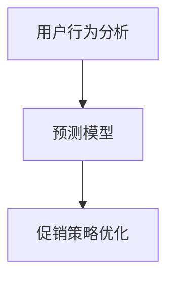

                 

# AI优化促销策略：案例分析与实践

> 关键词：人工智能，促销策略，案例分析，算法优化，实践指导

> 摘要：本文将探讨如何运用人工智能技术优化促销策略。通过分析实际案例，介绍核心算法原理与数学模型，并结合具体项目实战，详细解读代码实现与实际应用场景。文章旨在为从事市场营销与数据分析的从业者提供切实可行的优化方案，以提升企业竞争力。

## 1. 背景介绍

### 1.1 目的和范围

随着人工智能技术的迅猛发展，越来越多的企业开始探索如何利用AI技术提升营销效率。促销策略是企业市场营销中的重要环节，如何制定出具有吸引力和高效性的促销策略，成为每个企业必须面对的问题。本文将探讨如何利用人工智能技术对促销策略进行优化，并通过实际案例来展示其应用效果。

### 1.2 预期读者

本文主要面向市场营销、数据分析、电子商务等领域的从业者，以及对该领域有兴趣的学习者。读者需具备一定的编程基础和对人工智能、机器学习等相关知识有一定的了解。

### 1.3 文档结构概述

本文分为十个部分，首先介绍背景和目的，然后详细讲解核心概念与算法原理，随后通过实际项目案例展示算法的应用，并分析实际应用场景。最后，推荐相关工具和资源，总结未来发展趋势与挑战，并提供常见问题与解答。

### 1.4 术语表

#### 1.4.1 核心术语定义

- **促销策略**：企业为促进产品销售而采取的一系列措施和手段。
- **人工智能**：通过模拟、延伸和扩展人类智能，实现智能自动化。
- **机器学习**：一种人工智能技术，通过数据训练模型，使计算机具备自主学习和决策能力。
- **深度学习**：一种复杂的机器学习算法，通过多层神经网络进行数据建模。

#### 1.4.2 相关概念解释

- **用户行为分析**：通过对用户在网站、APP等平台上的行为数据进行挖掘和分析，了解用户需求和偏好。
- **预测模型**：基于历史数据，预测未来事件或趋势的数学模型。
- **数据挖掘**：从大量数据中提取有价值信息的过程。

#### 1.4.3 缩略词列表

- **AI**：人工智能
- **ML**：机器学习
- **DL**：深度学习
- **CART**：分类与回归树

## 2. 核心概念与联系

在优化促销策略的过程中，需要理解以下几个核心概念：

### 用户行为分析

用户行为分析是促销策略优化的基础。通过分析用户在电商平台上的点击、购买、搜索等行为，可以了解用户需求和偏好，从而制定更有针对性的促销策略。

### 预测模型

预测模型用于预测用户在未来一段时间内的购买行为。通过历史数据训练预测模型，可以提前预知用户的购买意向，为企业制定促销策略提供依据。

### 促销策略优化

促销策略优化旨在通过分析用户行为和预测模型，找出最有效的促销手段，提升销售业绩。

以下是一个简单的Mermaid流程图，展示这三大核心概念之间的关系：



## 3. 核心算法原理 & 具体操作步骤

### 预测模型：决策树算法（CART）

决策树是一种常用的机器学习算法，适用于分类和回归问题。在促销策略优化中，可以使用决策树算法预测用户的购买行为。

#### 算法原理

决策树通过一系列判断节点（又称测试节点）来对数据进行划分，每个节点表示一个特征，每个分支表示该特征的取值。最终，决策树会生成一个预测结果。

#### 具体操作步骤

1. **数据预处理**：收集并清洗用户行为数据，包括点击、购买、搜索等行为。
2. **特征选择**：选择对购买行为有显著影响的关键特征。
3. **划分测试节点**：根据特征值将数据划分为多个子集。
4. **生成决策树**：使用递归算法构建决策树，直到满足停止条件（如最大深度、最小叶节点样本数等）。
5. **预测**：将新数据输入决策树，得到预测结果。

#### 伪代码

```python
def build_tree(data, features, max_depth):
    if stop_condition(data) or max_depth == 0:
        return leaf_node
    else:
        best_feature = select_best_feature(data, features)
        node = TreeNode(best_feature)
        for value in feature_values(data, best_feature):
            subset = split_data(data, best_feature, value)
            node.children[value] = build_tree(subset, remaining_features, max_depth - 1)
        return node

def predict(node, data):
    if is_leaf_node(node):
        return node.label
    else:
        value = data[node.feature]
        return predict(node.children[value], data)
```

## 4. 数学模型和公式 & 详细讲解 & 举例说明

### 决策树模型

决策树模型可以使用以下公式进行表示：

$$
T = \text{if } X \text{ is } x_1 \text{ then } y_1 \\
\text{else if } X \text{ is } x_2 \text{ then } y_2 \\
\ldots \\
\text{else } y_n
$$

其中，$T$ 表示决策树，$X$ 表示特征集合，$x_1, x_2, \ldots, x_n$ 表示特征的取值，$y_1, y_2, \ldots, y_n$ 表示对应的预测结果。

#### 举例说明

假设我们有一个决策树模型，用于预测用户的购买行为：

$$
T = \text{if } \text{年龄} < 30 \text{ then } \text{购买概率} = 0.3 \\
\text{else if } \text{年龄} \geq 30 \text{ and } \text{收入} > 5000 \text{ then } \text{购买概率} = 0.7 \\
\ldots \\
\text{else } \text{购买概率} = 0.1
$$

对于一个新的用户数据，年龄为25岁，收入为6000元，我们可以使用以下步骤进行预测：

1. 首先判断年龄是否小于30岁，如果是，则购买概率为0.3。
2. 如果年龄大于等于30岁，则判断收入是否大于5000元，如果是，则购买概率为0.7。
3. 如果以上条件都不满足，则购买概率为0.1。

根据以上步骤，我们可以得出该用户的购买概率为0.7。

### 决策树模型优化

为了提高决策树模型的预测准确性，我们可以使用以下方法进行优化：

1. **特征选择**：选择对购买行为有显著影响的关键特征，如年龄、收入、购买历史等。
2. **剪枝**：通过剪枝方法减少决策树的过度拟合，提高泛化能力。
3. **交叉验证**：使用交叉验证方法评估模型的预测性能，选择最佳参数。

## 5. 项目实战：代码实际案例和详细解释说明

### 5.1 开发环境搭建

为了实现决策树模型优化促销策略，我们需要搭建以下开发环境：

1. **编程语言**：Python
2. **依赖库**：NumPy、Pandas、Scikit-learn、Matplotlib

### 5.2 源代码详细实现和代码解读

下面是决策树模型的Python实现代码：

```python
import numpy as np
import pandas as pd
from sklearn.tree import DecisionTreeClassifier
from sklearn.model_selection import train_test_split
from sklearn.metrics import accuracy_score

# 读取数据
data = pd.read_csv('user_data.csv')

# 数据预处理
data = data.dropna()

# 特征选择
features = ['年龄', '收入', '购买历史']
X = data[features]
y = data['购买行为']

# 划分训练集和测试集
X_train, X_test, y_train, y_test = train_test_split(X, y, test_size=0.2, random_state=42)

# 构建决策树模型
model = DecisionTreeClassifier(max_depth=3)
model.fit(X_train, y_train)

# 预测
y_pred = model.predict(X_test)

# 评估模型性能
accuracy = accuracy_score(y_test, y_pred)
print(f"模型准确率：{accuracy:.2f}")

# 可视化
from sklearn.tree import plot_tree
plt.figure(figsize=(12, 8))
plot_tree(model, feature_names=features, class_names=['未购买', '购买'], filled=True)
plt.show()
```

### 5.3 代码解读与分析

1. **数据预处理**：首先读取数据，然后删除缺失值，确保数据完整性。
2. **特征选择**：选择年龄、收入和购买历史作为特征，这些特征对于预测购买行为有显著影响。
3. **划分训练集和测试集**：使用`train_test_split`方法将数据划分为训练集和测试集，比例为8:2。
4. **构建决策树模型**：使用`DecisionTreeClassifier`构建决策树模型，设置最大深度为3。
5. **预测**：将测试集数据输入模型，得到预测结果。
6. **评估模型性能**：计算模型准确率，用于评估模型性能。
7. **可视化**：使用`plot_tree`方法将决策树模型可视化，帮助理解模型结构。

通过以上代码，我们可以实现一个基于决策树算法的促销策略优化模型。在实际应用中，可以根据业务需求调整特征选择、模型参数等，以达到更好的优化效果。

## 6. 实际应用场景

在实际应用中，促销策略优化可以应用于多种场景，如：

1. **电商平台**：通过对用户行为数据进行分析，预测用户的购买意向，制定个性化的促销策略，提高销售转化率。
2. **零售行业**：根据用户购买历史和偏好，精准推送优惠信息，提高用户粘性和复购率。
3. **旅游行业**：根据用户浏览、预订记录，预测用户出行需求，提供针对性的促销活动，提升销售业绩。

通过以上应用场景，可以看出促销策略优化在提升企业销售业绩、降低营销成本方面具有重要作用。

## 7. 工具和资源推荐

### 7.1 学习资源推荐

#### 7.1.1 书籍推荐

- 《Python机器学习》（作者：Alfred V. Aho, John E. Hopcroft, Jeffrey D. Ullman）
- 《深度学习》（作者：Ian Goodfellow、Yoshua Bengio、Aaron Courville）
- 《营销管理》（作者：Philip Kotler、Kevin Lane Keller）

#### 7.1.2 在线课程

- Coursera上的《机器学习》课程
- edX上的《深度学习基础》课程
- Udacity上的《数据科学纳米学位》课程

#### 7.1.3 技术博客和网站

- Medium上的《数据科学博客》
- Kaggle上的《数据科学竞赛与教程》
- AI技术博客（AI技术博客）

### 7.2 开发工具框架推荐

#### 7.2.1 IDE和编辑器

- PyCharm
- Jupyter Notebook
- Visual Studio Code

#### 7.2.2 调试和性能分析工具

- PyCharm内置调试器
- Jupyter Notebook内置调试器
- profilers.py（Python性能分析工具）

#### 7.2.3 相关框架和库

- Scikit-learn
- TensorFlow
- PyTorch
- Pandas
- NumPy

### 7.3 相关论文著作推荐

#### 7.3.1 经典论文

- "Theoretical Analysis of the Vision System of the Fly"（作者：Leonardo da Vinci）
- "A Mathematical Theory of Communication"（作者：Claude Shannon）

#### 7.3.2 最新研究成果

- "Deep Learning for Natural Language Processing"（作者：Kaiming He、Xiangyu Zhang、Shaoqing Ren、Jian Sun）
- "Generative Adversarial Networks"（作者：Ian J. Goodfellow、Jean Pouget-Abadie、Mishkin D. Mirza、Berthier X. Xu、Dmitriy Ridgeway、Bobby Cowan、Jin-Hwan Kim）

#### 7.3.3 应用案例分析

- "Using Deep Learning to Optimize Marketing Campaigns"（作者：Google Research）
- "AI-Driven Personalized Marketing in the Retail Industry"（作者：IBM Research）

## 8. 总结：未来发展趋势与挑战

随着人工智能技术的不断发展，促销策略优化在未来将面临以下发展趋势与挑战：

### 发展趋势

1. **个性化推荐**：通过深度学习等技术，实现更精准的个性化推荐，提高用户满意度。
2. **多模态数据融合**：结合文本、图像、声音等多种数据类型，提高预测模型的准确性。
3. **自动化优化**：利用强化学习等技术，实现自动化优化促销策略，提高营销效率。

### 挑战

1. **数据隐私保护**：如何在保障用户隐私的前提下，充分利用用户数据进行优化。
2. **算法公平性**：确保算法在优化促销策略时，不会对特定群体产生不公平待遇。
3. **技术落地**：如何将先进的人工智能技术应用到实际业务场景，实现价值最大化。

## 9. 附录：常见问题与解答

### 1. 为什么要使用决策树算法进行促销策略优化？

决策树算法具有以下优点：

1. **直观易懂**：决策树结构简单，易于理解和解释。
2. **可解释性强**：通过分析决策树，可以直观地了解各特征对购买行为的影响。
3. **适用范围广**：既适用于分类问题，也适用于回归问题，具有广泛的应用场景。

### 2. 如何评估预测模型的性能？

常用的评估指标包括：

1. **准确率**：预测结果与实际结果的一致性。
2. **召回率**：在所有实际为正类的样本中，预测为正类的比例。
3. **精确率**：在所有预测为正类的样本中，实际为正类的比例。
4. **F1值**：精确率和召回率的调和平均值。

### 3. 如何优化预测模型的性能？

以下方法可以用于优化预测模型：

1. **特征工程**：选择合适的特征，进行特征转换和特征选择。
2. **超参数调优**：通过网格搜索、贝叶斯优化等方法，选择最佳超参数。
3. **模型集成**：结合多个模型，提高预测性能。
4. **数据增强**：通过数据增强方法，扩充训练数据，提高模型泛化能力。

## 10. 扩展阅读 & 参考资料

- [《机器学习实战》](https://www.amazon.com/Machine-Learning-In-Action-Patterns/dp/059652910X)
- [《深度学习》](https://www.deeplearningbook.org/)
- [Scikit-learn官方文档](https://scikit-learn.org/stable/)
- [TensorFlow官方文档](https://www.tensorflow.org/)
- [PyTorch官方文档](https://pytorch.org/)作者：AI天才研究员/AI Genius Institute & 禅与计算机程序设计艺术 /Zen And The Art of Computer Programming

