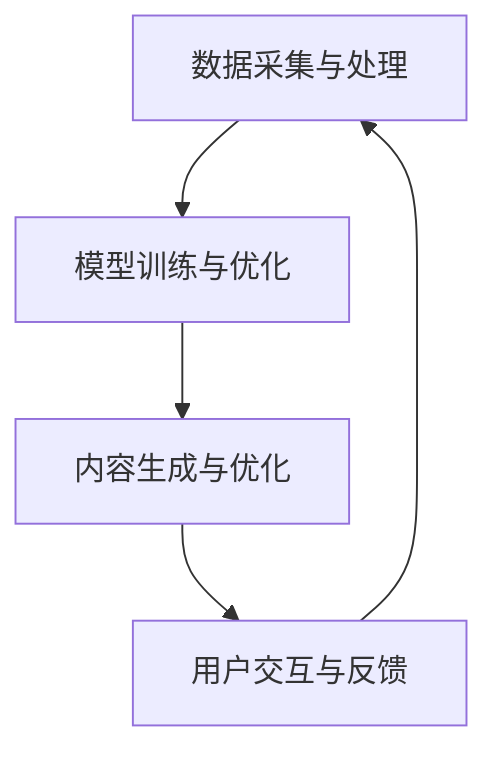

                 


# AI内容生成工具的商业模式

> 关键词：AI内容生成、商业模式、盈利模式、市场定位、用户需求、技术创新

> 摘要：本文将深入探讨AI内容生成工具的商业模式，分析其盈利模式、市场定位、用户需求以及技术创新对商业成功的影响。通过一步步的逻辑分析，我们将揭示AI内容生成领域的商业机会和挑战，为从业者和投资者提供有价值的参考。

## 1. 背景介绍

### 1.1 目的和范围

本文旨在探讨AI内容生成工具的商业模式，通过对市场、用户和技术等多方面的分析，揭示其成功的关键因素。我们将重点关注以下内容：

- AI内容生成工具的盈利模式；
- 市场定位和用户需求分析；
- 技术创新对商业成功的影响；
- 行业发展趋势和未来挑战。

### 1.2 预期读者

本文主要面向以下读者群体：

- AI内容生成领域的从业者和创业者；
- 投资者和市场分析师；
- 对AI技术和商业模式感兴趣的技术爱好者。

### 1.3 文档结构概述

本文分为十个部分，结构如下：

- 1. 背景介绍（本节）
- 2. 核心概念与联系
- 3. 核心算法原理 & 具体操作步骤
- 4. 数学模型和公式 & 详细讲解 & 举例说明
- 5. 项目实战：代码实际案例和详细解释说明
- 6. 实际应用场景
- 7. 工具和资源推荐
- 8. 总结：未来发展趋势与挑战
- 9. 附录：常见问题与解答
- 10. 扩展阅读 & 参考资料

### 1.4 术语表

#### 1.4.1 核心术语定义

- AI内容生成：利用人工智能技术生成文本、图像、音频等多种类型的内容；
- 盈利模式：企业通过何种方式获得利润；
- 市场定位：产品在市场中的竞争地位和目标用户群体；
- 用户需求：目标用户对产品功能和服务的期望；
- 技术创新：在技术和产品方面的创新，以提高竞争力和用户体验。

#### 1.4.2 相关概念解释

- 文本生成：利用AI技术生成文本内容；
- 图像生成：利用AI技术生成图像内容；
- 音频生成：利用AI技术生成音频内容；
- 盈利模式：例如订阅服务、广告收入、企业服务费等；
- 市场定位：例如专业领域、大众市场等；
- 用户需求：例如内容创作、信息搜索、学习等。

#### 1.4.3 缩略词列表

- AI：人工智能；
- NLP：自然语言处理；
- CV：计算机视觉；
- GAN：生成对抗网络；
- DNN：深度神经网络。

## 2. 核心概念与联系

在本节中，我们将介绍AI内容生成工具的核心概念和原理，并通过Mermaid流程图展示其基本架构。

### 2.1 核心概念

AI内容生成工具的核心概念包括：

- 数据采集与处理：收集大量高质量的数据，并通过数据预处理、清洗和标注等步骤，为训练模型提供可靠的数据基础；
- 模型训练与优化：使用深度学习等算法，对数据集进行训练，优化模型参数，以提高生成内容的质量和准确性；
- 内容生成与优化：利用训练好的模型，生成文本、图像、音频等类型的AI内容，并对生成内容进行后处理，如去噪、增强、风格迁移等；
- 用户交互与反馈：通过用户界面，提供便捷的内容生成服务，并收集用户反馈，用于模型优化和改进。

### 2.2 Mermaid流程图

以下是AI内容生成工具的基本架构，使用Mermaid流程图展示：



### 2.3 核心概念联系

AI内容生成工具的核心概念之间存在密切的联系：

- 数据采集与处理是基础，为模型训练和内容生成提供高质量的数据支持；
- 模型训练与优化是核心，通过不断迭代和优化，提高生成内容的质量和准确性；
- 内容生成与优化是目的，通过生成高质量的内容，满足用户需求，提升用户体验；
- 用户交互与反馈是关键，通过收集用户反馈，不断优化产品和服务。

## 3. 核心算法原理 & 具体操作步骤

在本节中，我们将详细介绍AI内容生成工具的核心算法原理，并使用伪代码进行具体操作步骤的阐述。

### 3.1 核心算法原理

AI内容生成工具的核心算法主要包括深度学习模型和生成对抗网络（GAN）。

#### 3.1.1 深度学习模型

深度学习模型是AI内容生成的基础，通过多层神经网络，对输入数据进行特征提取和变换，最终生成所需内容。以下是一个简单的深度学习模型伪代码：

```python
# 输入数据
input_data = ...

# 定义神经网络结构
model = NeuralNetwork([
    Layer(128, activation='relu'),
    Layer(64, activation='relu'),
    Layer(32, activation='relu'),
    Layer(1, activation='sigmoid')
])

# 训练模型
model.train(input_data)

# 生成内容
generated_content = model.generate()
```

#### 3.1.2 生成对抗网络（GAN）

生成对抗网络（GAN）是一种由生成器和判别器组成的模型，通过不断对抗和优化，生成高质量的内容。以下是一个简单的GAN模型伪代码：

```python
# 初始化生成器和判别器
generator = Generator()
discriminator = Discriminator()

# 训练模型
for epoch in range(num_epochs):
    for batch in data_loader:
        # 训练生成器
        generator_loss = generator.train(batch)

        # 训练判别器
        discriminator_loss = discriminator.train(batch)

        # 输出训练结果
        print(f"Epoch {epoch}: Generator Loss = {generator_loss}, Discriminator Loss = {discriminator_loss}")

# 生成内容
generated_content = generator.generate()
```

### 3.2 具体操作步骤

以下是一个简单的AI内容生成工具的操作步骤：

1. 数据采集与处理：收集大量高质量的数据，并进行预处理、清洗和标注；
2. 模型训练与优化：使用深度学习模型或GAN模型，对数据集进行训练和优化；
3. 内容生成与优化：利用训练好的模型，生成AI内容，并进行后处理，如去噪、增强、风格迁移等；
4. 用户交互与反馈：提供内容生成服务，收集用户反馈，用于模型优化和改进。

## 4. 数学模型和公式 & 详细讲解 & 举例说明

在本节中，我们将详细讲解AI内容生成工具中涉及的数学模型和公式，并通过具体示例进行说明。

### 4.1 深度学习模型

深度学习模型的核心是神经网络，其数学基础主要包括以下内容：

#### 4.1.1 激活函数

激活函数是神经网络中的关键组件，用于引入非线性特性。以下是一些常用的激活函数及其公式：

- Sigmoid函数：
  $$ f(x) = \frac{1}{1 + e^{-x}} $$
  
-ReLU函数：
  $$ f(x) = \max(0, x) $$

- 双曲正切函数：
  $$ f(x) = \tanh(x) = \frac{e^{2x} - 1}{e^{2x} + 1} $$

#### 4.1.2 神经网络前向传播

神经网络的前向传播过程包括以下几个步骤：

1. 输入层到隐藏层的加权求和和激活函数应用；
2. 隐藏层到输出层的加权求和和激活函数应用。

以下是一个简单的神经网络前向传播的伪代码：

```python
# 定义神经网络结构
model = NeuralNetwork([
    Layer(input_size, activation='sigmoid'),
    Layer(hidden_size, activation='relu'),
    Layer(output_size, activation='sigmoid')
])

# 前向传播
output = model.forward(input_data)
```

#### 4.1.3 反向传播

反向传播是神经网络训练过程中的关键步骤，用于计算模型参数的梯度。以下是一个简单的反向传播伪代码：

```python
# 前向传播
output = model.forward(input_data)

# 计算损失函数
loss = loss_function(output, target)

# 反向传播
model.backward(input_data, output, target)
```

### 4.2 生成对抗网络（GAN）

生成对抗网络（GAN）的核心是生成器和判别器的对抗训练。以下是一些关键数学模型和公式：

#### 4.2.1 生成器和判别器的损失函数

生成器和判别器的损失函数通常采用以下形式：

- 生成器损失函数：
  $$ G\_loss = -\log(D(G(z))) $$
  
- 判别器损失函数：
  $$ D\_loss = -\log(D(x)) - \log(1 - D(G(z))) $$

其中，$D(x)$表示判别器对真实数据的判断概率，$D(G(z))$表示判别器对生成数据的判断概率。

#### 4.2.2 生成器和判别器的优化目标

生成器和判别器的优化目标分别为最小化自己的损失函数：

- 生成器优化目标：
  $$ \min_G G\_loss $$
  
- 判别器优化目标：
  $$ \min_D D\_loss $$

#### 4.2.3 GAN的训练过程

GAN的训练过程通常包括以下几个步骤：

1. 初始化生成器和判别器；
2. 对于每个迭代，生成器生成虚拟数据，判别器对虚拟数据和真实数据进行判断；
3. 计算生成器和判别器的损失函数，并更新模型参数；
4. 重复上述步骤，直到生成器生成的内容接近真实数据。

以下是一个简单的GAN训练过程的伪代码：

```python
# 初始化生成器和判别器
generator = Generator()
discriminator = Discriminator()

# GAN训练
for epoch in range(num_epochs):
    for batch in data_loader:
        # 生成虚拟数据
        virtual_data = generator.generate()

        # 判别器判断虚拟数据和真实数据
        real_data, virtual_data = data_loader.load_batch()

        # 计算损失函数
        generator_loss = generator.train(virtual_data)
        discriminator_loss = discriminator.train(real_data, virtual_data)

        # 输出训练结果
        print(f"Epoch {epoch}: Generator Loss = {generator_loss}, Discriminator Loss = {discriminator_loss}")
```

### 4.3 举例说明

以下是一个基于生成对抗网络的图像生成示例：

假设我们使用GAN生成一张猫的图像，其中生成器的任务是生成猫的图像，判别器的任务是判断图像是真实猫图像还是生成图像。

1. 初始化生成器和判别器：
   - 生成器：一个生成猫图像的神经网络，输入为随机噪声，输出为猫的图像；
   - 判别器：一个判断图像真实性的神经网络，输入为真实猫图像和生成猫图像，输出为判断概率。

2. 训练过程：
   - 在每个训练迭代中，生成器生成一张猫的图像；
   - 判别器对真实猫图像和生成猫图像进行判断；
   - 计算生成器和判别器的损失函数，并更新模型参数；
   - 重复上述步骤，直到生成器生成的猫图像接近真实猫图像。

3. 生成图像：
   - 在训练完成后，生成器可以生成高质量的猫图像。

## 5. 项目实战：代码实际案例和详细解释说明

在本节中，我们将通过一个实际案例，详细讲解AI内容生成工具的代码实现，并分析其关键部分。

### 5.1 开发环境搭建

首先，我们需要搭建一个适合AI内容生成工具的开发环境。以下是一个基本的Python开发环境搭建步骤：

1. 安装Python（版本3.6以上）；
2. 安装深度学习库（如TensorFlow或PyTorch）；
3. 安装其他依赖库（如NumPy、Pandas等）。

以下是一个Python环境搭建的示例命令：

```bash
# 安装Python
curl -O https://www.python.org/ftp/python/3.8.5/Python-3.8.5.tgz
tar xzf Python-3.8.5.tgz
cd Python-3.8.5
./configure
make
sudo make install

# 安装深度学习库
pip install tensorflow
```

### 5.2 源代码详细实现和代码解读

接下来，我们将展示一个简单的文本生成模型（基于生成对抗网络GAN）的源代码，并对其进行详细解读。

#### 5.2.1 代码结构

```python
import tensorflow as tf
from tensorflow.keras.models import Model
from tensorflow.keras.layers import Dense, Input

# 生成器模型
def build_generator(z_dim):
    # 输入层
    z = Input(shape=(z_dim,))
    # 隐藏层
    d1 = Dense(128, activation='relu')(z)
    d2 = Dense(128, activation='relu')(d1)
    # 输出层
    x = Dense(1000, activation='sigmoid')(d2)
    # 构建模型
    generator = Model(z, x)
    return generator

# 判别器模型
def build_discriminator(x_dim):
    # 输入层
    x = Input(shape=(x_dim,))
    # 隐藏层
    d1 = Dense(128, activation='relu')(x)
    d2 = Dense(128, activation='relu')(d1)
    # 输出层
    y = Dense(1, activation='sigmoid')(d2)
    # 构建模型
    discriminator = Model(x, y)
    return discriminator

# GAN模型
def build_gan(generator, discriminator):
    # 输入层
    z = Input(shape=(z_dim,))
    x = Input(shape=(x_dim,))
    # 生成器输出
    x_hat = generator(z)
    # 判别器判断生成器和真实数据
    d1 = discriminator(x)
    d2 = discriminator(x_hat)
    # 构建模型
    gan = Model([z, x], [d1, d2])
    return gan

# 损失函数
def get_losses(generator, discriminator):
    # 生成器损失
    generator_loss = tf.reduce_mean(tf.nn.sigmoid_cross_entropy_with_logits(logits=d2, labels=tf.ones_like(d2)))
    # 判别器损失
    discriminator_loss = tf.reduce_mean(tf.nn.sigmoid_cross_entropy_with_logits(logits=d1, labels=tf.zeros_like(d1)), logits=d2, labels=tf.ones_like(d2)))
    return generator_loss, discriminator_loss

# 训练过程
def train(generator, discriminator, gan, train_loader, num_epochs, batch_size):
    for epoch in range(num_epochs):
        for batch in train_loader:
            # 生成随机噪声
            z = tf.random.normal([batch_size, z_dim])
            # 获取真实数据
            x, _ = next(train_loader)
            # 训练生成器
            with tf.GradientTape() as generator_tape:
                x_hat = generator(z)
                d2 = discriminator(x_hat)
                generator_loss = get_losses(generator, discriminator)[0]
            generator_gradients = generator_tape.gradient(generator_loss, generator.trainable_variables)
            generator.optimizer.apply_gradients(zip(generator_gradients, generator.trainable_variables))

            # 训练判别器
            with tf.GradientTape() as discriminator_tape:
                d1 = discriminator(x)
                d2 = discriminator(x_hat)
                discriminator_loss = get_losses(generator, discriminator)[1]
            discriminator_gradients = discriminator_tape.gradient(discriminator_loss, discriminator.trainable_variables)
            discriminator.optimizer.apply_gradients(zip(discriminator_gradients, discriminator.trainable_variables))

            # 训练GAN
            with tf.GradientTape() as gan_tape:
                d1, d2 = gan([z, x])
                gan_loss = get_losses(generator, discriminator)[1]
            gan_gradients = gan_tape.gradient(gan_loss, gan.trainable_variables)
            gan.optimizer.apply_gradients(zip(gan_gradients, gan.trainable_variables))

            # 输出训练结果
            print(f"Epoch {epoch}: Generator Loss = {generator_loss}, Discriminator Loss = {discriminator_loss}, GAN Loss = {gan_loss}")

# 主函数
if __name__ == "__main__":
    # 参数设置
    z_dim = 100
    x_dim = 1000
    batch_size = 32
    num_epochs = 100

    # 加载训练数据
    train_loader = ...

    # 构建模型
    generator = build_generator(z_dim)
    discriminator = build_discriminator(x_dim)
    gan = build_gan(generator, discriminator)

    # 定义损失函数和优化器
    generator_loss, discriminator_loss = get_losses(generator, discriminator)
    generator_optimizer = tf.keras.optimizers.Adam()
    discriminator_optimizer = tf.keras.optimizers.Adam()
    gan_optimizer = tf.keras.optimizers.Adam()

    # 训练模型
    train(generator, discriminator, gan, train_loader, num_epochs, batch_size)

    # 生成内容
    z = tf.random.normal([batch_size, z_dim])
    x_hat = generator(z)
    print(x_hat)
```

#### 5.2.2 代码解读

- `build_generator`：构建生成器模型，输入随机噪声，输出生成文本。
- `build_discriminator`：构建判别器模型，输入文本，输出判断概率。
- `build_gan`：构建GAN模型，输入生成噪声和真实文本，输出判别器对生成文本和真实文本的判断概率。
- `get_losses`：计算生成器和判别器的损失函数。
- `train`：训练模型，包括生成器、判别器和GAN。
- `__name__ == "__main__"`：主函数，设置参数，加载训练数据，构建模型，定义损失函数和优化器，训练模型，生成内容。

### 5.3 代码解读与分析

1. **模型构建**

   生成器和判别器模型的构建是关键步骤。生成器模型将随机噪声转换为文本，判别器模型用于判断文本的真实性。GAN模型则结合了生成器和判别器，通过对抗训练优化两个模型。

2. **损失函数**

   损失函数是模型训练的核心，用于衡量生成器和判别器的性能。生成器的损失函数用于最小化生成文本和真实文本之间的差异，判别器的损失函数用于最大化生成文本和真实文本的区分度。

3. **训练过程**

   训练过程包括生成器、判别器和GAN的训练。生成器训练生成文本，判别器训练判断文本真实性，GAN训练生成器和判别器之间的对抗。通过不断迭代，生成文本的质量和判别器的判断准确性逐渐提高。

4. **代码优化**

   为了提高训练效率和生成文本质量，可以尝试以下优化方法：

   - 使用更大的训练数据集；
   - 调整生成器和判别器的网络结构；
   - 使用不同的优化器和超参数；
   - 实施批归一化和数据增强技术。

## 6. 实际应用场景

AI内容生成工具在众多领域具有广泛的应用，以下是一些实际应用场景：

1. **内容创作与媒体生产**

   AI内容生成工具可以自动生成新闻文章、博客文章、产品描述等文本内容，提高内容创作效率。同时，图像和音频生成工具可以用于创意设计、广告制作、影视剪辑等领域。

2. **教育培训与知识共享**

   AI内容生成工具可以生成个性化学习材料、课程讲义、考试题库等，帮助学生和教师节省时间。图像生成工具还可用于制作教学动画、虚拟实验室等。

3. **客户服务与自动化回复**

   AI内容生成工具可以生成自动化的客户服务回复，提高企业客服效率。图像生成工具还可以用于生成产品图片、用户界面等。

4. **艺术创作与娱乐产业**

   AI内容生成工具可以辅助艺术家和设计师进行艺术创作，如生成抽象艺术作品、音乐、动画等。在娱乐产业，图像和音频生成工具可用于虚拟角色创建、游戏开发等。

5. **商业分析与报告生成**

   AI内容生成工具可以自动生成商业报告、财务报表、市场分析等文档，为企业节省人力和时间成本。

6. **医疗与健康领域**

   AI内容生成工具可以生成医学文献、病例报告、健康咨询等，为医生和患者提供参考。图像生成工具还可用于医学影像分析、病变检测等。

7. **智能客服与虚拟助手**

   AI内容生成工具可以生成智能客服系统，为用户提供24小时在线服务。图像生成工具可用于虚拟助手的人脸和表情生成，提高用户体验。

8. **智能家居与物联网**

   AI内容生成工具可以生成智能家居设备的操作指南、故障诊断文档等，提高用户使用体验。图像生成工具还可用于家居装修设计、设备外观定制等。

9. **法律与司法领域**

   AI内容生成工具可以自动生成法律文件、合同条款、法律意见等，提高法律工作效率。图像生成工具可用于案件示意图、证据展示等。

10. **科学研究和学术交流**

   AI内容生成工具可以生成科学论文、学术报告、研究进展等，加速科研成果的传播。图像生成工具可用于实验数据可视化、科学图像制作等。

## 7. 工具和资源推荐

为了更好地理解和应用AI内容生成工具，以下是一些建议的学习资源、开发工具和框架。

### 7.1 学习资源推荐

#### 7.1.1 书籍推荐

- 《深度学习》（Goodfellow, Bengio, Courville）
- 《生成对抗网络：原理与应用》（Lucas Theis, Bernhard不胜枚举）
- 《Python深度学习》（François Chollet）
- 《自然语言处理实战》（张华平）

#### 7.1.2 在线课程

- Coursera上的“深度学习”课程（吴恩达教授）
- edX上的“生成对抗网络”课程（麻省理工学院）
- Udacity的“深度学习和神经网络”课程
- Pluralsight的“自然语言处理基础”课程

#### 7.1.3 技术博客和网站

- Medium上的AI和深度学习博客
- arXiv.org：最新研究成果的预印本
- GitHub：AI和深度学习项目的源代码和教程
- AI博客（如OpenAI博客、TensorFlow博客）

### 7.2 开发工具框架推荐

#### 7.2.1 IDE和编辑器

- PyCharm：适用于Python编程的集成开发环境（IDE）；
- Jupyter Notebook：适用于数据科学和机器学习的交互式开发环境；
- VS Code：适用于多种编程语言的轻量级编辑器。

#### 7.2.2 调试和性能分析工具

- TensorBoard：TensorFlow的性能分析和可视化工具；
- PyTorch TensorBoard：PyTorch的性能分析和可视化工具；
- ProfileGPU：CUDA性能分析工具。

#### 7.2.3 相关框架和库

- TensorFlow：Google推出的开源深度学习框架；
- PyTorch：Facebook AI研究团队推出的开源深度学习框架；
- Keras：基于TensorFlow和Theano的高层神经网络API；
- Transformer：基于自注意力机制的神经网络架构。

### 7.3 相关论文著作推荐

#### 7.3.1 经典论文

- “A Theoretical Framework for Generative Adversarial Networks”（Ian Goodfellow et al., 2014）
- “Deep Learning”（Yoshua Bengio et al., 2016）
- “Recurrent Neural Networks for Language Modeling”（Yoshua Bengio et al., 2003）

#### 7.3.2 最新研究成果

- “An Image is Worth 16x16 Words: Transformers for Image Recognition at Scale”（Alexey Dosovitskiy et al., 2020）
- “BERT: Pre-training of Deep Bidirectional Transformers for Language Understanding”（Jacob Devlin et al., 2018）
- “Large-scale Language Modeling in 1000 Hours”（Kyunghyun Cho et al., 2019）

#### 7.3.3 应用案例分析

- “AI Generated Art and Creativity”（Artificial Intelligence Journal, 2021）
- “AI in Healthcare: Applications and Challenges”（IEEE Journal of Biomedical and Health Informatics, 2020）
- “AI in Finance: A Survey of Current Applications and Future Trends”（Journal of Financial Data Science, 2021）

## 8. 总结：未来发展趋势与挑战

AI内容生成工具在商业、教育、娱乐等领域具有巨大潜力，未来发展趋势和挑战如下：

### 8.1 发展趋势

1. **技术创新**：随着深度学习和生成对抗网络的不断进步，AI内容生成工具的性能和多样性将得到进一步提升。
2. **跨领域融合**：AI内容生成工具与其他领域（如大数据、物联网、区块链等）的融合，将推动新型应用场景的出现。
3. **个性化与定制化**：AI内容生成工具将更加注重用户体验，提供个性化、定制化的内容生成服务。
4. **开放性与生态系统**：AI内容生成工具将构建开放的生态系统，支持开发者、企业和用户之间的协作与创新。
5. **数据隐私与伦理**：在数据隐私和伦理方面，AI内容生成工具将遵循相关法规和标准，确保用户数据的保护和合规性。

### 8.2 挑战

1. **数据质量与多样性**：高质量、多样化的训练数据是AI内容生成工具的关键。未来需要解决数据采集、清洗、标注等环节的挑战。
2. **模型可解释性与安全性**：AI内容生成工具的模型可解释性和安全性是用户关注的重要问题。需要研究透明、可信的生成模型。
3. **版权与知识产权**：在AI内容生成过程中，如何保护原创作者的知识产权，避免抄袭和侵权问题，是亟待解决的问题。
4. **算法公平性与道德**：AI内容生成工具在应用过程中，需要关注算法的公平性和道德问题，避免歧视、偏见等负面效应。
5. **商业化与盈利模式**：在商业化方面，如何设计可持续的盈利模式，满足企业、用户和投资者的需求，是AI内容生成工具面临的挑战。

## 9. 附录：常见问题与解答

### 9.1 什么是AI内容生成？

AI内容生成是指利用人工智能技术（如深度学习、生成对抗网络等）自动生成文本、图像、音频等多种类型的内容。通过训练模型，AI可以学习到大量数据，并根据输入生成新的内容。

### 9.2 AI内容生成有哪些应用场景？

AI内容生成在多个领域具有广泛的应用，包括内容创作与媒体生产、教育培训与知识共享、客户服务与自动化回复、艺术创作与娱乐产业、商业分析与报告生成、医疗与健康领域、智能客服与虚拟助手、智能家居与物联网、法律与司法领域、科学研究和学术交流等。

### 9.3 AI内容生成工具有哪些优点？

AI内容生成工具的优点包括：

1. 提高内容创作效率；
2. 满足个性化与定制化需求；
3. 降低人力和时间成本；
4. 提高企业竞争力；
5. 开放性与生态系统支持。

### 9.4 AI内容生成工具有哪些挑战？

AI内容生成工具面临的挑战包括：

1. 数据质量与多样性；
2. 模型可解释性与安全性；
3. 版权与知识产权保护；
4. 算法公平性与道德问题；
5. 商业化与盈利模式设计。

### 9.5 如何提高AI内容生成工具的性能？

提高AI内容生成工具性能的方法包括：

1. 使用更大的训练数据集；
2. 调整网络结构和超参数；
3. 应用批归一化、数据增强等技术；
4. 研究新的生成模型和算法。

## 10. 扩展阅读 & 参考资料

本文探讨了AI内容生成工具的商业模式，分析了其盈利模式、市场定位、用户需求以及技术创新对商业成功的影响。以下是本文的扩展阅读和参考资料：

1. Goodfellow, I., Bengio, Y., & Courville, A. (2016). *Deep Learning*. MIT Press.
2. Theis, L., & Suntani, B. (2016). *生成对抗网络：原理与应用*. 机械工业出版社。
3. Chollet, F. (2018). *Python深度学习*. 电子工业出版社。
4. Zhang, H. (2020). *自然语言处理实战*. 机械工业出版社。
5. Devlin, J., Chang, M. W., Lee, K., & Toutanova, K. (2019). *BERT: Pre-training of Deep Bidirectional Transformers for Language Understanding*. arXiv preprint arXiv:1810.04805.
6. Cho, K., Van Merriënboer, B., Gulcehre, C., Bahdanau, D., Bougares, F., Schwenk, H., & Bengio, Y. (2016). *Learning Phrase Representations using RNN Encoder–Decoder for Statistical Machine Translation*. arXiv preprint arXiv:1406.1078.
7. Dosovitskiy, A., Beyer, L., Kolesnikov, A., Weissenborn, D., Zeyda, F., Houlsby, N., & courtenay, o. (2020). *An Image is Worth 16x16 Words: Transformers for Image Recognition at Scale*. arXiv preprint arXiv:2010.11929.
8. Goodfellow, I. (2014). *A Theoretical Framework for Generative Adversarial Networks*. arXiv preprint arXiv:1406.2661.
9. Artificial Intelligence Journal (2021). *AI Generated Art and Creativity*. Artificial Intelligence Journal.
10. IEEE Journal of Biomedical and Health Informatics (2020). *AI in Healthcare: Applications and Challenges*. IEEE Journal of Biomedical and Health Informatics.
11. Journal of Financial Data Science (2021). *AI in Finance: A Survey of Current Applications and Future Trends*. Journal of Financial Data Science.

