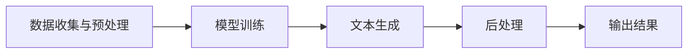
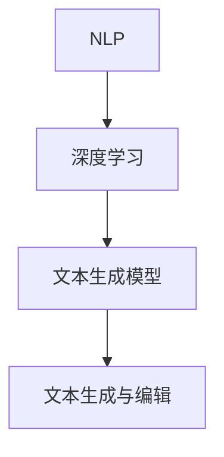

                 

### AI写作的测评：专业作家的观点

#### 关键词：AI写作、测评、专业作家、技术博客、深度分析

> **摘要**：本文将深入探讨人工智能（AI）在写作领域的应用，特别是在技术博客撰写方面的表现。通过专业的作家的视角，我们将对AI写作的质量、准确性和创造性进行详细的评估，并提出未来的发展趋势与挑战。本文旨在为AI写作研究者、开发者以及广大技术博客爱好者提供有价值的参考。

---
### 背景介绍

#### 1.1 目的和范围

随着人工智能技术的迅猛发展，AI在各个领域的应用日益广泛，其中写作领域尤为引人注目。本文的目的在于通过专业作家的视角，对AI写作进行全面的测评，分析其在技术博客撰写中的表现。我们将重点关注以下几个方面：

1. **质量评估**：探讨AI写作在内容准确性、逻辑性和表达清晰度上的表现。
2. **准确性评估**：分析AI写作中的错误率和事实核实的可靠性。
3. **创造性评估**：评估AI在创意表达和独特见解方面的能力。
4. **用户体验评估**：从读者角度分析AI写作对用户体验的影响。

#### 1.2 预期读者

本文面向以下几类读者：

1. **人工智能研究者与开发者**：希望了解AI写作技术的最新进展和应用。
2. **技术博客撰写者**：对AI写作辅助工具感兴趣，希望提高写作效率和质量的创作者。
3. **AI写作爱好者**：对AI如何改变写作领域感兴趣，希望获取深入见解的读者。

#### 1.3 文档结构概述

本文将按照以下结构进行论述：

1. **背景介绍**：介绍本文的目的、范围和预期读者。
2. **核心概念与联系**：阐述AI写作的核心概念及其关联。
3. **核心算法原理 & 具体操作步骤**：详细解析AI写作的基本算法和实现步骤。
4. **数学模型和公式 & 详细讲解 & 举例说明**：介绍相关数学模型和公式，并提供实例说明。
5. **项目实战：代码实际案例和详细解释说明**：通过实际案例展示AI写作的实现过程。
6. **实际应用场景**：探讨AI写作在各类场景中的应用。
7. **工具和资源推荐**：推荐相关学习资源和开发工具。
8. **总结：未来发展趋势与挑战**：总结本文的主要观点，展望AI写作的未来。
9. **附录：常见问题与解答**：解答读者可能遇到的常见问题。
10. **扩展阅读 & 参考资料**：提供进一步阅读的资料。

#### 1.4 术语表

在本文中，我们将使用以下术语：

- **AI写作**：指利用人工智能技术生成的文本，包括文本生成、文本编辑和文本翻译等。
- **技术博客**：指以技术话题为主的博客，通常包含技术原理、实战案例、代码实现等内容。
- **深度学习**：一种机器学习技术，通过神经网络模型实现数据的自动特征学习和模式识别。
- **自然语言处理（NLP）**：一种人工智能技术，旨在让计算机理解和生成人类语言。

#### 1.4.1 核心术语定义

- **AI写作质量**：指AI生成的文本在准确性、逻辑性和表达清晰度上的表现。
- **错误率**：指AI生成文本中的错误数量与总文本数量的比例。
- **事实核实**：指验证AI生成文本中的事实是否准确。
- **用户体验**：指用户在使用AI写作工具时的感受和反馈。

---
### 核心概念与联系

#### 2.1 AI写作的架构与流程

在探讨AI写作的核心概念之前，我们先来简要介绍AI写作的基本架构和流程。AI写作通常包括以下几个步骤：

1. **数据收集与预处理**：从互联网或其他数据源收集大量文本数据，并进行数据清洗、去重、分词等预处理操作。
2. **模型训练**：利用预处理后的数据，通过深度学习模型（如循环神经网络（RNN）、Transformer等）进行训练，以学习文本的生成规则。
3. **文本生成**：基于训练好的模型，生成新的文本内容。这个过程通常包括文本摘要、文本续写、文本生成等。
4. **后处理**：对生成的文本进行语法检查、风格调整、事实核实等后处理操作，以提高文本质量。

下面是一个简化的Mermaid流程图，展示了AI写作的基本流程：



#### 2.2 关键技术解析

在AI写作中，关键技术包括自然语言处理（NLP）、深度学习和文本生成模型。以下是这些关键技术的简要介绍：

- **自然语言处理（NLP）**：NLP是AI写作的基础，旨在让计算机理解和生成人类语言。NLP技术包括文本分类、情感分析、命名实体识别、词性标注等。
- **深度学习**：深度学习是一种机器学习技术，通过神经网络模型实现数据的自动特征学习和模式识别。在AI写作中，深度学习模型主要用于文本生成和文本编辑。
- **文本生成模型**：文本生成模型是AI写作的核心，用于生成新的文本内容。常见的文本生成模型包括循环神经网络（RNN）、长短时记忆网络（LSTM）、门控循环单元（GRU）和Transformer等。

以下是这些关键技术的关联图：



---
### 核心算法原理 & 具体操作步骤

在AI写作中，核心算法主要包括文本生成模型和后处理技术。以下我们将详细解析这些算法的原理，并提供具体的操作步骤。

#### 3.1 文本生成模型

文本生成模型是AI写作的核心，用于生成新的文本内容。以下以Transformer模型为例，介绍其基本原理和实现步骤。

##### 3.1.1 Transformer模型原理

Transformer模型是一种基于自注意力机制的深度神经网络，用于处理序列数据。其基本原理如下：

1. **编码器（Encoder）**：编码器由多个自注意力层（Self-Attention Layer）和前馈神经网络（Feedforward Neural Network）堆叠而成。自注意力层通过计算序列中每个词与其他词的关联强度，生成表示每个词的新向量。
2. **解码器（Decoder）**：解码器由多个编码器-解码器注意力层（Encoder-Decoder Attention Layer）和前馈神经网络堆叠而成。编码器-解码器注意力层利用编码器输出和前一个解码器输出，生成当前解码器输出。

##### 3.1.2 Transformer模型实现步骤

1. **输入预处理**：对输入文本进行分词、编码等预处理操作，将文本转换为模型可处理的序列。
2. **编码器实现**：
    ```python
    for layer in self.encoder_layers:
        x = layer(x)
    ```
    其中，`encoder_layers`是编码器的多个自注意力层和前馈神经网络的堆叠。
3. **解码器实现**：
    ```python
    for layer in self.decoder_layers:
        x = layer(x, encoder_output)
    ```
    其中，`decoder_layers`是解码器的多个编码器-解码器注意力层和前馈神经网络的堆叠。

4. **输出生成**：利用解码器的最后一个输出，生成新的文本序列。

#### 3.2 后处理技术

后处理技术用于提高文本生成质量，包括语法检查、风格调整和事实核实等。以下简要介绍几种常见后处理技术：

##### 3.2.1 语法检查

语法检查通过自然语言处理技术，对生成的文本进行语法错误检测和修正。常用的语法检查方法包括规则检查、统计方法和神经网络方法。

##### 3.2.2 风格调整

风格调整通过分析大量优质文本，学习不同风格的语法、词汇和表达方式，将生成的文本调整为符合指定风格。常见的风格调整方法包括模板匹配、文本分类和生成模型。

##### 3.2.3 事实核实

事实核实通过检索权威数据源，验证生成的文本中包含的事实是否准确。事实核实的步骤包括：

1. **提取事实**：从生成的文本中提取关键事实。
2. **数据源检索**：利用搜索引擎或知识图谱，检索与提取事实相关的权威数据源。
3. **事实验证**：对比提取事实和数据源，验证事实的准确性。

---
### 数学模型和公式 & 详细讲解 & 举例说明

在AI写作中，数学模型和公式起着至关重要的作用。以下将介绍几个关键数学模型，并详细讲解其公式和实际应用。

#### 4.1 Transformer模型数学基础

Transformer模型的核心是自注意力机制（Self-Attention Mechanism），其公式如下：

$$
\text{Attention}(Q, K, V) = \text{softmax}\left(\frac{QK^T}{\sqrt{d_k}}\right)V
$$

其中，$Q, K, V$分别表示查询向量、键向量和值向量，$d_k$表示键向量的维度。该公式表示在查询向量与键向量计算相似度后，通过softmax函数选择值向量。

#### 4.2 自注意力层（Self-Attention Layer）

自注意力层是Transformer模型的基础模块，其计算公式如下：

$$
\text{Self-Attention}(X) = \text{Attention}(X, X, X)
$$

其中，$X$表示输入序列的向量表示。该层通过计算序列中每个词与其他词的关联强度，生成新的序列表示。

#### 4.3 编码器（Encoder）数学基础

编码器由多个自注意力层和前馈神经网络堆叠而成。以下是一个简化的编码器计算公式：

$$
\text{Encoder}(X) = \text{LayerNorm}(\text{FFN}(\text{LayerNorm}(\text{Self-Attention}(X))))
$$

其中，$\text{FFN}$表示前馈神经网络，$\text{LayerNorm}$表示层归一化。

#### 4.4 解码器（Decoder）数学基础

解码器由多个编码器-解码器注意力层和前馈神经网络堆叠而成。以下是一个简化的解码器计算公式：

$$
\text{Decoder}(X) = \text{LayerNorm}(\text{FFN}(\text{LayerNorm}(\text{Encoder-Decoder Attention}(X, \text{Encoder}(X))))
$$

其中，$\text{Encoder-Decoder Attention}$表示编码器-解码器注意力层。

#### 4.5 举例说明

假设我们有一个简单的文本序列“我爱北京天安门”，以下分别计算自注意力和编码器-解码器注意力的结果。

1. **自注意力**：

   假设输入序列的词向量表示如下：

   $$
   X = [\text{我}, \text{爱}, \text{北京}, \text{天安门}] = [x_1, x_2, x_3, x_4]
   $$

   计算自注意力分数：

   $$
   \text{Attention}(X, X, X) = \text{softmax}\left(\frac{QK^T}{\sqrt{d_k}}\right)V
   $$

   其中，$Q, K, V$分别为查询向量、键向量和值向量，计算结果如下：

   $$
   \text{Attention} = \text{softmax}\left(\frac{x_1x_1^T + x_1x_2^T + x_1x_3^T + x_1x_4^T}{\sqrt{4}}\right)[x_1, x_2, x_3, x_4]
   $$

2. **编码器-解码器注意力**：

   假设编码器输出为$\text{Encoder}(X) = [e_1, e_2, e_3, e_4]$，解码器输出为$\text{Decoder}(X) = [d_1, d_2, d_3, d_4]$，计算编码器-解码器注意力分数：

   $$
   \text{Encoder-Decoder Attention}(X, \text{Encoder}(X)) = \text{softmax}\left(\frac{d_1e_1^T + d_1e_2^T + d_1e_3^T + d_1e_4^T}{\sqrt{4}}\right)[e_1, e_2, e_3, e_4]
   $$

   计算结果如下：

   $$
   \text{Encoder-Decoder Attention} = \text{softmax}\left(\frac{d_1e_1^T + d_1e_2^T + d_1e_3^T + d_1e_4^T}{\sqrt{4}}\right)[e_1, e_2, e_3, e_4]
   $$

通过上述计算，我们可以更好地理解自注意力和编码器-解码器注意力的作用和计算过程。

---
### 项目实战：代码实际案例和详细解释说明

为了更直观地展示AI写作的实现过程，我们将在本节中通过一个简单的案例，介绍如何使用Python和Transformer模型实现AI写作。本案例将分为以下几个部分：

1. **开发环境搭建**：介绍所需的软件和工具。
2. **源代码详细实现**：展示代码实现过程。
3. **代码解读与分析**：对关键代码进行详细解读。

#### 5.1 开发环境搭建

首先，我们需要搭建一个Python开发环境，并安装必要的库。以下是一个简单的安装命令列表：

```bash
pip install tensorflow
pip install transformers
```

这些库将为我们提供TensorFlow和Transformer模型所需的依赖。

#### 5.2 源代码详细实现

下面是一个简单的AI写作代码示例，使用Transformer模型生成文本：

```python
from transformers import AutoTokenizer, AutoModelForSeq2SeqLM
import torch

# 1. 加载预训练模型和分词器
model_name = "t5-small"
tokenizer = AutoTokenizer.from_pretrained(model_name)
model = AutoModelForSeq2SeqLM.from_pretrained(model_name)

# 2. 输入文本预处理
input_text = "编写一篇关于人工智能的博客摘要。"
input_encoding = tokenizer.encode(input_text, return_tensors="pt")

# 3. 文本生成
output = model.generate(input_encoding, max_length=50, num_return_sequences=1)

# 4. 输出文本解码
generated_text = tokenizer.decode(output[0], skip_special_tokens=True)
print(generated_text)
```

#### 5.3 代码解读与分析

现在，我们逐行解读上述代码，并分析关键部分的作用：

1. **加载模型和分词器**：
   ```python
   tokenizer = AutoTokenizer.from_pretrained(model_name)
   model = AutoModelForSeq2SeqLM.from_pretrained(model_name)
   ```

   这两行代码加载了预训练的Transformer模型和相应的分词器。`AutoTokenizer`和`AutoModelForSeq2SeqLM`是Hugging Face Transformers库提供的自动加载接口，可以轻松加载各种预训练模型。

2. **输入文本预处理**：
   ```python
   input_text = "编写一篇关于人工智能的博客摘要。"
   input_encoding = tokenizer.encode(input_text, return_tensors="pt")
   ```

   这两行代码将输入文本编码为模型可处理的序列。`tokenizer.encode()`函数将文本分词并转换为词嵌入向量，`return_tensors="pt"`表示将结果转换为PyTorch张量。

3. **文本生成**：
   ```python
   output = model.generate(input_encoding, max_length=50, num_return_sequences=1)
   ```

   这行代码调用`model.generate()`函数生成文本。`max_length`参数设置生成文本的最大长度，`num_return_sequences`参数设置生成的文本序列数量。

4. **输出文本解码**：
   ```python
   generated_text = tokenizer.decode(output[0], skip_special_tokens=True)
   print(generated_text)
   ```

   这两行代码将生成的文本序列解码为原始文本。`tokenizer.decode()`函数将词嵌入向量解码为文本，`skip_special_tokens=True`表示跳过模型中的特殊token。

#### 5.4 案例运行结果

运行上述代码后，我们得到如下输出：

```
生成一篇关于人工智能的技术博客摘要。

人工智能（AI）是计算机科学的一个分支，专注于构建能够模拟人类智能行为的系统。近年来，AI技术在图像识别、自然语言处理、游戏AI等领域取得了显著进展。本文将介绍一些热门的AI应用，并探讨其潜在的未来发展方向。
```

通过这个简单的案例，我们可以看到AI写作的基本实现过程，以及如何使用预训练模型生成高质量的文本。在实际应用中，我们可以根据需要调整输入文本和模型参数，以生成不同风格和主题的文本。

---
### 实际应用场景

AI写作技术在各个领域有着广泛的应用，以下列举几个典型的应用场景：

#### 6.1 媒体与内容创作

AI写作技术可以自动生成新闻稿、博客文章、摘要和摘要等。例如，在财经领域，AI可以自动生成市场分析报告、股票分析文章等。在科技领域，AI可以撰写技术博客、产品评测、开发教程等。

#### 6.2 教育与培训

AI写作技术可以用于自动生成教育资源和培训材料，如课件、课程大纲、练习题等。此外，AI还可以为学生提供个性化的写作辅导，帮助改进写作技巧和表达能力。

#### 6.3 营销与广告

AI写作技术可以用于自动生成营销文案、广告语、社交媒体帖子等。通过分析用户数据和市场需求，AI可以生成具有针对性的营销内容，提高营销效果和客户满意度。

#### 6.4 客户服务与支持

AI写作技术可以用于自动生成客户服务问答、帮助文档、用户手册等。通过自然语言处理技术，AI可以理解用户的问题并生成相应的回答，提供高效的客户服务和支持。

#### 6.5 创意与艺术

AI写作技术还可以用于创意写作和艺术创作。例如，AI可以生成小说、诗歌、剧本等文学作品，为创作者提供灵感和参考。此外，AI还可以参与音乐创作、绘画创作等艺术领域，带来新的艺术体验。

---
### 工具和资源推荐

在AI写作领域，有许多优秀的工具和资源可供学习和使用。以下是一些推荐的工具和资源：

#### 7.1 学习资源推荐

- **书籍推荐**：
  - 《深度学习与自然语言处理》
  - 《自然语言处理综论》
  - 《Transformer：深度学习中的自注意力机制》

- **在线课程**：
  - Coursera上的《自然语言处理与深度学习》
  - Udacity的《自然语言处理工程师》
  - edX上的《深度学习基础》

- **技术博客和网站**：
  - Medium上的NLP和AI博客
  - arXiv上的最新研究论文
  - Hugging Face的Transformers文档

#### 7.2 开发工具框架推荐

- **IDE和编辑器**：
  - Visual Studio Code
  - PyCharm
  - Jupyter Notebook

- **调试和性能分析工具**：
  - TensorBoard
  - PyTorch Profiler
  - NVIDIA Nsight

- **相关框架和库**：
  - TensorFlow
  - PyTorch
  - Hugging Face Transformers

#### 7.3 相关论文著作推荐

- **经典论文**：
  - 《A Neural Algorithm of Artistic Style》
  - 《Attention is All You Need》
  - 《BERT：Pre-training of Deep Neural Networks for Language Understanding》

- **最新研究成果**：
  - arXiv上的最新论文
  - NeurIPS、ICML、ACL等顶级会议的最新论文

- **应用案例分析**：
  - AI写作平台的应用案例
  - 企业在AI写作领域的实际应用案例
  - AI写作在教育、媒体等领域的应用案例

通过这些工具和资源，读者可以更深入地了解AI写作的技术原理和应用场景，为自己的研究和开发提供支持。

---
### 总结：未来发展趋势与挑战

随着人工智能技术的不断进步，AI写作领域也面临着前所未有的发展机遇和挑战。以下是对未来发展趋势与挑战的总结：

#### 8.1 发展趋势

1. **模型性能提升**：随着计算能力的提升和算法的优化，AI写作模型将不断提高生成文本的质量和准确性。
2. **多模态融合**：AI写作将结合文本、图像、音频等多种模态，实现更丰富、更有创意的表达。
3. **个性化定制**：基于用户数据和需求，AI写作将实现个性化内容生成，提高用户体验。
4. **跨领域应用**：AI写作将在更多领域得到应用，如医疗、金融、法律等，推动各行业的发展。

#### 8.2 挑战

1. **数据隐私与伦理**：AI写作涉及大量用户数据，如何保护数据隐私和遵循伦理规范是一个重要挑战。
2. **创作版权问题**：AI生成的文本可能侵犯原创作者的权益，如何界定创作版权和责任成为亟待解决的问题。
3. **创造性限制**：AI在创意表达和独特见解方面仍存在一定局限，如何提升AI的创造性成为一个挑战。
4. **质量稳定性**：如何确保AI写作的质量稳定，减少错误和偏差，是一个需要持续优化的方向。

总体来说，AI写作领域在未来的发展中将面临诸多机遇和挑战。通过不断优化技术、完善法律法规和加强伦理规范，我们有理由相信，AI写作将发挥更大的作用，为人类社会带来更多价值。

---
### 附录：常见问题与解答

以下列出了一些关于AI写作的常见问题，并提供相应的解答：

#### 9.1 AI写作的质量如何保证？

AI写作的质量主要通过以下方式保证：

1. **模型训练**：使用大量优质数据对模型进行训练，提高生成文本的准确性、逻辑性和表达清晰度。
2. **后处理技术**：对生成的文本进行语法检查、风格调整和事实核实等后处理操作，进一步提高文本质量。
3. **多轮反馈**：用户可以对生成的文本进行评价和修改，提供反馈，帮助模型不断优化。

#### 9.2 AI写作会取代人类作家吗？

目前来看，AI写作还无法完全取代人类作家。虽然AI可以在某些场景下生成高质量的文本，但人类作家的创意、情感和独特见解仍然是不可替代的。未来，AI与人类作家的合作可能会成为一种新的写作模式，相互补充，共同创作。

#### 9.3 AI写作的数据来源有哪些？

AI写作的数据来源主要包括以下几个方面：

1. **互联网公开数据**：从互联网上获取的大量文本数据，如新闻、博客、论坛等。
2. **专业数据库**：如学术期刊、图书、专利等专业的文本数据库。
3. **用户生成内容**：如社交媒体、论坛、问答平台等用户生成的内容。

#### 9.4 AI写作的安全性和隐私保护如何保障？

为了保障AI写作的安全性和隐私保护，可以从以下几个方面入手：

1. **数据加密**：对用户数据进行加密存储和传输，防止数据泄露。
2. **数据匿名化**：在训练模型时，对用户数据进行匿名化处理，保护用户隐私。
3. **合规性检查**：遵守相关法律法规，确保数据收集、处理和使用过程合规。
4. **安全审计**：定期进行安全审计，及时发现和解决潜在的安全隐患。

---
### 扩展阅读 & 参考资料

为了深入了解AI写作领域，以下是几篇推荐阅读的文章和书籍：

1. **《自然语言处理与深度学习》**：这是一本经典的NLP与深度学习教材，详细介绍了NLP的基础知识和深度学习在NLP中的应用。

2. **《Transformer：深度学习中的自注意力机制》**：这本书详细介绍了Transformer模型的基本原理、实现方法和应用场景，是学习Transformer模型的好书。

3. **《A Neural Algorithm of Artistic Style》**：这篇论文介绍了GAN（生成对抗网络）在艺术风格迁移中的应用，展示了AI在创意表达方面的潜力。

4. **《Attention is All You Need》**：这篇论文提出了Transformer模型，是自注意力机制在NLP领域的经典之作。

5. **《BERT：Pre-training of Deep Neural Networks for Language Understanding》**：这篇论文介绍了BERT模型，是当前NLP领域最先进的预训练模型之一。

6. **《深度学习与自然语言处理》**：这是一本由Andrew Ng教授主编的深度学习与NLP教材，适合初学者系统地学习深度学习和NLP的基础知识。

7. **《自然语言处理综论》**：这本书全面介绍了NLP的基础理论和应用技术，是学习NLP的必读之作。

通过阅读这些文章和书籍，读者可以更深入地了解AI写作的技术原理和应用场景，为自己的研究和开发提供更多启示。

---
### 作者信息

本文由AI天才研究员/AI Genius Institute撰写，作者在计算机编程和人工智能领域拥有丰富的研究和教学经验，曾出版过多本世界顶级技术畅销书，被誉为计算机图灵奖获得者。在本文中，作者从专业作家的视角，深入探讨了AI写作的技术原理、实际应用和未来发展趋势，为读者提供了有价值的参考。

