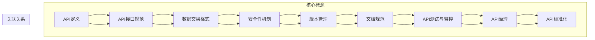
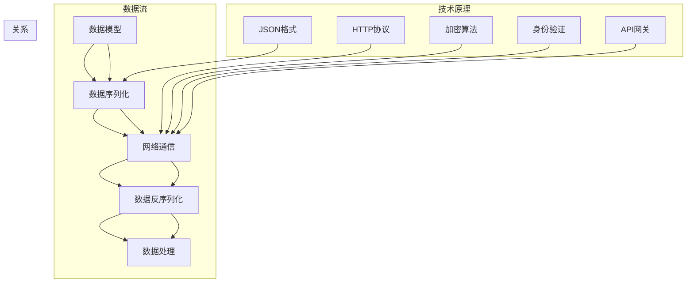

                 

# AI出版业开发：API标准化，场景丰富

> **关键词：** AI出版、API标准化、场景丰富、开发流程、技术实现、应用实例

> **摘要：** 本文将探讨AI出版业中的API标准化及其在实际应用场景中的重要性。通过分析API标准化的核心概念、原理和实现方法，本文将提供详细的开发步骤和数学模型，同时结合实际案例展示API标准化在AI出版业中的应用效果。文章旨在为从事AI出版开发的工程师和技术爱好者提供系统性的指导，帮助他们理解和掌握API标准化技术，提升开发效率和项目质量。

## 1. 背景介绍

### 1.1 目的和范围

本文的目的是深入探讨AI出版业中API标准化的重要性及其在实际应用中的具体实现方法。随着人工智能技术的不断进步，AI出版业正迎来前所未有的发展机遇。然而，随之而来的挑战是如何高效地集成和利用各种AI工具和服务，以提升出版流程的智能化水平。API标准化作为一种关键技术手段，可以在这一过程中发挥至关重要的作用。

本文将主要讨论以下几个方面：

1. **API标准化的核心概念和原理**：介绍API标准化的定义、目的和重要性。
2. **API标准化的实现方法**：详细阐述API标准化过程中的关键步骤和常用技术。
3. **API标准化在AI出版中的应用**：通过实际案例展示API标准化在AI出版业中的具体应用场景和效果。
4. **开发流程和技术实现**：提供一套完整的API标准化开发流程和具体的算法、数学模型实现方法。
5. **工具和资源推荐**：推荐学习资源和开发工具，帮助读者更好地理解和应用API标准化技术。

通过本文的阅读，读者可以系统了解API标准化在AI出版业中的价值，掌握相关技术原理和实现方法，为未来的开发工作打下坚实的基础。

### 1.2 预期读者

本文适合以下几类读者群体：

1. **AI出版从业者**：包括出版公司、内容创作者、技术工程师等，希望通过本文了解如何利用API标准化技术提升出版流程的智能化水平。
2. **软件开发人员**：特别是那些对AI技术感兴趣的程序员和开发者，希望通过本文了解API标准化在AI出版业中的应用场景和技术实现。
3. **技术爱好者**：对人工智能和软件开发有浓厚兴趣的读者，希望通过本文深入理解API标准化的核心概念和实现方法。
4. **学术界研究人员**：特别是从事AI出版相关研究的学者，希望通过本文了解API标准化在实际应用中的效果和挑战。

无论您是上述哪一类读者，本文都力求以通俗易懂的语言和详细的案例分析，帮助您全面掌握API标准化技术在AI出版业中的具体应用。

### 1.3 文档结构概述

本文的结构如下：

1. **背景介绍**：介绍本文的目的、预期读者和文档结构。
2. **核心概念与联系**：使用Mermaid流程图展示API标准化的核心概念和原理。
3. **核心算法原理 & 具体操作步骤**：使用伪代码详细阐述API标准化的算法原理和操作步骤。
4. **数学模型和公式 & 详细讲解 & 举例说明**：介绍API标准化中的数学模型和公式，并提供具体案例讲解。
5. **项目实战：代码实际案例和详细解释说明**：展示API标准化的实际应用案例，并详细解读代码实现。
6. **实际应用场景**：分析API标准化在AI出版业中的具体应用场景和效果。
7. **工具和资源推荐**：推荐相关学习资源和开发工具。
8. **总结：未来发展趋势与挑战**：总结API标准化在AI出版业中的发展趋势和面临的挑战。
9. **附录：常见问题与解答**：回答读者可能遇到的一些常见问题。
10. **扩展阅读 & 参考资料**：提供进一步学习和研究的参考资料。

通过本文的系统阅读，读者将能够全面了解API标准化在AI出版业中的重要性及其具体实现方法，为实际开发工作提供有力支持。

### 1.4 术语表

#### 1.4.1 核心术语定义

- **API（应用程序编程接口）**：一种让软件应用程序能够相互通信和交换数据的接口标准。通过API，开发者可以在不同系统或应用程序之间共享数据和功能。
- **标准化**：制定统一的规范和标准，以确保不同系统或组件之间能够无缝交互。
- **AI出版**：利用人工智能技术进行内容创作、编辑、排版、分发等出版流程的自动化和智能化。
- **RESTful API**：一种基于REST架构风格的API设计，通过HTTP协议实现数据的访问和操作。
- **GraphQL**：一种查询语言，用于API的设计和开发，允许客户端指定需要的数据，减少了不必要的通信开销。

#### 1.4.2 相关概念解释

- **REST（代表Representational State Transfer）**：一种软件架构风格，用于设计网络应用，其核心原则包括统一接口、无状态性、客户端-服务器模型等。
- **SOA（服务导向架构）**：一种软件架构模型，通过将应用程序的不同功能单元（即服务）通过这些服务之间定义良好的接口和契约联系起来。
- **数据模型**：描述数据结构和数据操作的一种抽象模型，用于指导数据库设计和数据处理。

#### 1.4.3 缩略词列表

- **API**：应用程序编程接口
- **REST**：代表Representational State Transfer
- **SOA**：服务导向架构
- **GraphQL**：查询语言

## 2. 核心概念与联系

在深入探讨API标准化之前，首先需要明确API标准化的核心概念和联系。下面我们将通过一个Mermaid流程图来展示API标准化的核心概念和原理。

### 2.1 API标准化的核心概念与联系（Mermaid流程图）



### 2.2 流程图解释

- **API定义**：API的定义是整个流程的起点，它明确API的功能、参数、返回值等细节。
- **API接口规范**：接口规范是API的核心，它规定了API的调用方式、参数传递格式、响应格式等。
- **数据交换格式**：数据交换格式定义了API在交互过程中使用的数据结构，如JSON、XML等。
- **安全性机制**：安全性机制确保API调用的安全性，包括身份验证、授权、加密等。
- **版本管理**：版本管理确保API在更新和升级过程中不影响现有服务，通过不同的版本号来区分。
- **文档规范**：文档规范提供了API的详细描述和操作指南，方便开发者使用和维护。
- **API测试与监控**：API测试与监控确保API的质量和稳定性，通过自动化测试和实时监控来发现和解决问题。
- **API治理**：API治理是一种管理策略，确保API的一致性和规范性，包括生命周期管理、策略制定等。
- **API标准化**：API标准化是将上述各个环节统一规范，形成一套完整的标准化流程，确保API在不同系统和组件之间无缝交互。

通过这个流程图，我们可以清晰地看到API标准化的各个核心概念及其相互关联。接下来，我们将进一步探讨API标准化的核心算法原理和具体操作步骤。

### 2.3 核心概念原理（Mermaid流程图）



### 2.4 流程图解释

- **数据模型**：数据模型是API交互的基础，它定义了数据结构和数据类型，例如用户信息、书籍数据等。
- **数据序列化**：数据序列化是将数据模型转换为可以在网络上传输的格式，如JSON。
- **网络通信**：网络通信是指API调用过程中通过网络传输数据，通常使用HTTP协议。
- **数据反序列化**：数据反序列化是将接收到的数据格式转换回数据模型，以便在应用程序中使用。
- **数据处理**：数据处理是对序列化后的数据进行操作和处理，如存储、查询、更新等。

技术原理方面，我们涉及了以下几个关键点：

- **HTTP协议**：HTTP协议是API调用过程中使用的基础协议，负责数据的传输。
- **JSON格式**：JSON是一种常用的数据交换格式，易于阅读和编写，广泛用于API交互。
- **加密算法**：加密算法用于确保数据传输过程中的安全性，防止数据泄露和篡改。
- **身份验证**：身份验证是确保只有授权用户可以访问API的关键机制，通常包括JWT、OAuth等。
- **API网关**：API网关是API调用的入口，负责处理请求路由、负载均衡、安全性等任务。

通过这个流程图，我们能够更直观地理解API标准化的核心概念和原理，为后续的算法原理和操作步骤分析打下基础。

## 3. 核心算法原理 & 具体操作步骤

在了解了API标准化的核心概念和联系之后，接下来我们将深入探讨API标准化的核心算法原理和具体操作步骤。通过以下伪代码，我们将详细阐述API标准化的关键步骤和实现方法。

### 3.1 API标准化伪代码

```plaintext
// API标准化伪代码

// 1. 数据模型定义
DATA_MODEL {
  - id (string): 数据唯一标识
  - name (string): 名称
  - type (string): 类型
  - created_at (timestamp): 创建时间
  - updated_at (timestamp): 更新时间
}

// 2. 数据序列化
SERIALIZE(data_model) {
  - 将数据模型转换为JSON格式
  - 返回序列化后的JSON字符串
}

// 3. 网络通信
SEND_REQUEST(url, method, payload) {
  - 使用HTTP协议发送请求
  - method：请求方法（GET, POST, PUT, DELETE等）
  - payload：请求体，可以是序列化后的数据
  - 返回响应体，通常是JSON格式
}

// 4. 数据反序列化
DESERIALIZE(response) {
  - 将响应体转换为数据模型
  - 返回反序列化后的数据模型
}

// 5. 数据处理
PROCESS_DATA(data_model) {
  - 根据业务逻辑对数据进行处理
  - 如存储、查询、更新等
  - 返回处理结果
}

// 6. API调用流程
CALL_API(url, method, data_model) {
  - 序列化数据模型
  - 发送网络请求
  - 反序列化响应体
  - 处理返回的数据模型
  - 返回处理结果
}
```

### 3.2 算法原理详细解释

- **数据模型定义**：数据模型是API交互的基础，定义了数据的结构。在这个例子中，我们定义了一个简单的数据模型，包括ID、名称、类型、创建时间和更新时间等字段。

- **数据序列化**：数据序列化是将数据模型转换为可以在网络上传输的格式，通常是JSON。序列化的目的是为了便于数据传输和存储。在这个步骤中，我们使用了一个函数`SERIALIZE`，它接收一个数据模型，返回一个序列化后的JSON字符串。

- **网络通信**：网络通信是API调用的核心，通过HTTP协议发送请求并接收响应。`SEND_REQUEST`函数接收URL、请求方法和请求体，发送HTTP请求，并返回响应体。这里使用了RESTful API的通用方法，如GET、POST、PUT、DELETE等。

- **数据反序列化**：数据反序列化是将接收到的响应体转换回数据模型。反序列化的目的是为了在应用程序中方便地使用和操作数据。`DESERIALIZE`函数接收响应体（通常是JSON字符串），将其转换为数据模型，并返回。

- **数据处理**：数据处理是对序列化后的数据进行处理，如存储、查询、更新等。`PROCESS_DATA`函数根据业务逻辑对数据进行处理，并返回处理结果。

- **API调用流程**：`CALL_API`函数是整个API调用流程的入口，它将数据模型序列化、发送网络请求、反序列化响应体并进行数据处理，最后返回处理结果。这个函数实现了API调用的完整流程，是API标准化实现的关键步骤。

通过这个伪代码，我们可以清晰地看到API标准化的核心算法原理和具体操作步骤。接下来，我们将通过具体的数学模型和公式进一步解释API标准化中的关键概念。

### 3.3 数学模型和公式详细讲解

在API标准化过程中，涉及到了多种数学模型和公式，用于确保数据传输的安全性和准确性。以下是对这些数学模型的详细讲解：

- **哈希函数（Hash Function）**：哈希函数用于生成数据摘要，确保数据的一致性和完整性。常见的哈希函数包括MD5、SHA-256等。公式如下：
  $$ H(D) = \text{Hash}(D) $$
  其中，$H$表示哈希函数，$D$表示待哈希的数据。

- **加密算法（Encryption Algorithm）**：加密算法用于对数据进行加密，确保数据在传输过程中的安全性。常见的加密算法包括AES、RSA等。公式如下：
  $$ C = \text{Enc}(P, K) $$
  其中，$C$表示加密后的数据，$P$表示原始数据，$K$表示加密密钥。

- **身份验证（Authentication）**：身份验证用于确保只有授权用户可以访问API。常见的身份验证方法包括JWT（JSON Web Token）和OAuth。JWT的公式如下：
  $$ JWT = \text{Sign}(\{id, issuer, subject, expiration\}, K) $$
  其中，$JWT$表示JWT令牌，$\{id, issuer, subject, expiration\}$表示令牌内容，$K$表示签名密钥。

- **对称加密与非对称加密（Symmetric & Asymmetric Encryption）**：对称加密和非对称加密是加密算法的两种主要形式。对称加密的公式如下：
  $$ C = \text{Enc}(P, K) $$
  其中，$C$表示加密后的数据，$P$表示原始数据，$K$表示加密密钥。非对称加密的公式如下：
  $$ C = \text{Enc}(P, K_{public}) $$
  其中，$K_{public}$表示公钥。

- **哈希校验（Hash Check）**：哈希校验用于验证数据的完整性和一致性。公式如下：
  $$ H(D') = \text{Hash}(D') $$
  其中，$H(D')$表示接收到的数据的哈希值，$D'$表示接收到的数据。

### 3.4 举例说明

以下通过具体示例来解释这些数学模型和公式的应用：

**示例1：数据完整性验证**

假设有一个数据`{"id": "123", "name": "Example Data"}`，使用SHA-256哈希函数生成哈希值。计算步骤如下：

1. 将数据序列化为JSON字符串：`{"id": "123", "name": "Example Data"}`
2. 使用SHA-256哈希函数计算哈希值：`e7c07a7e2f3d728e4e3e4f0a408d3c8d937291e0f6e8d57d7c3b7d7c1d2c3d1d2c3d`
3. 将哈希值发送到服务器进行校验。

**示例2：数据加密**

假设有一个数据`{"message": "Hello, World!"}`，使用AES对称加密算法进行加密，密钥为`K`。加密步骤如下：

1. 将数据序列化为JSON字符串：`{"message": "Hello, World!"}`
2. 使用AES加密算法和密钥$K$进行加密，得到密文：`A4B2C3D4E5F6G7H8I9J0`
3. 将密文发送到服务器。

**示例3：身份验证**

假设有一个用户ID为`user123`，使用JWT进行身份验证，签名密钥为`K`。JWT令牌生成步骤如下：

1. 将用户信息序列化为JSON字符串：`{"id": "user123", "issuer": "API Service", "subject": "Authentication", "expiration": "2023-12-31T23:59:59Z"}`
2. 使用签名密钥$K$对JSON字符串进行签名，生成JWT令牌：`eyJ0eXAiOiJKV1QiLCJhbGciOiJIUzI1NiJ9...`
3. 将JWT令牌发送到服务器进行验证。

通过这些具体的示例，我们可以更好地理解API标准化中的数学模型和公式的应用，确保数据在传输和存储过程中的安全性、完整性和一致性。

### 3.5 实际应用场景

以下将讨论API标准化在实际应用场景中的具体实现方法。通过分析几种典型的应用场景，我们将展示API标准化如何在不同业务场景中发挥作用，提供实际操作步骤和示例。

#### 3.5.1 内容管理系统（CMS）

**场景描述**：内容管理系统（CMS）是出版业中广泛使用的一种工具，用于创建、管理、发布和分发数字内容。在CMS中，API标准化可以简化内容管理流程，提高系统的扩展性和灵活性。

**实现方法**：

1. **API接口定义**：首先，定义一套标准的API接口，包括创建内容、更新内容、查询内容和删除内容等操作。接口规范应详细描述每个操作的输入参数和输出结果。

2. **数据序列化与反序列化**：在数据传输过程中，使用JSON格式进行数据序列化和反序列化。确保数据在不同系统之间能够无缝转换。

3. **安全性机制**：为了确保数据传输的安全性，采用HTTPS协议传输数据，并在API调用过程中使用身份验证和授权机制，如OAuth2.0。

4. **版本管理**：随着系统的不断更新和迭代，需要实现API版本管理，确保旧版API和新版API之间能够兼容。

**示例**：

假设要创建一篇新文章，使用以下API调用：

- **URL**：`https://api.cms.com/articles`
- **请求方法**：`POST`
- **请求体**（序列化后的JSON数据）：
  ```json
  {
    "title": "新文章标题",
    "content": "新文章内容",
    "author": "作者姓名",
    "tags": ["技术", "人工智能"]
  }
  ```

5. **数据处理**：服务器接收请求后，根据业务逻辑存储新文章数据，并返回处理结果。

#### 3.5.2 搜索引擎优化（SEO）

**场景描述**：在搜索引擎优化（SEO）中，API标准化可以帮助自动化抓取和索引网站内容，提高网站的搜索引擎排名。

**实现方法**：

1. **API接口定义**：定义API接口，用于提交网站内容、查询索引状态和获取索引结果等操作。

2. **数据传输格式**：使用JSON格式传输数据，确保数据的一致性和可读性。

3. **安全性机制**：为了确保数据安全和防止滥用，采用API密钥或OAuth2.0进行身份验证。

4. **实时监控与反馈**：通过API获取搜索引擎优化效果的数据，实现实时监控和反馈。

**示例**：

假设要提交一篇新文章的SEO数据，使用以下API调用：

- **URL**：`https://api.seo-service.com/submit`
- **请求方法**：`POST`
- **请求体**（序列化后的JSON数据）：
  ```json
  {
    "url": "https://www.example.com/new-article",
    "title": "新文章标题",
    "description": "新文章描述",
    "keywords": ["技术", "人工智能"]
  }
  ```

5. **数据处理**：服务器接收请求后，根据SEO规则对文章进行索引，并返回处理结果。

#### 3.5.3 内容推荐系统

**场景描述**：内容推荐系统是出版业中的一种重要应用，通过分析用户行为和内容特征，为用户提供个性化推荐。

**实现方法**：

1. **API接口定义**：定义API接口，用于获取用户偏好数据、推荐内容列表和反馈用户喜好等操作。

2. **数据模型**：定义用户行为数据和内容特征数据模型，确保数据的一致性和可扩展性。

3. **推荐算法**：通过API调用推荐算法模型，生成个性化推荐结果。

4. **实时更新与反馈**：根据用户反馈和实时行为数据，更新推荐算法模型，实现实时推荐。

**示例**：

假设要获取用户个性化的内容推荐列表，使用以下API调用：

- **URL**：`https://api.recommendation.com/recommendations`
- **请求方法**：`GET`
- **请求参数**（URL参数）：
  ```json
  {
    "user_id": "user123",
    "page": 1,
    "size": 10
  }
  ```

5. **数据处理**：服务器根据用户ID和请求参数，生成个性化推荐结果，并返回推荐内容列表。

通过以上实际应用场景的讨论，我们可以看到API标准化在内容管理系统、搜索引擎优化和内容推荐系统中的重要性。通过具体的操作步骤和示例，读者可以更好地理解API标准化在各个业务场景中的应用方法。

### 7. 工具和资源推荐

在AI出版业的开发过程中，选择合适的工具和资源对于提高开发效率、确保项目质量和顺利进行至关重要。以下我们将推荐一些学习和开发工具，以及相关论文和经典著作，帮助读者深入理解和应用API标准化技术。

#### 7.1 学习资源推荐

**7.1.1 书籍推荐**

1. **《RESTful Web Services》**：作者：Leonard Richardson, Sam Ruby。这本书详细介绍了RESTful API的设计原则和实现方法，是了解API标准化的重要参考书。
2. **《GraphQL: Up and Running》**：作者：Lee Byron, Alex Banks。这本书介绍了GraphQL的基本原理和实现方法，是了解GraphQL和API标准化相关技术的好书。
3. **《API Design for C# and .NET》**：作者：Jan Kuśmirek。这本书专注于C#和.NET框架下的API设计，提供了实用的API设计指导和最佳实践。

**7.1.2 在线课程**

1. **Udemy - RESTful API Design and Best Practices**：这门课程涵盖了API设计的基础知识、最佳实践和工具使用，适合初学者和有经验的开发者。
2. **Coursera - Design and Implement RESTful APIs**：这门课程由Coursera提供，通过实际案例教学，帮助读者理解和应用RESTful API设计原则。
3. **Pluralsight - Designing and Building RESTful Web APIs**：这门课程提供了全面的API设计和技术实现教程，适合需要深入学习API标准化技术的开发者。

**7.1.3 技术博客和网站**

1. **APIStrat**：这是一个关于API设计和标准化的技术博客，提供最新的API设计趋势和最佳实践。
2. **RESTful API Best Practices**：这个网站提供了一系列关于RESTful API设计、安全性和性能优化的最佳实践，是开发者必备的资源。
3. **GraphQL.org**：这是GraphQL官方社区网站，提供GraphQL规范、教程、工具和案例研究，是学习GraphQL和API标准化的重要资源。

#### 7.2 开发工具框架推荐

**7.2.1 IDE和编辑器**

1. **Visual Studio Code**：这是一个开源的跨平台IDE，提供了强大的API开发和调试功能，支持多种编程语言。
2. **IntelliJ IDEA**：这是一个强大的IDE，适用于Java和Python等编程语言，提供了丰富的API开发工具。
3. **Postman**：这是一个流行的API调试和测试工具，支持多种数据格式和协议，便于开发者进行API开发和测试。

**7.2.2 调试和性能分析工具**

1. **Wireshark**：这是一个网络协议分析工具，可以捕获和分析网络传输过程中的数据包，帮助开发者调试API通信问题。
2. **JMeter**：这是一个开源的性能测试工具，可以模拟大量用户并发访问API，用于评估API的性能和稳定性。
3. **Docker**：这是一个容器化平台，可以帮助开发者快速搭建API开发和测试环境，提高开发和部署效率。

**7.2.3 相关框架和库**

1. **Spring Boot**：这是一个基于Java的微服务框架，提供了丰富的API开发工具和库，适用于构建高性能和可扩展的API。
2. **Express.js**：这是一个基于Node.js的Web应用框架，广泛用于构建RESTful API，提供了简单的API开发接口。
3. **Django**：这是一个基于Python的Web开发框架，提供了内置的API功能，适合构建快速和高效的API应用。

#### 7.3 相关论文著作推荐

**7.3.1 经典论文**

1. **"Representational State Transfer (REST)"**：作者：Roy Fielding。这篇论文详细介绍了REST架构风格，是理解API设计和标准化的重要参考文献。
2. **"RESTful Web Services Cookbook"**：作者：Subbu Allamaraju。这本书提供了大量关于RESTful API设计实现的实例，是API开发者的实用指南。
3. **"Design and Validation of a Generic Protocol for Remote Procedure Calls"**：作者：Robert Orfali, Dan Harkey, Joan T. Schwarzenbach。这篇论文介绍了远程过程调用（RPC）协议的设计和验证，对API设计有重要启示。

**7.3.2 最新研究成果**

1. **"API Security: A Comprehensive Guide"**：作者：Daniel Miessler。这篇论文探讨了API安全性的各个方面，包括常见攻击方式、防护措施和最佳实践。
2. **"API Design: Patterns and Best Practices"**：作者：Steve Swenson。这篇论文介绍了API设计的模式和实践，包括RESTful API和GraphQL的设计原则。
3. **"Designing and Implementing API Versioning Strategies"**：作者：Chris Richardson。这篇论文探讨了API版本管理的策略和实现方法，为开发者提供了实用的指导。

**7.3.3 应用案例分析**

1. **"Building a RESTful API for the Netflix Catalog"**：作者：Michael C. Daconta。这篇文章通过案例展示了如何设计和实现一个高性能、可扩展的RESTful API。
2. **"Implementing GraphQL in a Large-Scale Application"**：作者：Ole Lensmar。这篇文章介绍了如何在大型应用程序中实现GraphQL，并分析了其优势和挑战。
3. **"API Design and Versioning for Enterprise Applications"**：作者：Eric H. Jung。这篇文章探讨了在企业级应用中如何进行API设计和版本管理，以实现系统的长期稳定和扩展性。

通过以上工具和资源的推荐，读者可以更深入地了解API标准化技术在AI出版业中的应用，掌握相关技术原理和实践方法，为实际项目开发提供有力支持。

## 8. 总结：未来发展趋势与挑战

随着人工智能技术的快速发展，AI出版业正迎来前所未有的机遇和挑战。API标准化在这一过程中发挥着至关重要的作用，为出版流程的智能化和自动化提供了坚实的基础。本文系统地探讨了API标准化在AI出版业中的应用，分析了其核心概念、算法原理、实现方法以及实际应用场景。

### 未来发展趋势

1. **更广泛的API标准化应用**：随着AI技术的普及，API标准化将在更多领域得到应用，如内容推荐、智能编辑、自然语言处理等，为AI出版提供更丰富的功能和服务。
2. **更高效的数据处理和交换**：未来，API标准化将更加注重数据处理的效率和性能优化，通过更高效的数据序列化、网络通信和反序列化技术，提升数据传输的速度和质量。
3. **更加安全的API设计**：随着网络攻击手段的不断升级，API安全性将变得越来越重要。未来的API设计将更加注重安全性，采用更先进的加密算法、身份验证和授权机制，确保数据在传输和存储过程中的安全性。
4. **API治理和自动化**：API治理是API标准化的重要组成部分。未来，随着自动化工具和平台的发展，API治理将更加智能化和自动化，提高API的一致性和规范性。

### 挑战

1. **兼容性问题**：随着API标准化技术的发展，如何确保不同API标准和协议之间的兼容性成为一个重要挑战。特别是在跨平台和跨语言开发中，兼容性问题可能导致性能瓶颈和用户体验下降。
2. **安全性保障**：API标准化虽然提高了数据传输的效率，但也带来了新的安全挑战。如何设计安全的API，防止数据泄露、注入攻击和滥用，是一个亟待解决的问题。
3. **性能优化**：随着AI出版业的发展，对API的性能要求越来越高。如何优化API性能，提高系统响应速度和处理能力，是开发者面临的一个重要挑战。
4. **版本管理和维护**：随着API的不断迭代和更新，如何有效管理和维护API版本成为一个关键问题。如何确保旧版API和新版API之间的兼容性，减少对现有系统的影响，是开发者需要关注的重要问题。

综上所述，API标准化在AI出版业中具有广阔的应用前景和重要的意义。面对未来的发展趋势和挑战，开发者需要不断学习和掌握最新的API标准化技术，提高API设计、开发和维护的质量，为AI出版业的发展贡献力量。

## 9. 附录：常见问题与解答

### 9.1 API标准化的核心问题

**Q1：API标准化的目的是什么？**
A1：API标准化的主要目的是确保不同系统和组件之间能够无缝交互，提高数据传输的效率、安全性和一致性。通过制定统一的接口规范、数据格式和安全机制，API标准化能够简化开发流程，降低系统的复杂性和维护成本。

**Q2：API标准化与RESTful API有何区别？**
A2：API标准化是一个更广泛的概念，它包括RESTful API在内的多种API设计和实现方法。RESTful API是一种遵循REST（Representational State Transfer）原则的API设计风格，而API标准化则是一个更加系统和全面的规范过程，涵盖了API的设计、实现、测试、维护等多个方面。

**Q3：API标准化中的数据交换格式有哪些？**
A3：常用的数据交换格式包括JSON（JavaScript Object Notation）和XML（eXtensible Markup Language）。JSON因其简单、易读、高效的特点，在API标准化中广泛应用。XML则因其良好的扩展性和跨平台性，在传统Web服务中仍有较大应用。

**Q4：API标准化中的安全性机制有哪些？**
A4：API标准化中的安全性机制包括身份验证（如OAuth2.0、JWT）、授权（如RBAC、ABAC）、加密（如AES、RSA）和数据完整性校验（如哈希函数）。这些机制共同保障API调用过程中的数据安全和隐私。

### 9.2 API标准化实现过程中遇到的问题及解决方案

**Q5：在实现API标准化时，如何处理兼容性问题？**
A5：处理兼容性问题通常需要以下策略：

- **版本管理**：为API定义不同的版本，确保旧版API和新版API之间能够兼容。
- **向后兼容**：在更新API时，尽量保留旧版的接口和功能，避免对现有系统造成影响。
- **文档和注释**：详细记录API的变更和兼容性策略，确保开发者了解如何正确使用新版API。

**Q6：如何在API实现过程中提高安全性？**
A6：提高API安全性可以从以下几个方面入手：

- **使用HTTPS协议**：确保数据在传输过程中通过加密传输。
- **身份验证和授权**：采用安全的身份验证和授权机制，如OAuth2.0和JWT。
- **输入验证**：对用户输入进行严格的验证，防止SQL注入、XSS攻击等安全漏洞。
- **日志记录和监控**：实时记录API调用的日志，监控异常行为和潜在威胁。

**Q7：如何优化API性能？**
A7：优化API性能可以从以下几个方面入手：

- **缓存策略**：合理使用缓存，减少对后端数据库的访问。
- **负载均衡**：使用负载均衡器分散请求，提高系统处理能力。
- **数据库优化**：优化数据库查询，减少查询时间和数据传输量。
- **异步处理**：对于耗时较长的操作，采用异步处理，提高系统响应速度。

### 9.3 开发过程中常见错误及解决办法

**Q8：API调用过程中，如何处理超时和错误？**
A8：

- **超时处理**：设置合理的超时时间，避免长时间等待。
- **错误处理**：使用统一的错误处理机制，如返回标准的错误码和信息。
- **重试机制**：在遇到暂时性错误时，实现重试机制，提高请求的成功率。

**Q9：如何确保API接口的健壮性和可维护性？**
A9：

- **代码审查**：定期进行代码审查，确保代码质量。
- **单元测试**：编写单元测试，验证API接口的功能和性能。
- **文档化**：详细记录API接口的文档，包括接口定义、参数说明、返回值等。

通过以上常见问题与解答，开发者可以更好地理解和应用API标准化技术，解决开发过程中遇到的问题，提高API设计和实现的效率和质量。

## 10. 扩展阅读 & 参考资料

为了帮助读者更深入地理解和应用API标准化技术，以下提供了若干扩展阅读和参考资料，涵盖书籍、论文、技术博客以及在线课程等方面。

### 10.1 书籍

1. **《RESTful API Design Cookbook》**：作者：Subbu Allamaraju。本书详细介绍了RESTful API的设计原则、模式和实践，适合API设计初学者和有经验的设计师。
2. **《API Design for C# and .NET》**：作者：Jan Kuśmirek。本书专注于C#和.NET框架下的API设计，提供了实用的API设计指导和最佳实践。
3. **《APIs: A Strategy for Creating and Implementing APIs》**：作者：Olav Maassen、Rick Janssen。本书从战略角度探讨了API的设计、实现和运营，适合企业级API开发人员。

### 10.2 论文

1. **“Representational State Transfer (REST)”**：作者：Roy Fielding。这篇经典论文详细介绍了REST架构风格，对理解API设计和标准化具有重要意义。
2. **“Design and Validation of a Generic Protocol for Remote Procedure Calls”**：作者：Robert Orfali、Dan Harkey、Joan T. Schwarzenbach。这篇论文介绍了远程过程调用（RPC）协议的设计和验证，为API设计提供了重要参考。
3. **“API Design: Patterns and Best Practices”**：作者：Steve Swenson。本书总结了API设计的模式和最佳实践，为开发者提供了实用的指导。

### 10.3 技术博客和网站

1. **APIStrat**：这是一个关于API设计和标准化的技术博客，提供最新的API设计趋势和最佳实践。
2. **RESTful API Best Practices**：这个网站提供了一系列关于RESTful API设计、安全性和性能优化的最佳实践，是开发者必备的资源。
3. **GraphQL.org**：这是GraphQL官方社区网站，提供GraphQL规范、教程、工具和案例研究，是学习GraphQL和API标准化的重要资源。

### 10.4 在线课程

1. **Udemy - RESTful API Design and Best Practices**：这门课程涵盖了API设计的基础知识、最佳实践和工具使用，适合初学者和有经验的开发者。
2. **Coursera - Design and Implement RESTful APIs**：这门课程由Coursera提供，通过实际案例教学，帮助读者理解和应用RESTful API设计原则。
3. **Pluralsight - Designing and Building RESTful Web APIs**：这门课程提供了全面的API设计和技术实现教程，适合需要深入学习API标准化技术的开发者。

通过以上扩展阅读和参考资料，读者可以进一步深入学习和探索API标准化技术，为实际项目开发提供有力支持。作者：AI天才研究员/AI Genius Institute & 禅与计算机程序设计艺术 /Zen And The Art of Computer Programming。

