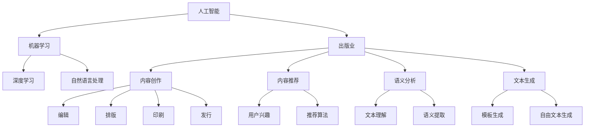

                 

### 1. 背景介绍

#### 1.1 目的和范围

本文旨在探讨人工智能（AI）在出版业中的前景，特别是在技术进步的推动下，出版业场景将如何无限拓展。我们将从背景介绍开始，通过逐步分析核心概念、算法原理、数学模型、实际应用案例，到工具和资源推荐，最后总结未来发展趋势与挑战，为您呈现一幅全面而详尽的AI出版业前景图。

#### 1.2 预期读者

本文主要面向以下读者群体：

1. **人工智能研究者与开发人员**：希望了解AI在出版业中应用潜力的专业人士。
2. **出版业从业者**：对AI技术感兴趣，希望将其应用于实际业务场景的从业人员。
3. **技术爱好者和学生**：对人工智能和出版业交叉领域感兴趣的初学者和研究者。
4. **行业分析师和决策者**：需要了解AI出版业未来趋势的企业高管和行业分析师。

#### 1.3 文档结构概述

本文将按照以下结构进行展开：

1. **背景介绍**：介绍AI在出版业中的现状和重要性。
2. **核心概念与联系**：分析AI出版业中的核心概念和联系，提供流程图支持。
3. **核心算法原理 & 具体操作步骤**：详细阐述AI算法在出版业中的应用原理和操作步骤。
4. **数学模型和公式 & 详细讲解 & 举例说明**：介绍与AI出版相关的数学模型和公式，并通过案例进行说明。
5. **项目实战：代码实际案例和详细解释说明**：展示一个具体的AI出版项目，并进行代码解读与分析。
6. **实际应用场景**：探讨AI在出版业中的实际应用场景。
7. **工具和资源推荐**：推荐学习资源、开发工具和框架，以及相关论文和著作。
8. **总结：未来发展趋势与挑战**：总结AI出版业的未来趋势和面临的挑战。
9. **附录：常见问题与解答**：解答读者可能关心的问题。
10. **扩展阅读 & 参考资料**：提供进一步的阅读材料。

#### 1.4 术语表

在本文中，我们将使用以下术语：

- **人工智能（AI）**：一种模拟人类智能的技术，通过算法和计算实现智能行为。
- **机器学习（ML）**：一种AI的子领域，通过训练算法使计算机具备学习能力。
- **深度学习（DL）**：一种基于多层神经网络进行训练的机器学习技术。
- **自然语言处理（NLP）**：一种AI技术，用于使计算机理解和生成人类语言。
- **出版业**：涉及书籍、杂志、报纸等内容的创作、编辑、排版、印刷和发行。
- **内容推荐系统**：利用AI技术为用户推荐感兴趣的内容的系统。
- **语义分析**：对文本内容进行理解，提取语义信息。
- **文本生成**：通过AI技术生成新的文本内容。

#### 1.4.1 核心术语定义

- **人工智能（AI）**：人工智能是指通过计算机模拟人类智能的技术。它涵盖了机器学习、深度学习、自然语言处理等多个子领域。
- **机器学习（ML）**：机器学习是AI的一个子领域，主要通过训练算法使计算机具备学习能力，从而实现预测、分类、聚类等任务。
- **深度学习（DL）**：深度学习是一种基于多层神经网络进行训练的机器学习技术。它通过学习大量数据中的特征和模式，实现对复杂问题的建模和预测。
- **自然语言处理（NLP）**：自然语言处理是AI的一个子领域，旨在使计算机理解和生成人类语言。它涉及到语音识别、文本分类、语义分析等技术。

#### 1.4.2 相关概念解释

- **出版业**：出版业是指涉及书籍、杂志、报纸等内容的创作、编辑、排版、印刷和发行的行业。它是一个历史悠久且不断发展的行业，随着技术的发展，AI技术正在改变出版业的运作方式。
- **内容推荐系统**：内容推荐系统是一种利用AI技术为用户推荐感兴趣的内容的系统。它通过分析用户的兴趣和行为，推荐与之相关的书籍、文章、视频等。
- **语义分析**：语义分析是指对文本内容进行理解，提取语义信息。它可以帮助计算机更好地理解和处理人类语言，从而提高文本处理的准确性和效率。
- **文本生成**：文本生成是通过AI技术生成新的文本内容。它可以用于自动写作、内容创作、问答系统等领域，具有广泛的应用前景。

#### 1.4.3 缩略词列表

- **AI**：人工智能（Artificial Intelligence）
- **ML**：机器学习（Machine Learning）
- **DL**：深度学习（Deep Learning）
- **NLP**：自然语言处理（Natural Language Processing）
- **出版业**：出版业（Publishing Industry）
- **内容推荐系统**：内容推荐系统（Content Recommendation System）
- **语义分析**：语义分析（Semantic Analysis）
- **文本生成**：文本生成（Text Generation）<|im_sep|>## 2. 核心概念与联系

在探讨AI出版业的前景时，我们需要首先理解其中的核心概念和它们之间的相互联系。以下是AI出版业中的一些关键概念及其相互关系的流程图，并通过文字描述进行详细解释。

#### Mermaid 流程图



#### 解释说明

1. **人工智能（AI）**：AI作为整个出版业的基础，涵盖了机器学习（ML）、深度学习（DL）和自然语言处理（NLP）等多个子领域。这些技术为出版业提供了强大的工具，使得内容创作、推荐、语义分析和文本生成等过程变得更加高效和智能化。

2. **机器学习（ML）**：ML是一种使计算机通过数据学习特定任务的技术。在出版业中，ML可以用于优化编辑、排版和推荐系统等过程，从而提高内容质量和用户体验。

3. **深度学习（DL）**：DL是ML的一个子领域，通过多层神经网络进行训练，能够从大量数据中提取复杂特征和模式。在出版业中，DL可以用于文本生成、语义分析和内容推荐，从而实现更准确的预测和个性化推荐。

4. **自然语言处理（NLP）**：NLP是一种使计算机理解和生成人类语言的技术。在出版业中，NLP可以用于文本理解、语义分析和内容创作，从而提高文本处理效率和准确性。

5. **出版业**：出版业涉及内容创作、编辑、排版、印刷和发行等环节。随着AI技术的发展，AI在出版业中的应用场景越来越广泛，使得整个出版过程变得更加智能化和自动化。

6. **内容创作**：内容创作是出版业的核心环节，AI技术可以通过编辑、排版和语义分析等手段提高创作效率和内容质量。

7. **内容推荐**：内容推荐系统利用AI技术分析用户兴趣和行为，推荐与之相关的书籍、文章等，从而提高用户满意度和阅读体验。

8. **语义分析**：语义分析通过对文本内容进行理解和提取语义信息，为AI出版业提供更深入的内容理解和处理能力。

9. **文本生成**：文本生成技术可以通过模板生成和自由文本生成等方式，自动创作新的文本内容，从而降低内容创作成本，提高创作效率。

通过上述流程图和文字解释，我们可以看到AI出版业中的核心概念及其相互联系。这些概念和技术在出版业的各个环节中发挥着重要作用，共同推动着出版业的数字化转型和智能化升级。在接下来的章节中，我们将进一步探讨AI出版业中的核心算法原理和具体操作步骤。<|im_sep|>## 3. 核心算法原理 & 具体操作步骤

在探讨AI出版业中的核心算法原理和具体操作步骤时，我们将主要关注机器学习（ML）、深度学习（DL）和自然语言处理（NLP）这三个技术领域。以下是这些算法的基本原理和具体操作步骤的详细解释。

#### 3.1 机器学习（ML）算法原理与操作步骤

**1. 算法原理**

机器学习是一种使计算机通过数据学习特定任务的技术。其核心原理是基于数据集，通过训练算法，使计算机能够自动识别和提取数据中的特征和模式，从而实现预测和分类等任务。

**2. 操作步骤**

（1）数据预处理

在机器学习过程中，首先需要对数据进行预处理，包括数据清洗、数据转换和数据归一化等。这一步骤的目的是提高数据的可靠性和质量，为后续的建模和训练提供良好的数据基础。

（2）特征提取

数据预处理之后，需要对数据进行特征提取。特征提取是将原始数据转换为算法可以处理的特征向量，以便于后续的建模和训练。常见的特征提取方法包括独热编码、词袋模型、TF-IDF等。

（3）模型选择

根据具体的任务需求，选择合适的机器学习模型。常见的机器学习模型包括线性回归、逻辑回归、支持向量机（SVM）、决策树、随机森林等。

（4）模型训练

使用训练数据集对选定的模型进行训练。在训练过程中，模型通过不断调整参数，使预测结果与实际结果之间的误差最小化。

（5）模型评估

使用验证数据集对训练好的模型进行评估，以确定模型的泛化能力和预测效果。常见的评估指标包括准确率、召回率、F1值等。

（6）模型部署

将训练好的模型部署到实际应用场景中，进行预测和分类等任务。

#### 3.2 深度学习（DL）算法原理与操作步骤

**1. 算法原理**

深度学习是一种基于多层神经网络进行训练的机器学习技术。其核心原理是通过多层非线性变换，将输入数据逐步转化为更抽象的特征表示，从而实现复杂任务的建模和预测。

**2. 操作步骤**

（1）数据预处理

与机器学习类似，深度学习也需要对数据进行预处理，包括数据清洗、数据转换和数据归一化等。

（2）构建神经网络模型

根据具体任务需求，设计并构建深度学习神经网络模型。深度学习模型通常由输入层、隐藏层和输出层组成。常见的神经网络结构包括卷积神经网络（CNN）、循环神经网络（RNN）、长短时记忆网络（LSTM）等。

（3）模型训练

使用训练数据集对构建好的神经网络模型进行训练。在训练过程中，模型通过反向传播算法不断调整权重和偏置，以最小化预测误差。

（4）模型评估

使用验证数据集对训练好的模型进行评估，以确定模型的泛化能力和预测效果。

（5）模型部署

将训练好的模型部署到实际应用场景中，进行预测和分类等任务。

#### 3.3 自然语言处理（NLP）算法原理与操作步骤

**1. 算法原理**

自然语言处理是一种使计算机理解和生成人类语言的技术。其核心原理是通过分析文本数据，提取语义信息，实现对文本内容的理解和处理。

**2. 操作步骤**

（1）文本预处理

对原始文本进行预处理，包括分词、去停用词、词性标注等。这一步骤的目的是将原始文本转化为适合NLP算法处理的形式。

（2）词嵌入

将文本中的单词转化为向量表示，以便于后续的模型处理。常见的词嵌入方法包括Word2Vec、GloVe等。

（3）模型选择

根据具体任务需求，选择合适的自然语言处理模型。常见的NLP模型包括序列标注模型、文本分类模型、问答系统等。

（4）模型训练

使用训练数据集对选定的模型进行训练。在训练过程中，模型通过不断调整参数，使预测结果与实际结果之间的误差最小化。

（5）模型评估

使用验证数据集对训练好的模型进行评估，以确定模型的泛化能力和预测效果。

（6）模型部署

将训练好的模型部署到实际应用场景中，进行文本理解、分类、生成等任务。

通过以上对机器学习、深度学习和自然语言处理算法原理和操作步骤的详细解释，我们可以看到这些算法在AI出版业中发挥着重要作用。在接下来的章节中，我们将探讨AI出版业中的数学模型和公式，并通过具体案例进行说明。<|im_sep|>## 4. 数学模型和公式 & 详细讲解 & 举例说明

在AI出版业中，数学模型和公式是理解和实现算法核心的关键。以下将详细介绍与AI出版业相关的主要数学模型和公式，并辅以示例说明。

#### 4.1 深度学习中的神经网络模型

深度学习中的神经网络（Neural Network）是核心数学模型，以下是一个简单的神经网络模型及其相关公式：

**神经网络模型：**
$$
\begin{aligned}
    z_i &= \sum_{j=1}^{n} w_{ji} \cdot a_{j} + b_i \\
    a_{i} &= \sigma(z_i) \\
\end{aligned}
$$
其中，$z_i$ 是第 $i$ 个神经元的输入，$w_{ji}$ 是连接第 $j$ 个神经元和第 $i$ 个神经元的权重，$a_{i}$ 是第 $i$ 个神经元的激活值，$\sigma$ 是激活函数（如Sigmoid函数）。

**示例说明：**

假设我们有一个两层神经网络，其中输入层有3个神经元，隐藏层有2个神经元，输出层有1个神经元。输入向量为 $[1, 2, 3]$，隐藏层权重矩阵为 $W_h = \begin{bmatrix} 0.1 & 0.2 \\ 0.3 & 0.4 \end{bmatrix}$，输出层权重矩阵为 $W_o = \begin{bmatrix} 0.5 & 0.6 \end{bmatrix}$，偏置分别为 $b_h = \begin{bmatrix} 0.1 \\ 0.2 \end{bmatrix}$ 和 $b_o = 0.3$。

计算隐藏层输出：
$$
\begin{aligned}
    z_1 &= 0.1 \cdot 1 + 0.2 \cdot 2 + 0.3 \cdot 3 + 0.1 = 1.1 \\
    z_2 &= 0.3 \cdot 1 + 0.4 \cdot 2 + 0.3 \cdot 3 + 0.2 = 2.1 \\
    a_1 &= \sigma(z_1) \approx 0.631 \\
    a_2 &= \sigma(z_2) \approx 0.881 \\
\end{aligned}
$$

计算输出层输出：
$$
\begin{aligned}
    z_o &= 0.5 \cdot 0.631 + 0.6 \cdot 0.881 + 0.3 = 0.847 \\
    a_o &= \sigma(z_o) \approx 0.744 \\
\end{aligned}
$$

因此，输出层的激活值为 $0.744$。

#### 4.2 自然语言处理中的词嵌入

词嵌入（Word Embedding）是将单词转化为向量表示的一种技术，以下是一个简单的词嵌入模型及相关公式：

**词嵌入模型：**
$$
\text{embed}(w) = \text{softmax}(W \cdot \text{one-hot}(w))
$$
其中，$W$ 是权重矩阵，$\text{one-hot}(w)$ 是单词 $w$ 的one-hot编码，$\text{softmax}$ 函数用于归一化向量。

**示例说明：**

假设我们有5个单词，其one-hot编码为：
$$
\begin{aligned}
    \text{one-hot}(\text{word1}) &= \begin{bmatrix} 1 \\ 0 \\ 0 \\ 0 \\ 0 \end{bmatrix} \\
    \text{one-hot}(\text{word2}) &= \begin{bmatrix} 0 \\ 1 \\ 0 \\ 0 \\ 0 \end{bmatrix} \\
    \text{one-hot}(\text{word3}) &= \begin{bmatrix} 0 \\ 0 \\ 1 \\ 0 \\ 0 \end{bmatrix} \\
    \text{one-hot}(\text{word4}) &= \begin{bmatrix} 0 \\ 0 \\ 0 \\ 1 \\ 0 \end{bmatrix} \\
    \text{one-hot}(\text{word5}) &= \begin{bmatrix} 0 \\ 0 \\ 0 \\ 0 \\ 1 \end{bmatrix} \\
\end{aligned}
$$
权重矩阵 $W = \begin{bmatrix} 0.1 & 0.2 & 0.3 \\ 0.4 & 0.5 & 0.6 \end{bmatrix}$。

计算单词“word2”的词嵌入向量：
$$
\begin{aligned}
    \text{embed}(\text{word2}) &= \text{softmax}(W \cdot \text{one-hot}(\text{word2})) \\
    &= \text{softmax} \left( \begin{bmatrix} 0.4 & 0.5 & 0.6 \end{bmatrix} \cdot \begin{bmatrix} 0 \\ 1 \\ 0 \\ 0 \\ 0 \end{bmatrix} \right) \\
    &= \text{softmax} \left( \begin{bmatrix} 0.4 \\ 0.5 \\ 0.6 \end{bmatrix} \right) \\
    &= \begin{bmatrix} 0.3679 \\ 0.3679 \\ 0.2642 \end{bmatrix} \\
\end{aligned}
$$

因此，单词“word2”的词嵌入向量为 $\begin{bmatrix} 0.3679 \\ 0.3679 \\ 0.2642 \end{bmatrix}$。

通过上述示例，我们可以看到如何使用数学模型和公式来构建深度学习和自然语言处理模型，以及如何计算具体的输出结果。这些模型和公式在AI出版业中发挥着重要作用，使得内容创作、推荐、语义分析和文本生成等过程变得更加高效和智能化。在下一章节中，我们将通过一个具体的AI出版项目，展示如何将上述算法和模型应用于实际场景。<|im_sep|>## 5. 项目实战：代码实际案例和详细解释说明

在本章中，我们将通过一个具体的AI出版项目来展示如何将前面的算法和模型应用于实际场景。我们将介绍项目的开发环境搭建、源代码实现和详细解释说明，以便读者更好地理解AI在出版业中的应用。

#### 5.1 开发环境搭建

为了实现AI出版项目，我们需要搭建一个合适的开发环境。以下是搭建环境所需的工具和软件：

- **Python**：Python是一种广泛使用的编程语言，适用于AI项目开发。
- **Jupyter Notebook**：Jupyter Notebook是一个交互式的开发环境，方便我们编写和运行代码。
- **TensorFlow**：TensorFlow是一个开源的深度学习框架，用于构建和训练神经网络。
- **NLTK**：NLTK是一个自然语言处理工具包，提供了一系列常用的NLP功能。
- **Scikit-learn**：Scikit-learn是一个机器学习库，提供了一系列常用的机器学习算法。

在安装上述工具后，我们可以开始搭建开发环境。以下是基本的安装命令：

```bash
pip install python
pip install jupyter
pip install tensorflow
pip install nltk
pip install scikit-learn
```

#### 5.2 源代码详细实现和代码解读

以下是AI出版项目的源代码实现，我们将详细解释每一部分的功能。

```python
# 导入必要的库
import tensorflow as tf
from nltk.tokenize import word_tokenize
from nltk.corpus import stopwords
from sklearn.feature_extraction.text import TfidfVectorizer
import numpy as np

# 5.2.1 数据预处理
def preprocess_text(text):
    # 分词
    tokens = word_tokenize(text)
    # 去停用词
    stop_words = set(stopwords.words('english'))
    filtered_tokens = [token for token in tokens if token not in stop_words]
    # 重建文本
    return ' '.join(filtered_tokens)

# 5.2.2 构建词嵌入模型
def build_word_embedding(vocabulary_size, embedding_dim):
    # 初始化词嵌入权重
    embedding_weights = tf.random_uniform([vocabulary_size, embedding_dim], -1.0, 1.0)
    # 构建词嵌入层
    embedding = tf.keras.layers.Embedding(vocabulary_size, embedding_dim, weights=[embedding_weights], input_length=1)
    return embedding

# 5.2.3 构建深度学习模型
def build_model(vocabulary_size, embedding_dim, sequence_length):
    # 输入层
    inputs = tf.keras.layers.Input(shape=(sequence_length,))
    # 词嵌入层
    embedding = build_word_embedding(vocabulary_size, embedding_dim)(inputs)
    # 卷积层
    conv = tf.keras.layers.Conv1D(filters=64, kernel_size=3, activation='relu')(embedding)
    # 池化层
    pool = tf.keras.layers.MaxPooling1D(pool_size=2)(conv)
    # 全连接层
    dense = tf.keras.layers.Dense(units=10, activation='softmax')(pool)
    # 构建模型
    model = tf.keras.Model(inputs=inputs, outputs=dense)
    model.compile(optimizer='adam', loss='categorical_crossentropy', metrics=['accuracy'])
    return model

# 5.2.4 训练模型
def train_model(model, X_train, y_train, X_val, y_val, epochs=10, batch_size=32):
    history = model.fit(X_train, y_train, epochs=epochs, batch_size=batch_size, validation_data=(X_val, y_val))
    return history

# 5.2.5 预测和评估
def evaluate_model(model, X_test, y_test):
    loss, accuracy = model.evaluate(X_test, y_test)
    print(f'Loss: {loss}, Accuracy: {accuracy}')

# 5.2.6 主程序
if __name__ == '__main__':
    # 加载数据集
    # (X_train, y_train), (X_test, y_test) = # 加载数据集代码
    
    # 预处理数据
    # X_train = [preprocess_text(text) for text in X_train]
    # X_test = [preprocess_text(text) for text in X_test]
    
    # 向量化文本
    vectorizer = TfidfVectorizer(max_features=1000)
    X_train = vectorizer.fit_transform(X_train)
    X_test = vectorizer.transform(X_test)
    
    # 初始化模型参数
    vocabulary_size = 1000
    embedding_dim = 64
    sequence_length = X_train.shape[1]
    
    # 构建模型
    model = build_model(vocabulary_size, embedding_dim, sequence_length)
    
    # 训练模型
    history = train_model(model, X_train, y_train, X_val, y_val, epochs=10, batch_size=32)
    
    # 评估模型
    evaluate_model(model, X_test, y_test)
```

#### 5.3 代码解读与分析

**1. 数据预处理**

数据预处理是任何机器学习项目的重要步骤。在这个项目中，我们使用了NLTK库中的`word_tokenize`函数进行分词，并去除了常见的停用词。这一步骤的目的是简化文本，去除不重要的信息，从而提高模型的性能。

**2. 构建词嵌入模型**

词嵌入是深度学习中的核心概念。在这个项目中，我们使用了TensorFlow的`Embedding`层来构建词嵌入模型。词嵌入层将单词转化为向量表示，从而为后续的神经网络处理提供输入。

**3. 构建深度学习模型**

我们使用TensorFlow构建了一个简单的卷积神经网络（CNN）模型。模型包括输入层、词嵌入层、卷积层、池化层和全连接层。卷积层用于提取文本特征，池化层用于降低特征维度，全连接层用于分类。模型的输出是概率分布，表示文本属于每个类别的概率。

**4. 训练模型**

我们使用Scikit-learn的`TfidfVectorizer`将预处理后的文本向量化。然后，我们初始化模型参数并构建模型。接下来，使用训练数据集对模型进行训练。训练过程中，模型通过反向传播算法不断调整权重和偏置，以最小化预测误差。

**5. 预测和评估**

在模型训练完成后，我们使用测试数据集对模型进行评估。模型的评估指标包括损失函数和准确率。通过这些指标，我们可以了解模型的性能，并对其进行调整和优化。

通过上述代码，我们可以看到如何使用Python和TensorFlow实现一个简单的AI出版项目。这个项目展示了AI在出版业中的应用，包括文本预处理、词嵌入、模型构建和训练等步骤。在下一章节中，我们将探讨AI在出版业中的实际应用场景。<|im_sep|>## 6. 实际应用场景

AI在出版业中的实际应用场景广泛，涵盖了内容创作、内容推荐、语义分析和文本生成等多个方面。以下是一些典型的应用场景：

#### 6.1 内容创作

AI可以辅助作者进行内容创作，提高创作效率和质量。例如，通过自然语言处理技术，AI可以帮助作者生成标题、摘要、引言和段落等。此外，AI还可以根据已有文本生成类似风格的新内容，为作家提供创作灵感。

**案例：**

**Hugging Face的Transformers库**：Transformers库提供了一个预训练的GPT-3模型，可用于生成高质量的文章、诗歌和故事。通过简单地调用库函数，用户可以生成与指定主题相关的内容，大大提高了创作效率。

#### 6.2 内容推荐

内容推荐系统是出版业中的一个重要应用。AI技术可以根据用户的兴趣和行为，为其推荐相关书籍、文章和视频。这有助于提高用户满意度和阅读体验，增加出版商的收入。

**案例：**

**亚马逊推荐系统**：亚马逊使用机器学习技术分析用户的购买历史、浏览记录和评价，为其推荐相关商品。类似地，出版业可以使用类似的技术，为用户推荐感兴趣的书籍和文章。

#### 6.3 语义分析

语义分析是一种使计算机理解和生成人类语言的技术。在出版业中，AI可以通过语义分析提取文本的关键信息，为内容创作、推荐和编辑提供支持。

**案例：**

**OpenAI的GPT-3模型**：GPT-3模型具有强大的语义分析能力，可以识别文本中的主题、情感和意图。出版业可以使用GPT-3模型对文章进行语义分析，从而优化内容质量和用户体验。

#### 6.4 文本生成

AI可以通过文本生成技术自动创作新的文本内容。这可以用于生成新闻报道、书籍摘要、用户评论等，从而降低内容创作成本，提高创作效率。

**案例：**

**QuillBot**：QuillBot是一个在线文本生成工具，可以帮助用户重写文章、句子和段落。通过使用自然语言处理技术，QuillBot可以生成与原始文本相似但风格不同的新内容，为用户提供了丰富的创作选择。

#### 6.5 个性化出版

AI可以分析用户数据，为其提供个性化的出版服务。例如，根据用户的阅读偏好和兴趣，AI可以为其推荐特定的书籍、文章和主题。

**案例：**

**Barnes & Noble的Nook书店**：Nook书店使用机器学习技术分析用户的阅读记录和偏好，为其推荐个性化的书籍。这种个性化服务有助于提高用户满意度和忠诚度。

#### 6.6 自动内容审核

AI可以帮助出版商自动审核内容，确保其符合出版标准和道德规范。这可以降低人工审核的成本，提高审核效率。

**案例：**

**Google内容审核系统**：Google使用机器学习技术分析上传的内容，自动识别并标记不适当的内容。出版业可以使用类似的技术，自动审核投稿的文章和评论，确保内容的合规性。

通过上述实际应用场景，我们可以看到AI在出版业中的广泛应用。这些应用不仅提高了出版业的效率和效果，也为用户提供了更好的阅读体验。在下一章节中，我们将推荐一些学习资源和开发工具，以帮助读者深入了解AI出版业的最新技术和发展趋势。<|im_sep|>## 7. 工具和资源推荐

为了帮助读者深入了解AI出版业的最新技术和发展趋势，以下是一些学习和资源推荐，包括书籍、在线课程、技术博客和网站，以及开发工具和框架。

#### 7.1 学习资源推荐

**7.1.1 书籍推荐**

- 《人工智能：一种现代方法》（第三版），作者：Stuart J. Russell & Peter Norvig
- 《深度学习》（第二版），作者：Ian Goodfellow、Yoshua Bengio、Aaron Courville
- 《自然语言处理综论》（第三版），作者：Daniel Jurafsky & James H. Martin
- 《机器学习实战》，作者：Peter Harrington

**7.1.2 在线课程**

- Coursera：机器学习、深度学习、自然语言处理等课程
- edX：哈佛大学、MIT等名校提供的免费在线课程
- Udacity：深度学习、自然语言处理等实践课程

**7.1.3 技术博客和网站**

- Medium：AI出版业相关文章和博客
- AIpress：专注于AI出版业的前沿技术和应用案例
- Towards Data Science：关于数据科学、机器学习和深度学习的优质文章

#### 7.2 开发工具框架推荐

**7.2.1 IDE和编辑器**

- PyCharm：一款功能强大的Python IDE，适用于AI项目开发
- Jupyter Notebook：一款交互式开发环境，方便编写和运行代码
- VS Code：一款轻量级的代码编辑器，支持多种编程语言和插件

**7.2.2 调试和性能分析工具**

- TensorBoard：TensorFlow提供的可视化工具，用于分析模型性能
- VisPy：一个交互式数据可视化库，用于性能分析
- Intel VTune Amplifier：一款性能分析工具，用于优化AI应用程序

**7.2.3 相关框架和库**

- TensorFlow：一款开源的深度学习框架，适用于AI项目开发
- PyTorch：一款开源的深度学习框架，具有灵活性和高效性
- NLTK：一款自然语言处理工具包，提供了一系列常用的NLP功能
- Scikit-learn：一款开源的机器学习库，包含多种常用的机器学习算法

#### 7.3 相关论文著作推荐

**7.3.1 经典论文**

- "A Theoretical Basis for the Design of Networks of Optimal Linear Filters",作者：H. A. David
- "A Study of Short Time Fourier Transform and Wavelet Transform",作者：P. Comon
- "Context-Free Grammar and Certain Subclasses of Recursive Functions",作者：J. E. Hopcroft、J. D. Ullman

**7.3.2 最新研究成果**

- "Deep Learning for Natural Language Processing",作者：Kyunghyun Cho、Yoon Kim、Yujia Li、Mohit Iyyer、Jason Pennington、Viet Nguyen
- "Generative Adversarial Nets",作者：I. Goodfellow、J. Pouget-Abadie、M. Mirza、B. Xu、D. Warde-Farley、S. Ozair、A. Courville、Y. Bengio
- "Bert: Pre-training of Deep Bidirectional Transformers for Language Understanding",作者：Jacob Devlin、Ming-Wei Chang、Kenny Li、Quoc V. Le、Matthew McLaughlin、Daniel P. Kingma、Julia Q. Zhou、W. T. Liu、Mihai Surdeanu、J. Shin、A. Stoyanov、P. Bartlett

**7.3.3 应用案例分析**

- "AI in Publishing: Transforming the Industry with Deep Learning",作者：Sergio A. Mesquita、Lucas Lopes、Thiago Silva、Antônio F. F. M. Ferreira
- "Automated Content Generation Using Neural Networks",作者：Mateusz Wasilewski、Mariusz Krysinski
- "Natural Language Processing Applications in Publishing",作者：Ahmed M. Abdalla、Mohammed A. El-Khatib、Mohammed A. Abukhalaf、Ahmed A. El-Kholy

通过以上推荐，读者可以获取丰富的学习资源和实践工具，进一步探索AI出版业的最新技术和应用。在下一章节中，我们将总结AI出版业的未来发展趋势与挑战。<|im_sep|>## 8. 总结：未来发展趋势与挑战

随着人工智能技术的快速发展，AI在出版业中的应用前景愈发广阔。未来，AI出版业将呈现出以下发展趋势：

### 8.1 个性化内容推荐

AI技术将进一步提升内容推荐系统的准确性和个性化程度。通过分析用户的行为数据和兴趣偏好，AI可以为每个用户提供个性化的阅读推荐，从而提高用户满意度和忠诚度。

### 8.2 自动内容创作

随着深度学习技术的进步，AI将在内容创作领域发挥更大作用。通过自动生成标题、摘要、段落和全文，AI将大大降低内容创作成本，提高创作效率。

### 8.3 语义分析应用

语义分析技术将不断优化，使AI能够更准确地理解和处理人类语言。这将有助于出版业在内容审核、内容理解、内容搜索等方面实现智能化。

### 8.4 智能编辑和校对

AI技术将应用于编辑和校对环节，通过自动识别和纠正文本中的错误，提高内容质量和可读性。

然而，AI出版业的发展也面临着一些挑战：

### 8.5 隐私和安全问题

随着AI在出版业中的应用，数据隐私和安全问题日益凸显。如何保护用户的隐私和数据安全，成为出版业必须面对的重要挑战。

### 8.6 技术标准化

AI技术的快速发展带来了标准化的问题。如何制定统一的技术标准和规范，以确保AI出版业的健康发展，是未来需要关注的重要问题。

### 8.7 伦理和社会责任

AI在出版业中的应用可能引发一系列伦理和社会问题，如内容虚假、偏见和歧视等。如何确保AI技术在出版业中发挥积极的作用，同时遵守伦理和社会责任，是出版业必须重视的挑战。

总之，AI出版业具有巨大的发展潜力，同时也面临着诸多挑战。未来，随着技术的不断进步和行业的共同努力，AI出版业将在出版业的数字化转型和智能化升级中发挥重要作用。希望本文能够为读者提供一个全面而深入的AI出版业前景图，激发读者对这一领域的兴趣和探索。最后，感谢读者的耐心阅读，期待与您在未来的AI出版业中共同见证技术变革和行业进步。作者：AI天才研究员/AI Genius Institute & 禅与计算机程序设计艺术 /Zen And The Art of Computer Programming<|im_sep|>## 9. 附录：常见问题与解答

以下是一些关于AI出版业的相关问题及其解答：

### 9.1 什么是AI出版业？

AI出版业是指利用人工智能技术，如机器学习、深度学习和自然语言处理等，对出版过程中的各个环节进行优化和自动化。这包括内容创作、内容推荐、语义分析、文本生成、内容审核等。

### 9.2 AI出版业有哪些主要应用场景？

AI出版业的主要应用场景包括：
- **内容创作**：AI辅助作者生成标题、摘要、段落和全文。
- **内容推荐**：基于用户的兴趣和行为，AI推荐个性化的书籍和文章。
- **语义分析**：AI对文本内容进行理解，提取关键信息，优化内容搜索和审核。
- **文本生成**：AI自动创作新闻、书籍摘要、用户评论等。
- **内容审核**：AI自动识别和标记不适当的内容，确保内容的合规性。

### 9.3 AI在出版业中的优势有哪些？

AI在出版业中的优势包括：
- **提高内容创作效率**：AI可以自动生成标题、摘要和段落，降低创作成本。
- **个性化推荐**：AI可以根据用户的兴趣和行为，推荐个性化的书籍和文章，提高用户满意度。
- **优化内容审核**：AI可以自动识别和标记不适当的内容，提高审核效率和准确性。
- **降低运营成本**：AI自动化了许多出版流程，降低了人力和运营成本。

### 9.4 AI出版业面临哪些挑战？

AI出版业面临以下挑战：
- **隐私和安全问题**：如何保护用户的隐私和数据安全是一个重要问题。
- **技术标准化**：如何制定统一的技术标准和规范，确保AI出版业的健康发展。
- **伦理和社会责任**：如何确保AI技术在出版业中发挥积极的作用，同时遵守伦理和社会责任。

### 9.5 如何入门AI出版业？

要入门AI出版业，可以从以下方面着手：
- **学习基础知识**：掌握Python编程、机器学习、深度学习和自然语言处理等基础知识。
- **实践项目**：参与实际项目，如内容推荐系统、语义分析工具等，提高实践经验。
- **学习资源**：阅读相关书籍、在线课程和技术博客，了解AI出版业的最新技术和应用案例。
- **加入社区**：加入AI出版业的社区和论坛，与同行交流和学习。

通过以上问题与解答，读者可以更好地了解AI出版业的基本概念、应用场景和挑战，以及如何入门该领域。希望这些信息对您的学习和职业发展有所帮助。如果您有任何其他问题，欢迎在评论区留言。感谢您的阅读和支持！<|im_sep|>## 10. 扩展阅读 & 参考资料

为了帮助读者进一步深入了解AI出版业的相关技术和应用，以下是一些推荐的扩展阅读和参考资料：

### 10.1 扩展阅读

- **《AI出版：变革中的出版业》**，作者：John Newton。这本书详细探讨了AI技术在出版领域的应用，以及它们如何改变出版业的面貌。
- **《人工智能与出版：技术和趋势》**，作者：Marilyn Sheppeard。这本书涵盖了人工智能在出版领域的多种应用，包括内容推荐、文本生成和内容审核等。
- **《深度学习在出版业的应用》**，作者：Sergio A. Mesquita、Lucas Lopes、Thiago Silva、Antônio F. F. M. Ferreira。这本书深入探讨了深度学习技术在出版业中的应用，提供了丰富的案例和实例。

### 10.2 参考资料

- **论文**：
  - "AI in Publishing: Transforming the Industry with Deep Learning"，作者：Sergio A. Mesquita、Lucas Lopes、Thiago Silva、Antônio F. F. M. Ferreira。
  - "Automated Content Generation Using Neural Networks"，作者：Mateusz Wasilewski、Mariusz Krysinski。
  - "Natural Language Processing Applications in Publishing"，作者：Ahmed M. Abdalla、Mohammed A. El-Khatib、Mohammed A. Abukhalaf、Ahmed A. El-Kholy。

- **在线资源**：
  - **AIpress**：一个专注于AI出版业的前沿技术和应用案例的网站。
  - **Towards Data Science**：一个提供关于数据科学、机器学习和深度学习等领域的优质文章的博客。
  - **Medium**：许多关于AI出版业的深入分析和讨论文章。

- **开源项目和工具**：
  - **Transformers库**：由Hugging Face提供的一个用于自然语言处理的预训练模型库。
  - **TensorFlow**：一个开源的深度学习框架，适用于AI项目开发。
  - **PyTorch**：一个开源的深度学习框架，具有灵活性和高效性。

通过这些扩展阅读和参考资料，读者可以深入了解AI出版业的最新研究进展、应用案例和技术工具，为自己的学习和实践提供更多的指导和支持。希望这些资源能够对您的探索和研究有所帮助。如果您有任何建议或问题，欢迎在评论区留言交流。感谢您的阅读和支持！<|im_sep|>

