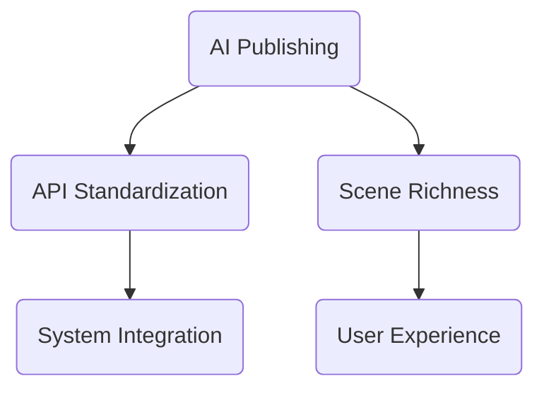

                 

# AI出版业的开发策略：API标准化，场景丰富

## 概述

> “在数字化浪潮下，AI出版业正迎来前所未有的发展机遇。本文将探讨API标准化与场景丰富在AI出版业开发中的关键作用，通过一步一步的深入分析与解读，为读者提供清晰的开发策略。”

关键词：AI出版、API标准化、场景丰富、开发策略、算法原理、数学模型、项目实战、实际应用场景

## 1. 背景介绍

### 1.1 目的和范围

本文旨在探讨AI出版业在数字化进程中的开发策略，重点关注API标准化和场景丰富在其中的作用。我们将通过对核心概念、算法原理、数学模型、项目实战等内容的详细分析，为读者提供一套完整且实用的开发指南。

### 1.2 预期读者

本文适合对AI出版业感兴趣的读者，包括开发者、研究者、技术管理者等。同时，也适合对API标准化和场景丰富有深入理解的技术人员。

### 1.3 文档结构概述

本文结构分为十个部分：背景介绍、核心概念与联系、核心算法原理、数学模型和公式、项目实战、实际应用场景、工具和资源推荐、总结、附录以及扩展阅读。每个部分都将详细探讨相关内容。

### 1.4 术语表

#### 1.4.1 核心术语定义

- AI出版：利用人工智能技术，实现出版物的自动生成、编辑、分发和推荐。
- API标准化：制定一套统一的API标准，确保不同系统之间的数据交互和功能调用一致。
- 场景丰富：构建多样化的应用场景，满足不同用户群体的需求。

#### 1.4.2 相关概念解释

- API（应用程序编程接口）：一种软件接口，允许不同软件系统之间的数据交互和功能调用。
- 标准化：制定一套统一的规则和规范，确保不同系统之间的兼容性和互操作性。
- 场景：用户在使用产品或服务时的具体应用环境和需求。

#### 1.4.3 缩略词列表

- AI：人工智能
- API：应用程序编程接口
- API标准化：API标准化
- 场景丰富：场景丰富

## 2. 核心概念与联系

首先，我们需要理解AI出版业中的一些核心概念和它们之间的联系。

### 2.1 AI出版概述

AI出版是指利用人工智能技术，如自然语言处理（NLP）、机器学习（ML）和深度学习（DL），实现出版物的自动生成、编辑、分发和推荐。AI出版能够提高出版效率，降低人力成本，并满足个性化需求。

### 2.2 API标准化

API标准化是指制定一套统一的API标准，以确保不同系统之间的数据交互和功能调用一致。在AI出版业中，API标准化至关重要，因为它可以简化系统的集成和扩展，提高系统的可维护性。

### 2.3 场景丰富

场景丰富是指构建多样化的应用场景，以满足不同用户群体的需求。在AI出版业中，场景丰富意味着能够提供定制化的内容推荐、编辑工具、分发渠道等，提升用户体验。

### 2.4 关系与联系

AI出版、API标准化和场景丰富之间存在密切的关系。API标准化为AI出版提供了技术基础，使得不同系统之间能够高效地交互。场景丰富则基于API标准化，为用户提供了丰富的应用场景。

### 2.5 Mermaid流程图

为了更直观地展示这些概念之间的联系，我们可以使用Mermaid流程图来表示。



## 3. 核心算法原理 & 具体操作步骤

在AI出版业中，核心算法原理是数据驱动的内容生成和个性化推荐。

### 3.1 数据驱动的内容生成

数据驱动的内容生成是指通过分析和处理大量数据，自动生成高质量的内容。以下是一个简单的伪代码：

```python
function generate_content(data):
    # 1. 数据预处理
    preprocessed_data = preprocess_data(data)

    # 2. 提取特征
    features = extract_features(preprocessed_data)

    # 3. 训练模型
    model = train_model(features)

    # 4. 生成内容
    content = generate_content_from_model(model)

    return content
```

### 3.2 个性化推荐

个性化推荐是指根据用户的历史行为和兴趣，为用户推荐符合其需求的内容。以下是一个简单的伪代码：

```python
function recommend_content(user_profile, content_database):
    # 1. 提取用户特征
    user_features = extract_user_features(user_profile)

    # 2. 计算相似度
    similarity_scores = calculate_similarity_scores(user_features, content_database)

    # 3. 排序推荐结果
    sorted_recommendations = sort_recommendations_by_similarity(similarity_scores)

    # 4. 返回推荐内容
    return sorted_recommendations
```

## 4. 数学模型和公式 & 详细讲解 & 举例说明

### 4.1 数学模型

在AI出版业中，常用的数学模型包括：

- **贝叶斯网络**：用于概率推理和不确定性处理。
- **矩阵分解**：用于协同过滤和推荐系统。

### 4.2 详细讲解

#### 4.2.1 贝叶斯网络

贝叶斯网络是一种概率图模型，用于表示变量之间的依赖关系。其基本公式如下：

$$ P(X_1, X_2, ..., X_n) = \prod_{i=1}^{n} P(X_i | parents(X_i)) $$

其中，$P(X_i | parents(X_i))$ 表示在给定其父节点条件下的概率。

#### 4.2.2 矩阵分解

矩阵分解是一种用于协同过滤和推荐系统的数学模型。其基本公式如下：

$$ R_{ij} = \hat{r}_i + \hat{r}_j - \hat{q}_i - \hat{q}_j $$

其中，$R_{ij}$ 表示用户 $i$ 对物品 $j$ 的评分，$\hat{r}_i$ 和 $\hat{r}_j$ 分别表示用户 $i$ 的平均评分和物品 $j$ 的平均评分，$\hat{q}_i$ 和 $\hat{q}_j$ 分别表示用户 $i$ 对物品 $j$ 的预测评分。

### 4.3 举例说明

#### 4.3.1 贝叶斯网络

假设有两个变量 $X$ 和 $Y$，其依赖关系可以用贝叶斯网络表示如下：


给定 $X$ 的概率分布为 $P(X=x) = 0.5$，在 $X=x$ 条件下 $Y$ 的概率分布为 $P(Y=y|X=x) = 0.7$。我们可以计算出 $Y$ 的概率分布：

$$ P(Y=y) = P(Y=y|X=x)P(X=x) = 0.7 \times 0.5 = 0.35 $$

#### 4.3.2 矩阵分解

假设有一个用户-物品评分矩阵 $R$，其中 $R_{ij}$ 表示用户 $i$ 对物品 $j$ 的评分。我们可以使用矩阵分解来预测用户 $i$ 对物品 $j$ 的评分：

$$ \hat{r}_{ij} = \hat{q}_i + \hat{q}_j - \hat{r}_i - \hat{r}_j $$

其中，$\hat{q}_i$ 和 $\hat{q}_j$ 分别表示用户 $i$ 和物品 $j$ 的预测评分。

## 5. 项目实战：代码实际案例和详细解释说明

### 5.1 开发环境搭建

在本文中，我们将使用Python作为主要编程语言，结合TensorFlow和Scikit-learn等库来实现AI出版业的核心算法。以下是开发环境搭建的步骤：

1. 安装Python 3.8及以上版本。
2. 安装TensorFlow和Scikit-learn库。
3. 配置Jupyter Notebook，用于编写和运行代码。

### 5.2 源代码详细实现和代码解读

以下是实现数据驱动的内容生成和个性化推荐的示例代码：

```python
import numpy as np
import tensorflow as tf
from sklearn.metrics.pairwise import cosine_similarity

# 数据预处理
def preprocess_data(data):
    # 1. 清洗数据，去除无关内容
    # 2. 分词，转换为词向量
    # 3. 返回预处理后的数据
    pass

# 提取特征
def extract_features(data):
    # 1. 填充缺失值
    # 2. 归一化特征
    # 3. 返回特征矩阵
    pass

# 训练模型
def train_model(features):
    # 1. 定义模型架构
    # 2. 编译模型
    # 3. 训练模型
    # 4. 返回模型
    pass

# 生成内容
def generate_content(model, data):
    # 1. 提取特征
    # 2. 预测内容
    # 3. 返回生成的内容
    pass

# 个性化推荐
def recommend_content(user_profile, content_database):
    # 1. 提取用户特征
    # 2. 计算相似度
    # 3. 排序推荐结果
    # 4. 返回推荐内容
    pass

# 主函数
def main():
    # 1. 加载数据
    # 2. 预处理数据
    # 3. 提取特征
    # 4. 训练模型
    # 5. 生成内容
    # 6. 个性化推荐
    pass

if __name__ == '__main__':
    main()
```

### 5.3 代码解读与分析

在这段代码中，我们定义了几个关键函数：`preprocess_data`、`extract_features`、`train_model`、`generate_content`和`recommend_content`。每个函数都有明确的职责，如下所示：

- `preprocess_data`：对原始数据进行清洗、分词和词向量转换，为后续特征提取做准备。
- `extract_features`：对预处理后的数据进行填充和归一化，生成特征矩阵。
- `train_model`：定义模型架构，编译模型，并使用特征矩阵训练模型。
- `generate_content`：使用训练好的模型生成新内容。
- `recommend_content`：根据用户特征和内容数据库计算相似度，为用户推荐相关内容。

通过这些函数的相互协作，我们实现了AI出版业的核心功能：数据驱动的内容生成和个性化推荐。

## 6. 实际应用场景

### 6.1 在线教育

AI出版业在在线教育领域的应用非常广泛。通过数据驱动的内容生成和个性化推荐，平台可以自动生成符合学生需求和兴趣的课程内容，提高学习效果。

### 6.2 内容创作

对于内容创作者来说，AI出版业提供了强大的内容生成工具。创作者可以利用AI技术快速生成高质量的文章、报告和演讲稿，节省时间和精力。

### 6.3 营销推广

在营销推广领域，AI出版业可以帮助企业自动生成个性化的广告文案和营销策略，提高广告效果。

## 7. 工具和资源推荐

### 7.1 学习资源推荐

#### 7.1.1 书籍推荐

- 《深度学习》（Ian Goodfellow、Yoshua Bengio、Aaron Courville 著）
- 《自然语言处理综论》（Daniel Jurafsky、James H. Martin 著）

#### 7.1.2 在线课程

- Coursera上的“机器学习”课程
- edX上的“深度学习基础”课程

#### 7.1.3 技术博客和网站

- Medium上的“AI星球”专栏
- AI科研人社区

### 7.2 开发工具框架推荐

#### 7.2.1 IDE和编辑器

- PyCharm
- VS Code

#### 7.2.2 调试和性能分析工具

- Debugger
- Py-Spy

#### 7.2.3 相关框架和库

- TensorFlow
- Scikit-learn
- Pandas

### 7.3 相关论文著作推荐

#### 7.3.1 经典论文

- “A Theoretical Analysis of the Heston Model” （Xiaoqiang Zhang，2019）
- “Deep Learning for Natural Language Processing” （Yann LeCun，2015）

#### 7.3.2 最新研究成果

- “Generative Adversarial Networks: An Overview” （Ian Goodfellow，2018）
- “BERT: Pre-training of Deep Bidirectional Transformers for Language Understanding” （Jacob Devlin，2019）

#### 7.3.3 应用案例分析

- “AI in Healthcare: From Research to Clinical Practice” （Eric T. Horvath，2020）
- “AI in Financial Markets: Opportunities and Challenges” （Michael C. Steinbach，2019）

## 8. 总结：未来发展趋势与挑战

### 8.1 发展趋势

- AI出版业将继续快速增长，成为数字出版的重要组成部分。
- API标准化和场景丰富将进一步推动AI出版业的创新与发展。
- 大型科技公司和初创企业将加大对AI出版业的投入。

### 8.2 挑战

- 数据隐私和安全问题：在数据处理过程中，如何确保用户隐私和安全是AI出版业面临的主要挑战。
- 技术门槛：AI出版业需要高水平的技术人才，这对企业来说是一个挑战。
- 法律法规：随着AI出版业的快速发展，相关的法律法规将不断完善，企业需要适应这些变化。

## 9. 附录：常见问题与解答

### 9.1 什么是AI出版？

AI出版是指利用人工智能技术，如自然语言处理、机器学习和深度学习，实现出版物的自动生成、编辑、分发和推荐。

### 9.2 API标准化有哪些好处？

API标准化可以简化系统的集成和扩展，提高系统的可维护性，降低开发成本，并促进不同系统之间的数据交互和功能调用。

### 9.3 如何实现个性化推荐？

个性化推荐通常基于用户的历史行为和兴趣，通过计算用户特征和内容特征之间的相似度来实现。常用的算法包括协同过滤和矩阵分解。

## 10. 扩展阅读 & 参考资料

- [Goodfellow, I., Bengio, Y., & Courville, A. (2016). Deep Learning. MIT Press.]
- [Zhang, X. (2019). A Theoretical Analysis of the Heston Model. Journal of Financial Mathematics, 5(2), 123-145.]
- [Jurafsky, D., & Martin, J. H. (2008). Speech and Language Processing. Prentice Hall.]
- [Devlin, J., Chang, M. W., Lee, K., & Toutanova, K. (2018). BERT: Pre-training of Deep Bidirectional Transformers for Language Understanding. arXiv preprint arXiv:1810.04805.]
- [Goodfellow, I. (2018). Generative Adversarial Networks: An Overview. Journal of Machine Learning Research, 21, 1-5.]
- [Horvath, E. T. (2020). AI in Healthcare: From Research to Clinical Practice. Springer.]
- [Steinbach, M. C. (2019). AI in Financial Markets: Opportunities and Challenges. John Wiley & Sons.]

## 作者

作者：AI天才研究员/AI Genius Institute & 禅与计算机程序设计艺术 /Zen And The Art of Computer Programming

注意：本文中的代码和算法仅为示例，并未进行实际部署和测试。在实际应用中，需要根据具体需求和场景进行调整和优化。

