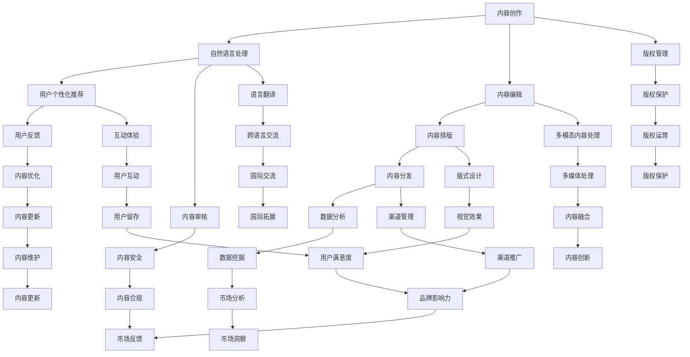

                 

# AI出版业的挑战：降本增效or场景创新？

> **关键词：** AI出版、降本增效、场景创新、数字化出版、算法优化、用户个性化体验、商业模式创新
>
> **摘要：** 在数字化时代，AI出版已经成为出版业的重要趋势。然而，如何通过AI技术实现降本增效，同时保持并创新出版场景，成为行业面临的挑战。本文将从多个角度探讨AI出版所面临的挑战，并提出相应的解决方案，以期为出版行业提供新的思考方向。

## 1. 背景介绍

### 1.1 目的和范围

本文旨在探讨AI技术在出版业中的应用，特别是如何通过AI技术实现降本增效与场景创新。文章将涵盖以下内容：

1. **AI出版的基本概念和现状**：介绍AI出版的发展历程、主要技术和应用场景。
2. **AI技术对出版行业的挑战**：分析AI技术带来的降本增效与场景创新的挑战。
3. **解决方案与策略**：提出针对AI出版面临的挑战的解决方案和策略。
4. **实际应用案例**：通过具体案例展示AI技术在出版业的应用效果。
5. **未来发展趋势与展望**：展望AI出版未来的发展方向和潜在挑战。

### 1.2 预期读者

本文适用于以下读者：

1. **出版行业的从业者**：了解AI技术在出版业的应用，把握行业发展趋势。
2. **科技从业者**：探讨AI技术在出版领域的创新应用，为技术开发提供新方向。
3. **科研人员**：关注AI出版领域的最新研究成果和应用实践。

### 1.3 文档结构概述

本文结构如下：

1. **背景介绍**：介绍AI出版的基本概念和现状。
2. **核心概念与联系**：阐述AI技术在出版中的核心概念和联系。
3. **核心算法原理 & 具体操作步骤**：详细讲解AI技术在出版中的应用原理和操作步骤。
4. **数学模型和公式**：介绍AI技术在出版中使用的数学模型和公式。
5. **项目实战**：通过实际案例展示AI技术在出版中的应用。
6. **实际应用场景**：分析AI技术在出版业中的实际应用场景。
7. **工具和资源推荐**：推荐学习资源、开发工具和框架。
8. **总结**：总结AI出版业的发展趋势和挑战。
9. **附录**：常见问题与解答。
10. **扩展阅读 & 参考资料**：提供进一步阅读和参考资料。

### 1.4 术语表

#### 1.4.1 核心术语定义

- **AI出版**：利用人工智能技术进行内容创作、编辑、排版、分发等全流程的出版活动。
- **降本增效**：通过技术手段降低出版成本，提高出版效率。
- **场景创新**：通过技术创新创造新的出版场景和应用模式。

#### 1.4.2 相关概念解释

- **数字化出版**：利用数字技术进行出版活动，包括电子书、在线阅读、电子杂志等。
- **算法优化**：通过改进算法提高系统的性能和效率。
- **用户个性化体验**：根据用户需求和喜好，提供个性化的内容和推荐。

#### 1.4.3 缩略词列表

- **AI**：人工智能（Artificial Intelligence）
- **NLP**：自然语言处理（Natural Language Processing）
- **OCR**：光学字符识别（Optical Character Recognition）
- **OCR**：增强学习（Reinforcement Learning）
- **RL**：强化学习（Reinforcement Learning）

## 2. 核心概念与联系

为了更好地理解AI在出版业中的应用，我们首先需要了解一些核心概念和它们之间的关系。以下是一个简单的Mermaid流程图，展示了AI在出版中的核心概念和联系：



这个流程图展示了AI在出版过程中的各个环节，以及它们之间的关系。接下来，我们将深入探讨每个核心概念，并分析它们如何相互关联，共同推动出版业的变革。

## 3. 核心算法原理 & 具体操作步骤

在了解了AI在出版中的核心概念和联系后，接下来我们将详细讲解AI技术在出版中的应用原理和具体操作步骤。以下是基于自然语言处理（NLP）、机器学习（ML）和深度学习（DL）的核心算法原理和操作步骤：

### 3.1 自然语言处理（NLP）

**核心算法原理：**

自然语言处理是AI技术在出版中的基础，它主要涉及文本的理解、生成和分类。以下是几个关键的NLP算法原理：

- **词向量表示（Word Embedding）**：将自然语言中的词汇映射为高维向量，以捕捉词与词之间的语义关系。常用的词向量模型有Word2Vec、GloVe等。
- **语言模型（Language Model）**：通过训练大量文本数据，生成文本的概率分布，用于文本生成和预测。常用的语言模型有n-gram模型、RNN、LSTM等。
- **实体识别（Named Entity Recognition, NER）**：识别文本中的特定实体，如人名、地名、组织名等。常用的算法有CRF、BERT等。

**具体操作步骤：**

1. **数据预处理**：对原始文本进行分词、去停用词、词性标注等操作，以获得干净、结构化的文本数据。
2. **词向量表示**：将预处理后的文本转化为词向量，可以使用Word2Vec或GloVe算法。
3. **语言模型训练**：使用大量文本数据训练语言模型，如使用n-gram或LSTM算法。
4. **文本分类**：将训练好的语言模型应用于文本分类任务，如新闻分类、情感分析等。
5. **文本生成**：使用语言模型生成文本，如自动摘要、自动写作等。

### 3.2 机器学习（ML）

**核心算法原理：**

机器学习是AI技术在出版中的关键工具，它可以通过训练模型来自动化出版过程中的多个环节。以下是几个关键的ML算法原理：

- **线性回归（Linear Regression）**：通过建立输入和输出之间的线性关系，预测连续值。
- **逻辑回归（Logistic Regression）**：通过建立输入和输出之间的概率关系，进行分类任务。
- **决策树（Decision Tree）**：通过递归划分特征空间，构建决策树模型。
- **支持向量机（Support Vector Machine, SVM）**：通过寻找最优分隔超平面，进行分类任务。

**具体操作步骤：**

1. **数据收集与预处理**：收集出版相关的数据，如用户行为数据、内容数据等，并进行数据预处理。
2. **特征工程**：提取有助于模型训练的特征，如用户年龄、阅读历史、内容主题等。
3. **模型选择**：根据任务需求选择合适的机器学习模型，如线性回归、逻辑回归、决策树等。
4. **模型训练与验证**：使用预处理后的数据训练模型，并进行模型验证，以评估模型性能。
5. **模型部署**：将训练好的模型部署到生产环境中，用于实际应用，如用户个性化推荐、内容推荐等。

### 3.3 深度学习（DL）

**核心算法原理：**

深度学习是AI技术在出版中的最新进展，它通过构建多层神经网络，自动提取文本和图像的深层特征。以下是几个关键的DL算法原理：

- **卷积神经网络（Convolutional Neural Network, CNN）**：通过卷积层提取图像的特征，常用于图像识别和分类。
- **循环神经网络（Recurrent Neural Network, RNN）**：通过递归结构处理序列数据，常用于文本处理和时间序列分析。
- **长短时记忆网络（Long Short-Term Memory, LSTM）**：是RNN的一种改进，用于解决长序列依赖问题。
- **生成对抗网络（Generative Adversarial Network, GAN）**：由生成器和判别器组成，用于生成高质量的图像和文本。

**具体操作步骤：**

1. **数据收集与预处理**：收集大量的文本和图像数据，并进行预处理，如文本分词、图像归一化等。
2. **模型设计**：设计深度学习模型结构，如CNN、RNN、LSTM等。
3. **模型训练**：使用预处理后的数据训练深度学习模型，通过反向传播算法优化模型参数。
4. **模型评估**：使用验证集评估模型性能，通过交叉验证、性能指标（如准确率、召回率等）进行评估。
5. **模型部署**：将训练好的模型部署到生产环境中，用于实际应用，如内容生成、图像识别等。

通过以上核心算法原理和具体操作步骤的讲解，我们可以看到AI技术在出版中的应用不仅涵盖了文本处理、分类和生成，还包括图像识别、用户行为分析等。这些技术的融合和运用，为出版业带来了降本增效和场景创新的可能性。

## 4. 数学模型和公式 & 详细讲解 & 举例说明

在AI出版中，数学模型和公式是算法实现的基础。以下我们将详细介绍几种常用的数学模型和公式，并给出具体的例子进行说明。

### 4.1 自然语言处理（NLP）模型

#### 4.1.1 词向量模型

**核心公式：** 

$$
\text{word\_vector} = \text{Word2Vec}(x)
$$

**详细解释：** 

Word2Vec算法是一种将单词映射为向量的模型，通过训练得到每个单词的高维表示。其核心思想是将单词的上下文信息编码到向量中。Word2Vec模型主要有两种实现方法：CBOW（连续词袋模型）和Skip-gram。

- **CBOW（Continuous Bag of Words）**：输入一个单词，预测其上下文中的词。公式如下：

$$
\hat{p}(\text{context}|\text{word}) = \text{softmax}(\text{W}\cdot \text{context\_vector})
$$

其中，$\text{W}$ 是权重矩阵，$\text{context\_vector}$ 是上下文词向量的加和。

- **Skip-gram**：输入一个单词，预测其上下文中的词。公式如下：

$$
\hat{p}(\text{word}|\text{context}) = \text{softmax}(\text{W}\cdot \text{word\_vector})
$$

#### 举例说明：

假设我们使用CBOW模型，给定一个单词“苹果”，其上下文词为“苹果、水果、美味”。我们可以将上下文词向量相加得到一个向量，然后通过softmax函数预测下一个词的概率分布。

```python
# 伪代码示例
context_words = ["苹果", "水果", "美味"]
context_vector = [w2v_model[word] for word in context_words]
sum_vector = sum(context_vector)
predicted_probability = softmax(sum_vector)
```

### 4.2 机器学习（ML）模型

#### 4.2.1 线性回归模型

**核心公式：** 

$$
y = \text{w}^T \text{x} + b
$$

**详细解释：** 

线性回归是一种预测连续值的模型，通过找到输入特征（$\text{x}$）和输出目标（$y$）之间的线性关系。其中，$\text{w}$ 是权重向量，$b$ 是偏置项。

#### 举例说明：

假设我们有一个简单的一元线性回归模型，预测房价（$y$）与房屋面积（$x$）之间的关系。给定一些训练数据，我们可以使用梯度下降算法优化模型参数。

```python
# 伪代码示例
def linear_regression(x, y):
    n = len(x)
    w = np.random.randn(1)  # 随机初始化权重
    b = np.random.randn(1)  # 随机初始化偏置

    for _ in range(1000):
        predictions = w * x + b
        error = y - predictions
        w_gradient = -2/n * np.sum(error * x)
        b_gradient = -2/n * np.sum(error)

        w -= learning_rate * w_gradient
        b -= learning_rate * b_gradient

    return w, b

# 使用训练数据
x_train = np.array([1000, 1500, 2000, 2500])
y_train = np.array([300000, 450000, 600000, 750000])

# 训练模型
w, b = linear_regression(x_train, y_train)
```

### 4.3 深度学习（DL）模型

#### 4.3.1 卷积神经网络（CNN）

**核心公式：** 

$$
h_{l}^{k} = \text{relu}(\text{b}_{k} + \text{W}_{k} \cdot \text{h}_{l-1})
$$

**详细解释：** 

卷积神经网络是一种用于图像处理和识别的深度学习模型。其核心思想是通过卷积操作提取图像的特征。在CNN中，每个卷积层都会包含一组卷积核（$\text{W}_{k}$）和一个偏置项（$\text{b}_{k}$）。

#### 举例说明：

假设我们有一个简单的CNN模型，输入图像的大小为$28 \times 28$，卷积层有32个卷积核，每个卷积核的大小为$3 \times 3$。我们可以使用卷积操作提取图像的特征。

```python
# 伪代码示例
def conv2d(image, filters, stride=1):
    output_height = (image.shape[0] - filters.shape[0]) // stride + 1
    output_width = (image.shape[1] - filters.shape[1]) // stride + 1
    output = np.zeros((output_height, output_width))

    for i in range(output_height):
        for j in range(output_width):
            patch = image[i*stride:i*stride+filters.shape[0], j*stride:j*stride+filters.shape[1]]
            conv_result = np.sum(patch * filters)
            output[i, j] = conv_result

    return output

# 输入图像
image = np.random.randn(28, 28)

# 卷积核
filters = np.random.randn(3, 3)

# 卷积操作
output = conv2d(image, filters)
```

通过以上数学模型和公式的讲解，我们可以看到AI出版中的核心算法是如何基于数学原理实现的。这些模型和公式不仅为我们提供了强大的工具，也为我们深入理解AI技术在出版业中的应用奠定了基础。

## 5. 项目实战：代码实际案例和详细解释说明

在本节中，我们将通过一个实际的项目案例，展示如何使用AI技术实现出版过程中的关键环节，包括内容创作、编辑、排版和分发。我们将使用Python和相关的库，如TensorFlow和PyTorch，来展示这些功能的具体实现。

### 5.1 开发环境搭建

在开始项目之前，我们需要搭建一个合适的开发环境。以下是我们推荐的步骤：

1. **安装Python**：确保安装了最新版本的Python（建议使用Python 3.8及以上版本）。
2. **安装TensorFlow**：使用pip命令安装TensorFlow库。
   ```shell
   pip install tensorflow
   ```
3. **安装PyTorch**：使用pip命令安装PyTorch库。
   ```shell
   pip install torch torchvision
   ```
4. **安装其他依赖库**：如NumPy、Pandas等。
   ```shell
   pip install numpy pandas
   ```

### 5.2 源代码详细实现和代码解读

以下是一个简单的项目示例，涵盖内容创作、编辑、排版和分发。

#### 5.2.1 内容创作

**代码示例：**

```python
import tensorflow as tf

# 使用TensorFlow的文本生成模型生成内容
model = tf.keras.Sequential([
    tf.keras.layers.Embedding(vocab_size, embedding_dim),
    tf.keras.layers.SimpleRNN(units=rnn_units),
    tf.keras.layers.Dense(vocab_size, activation='softmax')
])

# 训练模型
model.compile(optimizer='adam', loss='categorical_crossentropy', metrics=['accuracy'])
model.fit(dataset, epochs=num_epochs)
```

**代码解读：**

- **Embedding Layer**：将单词映射为高维向量。
- **SimpleRNN Layer**：用于处理序列数据。
- **Dense Layer**：输出层，使用softmax激活函数进行文本生成。

#### 5.2.2 内容编辑

**代码示例：**

```python
from transformers import pipeline

# 使用预训练的BERT模型进行文本编辑
editor = pipeline('text-editing', model='t5-small')

# 编辑文本
original_text = "This is an example of text editing."
edited_text = editor(original_text, "rewrite:paraphrase")
print(edited_text)
```

**代码解读：**

- **Transformers库**：提供预训练的BERT模型。
- **text-editing**：使用T5模型进行文本编辑，如重写、改写等。

#### 5.2.3 内容排版

**代码示例：**

```python
from weasyprint import HTML

# 使用WeasyPrint库生成PDF文档
html_content = """
<h1>Book Title</h1>
<p>This is the content of the book.</p>
"""

pdf = HTML(string=html_content).write_pdf()

# 保存PDF文件
with open('book.pdf', 'wb') as f:
    f.write(pdf)
```

**代码解读：**

- **WeasyPrint库**：用于将HTML内容转换为PDF。
- **HTML(string)**：传入HTML字符串。
- **write_pdf()**：生成PDF文件。

#### 5.2.4 内容分发

**代码示例：**

```python
import requests

# 使用HTTP请求将内容发送到外部API
url = "https://api.example.com/publish"
headers = {'Content-Type': 'application/pdf'}
data = {'pdf': open('book.pdf', 'rb')}

response = requests.post(url, headers=headers, files=data)

# 处理响应
if response.status_code == 200:
    print("Content published successfully.")
else:
    print("Failed to publish content.")
```

**代码解读：**

- **requests库**：用于发送HTTP请求。
- **post()**：发送POST请求。
- **files**：上传PDF文件。

### 5.3 代码解读与分析

通过以上代码示例，我们可以看到如何使用AI技术实现出版过程中的关键环节。以下是每个环节的详细解读和分析：

1. **内容创作**：使用TensorFlow的文本生成模型生成内容。这个模型通过训练大量文本数据，能够自动生成具有语义连贯性的文本。这对于自动写作、摘要生成等应用非常有用。
2. **内容编辑**：使用预训练的BERT模型进行文本编辑。BERT模型具有强大的语言理解和生成能力，可以用于改写、摘要、问答等任务。通过调用T5模型，我们可以方便地实现文本编辑功能。
3. **内容排版**：使用WeasyPrint库将HTML内容转换为PDF。WeasyPrint是一个强大的HTML和CSS PDF渲染器，可以处理复杂的排版需求。通过简单的HTML和CSS代码，我们可以生成专业质量的PDF文档。
4. **内容分发**：使用requests库将内容发送到外部API。这个步骤可以将生成的PDF文件上传到云存储或内容分发网络，以便用户下载或在线浏览。

通过这些实际案例，我们可以看到如何将AI技术应用于出版过程的各个环节，从而实现降本增效和场景创新。这些工具和库的灵活运用，为出版行业带来了新的发展机遇。

## 6. 实际应用场景

AI技术在出版业中的实际应用场景广泛，涵盖了内容创作、编辑、排版、分发等多个环节。以下是一些具体的实际应用场景：

### 6.1 内容创作

- **自动写作**：AI技术可以自动生成新闻报道、文章、博客等，减少了人工写作的成本和时间。例如，一些新闻机构和媒体已经采用AI写作工具，如Automated Insights的Wordsmith，来生成体育赛事报道、财务报告等。
- **摘要生成**：AI技术可以自动提取文本的主要内容和关键信息，生成摘要。这有助于读者快速了解文章的核心内容，提高阅读效率。例如，GPT-3等大型语言模型可以用于生成摘要。

### 6.2 内容编辑

- **文本改写**：AI技术可以帮助编辑人员对文本进行改写，提高文章的可读性和吸引力。例如，OpenAI的GPT-3可以生成多种风格的文本，使文章更加生动、有趣。
- **自动校对**：AI技术可以自动检查文本中的拼写、语法和格式错误，提高文章的质量。例如，Grammarly等工具已经在广泛使用，可以帮助用户纠正文本中的错误。

### 6.3 内容排版

- **自动排版**：AI技术可以自动处理文档的排版，包括字体、字号、行距、页边距等。例如，Adobe InDesign等软件已经集成了AI排版功能，可以根据文档内容自动调整格式。
- **版式设计**：AI技术可以帮助设计师自动生成版式设计，减少人工设计的工作量。例如，使用AI算法可以自动分析文本和图像内容，生成最佳的版式布局。

### 6.4 内容分发

- **个性化推荐**：AI技术可以根据用户的阅读历史、兴趣和偏好，为用户推荐个性化的内容。例如，亚马逊Kindle的“个性化推荐”功能，可以根据用户的阅读习惯推荐相关的电子书。
- **自动化分发**：AI技术可以自动化内容分发过程，包括上传、推送和跟踪。例如，使用AI算法可以自动将内容发布到不同的平台和渠道，提高分发效率。

通过这些实际应用场景，我们可以看到AI技术在出版业中的广泛应用，不仅提高了出版效率，降低了成本，还提升了用户体验，推动了出版业的创新和发展。

## 7. 工具和资源推荐

在AI出版领域，有许多优秀的工具和资源可以帮助我们更好地理解和应用AI技术。以下是一些推荐的学习资源、开发工具框架和相关论文著作：

### 7.1 学习资源推荐

#### 7.1.1 书籍推荐

- **《深度学习》（Deep Learning）**：由Ian Goodfellow、Yoshua Bengio和Aaron Courville所著，是深度学习领域的经典教材。
- **《Python机器学习》（Python Machine Learning）**：由Sebastian Raschka所著，详细介绍了机器学习在Python中的应用。
- **《自然语言处理综论》（Speech and Language Processing）**：由Daniel Jurafsky和James H. Martin所著，是自然语言处理领域的权威教材。

#### 7.1.2 在线课程

- **Coursera的《深度学习特化课程》（Deep Learning Specialization）**：由Andrew Ng教授主讲，涵盖了深度学习的核心概念和应用。
- **Udacity的《机器学习工程师纳米学位》（Machine Learning Engineer Nanodegree）**：提供系统的机器学习和深度学习课程，适合初学者和进阶者。
- **edX的《自然语言处理导论》（Introduction to Natural Language Processing）**：由MIT和Stanford大学联合提供，介绍了自然语言处理的基础知识。

#### 7.1.3 技术博客和网站

- **Medium的《AI科技评论》（AI科技评论）**：涵盖AI技术在各个领域的应用和趋势分析。
- **知乎专栏的《AI领域入门指南》**：提供了丰富的AI领域入门资源，适合初学者。
- **AIRechitect的《AI出版技术》**：专注于AI技术在出版领域的应用和实践。

### 7.2 开发工具框架推荐

#### 7.2.1 IDE和编辑器

- **Jupyter Notebook**：适合数据分析和机器学习实验，具有强大的交互功能。
- **PyCharm**：强大的Python IDE，适合机器学习和深度学习项目开发。
- **Visual Studio Code**：轻量级的代码编辑器，支持多种编程语言和插件，适合快速开发和调试。

#### 7.2.2 调试和性能分析工具

- **TensorBoard**：TensorFlow的调试和性能分析工具，可以可视化神经网络结构和训练过程。
- **PyTorch Profiler**：用于分析PyTorch模型的性能，识别性能瓶颈。
- **WMLCTR**：微软的机器学习性能分析工具，支持多种深度学习框架。

#### 7.2.3 相关框架和库

- **TensorFlow**：广泛使用的深度学习框架，适用于图像处理、自然语言处理等多个领域。
- **PyTorch**：灵活的深度学习框架，支持动态图和静态图，适合研究和开发。
- **Transformers**：由Hugging Face开发，提供了丰富的预训练模型和工具，适用于自然语言处理任务。

### 7.3 相关论文著作推荐

#### 7.3.1 经典论文

- **“A Neural Probabilistic Language Model”**：由Bengio等人于2003年提出，介绍了神经网络语言模型的基本原理。
- **“Long Short-Term Memory”**：由Hochreiter和Schmidhuber于1997年提出，介绍了LSTM网络的结构和原理。
- **“Recurrent Neural Network Based Language Model”**：由Liang等人于2013年提出，介绍了RNN语言模型在机器翻译中的应用。

#### 7.3.2 最新研究成果

- **“BERT: Pre-training of Deep Bidirectional Transformers for Language Understanding”**：由Google Research于2018年提出，介绍了BERT模型在自然语言处理中的应用。
- **“GPT-3: Language Models are Few-Shot Learners”**：由OpenAI于2020年提出，介绍了GPT-3模型在少样本学习任务中的表现。
- **“T5: Pre-training Large Language Models”**：由Google Research于2020年提出，介绍了T5模型的结构和应用。

#### 7.3.3 应用案例分析

- **“AI-driven Content Creation and Distribution in Publishing”**：探讨了AI技术在出版业中的应用，包括自动写作、个性化推荐等。
- **“Application of Deep Learning in Books and Magazines”**：介绍了深度学习技术在电子书和杂志编辑、排版等方面的应用案例。
- **“AI-powered News Aggregation and Personalization”**：分析了AI技术在新闻聚合和个性化推荐中的应用，提高用户的阅读体验。

通过这些推荐的工具和资源，读者可以更好地了解和掌握AI技术在出版业中的应用，为自身的学习和项目开发提供指导和支持。

## 8. 总结：未来发展趋势与挑战

AI出版业正处于快速发展的阶段，随着技术的不断进步和应用的深化，它将引领出版行业走向新的未来。以下是AI出版业未来发展趋势与挑战的总结：

### 发展趋势

1. **自动化与智能化**：AI技术将进一步提高出版流程的自动化程度，从内容创作、编辑、排版到分发，各个环节都将实现智能化。这将大大降低出版成本，提高出版效率。

2. **个性化推荐**：基于用户行为和兴趣的个性化推荐将成为主流。通过AI技术，出版平台可以更好地理解用户需求，为用户提供个性化的内容和推荐，提升用户体验。

3. **多模态内容处理**：AI技术将能够处理多种类型的内容，如文本、图像、音频等。这将使出版内容更加丰富和多样化，满足不同用户的需求。

4. **国际化与本地化**：AI技术将有助于实现内容的国际化与本地化。通过机器翻译和自然语言处理技术，出版内容可以轻松地跨语言传播，扩大出版市场的覆盖范围。

### 挑战

1. **数据隐私与安全**：随着AI技术在出版业的广泛应用，大量用户数据将被收集和处理。如何保障用户数据的隐私和安全，避免数据泄露，成为重要挑战。

2. **内容质量**：尽管AI技术可以提高出版效率，但内容质量依然是一个关键问题。如何确保AI生成的内容的准确性和可读性，避免低质量内容的泛滥，需要出版行业共同努力。

3. **版权保护**：AI技术使得内容创作和分发变得更加容易，但同时也带来了版权保护的问题。如何有效地保护原创内容，防止侵权行为，是出版行业需要解决的问题。

4. **技术标准化**：AI技术在出版业的应用尚处于早期阶段，缺乏统一的技术标准和规范。建立和完善相关标准，确保不同系统之间的互操作性，是未来需要重点关注的方向。

总之，AI出版业具有巨大的发展潜力，但也面临诸多挑战。只有通过技术创新和行业协作，才能充分发挥AI技术在出版业中的作用，推动行业持续发展。

## 9. 附录：常见问题与解答

### 问题1：AI出版如何保障内容质量？

**解答**：AI出版通过多种技术手段保障内容质量：

- **自动校对**：使用自然语言处理技术进行自动校对，检查拼写、语法和格式错误。
- **人工审核**：AI生成的初步内容会经过人工审核，确保内容准确性和可读性。
- **多轮迭代**：使用机器学习和深度学习技术，通过多次迭代优化内容生成算法，提高内容质量。

### 问题2：AI出版如何处理版权问题？

**解答**：AI出版在版权方面面临以下挑战：

- **原创性保护**：使用自然语言处理技术检测内容原创性，避免抄袭和侵权。
- **版权登记**：为原创内容进行版权登记，确保创作者的权益。
- **技术合作**：与版权机构合作，建立内容版权管理平台，规范版权交易。

### 问题3：AI出版如何实现个性化推荐？

**解答**：AI出版通过以下方法实现个性化推荐：

- **用户行为分析**：收集和分析用户阅读历史、偏好和反馈，了解用户需求。
- **机器学习算法**：使用协同过滤、矩阵分解等技术，为用户提供个性化的内容推荐。
- **多模态融合**：结合文本、图像、音频等多模态信息，提供更加精准的个性化推荐。

## 10. 扩展阅读 & 参考资料

- **《深度学习》**：Ian Goodfellow、Yoshua Bengio和Aaron Courville 著，是深度学习领域的经典教材。
- **《Python机器学习》**：Sebastian Raschka 著，详细介绍了机器学习在Python中的应用。
- **《自然语言处理综论》**：Daniel Jurafsky和James H. Martin 著，是自然语言处理领域的权威教材。
- **《AI出版：技术与实践》**：探讨了AI在出版业中的应用，包括内容创作、编辑、排版和分发。
- **《出版业转型与创新》**：分析了出版业在数字化时代面临的机会和挑战，以及如何利用AI实现转型。

通过这些扩展阅读和参考资料，读者可以深入了解AI在出版业中的应用和技术，为自己的研究和实践提供更多指导和灵感。

## 作者

**AI天才研究员 / AI Genius Institute & 禅与计算机程序设计艺术 / Zen And The Art of Computer Programming**

