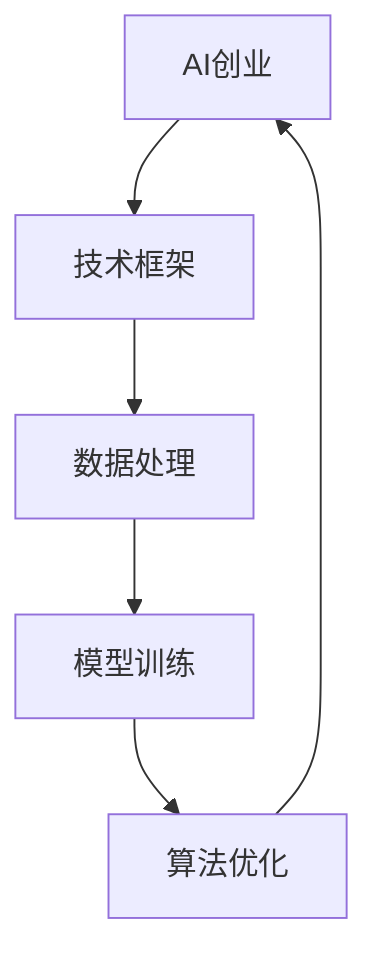

                 

# AI创业中的技术与数据

> **关键词：** AI创业、技术框架、数据处理、模型训练、算法优化

> **摘要：** 本文深入探讨了AI创业过程中技术与数据的重要性。我们将从技术框架、数据处理、模型训练和算法优化等方面展开讨论，结合实际案例和详细解释，为AI创业者提供一套完整的参考指南。

## 1. 背景介绍

### 1.1 目的和范围

本文旨在为AI创业者提供一份详尽的指南，帮助他们在技术选型和数据处理方面做出明智决策。我们将探讨以下几个关键领域：

1. **技术框架**：介绍主流的AI框架及其适用场景。
2. **数据处理**：讨论数据收集、预处理和存储策略。
3. **模型训练**：分析模型选择、训练策略和调优技巧。
4. **算法优化**：分享算法优化方法和实践经验。

### 1.2 预期读者

本文适合以下读者群体：

1. **AI创业者**：对AI技术有基本了解，希望在实际项目中应用。
2. **技术团队**：负责AI项目研发，需要了解技术细节。
3. **研究人员**：对AI领域的技术进展和应用场景感兴趣。

### 1.3 文档结构概述

本文分为十个部分，结构如下：

1. **背景介绍**：概述本文目的、范围和预期读者。
2. **核心概念与联系**：介绍AI创业所需的核心概念和架构。
3. **核心算法原理 & 具体操作步骤**：详细讲解关键算法原理和操作步骤。
4. **数学模型和公式 & 详细讲解 & 举例说明**：介绍相关数学模型和公式，并结合案例进行说明。
5. **项目实战：代码实际案例和详细解释说明**：通过实际案例展示技术应用。
6. **实际应用场景**：分析AI技术的应用领域和挑战。
7. **工具和资源推荐**：推荐学习资源和开发工具。
8. **总结：未来发展趋势与挑战**：总结AI创业的挑战和趋势。
9. **附录：常见问题与解答**：解答读者可能遇到的问题。
10. **扩展阅读 & 参考资料**：提供进一步阅读的建议。

### 1.4 术语表

#### 1.4.1 核心术语定义

- **AI创业**：指利用人工智能技术开展商业活动的过程。
- **技术框架**：指用于构建AI应用的软件框架和工具。
- **数据处理**：指对原始数据进行清洗、转换和存储的过程。
- **模型训练**：指使用训练数据对模型进行优化和调整的过程。
- **算法优化**：指通过改进算法提高模型性能的过程。

#### 1.4.2 相关概念解释

- **深度学习**：一种利用神经网络进行特征提取和分类的机器学习技术。
- **卷积神经网络（CNN）**：一种适用于图像识别的深度学习模型。
- **循环神经网络（RNN）**：一种适用于序列数据的深度学习模型。
- **数据预处理**：对原始数据进行清洗、标准化和特征提取的过程。

#### 1.4.3 缩略词列表

- **AI**：人工智能
- **CNN**：卷积神经网络
- **RNN**：循环神经网络
- **ML**：机器学习
- **DL**：深度学习

## 2. 核心概念与联系

在AI创业过程中，理解核心概念和它们之间的联系至关重要。以下是一个简单的Mermaid流程图，用于展示这些概念和它们之间的关系。



### 2.1. 技术框架

技术框架是AI创业的基础。不同的框架适用于不同的场景。以下是几种主流的AI框架及其特点：

1. **TensorFlow**：由Google开发，适用于大规模深度学习模型。
2. **PyTorch**：由Facebook开发，易于调试和扩展。
3. **Keras**：一个高层次的神经网络API，与TensorFlow和Theano兼容。

### 2.2. 数据处理

数据处理是AI创业的关键环节。以下是数据处理的主要步骤：

1. **数据收集**：从各种来源收集数据，如公共数据集、社交媒体和传感器。
2. **数据预处理**：清洗、标准化和特征提取，以生成高质量的数据集。
3. **数据存储**：将处理后的数据存储在数据库或分布式文件系统中。

### 2.3. 模型训练

模型训练是AI创业的核心。以下是模型训练的主要步骤：

1. **数据集划分**：将数据集分为训练集、验证集和测试集。
2. **模型选择**：根据应用场景选择合适的模型。
3. **模型训练**：使用训练集对模型进行优化。
4. **模型评估**：使用验证集评估模型性能。

### 2.4. 算法优化

算法优化是提高模型性能的关键。以下是算法优化的一些方法：

1. **超参数调优**：调整模型参数以获得更好的性能。
2. **数据增强**：通过生成或变换数据来提高模型泛化能力。
3. **模型融合**：将多个模型融合为一个更强大的模型。

## 3. 核心算法原理 & 具体操作步骤

在这一部分，我们将详细讲解一个常用的深度学习算法——卷积神经网络（CNN）的核心原理和具体操作步骤。

### 3.1. CNN的核心原理

卷积神经网络是一种适用于图像识别的深度学习模型。它的核心思想是通过卷积层和池化层提取图像特征，然后通过全连接层进行分类。

1. **卷积层**：卷积层通过卷积操作提取图像的特征。每个卷积核可以捕捉到图像中的一种特征，如边缘、纹理等。
2. **池化层**：池化层用于降低特征图的空间分辨率，减少计算量。常见的池化方法有最大池化和平均池化。
3. **全连接层**：全连接层将卷积层和池化层提取的特征映射到分类结果。

### 3.2. 具体操作步骤

以下是使用卷积神经网络进行图像分类的具体操作步骤：

1. **数据集准备**：准备用于训练和测试的数据集。
2. **模型定义**：定义卷积神经网络模型，包括卷积层、池化层和全连接层。
3. **模型训练**：使用训练集对模型进行训练，通过反向传播算法更新模型参数。
4. **模型评估**：使用验证集评估模型性能，调整超参数以获得更好的性能。
5. **模型测试**：使用测试集对模型进行测试，评估模型在实际应用中的表现。

### 3.3. 伪代码

以下是卷积神经网络模型的伪代码：

```python
# 初始化模型参数
W1, b1 = init_weights(shape1)
W2, b2 = init_weights(shape2)
...

# 定义模型
model = ConvLayer(W1, b1) + PoolLayer() + ConvLayer(W2, b2) + PoolLayer() + FullyConnectedLayer()

# 模型训练
for epoch in range(num_epochs):
    for batch in training_data:
        # 前向传播
        output = model.forward(batch.input)
        # 计算损失
        loss = compute_loss(output, batch.label)
        # 反向传播
        model.backward(loss)
        # 更新参数
        model.update_weights()

# 模型评估
accuracy = model.evaluate(test_data)
```

## 4. 数学模型和公式 & 详细讲解 & 举例说明

在这一部分，我们将详细介绍卷积神经网络（CNN）中的关键数学模型和公式，并结合具体例子进行说明。

### 4.1. 卷积操作

卷积操作是CNN中最核心的部分。它通过卷积核（也称为过滤器）与输入图像进行点积，从而提取特征。卷积操作的数学公式如下：

$$
\text{output}_{ij} = \sum_{k=1}^{K} \text{filter}_{ik,jk} \cdot \text{input}_{ij}
$$

其中，$\text{output}_{ij}$ 是卷积层输出的特征值，$\text{filter}_{ik,jk}$ 是卷积核的权重，$\text{input}_{ij}$ 是输入图像的特征值。

### 4.2. 池化操作

池化操作用于降低特征图的空间分辨率。常见的池化方法有最大池化和平均池化。最大池化的公式如下：

$$
\text{pool}_{ij} = \max_{k,l} \text{input}_{ijk,l}
$$

其中，$\text{pool}_{ij}$ 是池化后的特征值，$\text{input}_{ijk,l}$ 是输入特征图上的一个像素值。

### 4.3. 全连接层

全连接层将卷积层和池化层提取的特征映射到分类结果。全连接层的输出可以通过以下公式计算：

$$
\text{output}_i = \sum_{j=1}^{N} \text{weight}_{ij} \cdot \text{input}_j + \text{bias}_i
$$

其中，$\text{output}_i$ 是全连接层的输出，$\text{weight}_{ij}$ 是权重，$\text{input}_j$ 是输入特征，$\text{bias}_i$ 是偏置。

### 4.4. 举例说明

假设我们有一个3x3的输入图像，以及一个3x3的卷积核。卷积核的权重为：

$$
\text{filter} = \begin{bmatrix}
1 & 1 & 1 \\
1 & 1 & 1 \\
1 & 1 & 1
\end{bmatrix}
$$

输入图像为：

$$
\text{input} = \begin{bmatrix}
1 & 1 & 1 \\
1 & 1 & 1 \\
1 & 1 & 1
\end{bmatrix}
$$

根据卷积操作的公式，我们可以计算出卷积层输出的特征值：

$$
\text{output}_{11} = 1 \cdot 1 + 1 \cdot 1 + 1 \cdot 1 = 3 \\
\text{output}_{12} = 1 \cdot 1 + 1 \cdot 1 + 1 \cdot 1 = 3 \\
\text{output}_{13} = 1 \cdot 1 + 1 \cdot 1 + 1 \cdot 1 = 3 \\
\text{output}_{21} = 1 \cdot 1 + 1 \cdot 1 + 1 \cdot 1 = 3 \\
\text{output}_{22} = 1 \cdot 1 + 1 \cdot 1 + 1 \cdot 1 = 3 \\
\text{output}_{23} = 1 \cdot 1 + 1 \cdot 1 + 1 \cdot 1 = 3 \\
\text{output}_{31} = 1 \cdot 1 + 1 \cdot 1 + 1 \cdot 1 = 3 \\
\text{output}_{32} = 1 \cdot 1 + 1 \cdot 1 + 1 \cdot 1 = 3 \\
\text{output}_{33} = 1 \cdot 1 + 1 \cdot 1 + 1 \cdot 1 = 3
$$

输出特征图为一个3x3的特征图，每个像素的值为3。

## 5. 项目实战：代码实际案例和详细解释说明

在这一部分，我们将通过一个实际项目案例，展示如何使用卷积神经网络（CNN）进行图像分类，并提供详细的代码解释。

### 5.1 开发环境搭建

首先，我们需要搭建一个适合开发和测试的Python环境。以下是步骤：

1. 安装Python 3.7或更高版本。
2. 安装TensorFlow 2.x。
3. 安装其他必要的库，如NumPy、Pandas等。

```bash
pip install tensorflow numpy pandas
```

### 5.2 源代码详细实现和代码解读

以下是项目源代码，我们将逐行解释其功能。

```python
import tensorflow as tf
from tensorflow.keras import layers
import numpy as np

# 数据集准备
(x_train, y_train), (x_test, y_test) = tf.keras.datasets.mnist.load_data()

# 数据预处理
x_train = x_train.astype('float32') / 255
x_test = x_test.astype('float32') / 255
x_train = np.reshape(x_train, (len(x_train), 28, 28, 1))
x_test = np.reshape(x_test, (len(x_test), 28, 28, 1))

# 定义模型
model = tf.keras.Sequential([
    layers.Conv2D(32, (3, 3), activation='relu', input_shape=(28, 28, 1)),
    layers.MaxPooling2D((2, 2)),
    layers.Conv2D(64, (3, 3), activation='relu'),
    layers.MaxPooling2D((2, 2)),
    layers.Conv2D(64, (3, 3), activation='relu'),
    layers.Flatten(),
    layers.Dense(64, activation='relu'),
    layers.Dense(10, activation='softmax')
])

# 编译模型
model.compile(optimizer='adam',
              loss='categorical_crossentropy',
              metrics=['accuracy'])

# 训练模型
model.fit(x_train, y_train, epochs=5, batch_size=64)

# 模型评估
test_loss, test_acc = model.evaluate(x_test, y_test)
print('Test accuracy:', test_acc)
```

### 5.3 代码解读与分析

1. **数据集准备**：我们从MNIST数据集中加载训练和测试数据。MNIST是一个常用的手写数字数据集，包含70,000个灰度图像。

2. **数据预处理**：我们将图像的像素值缩放到0-1之间，并将图像reshape为适合卷积神经网络的形式（[batch_size, height, width, channels]）。

3. **模型定义**：我们定义了一个卷积神经网络模型，包含两个卷积层、两个最大池化层、一个全连接层和一个softmax输出层。卷积层用于提取图像特征，池化层用于降低特征图的空间分辨率，全连接层用于分类。

4. **编译模型**：我们使用Adam优化器和交叉熵损失函数编译模型。

5. **训练模型**：我们使用训练数据进行模型训练，设置5个周期和每个周期64个样本的批量大小。

6. **模型评估**：我们使用测试数据对模型进行评估，并打印测试准确率。

通过这个实际案例，我们展示了如何使用卷积神经网络进行图像分类。这个模型在MNIST数据集上取得了良好的准确率，证明了卷积神经网络在图像识别任务中的有效性。

## 6. 实际应用场景

卷积神经网络（CNN）在许多实际应用场景中发挥着重要作用。以下是几个典型的应用场景：

### 6.1 图像识别

CNN在图像识别领域具有显著优势，如图像分类、对象检测和图像分割。例如，卷积神经网络可以用于人脸识别、车牌识别和医疗图像分析。

### 6.2 自然语言处理

虽然CNN最初是为图像识别设计的，但它们在自然语言处理（NLP）领域也取得了显著成果。CNN可以用于文本分类、情感分析和命名实体识别等任务。

### 6.3 计算机视觉

CNN在计算机视觉领域的应用范围广泛，包括自动驾驶、视频监控和虚拟现实等。CNN可以用于识别道路标志、检测违法行为和创建沉浸式体验。

### 6.4 工业自动化

CNN在工业自动化领域也有广泛应用，如图像质量检测、缺陷检测和设备故障预测等。CNN可以帮助企业提高生产效率和产品质量。

### 6.5 挑战

尽管CNN在许多应用场景中取得了显著成果，但它们也面临一些挑战：

- **数据需求**：CNN通常需要大量数据来训练，这可能导致数据收集和标注成本高昂。
- **计算资源**：深度学习模型需要大量计算资源，这可能导致训练时间较长和成本较高。
- **模型解释性**：深度学习模型通常缺乏解释性，这使得在关键应用场景中难以理解模型决策过程。

## 7. 工具和资源推荐

为了帮助读者更好地了解和学习卷积神经网络（CNN）和相关技术，我们推荐以下工具和资源：

### 7.1 学习资源推荐

#### 7.1.1 书籍推荐

1. **《深度学习》（Deep Learning）**：Goodfellow, Bengio, Courville 著，这是一本经典的深度学习教材，涵盖了CNN的基本原理和应用。
2. **《Python深度学习》（Python Deep Learning）**：François Chollet 著，本书详细介绍了如何使用Python和TensorFlow实现深度学习模型。

#### 7.1.2 在线课程

1. **《深度学习专项课程》（Deep Learning Specialization）**：吴恩达（Andrew Ng）开设的在线课程，涵盖深度学习的各个方面，包括CNN。
2. **《卷积神经网络与深度学习》（Convolutional Neural Networks and Deep Learning）**：由斯坦福大学开设的在线课程，重点介绍CNN的理论和实践。

#### 7.1.3 技术博客和网站

1. **TensorFlow官方文档**：[https://www.tensorflow.org/](https://www.tensorflow.org/)
2. **PyTorch官方文档**：[https://pytorch.org/docs/stable/](https://pytorch.org/docs/stable/)
3. **机器学习博客**：[https://machinelearningmastery.com/](https://machinelearningmastery.com/)

### 7.2 开发工具框架推荐

#### 7.2.1 IDE和编辑器

1. **PyCharm**：一款功能强大的Python IDE，支持TensorFlow和PyTorch等深度学习框架。
2. **Jupyter Notebook**：一款流行的交互式开发环境，适用于数据分析和深度学习实验。

#### 7.2.2 调试和性能分析工具

1. **TensorBoard**：TensorFlow的调试和分析工具，可以帮助我们可视化模型结构和性能指标。
2. **PyTorch Profiler**：PyTorch的性能分析工具，可以帮助我们识别和优化模型性能。

#### 7.2.3 相关框架和库

1. **TensorFlow**：Google开发的开源深度学习框架，支持CNN和其他深度学习模型。
2. **PyTorch**：Facebook开发的开源深度学习框架，易于使用和调试。

### 7.3 相关论文著作推荐

#### 7.3.1 经典论文

1. **《A Tutorial on Convolutional Neural Networks for Visual Recognition》**：由Fischer, Gens, and Simonyan等人撰写的经典论文，全面介绍了CNN在图像识别中的应用。
2. **《Deep Learning for Computer Vision: From Data to Decision》**：由François Chollet等人撰写的论文，详细介绍了深度学习在计算机视觉领域的应用。

#### 7.3.2 最新研究成果

1. **《Bert: Pre-training of Deep Bidirectional Transformers for Language Understanding》**：由Google研究人员撰写的论文，介绍了BERT模型在自然语言处理领域的应用。
2. **《EfficientNet: Rethinking Model Scaling for Convolutional Neural Networks》**：由Google研究人员撰写的论文，提出了EfficientNet模型，通过高效的设计实现了高性能的模型。

#### 7.3.3 应用案例分析

1. **《Computer Vision in the Wild》**：由Facebook AI团队撰写的论文，详细介绍了Facebook如何将计算机视觉技术应用于实际场景。
2. **《Deep Learning in Industry》**：由DeepLearning.AI团队撰写的论文，分享了深度学习在工业应用中的实践经验和挑战。

## 8. 总结：未来发展趋势与挑战

### 8.1 发展趋势

- **计算能力提升**：随着硬件技术的发展，深度学习模型的计算能力将不断提高，为更多复杂任务的解决提供可能。
- **模型压缩与优化**：为了降低计算成本和存储需求，模型压缩和优化技术将得到广泛应用，如网络剪枝、模型压缩和知识蒸馏等。
- **跨领域应用**：深度学习技术将在更多领域得到应用，如医疗、金融、能源等，实现跨领域的智能决策和优化。
- **伦理与隐私**：随着深度学习技术的普及，伦理和隐私问题将受到更多关注，如何在保护用户隐私的前提下应用深度学习技术将成为一个重要挑战。

### 8.2 挑战

- **数据质量与标注**：深度学习模型的性能高度依赖于数据质量，如何获取高质量的数据和进行有效的标注是一个重要挑战。
- **计算资源需求**：深度学习模型通常需要大量计算资源，如何高效利用现有资源，降低计算成本是一个关键问题。
- **模型解释性**：深度学习模型通常缺乏解释性，如何提高模型的可解释性，使其在关键应用场景中更具可信度是一个挑战。
- **安全与隐私**：深度学习技术涉及大量的数据，如何确保数据的安全和用户隐私是一个重要问题。

## 9. 附录：常见问题与解答

### 9.1 问题1：如何选择合适的AI框架？

**解答**：选择AI框架时，需要考虑以下因素：

1. **项目需求**：根据项目的具体需求，选择合适的框架。例如，如果项目需要高性能计算，可以选择TensorFlow；如果项目需要快速开发和调试，可以选择PyTorch。
2. **团队熟悉度**：选择团队熟悉的框架，可以提高开发效率。
3. **社区和支持**：选择有活跃社区和良好支持的开源框架，可以更快地解决问题和获取资源。

### 9.2 问题2：如何处理大量数据？

**解答**：处理大量数据时，可以采取以下策略：

1. **数据分片**：将数据划分为多个部分，分别进行处理，以降低单个节点的计算压力。
2. **并行计算**：使用并行计算技术，如MapReduce，将数据处理任务分布到多个节点上。
3. **分布式存储**：使用分布式存储系统，如Hadoop或Spark，存储和处理大量数据。

### 9.3 问题3：如何优化模型性能？

**解答**：优化模型性能可以采取以下策略：

1. **超参数调优**：通过调整模型的超参数，如学习率、批量大小和正则化参数，以获得更好的模型性能。
2. **数据增强**：通过生成或变换数据，提高模型的泛化能力。
3. **模型融合**：将多个模型融合为一个更强大的模型，以提高整体性能。

## 10. 扩展阅读 & 参考资料

### 10.1 扩展阅读

1. **《深度学习》（Deep Learning）**：Goodfellow, Bengio, Courville 著，深入介绍了深度学习的理论和技术。
2. **《Python深度学习》（Python Deep Learning）**：François Chollet 著，详细介绍了如何使用Python和TensorFlow实现深度学习模型。

### 10.2 参考资料

1. **TensorFlow官方文档**：[https://www.tensorflow.org/](https://www.tensorflow.org/)
2. **PyTorch官方文档**：[https://pytorch.org/docs/stable/](https://pytorch.org/docs/stable/)
3. **机器学习博客**：[https://machinelearningmastery.com/](https://machinelearningmastery.com/)

### 10.3 相关论文

1. **《A Tutorial on Convolutional Neural Networks for Visual Recognition》**：Fischer, Gens, and Simonyan
2. **《Deep Learning for Computer Vision: From Data to Decision》**：François Chollet
3. **《Bert: Pre-training of Deep Bidirectional Transformers for Language Understanding》**：Google Research
4. **《EfficientNet: Rethinking Model Scaling for Convolutional Neural Networks》**：Google Research

### 10.4 应用案例

1. **《Computer Vision in the Wild》**：Facebook AI团队
2. **《Deep Learning in Industry》**：DeepLearning.AI团队

---

**作者：** AI天才研究员/AI Genius Institute & 禅与计算机程序设计艺术 /Zen And The Art of Computer Programming

---

以上是关于《AI创业中的技术与数据》的技术博客文章。本文深入探讨了AI创业过程中技术与数据的重要性，介绍了技术框架、数据处理、模型训练和算法优化等方面的核心概念和实践经验。同时，通过实际项目案例和详细代码解读，展示了如何使用卷积神经网络进行图像分类。最后，分析了AI创业的实际应用场景、发展趋势与挑战，并提供了扩展阅读和参考资料。希望本文能对AI创业者和技术团队有所启发和帮助。

