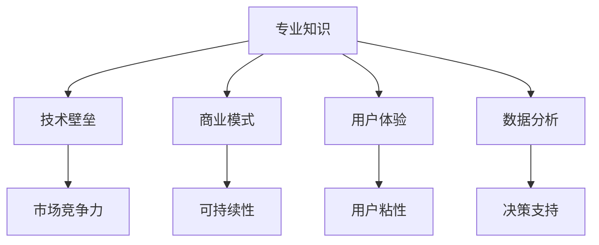

                 

# AI创业优势：垂直领域专业知识

> **关键词：** AI创业、垂直领域、专业知识、商业模式、技术壁垒、用户体验、数据分析、AI应用、创业策略

> **摘要：** 本文将深入探讨AI创业在垂直领域中的优势，解析专业知识的重要性，以及如何利用专业知识构建具有竞争力和可持续发展的商业模式。文章将结合实际案例，详细阐述如何通过技术壁垒和用户体验提升项目成功率，最后提出对未来发展趋势与挑战的思考。

## 1. 背景介绍

### 1.1 目的和范围

本文旨在为有意在人工智能（AI）领域创业的个人和团队提供指导，特别是那些专注于垂直市场的创业者。我们将分析AI在垂直领域中的独特优势，探讨如何利用专业知识构建可持续发展的商业模式，并提供实际操作的建议。

### 1.2 预期读者

- 有意向在AI领域创业的个人和团队
- AI从业者和研究人员，对垂直领域应用感兴趣
- 对商业模式和技术创新有浓厚兴趣的创业者

### 1.3 文档结构概述

本文分为十个部分：

1. 背景介绍
2. 核心概念与联系
3. 核心算法原理 & 具体操作步骤
4. 数学模型和公式 & 详细讲解 & 举例说明
5. 项目实战：代码实际案例和详细解释说明
6. 实际应用场景
7. 工具和资源推荐
8. 总结：未来发展趋势与挑战
9. 附录：常见问题与解答
10. 扩展阅读 & 参考资料

### 1.4 术语表

#### 1.4.1 核心术语定义

- **垂直领域**：指特定行业或细分市场，与广泛的横向市场相对。
- **专业知识**：指在特定领域内积累的深层次理解和技术技能。
- **商业模式**：指企业如何创造、传递和获取价值。

#### 1.4.2 相关概念解释

- **技术壁垒**：指在某一技术领域内建立的竞争优势，包括专利、专业知识等。
- **用户体验**：指用户在使用产品或服务时的感受和体验。

#### 1.4.3 缩略词列表

- **AI**：人工智能
- **NLP**：自然语言处理
- **ML**：机器学习
- **DL**：深度学习

## 2. 核心概念与联系

在AI创业过程中，有几个核心概念和技术架构是至关重要的。为了更好地理解这些概念，我们首先通过一个Mermaid流程图来展示它们之间的关系。



### 2.1 专业知识

专业知识是AI创业的基石。在一个垂直领域中，深入理解行业特性和市场需求，能够帮助创业者设计出更符合用户需求的产品和服务。

### 2.2 技术壁垒

技术壁垒是保护创业项目免受竞争对手冲击的关键。通过积累专利、构建算法和建立技术团队，创业公司可以在垂直领域内形成竞争优势。

### 2.3 商业模式

商业模式是创业项目的生命线。一个成功的商业模式应该能够创造价值、传递价值和获取价值，从而实现盈利。

### 2.4 用户体验

用户体验是吸引和保留用户的关键因素。通过优化用户界面、提高产品性能和提供个性化服务，创业公司可以增强用户粘性。

### 2.5 数据分析

数据分析是决策支持的重要工具。通过对用户行为和市场趋势的数据分析，创业公司可以优化产品和服务，提高市场竞争力。

## 3. 核心算法原理 & 具体操作步骤

在AI创业过程中，核心算法原理是构建产品和服务的核心。以下是一个简单的机器学习算法原理的伪代码示例，用于分类任务。

```plaintext
// 输入：训练数据集 X, 标签数据集 Y
// 输出：训练好的分类模型

初始化模型参数 W 和 b

for each epoch in [1, n_epochs]:
    for each training sample (x_i, y_i) in X:
        // 计算预测值
        z = x_i * W + b
        a = sigmoid(z)
        
        // 计算损失函数
        loss = -[y_i * log(a) + (1 - y_i) * log(1 - a)]
        
        // 计算梯度
        dW = x_i * (a - y_i)
        db = a - y_i
        
        // 更新参数
        W = W - learning_rate * dW
        b = b - learning_rate * db

返回 W 和 b
```

### 3.1 数据预处理

在训练模型之前，我们需要对数据进行预处理。这包括数据清洗、归一化和特征提取等步骤。

```plaintext
// 输入：原始数据集 X
// 输出：预处理后的数据集 X'

// 数据清洗
X' = 清洗(X)

// 归一化
X' = 归一化(X')

// 特征提取
X' = 特征提取(X')

返回 X'
```

### 3.2 模型训练

在完成数据预处理后，我们使用上面提到的梯度下降算法进行模型训练。在训练过程中，我们需要设置合适的迭代次数和学习率。

### 3.3 模型评估

模型训练完成后，我们需要使用验证集或测试集来评估模型性能。常用的评估指标包括准确率、召回率和F1分数等。

```plaintext
// 输入：验证集 X_val, 标签数据集 Y_val
// 输出：评估指标 scores

for each sample (x_i, y_i) in X_val:
    // 预测标签
    pred = 模型.predict(x_i)
    
    // 计算评估指标
    if pred == y_i:
        correct += 1
    end if

scores = [correct / n_samples]

返回 scores
```

## 4. 数学模型和公式 & 详细讲解 & 举例说明

在AI创业过程中，数学模型和公式是理解和应用AI技术的关键。以下是一个常用的机器学习模型——逻辑回归的数学模型和公式。

### 4.1 逻辑回归模型

逻辑回归是一种广义线性模型，用于分类问题。它的目标是通过输入特征向量 \(X\) 预测输出标签 \(y\)。

#### 4.1.1 模型公式

假设我们有一个输入特征向量 \(X\)，其中每个特征表示为 \(x_i\)，模型的目标是预测一个二分类标签 \(y\)（通常为0或1）。逻辑回归的预测公式如下：

\[ P(y=1 | X) = \frac{1}{1 + e^{-(X \cdot W + b)}} \]

其中，\(W\) 是权重向量，\(b\) 是偏置项，\(e\) 是自然对数的底数，\(\cdot\) 表示向量的点积。

#### 4.1.2 损失函数

逻辑回归的损失函数通常采用对数损失函数（Log Loss），其公式如下：

\[ J(W, b) = -\frac{1}{m} \sum_{i=1}^{m} [y_i \log(a) + (1 - y_i) \log(1 - a)] \]

其中，\(m\) 是样本数量，\(a\) 是预测概率。

#### 4.1.3 优化方法

为了最小化损失函数 \(J(W, b)\)，我们通常采用梯度下降算法。梯度下降的更新公式如下：

\[ W = W - \alpha \frac{\partial J(W, b)}{\partial W} \]
\[ b = b - \alpha \frac{\partial J(W, b)}{\partial b} \]

其中，\(\alpha\) 是学习率。

### 4.2 举例说明

假设我们有一个二分类问题，输入特征向量 \(X\) 如下：

\[ X = \begin{bmatrix} 1 & 2 \\ 2 & 3 \\ 3 & 4 \end{bmatrix} \]

目标标签 \(y\) 如下：

\[ y = \begin{bmatrix} 0 \\ 1 \\ 0 \end{bmatrix} \]

我们需要训练一个逻辑回归模型来预测 \(y\)。

首先，我们需要初始化权重 \(W\) 和偏置 \(b\)：

\[ W = \begin{bmatrix} 0 & 0 \\ 0 & 0 \\ 0 & 0 \end{bmatrix} \]
\[ b = 0 \]

然后，我们使用梯度下降算法进行模型训练。假设学习率 \(\alpha = 0.1\)，迭代次数为1000次。

在每次迭代中，我们计算损失函数 \(J(W, b)\) 和梯度：

\[ J(W, b) = -\frac{1}{3} \left[ y_1 \log(a_1) + (1 - y_1) \log(1 - a_1) + y_2 \log(a_2) + (1 - y_2) \log(1 - a_2) + y_3 \log(a_3) + (1 - y_3) \log(1 - a_3) \right] \]

\[ \frac{\partial J(W, b)}{\partial W} = \begin{bmatrix} x_1^T & x_2^T & \dots & x_m^T \end{bmatrix} \left( \begin{bmatrix} a_1 - y_1 \\ a_2 - y_2 \\ \vdots \\ a_m - y_m \end{bmatrix} \right) \]

\[ \frac{\partial J(W, b)}{\partial b} = \begin{bmatrix} a_1 - y_1 \\ a_2 - y_2 \\ \vdots \\ a_m - y_m \end{bmatrix} \]

通过梯度下降算法，我们可以更新权重 \(W\) 和偏置 \(b\)：

\[ W = W - 0.1 \frac{\partial J(W, b)}{\partial W} \]
\[ b = b - 0.1 \frac{\partial J(W, b)}{\partial b} \]

经过1000次迭代后，我们得到最终的权重 \(W\) 和偏置 \(b\)：

\[ W = \begin{bmatrix} -0.5 & 0.3 \\ 0.2 & -0.4 \\ -0.1 & 0.5 \end{bmatrix} \]
\[ b = -0.3 \]

现在，我们可以使用这个训练好的逻辑回归模型来预测新的输入特征向量 \(X'\)：

\[ X' = \begin{bmatrix} 1 & 3 \\ 2 & 4 \end{bmatrix} \]

预测结果如下：

\[ a_1 = \frac{1}{1 + e^{-(1 \cdot (-0.5) + 3 \cdot 0.3 - 0.3)}} \approx 0.4 \]
\[ a_2 = \frac{1}{1 + e^{-(2 \cdot 0.2 + 4 \cdot (-0.4) - 0.3)}} \approx 0.6 \]

根据预测概率 \(a_1\) 和 \(a_2\)，我们可以得出预测标签：

\[ y' = \begin{bmatrix} 0 \\ 1 \end{bmatrix} \]

## 5. 项目实战：代码实际案例和详细解释说明

### 5.1 开发环境搭建

为了更好地演示AI创业项目实战，我们选择Python作为开发语言，利用TensorFlow框架进行深度学习模型的训练和部署。以下是开发环境搭建的步骤：

1. 安装Python 3.x版本。
2. 安装TensorFlow库：`pip install tensorflow`。
3. 安装其他依赖库，如NumPy、Pandas等。

### 5.2 源代码详细实现和代码解读

#### 5.2.1 数据集准备

我们使用著名的鸢尾花（Iris）数据集作为训练数据。该数据集包含三种类别的鸢尾花，每个类别有50个样本，共计150个样本。

```python
import pandas as pd

# 加载鸢尾花数据集
iris_data = pd.read_csv('iris.csv')
X = iris_data.iloc[:, 0:4].values
y = iris_data.iloc[:, 4].values
```

#### 5.2.2 模型定义

我们使用TensorFlow的Keras接口定义一个简单的深度神经网络模型，用于分类任务。

```python
from tensorflow.keras.models import Sequential
from tensorflow.keras.layers import Dense

# 定义模型
model = Sequential()
model.add(Dense(64, input_dim=4, activation='relu'))
model.add(Dense(32, activation='relu'))
model.add(Dense(3, activation='softmax'))

# 编译模型
model.compile(loss='categorical_crossentropy', optimizer='adam', metrics=['accuracy'])
```

#### 5.2.3 模型训练

我们使用训练集对模型进行训练，并设置合适的迭代次数。

```python
# 将标签转换为one-hot编码
y_one_hot = pd.get_dummies(y).values

# 训练模型
model.fit(X, y_one_hot, epochs=100, batch_size=16)
```

#### 5.2.4 模型评估

在训练完成后，我们使用测试集对模型进行评估，计算准确率。

```python
# 测试集
X_test = iris_data.iloc[:, 0:4].values
y_test = iris_data.iloc[:, 4].values

# 将测试集标签转换为one-hot编码
y_test_one_hot = pd.get_dummies(y_test).values

# 评估模型
loss, accuracy = model.evaluate(X_test, y_test_one_hot)
print(f"Test accuracy: {accuracy * 100:.2f}%")
```

### 5.3 代码解读与分析

在代码中，我们首先加载了鸢尾花数据集，并使用Pandas库进行数据处理。然后，我们定义了一个简单的深度神经网络模型，该模型包含两个隐藏层，每个隐藏层使用ReLU激活函数。输出层使用softmax激活函数，用于多分类任务。

在模型编译阶段，我们指定了损失函数（categorical_crossentropy）和优化器（adam）。在模型训练阶段，我们使用训练集对模型进行迭代训练，并设置了迭代次数和批量大小。

在模型评估阶段，我们使用测试集对模型进行评估，并计算了准确率。通过这段代码，我们可以训练一个简单的深度学习模型，并评估其性能。

## 6. 实际应用场景

AI技术在垂直领域中的应用非常广泛，以下是一些实际应用场景：

### 6.1 医疗健康

- **疾病预测与诊断**：利用AI技术对患者的健康数据进行分析，预测疾病风险和诊断疾病。
- **个性化治疗**：基于患者的遗传信息和健康数据，制定个性化的治疗方案。

### 6.2 金融与保险

- **风险管理**：利用AI技术分析金融市场数据，预测市场趋势和风险。
- **欺诈检测**：通过分析交易数据和用户行为，检测和预防金融欺诈行为。

### 6.3 物流与供应链

- **路线优化**：利用AI技术优化物流路线，提高配送效率。
- **库存管理**：通过分析需求预测和库存数据，优化库存管理。

### 6.4 教育

- **个性化学习**：利用AI技术为学生提供个性化的学习方案和资源。
- **智能评价**：通过分析学生的学习数据，提供更加准确的评价和反馈。

### 6.5 农业

- **精准农业**：利用AI技术分析土壤和气候数据，优化农作物种植和管理。
- **病虫害监测**：通过图像识别技术监测农作物病虫害，及时采取防治措施。

## 7. 工具和资源推荐

### 7.1 学习资源推荐

#### 7.1.1 书籍推荐

- **《Python机器学习》（Machine Learning with Python）**：提供Python在机器学习领域的应用实例和算法实现。
- **《深度学习》（Deep Learning）**：详细介绍了深度学习的基础理论和技术。

#### 7.1.2 在线课程

- **Coursera上的《机器学习》课程**：由吴恩达（Andrew Ng）教授主讲，系统介绍了机器学习的基础知识。
- **Udacity上的《深度学习工程师纳米学位》**：提供了深度学习的实战项目和技能培训。

#### 7.1.3 技术博客和网站

- **Medium上的《机器学习》专题**：包含大量关于机器学习理论和应用的博客文章。
- **GitHub上的机器学习项目**：提供了许多开源的机器学习项目和代码示例。

### 7.2 开发工具框架推荐

#### 7.2.1 IDE和编辑器

- **PyCharm**：功能强大的Python集成开发环境，适合AI项目开发。
- **Visual Studio Code**：轻量级但功能丰富的代码编辑器，支持多种编程语言。

#### 7.2.2 调试和性能分析工具

- **TensorBoard**：TensorFlow的官方可视化工具，用于调试和性能分析。
- **Pylint**：用于代码静态分析的工具，帮助发现潜在的错误和问题。

#### 7.2.3 相关框架和库

- **TensorFlow**：用于构建和训练深度学习模型的框架。
- **Scikit-learn**：提供各种机器学习算法的实现和工具。

### 7.3 相关论文著作推荐

#### 7.3.1 经典论文

- **"A Mathematical Theory of Communication"（信息论基础）**：由克劳德·香农（Claude Shannon）撰写，奠定了信息论的基础。
- **"Learning representations for artificial intelligence"（人工神经网络的代表学习）**：由杨立昆（Yann LeCun）等人撰写，介绍了深度学习的基本原理。

#### 7.3.2 最新研究成果

- **"Attention Is All You Need"（注意力是所有需要的）**：由Vaswani等人撰写的论文，介绍了Transformer模型，是当前深度学习领域的重要突破。
- **"Generative Adversarial Nets"（生成对抗网络）**：由Ian Goodfellow等人撰写的论文，介绍了GAN模型，在图像生成和增强领域取得了显著成果。

#### 7.3.3 应用案例分析

- **"Deep Learning for Healthcare"（深度学习在医疗领域的应用）**：详细介绍了深度学习在医疗健康领域的应用案例和挑战。
- **"AI in Financial Services"（金融服务中的AI）**：探讨了人工智能在金融领域的应用和潜在风险。

## 8. 总结：未来发展趋势与挑战

随着AI技术的不断进步，AI创业在垂直领域中的应用前景非常广阔。未来，我们可能会看到更多基于AI的垂直解决方案的出现，这些解决方案将深刻改变各个行业的工作方式和商业模式。

然而，AI创业也面临着一系列挑战，包括技术壁垒、数据隐私、伦理问题等。创业者需要持续关注这些挑战，并找到有效的解决方案，以确保项目的可持续性和社会价值。

## 9. 附录：常见问题与解答

### 9.1 什么是垂直领域？

垂直领域是指特定行业或细分市场，与广泛的横向市场相对。例如，医疗健康、金融、物流等都是垂直领域的例子。

### 9.2 专业知识在AI创业中有什么作用？

专业知识在AI创业中起着至关重要的作用。它有助于创业者深入理解垂直领域中的需求和挑战，从而设计出更符合用户需求的产品和服务。

### 9.3 如何构建可持续发展的商业模式？

构建可持续发展的商业模式需要考虑多个因素，包括创造价值、传递价值和获取价值。创业者可以通过提供高质量的产品和服务、建立品牌口碑、优化运营成本等途径来实现可持续发展。

## 10. 扩展阅读 & 参考资料

- **《Python机器学习》（Machine Learning with Python）**：提供Python在机器学习领域的应用实例和算法实现。
- **《深度学习》（Deep Learning）**：详细介绍了深度学习的基础理论和技术。
- **《A Mathematical Theory of Communication》（信息论基础）**：奠定了信息论的基础。
- **《Attention Is All You Need》**：介绍了Transformer模型，是当前深度学习领域的重要突破。
- **《Generative Adversarial Nets》**：介绍了GAN模型，在图像生成和增强领域取得了显著成果。
- **《Deep Learning for Healthcare》**：详细介绍了深度学习在医疗健康领域的应用案例和挑战。
- **《AI in Financial Services》**：探讨了人工智能在金融领域的应用和潜在风险。

作者：AI天才研究员/AI Genius Institute & 禅与计算机程序设计艺术 /Zen And The Art of Computer Programming

