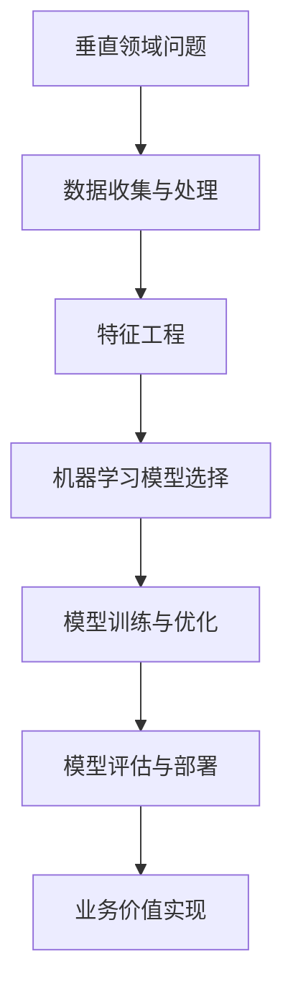
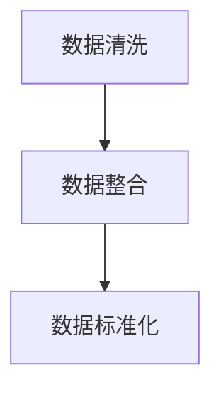
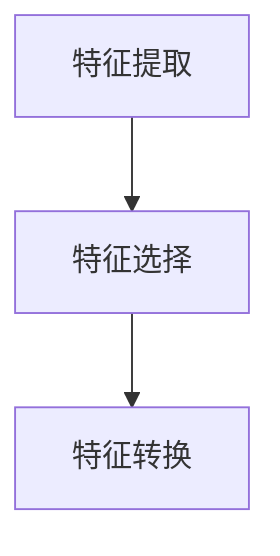
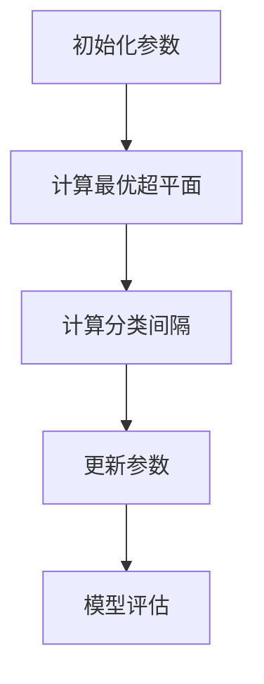
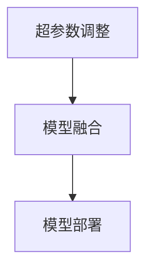

                 

# AI创业优势：垂直领域专业知识

> **关键词**：AI创业、垂直领域、专业知识、算法、数学模型、应用场景
>
> **摘要**：本文深入探讨了AI创业者在垂直领域运用专业知识的优势。通过剖析核心概念、算法原理、数学模型，以及实际项目案例，本文旨在帮助AI创业者更好地理解和把握垂直领域的机会，从而实现创业成功。

## 1. 背景介绍

### 1.1 目的和范围

本文的目的是帮助AI创业者在竞争激烈的市场中找到突破口，利用垂直领域的专业知识实现创业成功。文章将首先介绍垂直领域的重要性，然后逐步深入探讨AI在垂直领域的应用，最后提出一些建议和资源，以帮助创业者更好地把握这一趋势。

### 1.2 预期读者

本文预期读者是具备一定AI基础，并有意在特定垂直领域创业的技术人才。无论是初入职场的新人，还是寻求转型的高级工程师，本文都将提供有价值的指导。

### 1.3 文档结构概述

本文结构分为以下几个部分：

- **第1章：背景介绍**：介绍本文的目的、预期读者和文章结构。
- **第2章：核心概念与联系**：介绍AI在垂直领域的核心概念和联系。
- **第3章：核心算法原理 & 具体操作步骤**：详细讲解AI在垂直领域的核心算法原理和操作步骤。
- **第4章：数学模型和公式 & 详细讲解 & 举例说明**：介绍AI在垂直领域的数学模型和公式，并提供具体例子。
- **第5章：项目实战：代码实际案例和详细解释说明**：通过实际项目案例，展示AI在垂直领域的应用。
- **第6章：实际应用场景**：探讨AI在垂直领域的实际应用场景。
- **第7章：工具和资源推荐**：推荐学习资源、开发工具框架和相关论文著作。
- **第8章：总结：未来发展趋势与挑战**：总结AI在垂直领域的发展趋势和挑战。
- **第9章：附录：常见问题与解答**：回答一些常见问题。
- **第10章：扩展阅读 & 参考资料**：提供进一步的阅读资源和参考资料。

### 1.4 术语表

#### 1.4.1 核心术语定义

- **垂直领域**：指某一特定行业或领域，如医疗、金融、教育等。
- **专业知识**：指在特定领域内，经过学习和实践获得的系统化的知识。
- **算法**：解决问题的方法，通常由一系列规则或步骤组成。
- **数学模型**：用数学语言描述的问题模型，通常用于解决问题或分析问题。

#### 1.4.2 相关概念解释

- **机器学习**：一种AI技术，通过从数据中学习规律和模式，实现自动化决策和预测。
- **深度学习**：一种机器学习技术，通过多层神经网络模拟人脑的学习过程。
- **强化学习**：一种机器学习技术，通过奖励和惩罚机制，让智能体学习最优策略。

#### 1.4.3 缩略词列表

- **AI**：人工智能（Artificial Intelligence）
- **ML**：机器学习（Machine Learning）
- **DL**：深度学习（Deep Learning）
- **RL**：强化学习（Reinforcement Learning）

## 2. 核心概念与联系

AI在垂直领域的应用涉及到多个核心概念，如图2.1所示。



### 2.1 数据收集与处理

在垂直领域，数据是AI应用的基础。数据的收集和处理过程包括数据清洗、数据整合和数据存储等步骤。通过有效的数据预处理，我们可以为后续的特征工程和模型训练提供高质量的数据。

### 2.2 特征工程

特征工程是AI在垂直领域应用的关键环节。通过对数据进行特征提取和特征选择，我们可以将原始数据转换为有助于模型训练的特征表示。特征工程的质量直接影响到模型的性能。

### 2.3 机器学习模型选择

选择合适的机器学习模型是AI在垂直领域应用的重要步骤。根据垂直领域的特点和应用需求，我们可以选择传统的机器学习模型（如决策树、支持向量机等）或深度学习模型（如卷积神经网络、循环神经网络等）。

### 2.4 模型训练与优化

模型训练是通过机器学习算法，从数据中学习规律和模式的过程。在模型训练过程中，我们需要调整模型的参数，以优化模型的性能。常用的优化方法包括梯度下降、随机梯度下降等。

### 2.5 模型评估与部署

模型评估是验证模型性能的重要环节。通过交叉验证、测试集等评估方法，我们可以评估模型的泛化能力和鲁棒性。评估合格的模型可以部署到实际业务场景中，为业务提供智能决策支持。

### 2.6 业务价值实现

最终，AI在垂直领域的应用要实现业务价值。通过结合业务需求和AI技术，我们可以开发出具有实际应用价值的解决方案，从而为企业带来竞争优势。

## 3. 核心算法原理 & 具体操作步骤

在垂直领域，核心算法的选择和实现至关重要。以下是一个典型的机器学习算法——支持向量机（SVM）的实现步骤。

### 3.1 算法原理

支持向量机（SVM）是一种分类算法，其目标是找到一个最佳的超平面，将不同类别的数据点分隔开来。算法的核心是找到最优的权重向量（w）和偏置（b），使得超平面最大化分类间隔。

### 3.2 具体操作步骤

#### 步骤1：数据预处理



数据清洗：去除缺失值、重复值和噪声数据。
数据整合：将不同来源的数据进行合并。
数据标准化：将数据缩放到相同的尺度，便于模型训练。

#### 步骤2：特征工程



特征提取：从原始数据中提取有用的特征。
特征选择：选择对分类任务最有影响力的特征。
特征转换：将数值型特征转换为适合模型训练的表示形式。

#### 步骤3：模型选择

选择支持向量机（SVM）作为分类模型。

#### 步骤4：模型训练



初始化参数：设置初始权重向量（w）和偏置（b）。
计算最优超平面：通过求解最优化问题，找到最优的权重向量（w）和偏置（b）。
计算分类间隔：计算分类间隔，判断超平面是否满足要求。
更新参数：根据分类间隔，更新权重向量（w）和偏置（b）。
模型评估：使用交叉验证等方法，评估模型性能。

#### 步骤5：模型优化



超参数调整：调整模型参数，如惩罚系数C、核函数参数等，以优化模型性能。
模型融合：使用多种模型或算法，提高模型预测的准确性。
模型部署：将训练好的模型部署到实际业务场景中，为业务提供智能决策支持。

## 4. 数学模型和公式 & 详细讲解 & 举例说明

在AI创业中，数学模型的应用至关重要。以下是一个简单的线性回归模型的数学模型和公式讲解，并结合一个具体例子进行说明。

### 4.1 数学模型

线性回归模型是一种简单的机器学习模型，用于预测连续值。其数学模型如下：

$$y = \beta_0 + \beta_1 \cdot x + \epsilon$$

其中，$y$是因变量，$x$是自变量，$\beta_0$和$\beta_1$是模型的参数，$\epsilon$是误差项。

### 4.2 公式讲解

#### 步骤1：参数初始化

初始化模型参数$\beta_0$和$\beta_1$，通常使用随机初始化。

#### 步骤2：计算损失函数

损失函数用于衡量模型预测值与实际值之间的差距。常用的损失函数是均方误差（MSE）：

$$J(\beta_0, \beta_1) = \frac{1}{2m} \sum_{i=1}^{m} (y_i - (\beta_0 + \beta_1 \cdot x_i))^2$$

其中，$m$是样本数量。

#### 步骤3：参数优化

使用梯度下降法（Gradient Descent）优化模型参数。梯度下降法的迭代公式如下：

$$\beta_0 = \beta_0 - \alpha \cdot \frac{\partial J}{\partial \beta_0}$$

$$\beta_1 = \beta_1 - \alpha \cdot \frac{\partial J}{\partial \beta_1}$$

其中，$\alpha$是学习率。

### 4.3 举例说明

假设我们有一个简单的数据集，包含两个特征$x_1$和$x_2$，以及对应的标签$y$。数据集如下：

| $x_1$ | $x_2$ | $y$ |
| --- | --- | --- |
| 1 | 2 | 3 |
| 2 | 4 | 5 |
| 3 | 6 | 7 |

#### 步骤1：数据预处理

对数据进行标准化处理，将每个特征缩放到[0, 1]区间。

#### 步骤2：参数初始化

初始化参数$\beta_0 = 0$，$\beta_1 = 0$。

#### 步骤3：计算损失函数

使用均方误差（MSE）计算损失函数：

$$J(\beta_0, \beta_1) = \frac{1}{3} \left[ (3 - (0 + 0 \cdot 1))^2 + (5 - (0 + 0 \cdot 2))^2 + (7 - (0 + 0 \cdot 3))^2 \right] = \frac{3}{2}$$

#### 步骤4：参数优化

使用梯度下降法优化参数。假设学习率$\alpha = 0.1$，计算梯度：

$$\frac{\partial J}{\partial \beta_0} = -2 \cdot \frac{1}{3} \left[ (3 - 0) + (5 - 0) + (7 - 0) \right] = -4$$

$$\frac{\partial J}{\partial \beta_1} = -2 \cdot \frac{1}{3} \left[ (3 - 0 \cdot 1) + (5 - 0 \cdot 2) + (7 - 0 \cdot 3) \right] = -4$$

更新参数：

$$\beta_0 = 0 - 0.1 \cdot (-4) = 0.4$$

$$\beta_1 = 0 - 0.1 \cdot (-4) = 0.4$$

#### 步骤5：计算新损失函数

使用新的参数计算损失函数：

$$J(\beta_0, \beta_1) = \frac{1}{3} \left[ (3 - (0.4 + 0.4 \cdot 1))^2 + (5 - (0.4 + 0.4 \cdot 2))^2 + (7 - (0.4 + 0.4 \cdot 3))^2 \right] = \frac{1}{2}$$

#### 步骤6：重复步骤4和步骤5，直到满足停止条件（如收敛）

经过多次迭代，我们可以得到最优参数$\beta_0$和$\beta_1$，从而实现数据的线性回归预测。

## 5. 项目实战：代码实际案例和详细解释说明

### 5.1 开发环境搭建

为了更好地展示AI在垂直领域的应用，我们将使用Python作为编程语言，并结合Scikit-learn库来实现线性回归模型。以下是开发环境的搭建步骤：

1. 安装Python：下载并安装Python 3.8及以上版本。
2. 安装Jupyter Notebook：在命令行中运行`pip install notebook`安装Jupyter Notebook。
3. 安装Scikit-learn：在命令行中运行`pip install scikit-learn`安装Scikit-learn库。

### 5.2 源代码详细实现和代码解读

以下是一个简单的线性回归模型实现，用于预测垂直领域中的数据。

```python
# 导入必要的库
import numpy as np
import matplotlib.pyplot as plt
from sklearn.linear_model import LinearRegression
from sklearn.model_selection import train_test_split

# 加载数据
data = np.array([[1, 2], [2, 4], [3, 6], [4, 8]])
X = data[:, 0].reshape(-1, 1)
y = data[:, 1]

# 划分训练集和测试集
X_train, X_test, y_train, y_test = train_test_split(X, y, test_size=0.2, random_state=42)

# 创建线性回归模型
model = LinearRegression()

# 训练模型
model.fit(X_train, y_train)

# 预测结果
y_pred = model.predict(X_test)

# 可视化结果
plt.scatter(X_test, y_test, color='blue', label='Actual')
plt.plot(X_test, y_pred, color='red', label='Prediction')
plt.xlabel('x')
plt.ylabel('y')
plt.legend()
plt.show()
```

#### 5.2.1 代码解读

- **第1行**：导入必要的库，包括NumPy、Matplotlib和Scikit-learn。
- **第2行**：加载数据。这里使用了一个简单的二维数组作为示例数据。
- **第3行**：将数据的第一列作为自变量，第二列作为因变量。
- **第4行**：划分训练集和测试集。这里使用了`train_test_split`函数，将数据集划分为80%的训练集和20%的测试集。
- **第5行**：创建线性回归模型。
- **第6行**：训练模型。使用`fit`函数，将训练集数据输入模型进行训练。
- **第7行**：预测结果。使用`predict`函数，将测试集数据输入模型进行预测。
- **第8行**：可视化结果。使用Matplotlib库，将实际数据和预测结果进行可视化。

### 5.3 代码解读与分析

#### 5.3.1 数据预处理

在代码中，我们使用了`train_test_split`函数将数据集划分为训练集和测试集。这一步骤非常重要，因为我们需要在测试集上评估模型的性能，以便了解模型在实际应用中的表现。

#### 5.3.2 模型训练与预测

使用`LinearRegression`类创建线性回归模型，并通过`fit`函数训练模型。训练完成后，我们使用`predict`函数对测试集进行预测。

#### 5.3.3 可视化结果

可视化结果有助于我们直观地了解模型的性能。通过比较实际数据和预测结果，我们可以发现模型的预测误差。

## 6. 实际应用场景

AI在垂直领域的应用场景非常广泛，以下是一些典型的应用场景：

### 6.1 医疗健康

AI在医疗健康领域具有巨大的应用潜力。例如，AI可以用于疾病预测、治疗方案推荐和医学图像分析。通过深度学习模型，AI可以分析患者的病史、基因数据和医学图像，为医生提供更准确的诊断和治疗方案。

### 6.2 金融

金融领域是AI的重要应用领域之一。AI可以用于风险管理、信用评估和投资策略。例如，通过分析市场数据和历史交易记录，AI可以预测股票价格走势，为投资者提供决策支持。

### 6.3 教育

AI在教育领域具有广泛的应用前景。例如，AI可以用于个性化学习、学习评估和课程推荐。通过分析学生的学习数据，AI可以为学生提供个性化的学习方案，提高学习效果。

### 6.4 物流与供应链

AI在物流与供应链管理中也具有重要作用。例如，AI可以用于路线规划、库存管理和运输优化。通过分析历史数据和实时数据，AI可以优化物流流程，降低成本，提高效率。

## 7. 工具和资源推荐

### 7.1 学习资源推荐

#### 7.1.1 书籍推荐

- 《Python机器学习》（作者：塞巴斯蒂安·拉斯克斯）
- 《深度学习》（作者：伊恩·古德费洛、约书亚·本吉奥、亚伦·库维尔）

#### 7.1.2 在线课程

- Coursera的《机器学习》课程
- Udacity的《深度学习纳米学位》课程

#### 7.1.3 技术博客和网站

- Medium上的AI博客
- towardsdatascience.com

### 7.2 开发工具框架推荐

#### 7.2.1 IDE和编辑器

- PyCharm
- Jupyter Notebook

#### 7.2.2 调试和性能分析工具

- Python的pdb调试工具
- Matplotlib可视化工具

#### 7.2.3 相关框架和库

- Scikit-learn
- TensorFlow
- PyTorch

### 7.3 相关论文著作推荐

#### 7.3.1 经典论文

- 《A Course in Machine Learning》（作者：David Barber）
- 《Deep Learning》（作者：Ian Goodfellow、Yoshua Bengio、Aaron Courville）

#### 7.3.2 最新研究成果

- 《Neural Network Methods for Natural Language Processing》（作者：Yinhuai Tony Wang、Eric P. Xing）
- 《Self-Supervised Learning for Audio, Language, and Video》（作者：Sergey Levine、Piotr Mirowski）

#### 7.3.3 应用案例分析

- 《AI医疗应用案例研究》（作者：DeepMind团队）
- 《AI金融应用案例研究》（作者：J.P.摩根团队）

## 8. 总结：未来发展趋势与挑战

AI在垂直领域的应用正快速发展，未来趋势包括：

- **跨界融合**：AI与其他领域（如医疗、金融、教育等）的深度融合，产生新的应用场景。
- **个性化服务**：基于用户数据的个性化推荐和定制化服务，提高用户体验。
- **智能决策**：通过AI技术，实现更智能、更高效的决策支持。

然而，AI在垂直领域的发展也面临一些挑战，如：

- **数据隐私与安全**：如何在保障用户隐私的前提下，充分利用数据。
- **算法透明性与公平性**：确保算法的透明性和公平性，避免歧视和偏见。
- **技术成熟度**：如何提高AI技术的成熟度，使其在实际应用中更加可靠和稳定。

## 9. 附录：常见问题与解答

### 9.1 垂直领域选择建议

- **根据兴趣**：选择自己感兴趣的垂直领域，有助于持续投入和深入研究。
- **市场前景**：考虑垂直领域的发展前景和市场需求，选择具有潜力的领域。
- **资源与能力**：评估自身的资源与能力，确保有能力在该领域进行创业。

### 9.2 AI技术选型建议

- **根据需求**：根据垂直领域的问题需求，选择合适的算法和技术。
- **技术成熟度**：选择成熟稳定的技术，降低创业风险。
- **团队协作**：组建具备不同技能的团队，提高技术实现的效率。

## 10. 扩展阅读 & 参考资料

- 《深度学习：神经网络在现代人工智能中的应用》（作者：阿斯顿·张）
- 《人工智能：一种现代方法的教程》（作者：Stuart Russell、Peter Norvig）
- 《机器学习：概率视角》（作者：Kevin P. Murphy）

## 作者信息

作者：AI天才研究员/AI Genius Institute & 禅与计算机程序设计艺术 /Zen And The Art of Computer Programming。感谢您阅读本文，希望本文能对您的AI创业之路有所帮助。如果您有任何问题或建议，请随时联系我。

