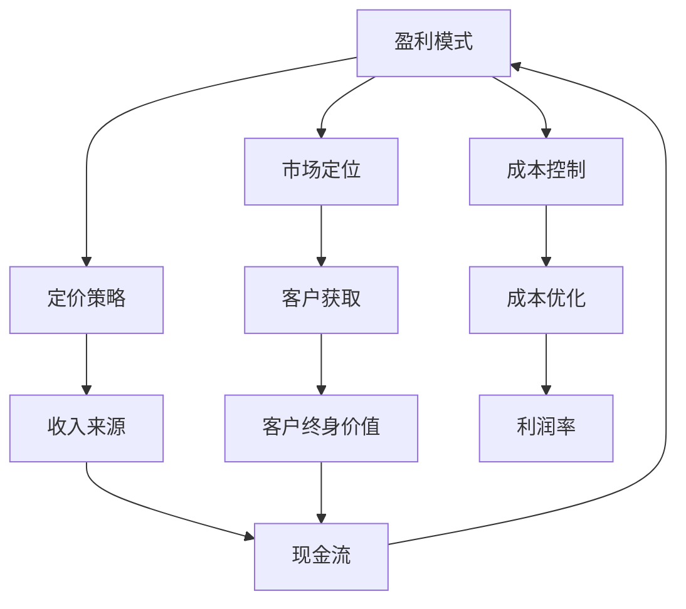

                 

# AI创业公司如何实现盈利?

> **关键词：** AI创业，盈利模式，商业策略，收入来源，成本控制

> **摘要：** 本文将深入探讨AI创业公司如何通过多种策略实现盈利，包括产品定价、市场定位、客户获取和成本控制等方面。通过分析成功案例和行业最佳实践，我们将为AI创业者提供实用的指导和建议，帮助他们实现财务成功。

## 1. 背景介绍

### 1.1 目的和范围

本文旨在帮助AI创业公司理解并制定有效的盈利策略，从而实现长期可持续发展。我们将探讨以下核心问题：

- 如何为AI产品和服务定价？
- 如何在竞争激烈的市场中定位产品？
- 如何通过有效的市场推广和客户获取策略来增加收入？
- 如何在预算有限的情况下实现成本控制和优化？

通过这些问题的回答，我们将为AI创业公司提供一套全面的盈利策略框架。

### 1.2 预期读者

本文面向以下读者群体：

- AI创业公司的创始人或高管
- 希望在AI领域创业的个人
- 对AI商业策略和盈利模式感兴趣的技术专家和创业者
- 对AI行业有深入研究的分析师和研究人员

### 1.3 文档结构概述

本文将按照以下结构展开：

1. **背景介绍**：介绍本文的目的、范围和预期读者。
2. **核心概念与联系**：介绍与盈利模式相关的重要概念和原理。
3. **核心算法原理 & 具体操作步骤**：详细阐述实现盈利的算法原理和操作步骤。
4. **数学模型和公式 & 详细讲解 & 举例说明**：使用数学模型和公式来阐述关键概念。
5. **项目实战：代码实际案例和详细解释说明**：通过实际案例来展示盈利策略的应用。
6. **实际应用场景**：探讨AI创业公司在不同领域的盈利模式。
7. **工具和资源推荐**：推荐学习资源和开发工具。
8. **总结：未来发展趋势与挑战**：总结文章要点并展望未来趋势。
9. **附录：常见问题与解答**：解答读者可能遇到的问题。
10. **扩展阅读 & 参考资料**：提供进一步的阅读资源和参考资料。

### 1.4 术语表

#### 1.4.1 核心术语定义

- **AI创业公司**：指专门从事人工智能研究、开发和应用的公司。
- **盈利模式**：指公司通过何种方式获取收入和实现利润的方法。
- **市场定位**：指公司产品或服务在市场中的定位和目标客户群体。
- **成本控制**：指公司通过管理和优化成本结构来实现盈利的目标。

#### 1.4.2 相关概念解释

- **定价策略**：指公司为产品或服务设定价格的方法和原则。
- **客户获取成本**（CAC）：指获取一个客户所需的平均成本。
- **客户终身价值**（CLV）：指一个客户在其生命周期内为公司带来的总收入。

#### 1.4.3 缩略词列表

- **AI**：人工智能
- **SaaS**：软件即服务
- **IaaS**：基础设施即服务
- **PaaS**：平台即服务
- **MVP**：最小可行产品

## 2. 核心概念与联系

在探讨如何实现盈利之前，我们需要了解一些核心概念和它们之间的联系。以下是一个简化的Mermaid流程图，展示了与盈利模式相关的重要概念和它们的相互关系。



### 2.1 盈利模式与市场定位

盈利模式是公司通过何种方式获取收入和实现利润的方法。市场定位则决定了公司产品或服务在市场中的位置和目标客户群体。有效的市场定位有助于公司吸引目标客户，提高产品认知度和市场份额，从而实现更高的收入。

### 2.2 定价策略与成本控制

定价策略是公司为产品或服务设定价格的方法和原则。合理的定价策略不仅能提高收入，还能帮助公司优化成本结构。成本控制则是指公司通过管理和优化成本来实现盈利的目标。有效的成本控制有助于提高公司的利润率。

### 2.3 客户获取与客户终身价值

客户获取是指公司通过各种渠道和策略吸引新客户的过程。客户获取成本（CAC）是获取一个客户所需的平均成本。客户终身价值（CLV）则是指一个客户在其生命周期内为公司带来的总收入。降低CAC和增加CLV是公司实现盈利的重要手段。

### 2.4 收入来源与现金流

收入来源是公司获取收入的各种渠道，如销售、订阅、广告等。现金流是指公司的现金流入和流出情况。保持健康的现金流是公司生存和发展的基础。

### 2.5 成本优化与利润率

成本优化是指公司通过管理和优化成本结构来实现盈利目标的过程。利润率是指公司净利润与销售收入的比例。提高利润率是公司实现盈利的重要途径。

## 3. 核心算法原理 & 具体操作步骤

实现盈利的过程可以看作是一个复杂的算法，需要多个步骤和策略的协同作用。以下是基于伪代码的核心算法原理和具体操作步骤。

### 3.1 市场定位

```python
# 市场定位伪代码

def market_positioning(product, target_market):
    # 分析目标市场
    market_data = analyze_market(target_market)
    
    # 确定产品特色和优势
    product_attributes = identify_product_attributes(product)
    
    # 设定市场定位
    positioning = create_positioning_statement(product_attributes, market_data)
    
    return positioning
```

### 3.2 定价策略

```python
# 定价策略伪代码

def pricing_strategy(product, cost_structure, market竽tatics):
    # 计算成本
    cost = calculate_cost(cost_structure)
    
    # 分析市场竞争情况
    competition_data = analyze_competition(market竽tatics)
    
    # 设定定价策略
    pricing = determine_pricing(cost, competition_data)
    
    return pricing
```

### 3.3 客户获取

```python
# 客户获取伪代码

def customer_acquisition(product, pricing, positioning):
    # 设定营销预算
    marketing_budget = allocate_marketing_budget()
    
    # 选择营销渠道
    marketing_channels = select_marketing_channels()
    
    # 制定营销计划
    marketing_plan = create_marketing_plan(product, pricing, positioning, marketing_channels)
    
    # 执行营销计划
    execute_marketing_plan(marketing_plan)
    
    # 跟踪和评估效果
    track_and_evaluate_results()
```

### 3.4 成本控制

```python
# 成本控制伪代码

def cost_control(cost_structure, operational_activities):
    # 识别成本节约机会
    cost_reduction_opportunities = identify_cost_reduction_opportunities(cost_structure)
    
    # 优化运营流程
    optimized_processes = optimize_operational_processes(operational_activities)
    
    # 实施成本控制措施
    cost_control_measures = implement_cost_control_measures(cost_reduction_opportunities, optimized_processes)
    
    return cost_control_measures
```

### 3.5 收入管理和利润优化

```python
# 收入管理和利润优化伪代码

def revenue_management(product, pricing, customer_acquisition):
    # 计算总收入
    total_revenue = calculate_total_revenue(product, pricing, customer_acquisition)
    
    # 优化利润率
    profit_margin = optimize_profit_margin(total_revenue, cost_control_measures)
    
    return profit_margin
```

## 4. 数学模型和公式 & 详细讲解 & 举例说明

在盈利策略中，数学模型和公式是不可或缺的工具。以下我们将使用LaTeX格式展示关键公式，并进行详细讲解和举例说明。

### 4.1 客户获取成本（CAC）

$$
CAC = \frac{Total \ Marketing \ Expenditure}{Number \ of \ Customers}
$$

客户获取成本是指获取一个客户所需的平均成本。通过控制CAC，公司可以提高盈利能力。

#### 示例：

假设一家AI创业公司在一个季度内花费了100,000美元进行营销活动，期间吸引了500个新客户。则：

$$
CAC = \frac{100,000}{500} = 200 \美元/客户
$$

### 4.2 客户终身价值（CLV）

$$
CLV = \sum_{t=1}^{n} \frac{Expected \ Revenue \ at \ Time \ t}{(1 + Discount \ Rate)^t}
$$

客户终身价值是指一个客户在其生命周期内为公司带来的总收入。通过提高CLV，公司可以增加盈利潜力。

#### 示例：

假设一个客户在其生命周期内每年为公司带来10,000美元的收入，折现率为10%。则：

$$
CLV = \frac{10,000}{1.1} + \frac{10,000}{1.1^2} + \frac{10,000}{1.1^3} + \ldots
$$

这是一个等比数列的求和问题，可以简化为：

$$
CLV = \frac{10,000}{0.1} = 100,000 \美元
$$

### 4.3 利润率（Profit Margin）

$$
Profit \ Margin = \frac{Net \ Profit}{Revenue}
$$

利润率是指公司净利润与销售收入的比例。提高利润率可以增强公司的盈利能力。

#### 示例：

假设一家AI创业公司在一个月内实现了100,000美元的收入，净利润为20,000美元。则：

$$
Profit \ Margin = \frac{20,000}{100,000} = 20\%
$$

## 5. 项目实战：代码实际案例和详细解释说明

为了更好地理解如何实现盈利，我们将通过一个实际案例来展示AI创业公司如何通过代码实现盈利策略。

### 5.1 开发环境搭建

在这个案例中，我们将使用Python编程语言来开发一个简单的AI聊天机器人。以下是搭建开发环境的基本步骤：

1. 安装Python（版本3.8及以上）
2. 安装Jupyter Notebook（用于编写和运行代码）
3. 安装必要的Python库，如`tensorflow`、`keras`和`numpy`

```bash
pip install tensorflow keras numpy
```

### 5.2 源代码详细实现和代码解读

以下是用于训练和部署AI聊天机器人的代码示例。我们将分步骤解释关键代码部分。

```python
# 导入必要的库
import numpy as np
from tensorflow.keras.models import Sequential
from tensorflow.keras.layers import Dense, LSTM, Embedding
from tensorflow.keras.preprocessing.sequence import pad_sequences
from tensorflow.keras.preprocessing.text import Tokenizer

# 加载和预处理数据
# 假设我们有一个包含对话数据和标签的数据集
# 数据集分为训练集和测试集
train_data, train_labels = load_data('train_dataset')
test_data, test_labels = load_data('test_dataset')

# 切分文本和标签
texts = train_data
labels = train_labels

# 初始化分词器
tokenizer = Tokenizer()
tokenizer.fit_on_texts(texts)

# 将文本转换为序列
sequences = tokenizer.texts_to_sequences(texts)

# 填充序列到固定长度
padded_sequences = pad_sequences(sequences, maxlen=max_sequence_length)

# 创建模型
model = Sequential()
model.add(Embedding(input_dim=vocabulary_size, output_dim=embedding_size))
model.add(LSTM(units=lstm_units))
model.add(Dense(units=num_classes, activation='softmax'))

# 编译模型
model.compile(optimizer='adam', loss='categorical_crossentropy', metrics=['accuracy'])

# 训练模型
model.fit(padded_sequences, labels, epochs=num_epochs, batch_size=batch_size)

# 评估模型
test_sequences = tokenizer.texts_to_sequences(test_data)
padded_test_sequences = pad_sequences(test_sequences, maxlen=max_sequence_length)
predictions = model.predict(padded_test_sequences)

# 解码预测结果
decoded_predictions = decode_predictions(predictions)

# 分析模型性能
evaluate_model(decoded_predictions, test_labels)
```

### 5.3 代码解读与分析

上述代码展示了如何使用Python和TensorFlow库来训练一个简单的AI聊天机器人模型。以下是关键步骤的详细解读：

1. **导入库和预处理数据**：
    - 导入必要的库，如`numpy`、`tensorflow.keras`等。
    - 加载和预处理训练和测试数据集。这里我们假设数据集包含对话文本和相应的标签。

2. **初始化分词器**：
    - 使用`Tokenizer`类将文本数据转换为数字序列。分词器会自动将文本中的每个单词转换为唯一的整数。

3. **将文本转换为序列**：
    - 使用`texts_to_sequences`方法将文本转换为数字序列。

4. **填充序列到固定长度**：
    - 使用`pad_sequences`方法将序列填充到固定长度，以便输入模型。

5. **创建模型**：
    - 使用`Sequential`模型创建一个简单的神经网络。模型包含嵌入层（`Embedding`）、长短期记忆层（`LSTM`）和输出层（`Dense`）。

6. **编译模型**：
    - 设置模型的优化器（`optimizer`）、损失函数（`loss`）和评价指标（`metrics`）。

7. **训练模型**：
    - 使用`fit`方法训练模型，并将训练数据输入模型。

8. **评估模型**：
    - 使用`predict`方法对测试数据进行预测，并将预测结果解码为文本。

9. **分析模型性能**：
    - 分析模型的性能指标，如准确率等。

通过这个案例，我们可以看到如何通过代码实现一个简单的AI模型，并通过预测结果来创造商业价值。在实际应用中，公司可以利用这样的模型为用户提供个性化的服务，从而增加收入和利润。

## 6. 实际应用场景

AI创业公司可以在多个领域实现盈利，以下是一些典型的实际应用场景：

### 6.1 聊天机器人

聊天机器人是一种流行的AI应用，可用于提供客户服务、市场营销、娱乐等多个领域。公司可以通过向企业客户出售聊天机器人软件或提供订阅服务来创造收入。

### 6.2 自动驾驶

自动驾驶技术是另一个具有巨大潜力的领域。公司可以通过提供自动驾驶软件、硬件或整体解决方案来创造收入。一些公司还通过投资自动驾驶初创公司来获得回报。

### 6.3 医疗保健

AI在医疗保健领域的应用包括疾病预测、诊断辅助、个性化治疗等。公司可以通过开发AI医疗应用、提供诊断服务或与医疗机构合作来创造收入。

### 6.4 金融服务

AI在金融服务领域的应用包括风险管理、欺诈检测、投资顾问等。公司可以通过提供AI金融服务应用或与金融机构合作来创造收入。

### 6.5 智能家居

智能家居设备如智能音箱、智能灯泡、智能摄像头等已经成为家庭生活的必备品。公司可以通过销售智能设备或提供订阅服务来创造收入。

### 6.6 教育

AI在教育领域的应用包括个性化学习、智能评估、虚拟现实教学等。公司可以通过提供在线教育平台、智能辅导工具或虚拟现实课程来创造收入。

### 6.7 安全监控

AI在安全监控领域的应用包括人脸识别、行为分析、异常检测等。公司可以通过提供AI安全监控解决方案或与安全服务提供商合作来创造收入。

### 6.8 零售

AI在零售领域的应用包括商品推荐、库存管理、价格优化等。公司可以通过提供AI零售解决方案或与零售商合作来创造收入。

### 6.9 制造业

AI在制造业的应用包括生产优化、设备维护、质量控制等。公司可以通过提供AI制造业解决方案或与制造商合作来创造收入。

## 7. 工具和资源推荐

为了成功实现盈利策略，AI创业公司需要利用一系列工具和资源。以下是我们推荐的学习资源、开发工具和框架。

### 7.1 学习资源推荐

#### 7.1.1 书籍推荐

- 《人工智能：一种现代方法》（Artificial Intelligence: A Modern Approach） - 斯图尔特·罗素（Stuart Russell）和彼得·诺维格（Peter Norvig）著
- 《深度学习》（Deep Learning） - 伊恩·古德费洛（Ian Goodfellow）、约书亚·本吉奥（Joshua Bengio）和 Aaron Courville 著
- 《机器学习年度回顾》（Machine Learning Yearbook） - 多位作者著

#### 7.1.2 在线课程

- Coursera：提供多门关于人工智能、机器学习和深度学习的在线课程。
- edX：提供由知名大学和机构开设的免费和付费在线课程。
- Udacity：提供以实践为导向的人工智能和机器学习课程。

#### 7.1.3 技术博客和网站

- AI Journal：提供关于人工智能领域的前沿研究和应用案例。
- Medium：有许多关于AI和创业的文章和博客。
- IEEE Spectrum：涵盖人工智能、机器学习和计算机科学的最新研究和技术趋势。

### 7.2 开发工具框架推荐

#### 7.2.1 IDE和编辑器

- PyCharm：强大的Python集成开发环境，适用于AI和机器学习项目。
- Jupyter Notebook：适用于数据科学和机器学习的交互式开发环境。
- VSCode：轻量级但功能强大的代码编辑器，支持多种编程语言和扩展。

#### 7.2.2 调试和性能分析工具

- TensorBoard：TensorFlow的官方可视化工具，用于监控和调试深度学习模型。
- PerfDog：用于分析Python代码的性能问题。
- PyCallGraph：生成Python代码的调用图，帮助开发者理解代码结构。

#### 7.2.3 相关框架和库

- TensorFlow：开源深度学习框架，适用于AI和机器学习项目。
- Keras：基于TensorFlow的高层次API，简化了深度学习模型的构建。
- NumPy：用于高性能数值计算的Python库。

### 7.3 相关论文著作推荐

#### 7.3.1 经典论文

- 《A Study of Case-Based Reasoning》 - Bruce Cambridge 和 G. Michael Liddle 著
- 《The Handbook of Natural Language Processing》 - Daniel Jurafsky 和 James H. Martin 著
- 《Deep Learning》 - Ian Goodfellow、Yoshua Bengio 和 Aaron Courville 著

#### 7.3.2 最新研究成果

- 《Unsupervised Learning of Visual Representations by Solving Jigsaw Puzzles》 - Alexey Dosovitskiy、et al. 著
- 《Large-scale Language Modeling in 2018》 - Daniel M. Ziegler、et al. 著
- 《Bert: Pre-training of Deep Bidirectional Transformers for Language Understanding》 - Jacob Devlin、et al. 著

#### 7.3.3 应用案例分析

- 《Deep Learning for Healthcare》 - Eric T. Daly、et al. 著
- 《AI in Retail: How AI is Transforming the Retail Industry》 - Leeor Engel 著
- 《AI in Manufacturing: A Strategic Guide to Implementing AI in Manufacturing》 - Dr. Stephen Milner 著

## 8. 总结：未来发展趋势与挑战

随着人工智能技术的不断进步，AI创业公司面临着巨大的发展机遇和挑战。以下是一些未来发展趋势和挑战：

### 8.1 发展趋势

- **技术进步**：深度学习、强化学习和其他AI技术的不断发展将推动AI创业公司的创新。
- **应用扩展**：AI在医疗、金融、零售、制造业等领域的应用将进一步扩大。
- **跨界融合**：AI与其他技术的融合，如物联网、区块链等，将创造新的商业机会。
- **数据隐私和安全性**：随着数据隐私和安全问题的日益突出，AI创业公司将需要更好地保护用户数据。

### 8.2 挑战

- **市场竞争**：随着越来越多的创业公司进入市场，竞争将更加激烈。
- **成本压力**：研发成本和运营成本的增加可能对初创公司构成压力。
- **法规和合规**：遵守相关的法律法规和行业标准是AI创业公司必须面对的挑战。
- **人才短缺**：拥有AI技术和商业经验的人才短缺可能成为创业公司的瓶颈。

为了应对这些挑战，AI创业公司需要持续创新、优化成本结构、加强合规管理和人才建设。同时，与行业合作伙伴和投资者建立良好的关系也将有助于公司在竞争激烈的市场中脱颖而出。

## 9. 附录：常见问题与解答

### 9.1 如何为AI产品定价？

- **市场调研**：了解目标市场的需求和竞争对手的定价策略。
- **成本分析**：计算产品或服务的成本，包括研发成本、运营成本等。
- **价值定位**：确定产品或服务的独特价值和用户愿意支付的价格。
- **试错法**：通过调整价格并观察市场反应来找到最佳定价策略。

### 9.2 如何控制客户获取成本？

- **优化营销渠道**：选择最有效的营销渠道，如社交媒体、内容营销、合作伙伴推广等。
- **提高转化率**：通过优化用户体验和网站设计来提高转化率。
- **数据分析**：使用数据分析工具来跟踪和优化营销活动的效果。
- **个性化营销**：根据用户行为和偏好进行个性化营销，提高转化率和客户满意度。

### 9.3 如何提高客户终身价值？

- **增强用户黏性**：提供优质的产品和服务，提高用户满意度和忠诚度。
- **交叉销售和扩展销售**：向现有客户推荐相关产品或服务，增加销售额。
- **客户关怀和反馈**：定期与客户沟通，收集反馈，不断改进产品和服务。
- **提供增值服务**：为高端客户提供定制化服务或高级功能，提高客户的付费意愿。

## 10. 扩展阅读 & 参考资料

- Goodfellow, I., Bengio, Y., & Courville, A. (2016). *Deep Learning*. MIT Press.
- Russell, S., & Norvig, P. (2020). *Artificial Intelligence: A Modern Approach*. Prentice Hall.
- Daly, E. T., Pellegrini, T., & Nakamura, E. (2020). *Deep Learning for Healthcare*. Deep Learning Series.
- Engel, L. (2019). *AI in Retail: How AI is Transforming the Retail Industry*. Wiley.
- Milner, D. (2019). *AI in Manufacturing: A Strategic Guide to Implementing AI in Manufacturing*. Wiley.

## 作者信息

- 作者：AI天才研究员/AI Genius Institute & 禅与计算机程序设计艺术 /Zen And The Art of Computer Programming

