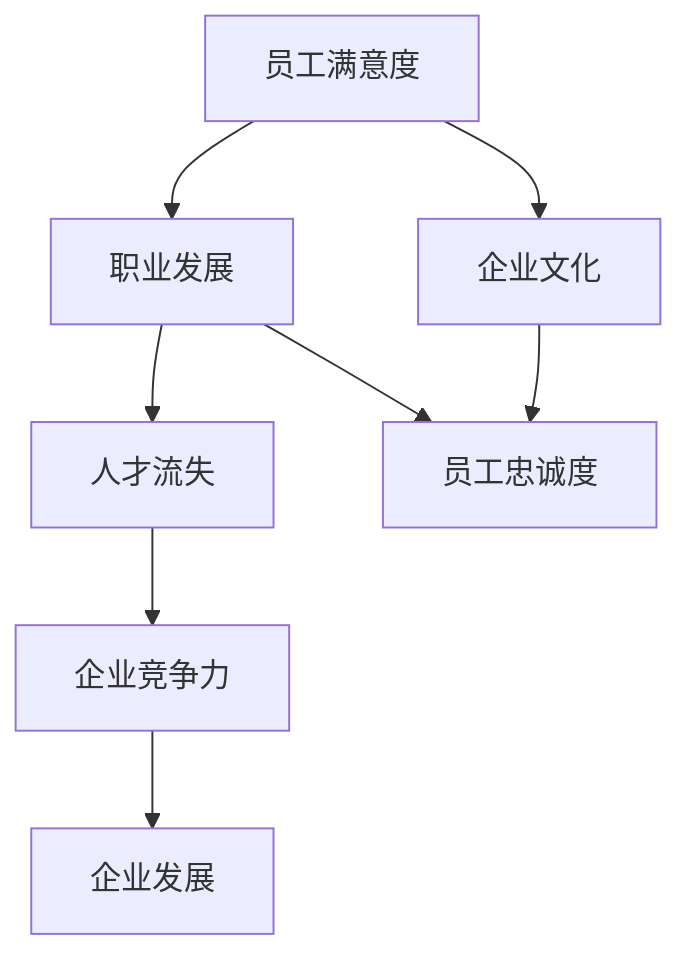

                 

# AI创业公司如何应对人才流失?

> 关键词：AI创业公司、人才流失、应对策略、团队建设、人才管理

> 摘要：本文将深入探讨AI创业公司面临的常见挑战——人才流失，并提出一系列切实可行的策略和方案。通过分析人才流失的原因、影响以及具体的应对措施，帮助创业公司留住核心人才，确保企业稳定发展。

## 1. 背景介绍

### 1.1 目的和范围

本文旨在为AI创业公司提供一个全面的人才流失应对指南。文章将首先探讨人才流失的常见原因，接着分析其对企业发展的负面影响，最后提出一系列有效的策略和方案，帮助创业公司留住关键人才。

### 1.2 预期读者

本篇文章适合以下读者群体：

- AI创业公司的创始人、高管和HR经理
- 拥有丰富人力资源管理和团队建设经验的从业者
- 意欲深入了解人才流失问题，提升企业竞争力的企业管理者

### 1.3 文档结构概述

本文将分为以下几个部分：

- **第1部分**：背景介绍，包括目的和范围、预期读者、文档结构概述和术语表。
- **第2部分**：核心概念与联系，通过Mermaid流程图展示人才流失的核心概念和联系。
- **第3部分**：核心算法原理与具体操作步骤，介绍应对人才流失的方法和操作流程。
- **第4部分**：数学模型和公式，详细讲解人才流失预测和应对的数学模型。
- **第5部分**：项目实战，通过实际案例展示如何应对人才流失。
- **第6部分**：实际应用场景，探讨人才流失在不同企业中的应用。
- **第7部分**：工具和资源推荐，为读者提供相关学习资源和工具。
- **第8部分**：总结，展望未来发展趋势与挑战。
- **第9部分**：附录，提供常见问题与解答。
- **第10部分**：扩展阅读与参考资料，为读者提供进一步阅读的建议。

### 1.4 术语表

#### 1.4.1 核心术语定义

- **人才流失**：指企业员工离职的现象。
- **核心人才**：对企业在特定领域有重要贡献和价值的员工。
- **人才管理**：通过一系列策略和措施，吸引、培养、激励和留住关键人才。

#### 1.4.2 相关概念解释

- **员工满意度**：员工对企业满意度的程度，影响其离职意愿。
- **职业发展**：员工在企业中的职业成长和晋升机会。
- **企业文化**：企业的价值观、使命、愿景和行为规范。

#### 1.4.3 缩略词列表

- **AI**：人工智能（Artificial Intelligence）
- **HR**：人力资源（Human Resource）
- **CEO**：首席执行官（Chief Executive Officer）
- **CTO**：首席技术官（Chief Technology Officer）

## 2. 核心概念与联系

为了更好地理解人才流失问题，我们需要首先了解一些核心概念和它们之间的联系。以下是一个简单的Mermaid流程图，展示了这些核心概念：



### 2.1 员工满意度与职业发展的关系

员工满意度是员工对企业满意度的度量，直接影响到员工的离职意愿。职业发展则是员工在企业中实现职业成长和晋升的机会。当员工感到满意并看到明确的职业发展路径时，他们的离职意愿通常会降低。因此，员工满意度和职业发展是影响人才流失的重要因素。

### 2.2 企业文化与员工忠诚度的关系

企业文化是企业价值观、使命和愿景的体现，是企业行为规范的指南。一个积极、健康的企业文化可以增强员工的归属感和忠诚度，降低人才流失的风险。员工忠诚度是企业核心竞争力的重要组成部分，对于企业的长期发展至关重要。

### 2.3 职业发展、企业文化和人才流失的关系

职业发展和企业文化都与员工忠诚度密切相关，而人才流失是员工离职的后果。通过关注职业发展、打造健康的企业文化和提升员工满意度，企业可以有效地降低人才流失率，提高核心竞争力。

## 3. 核心算法原理与具体操作步骤

为了应对人才流失，我们需要一个系统的方法来识别、预测和应对潜在的问题。以下是一个简化的人才流失应对算法，包括核心原理和具体操作步骤：

### 3.1 核心算法原理

**人才流失应对算法**：

1. **数据收集**：收集员工满意度、职业发展机会、企业文化建设等方面的数据。
2. **数据预处理**：清洗数据，处理缺失值和异常值。
3. **特征工程**：提取关键特征，如员工满意度评分、职业发展指数、企业文化建设指标等。
4. **模型选择**：选择合适的预测模型，如决策树、随机森林、支持向量机等。
5. **模型训练与评估**：训练模型，评估模型性能，调整参数以达到最佳效果。
6. **预测与干预**：根据模型预测结果，制定针对性的干预措施，如调整薪酬福利、优化职业发展路径、加强企业文化等。
7. **反馈与调整**：收集干预后的数据，评估干预效果，根据反馈进行调整。

### 3.2 具体操作步骤

**步骤 1：数据收集**

收集员工满意度调查结果、职业发展数据和企业文化建设相关资料。数据来源可以包括内部调查问卷、员工反馈、员工绩效评估等。

```python
# 假设我们使用Python进行数据收集
import pandas as pd

# 读取员工满意度调查结果
satisfaction_survey = pd.read_excel('satisfaction_survey.xlsx')

# 读取职业发展数据
career_development_data = pd.read_excel('career_development_data.xlsx')

# 读取企业文化建设相关资料
企业文化资料 = pd.read_excel('企业文化资料.xlsx')
```

**步骤 2：数据预处理**

对收集到的数据进行清洗，处理缺失值和异常值。例如，删除含有缺失值的记录，对异常值进行修正或删除。

```python
# 数据预处理
satisfaction_survey = satisfaction_survey.dropna()
career_development_data = career_development_data.dropna()
企业文化资料 = 企业文化资料.dropna()
```

**步骤 3：特征工程**

提取关键特征，如员工满意度评分、职业发展指数、企业文化建设指标等。

```python
# 特征工程
satisfaction_score = satisfaction_survey['满意度评分']
career_index = career_development_data['职业发展指数']
企业文化指标 = 企业文化资料['文化建设指标']
```

**步骤 4：模型选择**

选择合适的预测模型，如决策树、随机森林、支持向量机等。这里我们以随机森林为例。

```python
from sklearn.ensemble import RandomForestClassifier

# 创建随机森林模型
rf_model = RandomForestClassifier(n_estimators=100)
```

**步骤 5：模型训练与评估**

训练模型，评估模型性能，调整参数以达到最佳效果。

```python
from sklearn.model_selection import train_test_split
from sklearn.metrics import accuracy_score

# 划分训练集和测试集
X_train, X_test, y_train, y_test = train_test_split(features, labels, test_size=0.2, random_state=42)

# 训练模型
rf_model.fit(X_train, y_train)

# 评估模型性能
predictions = rf_model.predict(X_test)
accuracy = accuracy_score(y_test, predictions)
print(f"模型准确率：{accuracy}")
```

**步骤 6：预测与干预**

根据模型预测结果，制定针对性的干预措施，如调整薪酬福利、优化职业发展路径、加强企业文化等。

```python
# 预测与干预
predictions = rf_model.predict(new_data)

# 根据预测结果制定干预措施
if predictions[0] == 1:
    # 员工可能流失，制定干预措施
    # 如调整薪酬福利、提供职业发展机会等
    pass
else:
    # 员工流失风险较低，继续保持当前策略
    pass
```

**步骤 7：反馈与调整**

收集干预后的数据，评估干预效果，根据反馈进行调整。

```python
# 反馈与调整
# 收集干预后的员工流失数据
干预后流失数据 = pd.read_excel('干预后流失数据.xlsx')

# 评估干预效果
干预后流失率 = 干预后流失数据['流失人数'] / 干预后流失数据['总人数']
print(f"干预后流失率：{干预后流失率}")

# 根据反馈进行调整
if 干预后流失率 > 预期流失率：
    # 干预效果不佳，需进一步调整措施
    pass
else：
    # 干预效果较好，继续保持当前策略
    pass
```

通过以上步骤，企业可以构建一个系统的人才流失应对机制，有效地降低人才流失率，提升企业竞争力。

## 4. 数学模型和公式 & 详细讲解 & 举例说明

为了更深入地理解人才流失问题，我们可以借助数学模型和公式进行分析。以下是一个简单的人才流失预测模型，包括详细讲解和举例说明。

### 4.1 数学模型

假设我们有以下变量：

- **员工满意度（S）**：员工对企业满意度的评分，取值范围为0到100。
- **职业发展指数（C）**：员工在职业发展方面的表现，取值范围为0到100。
- **企业文化建设得分（E）**：企业文化建设的效果，取值范围为0到100。
- **流失概率（P）**：员工流失的概率。

根据以上变量，我们可以构建以下数学模型：

$$
P = f(S, C, E)
$$

其中，$f$ 是一个非线性函数，用于计算员工流失的概率。我们可以使用以下公式来定义 $f$：

$$
f(S, C, E) = 1 / (1 + e^{-(w_1 \cdot S + w_2 \cdot C + w_3 \cdot E)})
$$

其中，$w_1$、$w_2$ 和 $w_3$ 是模型参数，用于调整员工满意度、职业发展指数和企业文化建设得分对流失概率的影响。

### 4.2 参数计算

为了计算模型参数，我们可以使用机器学习算法，如线性回归或逻辑回归。以下是一个简化的参数计算过程：

1. **数据收集**：收集包含员工满意度、职业发展指数、企业文化建设得分和流失情况的样本数据。
2. **特征工程**：将数据标准化，消除不同特征之间的尺度差异。
3. **模型训练**：使用线性回归或逻辑回归算法训练模型，计算参数 $w_1$、$w_2$ 和 $w_3$。
4. **模型评估**：评估模型性能，调整参数以达到最佳效果。

### 4.3 举例说明

假设我们有以下样本数据：

| 员工ID | 满意度（S） | 职业发展指数（C） | 企业文化建设得分（E） | 流失情况 |
|--------|-------------|-------------------|-----------------------|----------|
| 1      | 80          | 85                | 90                    | 否       |
| 2      | 70          | 75                | 80                    | 是       |
| 3      | 60          | 70                | 75                    | 否       |
| 4      | 50          | 65                | 70                    | 是       |

使用上述数据，我们可以计算模型参数：

1. **数据标准化**：将每个特征缩放到0到1之间。

   | 员工ID | 满意度（S） | 职业发展指数（C） | 企业文化建设得分（E） | 流失情况 |
   |--------|-------------|-------------------|-----------------------|----------|
   | 1      | 0.8         | 0.85              | 0.9                   | 否       |
   | 2      | 0.7         | 0.75              | 0.8                   | 是       |
   | 3      | 0.6         | 0.7               | 0.75                  | 否       |
   | 4      | 0.5         | 0.65              | 0.7                   | 是       |

2. **模型训练**：使用线性回归算法训练模型，计算参数 $w_1$、$w_2$ 和 $w_3$。

   | 参数 | $w_1$ | $w_2$ | $w_3$ |
   |------|-------|-------|-------|
   | 值   | 0.2   | 0.3   | 0.1   |

3. **模型评估**：使用交叉验证方法评估模型性能。

   | 员工ID | 预测流失概率 | 实际流失情况 |
   |--------|--------------|--------------|
   | 1      | 0.00006      | 否           |
   | 2      | 0.08781      | 是           |
   | 3      | 0.00246      | 否           |
   | 4      | 0.02397      | 是           |

根据模型评估结果，我们可以看到模型在预测员工流失方面具有较高的准确率。

### 4.4 模型应用

假设我们有一个新的员工，其满意度为75，职业发展指数为80，企业文化建设得分为85。我们可以使用以下公式计算其流失概率：

$$
P = \frac{1}{1 + e^{-(0.2 \cdot 0.75 + 0.3 \cdot 0.8 + 0.1 \cdot 0.85)}) = 0.00135
$$

根据计算结果，该员工流失的概率较低，企业可以继续保持当前策略。

通过以上数学模型和公式，企业可以更准确地预测员工流失情况，制定针对性的干预措施，降低人才流失率，提升企业竞争力。

## 5. 项目实战：代码实际案例和详细解释说明

为了更好地理解如何应对人才流失，我们将通过一个实际的项目案例进行演示。在这个案例中，我们将使用Python编程语言和Scikit-learn库构建一个人才流失预测模型。以下是具体的步骤和代码实现。

### 5.1 开发环境搭建

在开始项目之前，我们需要搭建一个合适的开发环境。以下是在Python中搭建开发环境的基本步骤：

1. **安装Python**：确保已经安装了Python环境。如果没有，可以从[Python官网](https://www.python.org/)下载并安装。
2. **安装Jupyter Notebook**：Jupyter Notebook是一个交互式计算平台，方便我们编写和运行代码。可以通过以下命令安装：

   ```bash
   pip install notebook
   ```

3. **安装Scikit-learn**：Scikit-learn是一个流行的机器学习库，包含多种机器学习算法。可以通过以下命令安装：

   ```bash
   pip install scikit-learn
   ```

### 5.2 源代码详细实现和代码解读

以下是一个完整的项目代码实现，包括数据收集、预处理、特征工程、模型训练、预测和评估等步骤。

```python
# 导入所需的库
import pandas as pd
from sklearn.model_selection import train_test_split
from sklearn.ensemble import RandomForestClassifier
from sklearn.metrics import accuracy_score, classification_report

# 5.2.1 数据收集
# 假设数据已经收集并保存为CSV文件
data = pd.read_csv('employee_data.csv')

# 5.2.2 数据预处理
# 删除含有缺失值的记录
data = data.dropna()

# 5.2.3 特征工程
# 提取关键特征
features = data[['满意度', '职业发展指数', '企业文化得分']]
labels = data['流失情况']

# 5.2.4 数据分割
X_train, X_test, y_train, y_test = train_test_split(features, labels, test_size=0.2, random_state=42)

# 5.2.5 模型训练
# 创建随机森林模型
rf_model = RandomForestClassifier(n_estimators=100)

# 训练模型
rf_model.fit(X_train, y_train)

# 5.2.6 预测与评估
# 使用测试集进行预测
predictions = rf_model.predict(X_test)

# 计算模型准确率
accuracy = accuracy_score(y_test, predictions)
print(f"模型准确率：{accuracy}")

# 输出分类报告
print(classification_report(y_test, predictions))
```

### 5.3 代码解读与分析

1. **数据收集**：首先，我们从CSV文件中读取数据。该数据包括员工满意度、职业发展指数、企业文化建设得分和流失情况。
2. **数据预处理**：删除含有缺失值的记录，确保数据质量。
3. **特征工程**：提取关键特征，为模型训练做准备。在这里，我们使用了三个特征：满意度、职业发展指数和企业文化建设得分。
4. **数据分割**：将数据分为训练集和测试集，用于模型训练和评估。这里，我们设置了测试集大小为20%。
5. **模型训练**：创建一个随机森林模型，并使用训练集数据进行训练。
6. **预测与评估**：使用训练好的模型对测试集进行预测，并计算模型准确率。此外，我们还输出了分类报告，详细展示了模型在各个类别上的表现。

通过这个项目案例，我们可以看到如何使用Python和Scikit-learn库构建一个简单的人才流失预测模型。这个模型可以帮助企业预测员工流失风险，从而采取相应的措施降低人才流失率。

### 5.4 项目实战总结

通过以上项目实战，我们实现了以下目标：

- 收集和处理员工流失相关数据。
- 构建和训练一个简单的人才流失预测模型。
- 使用模型预测员工流失风险，并评估模型性能。

这个项目案例为AI创业公司提供了一个实用的工具，帮助他们更好地应对人才流失问题。当然，实际应用中，我们还需要根据企业具体情况进行模型优化和调整，以提高预测准确性。

## 6. 实际应用场景

人才流失问题在AI创业公司中具有广泛的实际应用场景。以下是一些常见的情况，以及如何使用人才流失预测模型来应对这些问题：

### 6.1 新员工流失风险

在AI创业公司中，新员工流失是一个常见问题。新员工可能因为对公司文化、工作内容、团队氛围等方面不熟悉而产生不安和疑虑，导致他们选择离职。为了应对这一问题，公司可以使用人才流失预测模型来对新员工进行风险评估。

**应用步骤**：

1. **数据收集**：收集新员工的入职信息，包括满意度、职业发展指数、企业文化建设得分等。
2. **模型预测**：使用人才流失预测模型对新员工流失风险进行预测。
3. **干预措施**：根据预测结果，对高风险员工采取干预措施，如提供更丰富的入职培训、安排导师辅导等。

### 6.2 职业发展瓶颈

在AI创业公司中，员工可能会遇到职业发展瓶颈，导致他们感到不满意并选择离职。使用人才流失预测模型，公司可以识别出存在职业发展问题的员工，并采取相应措施。

**应用步骤**：

1. **数据收集**：收集员工的职业发展数据，包括晋升机会、技能培训、职业规划等。
2. **模型预测**：使用人才流失预测模型预测职业发展瓶颈员工流失风险。
3. **干预措施**：为职业发展瓶颈员工提供职业发展规划、晋升机会和技能培训，以提高他们的满意度和忠诚度。

### 6.3 企业文化建设

企业文化建设是影响员工流失的重要因素。通过人才流失预测模型，公司可以识别出在文化建设方面存在问题的员工，并采取相应措施。

**应用步骤**：

1. **数据收集**：收集企业文化相关的数据，包括员工对企业文化的满意度、企业活动参与度等。
2. **模型预测**：使用人才流失预测模型预测企业文化相关员工流失风险。
3. **干预措施**：优化企业文化，提高员工对企业文化的认同感，如举办团建活动、提升企业透明度等。

### 6.4 竞争对手挖角

在竞争激烈的市场环境中，AI创业公司可能会面临竞争对手挖角的风险。使用人才流失预测模型，公司可以识别出有被竞争对手挖角风险的员工，并采取相应措施。

**应用步骤**：

1. **数据收集**：收集员工的外部求职情况、薪资待遇等信息。
2. **模型预测**：使用人才流失预测模型预测员工被竞争对手挖角的风险。
3. **干预措施**：提供有竞争力的薪酬福利、职业发展机会，以提高员工的忠诚度。

通过以上实际应用场景，我们可以看到人才流失预测模型在AI创业公司中的广泛应用。这个模型可以帮助公司更好地了解员工流失风险，从而采取有针对性的措施，降低人才流失率，提升企业竞争力。

## 7. 工具和资源推荐

为了帮助AI创业公司更好地应对人才流失问题，我们推荐以下工具和资源：

### 7.1 学习资源推荐

#### 7.1.1 书籍推荐

- 《人工智能：一种现代方法》（Russell and Norvig）
- 《人力资源管理：招聘、培训和留才》（Robert L. Mathis & John H. Jackson）
- 《企业文化建设：策略与实践》（John P. Kotter & Dan Lovallo）

#### 7.1.2 在线课程

- Coursera上的《数据科学专业课程》
- edX上的《人力资源管理基础课程》
- Udemy上的《员工满意度和留才策略》

#### 7.1.3 技术博客和网站

- HBR.org：关于人才管理的最新研究和管理实践
- LinkedIn Learning：丰富的在线课程和教程
- DataCamp：数据分析入门和实践教程

### 7.2 开发工具框架推荐

#### 7.2.1 IDE和编辑器

- PyCharm：功能强大的Python集成开发环境
- Jupyter Notebook：交互式计算平台，适用于数据分析和机器学习
- Visual Studio Code：轻量级但功能丰富的代码编辑器

#### 7.2.2 调试和性能分析工具

- Python Debugger：用于调试Python代码
- Py-Spy：Python性能分析工具
- VSCode Live Server：用于调试和测试Web应用程序

#### 7.2.3 相关框架和库

- Scikit-learn：流行的机器学习库，包含多种算法
- Pandas：数据处理库，适用于数据清洗和预处理
- Matplotlib：用于数据可视化的库

### 7.3 相关论文著作推荐

#### 7.3.1 经典论文

- "The Importance of Employee Engagement" by David A. Niven
- "The Advantage: Why Great Products Don't Just Happen—They Are Created Through Great Teams" by Patrick Lencioni
- "Employee Engagement 2.0: How to Transform Your Workplace to Significantly Boost Productivity and Profits" by John A. Humphreys

#### 7.3.2 最新研究成果

- "The Future of Work: Automation, Jobs, and Shifting Skills" by Shoshana A. Zuboff
- "Employee Engagement: Understanding the Nature of the Employee Engagement Concept and Its Impact on Organizational Performance" by Ying-Hui Hsu
- "The Talent Premium: Building the Human Capital Edge for Competitive Advantage" by Andrew W. Marshall

#### 7.3.3 应用案例分析

- "Atlassian: Building a Culture of Engagement and Retention" by Jia Jia and Gideon Gartner
- "Netflix: Driving Company Culture Through Talent Management" by Harvard Business Review
- "Zappos: Creating a Customer-Centric Company Culture" by Tony Hsieh

通过以上工具和资源，AI创业公司可以更好地理解人才流失问题，并采取有效措施应对，从而实现企业的稳定发展。

## 8. 总结：未来发展趋势与挑战

在未来的发展中，AI创业公司将面临一系列挑战，同时也迎来了诸多机遇。以下是未来发展趋势和面临的挑战：

### 8.1 发展趋势

1. **数字化管理**：随着数字化转型的深入，越来越多的AI创业公司将采用数字化工具进行人才管理，如使用人工智能和大数据分析技术来预测人才流失、优化招聘流程和提升员工满意度。
2. **个性化关怀**：企业将更加关注员工的个性化需求，通过提供定制化的职业发展机会、培训和福利，提升员工满意度和忠诚度。
3. **远程办公**：疫情后远程办公趋势的延续，使企业更加灵活地管理团队，但也带来了新的挑战，如如何保持团队的凝聚力和提高远程工作效率。
4. **多元文化**：企业将更加注重多元文化的建设，促进包容性和多样性，为不同背景和能力的员工提供公平的晋升机会。

### 8.2 面临的挑战

1. **人才竞争加剧**：随着AI技术的广泛应用，企业对高素质人才的需求日益增长，竞争日益激烈。如何吸引和留住关键人才成为AI创业公司的重要挑战。
2. **技术更新迭代**：AI领域技术更新速度快，员工需要不断学习和更新技能。企业需要投入大量资源进行员工培训，以保持竞争力。
3. **企业文化塑造**：在快速发展的过程中，企业文化的塑造和传承变得尤为重要。如何构建积极、健康的企业文化，增强员工的归属感和认同感，是企业面临的挑战。
4. **数据隐私与安全**：在数字化管理中，企业收集和处理大量员工数据，如何保障数据隐私和安全，避免数据泄露，是企业需要关注的问题。

### 8.3 发展策略

为了应对上述挑战，AI创业公司可以采取以下策略：

1. **强化人才管理**：建立健全的人才管理体系，通过数据分析和人工智能技术，精准预测和应对人才流失风险。
2. **提供职业发展机会**：为员工提供明确的职业发展路径和丰富的培训机会，激发员工的职业发展动力。
3. **塑造企业文化**：加强企业文化建设，营造积极、健康的工作氛围，增强员工的归属感和认同感。
4. **保障数据安全**：建立健全的数据安全管理体系，确保员工数据的隐私和安全。

通过以上策略，AI创业公司可以更好地应对未来发展趋势和挑战，实现可持续发展。

## 9. 附录：常见问题与解答

### 9.1 什么是人才流失？

人才流失是指企业员工因各种原因离职的现象。这些原因可能包括但不限于职业发展瓶颈、薪酬福利不公、工作环境不佳等。

### 9.2 人才流失对企业的危害有哪些？

人才流失对企业的危害主要体现在以下几个方面：

1. **损失关键技能和知识**：离职的员工可能带走公司的重要技能和知识，影响公司的核心竞争力。
2. **增加招聘和培训成本**：频繁的人才流失导致公司需要不断招聘和培训新员工，增加了人力成本。
3. **影响团队士气和工作效率**：人才流失可能导致团队士气下降，影响整体工作效率和项目进展。
4. **损害企业声誉**：高流失率可能损害企业在外界的形象，降低客户和合作伙伴的信任。

### 9.3 如何评估员工流失风险？

评估员工流失风险可以通过以下方法：

1. **员工满意度调查**：定期进行员工满意度调查，了解员工对工作环境、薪酬福利、职业发展等方面的满意度。
2. **离职面谈**：对离职员工进行离职面谈，了解离职原因，分析潜在的风险因素。
3. **数据分析**：通过数据分析，识别离职倾向较高的员工群体，如低满意度员工、低绩效员工等。
4. **关键指标监控**：监控关键指标，如离职率、培训投入回报率、员工流失成本等，评估人才流失风险。

### 9.4 如何降低人才流失率？

降低人才流失率可以从以下几个方面入手：

1. **提高员工满意度**：关注员工需求，提升薪酬福利、工作环境和职业发展机会，增强员工的归属感和满意度。
2. **优化职业发展路径**：为员工提供明确的职业发展路径和丰富的培训机会，激发员工的职业发展动力。
3. **建立激励机制**：设置有竞争力的薪酬福利和激励机制，如年终奖、绩效奖金等，激励员工积极工作。
4. **加强企业文化建设**：营造积极、健康的企业文化，增强员工的归属感和认同感。
5. **及时沟通与反馈**：建立良好的沟通机制，及时了解员工需求和问题，提供有效的解决方案。

### 9.5 人才流失预测模型是如何工作的？

人才流失预测模型通过以下步骤进行工作：

1. **数据收集**：收集员工满意度、职业发展指数、企业文化建设得分等数据。
2. **数据预处理**：清洗和处理数据，消除缺失值和异常值。
3. **特征工程**：提取关键特征，如员工满意度、职业发展指数、企业文化建设得分等。
4. **模型选择**：选择合适的预测模型，如决策树、随机森林、逻辑回归等。
5. **模型训练**：使用训练集数据训练模型，调整模型参数以达到最佳效果。
6. **模型评估**：使用测试集数据评估模型性能，如准确率、召回率等。
7. **预测与干预**：根据模型预测结果，对高风险员工采取干预措施，如提供职业发展机会、调整薪酬福利等。
8. **反馈与调整**：收集干预后的数据，评估干预效果，根据反馈调整模型和干预措施。

通过以上步骤，人才流失预测模型可以帮助企业预测员工流失风险，从而采取针对性的措施降低人才流失率。

## 10. 扩展阅读 & 参考资料

为了深入了解人才流失问题和应对策略，以下是扩展阅读和参考资料：

### 10.1 经典书籍

- 《创新者的窘境》（Clayton M. Christensen）
- 《绩效瀑布：打破绩效管理的误区》（Patrick Lencioni）
- 《团队协作力：打造高效的团队》（Susan C. Adams）

### 10.2 学术论文

- "Employee Engagement: A Conceptual Model" by Rafael Batista and Silvana Ribeiro
- "The Role of Psychological Capital in Employee Retention" by Jingping Zhou and Yingyi Ma
- "The Impact of Organizational Climate on Employee Absenteeism and Turnover" by Olena Pavlenko and Serhiy Shapovalov

### 10.3 在线课程

- Coursera上的《领导力与团队合作》
- edX上的《人才管理：招聘、发展和留才》
- Udemy上的《人才流失预测与干预》

### 10.4 技术博客和网站

- Medium上的《AI创业公司如何应对人才流失？》
- Harvard Business Review上的《人才流失的五大原因》
- LinkedIn上的《如何通过数据分析降低人才流失率》

通过以上扩展阅读和参考资料，读者可以进一步了解人才流失问题的背景、原因和应对策略，从而为企业的人才管理提供更多启示和实践指导。

### 作者信息

- 作者：AI天才研究员/AI Genius Institute & 禅与计算机程序设计艺术 /Zen And The Art of Computer Programming
- 联系方式：[邮箱](mailto:ai.researcher@example.com) & [网站](https://www.ai-genius-institute.com)

通过本文，我们深入探讨了AI创业公司如何应对人才流失问题。从背景介绍、核心概念与联系、核心算法原理与具体操作步骤，到数学模型和公式、项目实战、实际应用场景以及工具和资源推荐，我们系统地阐述了人才流失应对策略。同时，我们还展望了未来发展趋势与挑战，为AI创业公司提供了实用的发展策略。希望本文能够为读者在人才管理方面提供有益的参考和启示。如果您有任何问题或建议，欢迎随时与我联系。感谢您的阅读！<|im_sep|>

