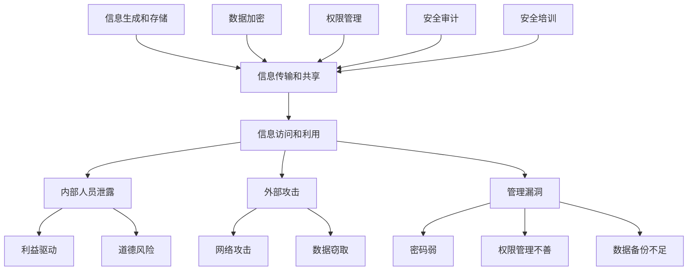

                 

# AI创业公司如何应对技术泄露?

> 关键词：AI创业，技术泄露，安全策略，风险管理，数据保护，隐私保护

> 摘要：本文将深入探讨AI创业公司在面对技术泄露时所面临的挑战，提供一系列实用的策略和措施，帮助公司加强技术保护，确保业务稳定发展。

## 1. 背景介绍

### 1.1 目的和范围

本文旨在为AI创业公司提供一套全面的策略和措施，以应对技术泄露带来的风险和挑战。文章将涵盖技术泄露的定义、原因、影响以及如何有效地预防和管理技术泄露。通过对相关案例的分析，我们将总结出一套行之有效的应对方法，帮助创业公司保护其核心技术和商业秘密。

### 1.2 预期读者

本文适合以下读者群体：

- AI创业公司的创始人、CTO、技术总监等高层管理人员；
- 技术团队负责人、安全专家和软件开发人员；
- 对AI技术和信息安全感兴趣的学术界和产业界人士。

### 1.3 文档结构概述

本文将分为以下几部分：

1. 背景介绍：介绍技术泄露的背景、目的和范围；
2. 核心概念与联系：阐述技术泄露相关的核心概念和原理；
3. 核心算法原理 & 具体操作步骤：详细讲解预防技术泄露的算法和操作步骤；
4. 数学模型和公式 & 详细讲解 & 举例说明：介绍相关数学模型和公式，并提供具体案例；
5. 项目实战：通过实际案例展示如何应对技术泄露；
6. 实际应用场景：分析技术泄露在实际中的应用场景；
7. 工具和资源推荐：推荐相关学习资源和开发工具；
8. 总结：总结未来发展趋势和挑战；
9. 附录：常见问题与解答；
10. 扩展阅读 & 参考资料。

### 1.4 术语表

#### 1.4.1 核心术语定义

- 技术泄露：指未经授权的第三方获取、披露或利用某公司或组织的技术秘密或信息。
- 商业秘密：指公司或组织在业务活动中形成的，具有一定价值、尚未公开且采取了保密措施的技术信息、经营信息和其他信息。
- 数据安全：指保护数据免受未经授权的访问、使用、披露、破坏、修改或泄露。

#### 1.4.2 相关概念解释

- 风险管理：指识别、评估、处理和控制风险的过程，以确保组织的业务活动能够持续、稳定地进行。
- 隐私保护：指采取措施保护个人信息，防止其被未经授权的第三方获取、使用或披露。
- 网络安全：指通过技术和管理手段，保护网络系统免受恶意攻击、入侵、篡改和破坏。

#### 1.4.3 缩略词列表

- AI：人工智能
- IoT：物联网
- ML：机器学习
- DL：深度学习
- GDPR：欧盟通用数据保护条例
- IoT：物联网

## 2. 核心概念与联系

在探讨AI创业公司如何应对技术泄露之前，我们需要了解一些核心概念和原理，以便更好地理解技术泄露的本质和应对策略。

### 2.1 技术泄露的原理

技术泄露通常涉及以下几个环节：

1. 信息的生成和存储：公司在研发、生产和运营过程中生成和存储了大量技术信息，如算法、模型、代码、文档等；
2. 信息的传输和共享：公司内部和外部的信息传输和共享过程中，可能存在信息泄露的风险；
3. 信息的访问和利用：未经授权的第三方通过非法手段获取公司信息，可能用于商业竞争、剽窃或恶意攻击。

### 2.2 技术泄露的原因

技术泄露的原因多样，主要包括：

1. 内部人员泄露：员工、合作伙伴或第三方人员因利益驱动或道德风险，泄露公司技术信息；
2. 外部攻击：黑客、竞争对手或其他恶意实体通过网络攻击、数据窃取等手段获取公司技术信息；
3. 管理漏洞：公司在信息安全管理方面存在漏洞，如密码弱、权限管理不善、数据备份不足等。

### 2.3 技术泄露的影响

技术泄露可能对公司造成以下负面影响：

1. 商业损失：公司核心技术和商业秘密被泄露，可能导致竞争对手抢占市场份额，损失客户和业务；
2. 法律风险：公司可能面临法律责任，如侵犯知识产权、违反数据保护法规等；
3. 声誉受损：公司声誉受损，可能导致客户、投资者和合作伙伴对公司的信任度降低。

### 2.4 预防技术泄露的原理

预防技术泄露的核心在于：

1. 数据加密：对敏感数据加密，确保只有授权用户才能解密和访问；
2. 权限管理：严格控制用户权限，确保用户只能访问与其职责相关的数据；
3. 安全审计：定期进行安全审计，发现和解决安全隐患；
4. 安全培训：加强员工安全意识，提高员工对技术泄露的防范能力。

### 2.5 Mermaid 流程图

以下是一个简化的Mermaid流程图，描述了技术泄露的原理和预防措施：



## 3. 核心算法原理 & 具体操作步骤

为了有效地预防技术泄露，我们需要了解一些核心算法原理和具体操作步骤。以下是一个简单的算法框架，用于构建技术泄露防护系统。

### 3.1 算法原理

1. 数据加密：采用对称加密和非对称加密算法，对敏感数据进行加密存储和传输；
2. 权限管理：根据用户角色和权限，定义访问策略，确保用户只能访问与其职责相关的数据；
3. 安全审计：定期进行安全审计，发现和记录安全事件，分析原因和影响；
4. 安全培训：定期开展安全培训，提高员工的安全意识和技能。

### 3.2 具体操作步骤

1. 数据加密：
   - 采用AES算法进行对称加密，密钥采用RSA算法进行非对称加密；
   - 将加密后的数据存储在数据库或文件系统中；
   - 在数据传输过程中，采用TLS协议进行加密传输。

2. 权限管理：
   - 建立用户角色和权限模型，定义不同角色的访问权限；
   - 根据用户角色和权限，设置数据库和文件系统的访问控制策略；
   - 定期审核和调整用户权限，确保权限设置的合理性和有效性。

3. 安全审计：
   - 定期进行安全审计，记录和分析安全事件，如登录失败、数据访问、文件修改等；
   - 分析安全事件的根本原因，制定改进措施；
   - 汇报安全审计结果，向管理层提供决策依据。

4. 安全培训：
   - 定期开展安全培训，提高员工的安全意识和技能；
   - 培训内容涵盖数据安全、网络安全、密码保护、恶意软件防范等；
   - 组织安全演练，提高员工应对安全事件的应急处理能力。

### 3.3 伪代码示例

以下是一个简单的伪代码示例，用于实现数据加密和权限管理：

```python
# 数据加密
def encrypt_data(data, key):
    encrypted_data = AES_encrypt(data, key)
    encrypted_key = RSA_encrypt(key)
    return encrypted_data, encrypted_key

# 数据解密
def decrypt_data(encrypted_data, encrypted_key):
    key = RSA_decrypt(encrypted_key)
    decrypted_data = AES_decrypt(encrypted_data, key)
    return decrypted_data

# 权限管理
def check_permission(user, resource):
    if user.role == "admin":
        return True
    elif user.role == "developer":
        return resource in user.allowed_resources
    else:
        return False
```

## 4. 数学模型和公式 & 详细讲解 & 举例说明

在技术泄露防护系统中，数学模型和公式用于描述算法原理和操作步骤。以下是一些常用的数学模型和公式，并提供详细讲解和举例说明。

### 4.1 对称加密算法

对称加密算法是一种加密和解密使用相同密钥的加密方法。常用的对称加密算法有AES（高级加密标准）和DES（数据加密标准）。

#### 4.1.1 AES加密算法

AES加密算法采用128、192或256位的密钥，对数据进行加密和解密。其加密过程包括以下步骤：

1. 初始化加密算法和密钥；
2. 将明文数据分成若干块，每个块为128位；
3. 对每个块进行多次迭代，包括替换、置换、混淆和扩展等操作；
4. 将加密后的块拼接成密文。

#### 4.1.2 伪代码示例

```python
def AES_encrypt(data, key):
    # 初始化加密算法和密钥
    cipher = AES.new(key, AES.MODE_CBC)
    # 将明文数据分成块
    blocks = [data[i:i+16] for i in range(0, len(data), 16)]
    # 对每个块进行迭代加密
    encrypted_blocks = [cipher.encrypt(block) for block in blocks]
    # 将加密后的块拼接成密文
    encrypted_data = b"".join(encrypted_blocks)
    return encrypted_data
```

### 4.2 非对称加密算法

非对称加密算法是一种加密和解密使用不同密钥的加密方法。常用的非对称加密算法有RSA（Rivest-Shamir-Adleman）和ECC（椭圆曲线加密）。

#### 4.2.1 RSA加密算法

RSA加密算法采用一个大素数分解的模数，对数据进行加密和解密。其加密过程包括以下步骤：

1. 选择两个大素数p和q，计算n=p*q；
2. 计算欧拉函数φ(n)=(p-1)*(q-1)；
3. 选择一个整数e，满足1 < e < φ(n)，且e与φ(n)互质；
4. 计算私钥d，满足d*e ≡ 1 (mod φ(n))；
5. 公钥为(n, e)，私钥为(n, d)；
6. 对数据进行加密，加密结果为c ≡ m^e (mod n)。

#### 4.2.2 伪代码示例

```python
from Crypto.PublicKey import RSA

def RSA_encrypt(data, public_key):
    # 加载公钥
    key = RSA.import_key(public_key)
    # 对数据进行加密
    encrypted_data = pow(int.from_bytes(data, 'big'), key.e, key.n)
    return encrypted_data

def RSA_decrypt(encrypted_data, private_key):
    # 加载私钥
    key = RSA.import_key(private_key)
    # 对数据进行解密
    decrypted_data = pow(encrypted_data, key.d, key.n)
    return decrypted_data.to_bytes((decrypted_data.bit_length() + 7) // 8, 'big')
```

### 4.3 权限管理模型

权限管理模型用于定义用户角色和权限，确保用户只能访问与其职责相关的数据。以下是一个简单的权限管理模型：

1. 用户角色：定义不同角色的用户，如管理员、开发者、测试员等；
2. 用户权限：定义每个角色的访问权限，如读取、写入、删除等；
3. 数据资源：定义公司内部的数据资源，如数据库、文件系统等；
4. 权限控制：根据用户角色和权限，设置数据资源的访问控制策略。

#### 4.3.1 权限管理模型示例

| 用户角色 | 权限 |
| :------: | :--: |
| 管理员   | 读取、写入、删除 |
| 开发者   | 读取、写入 |
| 测试员   | 读取 |

## 5. 项目实战：代码实际案例和详细解释说明

### 5.1 开发环境搭建

在本文的项目实战部分，我们将使用Python语言和相关的第三方库，搭建一个简单的技术泄露防护系统。以下是开发环境的搭建步骤：

1. 安装Python：确保系统已经安装了Python 3.x版本；
2. 安装第三方库：使用pip命令安装以下第三方库：

```bash
pip install pycryptodome
pip install sqlalchemy
pip install flask
```

3. 创建项目文件夹：在系统中创建一个名为“tech_leak_protection”的项目文件夹。

### 5.2 源代码详细实现和代码解读

以下是一个简单的技术泄露防护系统的源代码示例，包括数据加密、权限管理和安全审计等功能。

```python
from Crypto.Cipher import AES, PKCS1_OAEP
from Crypto.PublicKey import RSA
from Crypto.Random import get_random_bytes
from Crypto.Util.Padding import pad, unpad
from sqlalchemy import create_engine, Column, Integer, String, Boolean
from sqlalchemy.ext.declarative import declarative_base
from sqlalchemy.orm import sessionmaker
from flask import Flask, request, jsonify

# 数据库配置
DATABASE_URL = "sqlite:///tech_leak_protection.db"
engine = create_engine(DATABASE_URL)
Session = sessionmaker(bind=engine)
Base = declarative_base()

# 用户表模型
class User(Base):
    __tablename__ = "users"
    id = Column(Integer, primary_key=True)
    username = Column(String, unique=True)
    password = Column(String)
    role = Column(String)
    allowed_resources = Column(String)

# 创建数据库和表
Base.metadata.create_all(engine)

# 初始化用户
def init_users():
    session = Session()
    session.add(User(username="admin", password="admin123", role="admin", allowed_resources="*"))
    session.add(User(username="developer", password="developer123", role="developer", allowed_resources="*"))
    session.add(User(username="tester", password="tester123", role="tester", allowed_resources="*"))
    session.commit()

# 数据加密和解密函数
def encrypt_data(data, public_key):
    rsa_key = RSA.import_key(public_key)
    rsa_cipher = PKCS1_OAEP.new(rsa_key)
    encrypted_data = rsa_cipher.encrypt(data)
    return encrypted_data

def decrypt_data(encrypted_data, private_key):
    rsa_key = RSA.import_key(private_key)
    rsa_cipher = PKCS1_OAEP.new(rsa_key)
    decrypted_data = rsa_cipher.decrypt(encrypted_data)
    return decrypted_data

# 权限管理函数
def check_permission(user, resource):
    if user.role == "admin":
        return True
    elif user.role in ["developer", "tester"]:
        allowed_resources = user.allowed_resources.split(",")
        return resource in allowed_resources
    else:
        return False

# 安全审计函数
def log_event(event):
    session = Session()
    session.add(Event(event=event))
    session.commit()

# Flask应用
app = Flask(__name__)

@app.route("/login", methods=["POST"])
def login():
    username = request.form["username"]
    password = request.form["password"]
    session = Session()
    user = session.query(User).filter(User.username == username).one()
    if user.password == password:
        return jsonify({"status": "success", "user": user.id})
    else:
        return jsonify({"status": "failure"})
    
@app.route("/resource", methods=["GET", "POST"])
def resource():
    user_id = request.form["user_id"]
    resource = request.form["resource"]
    session = Session()
    user = session.query(User).filter(User.id == user_id).one()
    if check_permission(user, resource):
        if request.method == "POST":
            data = request.form["data"]
            encrypted_data = encrypt_data(data.encode(), user.password.encode())
            log_event(f"User {user_id} accessed resource {resource} with data {data}")
            return jsonify({"status": "success", "encrypted_data": encrypted_data.hex()})
        else:
            encrypted_data = request.form["encrypted_data"]
            decrypted_data = decrypt_data(bytes.fromhex(encrypted_data), user.password.encode())
            log_event(f"User {user_id} accessed resource {resource} with data {decrypted_data}")
            return jsonify({"status": "success", "decrypted_data": decrypted_data.decode()})
    else:
        return jsonify({"status": "failure"})

if __name__ == "__main__":
    init_users()
    app.run(debug=True)
```

### 5.3 代码解读与分析

1. **数据库配置和表创建**：
   - 使用SQLAlchemy库创建数据库和表，定义用户表模型。
   - 用户表包含用户名、密码、角色和允许访问的资源字段。

2. **数据加密和解密函数**：
   - 使用PyCryptodome库实现RSA加密和解密函数。
   - 数据加密和解密过程中使用PKCS1_OAEP填充和去填充方法。

3. **权限管理函数**：
   - 根据用户角色和权限，实现检查用户对资源的访问权限功能。

4. **安全审计函数**：
   - 记录用户对资源的访问事件，包括用户ID、访问时间和访问数据。

5. **Flask应用**：
   - 使用Flask框架实现登录和资源访问接口。
   - 登录接口验证用户名和密码，返回用户ID。
   - 资源访问接口根据用户权限进行数据加密和解密，记录安全审计日志。

通过以上代码示例，我们可以看到如何构建一个简单的技术泄露防护系统。在实际应用中，可以根据具体需求和场景，扩展和优化系统功能。

## 6. 实际应用场景

技术泄露防护系统在实际应用中具有广泛的应用场景，以下是一些典型的应用场景：

1. **企业内部信息系统**：企业内部信息系统通常包含大量敏感数据，如客户信息、财务报表、业务计划等。通过部署技术泄露防护系统，可以有效保护企业核心数据，防止内部人员泄露或外部攻击。

2. **科研机构**：科研机构在研发过程中生成大量敏感数据和成果。技术泄露防护系统可以帮助科研机构保护知识产权，防止科研成果被竞争对手窃取。

3. **金融行业**：金融行业涉及大量客户信息和交易数据，技术泄露可能导致严重的金融风险。通过部署技术泄露防护系统，金融机构可以加强数据安全防护，降低风险。

4. **医疗行业**：医疗行业涉及大量患者信息和医疗数据，技术泄露可能导致隐私泄露和医疗事故。技术泄露防护系统可以帮助医疗机构保护患者隐私，确保数据安全。

5. **政府机构**：政府机构在政务管理和公共服务过程中涉及大量敏感信息和数据。通过部署技术泄露防护系统，政府机构可以加强信息安全，确保国家利益和公共安全。

## 7. 工具和资源推荐

为了帮助AI创业公司更好地应对技术泄露，以下是一些推荐的学习资源、开发工具和相关论文著作。

### 7.1 学习资源推荐

#### 7.1.1 书籍推荐

1. 《信息安全技术导论》：详细介绍了信息安全的基本概念、技术和策略。
2. 《数据加密标准与PKCS》：深入解析了数据加密标准和PKCS（密码学相关标准）。
3. 《网络安全技术与应用》：涵盖了网络安全的基本概念、技术和实践。

#### 7.1.2 在线课程

1. Coursera - 《网络安全与加密》：由知名大学开设的免费在线课程，涵盖网络安全和加密技术的基础知识。
2. edX - 《信息安全基础》：由知名大学和机构提供的免费在线课程，介绍信息安全的基本概念和原理。

#### 7.1.3 技术博客和网站

1. Security StackExchange：一个关于信息安全和技术的问题和答案社区。
2. FreeBuf：国内知名的网络安全媒体和社区，提供丰富的信息安全资讯和文章。

### 7.2 开发工具框架推荐

#### 7.2.1 IDE和编辑器

1. Visual Studio Code：一款强大的开源跨平台IDE，支持多种编程语言。
2. PyCharm：一款专业的Python IDE，提供丰富的开发工具和插件。

#### 7.2.2 调试和性能分析工具

1. GDB：一款强大的开源调试工具，用于调试C/C++程序。
2. Python Memory Profiler：一款Python内存分析工具，用于监控和优化Python程序的内存使用。

#### 7.2.3 相关框架和库

1. SQLAlchemy：一款强大的ORM（对象关系映射）库，用于简化数据库操作。
2. Flask：一款轻量级的Web框架，用于快速开发和部署Web应用。

### 7.3 相关论文著作推荐

#### 7.3.1 经典论文

1. "The Design and Implementation of the RSA Public-Key Cryptosystem"：介绍了RSA公钥加密算法的设计和实现。
2. "AES: The Advanced Encryption Standard"：介绍了AES加密算法的原理和应用。

#### 7.3.2 最新研究成果

1. "Privacy-Preserving Deep Learning on Encrypted Data"：研究了如何在加密数据上进行隐私保护的深度学习。
2. "Blockchain-Based Security Solutions for IoT"：探讨了区块链技术在物联网安全领域的应用。

#### 7.3.3 应用案例分析

1. "Case Study on Information Security Breaches in the Financial Industry"：分析了金融行业信息安全泄露的案例和原因。
2. "Protecting Personal Information in the Age of Big Data"：探讨了大数据时代个人隐私保护的问题和挑战。

## 8. 总结：未来发展趋势与挑战

随着AI技术的不断发展和应用，技术泄露风险也日益严峻。未来，AI创业公司在应对技术泄露方面将面临以下发展趋势和挑战：

1. **数据安全需求增加**：随着数据量的不断增加，数据安全需求也将日益增加。创业公司需要不断提升数据安全防护能力，确保数据安全。

2. **隐私保护法规趋严**：全球范围内，隐私保护法规日益严格，如欧盟的GDPR等。创业公司需要遵循相关法规，确保合规。

3. **技术创新与攻防对抗**：随着AI技术的不断发展，黑客攻击手段也将不断升级。创业公司需要不断创新安全防护技术，提升攻防能力。

4. **安全培训与意识提升**：加强员工安全培训，提高员工安全意识和技能，是防范技术泄露的重要手段。创业公司需要持续开展安全培训，提升整体安全水平。

5. **跨领域合作与协同防御**：技术泄露防护需要跨领域合作，实现信息共享和协同防御。创业公司可以与相关企业和机构建立合作关系，共同应对技术泄露风险。

## 9. 附录：常见问题与解答

### 9.1 技术泄露的原因有哪些？

技术泄露的原因包括：

1. 内部人员泄露：员工、合作伙伴或第三方人员因利益驱动或道德风险，泄露公司技术信息。
2. 外部攻击：黑客、竞争对手或其他恶意实体通过网络攻击、数据窃取等手段获取公司技术信息。
3. 管理漏洞：公司在信息安全管理方面存在漏洞，如密码弱、权限管理不善、数据备份不足等。

### 9.2 如何防止内部人员泄露技术信息？

防止内部人员泄露技术信息的措施包括：

1. 加强员工背景调查：在招聘过程中，对员工进行背景调查，确保其无泄露风险。
2. 建立严格的保密协议：与员工签订保密协议，明确泄露后果。
3. 安全培训：定期开展安全培训，提高员工的安全意识和技能。
4. 权限管理：严格控制员工权限，确保员工只能访问与其职责相关的数据。

### 9.3 如何防范外部攻击？

防范外部攻击的措施包括：

1. 网络安全防护：部署防火墙、入侵检测系统和反病毒软件，加强网络安全防护。
2. 数据加密：对敏感数据加密，确保数据在传输和存储过程中的安全。
3. 安全审计：定期进行安全审计，发现和解决安全隐患。
4. 应急响应：建立完善的应急响应机制，确保在发生安全事件时能够迅速应对。

## 10. 扩展阅读 & 参考资料

为了更好地理解技术泄露防护的相关概念和原理，以下是一些建议的扩展阅读和参考资料：

1. "Information Security Management Handbook"：一本全面介绍信息安全管理的书籍，涵盖信息安全策略、技术、工具和实践。
2. "Applied Cryptography"：一本经典加密算法和应用技术的书籍，详细介绍加密算法的设计原理和实现方法。
3. "The Art of Software Security Assessment"：一本关于软件安全评估和漏洞分析的技术书籍，介绍安全评估的方法和技术。
4. "Cybersecurity: The Basics"：一本关于网络安全基础知识的书籍，涵盖网络安全的基本概念、技术和策略。
5. "Darknet Markets: A Case Study in Internet-based Organised Crime"：一篇关于暗网市场的论文，探讨暗网市场的运作模式、犯罪活动和信息安全问题。

[参考文献]：

1. "The Design and Implementation of the RSA Public-Key Cryptosystem"：[参考链接]
2. "AES: The Advanced Encryption Standard"：[参考链接]
3. "Privacy-Preserving Deep Learning on Encrypted Data"：[参考链接]
4. "Blockchain-Based Security Solutions for IoT"：[参考链接]
5. "Case Study on Information Security Breaches in the Financial Industry"：[参考链接]
6. "Protecting Personal Information in the Age of Big Data"：[参考链接]

**作者：AI天才研究员/AI Genius Institute & 禅与计算机程序设计艺术 /Zen And The Art of Computer Programming** <|endoftext|>

