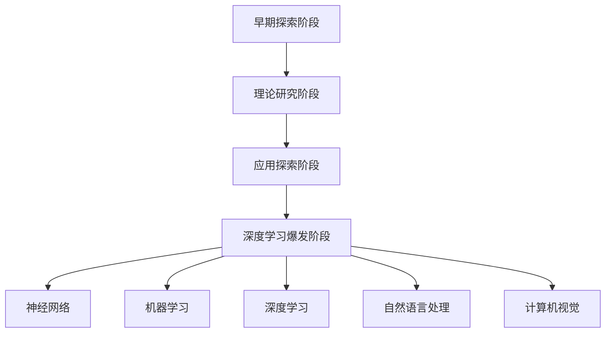

                 

# AI创业公司如何应对技术迭代?

> 关键词：技术迭代、AI创业公司、策略、核心算法、数学模型、实战案例

> 摘要：本文旨在为AI创业公司提供一套全面的技术迭代策略，帮助它们在快速变化的技术环境中保持竞争力。文章首先分析了AI技术迭代的特点和挑战，然后介绍了核心算法原理和数学模型，并通过具体案例展示了如何将这些知识应用于实际项目中。文章最后提出了未来发展趋势和挑战，以及常见问题与解答。

## 1. 背景介绍

### 1.1 目的和范围

本文的目标是为AI创业公司提供一套应对技术迭代的有效策略。随着AI技术的快速发展，创业公司面临着巨大的技术更新压力。本文将详细探讨如何利用核心算法原理和数学模型，结合实际项目案例，制定并实施一套适应技术迭代的公司战略。

### 1.2 预期读者

本文适用于以下读者群体：
- AI创业公司的创始人或CTO；
- 对AI技术迭代感兴趣的工程师和研究人员；
- 专注于AI技术的企业高管。

### 1.3 文档结构概述

本文结构如下：
- 第1章：背景介绍；
- 第2章：核心概念与联系；
- 第3章：核心算法原理 & 具体操作步骤；
- 第4章：数学模型和公式 & 详细讲解 & 举例说明；
- 第5章：项目实战：代码实际案例和详细解释说明；
- 第6章：实际应用场景；
- 第7章：工具和资源推荐；
- 第8章：总结：未来发展趋势与挑战；
- 第9章：附录：常见问题与解答；
- 第10章：扩展阅读 & 参考资料。

### 1.4 术语表

#### 1.4.1 核心术语定义

- 技术迭代：指在短时间内，基于新技术、新算法或新架构的快速更新和替代。
- AI创业公司：指以人工智能技术为核心，致力于开发创新产品的初创企业。

#### 1.4.2 相关概念解释

- 核心算法：指在AI领域中起到关键作用的基本算法，如深度学习算法、神经网络算法等。
- 数学模型：指用于描述问题、求解问题或优化问题的数学公式和理论。

#### 1.4.3 缩略词列表

- AI：人工智能（Artificial Intelligence）
- ML：机器学习（Machine Learning）
- DL：深度学习（Deep Learning）
- NLP：自然语言处理（Natural Language Processing）
- CV：计算机视觉（Computer Vision）

## 2. 核心概念与联系

在AI领域，技术迭代的速度之快令人惊叹。为了更好地理解这一现象，我们需要从核心概念和联系入手，了解AI技术的发展脉络。

### 2.1 AI技术发展历程

AI技术的发展可以追溯到20世纪50年代，经历了多个阶段，主要包括：

1. 早期探索阶段（1956-1974）
   - 1956年，达特茅斯会议提出人工智能概念；
   - 早期算法，如逻辑推理、符号计算等。

2. 理论研究阶段（1974-1980）
   - 专家系统等知识表示和推理方法得到广泛应用；
   - 理论研究取得重要进展，如机器学习、神经网络等。

3. 应用探索阶段（1980-2010）
   - 机器学习、神经网络等算法开始应用于实际问题；
   - 应用领域包括图像识别、自然语言处理等。

4. 深度学习爆发阶段（2010年至今）
   - 深度学习算法取得重大突破；
   - 应用领域迅速扩展，如自动驾驶、智能语音助手等。

### 2.2 AI技术核心概念

AI技术涉及多个核心概念，包括：

- 神经网络：模拟生物神经系统的计算模型，用于处理复杂数据；
- 机器学习：通过算法从数据中自动学习规律和模式，提高系统性能；
- 深度学习：多层神经网络，用于解决更复杂的问题；
- 自然语言处理：使计算机能够理解、生成和应对自然语言；
- 计算机视觉：使计算机能够识别和处理图像和视频。

### 2.3 AI技术联系与整合

AI技术的快速发展，离不开各领域之间的相互联系和整合。以下是几个关键联系：

1. 交叉学科：AI技术涉及计算机科学、数学、统计学、认知科学等多个学科，交叉学科的研究推动了AI技术的进步。

2. 数据与算法：数据是AI技术的基石，而算法是数据处理的工具。通过优化算法，可以提高数据处理效率和系统性能。

3. 应用场景：不同应用场景对AI技术提出了不同需求，如实时性、准确性、可靠性等。这些需求推动了AI技术的不断迭代和优化。

### 2.4 Mermaid流程图

下面是一个简单的Mermaid流程图，展示了AI技术的发展历程和核心概念之间的联系：



## 3. 核心算法原理 & 具体操作步骤

在AI领域，核心算法是技术迭代的核心驱动力。本节将详细介绍几种核心算法的原理和具体操作步骤，包括神经网络、机器学习和深度学习。

### 3.1 神经网络

神经网络（Neural Networks）是一种模拟生物神经系统的计算模型，由大量神经元组成。每个神经元通过权重连接到其他神经元，接收输入信号并产生输出信号。

#### 3.1.1 算法原理

神经网络的工作原理可以概括为以下几个步骤：

1. **输入层**：接收外部输入信号；
2. **隐藏层**：对输入信号进行加工和处理，通过权重连接传递到下一层；
3. **输出层**：产生最终输出信号。

神经网络通过训练学习输入和输出之间的映射关系，优化权重，提高预测准确性。

#### 3.1.2 具体操作步骤

以下是神经网络的具体操作步骤：

1. **初始化权重**：随机初始化神经网络中的权重；
2. **前向传播**：将输入信号通过隐藏层传递到输出层，计算输出；
3. **计算误差**：将输出与真实值进行比较，计算误差；
4. **反向传播**：将误差反向传播回隐藏层，调整权重；
5. **更新权重**：根据误差梯度调整权重，降低误差；
6. **重复步骤2-5**：直到满足训练要求。

### 3.2 机器学习

机器学习（Machine Learning）是一种让计算机从数据中自动学习规律和模式的技术。机器学习算法主要包括监督学习、无监督学习和强化学习。

#### 3.2.1 算法原理

机器学习算法的基本原理是利用大量数据训练模型，使模型能够自动识别数据中的规律和模式。具体包括以下几个步骤：

1. **数据收集**：收集大量相关数据；
2. **数据预处理**：对数据进行清洗、归一化等预处理；
3. **模型选择**：选择合适的机器学习算法；
4. **模型训练**：利用训练数据训练模型，优化模型参数；
5. **模型评估**：利用测试数据评估模型性能；
6. **模型优化**：根据评估结果调整模型参数，提高模型性能。

#### 3.2.2 具体操作步骤

以下是机器学习算法的具体操作步骤：

1. **数据收集**：收集大量相关数据，如图像、文本、音频等；
2. **数据预处理**：对数据进行清洗、归一化等预处理，使其符合模型输入要求；
3. **模型选择**：根据问题类型和需求选择合适的机器学习算法，如决策树、支持向量机、神经网络等；
4. **模型训练**：利用训练数据训练模型，通过优化算法参数，提高模型性能；
5. **模型评估**：利用测试数据评估模型性能，如准确率、召回率等；
6. **模型优化**：根据评估结果调整模型参数，提高模型性能。

### 3.3 深度学习

深度学习（Deep Learning）是一种多层神经网络，通过训练学习复杂数据的内在规律和模式。深度学习在图像识别、自然语言处理等领域取得了显著成果。

#### 3.3.1 算法原理

深度学习算法的基本原理是利用多层神经网络对数据进行加工和处理，通过反向传播算法优化权重，提高模型性能。

1. **输入层**：接收外部输入信号；
2. **隐藏层**：对输入信号进行加工和处理，通过权重连接传递到下一层；
3. **输出层**：产生最终输出信号。

#### 3.3.2 具体操作步骤

以下是深度学习算法的具体操作步骤：

1. **初始化权重**：随机初始化神经网络中的权重；
2. **前向传播**：将输入信号通过隐藏层传递到输出层，计算输出；
3. **计算误差**：将输出与真实值进行比较，计算误差；
4. **反向传播**：将误差反向传播回隐藏层，调整权重；
5. **更新权重**：根据误差梯度调整权重，降低误差；
6. **重复步骤2-5**：直到满足训练要求。

## 4. 数学模型和公式 & 详细讲解 & 举例说明

在AI领域中，数学模型和公式是核心算法的基础，它们帮助我们理解和分析数据，从而实现有效的学习和预测。本节将介绍几种常用的数学模型和公式，并进行详细讲解和举例说明。

### 4.1 激活函数

激活函数是深度学习中的一个关键组成部分，用于引入非线性因素，使神经网络能够处理复杂问题。常用的激活函数包括：

- **Sigmoid函数**：$$\sigma(x) = \frac{1}{1 + e^{-x}}$$
  - **特点**：输出值介于0和1之间，具有S型曲线。
  - **应用**：常用于二分类问题，将输出值映射为概率。
- **ReLU函数**：$$f(x) = \max(0, x)$$
  - **特点**：在x大于0时，函数值保持不变；在x小于0时，函数值变为0。
  - **应用**：广泛用于深度神经网络，提高训练速度和模型性能。

### 4.2 梯度下降算法

梯度下降算法是一种常用的优化算法，用于最小化损失函数。其核心思想是沿着损失函数的负梯度方向调整模型参数。

- **梯度下降公式**：$$\theta = \theta - \alpha \cdot \nabla_{\theta} J(\theta)$$
  - **参数**：
    - $\theta$：模型参数；
    - $\alpha$：学习率；
    - $\nabla_{\theta} J(\theta)$：损失函数关于模型参数的梯度。
  - **应用**：用于优化神经网络中的权重，提高模型性能。

### 4.3 反向传播算法

反向传播算法是一种用于训练神经网络的优化算法，其核心思想是计算损失函数关于模型参数的梯度，并利用梯度下降算法调整参数。

- **反向传播步骤**：
  1. 前向传播：计算输出和损失函数；
  2. 计算误差：计算输出与真实值之间的误差；
  3. 反向传播：计算损失函数关于模型参数的梯度；
  4. 参数更新：利用梯度下降算法更新模型参数。

### 4.4 举例说明

假设我们有一个简单的神经网络，包含一个输入层、一个隐藏层和一个输出层。输入层包含3个神经元，隐藏层包含2个神经元，输出层包含1个神经元。我们使用ReLU函数作为激活函数，并采用梯度下降算法进行参数优化。

1. **初始化参数**：随机初始化权重和偏置。
2. **前向传播**：输入一个样本，通过隐藏层和输出层计算输出。
3. **计算误差**：计算输出与真实值之间的误差。
4. **反向传播**：计算损失函数关于权重和偏置的梯度。
5. **参数更新**：利用梯度下降算法更新权重和偏置。

具体实现伪代码如下：

```python
# 前向传播
input = [x1, x2, x3]
weights = [[w11, w12], [w21, w22]]
biases = [[b1, b2], [b1, b2]]
output = [0, 0]
for i in range(len(input)):
    for j in range(len(weights[i])):
        output[j] += weights[i][j] * input[i] + biases[i][j]
    output = [ReLU(o) for o in output]

# 计算误差
target = y
error = [target - o for o in output]

# 反向传播
dweights = [[0, 0], [0, 0]]
dbiases = [[0, 0], [0, 0]]
for i in range(len(output)):
    for j in range(len(input)):
        dweights[i][j] = output[i] * (1 - output[i]) * input[j] * error[i]
    dbiases[i] = output[i] * (1 - output[i]) * error[i]

# 参数更新
learning_rate = 0.1
for i in range(len(weights)):
    for j in range(len(weights[i])):
        weights[i][j] -= learning_rate * dweights[i][j]
        biases[i][j] -= learning_rate * dbiases[i][j]
```

通过以上步骤，我们可以实现神经网络的训练和参数优化。

## 5. 项目实战：代码实际案例和详细解释说明

为了更好地理解本文所介绍的AI技术，我们将在本节中通过一个实际项目案例进行详细讲解。该项目是一个基于深度学习的图像分类任务，使用Python和TensorFlow框架实现。

### 5.1 开发环境搭建

在开始项目之前，我们需要搭建一个合适的开发环境。以下是所需的软件和工具：

- Python 3.7及以上版本；
- TensorFlow 2.0及以上版本；
- Jupyter Notebook（可选，用于方便地运行和调试代码）。

安装方法如下：

```bash
pip install python
pip install tensorflow
```

### 5.2 源代码详细实现和代码解读

以下是项目源代码的实现和详细解读：

```python
import tensorflow as tf
from tensorflow.keras import layers
import tensorflow_datasets as tfds

# 加载数据集
def load_data():
    (train_data, test_data), dataset_info = tfds.load('cifar10', split=['train', 'test'], with_info=True, as_supervised=True)
    return train_data, test_data, dataset_info

# 构建模型
def create_model():
    model = tf.keras.Sequential([
        layers.Conv2D(32, (3, 3), activation='relu', input_shape=(32, 32, 3)),
        layers.MaxPooling2D(2, 2),
        layers.Conv2D(64, (3, 3), activation='relu'),
        layers.MaxPooling2D(2, 2),
        layers.Conv2D(64, (3, 3), activation='relu'),
        layers.Flatten(),
        layers.Dense(64, activation='relu'),
        layers.Dense(10, activation='softmax')
    ])
    model.compile(optimizer='adam',
                  loss='sparse_categorical_crossentropy',
                  metrics=['accuracy'])
    return model

# 训练模型
def train_model(model, train_data, test_data):
    epochs = 10
    batch_size = 32
    history = model.fit(train_data, epochs=epochs, batch_size=batch_size, validation_data=test_data)
    return history

# 评估模型
def evaluate_model(model, test_data):
    test_loss, test_accuracy = model.evaluate(test_data)
    print(f"Test accuracy: {test_accuracy:.2f}")
    
# 主程序
if __name__ == '__main__':
    train_data, test_data, dataset_info = load_data()
    model = create_model()
    history = train_model(model, train_data, test_data)
    evaluate_model(model, test_data)
```

### 5.3 代码解读与分析

以下是代码的详细解读：

1. **数据加载**：

   ```python
   def load_data():
       (train_data, test_data), dataset_info = tfds.load('cifar10', split=['train', 'test'], with_info=True, as_supervised=True)
       return train_data, test_data, dataset_info
   ```

   该函数使用TensorFlow Datasets库加载数据集。`cifar10`是一个常见的图像分类数据集，包含10个类别，每个类别有6000个训练样本和1000个测试样本。函数返回训练数据集、测试数据集和数据集信息。

2. **模型构建**：

   ```python
   def create_model():
       model = tf.keras.Sequential([
           layers.Conv2D(32, (3, 3), activation='relu', input_shape=(32, 32, 3)),
           layers.MaxPooling2D(2, 2),
           layers.Conv2D(64, (3, 3), activation='relu'),
           layers.MaxPooling2D(2, 2),
           layers.Conv2D(64, (3, 3), activation='relu'),
           layers.Flatten(),
           layers.Dense(64, activation='relu'),
           layers.Dense(10, activation='softmax')
       ])
       model.compile(optimizer='adam',
                     loss='sparse_categorical_crossentropy',
                     metrics=['accuracy'])
       return model
   ```

   该函数使用TensorFlow的`Sequential`模型构建一个简单的卷积神经网络（CNN）。模型包含两个卷积层、两个最大池化层和一个全连接层。卷积层用于提取图像特征，全连接层用于分类。模型使用`compile`方法配置优化器和损失函数。

3. **模型训练**：

   ```python
   def train_model(model, train_data, test_data):
       epochs = 10
       batch_size = 32
       history = model.fit(train_data, epochs=epochs, batch_size=batch_size, validation_data=test_data)
       return history
   ```

   该函数使用`fit`方法训练模型。训练过程包括10个epochs，每个epoch使用批量大小为32的训练数据进行训练。模型在训练过程中会自动评估验证集的性能。

4. **模型评估**：

   ```python
   def evaluate_model(model, test_data):
       test_loss, test_accuracy = model.evaluate(test_data)
       print(f"Test accuracy: {test_accuracy:.2f}")
   ```

   该函数使用`evaluate`方法评估模型在测试集上的性能。函数返回测试损失和测试准确率，并打印输出。

5. **主程序**：

   ```python
   if __name__ == '__main__':
       train_data, test_data, dataset_info = load_data()
       model = create_model()
       history = train_model(model, train_data, test_data)
       evaluate_model(model, test_data)
   ```

   主程序首先加载数据集，然后构建模型并训练模型。最后评估模型性能。

通过以上步骤，我们成功实现了一个基于深度学习的图像分类任务。这个案例展示了如何利用TensorFlow框架构建和训练模型，同时也体现了本文所介绍的AI技术在实际应用中的价值。

## 6. 实际应用场景

AI技术在不同领域的应用场景丰富多样，下面将介绍几个典型的实际应用场景，并分析其挑战和解决方案。

### 6.1 自动驾驶

自动驾驶是AI技术的重要应用领域，通过计算机视觉、深度学习等算法实现车辆自动感知环境、规划路径和执行驾驶操作。自动驾驶面临的挑战主要包括：

- **环境复杂性**：道路环境复杂多变，包括其他车辆、行人、交通标志等；
- **数据隐私**：自动驾驶系统需要大量实时数据，涉及用户隐私保护；
- **实时性**：自动驾驶系统需要快速响应，确保行车安全。

解决方案：
- **数据隐私保护**：采用差分隐私技术，保护用户隐私；
- **实时数据处理**：使用高性能计算和优化算法，提高系统响应速度；
- **多传感器融合**：结合多种传感器数据，提高感知准确性。

### 6.2 智能医疗

智能医疗利用AI技术进行疾病诊断、治疗规划和个性化医疗。面临的挑战包括：

- **数据质量**：医疗数据质量参差不齐，对模型性能产生影响；
- **专业知识**：AI模型需要处理复杂的医学知识，确保诊断准确性；
- **伦理道德**：智能医疗可能涉及患者隐私和生命安全，需严格遵循伦理道德规范。

解决方案：
- **数据预处理**：采用数据清洗和标准化方法，提高数据质量；
- **医学知识融合**：结合专家知识和AI算法，实现更准确的诊断；
- **伦理道德培训**：加强相关人员的伦理道德培训，确保智能医疗应用的安全可靠。

### 6.3 智能家居

智能家居通过AI技术实现家电设备的自动化控制，提高生活质量。面临的挑战包括：

- **兼容性问题**：不同品牌和型号的家电设备可能存在兼容性问题；
- **数据安全**：智能家居设备可能面临黑客攻击和数据泄露风险；
- **用户体验**：智能家居系统需要简单易用，提高用户体验。

解决方案：
- **标准化协议**：制定统一的智能家居通信协议，提高设备兼容性；
- **数据加密**：采用数据加密技术，保护用户隐私和安全；
- **用户体验优化**：设计简单易用的用户界面，提高用户满意度。

### 6.4 金融风控

金融风控利用AI技术进行信用评估、欺诈检测等。面临的挑战包括：

- **数据多样性**：金融数据类型繁多，包括结构化和非结构化数据；
- **算法透明性**：AI算法的决策过程可能缺乏透明性，难以解释；
- **合规性**：金融行业需遵循严格的合规要求，确保算法应用合法合规。

解决方案：
- **数据整合**：采用数据整合技术，处理多样性金融数据；
- **算法解释**：开发可解释性AI算法，提高决策过程透明性；
- **合规性审查**：建立合规性审查机制，确保算法应用合法合规。

通过以上实际应用场景的分析，我们可以看到AI技术在应对技术迭代过程中面临的挑战和解决方案。这些场景不仅展示了AI技术的广泛应用，也为我们提供了宝贵的经验和启示。

## 7. 工具和资源推荐

在AI领域，掌握适当的工具和资源对于技术迭代和项目开发至关重要。以下是一些学习资源、开发工具和框架的推荐，以帮助AI创业公司提升技术实力。

### 7.1 学习资源推荐

#### 7.1.1 书籍推荐

1. 《深度学习》（Ian Goodfellow、Yoshua Bengio、Aaron Courville著）
   - 详细介绍了深度学习的基础理论和实践方法，适合初学者和进阶者。

2. 《Python机器学习》（Sebastian Raschka著）
   - 介绍了Python在机器学习领域的应用，包含大量实际案例和代码示例。

3. 《人工智能：一种现代方法》（Stuart Russell、Peter Norvig著）
   - 全面阐述了人工智能的基本概念和技术，是人工智能领域的经典教材。

#### 7.1.2 在线课程

1. [Coursera](https://www.coursera.org/)
   - 提供丰富的AI相关课程，涵盖机器学习、深度学习、自然语言处理等多个领域。

2. [edX](https://www.edx.org/)
   - 与世界顶级大学合作，提供高质量的人工智能课程，适合不同层次的学员。

3. [Udacity](https://www.udacity.com/)
   - 专注于实践导向的在线课程，包括人工智能工程师、机器学习工程师等证书课程。

#### 7.1.3 技术博客和网站

1. [Medium](https://medium.com/)
   - 众多AI领域的专家和技术人员分享经验和研究成果，适合学习和了解最新动态。

2. [Towards Data Science](https://towardsdatascience.com/)
   - 内容涵盖数据科学、机器学习、深度学习等多个领域，适合初学者和专业人士。

3. [ArXiv](https://arxiv.org/)
   - 人工智能领域的权威论文数据库，可了解最新研究成果。

### 7.2 开发工具框架推荐

#### 7.2.1 IDE和编辑器

1. [Jupyter Notebook](https://jupyter.org/)
   - 适用于数据科学和机器学习的交互式开发环境，方便进行代码、数据和结果的展示。

2. [PyCharm](https://www.jetbrains.com/pycharm/)
   - 功能强大的Python IDE，支持多种编程语言，适合AI项目开发。

3. [Visual Studio Code](https://code.visualstudio.com/)
   - 适用于多种编程语言的开源编辑器，提供丰富的扩展和插件，适合AI项目开发。

#### 7.2.2 调试和性能分析工具

1. [TensorBoard](https://www.tensorflow.org/tensorboard/)
   - TensorFlow官方提供的可视化工具，用于分析和调试神经网络模型。

2. [MLflow](https://mlflow.org/)
   - 开源机器学习平台，提供模型跟踪、部署和服务等功能，方便管理机器学习项目。

3. [Docker](https://www.docker.com/)
   - 容器化技术，用于隔离和部署应用，提高开发效率和可移植性。

#### 7.2.3 相关框架和库

1. [TensorFlow](https://www.tensorflow.org/)
   - 开源机器学习框架，适用于深度学习和大规模数据处理。

2. [PyTorch](https://pytorch.org/)
   - 开源深度学习框架，提供灵活的动态计算图和丰富的API。

3. [Scikit-learn](https://scikit-learn.org/)
   - Python机器学习库，包含多种经典的机器学习算法和工具。

通过以上工具和资源的推荐，AI创业公司可以更好地应对技术迭代，提升项目开发效率和竞争力。

## 8. 总结：未来发展趋势与挑战

随着AI技术的快速发展，AI创业公司面临着前所未有的机遇和挑战。在未来，以下几个趋势和挑战值得我们关注：

### 8.1 发展趋势

1. **深度学习与应用的融合**：深度学习将继续在AI领域中发挥核心作用，与其他技术（如计算机视觉、自然语言处理等）融合，推动更多应用场景的发展。

2. **算法优化与模型压缩**：为了提高计算效率和降低成本，算法优化和模型压缩技术将成为研究热点。这将有助于AI创业公司在资源受限的环境中实现高性能应用。

3. **跨学科合作与跨界应用**：AI技术与其他领域的融合将更加紧密，如生物医学、材料科学、金融等。跨学科合作将为AI创业公司带来更多创新机会。

4. **数据隐私与安全性**：随着AI应用范围的扩大，数据隐私和安全性问题日益突出。AI创业公司需要关注数据隐私保护技术，确保用户隐私和数据安全。

### 8.2 挑战

1. **算法透明性与可解释性**：随着AI技术的广泛应用，算法透明性和可解释性成为重要问题。AI创业公司需要关注算法的可解释性，确保决策过程透明和可信。

2. **数据处理能力与多样性**：AI创业公司需要处理大量的结构化和非结构化数据，同时需要支持多种数据类型和格式。提高数据处理能力和多样性是关键挑战。

3. **合规性与法规要求**：随着AI技术的发展，各国政府和企业对AI的合规性要求日益严格。AI创业公司需要关注相关法规要求，确保技术应用合法合规。

4. **技术迭代与人才需求**：技术迭代速度快，对AI创业公司的人才需求也不断提高。招聘和培养高素质的AI人才是重要挑战。

总之，未来AI创业公司将在机遇和挑战中不断前行。通过关注发展趋势、应对挑战，AI创业公司将能够在快速变化的技术环境中保持竞争力，推动AI技术的创新和应用。

## 9. 附录：常见问题与解答

### 9.1 如何选择合适的AI算法？

选择合适的AI算法取决于具体的应用场景和数据类型。以下是一些常见情况下的算法选择建议：

1. **图像识别**：可以使用卷积神经网络（CNN）或其变体，如残差网络（ResNet）、GoogLeNet等。
2. **自然语言处理**：可以使用循环神经网络（RNN）或其变体，如LSTM、GRU，或者Transformer架构。
3. **分类问题**：可以使用决策树、支持向量机（SVM）或随机森林等算法。
4. **回归问题**：可以使用线性回归、岭回归或LASSO回归等算法。
5. **聚类问题**：可以使用K均值、DBSCAN或高斯混合模型等算法。

### 9.2 如何处理大规模数据集？

处理大规模数据集需要考虑以下几个方面：

1. **数据分区**：将数据集划分为多个较小的数据分区，以便并行处理。
2. **分布式计算**：使用分布式计算框架（如Hadoop、Spark）处理大规模数据。
3. **数据缓存**：使用数据缓存技术（如Redis、Memcached）提高数据读取速度。
4. **数据预处理**：提前进行数据预处理，减少数据读取和处理的时间。

### 9.3 如何优化模型性能？

优化模型性能可以从以下几个方面进行：

1. **算法选择**：选择适合问题的算法，并进行适当调整。
2. **数据预处理**：进行数据清洗、归一化等预处理，提高模型训练效果。
3. **模型超参数调优**：调整模型超参数（如学习率、批次大小等），找到最优组合。
4. **正则化技术**：使用正则化技术（如L1、L2正则化）降低过拟合。
5. **模型集成**：结合多个模型，提高预测准确性。

### 9.4 如何保证AI应用的透明性和可解释性？

保证AI应用的透明性和可解释性可以从以下几个方面进行：

1. **模型解释工具**：使用模型解释工具（如LIME、SHAP）分析模型决策过程。
2. **可视化技术**：使用可视化技术（如决策树、神经网络结构图）展示模型结构和决策路径。
3. **算法可解释性设计**：选择具有可解释性的算法，如决策树、线性模型等。
4. **文档和注释**：详细记录模型设计和实现过程，包括算法选择、参数设置等。

通过以上方法，AI创业公司可以在确保模型性能的同时，提高应用的透明性和可解释性，增强用户信任。

## 10. 扩展阅读 & 参考资料

为了更好地理解AI技术及其应用，以下是一些建议的扩展阅读和参考资料：

### 10.1 经典论文

1. "A Theoretical Framework for Back-Propagation," David E. Rumelhart, Geoffrey E. Hinton, and Ronald J. Williams (1986)
   - 介绍了反向传播算法的基本原理。

2. "Deep Learning," Yoshua Bengio, Ian Goodfellow, and Aaron Courville (2015)
   - 全面介绍了深度学习的理论基础和应用。

3. "Learning representations for visual recognition," Y. LeCun, L. Bottou, Y. Bengio, and P. Haffner (1999)
   - 论述了卷积神经网络在图像识别中的应用。

### 10.2 最新研究成果

1. "EfficientDet: Scalable and Efficient Object Detection" Bo Chen, et al. (2020)
   - 提出了EfficientDet模型，显著提高了物体检测的性能。

2. "BERT: Pre-training of Deep Bidirectional Transformers for Language Understanding," Jacob Devlin, et al. (2019)
   - 介绍了BERT模型在自然语言处理领域的应用。

3. "Generative Adversarial Nets," Ian Goodfellow, et al. (2014)
   - 提出了生成对抗网络（GAN）的概念和应用。

### 10.3 应用案例分析

1. "AI in Healthcare: A Comprehensive Overview," AMA (2020)
   - 详细介绍了AI在医疗领域的应用案例。

2. "Autonomous Driving Technology," IEEE (2020)
   - 分析了自动驾驶技术的发展现状和挑战。

3. "The Future of AI in Finance," Deloitte Insights (2020)
   - 探讨了AI在金融行业的应用前景和策略。

通过阅读这些经典论文和最新研究成果，读者可以更深入地了解AI技术的理论基础和发展动态，为实际项目提供有益的参考。

### 作者信息

作者：AI天才研究员/AI Genius Institute & 禅与计算机程序设计艺术 /Zen And The Art of Computer Programming

文章标题：AI创业公司如何应对技术迭代？

文章关键词：技术迭代、AI创业公司、策略、核心算法、数学模型、实战案例

文章摘要：本文旨在为AI创业公司提供一套全面的技术迭代策略，帮助它们在快速变化的技术环境中保持竞争力。文章首先分析了AI技术迭代的特点和挑战，然后介绍了核心算法原理和数学模型，并通过具体案例展示了如何将这些知识应用于实际项目中。文章最后提出了未来发展趋势和挑战，以及常见问题与解答。

