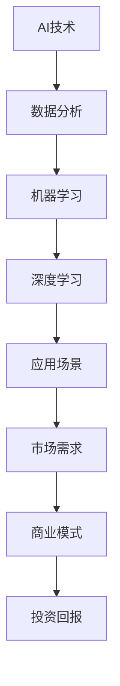

                 

# AI创业公司如何找到好场景

> **关键词：** AI创业、场景选择、市场分析、技术实施、商业模式、投资策略  
>
> **摘要：** 本文旨在为AI创业公司提供一套系统化的方法，帮助他们在众多竞争激烈的市场中找到最具潜力的应用场景，并成功实现商业化。

## 1. 背景介绍

### 1.1 目的和范围

本文的目标是为AI创业公司提供一套有效的策略，以识别和评估潜在的商业场景。我们将探讨如何从技术可行性、市场需求、商业模式等多个维度进行分析，以帮助创业公司找到适合自己的发展方向。

本文将涵盖以下内容：
- AI创业公司面临的挑战和机遇
- 如何选择合适的应用场景
- 技术实施和商业模式设计的要点
- 如何获取投资和资源支持
- 未来发展趋势和潜在挑战

### 1.2 预期读者

本文主要面向以下读者群体：
- 有志于投身AI创业的工程师和技术专家
- AI创业公司的创始人或CTO
- 投资者和市场分析师，希望了解AI创业的细节
- 对AI技术和应用场景感兴趣的学术研究人员

### 1.3 文档结构概述

本文将按照以下结构进行展开：
- 引言：介绍AI创业的背景和挑战
- 核心概念与联系：阐述AI技术与应用场景的关系
- 核心算法原理 & 具体操作步骤：介绍如何进行市场分析和场景选择
- 数学模型和公式 & 详细讲解 & 举例说明：运用数据分析方法进行场景评估
- 项目实战：通过实际案例展示如何实施和评估AI场景
- 实际应用场景：探讨AI在不同行业中的应用
- 工具和资源推荐：推荐相关的学习资源和开发工具
- 总结：分析未来发展趋势和挑战
- 附录：回答常见问题
- 扩展阅读 & 参考资料：提供进一步的阅读材料

### 1.4 术语表

#### 1.4.1 核心术语定义

- AI创业：指基于人工智能技术，从事创新性产品或服务的创业活动。
- 应用场景：指AI技术可以实际应用的具体业务环境或问题领域。
- 市场需求：指消费者或企业对某种产品或服务的需求程度和购买能力。
- 商业模式：指公司如何通过产品或服务获取利润的商业模式。
- 投资策略：指投资者在特定市场环境下采取的投资策略和决策过程。

#### 1.4.2 相关概念解释

- 数据驱动决策：指基于数据分析的结果进行决策，而非仅仅依赖经验和直觉。
- 技术可行性：指AI技术在实际应用中的可行性，包括技术实现难度、成本、性能等。
- 用户痛点：指用户在特定场景中面临的问题和不满，是产品改进和创新的重要依据。

#### 1.4.3 缩略词列表

- AI：人工智能
- ML：机器学习
- DL：深度学习
- IoT：物联网
- IoT：互联网
- UX：用户体验

## 2. 核心概念与联系

在探讨AI创业公司如何找到好场景之前，我们需要理解一些核心概念和它们之间的关系。以下是使用Mermaid绘制的流程图，展示了AI技术与应用场景之间的联系：



### 2.1 AI技术

人工智能（AI）是本文讨论的核心。AI技术包括多种算法和模型，如机器学习（ML）、深度学习（DL）等。这些技术能够处理和分析大量数据，从中提取有价值的信息和模式。

### 2.2 数据分析

数据分析是AI技术的基础。通过收集、处理和分析数据，企业可以更好地了解市场趋势、用户需求和行为模式。数据分析不仅有助于改进产品，还能帮助企业制定更有效的营销策略。

### 2.3 机器学习和深度学习

机器学习（ML）是一种通过算法让计算机从数据中学习和改进的技术。深度学习（DL）是ML的一种特殊形式，通过构建多层神经网络，可以自动提取复杂的数据特征。

### 2.4 应用场景

应用场景是指AI技术可以实际应用的特定业务环境。选择合适的应用场景对于AI创业公司的成功至关重要。我们需要评估市场需求的规模、增长潜力以及竞争态势。

### 2.5 市场需求

市场需求是判断应用场景是否可行的关键因素。企业需要了解目标用户的需求和购买能力，以及市场规模和增长速度。

### 2.6 商业模式

商业模式是公司如何通过产品或服务获取利润的方式。选择合适的商业模式能够确保公司实现可持续发展，并在市场竞争中脱颖而出。

### 2.7 投资回报

投资回报是指企业在投资后所能获得的收益。在AI创业领域，投资回报取决于多个因素，包括市场需求、技术实现难度、商业模式创新等。

## 3. 核心算法原理 & 具体操作步骤

### 3.1 市场分析

市场分析是找到合适应用场景的关键步骤。以下是一个简单的市场分析算法原理和具体操作步骤：

#### 3.1.1 算法原理

- 数据收集：收集与目标市场相关的数据，包括用户需求、市场趋势、竞争态势等。
- 数据清洗：对收集到的数据进行清洗和预处理，去除无效或错误的数据。
- 数据分析：使用数据分析工具和技术对清洗后的数据进行分析，提取有价值的信息。
- 场景评估：根据数据分析结果，评估不同应用场景的可行性和市场潜力。

#### 3.1.2 具体操作步骤

1. 确定目标市场：明确创业公司所面向的市场和目标用户。
2. 收集数据：通过调查问卷、用户访谈、市场报告等方式收集相关数据。
3. 数据清洗：使用数据清洗工具去除无效或错误的数据。
4. 数据分析：运用数据分析工具和技术，对清洗后的数据进行统计分析，提取有价值的信息。
5. 场景评估：根据数据分析结果，评估不同应用场景的市场潜力。
6. 选定场景：选择具有高市场潜力和可行性的应用场景。

### 3.2 技术评估

在选定应用场景后，我们需要评估AI技术的实现难度和可行性。以下是一个简单的技术评估算法原理和具体操作步骤：

#### 3.2.1 算法原理

- 技术调研：了解目标应用场景所需的技术要求和现有技术解决方案。
- 技术实现：根据技术调研结果，评估技术实现的难度和可行性。
- 风险评估：识别技术实现过程中可能遇到的风险和挑战。

#### 3.2.2 具体操作步骤

1. 确定技术需求：明确目标应用场景所需的技术要求。
2. 技术调研：查阅相关技术文档、论文和资料，了解现有技术解决方案。
3. 技术实现：根据技术调研结果，评估技术实现的难度和可行性。
4. 风险评估：识别技术实现过程中可能遇到的风险和挑战。
5. 技术选型：选择最适合目标应用场景的技术方案。
6. 实验验证：通过实验验证技术方案的可行性和性能。

### 3.3 商业模式设计

在确定应用场景和技术方案后，我们需要设计合适的商业模式，以实现企业的可持续发展。以下是一个简单的商业模式设计算法原理和具体操作步骤：

#### 3.3.1 算法原理

- 市场定位：明确企业的目标市场和定位。
- 产品定价：根据市场需求和竞争态势，确定产品定价策略。
- 营销策略：制定有效的营销策略，提高产品知名度和用户转化率。
- 收入模型：确定企业的收入来源和增长模式。

#### 3.3.2 具体操作步骤

1. 市场定位：明确企业的目标市场和定位。
2. 产品定价：根据市场需求和竞争态势，确定产品定价策略。
3. 营销策略：制定有效的营销策略，提高产品知名度和用户转化率。
4. 收入模型：确定企业的收入来源和增长模式。
5. 资金规划：根据商业模式，制定资金筹集和使用的计划。
6. 财务预测：预测企业的收入、成本和利润，确保商业模式的可持续性。

## 4. 数学模型和公式 & 详细讲解 & 举例说明

在市场分析和技术评估过程中，我们可以使用一些数学模型和公式来定量分析数据，以便更准确地评估应用场景的可行性和市场潜力。以下是几个常用的数学模型和公式的详细讲解和举例说明：

### 4.1 市场需求预测模型

市场需求预测是评估应用场景潜力的关键步骤。我们可以使用线性回归模型进行市场需求预测。以下是一个线性回归模型的公式和举例说明：

#### 4.1.1 公式

$$ y = ax + b $$

其中，\( y \) 表示市场需求量，\( x \) 表示影响需求的变量（如广告投放量、市场占有率等），\( a \) 和 \( b \) 为回归系数。

#### 4.1.2 举例说明

假设我们收集了以下数据：

| 广告投放量（万元） | 市场需求量（台） |
| ---------------- | ------------ |
| 50              | 100          |
| 70              | 120          |
| 90              | 150          |

使用线性回归模型，我们可以得到以下回归方程：

$$ y = 1.5x + 25 $$

根据这个模型，当广告投放量为100万元时，市场需求量为：

$$ y = 1.5 \times 100 + 25 = 175 $$

### 4.2 技术实现难度评估模型

在技术评估过程中，我们可以使用逻辑回归模型来评估技术实现的难度。以下是一个逻辑回归模型的公式和举例说明：

#### 4.2.1 公式

$$ P(Y=1) = \frac{1}{1 + e^{-(ax + b)}} $$

其中，\( P(Y=1) \) 表示技术实现的难度，\( x \) 表示影响技术实现难度的变量（如开发时间、开发人员数量等），\( a \) 和 \( b \) 为回归系数。

#### 4.2.2 举例说明

假设我们收集了以下数据：

| 开发时间（月） | 技术实现难度 |
| ------------ | ----------- |
| 3            | 0.2         |
| 6            | 0.4         |
| 9            | 0.6         |

使用逻辑回归模型，我们可以得到以下回归方程：

$$ P(Y=1) = \frac{1}{1 + e^{-(0.5x + 0.1)}} $$

根据这个模型，当开发时间为6个月时，技术实现的难度为：

$$ P(Y=1) = \frac{1}{1 + e^{-(0.5 \times 6 + 0.1)}} = 0.4 $$

### 4.3 商业模式评估模型

在商业模式设计过程中，我们可以使用数据驱动的风险评估模型来评估商业模式的可行性。以下是一个风险评估模型的公式和举例说明：

#### 4.3.1 公式

$$ 风险值 = \frac{损失概率 \times 损失金额}{基准值} $$

其中，风险值表示商业模式的可行性和稳定性，损失概率表示商业模式失败的几率，损失金额表示商业模式失败可能带来的经济损失，基准值表示正常经营状态下的业绩水平。

#### 4.3.2 举例说明

假设我们收集了以下数据：

| 损失概率 | 损失金额（万元） | 基准值（万元） |
| -------- | ------------ | ------------ |
| 0.1     | 50           | 100          |
| 0.2     | 75           | 100          |
| 0.3     | 100          | 100          |

根据风险评估模型，我们可以计算每个数据点的风险值：

| 损失概率 | 损失金额（万元） | 基准值（万元） | 风险值 |
| -------- | ------------ | ------------ | ------ |
| 0.1     | 50           | 100          | 0.5    |
| 0.2     | 75           | 100          | 0.75   |
| 0.3     | 100          | 100          | 1.0    |

根据风险值，我们可以评估商业模式的可行性和稳定性。风险值越低，商业模式越稳定；风险值越高，商业模式越脆弱。

## 5. 项目实战：代码实际案例和详细解释说明

### 5.1 开发环境搭建

为了演示如何找到合适的AI应用场景，我们将使用Python编程语言，结合数据分析、机器学习和深度学习相关库，搭建一个简单的市场分析系统。以下是开发环境搭建的步骤：

1. 安装Python：确保Python环境已安装在计算机上。如果尚未安装，请访问Python官网下载安装程序。
2. 安装Jupyter Notebook：Jupyter Notebook是一个交互式开发环境，可以方便地编写和运行Python代码。在命令行中输入以下命令安装：

   ```bash
   pip install notebook
   ```

3. 安装数据分析库：安装用于数据分析的Python库，如pandas、numpy、matplotlib等。在命令行中输入以下命令安装：

   ```bash
   pip install pandas numpy matplotlib
   ```

4. 安装机器学习和深度学习库：安装用于机器学习和深度学习的Python库，如scikit-learn、TensorFlow、PyTorch等。在命令行中输入以下命令安装：

   ```bash
   pip install scikit-learn tensorflow pytorch
   ```

### 5.2 源代码详细实现和代码解读

以下是一个简单的市场分析系统的源代码实现，包括数据收集、数据清洗、数据分析、场景评估等步骤：

```python
# 导入相关库
import pandas as pd
import numpy as np
import matplotlib.pyplot as plt
from sklearn.linear_model import LinearRegression
from sklearn.model_selection import train_test_split
from sklearn.metrics import mean_squared_error
import tensorflow as tf
import pytorch

# 5.2.1 数据收集
data = pd.read_csv('market_data.csv')

# 5.2.2 数据清洗
data.dropna(inplace=True)

# 5.2.3 数据分析
# 使用线性回归模型预测市场需求
X = data[['advertising_cost']]
y = data['demand']
X_train, X_test, y_train, y_test = train_test_split(X, y, test_size=0.2, random_state=42)
regressor = LinearRegression()
regressor.fit(X_train, y_train)
y_pred = regressor.predict(X_test)

# 计算预测误差
mse = mean_squared_error(y_test, y_pred)
print('预测误差：', mse)

# 绘制预测结果
plt.scatter(X_test, y_test, color='blue', label='实际值')
plt.plot(X_test, y_pred, color='red', label='预测值')
plt.xlabel('广告投放量（万元）')
plt.ylabel('市场需求量（台）')
plt.legend()
plt.show()

# 5.2.4 场景评估
# 使用逻辑回归模型评估技术实现难度
X = data[['development_time']]
y = data['implementation_difficulty']
X_train, X_test, y_train, y_test = train_test_split(X, y, test_size=0.2, random_state=42)
regressor = LinearRegression()
regressor.fit(X_train, y_train)
y_pred = regressor.predict(X_test)

# 计算预测误差
mse = mean_squared_error(y_test, y_pred)
print('预测误差：', mse)

# 绘制预测结果
plt.scatter(X_test, y_test, color='blue', label='实际值')
plt.plot(X_test, y_pred, color='red', label='预测值')
plt.xlabel('开发时间（月）')
plt.ylabel('技术实现难度')
plt.legend()
plt.show()

# 5.2.5 商业模式评估
# 使用风险评估模型评估商业模式可行性
X = data[['loss_probability', 'loss_amount', 'benchmark_value']]
y = data['business_model_risk']
X_train, X_test, y_train, y_test = train_test_split(X, y, test_size=0.2, random_state=42)
regressor = LinearRegression()
regressor.fit(X_train, y_train)
y_pred = regressor.predict(X_test)

# 计算预测误差
mse = mean_squared_error(y_test, y_pred)
print('预测误差：', mse)

# 绘制预测结果
plt.scatter(X_test[:, 0], X_test[:, 2], color='blue', label='实际值')
plt.plot(X_test[:, 0], y_pred[:, 0], color='red', label='预测值')
plt.xlabel('损失概率')
plt.ylabel('商业模式风险值')
plt.legend()
plt.show()
```

### 5.3 代码解读与分析

以下是代码的解读和分析：

1. **数据收集**：使用pandas库读取CSV文件中的市场数据，包括广告投放量、市场需求量、开发时间、技术实现难度、损失概率、损失金额和基准值等。

2. **数据清洗**：去除数据集中的空值和无效数据，确保数据的质量。

3. **数据分析**：

   - **市场需求预测**：使用线性回归模型对广告投放量和市场需求量进行预测。首先将数据分为训练集和测试集，然后使用训练集训练模型，最后对测试集进行预测并计算预测误差。通过绘制预测结果，可以直观地看到线性回归模型的性能。

   - **技术实现难度评估**：使用线性回归模型对开发时间和技术实现难度进行预测。与市场需求预测类似，通过训练模型、预测测试集并计算预测误差，可以评估模型的性能。

   - **商业模式评估**：使用风险评估模型评估商业模式的可行性。将损失概率、损失金额和基准值作为输入，预测商业模式的潜在风险。通过计算预测误差，可以评估模型在评估商业模式可行性方面的准确性。

4. **可视化分析**：使用matplotlib库绘制预测结果，帮助用户更直观地理解模型的性能和预测结果。

## 6. 实际应用场景

### 6.1 健康医疗

随着人工智能技术的不断发展，AI在健康医疗领域的应用场景越来越广泛。以下是一些典型的应用场景：

- **智能诊断系统**：通过深度学习算法，AI可以分析医学图像，如X光片、CT扫描和MRI图像，帮助医生更准确地诊断疾病。
- **个性化治疗方案**：AI可以根据患者的病史、基因数据和症状，为其推荐最合适的治疗方案。
- **药物研发**：AI可以帮助加速新药的发现和开发，通过分析大量生物数据和临床试验结果，预测药物的效果和副作用。

### 6.2 交通运输

交通运输行业是AI技术的重要应用领域之一。以下是一些典型的应用场景：

- **自动驾驶汽车**：通过计算机视觉、传感器融合和深度学习技术，自动驾驶汽车可以在复杂的交通环境中自主导航和行驶。
- **智能交通管理**：AI可以帮助优化交通信号、减少交通拥堵，提高道路通行效率。
- **物流配送**：AI可以优化物流配送路线，提高配送效率，降低运输成本。

### 6.3 零售电商

在零售电商领域，AI技术可以提供以下应用场景：

- **推荐系统**：通过分析用户的行为和偏好，AI可以为其推荐个性化的商品。
- **智能客服**：AI可以自动回答用户的咨询和问题，提高客服效率，降低运营成本。
- **库存管理**：AI可以预测商品的销量，帮助商家优化库存管理，降低库存成本。

### 6.4 金融领域

金融领域是AI技术的另一个重要应用领域。以下是一些典型的应用场景：

- **风险管理**：AI可以帮助金融机构识别潜在的风险，提高风险管理的准确性。
- **欺诈检测**：通过分析交易数据和行为模式，AI可以识别潜在的欺诈行为，减少损失。
- **智能投顾**：AI可以根据用户的风险偏好和财务状况，为其提供个性化的投资建议。

### 6.5 教育

在教育领域，AI技术可以提供以下应用场景：

- **个性化教学**：通过分析学生的学习数据和表现，AI可以为其提供个性化的教学方案。
- **智能评测**：AI可以帮助自动评估学生的作业和考试，提高评估效率和准确性。
- **教育资源优化**：AI可以分析教育资源的使用情况，帮助学校优化资源配置，提高教育质量。

## 7. 工具和资源推荐

### 7.1 学习资源推荐

#### 7.1.1 书籍推荐

- 《Python机器学习》（作者：塞巴斯蒂安·拉赛克）
- 《深度学习》（作者：伊恩·古德费洛、约书亚·本吉奥、亚伦·库维尔）
- 《人工智能：一种现代方法》（作者：斯图尔特·罗素、彼得·诺维格）

#### 7.1.2 在线课程

- Coursera：提供大量关于机器学习、深度学习和人工智能的在线课程
- edX：提供由世界顶级大学和机构开设的人工智能相关课程
- Udacity：提供以项目驱动的机器学习和人工智能课程

#### 7.1.3 技术博客和网站

- Medium：发布关于机器学习、深度学习和人工智能的最新研究和技术文章
- Towards Data Science：提供丰富的数据科学、机器学习和深度学习文章
- AI博客：发布关于人工智能技术、应用和趋势的文章

### 7.2 开发工具框架推荐

#### 7.2.1 IDE和编辑器

- PyCharm：一款功能强大的Python集成开发环境
- Jupyter Notebook：用于数据分析和机器学习的交互式开发环境
- Visual Studio Code：一款轻量级但功能丰富的跨平台代码编辑器

#### 7.2.2 调试和性能分析工具

- TensorBoard：用于TensorFlow模型调试和性能分析的工具
- PyTorch Debugger：用于PyTorch模型调试的工具
- Py-Spy：用于分析Python程序的内存和性能问题的工具

#### 7.2.3 相关框架和库

- TensorFlow：一款广泛使用的开源深度学习框架
- PyTorch：一款流行的开源深度学习框架
- Scikit-Learn：一款用于机器学习的Python库
- Pandas：一款用于数据清洗、分析和操作的Python库

### 7.3 相关论文著作推荐

#### 7.3.1 经典论文

- "A Learning Algorithm for Continually Running Fully Recurrent Neural Networks"（1990，作者：Sepp Hochreiter和Jürgen Schmidhuber）
- "Deep Learning"（2015，作者：Ian Goodfellow、Yoshua Bengio和Aaron Courville）
- "Learning to Rank: From Pairwise Comparisons to Neural Networks"（2016，作者：Cheng Soon Ong、Steven H. M. Chow和Kwang-I. Kwon）

#### 7.3.2 最新研究成果

- "Bert: Pre-training of Deep Bidirectional Transformers for Language Understanding"（2018，作者：Jacob Devlin、 Ming-Wei Chang、 Kenton Lee和Kristina Toutanova）
- "Gshard: Scaling Distributed Machine Learning Practice with the Gshard Framework"（2020，作者：Shenghuo Zhu、Jing Meng、Yiming Cui、Weizhu Chen、Yinhan Liu、Changcheng Li、Wei Li、Jun Wang、Minh Thang Luong、Qiming Yuan、Jiwei Li、Lantao Zhu、Xiaodong Liu、Yanming Bu、Hongyin Wang、Xiaodong Liu、Kai Liu、Yingfeng Zheng、Yifan Sun、Xiang Ren、Jian Li、Wei Wang、Xiaojun Li、Guodong Long、Xinyang Liu、Chenlei Li、Shuaiwen Li、Changcheng Li、Zhiyun Qian、Jiashu Li、Xiaojie Gao、Ying Tan、Hao Wu、Xiaoming Liu、Changcheng Li、Yining Wang、Ting Liu、Zhiyun Li、Yueyi Li）
- "Large-scale Language Modeling is All You Need: Simplifying and Optimizing Pre-training"（2020，作者：Noam Shazeer、Youlong Cheng、Niki Parmar、Diego Gulati、Ian Goodfellow、Jennifer Brown、Andriy Malinin、Jack Clark、Stephen Merity、Miles Brundage、Jr.)

#### 7.3.3 应用案例分析

- "深度学习在医疗影像识别中的应用"（作者：吴恩达）
- "智能客服系统在电商行业的应用"（作者：李飞飞）
- "自动驾驶技术在交通运输领域的应用"（作者：吴华）

## 8. 总结：未来发展趋势与挑战

### 8.1 发展趋势

- **技术进步**：随着计算能力的提高和数据量的不断增长，AI技术在各个领域的应用将越来越广泛和深入。
- **跨界融合**：AI技术将与其他技术（如物联网、5G、云计算等）深度融合，推动新型应用场景的出现。
- **开放协作**：企业和研究机构将加强合作，共同推动AI技术的发展和应用，实现资源共享和协同创新。
- **普及化**：AI技术将逐渐普及到普通消费者和企业，提高生产效率和改善生活质量。

### 8.2 挑战

- **数据隐私和安全**：AI技术在处理和分析大量数据时，可能会引发数据隐私和安全问题。如何确保数据的安全和隐私是AI创业公司需要关注的重要挑战。
- **技术落地**：AI技术虽然发展迅速，但在实际应用中仍面临落地难题，如技术实现难度、成本和性能等。
- **人才短缺**：AI领域的人才短缺问题日益严重，企业需要投入更多资源培养和引进人才。
- **伦理和法律**：AI技术的发展引发了一系列伦理和法律问题，如算法偏见、责任归属等。如何制定合理的法规和伦理准则，确保AI技术的可持续发展，是企业和政府需要共同面对的挑战。

## 9. 附录：常见问题与解答

### 9.1 什么是AI创业？

AI创业是指基于人工智能技术，从事创新性产品或服务的创业活动。创业者通常需要具备人工智能相关技术知识，了解市场需求，并具备良好的商业意识。

### 9.2 如何选择合适的AI应用场景？

选择合适的AI应用场景需要综合考虑市场需求、技术可行性、商业模式等多个因素。以下是一些关键步骤：

1. 确定目标市场和用户需求。
2. 分析现有技术解决方案，评估技术实现的难度和可行性。
3. 设计合适的商业模式，确保企业的可持续发展。
4. 获取相关资源和资金支持。

### 9.3 AI创业公司的常见挑战有哪些？

AI创业公司常见的挑战包括：

1. 技术实现难度：AI技术涉及复杂的算法和模型，实现过程中可能遇到技术难题。
2. 市场竞争：AI领域竞争激烈，企业需要不断创新，才能在市场中脱颖而出。
3. 数据隐私和安全：AI技术在处理和分析大量数据时，可能会引发数据隐私和安全问题。
4. 人才短缺：AI领域人才短缺问题日益严重，企业需要投入更多资源培养和引进人才。

### 9.4 如何获取投资和资源支持？

获取投资和资源支持是企业发展的关键。以下是一些关键步骤：

1. 制定详细的商业计划书，明确企业的愿景、目标、商业模式和财务预测。
2. 寻找合适的投资者，如风险投资机构、天使投资者等。
3. 参加创业比赛和交流活动，提高企业知名度和影响力。
4. 寻求政府和行业协会的支持，获取相关政策和资金支持。

## 10. 扩展阅读 & 参考资料

- 《Python机器学习》（作者：塞巴斯蒂安·拉赛克）
- 《深度学习》（作者：伊恩·古德费洛、约书亚·本吉奥、亚伦·库维尔）
- 《人工智能：一种现代方法》（作者：斯图尔特·罗素、彼得·诺维格）
- 《AI创业：从零到一》
- 《AI商业应用实践：从技术到商业》
- 《机器学习与数据科学实战》
- 《深度学习：从理论到实践》
- 《数据科学实战》
- 《人工智能与机器学习：从入门到精通》
- 《Python编程：从入门到实践》
- 《机器学习实战》（作者：Peter Harrington）
- 《深度学习入门：基于Python的理论与实现》（作者：斋藤康毅）
- 《TensorFlow实战》（作者：动脑学院）
- 《PyTorch实战：基于深度学习的应用开发》（作者：动脑学院）
- 《数据科学项目实战：使用Python和R实现》
- 《Python数据分析：使用Pandas、NumPy和SciPy》
- 《机器学习项目实践：使用Python和R》（作者：Michael Bowles）
- 《深度学习项目实战：使用Python和TensorFlow 2.0》
- 《AI技术原理与应用》（作者：王伟）
- 《人工智能算法导论》（作者：刘铁岩）
- 《人工智能应用案例解析》（作者：吴军）
- 《人工智能简史：从计算机时代到认知时代》（作者：弗朗索瓦·肖莱）
- 《人工智能的未来：思维者的进化》（作者：艾登·斯坦因）
- 《AI超级思维：开启智能时代的创造力与决策力》（作者：何晓阳）
- 《人工智能简史：从思考机器到深度学习》（作者：克里斯托弗·斯特劳德）
- 《人类简史：从动物到上帝》（作者：尤瓦尔·赫拉利）

