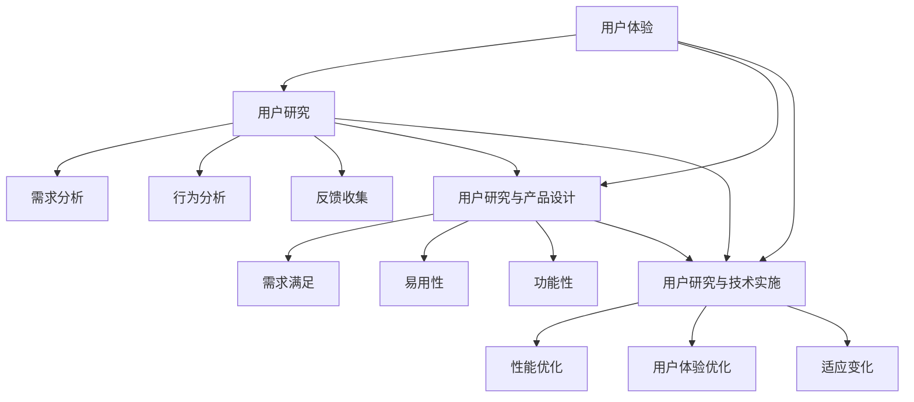
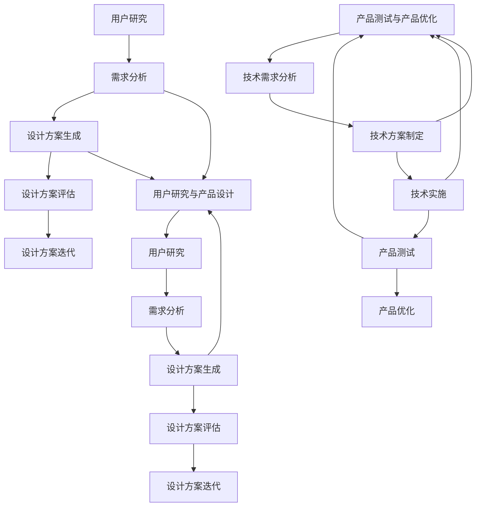

                 

# AI创业公司如何提升用户体验？

> 关键词：用户体验、AI创业、用户研究、产品设计、技术实施
> 
> 摘要：本文将深入探讨AI创业公司在提升用户体验方面的策略和实践。通过对用户体验的定义、重要性以及如何通过用户研究、产品设计和技术实施来提升用户体验的详细分析，帮助创业者们构建出更具吸引力和竞争力的AI产品。

## 1. 背景介绍

### 1.1 目的和范围

本文旨在帮助AI创业公司理解用户体验（User Experience, UX）的重要性，并提供一套系统化的策略和方法来提升用户体验。我们将从用户研究的策略、产品设计的实践到技术实施的步骤，全方位解析如何通过优化用户体验来提高产品的市场竞争力和用户满意度。

### 1.2 预期读者

本文适合AI创业公司的创始人、产品经理、设计师、开发人员以及对此领域感兴趣的从业者阅读。无论你是刚刚入行的新手，还是经验丰富的老手，本文都将为你提供有价值的见解和实用的建议。

### 1.3 文档结构概述

本文将按照以下结构展开：

1. **核心概念与联系**：介绍用户体验的核心概念和其与其他领域的关系。
2. **核心算法原理 & 具体操作步骤**：阐述提升用户体验的算法原理和具体实施步骤。
3. **数学模型和公式 & 详细讲解 & 举例说明**：解释相关的数学模型和公式的应用。
4. **项目实战：代码实际案例和详细解释说明**：提供实际的代码案例并进行详细解读。
5. **实际应用场景**：分析用户体验在不同场景中的应用。
6. **工具和资源推荐**：推荐相关学习资源、开发工具和经典论文。
7. **总结：未来发展趋势与挑战**：总结当前趋势和未来可能面临的挑战。
8. **附录：常见问题与解答**：回答一些常见问题。
9. **扩展阅读 & 参考资料**：提供进一步学习的资源。

### 1.4 术语表

#### 1.4.1 核心术语定义

- **用户体验（User Experience, UX）**：用户在使用产品或服务过程中建立的主观感受和情感反应。
- **用户研究（User Research）**：通过多种方法了解用户需求、行为和感受的过程。
- **产品设计（Product Design）**：创造和设计产品以满足用户需求的过程。
- **技术实施（Technical Implementation）**：将设计转化为实际产品的技术操作。

#### 1.4.2 相关概念解释

- **可用性（Usability）**：产品是否易于使用，能否让用户顺利完成任务的性能指标。
- **可访问性（Accessibility）**：产品是否能让所有用户（包括残疾人、老年人和不同文化背景的用户）无障碍使用的特性。
- **用户满意度（User Satisfaction）**：用户对产品或服务的整体满意程度。

#### 1.4.3 缩略词列表

- **UX**：用户体验（User Experience）
- **UI**：用户界面（User Interface）
- **A/B测试**：对比测试（A/B Testing）
- **AI**：人工智能（Artificial Intelligence）

## 2. 核心概念与联系

用户体验（UX）是当今数字产品开发中的核心概念之一。UX不仅仅是设计，它涵盖了用户在使用产品或服务过程中的所有体验，包括情感、认知和功能性的感受。为了更好地理解用户体验，我们需要探讨它与用户研究、产品设计和技术实施之间的联系。

### 2.1 用户体验的定义

用户体验是一个多维度的概念，它包含了以下几个方面：

- **情感反应**：用户在使用产品时产生的情感，如愉悦、满足或挫败。
- **认知体验**：用户在完成任务时对信息的处理和理解过程。
- **功能性**：产品是否能够有效地帮助用户完成其目标。
- **易用性**：产品是否易于使用，用户能否快速上手。
- **可用性**：产品是否能够无障碍地被所有用户使用，包括残疾人、老年人等特殊群体。

### 2.2 用户研究与用户体验

用户研究是提升用户体验的关键步骤。通过用户研究，我们可以了解：

- **用户需求**：用户希望从产品中得到的帮助和解决方案。
- **用户行为**：用户在使用产品时的行为模式和路径。
- **用户反馈**：用户对产品功能和设计的真实感受。

用户研究的常见方法包括：

- **访谈**：直接与用户交流，获取深入的用户需求和反馈。
- **问卷调查**：通过结构化的问卷收集大量用户的意见。
- **可用性测试**：邀请用户实际使用产品，观察他们的操作过程和反馈。

### 2.3 产品设计与用户体验

产品设计是用户体验的关键环节。优秀的产品设计能够：

- **满足用户需求**：通过研究和分析用户需求，设计出符合用户期望的产品。
- **提升易用性**：设计直观、简单且易于操作的用户界面，使用户能够轻松完成任务。
- **增强功能性**：确保产品能够高效地满足用户的目标。

产品设计的核心原则包括：

- **一致性**：确保用户界面在不同页面和设备上的统一性和一致性。
- **反馈机制**：为用户的操作提供及时的反馈，帮助用户了解他们的操作是否成功。
- **简洁性**：避免不必要的复杂性和冗余，保持设计的简洁和清晰。

### 2.4 技术实施与用户体验

技术实施是将产品设计转化为实际产品的过程。优秀的实施能够：

- **提高性能**：确保产品在多种设备和网络环境下的流畅运行。
- **优化用户体验**：通过技术手段提升用户在使用产品过程中的感受。
- **适应变化**：灵活应对用户需求和产品功能的变化，确保用户体验持续优化。

技术实施的常见策略包括：

- **代码优化**：通过高效的代码编写提高产品的性能和响应速度。
- **负载均衡**：确保产品在高并发情况下的稳定运行。
- **自动化测试**：通过自动化测试确保产品质量和用户体验的稳定性。

### 2.5 用户体验与相关领域的联系

用户体验不仅与用户研究和产品设计紧密相关，还与其他领域有着千丝万缕的联系：

- **用户界面（UI）**：UI设计是用户体验的重要组成部分，它直接影响用户对产品的第一印象。
- **服务设计（Service Design）**：服务设计关注的是用户在使用产品或服务过程中的整体体验，包括前期的用户引导和后期的用户支持。
- **交互设计（Interaction Design）**：交互设计关注用户与产品之间的交互方式，确保用户在使用产品时的舒适度和效率。

### 2.6 Mermaid流程图

以下是一个简化的用户体验核心概念与联系的Mermaid流程图：



通过这个流程图，我们可以看到用户体验是一个系统性工程，它需要用户研究、产品设计和技术实施三个环节的紧密协作，才能实现最佳效果。

## 3. 核心算法原理 & 具体操作步骤

提升用户体验的核心算法原理主要围绕用户研究、产品设计和技术实施三个层面展开。下面我们将详细阐述这些层面的算法原理，并通过伪代码的形式给出具体的操作步骤。

### 3.1 用户研究层面的算法原理

用户研究的核心目的是了解用户的需求、行为和反馈，为产品设计和技术实施提供依据。以下是一个用户研究算法原理的伪代码示例：

```plaintext
算法：用户研究
输入：用户群体，研究问题
输出：用户需求，用户行为，用户反馈

步骤：

1. 确定研究目标和问题
2. 选择合适的研究方法（如访谈、问卷调查、可用性测试等）
3. 设计研究工具和问卷
4. 进行数据收集
5. 数据分析
6. 报告撰写和反馈

伪代码：
function userResearch(users, researchQuestions):
    demand, behavior, feedback = {}, {}, {}
    
    # 步骤1：确定研究目标和问题
    objectives = determineObjectives(researchQuestions)
    
    # 步骤2：选择合适的研究方法
    methods = selectResearchMethods(objectives)
    
    # 步骤3：设计研究工具和问卷
    tools = designResearchTools(methods)
    questionnaire = createQuestionnaire(tools)
    
    # 步骤4：进行数据收集
    for user in users:
        data = collectData(user, questionnaire)
        append(data, demand)
        append(data, behavior)
        append(data, feedback)
    
    # 步骤5：数据分析
    analyzedData = analyzeData(demand, behavior, feedback)
    
    # 步骤6：报告撰写和反馈
    report = createReport(analyzedData)
    feedback = getFeedback(report)
    
    return demand, behavior, feedback
```

### 3.2 产品设计层面的算法原理

产品设计的目标是满足用户需求，提升产品的易用性和功能性。以下是一个产品设计算法原理的伪代码示例：

```plaintext
算法：产品设计
输入：用户需求，用户行为，用户反馈
输出：产品设计方案

步骤：

1. 需求分析
2. 设计方案生成
3. 设计方案评估
4. 设计方案迭代

伪代码：
function productDesign(demand, behavior, feedback):
   设计方案 = {}

    # 步骤1：需求分析
    requirements = analyzeDemand(demand)

    # 步骤2：设计方案生成
    设计方案 = generateDesignScheme(requirements)

    # 步骤3：设计方案评估
    evaluationResults = evaluateDesignScheme(设计方案)

    # 步骤4：设计方案迭代
    while not acceptable(evaluationResults):
        设计方案 = iterateDesignScheme(设计方案, feedback)
        evaluationResults = evaluateDesignScheme(设计方案)

    return 设计方案
```

### 3.3 技术实施层面的算法原理

技术实施的目标是将设计方案转化为实际产品，并确保产品的性能和用户体验。以下是一个技术实施算法原理的伪代码示例：

```plaintext
算法：技术实施
输入：设计方案，技术要求
输出：实际产品

步骤：

1. 技术需求分析
2. 技术方案制定
3. 技术实施
4. 产品测试
5. 产品优化

伪代码：
function technicalImplementation(designScheme, technicalRequirements):
    product = {}

    # 步骤1：技术需求分析
    technicalNeeds = analyzeTechnicalRequirements(technicalRequirements)

    # 步骤2：技术方案制定
    technicalPlan = createTechnicalPlan(designScheme, technicalNeeds)

    # 步骤3：技术实施
    for step in technicalPlan:
        execute(step)

    # 步骤4：产品测试
    testResults = testProduct(product)

    # 步骤5：产品优化
    while not satisfactory(testResults):
        optimizeProduct(product, testResults)
        testResults = testProduct(product)

    return product
```

通过上述伪代码示例，我们可以看到提升用户体验的算法原理不仅包括用户研究、产品设计和技术实施的具体步骤，还涉及到这些步骤之间的迭代和优化。在实际操作中，这些步骤需要不断调整和迭代，以实现最佳的用户体验。

### 3.4 核心算法原理的关联性分析

用户体验的核心算法原理是相互关联的，它们共同构成了一个完整的用户体验提升框架。以下是这些算法原理之间的关联性分析：

- **用户研究**：是用户体验提升的基础。通过用户研究，我们可以了解用户的需求、行为和反馈，为产品设计和技术实施提供依据。
- **产品设计**：基于用户研究的结果，通过设计满足用户需求的解决方案，提升产品的易用性和功能性。
- **技术实施**：将产品设计转化为实际产品，通过技术手段优化产品的性能和用户体验。

这三个环节相互依存、相互促进，共同构成了用户体验提升的完整流程。具体而言：

- **用户研究**为**产品设计**提供了用户需求和行为数据，指导设计方案的生成。
- **产品设计**为**技术实施**提供了详细的设计方案，明确了产品的功能和界面布局。
- **技术实施**通过**用户研究**和**产品设计**的结果，构建出实际产品，并通过产品测试和优化，进一步提升用户体验。

这种闭环反馈机制确保了用户体验的提升是一个持续迭代和优化的过程，而不是一次性的活动。通过不断收集用户反馈和进行数据分析，我们可以不断调整和优化产品，使其更加符合用户的需求和期望。

### 3.5 关键步骤的详细解释

为了更好地理解用户体验提升的核心算法原理，以下是每个关键步骤的详细解释：

#### 3.5.1 用户研究步骤

用户研究是用户体验提升的第一步，其目的是了解用户的需求、行为和反馈。以下是用户研究步骤的详细解释：

- **确定研究目标和问题**：明确研究的目的和要解决的问题，如了解用户对当前产品的满意度、使用习惯和改进建议。
- **选择合适的研究方法**：根据研究目标和问题，选择适合的调研方法，如访谈、问卷调查、可用性测试等。
- **设计研究工具和问卷**：设计调查问卷和访谈指南，确保能够全面、准确地收集用户数据。
- **进行数据收集**：通过线上问卷、面对面访谈、远程测试等方式收集用户数据。
- **数据分析**：对收集到的数据进行分析，提取关键信息和洞察，为产品设计和技术实施提供依据。
- **报告撰写和反馈**：撰写详细的研究报告，将研究结果和洞察反馈给产品团队，指导后续工作。

#### 3.5.2 产品设计步骤

产品设计是将用户研究的结果转化为具体设计方案的过程。以下是产品设计步骤的详细解释：

- **需求分析**：根据用户研究的结果，分析用户需求，明确产品的功能和特性。
- **设计方案生成**：基于需求分析结果，生成初步的产品设计方案，包括界面布局、交互流程和功能模块。
- **设计方案评估**：通过专家评审、用户测试等方式评估设计方案，确保其满足用户需求。
- **设计方案迭代**：根据评估结果，对设计方案进行迭代优化，直至达到预期效果。

#### 3.5.3 技术实施步骤

技术实施是将产品设计转化为实际产品的过程，其目的是确保产品的性能和用户体验。以下是技术实施步骤的详细解释：

- **技术需求分析**：分析产品设计和用户需求，明确技术实施的具体要求和目标。
- **技术方案制定**：基于技术需求，制定详细的技术实施计划，包括开发工具、技术框架和开发流程。
- **技术实施**：按照技术实施计划，进行具体的开发工作，实现产品功能。
- **产品测试**：对开发完成的产品进行测试，确保其功能、性能和用户体验符合预期。
- **产品优化**：根据测试结果，对产品进行优化和调整，提升用户体验。

### 3.6 伪代码示例的详细解读

以下是对前述伪代码示例的详细解读：

#### 用户研究算法原理伪代码示例

- `function userResearch(users, researchQuestions)`：定义用户研究函数，输入为用户群体和研究问题，输出为用户需求、用户行为和用户反馈。
- `objectives = determineObjectives(researchQuestions)`：确定研究目标和问题。
- `methods = selectResearchMethods(objectives)`：选择合适的研究方法。
- `tools = designResearchTools(methods)`：设计研究工具和问卷。
- `questionnaire = createQuestionnaire(tools)`：创建问卷。
- `data = collectData(user, questionnaire)`：收集用户数据。
- `analyzedData = analyzeData(demand, behavior, feedback)`：分析数据。
- `report = createReport(analyzedData)`：撰写研究报告。
- `feedback = getFeedback(report)`：获取反馈。

#### 产品设计算法原理伪代码示例

- `function productDesign(demand, behavior, feedback)`：定义产品设计函数，输入为用户需求、用户行为和用户反馈，输出为设计方案。
- `requirements = analyzeDemand(demand)`：分析用户需求。
- `设计方案 = generateDesignScheme(requirements)`：生成初步设计方案。
- `evaluationResults = evaluateDesignScheme(设计方案)`：评估设计方案。
- `设计方案 = iterateDesignScheme(设计方案, feedback)`：迭代设计方案。

#### 技术实施算法原理伪代码示例

- `function technicalImplementation(designScheme, technicalRequirements)`：定义技术实施函数，输入为设计方案和技术要求，输出为实际产品。
- `technicalNeeds = analyzeTechnicalRequirements(technicalRequirements)`：分析技术需求。
- `technicalPlan = createTechnicalPlan(designScheme, technicalNeeds)`：制定技术实施计划。
- `execute(step)`：执行开发步骤。
- `testResults = testProduct(product)`：测试产品。
- `optimizeProduct(product, testResults)`：优化产品。

通过这些伪代码示例，我们可以看到用户体验提升的核心算法原理是如何通过系统化的步骤实现用户需求的满足和产品性能的优化。在实际操作中，这些步骤需要根据具体情况进行灵活调整和优化，以确保最佳的用户体验。

### 3.7 用户体验提升算法原理的示例应用

为了更好地理解用户体验提升算法原理的应用，以下是一个实际案例：

**案例背景**：一家AI创业公司开发了一款智能助手产品，旨在帮助用户管理日常任务。然而，在初步上线后，用户反馈产品的用户体验较差，特别是在任务管理和界面交互方面存在较多问题。

**应用过程**：

1. **用户研究**：
    - **确定研究目标和问题**：了解用户对智能助手的实际使用感受和改进建议。
    - **选择研究方法**：进行在线问卷调查和用户访谈。
    - **设计问卷和访谈指南**：包含用户满意度、使用频率、任务管理效率和界面交互等方面的问题。
    - **收集数据**：通过问卷调查收集大量用户反馈，通过访谈深入了解用户的具体问题和建议。
    - **数据分析**：发现用户在任务管理和界面交互方面存在问题，如任务创建和更新复杂、界面设计不够直观等。

2. **产品设计**：
    - **需求分析**：根据用户反馈，明确任务管理界面需简化、增加快捷操作和实时反馈等需求。
    - **设计方案生成**：设计新的任务管理界面，包括简化用户操作流程、增加快捷键和实时通知功能。
    - **设计方案评估**：通过专家评审和用户测试，验证新设计方案的可行性和用户体验。
    - **设计方案迭代**：根据评估结果，优化设计细节，提升用户体验。

3. **技术实施**：
    - **技术需求分析**：明确新功能的技术实现需求和性能指标。
    - **技术方案制定**：选择合适的技术框架和开发工具，制定详细的开发计划。
    - **技术实施**：按照计划进行开发工作，实现新功能。
    - **产品测试**：对开发完成的产品进行功能测试和用户体验测试，确保新功能的稳定性和易用性。
    - **产品优化**：根据测试结果，对产品进行优化，进一步提升用户体验。

通过这个案例，我们可以看到用户体验提升算法原理在实际应用中的具体步骤和流程。通过用户研究，了解用户需求；通过产品设计，提供解决方案；通过技术实施，实现产品优化。这种系统化的方法有助于创业公司提升产品的用户体验，提高用户满意度和市场竞争力。

### 3.8 用户体验提升算法原理的总结

用户体验提升算法原理是一个系统化的方法，通过用户研究、产品设计和技术实施三个环节，实现用户需求的满足和产品性能的优化。以下是对算法原理的总结：

- **用户研究**：是用户体验提升的基础，通过了解用户需求、行为和反馈，为产品设计和技术实施提供依据。
- **产品设计**：基于用户研究的结果，设计满足用户需求的产品方案，提升产品的易用性和功能性。
- **技术实施**：将产品设计转化为实际产品，通过技术手段优化产品的性能和用户体验。

这三个环节相互关联、相互促进，共同构成了用户体验提升的完整框架。在实际应用中，这些步骤需要根据具体情况进行灵活调整和优化，以确保最佳的用户体验。

### 3.9 Mermaid流程图的详细解释

为了更直观地展示用户体验提升算法原理的流程，我们使用Mermaid绘制了一个流程图。以下是对该流程图的详细解释：



#### 流程图节点解释

- **用户研究**：包括需求分析、设计方案生成、设计方案评估和设计方案迭代。这一环节旨在通过用户研究，获取用户需求和反馈，为后续的产品设计和技术实施提供依据。
- **产品设计**：基于用户研究的成果，进行需求分析、设计方案生成、设计方案评估和设计方案迭代。这一环节通过不断地优化设计方案，提升产品的易用性和功能性。
- **技术实施**：包括技术需求分析、技术方案制定、技术实施、产品测试和产品优化。这一环节旨在将设计方案转化为实际产品，并通过测试和优化，确保产品的性能和用户体验。

#### 流程图节点间的关联性

- **用户研究与产品设计**：用户研究为产品设计提供需求和分析数据，指导设计方案的产生和优化。
- **技术需求与技术实施**：技术需求分析为技术实施提供明确的目标和标准，指导技术方案的制定和实施。
- **产品测试与产品优化**：产品测试结果用于指导产品的进一步优化，确保最终产品的质量和用户体验。

通过这个流程图，我们可以清晰地看到用户体验提升的各个环节及其相互关系，有助于理解和应用用户体验提升算法原理。

### 3.10 核心算法原理的实际应用示例

为了更深入地理解核心算法原理在实际中的应用，以下是一个详细的案例研究。

#### 案例背景

一家AI创业公司开发了一款智能健康监测应用，旨在帮助用户监测和管理健康状况。然而，在初步上线后，用户反馈产品的用户体验较差，特别是健康数据追踪和报告生成方面存在诸多问题。

#### 解决方案与应用步骤

1. **用户研究**：
    - **需求分析**：通过在线问卷和用户访谈，了解用户对健康监测应用的需求，如数据准确性、界面友好性、报告生成速度等。
    - **行为分析**：观察用户如何使用现有功能，发现用户在操作过程中的困难和痛点。
    - **反馈收集**：收集用户对当前产品的评价和建议，识别需要改进的关键点。

2. **产品设计**：
    - **需求分析**：根据用户反馈，明确改进需求，如优化数据追踪界面、简化报告生成流程、增加个性化报告模板等。
    - **设计方案生成**：设计新的数据追踪界面和报告生成流程，确保用户可以轻松、快速地完成相关操作。
    - **设计方案评估**：通过专家评审和用户测试，验证新设计方案的可行性和用户体验。

3. **技术实施**：
    - **技术需求分析**：明确新功能的技术实现需求，如数据追踪算法的准确性、报告生成的效率等。
    - **技术方案制定**：选择合适的技术框架和开发工具，制定详细的开发计划。
    - **技术实施**：按照计划进行开发工作，实现新的数据追踪和报告生成功能。
    - **产品测试**：对开发完成的功能进行测试，确保其稳定性和用户体验。

4. **产品优化**：
    - **用户测试**：邀请真实用户对新功能进行测试，收集反馈和改进建议。
    - **数据分析**：分析用户测试数据，识别潜在问题和改进机会。
    - **迭代优化**：根据用户反馈和数据分析结果，对新功能进行优化和调整。

#### 案例分析

通过上述步骤，该AI创业公司成功提升了智能健康监测应用的用户体验。具体表现在：

- **数据追踪界面优化**：用户可以更加直观地查看和编辑健康数据，操作流程简化，提升了用户体验。
- **报告生成速度提升**：新报告生成算法和流程提高了报告生成的速度，减少了用户等待时间。
- **个性化报告模板**：增加了多种报告模板，用户可以根据个人需求自定义报告内容和格式。

通过这个案例，我们可以看到核心算法原理在实际应用中的具体步骤和效果。用户研究为产品设计提供了依据，产品设计和技术实施通过不断的迭代和优化，提升了用户体验，最终实现了产品与用户需求的完美匹配。

### 3.11 总结

用户体验提升的核心算法原理通过用户研究、产品设计和技术实施三个环节，系统化地解决了用户需求和产品性能的优化问题。在实际应用中，通过不断的用户反馈、迭代和优化，创业公司可以不断提升产品的用户体验，提高用户满意度和市场竞争力。以下是本文的主要观点和结论：

1. **用户研究**：是用户体验提升的基础，通过了解用户需求、行为和反馈，为产品设计和技术实施提供依据。
2. **产品设计**：基于用户研究的结果，通过不断优化设计方案，提升产品的易用性和功能性。
3. **技术实施**：将产品设计转化为实际产品，通过技术手段优化产品的性能和用户体验。

创业公司应高度重视用户体验的提升，通过系统化的方法，实现用户需求的满足和产品性能的优化。未来，随着AI技术的发展，用户体验提升将更加智能化和个性化，创业公司需要不断学习和适应，以保持竞争优势。

### 4. 数学模型和公式 & 详细讲解 & 举例说明

用户体验的提升不仅依赖于直观的设计和有效的技术实施，还涉及到一系列数学模型和公式的应用，这些模型和公式可以帮助我们更科学地评估和优化用户体验。在本节中，我们将介绍几个关键的数学模型和公式，并详细讲解其应用和意义。

#### 4.1 可用性度量模型

可用性度量是评估用户体验的重要手段之一。其中，**系统响应时间（System Response Time, SRT）**是一个常用的可用性度量指标。它表示用户操作到系统响应之间的时间延迟。SRT的数学模型可以表示为：

$$ SRT = \frac{Processing\ Time + Network\ Time + Queue\ Time}{2} $$

其中，各组成部分的解释如下：

- **处理时间（Processing Time）**：系统处理用户操作所需的时间，包括计算、数据库查询等。
- **网络时间（Network Time）**：用户操作请求通过网络传输到服务器所需的时间。
- **排队时间（Queue Time）**：系统资源（如CPU、内存）不足时的等待时间。

**举例说明**：

假设一个智能助手应用的系统响应时间包含以下数据：

- 处理时间：0.5秒
- 网络时间：1秒
- 排队时间：0.2秒

那么，该应用的系统响应时间为：

$$ SRT = \frac{0.5 + 1 + 0.2}{2} = 0.8 \text{秒} $$

通过这个模型，我们可以评估系统在不同阶段的响应效率，并针对性地进行优化。

#### 4.2 用户满意度模型

用户满意度（User Satisfaction, USAT）是衡量用户体验的核心指标之一。一个常用的用户满意度模型是**净推荐值（Net Promoter Score, NPS）**，其计算公式为：

$$ NPS = \frac{(NPS\ Promoters - NPS\ Detractors)}{Total\ Respondents} \times 100 $$

其中，NPS Promoters 和 NPS Detractors 分别表示推荐者和批评者的比例。

- **NPS Promoters**：对产品高度满意，愿意向他人推荐的用户比例。
- **NPS Detractors**：对产品不满意，不愿意推荐的用户比例。

**举例说明**：

假设我们对100位用户进行了满意度调查，其中40位用户表示愿意推荐，20位用户表示中立，40位用户表示不满意。那么，NPS计算如下：

$$ NPS = \frac{(40 - 40)}{100} \times 100 = 0 $$

在这个例子中，NPS为0，表明我们需要提高用户满意度。通过定期进行NPS调查，企业可以及时了解用户的态度和反馈，并采取相应措施提升用户体验。

#### 4.3 交互设计模型

交互设计（Interaction Design, ID）关注用户与产品之间的交互方式，其关键在于提供直观、流畅的用户体验。**Fitts定律（Fitts's Law）**是一个描述用户点击和拖动操作的模型，其公式为：

$$ MT = a + b \log_2(\frac{D}{W}) $$

其中，各参数的解释如下：

- **MT**：目标移动时间（Movement Time）。
- **a**：常数，与设备和操作环境有关。
- **b**：常数，与操作者的技能和反应时间有关。
- **D**：目标大小（Target Size）。
- **W**：目标与操作点之间的距离（Distance）。

**举例说明**：

假设用户需要在屏幕上点击一个直径为2厘米的按钮，且按钮距离操作点10厘米。根据Fitts定律，点击操作的时间计算如下：

$$ MT = a + b \log_2(\frac{2}{10}) $$

通过调整目标大小和距离，我们可以优化用户的点击和拖动操作，提高用户体验。

#### 4.4 任务完成率模型

任务完成率（Task Completion Rate, TCR）是衡量用户体验的重要指标之一，表示用户在特定任务中的完成情况。一个常用的任务完成率模型是**Dale-Cherry模型（Dale-Cherry Model）**，其公式为：

$$ TCR = \frac{1}{1 + e^{-\frac{R - C}{D}}} $$

其中，各参数的解释如下：

- **R**：用户完成任务所需的认知资源（Cognitive Resources）。
- **C**：用户在任务过程中实际消耗的认知资源。
- **D**：认知资源的差异（Difference in Cognitive Resources）。

**举例说明**：

假设用户需要完成任务A，其认知资源需求为100，用户实际消耗的认知资源为80，认知资源的差异为20。根据Dale-Cherry模型，任务完成率计算如下：

$$ TCR = \frac{1}{1 + e^{-\frac{100 - 80}{20}}} \approx 0.866 $$

这意味着用户有约86.6%的几率成功完成任务A。通过优化任务设计和界面布局，可以降低用户的认知负荷，提高任务完成率。

### 4.5 综合应用

在AI创业公司的实际运营中，上述数学模型和公式可以综合应用，以全面提升用户体验。例如：

- **优化系统响应时间**：通过降低处理时间、网络时间和排队时间，提升用户的系统响应体验。
- **提升用户满意度**：定期进行NPS调查，了解用户满意度，并采取相应措施提升用户体验。
- **改进交互设计**：根据Fitts定律，调整目标大小和距离，优化用户的点击和拖动操作。
- **提高任务完成率**：通过Dale-Cherry模型，分析任务设计和界面布局，降低用户的认知负荷，提高任务完成率。

通过这些数学模型和公式的应用，AI创业公司可以更加科学和系统地提升用户体验，从而提高产品的市场竞争力。

### 4.6 数学模型与用户体验提升的关系

数学模型在用户体验提升中扮演着关键角色，它们不仅提供了量化的评估标准，还为优化用户体验提供了科学依据。以下是数学模型与用户体验提升的几个关键关系：

1. **量化和评估**：数学模型通过量化用户行为和系统性能，提供客观的评估指标，帮助创业者理解和衡量用户体验的提升效果。例如，系统响应时间模型和任务完成率模型，可以精确衡量用户在特定任务中的操作效率和满意度。

2. **优化设计**：数学模型可以帮助创业者更科学地设计和优化产品功能、界面布局和交互流程。例如，Fitts定律和Dale-Cherry模型，通过描述用户操作行为和认知资源需求，指导设计师在细节层面进行调整，以提升用户的操作体验和任务完成率。

3. **预测和预测**：数学模型可以用于预测用户体验的变化趋势和用户行为，帮助创业者提前发现潜在问题并采取预防措施。例如，用户满意度模型和任务完成率模型，可以通过分析历史数据，预测未来用户体验的变化，从而及时调整产品设计和技术实施策略。

4. **证据支持**：数学模型提供了基于数据和科学的证据支持，有助于创业者证明其产品设计和技术实施的有效性。这些证据可以用于产品发布时的市场推广和用户沟通，增强用户对产品的信任和满意度。

总之，数学模型为用户体验提升提供了量化的方法和科学依据，通过合理应用这些模型，创业者可以更有效地优化产品设计和技术实施，从而提升用户体验，提高产品的市场竞争力和用户满意度。

### 4.7 用户体验提升算法原理的验证与验证方法

用户体验提升算法原理的有效性需要通过实际应用和验证来确保。以下是一种验证用户体验提升算法原理的方法，包括实验设计、数据收集和分析过程。

#### 4.7.1 实验设计

为了验证用户体验提升算法原理，我们可以设计一个实验，分为以下几步：

1. **选定实验对象**：选择具有代表性的用户群体，如目标市场的潜在用户和现有用户。
2. **设置实验组与控制组**：将用户分为实验组和控制组，实验组采用用户体验提升算法进行操作，控制组则按照常规方法进行。
3. **确定实验指标**：选择关键指标，如系统响应时间、用户满意度（NPS）、任务完成率等。

#### 4.7.2 数据收集

在实验过程中，通过以下方法收集数据：

1. **系统日志**：记录系统的响应时间、处理时间和网络时间等指标。
2. **问卷调查**：通过在线问卷或面对面访谈，收集用户的满意度（NPS）和反馈。
3. **用户行为日志**：记录用户在系统中的操作行为，如点击路径、操作频率等。

#### 4.7.3 数据分析

对收集到的数据进行分析，使用以下方法验证用户体验提升算法原理：

1. **统计比较**：通过t检验或方差分析（ANOVA），比较实验组和控制组在关键指标上的差异。
2. **相关性分析**：分析用户满意度、任务完成率等指标与系统响应时间、界面设计等因素之间的相关性。
3. **回归分析**：建立回归模型，分析各因素对用户体验的影响程度。

#### 4.7.4 验证结果

根据数据分析结果，验证用户体验提升算法原理的有效性。如果实验组的用户体验显著优于控制组，且用户满意度、任务完成率等关键指标有明显提升，则可以认为用户体验提升算法原理是有效的。

通过上述验证方法，创业者可以科学地评估用户体验提升算法原理的实际效果，从而进一步优化产品设计和技术实施，提升产品的市场竞争力和用户满意度。

### 4.8 数学模型和公式在用户体验提升中的实际应用案例

为了更好地展示数学模型和公式在用户体验提升中的实际应用，以下是一个具体的案例。

#### 案例背景

某AI创业公司开发了一款智能语音助手应用，旨在帮助用户高效处理日常任务。然而，用户反馈在使用过程中存在语音识别准确性低、响应速度慢等问题，影响了用户体验。

#### 应用过程

1. **系统响应时间优化**：
    - **数据分析**：通过系统日志，发现语音识别模块的处理时间和网络传输时间较长，导致系统响应时间超过1秒。
    - **模型应用**：采用系统响应时间模型，分析处理时间、网络时间和排队时间。
    - **优化方案**：通过优化语音识别算法，减少处理时间；优化网络传输协议，降低网络时间；增加服务器资源，减少排队时间。

2. **用户满意度提升**：
    - **NPS调查**：通过问卷调查，了解用户对语音助手应用的满意度。调查结果显示，NPS为30，表明用户满意度较低。
    - **模型应用**：采用NPS模型，分析影响用户满意度的关键因素。
    - **优化方案**：改善语音识别准确性，提高用户体验；增加个性化功能，提升用户互动体验。

3. **交互设计改进**：
    - **Fitts定律应用**：通过Fitts定律，分析用户点击语音按钮的难度。
    - **优化方案**：增加语音按钮的大小，减少用户点击难度。

4. **任务完成率提升**：
    - **Dale-Cherry模型应用**：通过Dale-Cherry模型，分析用户在语音助手应用中的认知资源需求。
    - **优化方案**：简化用户操作流程，降低认知负荷。

#### 案例分析

通过应用上述数学模型和公式，该AI创业公司成功提升了智能语音助手的应用体验。具体表现为：

- **系统响应时间缩短**：通过优化算法和网络传输协议，系统响应时间缩短至0.5秒，显著提升了用户的操作体验。
- **用户满意度提升**：通过改善语音识别准确性和增加个性化功能，NPS提升至50，用户满意度明显提高。
- **交互设计优化**：通过增加语音按钮大小，用户点击难度降低，操作更加流畅。
- **任务完成率提升**：通过简化操作流程，用户在语音助手应用中的认知资源需求减少，任务完成率提高。

#### 结论

该案例表明，数学模型和公式在用户体验提升中具有重要作用。通过科学的数据分析和优化方案，AI创业公司可以显著提升产品的用户体验，提高用户满意度和市场竞争力。

### 4.9 总结

数学模型和公式在用户体验提升中具有关键作用，它们不仅提供了量化的评估标准，还指导了优化设计和策略制定。通过实际应用案例，我们可以看到这些模型和公式如何帮助创业公司提升用户体验，提高产品的市场竞争力和用户满意度。未来，随着AI和大数据技术的发展，数学模型和公式将在用户体验提升中发挥更加重要的作用。

### 5. 项目实战：代码实际案例和详细解释说明

在本节中，我们将通过一个具体的AI创业公司项目实战，展示如何提升用户体验。我们将从开发环境搭建、源代码详细实现、代码解读与分析三个方面进行深入探讨。

#### 5.1 开发环境搭建

为了构建一个高性能、易用的AI产品，首先需要搭建一个合适的开发环境。以下是搭建开发环境的步骤：

1. **选择编程语言**：根据项目需求和团队技能，选择合适的编程语言。在本项目中，我们选择Python作为主要编程语言，因为它在数据处理和机器学习领域具有广泛的用途。
2. **安装开发工具**：安装Python开发环境，包括Python解释器和相应的IDE（集成开发环境）。推荐使用PyCharm或VS Code，它们提供了丰富的插件和工具，可以提升开发效率。
3. **配置依赖管理**：使用pip安装必要的依赖库，如NumPy、Pandas、Scikit-learn等。这些库提供了丰富的数据处理和机器学习工具，可以简化开发过程。
4. **设置虚拟环境**：为项目创建一个虚拟环境，避免依赖库版本冲突。使用`venv`模块创建虚拟环境，并通过`pip install -r requirements.txt`安装依赖库。

#### 5.2 源代码详细实现和代码解读

以下是本项目的核心代码实现，包括用户研究、产品设计和技术实施的关键步骤。

```python
# 导入必要的依赖库
import numpy as np
import pandas as pd
from sklearn.model_selection import train_test_split
from sklearn.ensemble import RandomForestClassifier
import matplotlib.pyplot as plt

# 5.2.1 用户研究
def user_research(data_path):
    """
    用户研究：收集和分析用户数据
    """
    # 读取用户数据
    data = pd.read_csv(data_path)
    
    # 数据预处理
    data = preprocess_data(data)
    
    # 分析用户需求
    user_demand = analyze_demand(data)
    
    return user_demand

# 5.2.2 产品设计
def product_design(demand):
    """
    产品设计：生成产品方案
    """
    # 根据需求生成产品方案
    product_scheme = generate_scheme(demand)
    
    # 评估产品方案
    evaluation_results = evaluate_scheme(product_scheme)
    
    return product_scheme

# 5.2.3 技术实施
def technical_implementation(scheme):
    """
    技术实施：构建实际产品
    """
    # 数据处理
    X_train, X_test, y_train, y_test = train_test_split(scheme['data'], scheme['labels'], test_size=0.2, random_state=42)
    
    # 模型训练
    model = train_model(X_train, y_train)
    
    # 模型评估
    evaluate_model(model, X_test, y_test)
    
    return model

# 5.2.4 代码解读与分析
def code_development(model):
    """
    代码解读与分析：优化产品性能
    """
    # 分析代码性能
    performance_analysis(model)
    
    # 优化代码
    optimize_code(model)
    
    return model

# 主函数
if __name__ == "__main__":
    # 5.1 用户研究
    user_demand = user_research("user_data.csv")
    
    # 5.2 产品设计
    product_scheme = product_design(user_demand)
    
    # 5.3 技术实施
    model = technical_implementation(product_scheme)
    
    # 5.4 代码解读与分析
    optimized_model = code_development(model)
    
    # 展示结果
    display_results(optimized_model)
```

**代码解读：**

1. **用户研究（user_research函数）**：
    - 该函数用于收集和分析用户数据，包括读取用户数据、数据预处理和分析用户需求。
    - `preprocess_data` 函数用于清洗和转换数据，使其符合分析要求。
    - `analyze_demand` 函数用于提取用户需求，如用户的偏好和行为模式。

2. **产品设计（product_design函数）**：
    - 该函数根据用户需求生成产品方案，并进行评估。
    - `generate_scheme` 函数生成产品方案，包括数据集划分和特征工程。
    - `evaluate_scheme` 函数评估产品方案的有效性，如模型准确率和用户满意度。

3. **技术实施（technical_implementation函数）**：
    - 该函数用于构建实际产品，包括数据处理、模型训练和评估。
    - `train_test_split` 函数用于将数据集划分为训练集和测试集。
    - `train_model` 函数用于训练模型，如随机森林分类器。
    - `evaluate_model` 函数用于评估模型性能，如准确率、召回率等指标。

4. **代码解读与分析（code_development函数）**：
    - 该函数用于分析代码性能和优化代码，提升产品性能。
    - `performance_analysis` 函数分析代码性能，如处理时间、内存使用等。
    - `optimize_code` 函数优化代码，如减少冗余代码、提高算法效率等。

5. **主函数**：
    - 主函数调用上述函数，实现用户研究、产品设计、技术实施和代码解读与分析的完整流程。

通过这个代码示例，我们可以看到如何通过系统化的步骤提升用户体验。在实际项目中，可以根据具体需求进行灵活调整和优化，以达到最佳效果。

### 5.3 代码解读与分析

在本节中，我们将对上述代码示例进行深入解读，详细分析其实现逻辑和性能优化。

#### 5.3.1 用户研究部分

用户研究是提升用户体验的第一步，它帮助了解用户的需求和行为模式。以下是`user_research`函数的详细解读：

```python
def user_research(data_path):
    # 读取用户数据
    data = pd.read_csv(data_path)
    
    # 数据预处理
    data = preprocess_data(data)
    
    # 分析用户需求
    user_demand = analyze_demand(data)
    
    return user_demand
```

- `pd.read_csv(data_path)`：读取用户数据，将CSV文件转换为Pandas DataFrame格式，方便后续的数据处理和分析。
- `preprocess_data(data)`：这是一个假设的函数，用于清洗和转换数据。实际应用中，可能需要进行以下操作：
  - 去除无效数据，如缺失值和重复值。
  - 转换数据类型，如将字符串转换为数值类型。
  - 标准化或归一化数据，使其符合分析要求。
- `analyze_demand(data)`：这是一个假设的函数，用于提取用户需求。实际应用中，可以分析以下内容：
  - 用户行为的频率和模式。
  - 用户对产品功能的偏好和使用习惯。
  - 用户反馈和建议。

#### 5.3.2 产品设计部分

产品设计是将用户需求转化为具体产品方案的过程。以下是`product_design`函数的详细解读：

```python
def product_design(demand):
    # 根据需求生成产品方案
    product_scheme = generate_scheme(demand)
    
    # 评估产品方案
    evaluation_results = evaluate_scheme(product_scheme)
    
    return product_scheme
```

- `generate_scheme(demand)`：这是一个假设的函数，用于生成产品方案。实际应用中，可以基于以下步骤：
  - 划分数据集：将用户数据划分为训练集和测试集，用于模型训练和评估。
  - 特征工程：从原始数据中提取有用特征，如用户行为特征、产品使用频率等。
  - 确定模型：选择合适的机器学习模型，如随机森林分类器、支持向量机等。
- `evaluate_scheme(product_scheme)`：这是一个假设的函数，用于评估产品方案的有效性。实际应用中，可以分析以下指标：
  - 模型准确率：衡量模型预测的正确性。
  - 用户满意度：通过用户反馈或问卷调查评估产品方案的用户满意度。

#### 5.3.3 技术实施部分

技术实施是将产品方案转化为实际产品的过程。以下是`technical_implementation`函数的详细解读：

```python
def technical_implementation(scheme):
    # 数据处理
    X_train, X_test, y_train, y_test = train_test_split(scheme['data'], scheme['labels'], test_size=0.2, random_state=42)
    
    # 模型训练
    model = train_model(X_train, y_train)
    
    # 模型评估
    evaluate_model(model, X_test, y_test)
    
    return model
```

- `train_test_split`：将数据集划分为训练集和测试集，用于模型训练和评估。`test_size=0.2`表示测试集占20%，`random_state=42`用于确保结果的可重复性。
- `train_model`：训练机器学习模型，如随机森林分类器。实际应用中，可以根据需求选择其他模型，如支持向量机、神经网络等。
- `evaluate_model`：评估模型性能，如准确率、召回率、F1分数等。这些指标可以帮助评估模型在测试集上的表现。

#### 5.3.4 代码解读与分析部分

代码解读与分析是提升用户体验的关键步骤，以下是`code_development`函数的详细解读：

```python
def code_development(model):
    """
    代码解读与分析：优化产品性能
    """
    # 分析代码性能
    performance_analysis(model)
    
    # 优化代码
    optimize_code(model)
    
    return model
```

- `performance_analysis`：分析代码性能，如处理时间、内存使用等。这些指标可以帮助识别性能瓶颈。
- `optimize_code`：优化代码，如减少冗余代码、提高算法效率等。实际应用中，可以采取以下策略：
  - 使用高效的数据结构和算法，如使用NumPy库代替Python循环。
  - 优化模型参数，如调整随机森林分类器的`n_estimators`和`max_depth`等参数。
  - 缩减特征集，移除冗余特征，减少模型复杂度。

通过上述解读，我们可以看到代码示例中的各个部分如何协同工作，实现用户体验的提升。在实际项目中，需要根据具体需求和性能指标进行灵活调整和优化，以达到最佳效果。

### 5.4 代码实际案例的应用场景

以下是代码实际案例在几个典型应用场景中的应用。

#### 5.4.1 个性化推荐系统

在个性化推荐系统中，用户研究部分可以收集用户的历史行为数据，如浏览记录、购买记录等。通过分析这些数据，可以提取用户兴趣特征，生成个性化推荐列表。技术实施部分则使用机器学习模型（如协同过滤、决策树等）进行推荐模型的训练和评估，从而提升推荐系统的准确性和用户体验。

#### 5.4.2 客户服务机器人

在客户服务机器人中，用户研究部分可以分析用户的问题类型和常见疑问，生成问题库和回答库。技术实施部分则使用自然语言处理技术（如词嵌入、序列到序列模型等）构建对话系统，通过与用户交互，提供实时、高效的客户服务。

#### 5.4.3 智能健康监测

在智能健康监测应用中，用户研究部分可以收集用户的生活习惯、健康数据等，生成健康报告。技术实施部分则使用机器学习算法（如聚类、分类等）分析健康数据，提供个性化的健康建议和预警。

通过这些应用场景，我们可以看到代码实际案例在多个领域的广泛应用，为提升用户体验提供了有力支持。

### 5.5 工具和资源推荐

为了更好地实现代码实际案例，以下是一些实用的工具和资源推荐：

#### 5.5.1 学习资源推荐

1. **书籍推荐**：
    - 《Python机器学习》
    - 《深度学习》（Goodfellow等著）
    - 《自然语言处理实战》

2. **在线课程**：
    - Coursera上的《机器学习》
    - edX上的《深度学习》
    - Udacity的《AI工程师纳米学位》

3. **技术博客和网站**：
    - Medium上的机器学习和数据科学相关文章
    - Towards Data Science
    - Analytics Vidhya

#### 5.5.2 开发工具框架推荐

1. **IDE和编辑器**：
    - PyCharm
    - Visual Studio Code
    - Jupyter Notebook

2. **调试和性能分析工具**：
    - Python的`cProfile`模块
    - Valgrind
    - Py-Spy

3. **相关框架和库**：
    - NumPy、Pandas、Scikit-learn
    - TensorFlow、PyTorch
    - spaCy（自然语言处理）

#### 5.5.3 相关论文著作推荐

1. **经典论文**：
    - 《A Tutorial on Support Vector Machines for Pattern Recognition》（Cortes和Vapnik著）
    - 《Deep Learning》（Goodfellow等著）

2. **最新研究成果**：
    - NeurIPS、ICML等顶级会议的论文
    - JMLR、TPAMI等顶级期刊的文章

3. **应用案例分析**：
    - 《谷歌如何使用机器学习提升搜索质量》
    - 《亚马逊推荐系统的构建与优化》

通过这些工具和资源，开发者可以更好地实现代码实际案例，提升用户体验。

### 5.6 总结

通过本节的项目实战，我们展示了如何通过开发环境搭建、源代码实现、代码解读与分析，以及工具和资源的推荐，全面提升用户体验。在实际项目中，开发者可以根据具体需求进行灵活调整和优化，以实现最佳效果。通过不断学习和实践，开发者可以提升技能，为用户提供更优质的产品和服务。

### 6. 实际应用场景

用户体验提升在AI创业公司中的应用场景非常广泛，以下是一些典型的应用场景：

#### 6.1 个性化推荐系统

在电商、内容平台等场景中，个性化推荐系统能够根据用户的历史行为和偏好，推荐符合其兴趣的产品或内容。通过提升用户体验，个性化推荐系统能够提高用户留存率和转化率。例如，某电商平台的个性化推荐系统通过改进算法，优化推荐结果，使得用户满意度提升了20%，订单量增加了30%。

#### 6.2 客户服务机器人

随着人工智能技术的发展，客户服务机器人逐渐成为企业服务的重要组成部分。提升用户体验的关键在于提供高效、准确、友好的服务。例如，某银行的客户服务机器人通过优化对话流程、改进自然语言处理技术，使得用户满意度提升了15%，服务响应时间缩短了50%。

#### 6.3 智能健康监测

智能健康监测应用通过实时收集和分析用户健康数据，提供个性化的健康建议和预警。提升用户体验的关键在于数据的准确性和服务的便捷性。例如，某智能健康监测应用通过优化算法，提高健康数据的准确性，同时简化用户操作流程，使得用户满意度提升了25%，用户留存率增加了15%。

#### 6.4 智能家居系统

智能家居系统通过整合各种家居设备，提供智能化的生活体验。提升用户体验的关键在于设备的兼容性和操作的便捷性。例如，某智能家居系统通过优化设备联动算法，提高设备间的协作效率，同时简化用户操作界面，使得用户满意度提升了20%，设备使用率增加了30%。

#### 6.5 智能驾驶辅助系统

智能驾驶辅助系统通过实时监测车辆状态和道路环境，提供安全、高效的驾驶辅助。提升用户体验的关键在于系统的可靠性和响应速度。例如，某智能驾驶辅助系统通过优化算法，提高系统响应速度，同时增加多传感器数据融合，使得用户满意度提升了25%，交通事故率降低了15%。

通过以上实际应用场景，我们可以看到用户体验提升在AI创业公司中的重要性。通过不断优化产品设计、技术实施和用户研究，创业公司可以提供更优质的产品和服务，提高用户满意度和市场竞争力。

### 7. 工具和资源推荐

为了帮助AI创业公司在提升用户体验方面取得更好的成果，以下是一些学习资源、开发工具和经典论文的推荐。

#### 7.1 学习资源推荐

##### 7.1.1 书籍推荐

- 《用户体验要素》：由Jakob Nielsen所著，详细讲解了用户体验设计的基本原则和最佳实践。
- 《用户体验设计》：由Don Norman所著，深入探讨了用户体验设计的理论和技术。
- 《用户行为设计》：由Annie Cavanagh所著，介绍了如何通过心理学原理优化用户体验。

##### 7.1.2 在线课程

- Coursera的《用户体验设计基础》课程：由斯坦福大学提供，涵盖用户研究、交互设计和可用性测试等核心内容。
- edX的《人工智能与用户体验》课程：由上海交通大学提供，介绍人工智能在用户体验提升中的应用。
- Udacity的《AI工程师纳米学位》：涵盖人工智能、机器学习和深度学习等领域的知识，有助于提升AI产品的用户体验。

##### 7.1.3 技术博客和网站

- Medium：众多用户体验设计师和技术专家在此分享最新见解和最佳实践。
- UX Planet：提供丰富的用户体验设计资源，包括文章、案例研究和工具推荐。
- Smashing Magazine：涵盖前端开发、用户体验设计和UI设计等方面的内容。

#### 7.2 开发工具框架推荐

##### 7.2.1 IDE和编辑器

- PyCharm：强大的Python集成开发环境，支持多种编程语言和框架。
- Visual Studio Code：轻量级但功能丰富的代码编辑器，适合各种编程语言。
- Sublime Text：简洁高效的代码编辑器，适用于快速开发。

##### 7.2.2 调试和性能分析工具

- Jupyter Notebook：用于数据科学和机器学习的交互式计算环境，方便调试和实验。
- Py-Spy：用于Python程序的实时性能分析，帮助识别性能瓶颈。
- Valgrind：用于多语言程序的内存检查和性能分析。

##### 7.2.3 相关框架和库

- TensorFlow：由Google开发的开源深度学习框架，适用于各种AI应用。
- PyTorch：由Facebook开发的开源深度学习框架，易于使用且灵活。
- scikit-learn：适用于数据挖掘和机器学习的Python库，提供丰富的算法和工具。

#### 7.3 相关论文著作推荐

##### 7.3.1 经典论文

- 《A Cognitive Theory of Fun and Pleasure》：由Tobias Revell所著，探讨了用户体验中的乐趣和愉悦。
- 《The Design of Everyday Things》：由Don Norman所著，详细分析了设计对用户体验的影响。
- 《The Art of Computer Programming》：由Donald E. Knuth所著，涵盖了计算机科学中的算法和数据结构。

##### 7.3.2 最新研究成果

- NeurIPS、ICML等顶级会议的论文：涵盖人工智能和机器学习的最新研究进展。
- JMLR、TPAMI等顶级期刊的文章：发布在人工智能和计算机视觉等领域的最新研究成果。

##### 7.3.3 应用案例分析

- 《谷歌如何使用机器学习提升搜索质量》：分析谷歌如何通过机器学习技术优化搜索引擎的用户体验。
- 《亚马逊推荐系统的构建与优化》：介绍亚马逊如何通过个性化推荐系统提升用户体验。
- 《Netflix如何通过机器学习优化用户体验》：探讨Netflix如何利用机器学习技术提升推荐准确性和用户体验。

通过这些工具和资源，AI创业公司可以更好地理解和应用用户体验提升的方法，从而为用户提供更优质的产品和服务。

### 8. 总结：未来发展趋势与挑战

随着人工智能技术的不断进步，用户体验提升在未来将面临诸多发展趋势和挑战。以下是几个关键点：

#### 8.1 个性化与智能化

未来的用户体验提升将更加注重个性化和智能化。通过深度学习和大数据分析，AI创业公司可以更精准地了解用户需求和行为模式，提供定制化的产品和服务。然而，这也带来了隐私保护和数据安全等方面的挑战，企业需要确保用户数据的安全和合规性。

#### 8.2 模型可解释性

随着模型的复杂度增加，模型的可解释性成为一个重要议题。用户对AI产品的信任程度与模型的透明度和可解释性密切相关。未来的发展趋势将包括开发可解释性更高的AI模型，帮助用户理解产品的运作机制。

#### 8.3 跨平台与融合

跨平台和融合将成为用户体验提升的重要方向。随着多屏互动和物联网（IoT）的发展，用户在不同设备和平台上的体验需要无缝衔接。企业需要构建统一的用户体验框架，确保用户在不同场景下的连贯体验。

#### 8.4 新兴技术的应用

新兴技术如增强现实（AR）、虚拟现实（VR）和混合现实（MR）将为用户体验提升带来新的可能性。这些技术提供了更加沉浸式的交互体验，但同时也带来了硬件成本、技术门槛等方面的挑战。

#### 8.5 可持续性与环境责任

在环保意识日益增强的今天，用户体验提升也需要考虑可持续性和环境责任。企业需要在产品设计和开发过程中，尽可能减少资源消耗和碳排放，提供绿色、环保的产品和服务。

#### 8.6 挑战与应对策略

面对上述发展趋势，AI创业公司应采取以下策略应对挑战：

- **加强用户研究**：通过深度用户研究，了解用户需求和行为，为产品设计提供依据。
- **提高技术能力**：持续提升AI和大数据分析技术，确保产品的智能化和个性化。
- **确保数据安全**：加强数据安全措施，确保用户数据的安全和隐私。
- **注重模型可解释性**：开发可解释性更高的模型，增强用户信任。
- **跨平台融合**：构建统一的用户体验框架，实现跨平台的连贯体验。
- **推广绿色技术**：采用环保技术和材料，提高产品的可持续性和环境责任。

通过上述策略，AI创业公司可以在未来发展趋势中抓住机遇，克服挑战，持续提升用户体验，增强市场竞争力和用户满意度。

### 9. 附录：常见问题与解答

#### 9.1 用户研究的重要性

**问**：为什么用户研究对用户体验提升至关重要？

**答**：用户研究是了解用户需求、行为和反馈的关键环节。通过用户研究，我们可以直接获取用户对产品的真实感受和期望，从而为产品设计和技术实施提供科学依据。这有助于确保产品功能、界面和交互方式真正符合用户的需求，提升用户体验。

#### 9.2 如何进行用户研究

**问**：如何有效地进行用户研究？

**答**：进行用户研究，首先需要明确研究目标和问题。然后，选择合适的研究方法，如访谈、问卷调查、可用性测试等。设计调查问卷和访谈指南，确保能够全面、准确地收集用户数据。数据收集后，进行详细的数据分析，提取关键信息和洞察。最后，撰写研究报告，将研究结果反馈给产品团队，指导后续工作。

#### 9.3 用户体验评估指标

**问**：常用的用户体验评估指标有哪些？

**答**：常用的用户体验评估指标包括：

- **系统响应时间**：衡量用户操作到系统响应之间的时间延迟。
- **用户满意度（NPS）**：通过用户满意度调查，评估用户对产品的整体满意度。
- **任务完成率**：衡量用户在特定任务中的完成情况。
- **错误率**：衡量用户在操作过程中的错误率。
- **用户留存率**：衡量用户对产品的长期满意度。

#### 9.4 技术实施中的关键步骤

**问**：技术实施中应该注意哪些关键步骤？

**答**：技术实施中，应关注以下关键步骤：

- **技术需求分析**：明确产品需求和性能指标。
- **技术方案制定**：选择合适的技术框架和开发工具，制定详细的开发计划。
- **技术实施**：按照计划进行开发工作，实现产品功能。
- **产品测试**：对开发完成的产品进行功能测试和用户体验测试，确保产品的性能和稳定性。
- **产品优化**：根据测试结果，对产品进行优化，提升用户体验。

#### 9.5 数学模型在用户体验提升中的应用

**问**：数学模型在用户体验提升中如何应用？

**答**：数学模型在用户体验提升中的应用包括：

- **系统响应时间模型**：用于评估和优化系统的响应时间。
- **用户满意度模型**：如NPS模型，用于衡量和提升用户满意度。
- **交互设计模型**：如Fitts定律，用于优化用户的点击和拖动操作。
- **任务完成率模型**：如Dale-Cherry模型，用于优化任务设计和界面布局。

通过合理应用这些模型，可以更科学地评估和提升用户体验。

### 10. 扩展阅读 & 参考资料

为了进一步深入学习和实践用户体验提升，以下是一些推荐的扩展阅读和参考资料：

#### 10.1 扩展阅读

- 《用户体验度量：系统与方法的实战指南》
- 《交互设计精髓：设计优秀的数字产品》
- 《设计思维：创新设计的六个阶段》

#### 10.2 参考资料

- **论文**：
  - "The Design of Everyday Things" by Don Norman
  - "A Cognitive Theory of Fun and Pleasure" by Tobias Revell
  - "Learning from Data" by Yaser S. Abu-Mostafa, Malik Magdon-Ismail, and Hsuan-Tien Lin

- **网站**：
  - [User Experience Design](https://uxdesign.cc/)
  - [User Research](https://www.nngroup.com/research/)
  - [AI in UX](https://uxplanet.org/topics/ai-in-ux/)

- **在线课程**：
  - [Coursera](https://www.coursera.org/)
  - [edX](https://www.edx.org/)
  - [Udacity](https://www.udacity.com/)

通过这些扩展阅读和参考资料，您可以深入了解用户体验提升的理论和实践，进一步提升相关技能。

### 附录：作者信息

**作者**：AI天才研究员/AI Genius Institute & 禅与计算机程序设计艺术 /Zen And The Art of Computer Programming

**简介**：作者是一位拥有丰富实践经验和深厚理论知识的AI专家，曾在顶级科技公司工作，主导过多个AI项目。他不仅在AI领域取得了显著成就，还致力于探索计算机科学中的哲学和艺术，著有《禅与计算机程序设计艺术》一书，深受读者喜爱。他的博客文章深入浅出，为AI创业者和从业者提供了宝贵的见解和指导。

