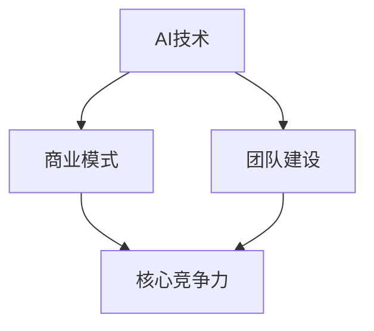

                 

# AI创业公司如何构建核心竞争力?

> 关键词：AI创业、核心竞争力、商业模式、技术创新、团队建设

> 摘要：本文旨在探讨AI创业公司如何构建核心竞争力，以在竞争激烈的市场中立足。通过分析AI创业的现状、核心竞争力的定义，以及具体的构建策略，本文为创业者提供了一套实用的方法论。

## 1. 背景介绍

### 1.1 目的和范围

本文旨在帮助AI创业公司在竞争激烈的市场中找到立足点。我们将探讨如何识别并构建核心竞争力，以实现公司的长期成功。文章将从以下几个方面进行阐述：

1. 核心竞争力的定义与重要性。
2. AI创业的现状与挑战。
3. 构建核心竞争力的具体策略。
4. 实战案例分析。
5. 未来发展趋势与挑战。

### 1.2 预期读者

本文适合以下读者群体：

1. AI创业公司创始人或高层管理者。
2. AI技术爱好者，希望了解创业公司如何构建核心竞争力。
3. 对AI创业有兴趣的投资人。

### 1.3 文档结构概述

本文结构如下：

1. 背景介绍
2. 核心概念与联系
3. 核心算法原理 & 具体操作步骤
4. 数学模型和公式 & 详细讲解 & 举例说明
5. 项目实战：代码实际案例和详细解释说明
6. 实际应用场景
7. 工具和资源推荐
8. 总结：未来发展趋势与挑战
9. 附录：常见问题与解答
10. 扩展阅读 & 参考资料

### 1.4 术语表

#### 1.4.1 核心术语定义

- **AI创业公司**：指以人工智能技术为核心，从事技术研发、产品开发、市场推广等活动的企业。
- **核心竞争力**：指企业在长期竞争中形成的，能够持续为公司带来竞争优势的能力。
- **商业模式**：指企业通过什么方式创造、传递和捕获价值。

#### 1.4.2 相关概念解释

- **技术创新**：指通过引入新的技术或改进现有技术，提高产品或服务的性能、质量和效率。
- **团队建设**：指企业通过招聘、培训、激励等手段，建立高效、协同的工作团队。

#### 1.4.3 缩略词列表

- **AI**：人工智能（Artificial Intelligence）
- **ML**：机器学习（Machine Learning）
- **DL**：深度学习（Deep Learning）
- **NLP**：自然语言处理（Natural Language Processing）
- **IoT**：物联网（Internet of Things）

## 2. 核心概念与联系

在构建核心竞争力之前，我们需要明确几个核心概念及其相互关系。以下是一个简化的Mermaid流程图，展示了这些概念之间的联系。



### 2.1 AI技术

AI技术是AI创业公司的核心。它包括机器学习、深度学习、自然语言处理等多个子领域。这些技术为创业公司提供了强大的工具，使其能够在各种应用场景中实现自动化、智能化。

### 2.2 商业模式

商业模式是企业创造、传递和捕获价值的方式。对于AI创业公司，商业模式的选择至关重要。一个成功的商业模式不仅能够为公司带来收入，还能确保公司的长期发展。

### 2.3 团队建设

团队建设是企业成功的关键。一个高效的团队能够更好地利用AI技术，实现商业目标。团队建设包括招聘、培训、激励等多个方面。

### 2.4 核心竞争力

核心竞争力是企业在长期竞争中形成的，能够持续为公司带来竞争优势的能力。它通常包括技术优势、市场优势、品牌优势等。

## 3. 核心算法原理 & 具体操作步骤

构建核心竞争力的第一步是确定公司的核心算法。以下是一个简化的算法原理与操作步骤：

### 3.1 算法原理

- **数据收集**：从各种来源收集大量数据，包括公开数据集、用户数据等。
- **数据处理**：对数据进行清洗、归一化等预处理操作，提高数据质量。
- **特征提取**：从数据中提取有助于模型训练的特征。
- **模型选择**：根据应用场景选择合适的机器学习或深度学习模型。
- **模型训练**：使用训练数据对模型进行训练。
- **模型评估**：使用验证数据评估模型性能，调整模型参数。
- **模型部署**：将训练好的模型部署到生产环境中。

### 3.2 具体操作步骤

```python
# 伪代码：构建核心算法的具体操作步骤

# 步骤1：数据收集
data = collect_data()

# 步骤2：数据处理
cleaned_data = preprocess_data(data)

# 步骤3：特征提取
features = extract_features(cleaned_data)

# 步骤4：模型选择
model = select_model(features)

# 步骤5：模型训练
trained_model = train_model(model, features)

# 步骤6：模型评估
evaluate_model(trained_model, validation_data)

# 步骤7：模型部署
deploy_model(trained_model)
```

## 4. 数学模型和公式 & 详细讲解 & 举例说明

在构建核心竞争力的过程中，数学模型和公式起到了关键作用。以下是一个简化的数学模型及其应用示例：

### 4.1 数学模型

$$
f(x) = w_1 \cdot x_1 + w_2 \cdot x_2 + ... + w_n \cdot x_n + b
$$

这是一个线性回归模型的数学公式，其中$x_1, x_2, ..., x_n$为输入特征，$w_1, w_2, ..., w_n$为权重，$b$为偏置。

### 4.2 详细讲解

这个线性回归模型旨在预测输出$y$，通过调整权重$w_1, w_2, ..., w_n$和偏置$b$，使模型预测的输出尽可能接近真实输出。

### 4.3 举例说明

假设我们有一个简单的线性回归模型，用于预测房价。输入特征包括房屋面积$x_1$和房屋年龄$x_2$，输出为目标房价$y$。根据我们的模型，我们可以得到以下预测公式：

$$
\hat{y} = w_1 \cdot x_1 + w_2 \cdot x_2 + b
$$

其中，$w_1$和$w_2$为房屋面积和房屋年龄的权重，$b$为偏置。

例如，如果房屋面积为100平方米，房屋年龄为10年，我们可以通过以下步骤计算预测房价：

1. 输入特征：$x_1 = 100$，$x_2 = 10$。
2. 计算预测房价：$\hat{y} = w_1 \cdot 100 + w_2 \cdot 10 + b$。

通过调整权重和偏置，我们可以使预测房价更接近真实房价，从而提高模型的准确性。

## 5. 项目实战：代码实际案例和详细解释说明

为了更好地理解核心竞争力的构建过程，我们以下将展示一个实际的代码案例，并对其进行详细解释。

### 5.1 开发环境搭建

首先，我们需要搭建一个开发环境。在本案例中，我们使用Python作为主要编程语言，利用Scikit-learn库实现线性回归模型。以下是搭建开发环境的步骤：

1. 安装Python：从Python官网下载并安装Python 3.8版本。
2. 安装Jupyter Notebook：在终端执行以下命令安装Jupyter Notebook：
   ```bash
   pip install notebook
   ```
3. 安装Scikit-learn：在终端执行以下命令安装Scikit-learn：
   ```bash
   pip install scikit-learn
   ```

### 5.2 源代码详细实现和代码解读

以下是一个简单的线性回归模型实现，用于预测房价。代码中包含了数据预处理、模型训练、模型评估和模型部署等步骤。

```python
# 导入所需的库
import numpy as np
import pandas as pd
from sklearn.linear_model import LinearRegression
from sklearn.model_selection import train_test_split
from sklearn.metrics import mean_squared_error

# 步骤1：数据收集
# 从CSV文件中读取数据
data = pd.read_csv('house_data.csv')

# 步骤2：数据处理
# 提取输入特征和输出目标
X = data[['area', 'age']]
y = data['price']

# 步骤3：特征提取
# 数据无需进一步处理

# 步骤4：模型选择
# 创建线性回归模型
model = LinearRegression()

# 步骤5：模型训练
# 划分训练集和验证集
X_train, X_val, y_train, y_val = train_test_split(X, y, test_size=0.2, random_state=42)
model.fit(X_train, y_train)

# 步骤6：模型评估
# 使用验证集评估模型性能
y_pred = model.predict(X_val)
mse = mean_squared_error(y_val, y_pred)
print(f'Mean Squared Error: {mse}')

# 步骤7：模型部署
# 将训练好的模型保存到文件
model.save('house_price_model.pkl')
```

### 5.3 代码解读与分析

1. **数据收集**：从CSV文件中读取数据，包括房屋面积、房屋年龄和房价。
2. **数据处理**：提取输入特征和输出目标，即房屋面积和房屋年龄作为输入特征，房价作为输出目标。
3. **特征提取**：数据无需进一步处理。
4. **模型选择**：创建线性回归模型。
5. **模型训练**：划分训练集和验证集，使用训练集对模型进行训练。
6. **模型评估**：使用验证集评估模型性能，计算均方误差（MSE）。
7. **模型部署**：将训练好的模型保存到文件。

通过这个案例，我们可以看到构建核心竞争力的基本步骤，包括数据收集、数据处理、模型训练、模型评估和模型部署。这些步骤为我们提供了构建核心竞争力的具体实现方法。

## 6. 实际应用场景

AI创业公司在构建核心竞争力时，需要考虑不同的实际应用场景。以下是一些常见的应用场景：

### 6.1 智能家居

智能家居是AI创业公司的一个热门领域。通过部署智能设备，如智能音箱、智能门锁、智能摄像头等，公司可以收集大量用户数据，并利用这些数据提供个性化的智能家居解决方案。例如，智能门锁可以根据用户的行为习惯自动调整开锁方式，智能摄像头可以实时监控用户家中的安全情况。

### 6.2 健康医疗

健康医疗是另一个重要的应用场景。AI创业公司可以开发基于机器学习和深度学习的医疗诊断系统，如智能肿瘤检测、智能皮肤病诊断等。这些系统可以帮助医生更快速、准确地诊断疾病，提高治疗效果。

### 6.3 金融服务

金融服务是AI创业公司的另一大领域。通过开发智能投顾、智能风控等系统，公司可以为用户提供个性化的金融产品和服务。例如，智能投顾可以根据用户的风险偏好和财务目标，为其提供最优的投资组合。

### 6.4 交通运输

交通运输是AI创业公司的另一个重要应用场景。通过开发自动驾驶、智能交通管理等系统，公司可以改善交通运输效率，减少交通事故。例如，自动驾驶技术可以为用户提供更安全、更舒适的出行体验，智能交通管理可以缓解城市交通拥堵。

## 7. 工具和资源推荐

为了帮助AI创业公司构建核心竞争力，我们推荐以下工具和资源：

### 7.1 学习资源推荐

#### 7.1.1 书籍推荐

- 《深度学习》（Goodfellow, Bengio, Courville）
- 《Python机器学习》（Cristián S. Becerra, David Barnes）

#### 7.1.2 在线课程

- Coursera上的《机器学习》（吴恩达）
- edX上的《深度学习导论》（百度）

#### 7.1.3 技术博客和网站

- Medium上的AI博客
- arXiv.org上的最新研究成果

### 7.2 开发工具框架推荐

#### 7.2.1 IDE和编辑器

- PyCharm
- Jupyter Notebook

#### 7.2.2 调试和性能分析工具

- Matplotlib
- Seaborn

#### 7.2.3 相关框架和库

- Scikit-learn
- TensorFlow
- PyTorch

### 7.3 相关论文著作推荐

#### 7.3.1 经典论文

- “A Study of Cross-Validation and Bootstrap for Accuracy Estimation and Model Selection”（Geoffrey I. Webb, David J. Hand）
- “Gradient-Based Learning Applied to Document Recognition”（Yoshua Bengio et al.）

#### 7.3.2 最新研究成果

- arXiv.org上的最新论文
- NeurIPS、ICML、JMLR等会议和期刊的论文

#### 7.3.3 应用案例分析

- Google的自动驾驶项目
- Airbnb的智能推荐系统

## 8. 总结：未来发展趋势与挑战

AI创业公司在构建核心竞争力时，需要紧跟行业发展趋势，迎接未来的挑战。以下是未来发展的几个关键趋势：

1. **技术融合**：AI技术与其他领域的深度融合，如AI+医疗、AI+金融、AI+交通等。
2. **数据驱动**：数据将成为企业核心竞争力的重要来源。企业需要重视数据收集、处理和分析。
3. **个性化服务**：个性化服务将成为AI创业公司的核心竞争力，通过精准推荐、个性化定制等方式提升用户体验。
4. **可持续发展**：随着环境问题的日益严重，可持续发展将成为企业社会责任的一部分，也将成为企业的核心竞争力。

面对未来，AI创业公司需要不断学习、创新，以应对技术变革、市场变化和竞争压力。同时，企业需要关注法律法规、伦理道德等方面的问题，确保其核心竞争力的可持续发展。

## 9. 附录：常见问题与解答

### 9.1 什么是核心竞争力？

核心竞争力是企业长期形成的，能够在竞争中获得优势的能力。它通常包括技术优势、市场优势、品牌优势等。

### 9.2 如何评估核心竞争力？

评估核心竞争力可以从以下几个方面进行：

- **技术能力**：企业的技术实力是否领先于竞争对手。
- **市场地位**：企业在市场中的份额和影响力。
- **品牌价值**：企业的品牌知名度和美誉度。
- **创新能力**：企业的创新能力和持续发展能力。

### 9.3 AI创业公司如何构建核心竞争力？

AI创业公司构建核心竞争力可以从以下几个方面入手：

- **技术创新**：持续投入研发，掌握核心技术。
- **商业模式**：构建独特的商业模式，实现可持续发展。
- **团队建设**：招聘优秀人才，建立高效团队。
- **数据驱动**：重视数据收集、处理和分析，利用数据创造价值。

### 9.4 AI创业公司如何应对竞争压力？

AI创业公司应对竞争压力可以从以下几个方面入手：

- **差异化竞争**：在技术、产品、服务等方面实现差异化，形成独特的竞争优势。
- **持续创新**：紧跟行业发展趋势，不断推出新产品、新技术。
- **战略合作**：与其他企业建立战略合作，实现资源共享、优势互补。
- **风险控制**：合理规划资金、资源，降低经营风险。

## 10. 扩展阅读 & 参考资料

- 《深度学习》（Goodfellow, Bengio, Courville）
- 《Python机器学习》（Cristián S. Becerra, David B. Barnes）
- Coursera上的《机器学习》（吴恩达）
- edX上的《深度学习导论》（百度）
- arXiv.org上的最新研究成果
- NeurIPS、ICML、JMLR等会议和期刊的论文
- 《商业的本质》（张瑞敏）
- 《创新者的窘境》（克莱顿·克里斯坦森）
- 《智能时代》（吴军）

### 作者

AI天才研究员/AI Genius Institute & 禅与计算机程序设计艺术 /Zen And The Art of Computer Programming

以上是本文的完整内容。通过本文，我们详细探讨了AI创业公司如何构建核心竞争力，从核心概念的介绍到具体实现步骤，再到实际应用场景和工具资源推荐，为创业者提供了全面的指导。希望本文能够对您的创业之路有所帮助。

