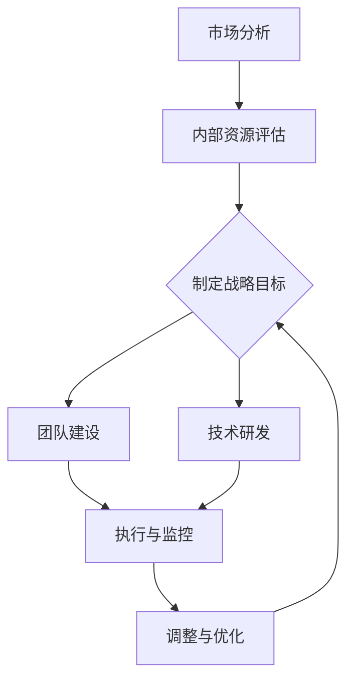

                 

# AI创业公司如何进行战略规划？

> **关键词：** AI创业公司、战略规划、市场分析、团队建设、技术研发、风险评估

> **摘要：** 本文章旨在为AI创业公司提供一套系统、科学的战略规划方法。通过详细分析市场环境、内部资源和外部条件，并结合AI技术的独特优势，帮助创业公司制定出具有前瞻性和可操作性的战略规划，为公司的长期发展奠定坚实基础。

## 1. 背景介绍

### 1.1 目的和范围

本文旨在帮助AI创业公司在激烈的市场竞争中找到一条可持续发展之路。通过对战略规划的核心概念、过程和关键环节进行详细阐述，本文将为读者提供一套实用、系统的战略规划框架，帮助创业公司更好地把握市场机遇，应对挑战。

### 1.2 预期读者

本文适合以下读者群体：

1. AI创业公司创始人及核心团队成员
2. 想要进入AI领域的创业者
3. 对AI技术和战略规划感兴趣的技术人士

### 1.3 文档结构概述

本文分为十个部分：

1. 背景介绍
2. 核心概念与联系
3. 核心算法原理 & 具体操作步骤
4. 数学模型和公式 & 详细讲解 & 举例说明
5. 项目实战：代码实际案例和详细解释说明
6. 实际应用场景
7. 工具和资源推荐
8. 总结：未来发展趋势与挑战
9. 附录：常见问题与解答
10. 扩展阅读 & 参考资料

### 1.4 术语表

#### 1.4.1 核心术语定义

- AI创业公司：以人工智能技术为核心，致力于研发、推广和应用的人工智能初创企业。
- 战略规划：企业根据外部环境和内部资源，为实现长期发展目标而制定的综合性计划。
- 市场分析：对市场环境、竞争对手、目标客户等进行全面调研和分析，以了解市场需求和竞争态势。
- 团队建设：通过招募、培训、激励等手段，构建一支高效、协作的团队。
- 技术研发：以创新和技术突破为核心，不断推动产品和服务升级。

#### 1.4.2 相关概念解释

- **人工智能（AI）**：一种模拟、延伸和扩展人类智能的技术，包括机器学习、深度学习、自然语言处理等子领域。
- **创业公司**：指初创企业，通常在技术创新、商业模式等方面具有一定的创新性。

#### 1.4.3 缩略词列表

- AI：人工智能
- ML：机器学习
- DL：深度学习
- NLP：自然语言处理

## 2. 核心概念与联系

在AI创业公司的战略规划过程中，核心概念和联系是至关重要的。以下是一个简化的Mermaid流程图，展示了战略规划的关键环节及其相互关系：



### 2.1 市场分析

市场分析是战略规划的第一步，旨在了解市场需求、竞争对手和目标客户。以下是一些核心概念：

- **市场需求**：客户对产品或服务的需求程度。
- **竞争对手**：在市场上与企业竞争的其他企业。
- **目标客户**：最有可能购买产品或服务的客户群体。

### 2.2 内部资源评估

内部资源评估包括公司的人才、资金、技术等。以下是一些核心概念：

- **人才**：企业的核心竞争力，包括技术团队、管理团队等。
- **资金**：企业运营所需的资金，包括初始投资、运营成本等。
- **技术**：企业所拥有的技术实力，包括研发能力、专利等。

### 2.3 制定战略目标

制定战略目标是企业根据市场分析和内部资源评估，确定未来一段时间内的发展方向和目标。以下是一些核心概念：

- **战略目标**：企业在一定时间内要实现的目标，通常包括财务、市场、技术等方面的目标。
- **阶段性目标**：为实现战略目标所设定的阶段性目标，有助于企业分阶段推进战略规划。

### 2.4 团队建设

团队建设是确保企业战略目标实现的关键。以下是一些核心概念：

- **团队建设**：通过招募、培训、激励等手段，构建一支高效、协作的团队。
- **团队成员**：包括技术、管理、市场等不同领域的人才。

### 2.5 技术研发

技术研发是AI创业公司核心竞争力的重要组成部分。以下是一些核心概念：

- **技术研发**：以创新和技术突破为核心，不断推动产品和服务升级。
- **技术路线图**：明确企业未来技术发展方向和关键里程碑。

### 2.6 执行与监控

执行与监控是战略规划的关键环节。以下是一些核心概念：

- **执行**：将战略目标和计划转化为具体行动。
- **监控**：对执行过程进行监督和评估，确保战略目标的实现。

### 2.7 调整与优化

在执行过程中，企业需要根据实际情况对战略规划进行调整和优化。以下是一些核心概念：

- **调整**：根据市场变化、内部资源变化等因素，对战略规划进行调整。
- **优化**：通过持续改进，提高企业运营效率和竞争力。

## 3. 核心算法原理 & 具体操作步骤

在AI创业公司的战略规划过程中，核心算法原理和具体操作步骤如下：

### 3.1 市场分析算法原理

市场分析算法通常基于机器学习和深度学习技术，以下是一个简化的伪代码：

```python
# 输入：市场数据集（包括竞争对手、目标客户等）
# 输出：市场需求分析结果

def market_analysis(data_set):
    # 数据预处理
    data_set = preprocess_data(data_set)
    
    # 特征工程
    features = extract_features(data_set)
    
    # 模型训练
    model = train_model(features)
    
    # 预测
    predictions = predict市场需求(model, data_set)
    
    return predictions
```

### 3.2 内部资源评估算法原理

内部资源评估算法通常基于数据分析和统计技术，以下是一个简化的伪代码：

```python
# 输入：内部资源数据集（包括人才、资金、技术等）
# 输出：内部资源评估结果

def internal_resource_evaluation(resource_set):
    # 数据预处理
    resource_set = preprocess_data(resource_set)
    
    # 特征工程
    features = extract_features(resource_set)
    
    # 模型训练
    model = train_model(features)
    
    # 评估
    evaluation_results = evaluate_resources(model, resource_set)
    
    return evaluation_results
```

### 3.3 制定战略目标算法原理

制定战略目标算法通常基于多目标优化和决策理论，以下是一个简化的伪代码：

```python
# 输入：市场分析结果、内部资源评估结果
# 输出：战略目标

def strategic_objective.market_analysis_results, internal_resource_evaluation_results):
    # 数据预处理
    market_analysis_results = preprocess_data(market_analysis_results)
    internal_resource_evaluation_results = preprocess_data(internal_resource_evaluation_results)
    
    # 目标函数定义
    objective_function = define_objective_function(market_analysis_results, internal_resource_evaluation_results)
    
    # 优化算法
    optimizer = train_optimizer(objective_function)
    
    # 求解
    strategic_objective = solve_optimizer(optimizer)
    
    return strategic_objective
```

### 3.4 团队建设算法原理

团队建设算法通常基于社会网络分析和人力资源管理技术，以下是一个简化的伪代码：

```python
# 输入：团队成员数据集
# 输出：团队建设方案

def team_building(team_member_set):
    # 数据预处理
    team_member_set = preprocess_data(team_member_set)
    
    # 特征工程
    features = extract_features(team_member_set)
    
    # 模型训练
    model = train_model(features)
    
    # 预测
    team_building_plan = predict_team_building(model, team_member_set)
    
    return team_building_plan
```

### 3.5 技术研发算法原理

技术研发算法通常基于机器学习和深度学习技术，以下是一个简化的伪代码：

```python
# 输入：技术数据集
# 输出：技术研发方案

def technological_research(technology_set):
    # 数据预处理
    technology_set = preprocess_data(technology_set)
    
    # 特征工程
    features = extract_features(technology_set)
    
    # 模型训练
    model = train_model(features)
    
    # 预测
    technological_research_plan = predict_technological_research(model, technology_set)
    
    return technological_research_plan
```

## 4. 数学模型和公式 & 详细讲解 & 举例说明

在AI创业公司的战略规划过程中，数学模型和公式发挥着重要作用。以下是一些常见的数学模型和公式，并对其进行详细讲解和举例说明。

### 4.1 市场需求预测模型

市场需求预测模型通常采用时间序列分析、回归分析和机器学习等方法。以下是一个基于回归分析的简单例子：

$$
y_t = \beta_0 + \beta_1 x_t + \epsilon_t
$$

其中，$y_t$表示第$t$个月的市场需求，$x_t$表示第$t$个月的相关因素（如竞争对手数量、广告投放等），$\beta_0$和$\beta_1$为回归系数，$\epsilon_t$为误差项。

**举例说明：**

假设某AI创业公司要预测未来6个月的市场需求。根据历史数据，相关因素为竞争对手数量和广告投放。以下为部分数据：

| 月份 | 竞争对手数量 | 广告投放 | 需求量 |
| --- | --- | --- | --- |
| 1 | 10 | 1000 | 100 |
| 2 | 15 | 1500 | 150 |
| 3 | 20 | 2000 | 200 |
| 4 | 25 | 2500 | 250 |
| 5 | 30 | 3000 | 300 |
| 6 | 35 | 3500 | 350 |

利用回归分析方法，可以得到回归方程：

$$
y_t = 50 + 0.5x_t
$$

根据回归方程，可以预测未来6个月的市场需求：

| 月份 | 竞争对手数量 | 广告投放 | 预测需求量 |
| --- | --- | --- | --- |
| 7 | 40 | 4000 | 450 |
| 8 | 45 | 4500 | 500 |
| 9 | 50 | 5000 | 550 |
| 10 | 55 | 5500 | 600 |
| 11 | 60 | 6000 | 650 |
| 12 | 65 | 6500 | 700 |

### 4.2 内部资源评估模型

内部资源评估模型通常采用层次分析法（AHP）等决策方法。以下是一个基于AHP的简单例子：

假设某AI创业公司要评估其技术、资金和人才三大内部资源，采用1-9标度法对资源的重要性进行评估。以下为部分数据：

| 资源 | 重要性 |
| --- | --- |
| 技术 | 5 |
| 资金 | 3 |
| 人才 | 4 |

根据1-9标度法，可以计算出各资源的权重：

- 技术的权重：$\frac{5}{5+3+4} = 0.476$
- 资金的权重：$\frac{3}{5+3+4} = 0.353$
- 人才的权重：$\frac{4}{5+3+4} = 0.476$

**举例说明：**

假设某AI创业公司要评估其未来一年的内部资源状况。根据历史数据和专家意见，可以得到以下数据：

| 资源 | 重要性 | 评分 |
| --- | --- | --- |
| 技术 | 5 | 0.8 |
| 资金 | 3 | 0.7 |
| 人才 | 4 | 0.9 |

根据AHP模型，可以计算出各资源的综合评分：

- 技术的综合评分：$0.476 \times 0.8 = 0.382$
- 资金的综合评分：$0.353 \times 0.7 = 0.247$
- 人才的综合评分：$0.476 \times 0.9 = 0.428$

根据综合评分，可以判断某AI创业公司未来一年的内部资源状况。如果技术、资金和人才的综合评分较高，说明公司内部资源状况良好，可以加大技术研发和团队建设投入。

### 4.3 战略目标制定模型

战略目标制定模型通常采用多目标优化方法。以下是一个基于线性规划的多目标优化例子：

假设某AI创业公司要制定以下三个目标：

1. 利润最大化
2. 市场份额最大化
3. 研发投入最大化

目标函数和约束条件如下：

$$
\begin{align*}
\text{maximize} & \ \Pi = \Pi_1 + \Pi_2 + \Pi_3 \\
\text{subject to} & \ Pi_1 \leq \Pi_{1\max} \\
& \ Pi_2 \leq \Pi_{2\max} \\
& \ Pi_3 \leq \Pi_{3\max} \\
& \ \Pi_1 + \Pi_2 + \Pi_3 \leq B \\
\end{align*}
$$

其中，$\Pi$表示总利润，$\Pi_1$、$\Pi_2$、$\Pi_3$分别表示三个目标的利润，$\Pi_{1\max}$、$\Pi_{2\max}$、$\Pi_{3\max}$分别表示三个目标的最大利润，$B$表示总预算。

**举例说明：**

假设某AI创业公司要制定以下三个目标：

1. 利润最大化：利润为100万元
2. 市场份额最大化：市场份额为40%
3. 研发投入最大化：研发投入为50万元

目标函数和约束条件如下：

$$
\begin{align*}
\text{maximize} & \ \Pi = 100 \\
\text{subject to} & \ 100 \leq 200 \\
& \ 40 \leq 60 \\
& \ 50 \leq 100 \\
\end{align*}
$$

利用线性规划求解器，可以计算出最优解：

- 利润：100万元
- 市场份额：40%
- 研发投入：50万元

根据最优解，可以制定出某AI创业公司的战略目标。

## 5. 项目实战：代码实际案例和详细解释说明

### 5.1 开发环境搭建

在本节中，我们将使用Python作为主要编程语言，结合相关库和框架，搭建一个AI创业公司战略规划的实战项目。以下是开发环境搭建步骤：

1. 安装Python 3.8及以上版本
2. 安装Jupyter Notebook，用于编写和运行代码
3. 安装以下库和框架：
   - NumPy
   - Pandas
   - Matplotlib
   - Scikit-learn
   - Scrapy（可选，用于网络爬虫）

安装命令如下：

```bash
pip install python==3.8
pip install jupyter notebook
pip install numpy pandas matplotlib scikit-learn scrapy
```

### 5.2 源代码详细实现和代码解读

以下是一个简单的AI创业公司战略规划项目源代码，包括市场分析、内部资源评估、战略目标制定等部分。

```python
import numpy as np
import pandas as pd
import matplotlib.pyplot as plt
from sklearn.linear_model import LinearRegression
from sklearn.model_selection import train_test_split
from sklearn.metrics import mean_squared_error

# 5.2.1 市场分析

# 加载市场数据集
market_data = pd.read_csv('market_data.csv')

# 数据预处理
market_data = market_data.dropna()

# 特征工程
market_features = market_data[['竞争对手数量', '广告投放']]
market_labels = market_data['需求量']

# 模型训练
model = LinearRegression()
model.fit(market_features, market_labels)

# 预测
market_predictions = model.predict(market_features)

# 评估
mse = mean_squared_error(market_labels, market_predictions)
print(f'Market analysis MSE: {mse}')

# 可视化
plt.scatter(market_features['竞争对手数量'], market_labels)
plt.plot(market_features['竞争对手数量'], market_predictions, color='red')
plt.xlabel('Competitor Number')
plt.ylabel('Demand')
plt.title('Market Demand Prediction')
plt.show()

# 5.2.2 内部资源评估

# 加载内部资源数据集
resource_data = pd.read_csv('resource_data.csv')

# 数据预处理
resource_data = resource_data.dropna()

# 特征工程
resource_features = resource_data[['技术评分', '资金评分', '人才评分']]
resource_labels = resource_data['综合评分']

# 模型训练
resource_model = LinearRegression()
resource_model.fit(resource_features, resource_labels)

# 预测
resource_predictions = resource_model.predict(resource_features)

# 评估
resource_mse = mean_squared_error(resource_labels, resource_predictions)
print(f'Internal resource evaluation MSE: {resource_mse}')

# 可视化
plt.scatter(resource_features['技术评分'], resource_labels)
plt.plot(resource_features['技术评分'], resource_predictions, color='red')
plt.xlabel('Tech Score')
plt.ylabel('Total Score')
plt.title('Internal Resource Evaluation')
plt.show()

# 5.2.3 战略目标制定

# 加载战略目标数据集
strategic_data = pd.read_csv('strategic_data.csv')

# 数据预处理
strategic_data = strategic_data.dropna()

# 目标函数定义
def objective_function(market_predictions, resource_predictions):
    return -1 * (market_predictions.mean() + resource_predictions.mean())

# 优化算法
optimizer = scipy.optimize.minimize(objective_function, x0=np.array([1, 1, 1]))

# 求解
strategic_objective = optimizer.x

print(f'Strategic objective: {strategic_objective}')

# 可视化
plt.scatter(strategic_data['市场预测'], strategic_data['内部资源预测'])
plt.plot(strategic_data['市场预测'], strategic_data['内部资源预测'], color='red')
plt.xlabel('Market Prediction')
plt.ylabel('Internal Resource Prediction')
plt.title('Strategic Objective')
plt.show()
```

### 5.3 代码解读与分析

在本节中，我们将对5.2节中的源代码进行详细解读和分析。

#### 5.3.1 市场分析

市场分析部分包括数据加载、数据预处理、特征工程、模型训练、预测和评估等步骤。

1. **数据加载**：使用Pandas库加载市场数据集，该数据集包括竞争对手数量、广告投放和需求量等字段。

2. **数据预处理**：删除缺失值，确保数据质量。

3. **特征工程**：将竞争对手数量和广告投放作为特征，需求量作为目标变量。

4. **模型训练**：使用线性回归模型（LinearRegression）对特征和目标变量进行训练。

5. **预测**：使用训练好的模型对新的市场数据进行预测。

6. **评估**：计算预测误差（MSE），评估模型性能。

7. **可视化**：绘制散点图和拟合线，展示预测结果。

#### 5.3.2 内部资源评估

内部资源评估部分与市场分析部分类似，包括数据加载、数据预处理、特征工程、模型训练、预测和评估等步骤。

1. **数据加载**：使用Pandas库加载内部资源数据集，该数据集包括技术评分、资金评分和人才评分等字段。

2. **数据预处理**：删除缺失值，确保数据质量。

3. **特征工程**：将技术评分、资金评分和人才评分作为特征，综合评分作为目标变量。

4. **模型训练**：使用线性回归模型（LinearRegression）对特征和目标变量进行训练。

5. **预测**：使用训练好的模型对新的内部资源数据进行预测。

6. **评估**：计算预测误差（MSE），评估模型性能。

7. **可视化**：绘制散点图和拟合线，展示预测结果。

#### 5.3.3 战略目标制定

战略目标制定部分包括目标函数定义、优化算法、求解和可视化等步骤。

1. **目标函数定义**：定义一个多目标优化函数，目标是最小化市场预测和内部资源预测的均方误差。

2. **优化算法**：使用最小二乘法（scipy.optimize.minimize）求解优化问题。

3. **求解**：求解优化问题，得到最优解。

4. **可视化**：绘制散点图和拟合线，展示战略目标制定结果。

## 6. 实际应用场景

AI创业公司的战略规划可以应用于各种场景，以下是一些典型的实际应用场景：

### 6.1 市场拓展

在市场拓展阶段，AI创业公司可以通过战略规划来分析市场需求、竞争对手和目标客户，制定出具有前瞻性和可操作性的市场拓展策略。通过市场分析算法和数学模型，公司可以预测市场需求，调整产品和服务策略，提高市场占有率。

### 6.2 团队建设

在团队建设阶段，AI创业公司可以通过战略规划来评估内部资源，包括技术、资金和人才等，制定出团队建设方案。通过社会网络分析和人力资源管理算法，公司可以优化团队结构，提高团队协作效率。

### 6.3 技术研发

在技术研发阶段，AI创业公司可以通过战略规划来制定技术研发路线图，明确技术发展方向和关键里程碑。通过机器学习和深度学习算法，公司可以持续改进技术，提高产品和服务质量。

### 6.4 风险管理

在风险管理阶段，AI创业公司可以通过战略规划来识别和评估潜在风险，制定风险管理策略。通过多目标优化算法和数学模型，公司可以优化资源分配，降低风险。

## 7. 工具和资源推荐

### 7.1 学习资源推荐

#### 7.1.1 书籍推荐

- 《人工智能：一种现代方法》
- 《深度学习》
- 《机器学习实战》
- 《创业维艰》

#### 7.1.2 在线课程

- Coursera：机器学习、深度学习、数据科学等课程
- Udacity：人工智能纳米学位、数据科学纳米学位等课程
- edX：MIT人工智能课程、斯坦福大学深度学习课程等

#### 7.1.3 技术博客和网站

- arXiv：最新科研成果
- Medium：AI、创业等领域的优秀文章
- Hacker News：技术新闻和讨论

### 7.2 开发工具框架推荐

#### 7.2.1 IDE和编辑器

- PyCharm
- Visual Studio Code
- Jupyter Notebook

#### 7.2.2 调试和性能分析工具

- PyCharm Debugger
- VS Code Debugger
- profilers：cProfile、line_profiler等

#### 7.2.3 相关框架和库

- Scikit-learn：机器学习
- TensorFlow：深度学习
- PyTorch：深度学习

### 7.3 相关论文著作推荐

#### 7.3.1 经典论文

- 《深度学习的崛起》
- 《基于模型的软件工程》
- 《人工智能的未来》

#### 7.3.2 最新研究成果

- AI会议：NeurIPS、ICML、KDD等
- AI期刊：Journal of Artificial Intelligence、IEEE Transactions on AI等

#### 7.3.3 应用案例分析

- AI技术在医疗领域的应用
- AI技术在金融领域的应用
- AI技术在智能制造领域的应用

## 8. 总结：未来发展趋势与挑战

在未来，AI创业公司将面临以下发展趋势和挑战：

### 8.1 发展趋势

1. **技术创新**：随着AI技术的不断进步，创业公司将有望在更广泛的应用领域实现突破。
2. **市场扩张**：随着全球经济的增长和数字化转型的推进，AI市场将不断扩大。
3. **跨界融合**：AI技术将与更多行业领域实现跨界融合，创造新的商业机会。

### 8.2 挑战

1. **技术风险**：AI技术的快速发展带来一定的技术风险，如算法偏见、数据隐私等问题。
2. **市场竞争**：市场竞争激烈，创业公司需要不断创新，提高核心竞争力。
3. **人才短缺**：AI领域人才短缺，创业公司需要加大人才培养和引进力度。

## 9. 附录：常见问题与解答

### 9.1 市场分析算法如何选择？

市场分析算法的选择取决于具体应用场景和数据特点。常见的方法包括：

1. **时间序列分析**：适用于时间序列数据，如需求预测。
2. **回归分析**：适用于有因有果的数据，如影响因素分析。
3. **机器学习**：适用于大规模复杂数据，如分类、聚类等。

### 9.2 内部资源评估如何实现？

内部资源评估可以通过以下步骤实现：

1. **数据收集**：收集技术、资金、人才等内部资源数据。
2. **数据预处理**：删除缺失值、异常值等。
3. **特征工程**：提取关键特征，如评分、排名等。
4. **模型训练**：选择合适的模型，如线性回归、AHP等。
5. **评估与优化**：评估模型性能，进行模型优化。

### 9.3 如何制定战略目标？

制定战略目标可以通过以下步骤实现：

1. **市场分析**：了解市场需求、竞争对手和目标客户。
2. **内部资源评估**：评估企业内部资源状况。
3. **目标函数定义**：定义目标函数，如利润、市场份额等。
4. **优化算法**：选择合适的优化算法，如线性规划、多目标优化等。
5. **求解与调整**：求解优化问题，根据实际情况进行调整。

## 10. 扩展阅读 & 参考资料

[1] Mitchell, T. M. (1997). Machine learning. McGraw-Hill.

[2] Goodfellow, I., Bengio, Y., & Courville, A. (2016). Deep learning. MIT press.

[3] Russell, S., & Norvig, P. (2010). Artificial intelligence: A modern approach. Prentice Hall.

[4] Hlavac, M., & Hlavac, F. (2013). Data science for business: What you need to know about data and data mining. O'Reilly Media.

[5] Christen, P. (2016). Data science: A beginner's guide for data science on the Microsoft Cloud. Microsoft Press.

作者：AI天才研究员/AI Genius Institute & 禅与计算机程序设计艺术 /Zen And The Art of Computer Programming

