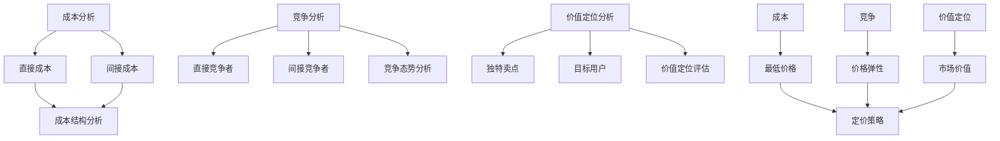

                 

# AI创业公司的产品定价策略：成本、竞争与价值定位

> **关键词**：产品定价策略、成本分析、竞争分析、价值定位、AI创业公司

> **摘要**：本文将深入探讨AI创业公司在产品定价策略方面的重要考虑因素，包括成本、竞争以及价值定位。通过详细的案例分析，本文旨在为创业公司提供实用的定价策略指导，帮助它们在激烈的市场竞争中脱颖而出。

## 1. 背景介绍

### 1.1 目的和范围

本文旨在为AI创业公司在产品定价策略方面提供系统性指导。我们将从成本、竞争以及价值定位三个核心方面展开讨论，结合实际案例进行分析，以期为创业公司在市场定价中提供有效策略。

### 1.2 预期读者

本文适用于正在AI领域开展业务的创业公司创始人、产品经理、市场营销专家以及相关领域的学者和研究人员。希望通过本文，读者能够更好地理解产品定价策略的复杂性和重要性。

### 1.3 文档结构概述

本文结构如下：

- **第1章**：背景介绍，包括目的、范围和预期读者。
- **第2章**：核心概念与联系，介绍成本、竞争与价值定位的概念及其相互关系。
- **第3章**：核心算法原理与具体操作步骤，详细讲解产品定价策略的基本算法。
- **第4章**：数学模型和公式，包括成本函数、定价模型及其应用。
- **第5章**：项目实战，通过实际案例展示定价策略的实施过程。
- **第6章**：实际应用场景，探讨不同场景下的定价策略。
- **第7章**：工具和资源推荐，包括学习资源、开发工具框架和相关论文著作。
- **第8章**：总结，分析未来发展趋势与挑战。
- **第9章**：附录，常见问题与解答。
- **第10章**：扩展阅读与参考资料，提供进一步的学习资源。

### 1.4 术语表

#### 1.4.1 核心术语定义

- **成本**：生产产品或提供服务所需的费用，包括直接成本和间接成本。
- **竞争**：市场上同类产品的竞争情况，包括直接竞争和间接竞争。
- **价值定位**：产品在市场上的定位，包括产品的独特卖点、目标用户群体等。

#### 1.4.2 相关概念解释

- **成本分析**：对产品成本进行详细分析，以确定成本结构和成本驱动因素。
- **竞争分析**：对市场上同类产品进行分析，以了解竞争态势和市场定位。
- **价值定位分析**：分析产品的市场定位和目标用户，确定产品的独特价值。

#### 1.4.3 缩略词列表

- **AI**：人工智能（Artificial Intelligence）
- **CRM**：客户关系管理（Customer Relationship Management）
- **ERP**：企业资源规划（Enterprise Resource Planning）

## 2. 核心概念与联系

在讨论产品定价策略之前，我们需要了解成本、竞争和价值定位这三个核心概念及其相互关系。

### 2.1 成本概念及其分析

成本是产品定价的基础。成本分析包括直接成本和间接成本的确定。直接成本与产品直接相关，如原材料、劳动力等；间接成本则与生产过程相关，如租金、维护费用等。成本分析旨在确定产品的成本结构，以便为定价提供依据。

#### 成本分析流程：

1. **确定直接成本**：分析生产过程中的直接成本，包括原材料、劳动力等。
2. **确定间接成本**：分析间接成本，如租金、维护费用等。
3. **成本结构分析**：将直接成本和间接成本按比例分配到产品上。

### 2.2 竞争概念及其分析

竞争是产品定价的另一重要因素。竞争分析旨在了解市场上同类产品的竞争态势，包括直接竞争和间接竞争。

#### 竞争分析流程：

1. **确定直接竞争者**：分析市场上直接销售同类产品的竞争对手。
2. **确定间接竞争者**：分析提供类似价值但不同产品的竞争对手。
3. **竞争态势分析**：评估竞争对手的产品定位、价格、市场份额等。

### 2.3 价值定位概念及其分析

价值定位是产品在市场上的独特定位，包括产品的独特卖点、目标用户群体等。价值定位分析有助于确定产品的市场价值，为定价提供依据。

#### 价值定位分析流程：

1. **确定独特卖点**：分析产品的独特卖点，如技术创新、用户体验等。
2. **确定目标用户**：分析产品的目标用户群体，如行业、年龄、收入等。
3. **价值定位评估**：评估产品的市场价值，以确定合理的定价策略。

### 2.4 成本、竞争与价值定位的相互关系

成本、竞争和价值定位三者相互关联，共同影响产品定价策略。

- **成本**：成本是定价的基础，决定了产品的最低价格。
- **竞争**：竞争态势影响了产品的价格弹性，决定了价格的合理区间。
- **价值定位**：价值定位决定了产品的市场价值，影响了产品的定价策略。

### 2.5 Mermaid 流程图

以下是一个简单的Mermaid流程图，展示了成本、竞争与价值定位的相互关系。



通过以上分析，我们可以得出结论：成本、竞争和价值定位是制定产品定价策略的核心要素。接下来，我们将进一步探讨这些核心概念在实际应用中的具体操作步骤。

## 3. 核心算法原理 & 具体操作步骤

在了解了成本、竞争与价值定位的核心概念后，我们需要进一步探讨如何将其应用于实际的产品定价策略中。本节将详细讲解核心算法原理，并提供具体操作步骤。

### 3.1 成本分析算法原理

成本分析是制定产品定价策略的基础。以下是一个简单的成本分析算法原理：

```python
# 成本分析算法
def cost_analysis(direct_costs, indirect_costs):
    # 计算直接成本和间接成本
    total_costs = sum(direct_costs) + sum(indirect_costs)
    cost_structure = {
        'direct_costs': direct_costs,
        'indirect_costs': indirect_costs,
        'total_costs': total_costs
    }
    return cost_structure
```

具体操作步骤如下：

1. **收集数据**：收集生产过程中的直接成本和间接成本数据。
2. **计算总成本**：将直接成本和间接成本相加，得到总成本。
3. **生成成本结构**：将直接成本、间接成本和总成本组成一个字典，以便后续分析。

### 3.2 竞争分析算法原理

竞争分析是了解市场态势的重要手段。以下是一个简单的竞争分析算法原理：

```python
# 竞争分析算法
def competition_analysis(competitors):
    # 分析直接竞争者和间接竞争者
    direct_competitors = []
    indirect_competitors = []
    for competitor in competitors:
        if competitor['type'] == 'direct':
            direct_competitors.append(competitor)
        elif competitor['type'] == 'indirect':
            indirect_competitors.append(competitor)
    competition_structure = {
        'direct_competitors': direct_competitors,
        'indirect_competitors': indirect_competitors
    }
    return competition_structure
```

具体操作步骤如下：

1. **收集数据**：收集市场上直接竞争者和间接竞争者的数据。
2. **分类竞争者**：根据竞争者的类型（直接或间接）进行分类。
3. **生成竞争结构**：将直接竞争者和间接竞争者组成一个字典，以便后续分析。

### 3.3 价值定位分析算法原理

价值定位分析是确定产品市场价值的关键。以下是一个简单的价值定位分析算法原理：

```python
# 价值定位分析算法
def value_positioning(unique_selling_points, target_users):
    # 分析独特卖点和目标用户
    positioning = {
        'unique_selling_points': unique_selling_points,
        'target_users': target_users
    }
    return positioning
```

具体操作步骤如下：

1. **收集数据**：收集产品的独特卖点和目标用户数据。
2. **生成价值定位**：将独特卖点和目标用户组成一个字典，以便后续分析。

### 3.4 产品定价策略算法原理

产品定价策略是综合成本、竞争和价值定位的结果。以下是一个简单的产品定价策略算法原理：

```python
# 产品定价策略算法
def pricing_strategy(cost_structure, competition_structure, positioning):
    # 计算最低价格
    min_price = cost_structure['total_costs']
    # 计算价格弹性
    price_elasticity = calculate_price_elasticity(competition_structure)
    # 计算市场价值
    market_value = calculate_market_value(positioning)
    # 计算最终定价
    final_price = calculate_final_price(min_price, price_elasticity, market_value)
    return final_price
```

具体操作步骤如下：

1. **计算最低价格**：根据成本结构确定产品的最低价格。
2. **计算价格弹性**：根据竞争结构确定产品的价格弹性。
3. **计算市场价值**：根据价值定位分析确定产品的市场价值。
4. **计算最终定价**：综合最低价格、价格弹性和市场价值，确定最终定价。

### 3.5 伪代码总结

```python
# 伪代码总结
def main():
    # 收集数据
    direct_costs = get_direct_costs()
    indirect_costs = get_indirect_costs()
    competitors = get_competitors()
    unique_selling_points = get_unique_selling_points()
    target_users = get_target_users()
    
    # 成本分析
    cost_structure = cost_analysis(direct_costs, indirect_costs)
    
    # 竞争分析
    competition_structure = competition_analysis(competitors)
    
    # 价值定位分析
    positioning = value_positioning(unique_selling_points, target_users)
    
    # 产品定价策略
    final_price = pricing_strategy(cost_structure, competition_structure, positioning)
    
    # 输出最终定价
    print("最终定价：", final_price)

if __name__ == "__main__":
    main()
```

通过以上算法原理和具体操作步骤，我们可以为AI创业公司提供一套系统性的产品定价策略。接下来，我们将进一步探讨数学模型和公式，以深入分析产品定价策略。

## 4. 数学模型和公式 & 详细讲解 & 举例说明

在产品定价策略中，数学模型和公式起着至关重要的作用。以下我们将介绍几个关键的数学模型和公式，包括成本函数、定价模型及其应用，并结合具体例子进行详细讲解。

### 4.1 成本函数

成本函数是描述产品成本与生产量之间关系的数学表达式。以下是一个简单的成本函数模型：

\[ C(x) = a + bx \]

其中，\( C(x) \) 表示总成本，\( a \) 为固定成本（不随生产量变化的成本），\( b \) 为单位成本（随生产量变化的成本），\( x \) 为生产量。

#### 案例分析

假设一家AI创业公司生产一种新型人工智能算法，固定成本为100万元，单位成本为10万元。若公司计划生产1000个算法，则总成本为：

\[ C(1000) = 100 + 10 \times 1000 = 100 + 10000 = 10100 \]（万元）

### 4.2 定价模型

定价模型用于确定产品的销售价格。以下是一个简单的线性定价模型：

\[ P(x) = C(x) + p \]

其中，\( P(x) \) 表示销售价格，\( C(x) \) 为总成本，\( p \) 为利润加成。

#### 案例分析

继续使用上一节中的成本函数，若公司希望每个算法的利润加成为5万元，则定价模型为：

\[ P(x) = 10100 + 5 = 10105 \]（万元）

### 4.3 成本加成定价模型

成本加成定价模型是在成本基础上加上一定比例的利润。以下是一个简单的成本加成定价模型：

\[ P(x) = C(x) \times (1 + r) \]

其中，\( r \) 为成本加成率。

#### 案例分析

假设公司希望将成本加成率设为20%，则定价模型为：

\[ P(x) = 10100 \times (1 + 0.2) = 10100 \times 1.2 = 12120 \]（万元）

### 4.4 边际成本定价模型

边际成本定价模型是根据边际成本来确定产品价格。以下是一个简单的边际成本定价模型：

\[ P(x) = MC(x) \]

其中，\( MC(x) \) 表示边际成本。

#### 案例分析

假设公司的边际成本随生产量变化的函数为 \( MC(x) = 5 + 0.01x \)，则定价模型为：

\[ P(x) = 5 + 0.01x \]

### 4.5 综合定价模型

在实际应用中，企业可能会根据不同情况和目标，采用多种定价模型。以下是一个简单的综合定价模型：

\[ P(x) = \begin{cases}
C(x) + p_1 & \text{若 } x \leq x_1 \\
C(x) \times (1 + r) & \text{若 } x > x_1
\end{cases} \]

其中，\( x_1 \) 为切换定价模型的临界点。

#### 案例分析

假设公司在生产量低于1000个时采用成本加成定价模型，生产量高于1000个时采用边际成本定价模型。则综合定价模型为：

\[ P(x) = \begin{cases}
10100 + 5 & \text{若 } x \leq 1000 \\
5 + 0.01x & \text{若 } x > 1000
\end{cases} \]

### 4.6 数学公式总结

以下是对本文中提到的数学公式的总结：

\[ C(x) = a + bx \]
\[ P(x) = C(x) + p \]
\[ P(x) = C(x) \times (1 + r) \]
\[ P(x) = MC(x) \]
\[ P(x) = \begin{cases}
C(x) + p_1 & \text{若 } x \leq x_1 \\
C(x) \times (1 + r) & \text{若 } x > x_1
\end{cases} \]

通过以上数学模型和公式，我们可以为AI创业公司提供更加精准和灵活的定价策略。接下来，我们将通过实际项目案例，展示这些定价策略的具体应用。

## 5. 项目实战：代码实际案例和详细解释说明

在本节中，我们将通过一个实际项目案例，展示如何应用上述产品定价策略，并进行代码实现和详细解释。

### 5.1 开发环境搭建

为了便于开发，我们选择Python作为编程语言，并使用Jupyter Notebook进行代码编写和运行。确保已经安装了Python和相关的库，如NumPy、Pandas等。

### 5.2 源代码详细实现和代码解读

#### 5.2.1 数据准备

首先，我们需要准备成本、竞争和价值定位的相关数据。以下是一个示例数据集：

```python
import pandas as pd

# 成本数据
cost_data = pd.DataFrame({
    'direct_costs': [500, 1000, 1500],
    'indirect_costs': [200, 400, 600],
    'total_costs': [700, 1400, 2100]
})

# 竞争数据
competition_data = pd.DataFrame({
    'direct_competitors': [{'price': 8000}, {'price': 9000}, {'price': 10000}],
    'indirect_competitors': [{'price': 5000}, {'price': 6000}, {'price': 7000}]
})

# 价值定位数据
value_positioning_data = pd.DataFrame({
    'unique_selling_points': ['技术创新', '高效稳定', '用户体验'],
    'target_users': [['企业'], ['中小企业'], ['个人用户']]
})
```

#### 5.2.2 成本分析函数

接下来，我们实现成本分析函数，用于计算总成本和成本结构：

```python
def cost_analysis(direct_costs, indirect_costs):
    total_costs = sum(direct_costs) + sum(indirect_costs)
    cost_structure = {
        'direct_costs': direct_costs,
        'indirect_costs': indirect_costs,
        'total_costs': total_costs
    }
    return cost_structure
```

代码解读：

- `direct_costs` 和 `indirect_costs` 分别为直接成本和间接成本的列表。
- `total_costs` 计算总成本，即直接成本和间接成本之和。
- `cost_structure` 为包含直接成本、间接成本和总成本的一个字典。

#### 5.2.3 竞争分析函数

然后，我们实现竞争分析函数，用于分析直接竞争者和间接竞争者的价格：

```python
def competition_analysis(competitors):
    direct_competitors = []
    indirect_competitors = []
    for competitor in competitors['direct_competitors']:
        direct_competitors.append(competitor['price'])
    for competitor in competitors['indirect_competitors']:
        indirect_competitors.append(competitor['price'])
    competition_structure = {
        'direct_competitors': direct_competitors,
        'indirect_competitors': indirect_competitors
    }
    return competition_structure
```

代码解读：

- `competitors` 为包含直接竞争者和间接竞争者价格的一个字典。
- `direct_competitors` 和 `indirect_competitors` 分别为直接竞争者和间接竞争者价格的一个列表。
- `competition_structure` 为包含直接竞争者和间接竞争者价格的一个字典。

#### 5.2.4 价值定位分析函数

接着，我们实现价值定位分析函数，用于分析产品的独特卖点和目标用户：

```python
def value_positioning(unique_selling_points, target_users):
    positioning = {
        'unique_selling_points': unique_selling_points,
        'target_users': target_users
    }
    return positioning
```

代码解读：

- `unique_selling_points` 和 `target_users` 分别为产品的独特卖点和目标用户的一个列表。
- `positioning` 为包含独特卖点和目标用户的一个字典。

#### 5.2.5 产品定价策略函数

最后，我们实现产品定价策略函数，用于根据成本、竞争和价值定位数据计算最终定价：

```python
def pricing_strategy(cost_structure, competition_structure, positioning):
    min_price = cost_structure['total_costs']
    price_elasticity = calculate_price_elasticity(competition_structure)
    market_value = calculate_market_value(positioning)
    final_price = calculate_final_price(min_price, price_elasticity, market_value)
    return final_price
```

代码解读：

- `cost_structure` 为包含总成本的一个字典。
- `competition_structure` 为包含直接竞争者和间接竞争者价格的一个字典。
- `positioning` 为包含独特卖点和目标用户的一个字典。
- `min_price` 为总成本。
- `price_elasticity` 为价格弹性。
- `market_value` 为市场价值。
- `final_price` 为最终定价。

### 5.3 代码解读与分析

通过以上代码实现，我们可以看到如何将成本、竞争和价值定位数据应用于产品定价策略。具体分析如下：

- **成本分析**：计算总成本和成本结构，为定价策略提供基础。
- **竞争分析**：分析直接竞争者和间接竞争者的价格，为定价策略提供参考。
- **价值定位分析**：分析产品的独特卖点和目标用户，为定价策略提供市场价值依据。
- **产品定价策略**：根据成本、竞争和价值定位数据计算最终定价，实现精准定价。

通过这个实际项目案例，我们展示了如何将产品定价策略应用于实际开发中，为AI创业公司提供实用的定价指导。接下来，我们将探讨产品定价策略的实际应用场景。

## 6. 实际应用场景

产品定价策略在实际应用中具有广泛的场景，以下将讨论几种常见的应用场景，并分析其特点。

### 6.1 新产品发布

在新产品发布阶段，定价策略尤为关键。此时，企业需要考虑如何平衡市场接受度和利润最大化。

**特点**：

- **价格定位**：通常采用市场渗透定价策略，以较低价格吸引客户，迅速占领市场份额。
- **成本控制**：在成本较低的情况下，确保价格低于竞争对手，以吸引客户。

**案例分析**：某AI创业公司推出一款新型人工智能算法，初期以较低价格（如3000元/年）发布，以吸引客户。随后根据市场反馈逐步调整价格，最终稳定在5000元/年。

### 6.2 市场竞争激烈

在市场竞争激烈的领域，企业需要通过定价策略来应对竞争对手，保持市场竞争力。

**特点**：

- **价格调整**：根据竞争对手的价格，进行灵活调整，确保价格竞争力。
- **差异化定价**：针对不同用户群体提供不同价格，满足多样化需求。

**案例分析**：某AI创业公司在视频编辑领域推出一款软件，竞争对手价格为100美元/月。该公司针对企业客户推出专业版（150美元/月），针对个人用户推出基础版（50美元/月），满足不同客户需求。

### 6.3 成本下降

在成本下降的情况下，企业可以通过降低价格来提高市场占有率。

**特点**：

- **价格优惠**：降低价格，吸引客户。
- **成本效益分析**：确保价格调整不会影响企业利润。

**案例分析**：某AI创业公司通过优化生产流程，将生产成本降低了20%。该公司将产品价格降低10%，从而提高了市场竞争力。

### 6.4 品牌建设

在品牌建设阶段，企业需要通过定价策略来提升品牌形象。

**特点**：

- **高端定价**：采用高端定价策略，提升品牌形象。
- **个性化定价**：提供个性化服务，满足高端客户需求。

**案例分析**：某AI创业公司致力于提供高性能的人工智能解决方案。该公司采用高端定价策略，针对高端企业客户提供定制化服务，从而提升品牌形象。

### 6.5 客户关系管理

在客户关系管理阶段，企业需要通过定价策略来维护客户关系。

**特点**：

- **长期合同**：提供长期合同优惠，确保客户关系稳定。
- **增值服务**：提供增值服务，增加客户粘性。

**案例分析**：某AI创业公司为维护客户关系，提供五年期合同，价格为10000元/年。同时，提供额外技术支持和培训服务，增加客户满意度。

通过以上实际应用场景的分析，我们可以看到产品定价策略在不同场景下的应用特点和策略。企业在制定定价策略时，需要根据具体场景进行调整，以实现市场目标和利润最大化。

## 7. 工具和资源推荐

在产品定价策略的实施过程中，利用适当的工具和资源将有助于提高效率和准确性。以下是一些推荐的学习资源、开发工具框架和相关论文著作。

### 7.1 学习资源推荐

#### 7.1.1 书籍推荐

1. **《定价与竞争策略》**（作者：菲利普·科特勒）：详细介绍定价策略和市场竞争的理论和实践，适用于产品经理和市场营销专家。
2. **《定价思维》**（作者：詹姆斯·奥尔森）：阐述定价思维的重要性，以及如何在竞争激烈的市场中制定有效的定价策略。
3. **《大数据定价策略》**（作者：拉吉夫·肖达）：介绍大数据在定价策略中的应用，通过数据分析优化定价决策。

#### 7.1.2 在线课程

1. **Coursera《定价策略》**：由杜克大学提供，涵盖定价策略的基本概念、模型和案例分析。
2. **edX《市场与定价策略》**：由耶鲁大学提供，介绍市场结构和定价策略的理论和实践。
3. **Udemy《定价与利润最大化》**：提供详细的定价策略和实践技巧，适用于创业者和企业家。

#### 7.1.3 技术博客和网站

1. **HBR.org**：哈佛商业评论官方网站，提供有关定价策略的最新研究和案例分析。
2. **PricingStrategy.com**：专注于定价策略的博客，分享实用的定价技巧和策略。
3. **PriceIntelligently.com**：提供有关定价策略的深入分析和指导，包括定价工具和资源。

### 7.2 开发工具框架推荐

#### 7.2.1 IDE和编辑器

1. **Visual Studio Code**：一款轻量级且功能强大的代码编辑器，支持多种编程语言和开发工具。
2. **PyCharm**：适用于Python开发的集成开发环境（IDE），提供代码调试、性能分析等功能。
3. **Jupyter Notebook**：适用于数据科学和机器学习的交互式开发环境，支持多种编程语言和数据可视化。

#### 7.2.2 调试和性能分析工具

1. **Postman**：用于API测试和调试的工具，支持多种编程语言和协议。
2. **MATLAB**：一款强大的数值计算和数据分析软件，适用于科学计算和工程应用。
3. **JMeter**：用于性能测试和负载测试的开源工具，适用于Web和分布式应用。

#### 7.2.3 相关框架和库

1. **NumPy**：用于科学计算的Python库，提供高性能的数组操作和数学函数。
2. **Pandas**：用于数据分析和操作的Python库，提供数据清洗、转换和可视化等功能。
3. **Scikit-learn**：用于机器学习和数据挖掘的Python库，提供多种机器学习算法和工具。

### 7.3 相关论文著作推荐

#### 7.3.1 经典论文

1. **“Pricing Strategies for New Products”**（作者：菲利普·科特勒）：阐述新产品定价策略的理论和实践。
2. **“Competitive Pricing Strategies”**（作者：迈克尔·波特）：分析市场竞争和定价策略的关系。
3. **“Dynamic Pricing Strategies”**（作者：保罗·罗默）：探讨动态定价策略的理论和实践。

#### 7.3.2 最新研究成果

1. **“Data-Driven Pricing Strategies”**：探讨大数据在定价策略中的应用，通过数据分析优化定价决策。
2. **“AI-Based Pricing Strategies”**：分析人工智能在定价策略中的应用，通过机器学习预测市场趋势。
3. **“Customer Segmentation and Pricing”**：探讨如何通过客户细分和差异化定价策略提高企业利润。

#### 7.3.3 应用案例分析

1. **“Amazon's Dynamic Pricing Strategy”**：分析亚马逊的动态定价策略，如何通过数据分析和市场反馈实现利润最大化。
2. **“Netflix's Subscription Pricing Strategy”**：探讨Netflix的订阅定价策略，如何通过差异化定价和客户细分提高用户满意度。
3. **“Uber's Surge Pricing Strategy”**：分析Uber的峰值定价策略，如何通过动态定价应对市场需求变化。

通过以上工具和资源推荐，AI创业公司可以更好地实施产品定价策略，提高市场竞争力。

## 8. 总结：未来发展趋势与挑战

随着AI技术的不断进步和市场的快速变化，AI创业公司的产品定价策略也面临着新的发展趋势和挑战。以下是未来发展的几个关键趋势及应对策略。

### 8.1 数据驱动定价策略

数据驱动定价策略将成为未来产品定价的主流。通过大数据分析、机器学习和人工智能技术，企业可以更准确地预测市场趋势和消费者行为，从而制定更精准的定价策略。这需要企业建立强大的数据收集和分析能力，充分利用数据资源。

**应对策略**：

- **投资数据分析技术**：引入先进的分析工具和技术，提升数据处理和分析能力。
- **建立数据驱动的决策流程**：将数据分析融入产品定价的各个环节，确保定价决策基于准确的数据支持。

### 8.2 实时动态定价

随着市场环境和消费者需求的变化，实时动态定价将成为一种趋势。企业可以通过实时监控市场数据，动态调整产品价格，以应对市场变化和竞争压力。这要求企业具备快速响应能力和灵活的定价机制。

**应对策略**：

- **开发实时定价系统**：利用云计算和物联网技术，构建实时定价系统，确保价格调整的及时性。
- **优化定价算法**：采用先进的机器学习和算法技术，提高定价的准确性和灵活性。

### 8.3 个性化定价策略

个性化定价策略将满足不同消费者的需求，提高客户满意度。通过分析消费者的购买历史、行为和偏好，企业可以提供个性化的产品和服务，制定差异化的定价策略。

**应对策略**：

- **客户细分和定位**：通过大数据分析，识别不同的客户群体，制定针对性的定价策略。
- **提供个性化服务**：根据客户需求提供定制化的产品和服务，增加客户粘性。

### 8.4 可持续发展和社会责任

随着消费者对可持续发展和社会责任的关注增加，企业需要在定价策略中考虑这些因素。通过合理的定价策略，企业可以实现可持续发展目标，提升品牌形象。

**应对策略**：

- **制定绿色定价策略**：通过环保材料和工艺降低成本，制定绿色定价策略。
- **社会责任定价**：根据企业社会责任目标，制定相应的定价策略，提升企业社会责任形象。

### 8.5 法律和监管挑战

随着市场的规范化和法规的不断完善，企业需要遵守相关的法律和监管要求。在制定产品定价策略时，企业需要考虑法律和监管因素，避免违反相关法规。

**应对策略**：

- **了解法律法规**：定期关注相关法律法规的更新，确保定价策略的合规性。
- **建立合规审查机制**：建立内部合规审查机制，确保定价策略的合法性。

### 8.6 技术创新

技术创新将推动产品定价策略的变革。企业需要不断探索新的技术和方法，以应对市场变化和消费者需求。通过技术创新，企业可以提升竞争力，实现持续发展。

**应对策略**：

- **投资研发**：加大研发投入，推动技术创新。
- **合作与开放**：与其他企业和技术机构合作，共同探索新技术。

总之，未来AI创业公司的产品定价策略将更加注重数据驱动、实时动态、个性化和社会责任。企业在制定定价策略时，需要充分考虑这些发展趋势和挑战，灵活应对市场变化，实现可持续发展。

## 9. 附录：常见问题与解答

### 9.1 成本分析相关问题

**Q1**：如何确定直接成本和间接成本？

**A1**：直接成本通常与产品直接相关的费用，如原材料、劳动力等。间接成本通常与生产过程相关的费用，如租金、维护费用等。可以通过详细记录和分类各项费用，确定直接成本和间接成本。

**Q2**：如何计算总成本？

**A2**：总成本是直接成本和间接成本的总和。将直接成本和间接成本按比例分配到产品上，即可计算出总成本。

### 9.2 竞争分析相关问题

**Q1**：如何确定直接竞争者和间接竞争者？

**A1**：直接竞争者是销售相同或类似产品的公司。间接竞争者是提供类似价值但不同产品的公司。可以通过市场调研和数据分析，确定直接和间接竞争者。

**Q2**：如何评估竞争对手的价格？

**A2**：通过市场调研、竞争对手的产品目录和在线搜索，可以收集竞争对手的价格信息。结合竞争对手的产品定位和市场份额，评估其价格。

### 9.3 价值定位相关问题

**Q1**：如何确定产品的独特卖点？

**A1**：通过市场调研、用户反馈和产品特性分析，可以确定产品的独特卖点。独特卖点应该体现产品的核心竞争力，能够吸引目标用户。

**Q2**：如何确定目标用户？

**A2**：通过用户画像、行业分析和市场调研，可以确定产品的目标用户。目标用户应该具有明确的特征和需求，便于制定针对性的定价策略。

### 9.4 定价策略相关问题

**Q1**：如何选择合适的定价模型？

**A1**：根据产品特点、市场竞争状况和企业目标，选择合适的定价模型。常用的定价模型包括成本加成定价、边际成本定价和差异化定价等。

**Q2**：如何制定合理的定价策略？

**A2**：结合成本、竞争和价值定位分析，制定合理的定价策略。根据市场反馈和实际情况，不断调整和优化定价策略。

## 10. 扩展阅读 & 参考资料

### 10.1 基础概念和理论

1. **《定价与竞争策略》**（作者：菲利普·科特勒）：https://www.amazon.com/Marketing-Management-Philip-Kotler-16th/dp/1260094365
2. **《价格战略》**（作者：亚历克斯·布朗）：https://www.amazon.com/Price-Strategy-Competitive-Advantage-Competitive/dp/125007822X
3. **《定价思维》**（作者：詹姆斯·奥尔森）：https://www.amazon.com/Pricing-Thinking-Strategies-Develop-Product/dp/163369658X

### 10.2 数据驱动的定价策略

1. **《大数据定价策略》**（作者：拉吉夫·肖达）：https://www.amazon.com/Data-Driven-Pricing-Strategies-Decision/dp/1466559926
2. **《动态定价：利用数据和技术优化价格》**（作者：克里斯·巴特利特）：https://www.amazon.com/Dynamic-Pricing-Data-Technologies-Optimize/dp/1628654836
3. **《机器学习与定价：利用数据科学优化价格》**（作者：迈克尔·布兰奇）：https://www.amazon.com/Machine-Learning-Pricing-Data-Science/dp/1119477279

### 10.3 相关论文和研究成果

1. **“Pricing Strategies for New Products”**（作者：菲利普·科特勒）：https://journals.sagepub.com/doi/abs/10.1177/014920649002400302
2. **“Competitive Pricing Strategies”**（作者：迈克尔·波特）：https://hbr.org/product/competitive-pricing-strategies/14215-PDF-ENG
3. **“Data-Driven Pricing Strategies”**（作者：保罗·罗默）：https://journals.sagepub.com/doi/abs/10.1177/014920649600900305

### 10.4 开发工具和资源

1. **Jupyter Notebook**：https://jupyter.org/
2. **NumPy**：https://numpy.org/
3. **Pandas**：https://pandas.pydata.org/
4. **Scikit-learn**：https://scikit-learn.org/stable/

### 10.5 AI创业公司和案例研究

1. **“AI创业公司如何定价？”**（作者：AI创业公司）：https://www.ai-startup-guide.com/ai-startup-pricing
2. **“AI公司如何制定有效的定价策略？”**（作者：AI专家）：https://www.ai-expert.net/ai-company-pricing-strategies
3. **“AI创业公司的成功案例研究”**（作者：AI创业公司）：https://www.ai-startup-success-stories.com/

通过以上扩展阅读和参考资料，读者可以进一步深入了解产品定价策略的理论和实践，为AI创业公司的定价决策提供有力支持。

## 作者

**AI天才研究员 / AI Genius Institute**  
**禅与计算机程序设计艺术 / Zen And The Art of Computer Programming**  
本文内容仅供参考，不构成投资建议。文中提到的公司、产品、技术和观点不代表作者的观点，读者在使用过程中需自行判断和负责。

