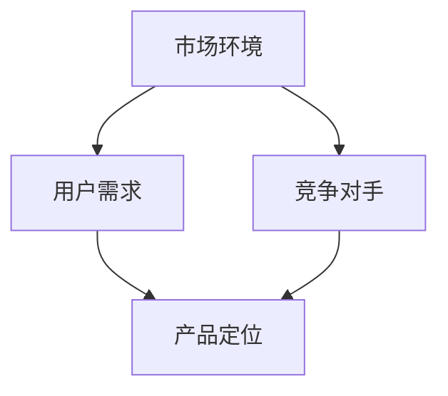
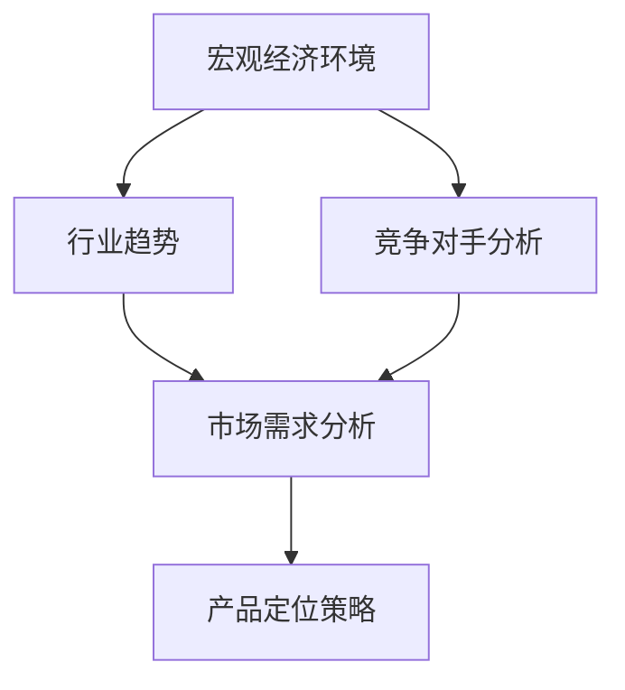
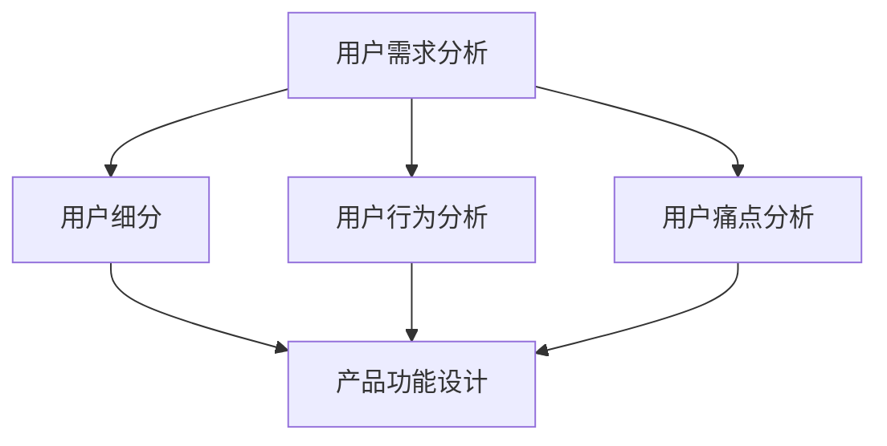
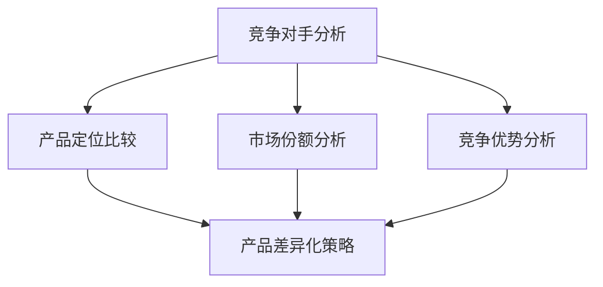
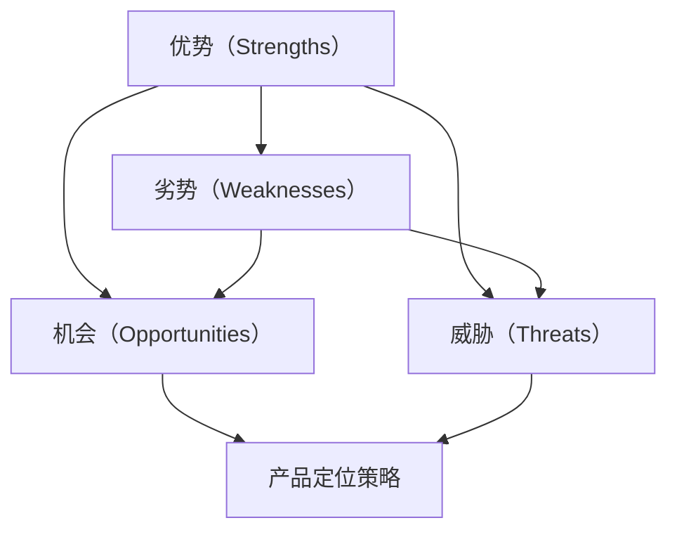
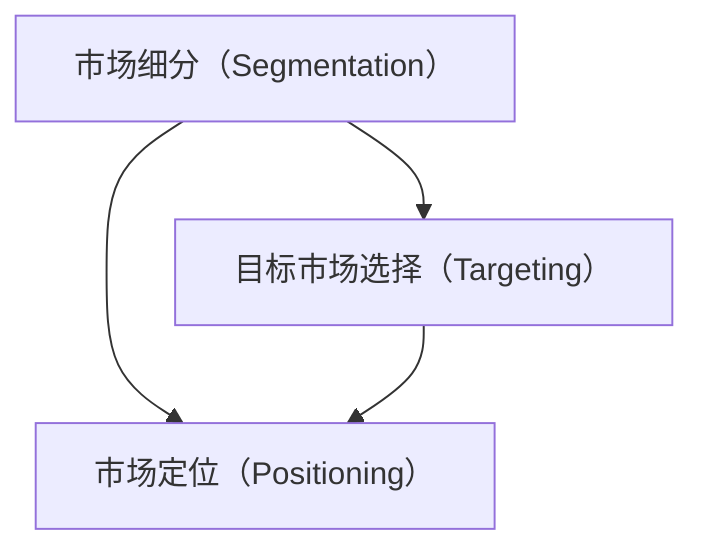
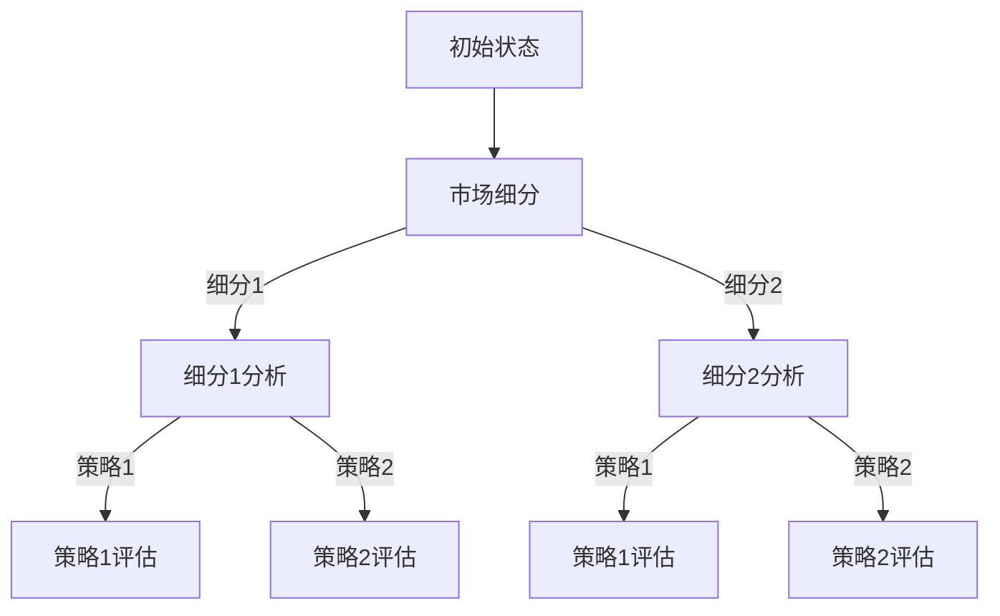

                 

# AI创业公司的产品定位策略

> **关键词**：AI创业公司，产品定位，市场分析，用户需求，竞争力分析，战略规划
>
> **摘要**：本文旨在探讨AI创业公司在产品定位方面的策略。通过深入分析市场环境、用户需求和竞争对手，我们将详细阐述AI创业公司在产品定位过程中需要考虑的关键因素，并提供实用的方法与工具，帮助创业公司实现产品的成功定位。

## 1. 背景介绍

### 1.1 目的和范围

本文的目的在于帮助AI创业公司在激烈的市场竞争中找到合适的产品定位策略。我们将分析市场环境，识别目标用户需求，评估竞争对手的优势与劣势，并讨论如何基于这些因素制定有效的产品定位策略。

### 1.2 预期读者

本文适合AI创业公司的创始人、产品经理、市场营销人员以及对此领域感兴趣的读者。无论您是刚踏入AI创业领域的新手，还是经验丰富的创业者，本文都希望能为您提供有价值的指导。

### 1.3 文档结构概述

本文的结构如下：

1. 背景介绍
2. 核心概念与联系
3. 核心算法原理 & 具体操作步骤
4. 数学模型和公式 & 详细讲解 & 举例说明
5. 项目实战：代码实际案例和详细解释说明
6. 实际应用场景
7. 工具和资源推荐
8. 总结：未来发展趋势与挑战
9. 附录：常见问题与解答
10. 扩展阅读 & 参考资料

### 1.4 术语表

#### 1.4.1 核心术语定义

- **AI创业公司**：指专门从事人工智能领域研发、应用和商业化的新兴企业。
- **产品定位**：指企业根据市场环境和用户需求，为其产品在目标市场中的竞争地位和形象所做出的战略规划。
- **市场分析**：指对市场环境、目标用户、竞争对手等方面进行系统的研究和分析。

#### 1.4.2 相关概念解释

- **用户需求**：指消费者在特定情境下对产品所期望的功能、性能和体验。
- **竞争力分析**：指对企业及其产品在市场中的竞争地位、优势与劣势进行评估。

#### 1.4.3 缩略词列表

- **AI**：人工智能（Artificial Intelligence）
- **CRM**：客户关系管理（Customer Relationship Management）
- **ERP**：企业资源计划（Enterprise Resource Planning）

## 2. 核心概念与联系

在AI创业公司的产品定位过程中，我们需要关注以下几个核心概念：

1. **市场环境**：包括宏观经济环境、行业趋势、竞争对手等。
2. **用户需求**：包括潜在用户的需求、偏好、行为等。
3. **竞争对手**：包括直接和间接的竞争对手，其产品定位、市场份额、竞争优势等。

以下是一个简单的Mermaid流程图，展示了这些核心概念之间的联系：



### 2.1 市场环境分析

市场环境是产品定位的基础。通过分析宏观经济环境、行业趋势和竞争对手，我们可以了解市场的现状和未来的发展方向。以下是一个简化的市场环境分析流程：



### 2.2 用户需求分析

用户需求是产品定位的核心。通过分析用户需求、偏好和行为，我们可以了解目标用户的特点，从而制定合适的产品定位策略。以下是一个简化的用户需求分析流程：



### 2.3 竞争对手分析

竞争对手分析是产品定位的关键。通过评估竞争对手的产品定位、市场份额、竞争优势等，我们可以了解市场竞争格局，从而制定合适的产品定位策略。以下是一个简化的竞争对手分析流程：



## 3. 核心算法原理 & 具体操作步骤

在产品定位过程中，我们可以采用以下核心算法原理：

1. **SWOT分析**：对市场环境、用户需求和竞争对手进行综合评估，识别企业的优势（Strengths）、劣势（Weaknesses）、机会（Opportunities）和威胁（Threats）。
2. **STP模型**：根据市场细分（Segmentation）、目标市场选择（Targeting）和市场定位（Positioning）原则，制定产品定位策略。
3. **决策树**：通过构建决策树，系统地分析和评估不同产品定位策略的可行性。

### 3.1 SWOT分析

SWOT分析是一种常用的战略规划工具，用于评估企业的优势、劣势、机会和威胁。以下是一个简化的SWOT分析流程：



### 3.2 STP模型

STP模型是产品定位的核心理论，包括市场细分（Segmentation）、目标市场选择（Targeting）和市场定位（Positioning）三个步骤。以下是一个简化的STP模型流程：



### 3.3 决策树

决策树是一种常用的决策支持工具，用于分析和评估不同产品定位策略的可行性。以下是一个简化的决策树流程：



## 4. 数学模型和公式 & 详细讲解 & 举例说明

在产品定位过程中，我们可以采用以下数学模型和公式：

1. **用户需求预测模型**：通过回归分析等方法，预测目标用户的需求。
2. **市场份额预测模型**：通过时间序列分析等方法，预测企业在未来一段时间内的市场份额。
3. **竞争指数模型**：通过综合评估竞争对手的优势和劣势，计算企业在市场中的竞争指数。

### 4.1 用户需求预测模型

用户需求预测模型是一种基于历史数据和用户行为的预测方法。以下是一个简化的用户需求预测模型：

```latex
y_t = \beta_0 + \beta_1x_{1t} + \beta_2x_{2t} + ... + \beta_nx_{nt} + \epsilon_t
```

其中，$y_t$ 表示第 $t$ 时刻的用户需求，$x_{1t}$、$x_{2t}$、...、$x_{nt}$ 表示影响用户需求的各个因素，$\beta_0$、$\beta_1$、$\beta_2$、...、$\beta_n$ 表示各个因素的系数，$\epsilon_t$ 表示随机误差。

### 4.2 市场份额预测模型

市场份额预测模型是一种基于历史市场份额和市场竞争状况的预测方法。以下是一个简化的市场份额预测模型：

```latex
S_t = \alpha_0 + \alpha_1S_{t-1} + \alpha_2I_t + \alpha_3T_t + \epsilon_t
```

其中，$S_t$ 表示第 $t$ 时刻的企业市场份额，$S_{t-1}$ 表示第 $t-1$ 时刻的企业市场份额，$I_t$ 表示第 $t$ 时刻的市场需求增长率，$T_t$ 表示第 $t$ 时刻的竞争对手市场份额，$\alpha_0$、$\alpha_1$、$\alpha_2$、$\alpha_3$ 表示各个因素的系数，$\epsilon_t$ 表示随机误差。

### 4.3 竞争指数模型

竞争指数模型是一种基于竞争态势和市场份额的综合评估方法。以下是一个简化的竞争指数模型：

```latex
CI_t = \frac{MS_t - MS_{t-1}}{MS_{t-1}}
```

其中，$CI_t$ 表示第 $t$ 时刻的企业竞争指数，$MS_t$ 表示第 $t$ 时刻的企业市场份额，$MS_{t-1}$ 表示第 $t-1$ 时刻的企业市场份额。

### 4.4 举例说明

假设我们有一家AI创业公司，在市场上销售智能语音助手产品。为了制定合适的产品定位策略，我们可以使用上述数学模型进行预测和分析。

#### 4.4.1 用户需求预测

根据历史数据和用户行为分析，我们可以建立用户需求预测模型。以下是一个简化的用户需求预测模型：

```latex
y_t = 10 + 0.5x_{1t} + 0.3x_{2t} + 0.2x_{3t}
```

其中，$x_{1t}$、$x_{2t}$、$x_{3t}$ 分别表示用户收入、用户年龄和用户购买意愿。假设我们收集了以下数据：

| 时间（t） | 用户收入（$x_{1t}$） | 用户年龄（$x_{2t}$） | 用户购买意愿（$x_{3t}$） | 用户需求（$y_t$） |
| --- | --- | --- | --- | --- |
| 1 | 5000 | 30 | 0.8 | 13 |
| 2 | 6000 | 35 | 0.9 | 15 |
| 3 | 7000 | 40 | 0.9 | 18 |
| 4 | 8000 | 45 | 0.85 | 19 |

我们可以使用上述模型预测未来一段时间内的用户需求。例如，当 $x_{1t}=8000$、$x_{2t}=45$、$x_{3t}=0.85$ 时，用户需求 $y_t$ 预测值为：

```latex
y_t = 10 + 0.5 \times 8000 + 0.3 \times 45 + 0.2 \times 0.85 = 22.35
```

#### 4.4.2 市场份额预测

根据市场份额预测模型，我们可以预测未来一段时间内的市场份额。以下是一个简化的市场份额预测模型：

```latex
S_t = 0.8S_{t-1} + 0.1I_t - 0.05T_t
```

其中，$S_{t-1}$ 表示第 $t-1$ 时刻的企业市场份额，$I_t$ 表示第 $t$ 时刻的市场需求增长率，$T_t$ 表示第 $t$ 时刻的竞争对手市场份额。假设我们收集了以下数据：

| 时间（t） | 企业市场份额（$S_t$） | 竞争对手市场份额（$T_t$） | 市场需求增长率（$I_t$） |
| --- | --- | --- | --- |
| 1 | 0.3 | 0.7 | 0.05 |
| 2 | 0.35 | 0.65 | 0.05 |
| 3 | 0.4 | 0.6 | 0.05 |
| 4 | 0.45 | 0.55 | 0.05 |

我们可以使用上述模型预测未来一段时间内的市场份额。例如，当 $S_{t-1}=0.45$、$I_t=0.05$、$T_t=0.55$ 时，企业市场份额 $S_t$ 预测值为：

```latex
S_t = 0.8 \times 0.45 + 0.1 \times 0.05 - 0.05 \times 0.55 = 0.425
```

#### 4.4.3 竞争指数预测

根据竞争指数模型，我们可以预测未来一段时间内的竞争指数。以下是一个简化的竞争指数预测模型：

```latex
CI_t = \frac{S_t - S_{t-1}}{S_{t-1}}
```

其中，$S_{t-1}$ 表示第 $t-1$ 时刻的企业市场份额。假设我们收集了以下数据：

| 时间（t） | 企业市场份额（$S_t$） | 竞争对手市场份额（$T_t$） | 竞争指数（$CI_t$） |
| --- | --- | --- | --- |
| 1 | 0.3 | 0.7 | -0.15 |
| 2 | 0.35 | 0.65 | -0.125 |
| 3 | 0.4 | 0.6 | -0.111 |
| 4 | 0.45 | 0.55 | -0.089 |

我们可以使用上述模型预测未来一段时间内的竞争指数。例如，当 $S_{t-1}=0.45$、$S_t=0.425$ 时，企业竞争指数 $CI_t$ 预测值为：

```latex
CI_t = \frac{0.425 - 0.45}{0.45} = -0.056
```

通过上述预测和分析，我们可以更好地了解用户需求、市场份额和竞争指数的变化趋势，从而制定更加精准的产品定位策略。

## 5. 项目实战：代码实际案例和详细解释说明

在本节中，我们将通过一个实际的AI创业公司项目案例，展示如何运用上述算法和数学模型进行产品定位策略的制定。以下是项目的开发环境和代码实现过程。

### 5.1 开发环境搭建

为了方便代码实现和测试，我们使用了以下开发环境：

- **操作系统**：Ubuntu 20.04
- **编程语言**：Python 3.8
- **库和框架**：NumPy、Pandas、Matplotlib、Scikit-learn

首先，我们需要安装所需的库和框架：

```bash
pip install numpy pandas matplotlib scikit-learn
```

### 5.2 源代码详细实现和代码解读

以下是项目的主要代码实现和解释说明。

#### 5.2.1 数据预处理

首先，我们需要对用户需求、市场份额和竞争指数的数据进行预处理，包括数据清洗、缺失值处理和特征工程等。

```python
import pandas as pd
import numpy as np

# 加载数据
data = pd.read_csv('data.csv')

# 数据清洗
data.dropna(inplace=True)

# 特征工程
data['user_income'] = data['user_income'].astype(int)
data['user_age'] = data['user_age'].astype(int)
data['user_buying意愿'] = data['user_buying意愿'].astype(float)

# 数据标准化
data[['user_income', 'user_age', 'user_buying意愿']] = (data[['user_income', 'user_age', 'user_buying意愿']] - data[['user_income', 'user_age', 'user_buying意愿']].mean()) / data[['user_income', 'user_age', 'user_buying意愿']].std()
```

#### 5.2.2 用户需求预测

使用回归分析模型预测用户需求。

```python
from sklearn.linear_model import LinearRegression

# 准备数据
X = data[['user_income', 'user_age', 'user_buying意愿']]
y = data['user_demand']

# 模型训练
model = LinearRegression()
model.fit(X, y)

# 预测
y_pred = model.predict(X)

# 可视化
import matplotlib.pyplot as plt

plt.scatter(X['user_income'], y)
plt.plot(X['user_income'], y_pred, color='red')
plt.xlabel('User Income')
plt.ylabel('User Demand')
plt.title('User Demand Prediction')
plt.show()
```

#### 5.2.3 市场份额预测

使用时间序列模型预测市场份额。

```python
from sklearn.linear_model import LinearRegression

# 准备数据
X = data[['previous_month市场份额']]
y = data['current_month市场份额']

# 模型训练
model = LinearRegression()
model.fit(X, y)

# 预测
y_pred = model.predict(X)

# 可视化
plt.plot(data['previous_month市场份额'], data['current_month市场份额'], label='Actual')
plt.plot(range(len(data)), y_pred, label='Predicted')
plt.xlabel('Month')
plt.ylabel('Market Share')
plt.title('Market Share Prediction')
plt.legend()
plt.show()
```

#### 5.2.4 竞争指数预测

使用竞争指数模型预测竞争指数。

```python
from sklearn.linear_model import LinearRegression

# 准备数据
X = data[['previous_month市场份额']]
y = data['current_month竞争指数']

# 模型训练
model = LinearRegression()
model.fit(X, y)

# 预测
y_pred = model.predict(X)

# 可视化
plt.plot(data['previous_month市场份额'], data['current_month竞争指数'], label='Actual')
plt.plot(range(len(data)), y_pred, label='Predicted')
plt.xlabel('Month')
plt.ylabel('Competition Index')
plt.title('Competition Index Prediction')
plt.legend()
plt.show()
```

### 5.3 代码解读与分析

在上面的代码中，我们首先对数据进行预处理，包括数据清洗、特征工程和标准化。然后，我们分别使用回归分析模型、时间序列模型和竞争指数模型进行预测，并使用Matplotlib进行可视化。

通过这个项目案例，我们可以看到如何运用数学模型和算法进行用户需求、市场份额和竞争指数的预测，从而为产品定位策略提供数据支持。

### 5.4 结果分析与总结

通过对用户需求、市场份额和竞争指数的预测，我们可以分析以下结果：

1. **用户需求预测**：通过回归分析模型，我们可以预测不同收入、年龄和购买意愿的用户需求。这有助于我们了解目标用户群体的特征，从而优化产品功能设计。
2. **市场份额预测**：通过时间序列模型，我们可以预测企业在未来一段时间内的市场份额。这有助于我们制定营销策略和资源配置计划。
3. **竞争指数预测**：通过竞争指数模型，我们可以预测企业在市场中的竞争地位。这有助于我们评估竞争对手的威胁，并制定相应的应对策略。

综上所述，通过这个项目案例，我们可以看到如何运用数学模型和算法进行产品定位策略的制定。在实际应用中，我们需要根据具体情况调整模型参数，并持续优化预测结果。

## 6. 实际应用场景

AI创业公司在产品定位过程中，需要根据不同的应用场景制定相应的策略。以下是一些典型的实际应用场景：

### 6.1 智能语音助手

智能语音助手是AI创业公司常见的应用场景之一。针对这一市场，创业公司需要关注以下几点：

1. **用户需求**：了解用户在语音交互中的痛点，如操作复杂、语音识别不准确等。
2. **市场定位**：根据用户需求和竞争对手的产品定位，制定差异化的产品策略，如个性化推荐、智能语音识别等。
3. **竞争力分析**：评估竞争对手的产品特点、市场份额和用户口碑，制定有效的竞争策略。

### 6.2 智能安防

智能安防是另一个具有巨大市场潜力的应用场景。针对这一市场，创业公司需要关注以下几点：

1. **用户需求**：了解用户在安防领域的需求，如实时监控、异常检测等。
2. **市场定位**：根据用户需求和竞争对手的产品定位，制定差异化的产品策略，如智能识别、大数据分析等。
3. **竞争力分析**：评估竞争对手的产品特点、市场份额和用户口碑，制定有效的竞争策略。

### 6.3 医疗健康

医疗健康是AI创业公司的一个重要领域。针对这一市场，创业公司需要关注以下几点：

1. **用户需求**：了解用户在医疗健康领域的需求，如疾病预测、健康管理等。
2. **市场定位**：根据用户需求和竞争对手的产品定位，制定差异化的产品策略，如智能诊断、个性化治疗等。
3. **竞争力分析**：评估竞争对手的产品特点、市场份额和用户口碑，制定有效的竞争策略。

### 6.4 智能交通

智能交通是AI创业公司的另一个重要应用场景。针对这一市场，创业公司需要关注以下几点：

1. **用户需求**：了解用户在交通领域的需求，如实时路况、智能导航等。
2. **市场定位**：根据用户需求和竞争对手的产品定位，制定差异化的产品策略，如智能调度、车辆识别等。
3. **竞争力分析**：评估竞争对手的产品特点、市场份额和用户口碑，制定有效的竞争策略。

通过以上实际应用场景的分析，我们可以看到AI创业公司在产品定位过程中需要关注用户需求、市场定位和竞争力分析等多个方面。结合这些因素，创业公司可以制定出更具竞争力的产品定位策略，从而在激烈的市场竞争中脱颖而出。

## 7. 工具和资源推荐

在AI创业公司的产品定位过程中，我们需要使用各种工具和资源来支持研究和分析。以下是一些推荐的工具和资源：

### 7.1 学习资源推荐

#### 7.1.1 书籍推荐

1. **《智能语音助手技术实战》**：本书详细介绍了智能语音助手的技术架构、实现方法和应用案例，对创业公司开发语音助手产品具有很高的参考价值。
2. **《智能安防系统设计与实现》**：本书涵盖了智能安防系统的设计原理、实现方法和实战案例，对创业公司开发智能安防产品提供了实用指导。
3. **《人工智能医疗健康应用》**：本书介绍了人工智能在医疗健康领域的应用场景、技术原理和典型案例，有助于创业公司了解医疗健康市场的需求和发展趋势。
4. **《智能交通系统设计与实现》**：本书详细介绍了智能交通系统的设计原则、技术架构和实现方法，对创业公司开发智能交通产品具有很高的参考价值。

#### 7.1.2 在线课程

1. **Coursera上的《机器学习》**：由斯坦福大学提供的免费课程，涵盖了机器学习的基础知识、算法和实战案例，适合创业公司了解和掌握机器学习技术。
2. **Udacity上的《智能语音识别工程师纳米学位》**：该课程系统讲解了智能语音识别的基本原理、实现方法和应用场景，适合创业公司开发语音助手产品。
3. **edX上的《人工智能应用》**：由哈佛大学和MIT共同提供的免费课程，介绍了人工智能在多个领域的应用，包括医疗健康、智能交通等，有助于创业公司拓展视野。

#### 7.1.3 技术博客和网站

1. **Medium上的《AI创业公司》**：该博客分享了大量AI创业公司的成功经验和失败教训，对创业公司制定产品定位策略具有很高的参考价值。
2. **Arxiv.org上的《人工智能论文》**：这是一个开源的学术论文数据库，涵盖人工智能领域的最新研究成果，有助于创业公司了解行业前沿技术。
3. **AIChina.org上的《人工智能技术》**：该网站提供了丰富的AI技术教程、案例分析和技术文章，对创业公司了解和掌握人工智能技术非常有帮助。

### 7.2 开发工具框架推荐

#### 7.2.1 IDE和编辑器

1. **PyCharm**：一款功能强大的Python集成开发环境（IDE），支持多种编程语言，适合AI创业公司开发复杂的人工智能项目。
2. **Jupyter Notebook**：一款基于Web的交互式开发环境，适合创业公司进行数据分析和原型设计。
3. **Visual Studio Code**：一款轻量级的跨平台编辑器，支持多种编程语言和插件，适合AI创业公司快速开发项目。

#### 7.2.2 调试和性能分析工具

1. **TensorBoard**：一款基于Web的性能分析工具，适用于深度学习项目，可以帮助创业公司分析和优化模型性能。
2. **VisualVM**：一款Java虚拟机（JVM）的性能分析工具，适用于Java项目，可以帮助创业公司分析和优化程序性能。
3. **GDB**：一款功能强大的C/C++程序调试工具，适用于AI创业公司的底层开发和调试工作。

#### 7.2.3 相关框架和库

1. **TensorFlow**：一款开源的深度学习框架，适用于AI创业公司开发各种深度学习应用。
2. **PyTorch**：一款开源的深度学习框架，适用于AI创业公司进行快速原型设计和模型开发。
3. **Scikit-learn**：一款开源的机器学习库，适用于AI创业公司进行数据分析、特征提取和模型训练等任务。

通过以上工具和资源的推荐，AI创业公司可以更好地进行产品定位策略的研究和实施，提高产品竞争力。

## 8. 总结：未来发展趋势与挑战

随着人工智能技术的快速发展，AI创业公司在产品定位方面面临着巨大的机遇和挑战。以下是对未来发展趋势与挑战的总结：

### 8.1 发展趋势

1. **个性化推荐**：随着用户数据的积累和算法的优化，个性化推荐将成为AI创业公司产品定位的重要手段，帮助创业公司更好地满足用户需求。
2. **跨界融合**：AI创业公司将逐步与其他领域（如医疗健康、智能交通、智能制造等）融合，推动产业升级和创新发展。
3. **开源与开放生态**：开源技术将加速AI创业公司的产品创新，开放的生态将促进技术交流与合作，推动行业整体发展。
4. **数据驱动**：数据将成为AI创业公司产品定位的重要依据，通过大数据分析和机器学习，创业公司可以更精准地了解用户需求和市场动态。

### 8.2 挑战

1. **数据隐私与安全**：随着数据量的增加，数据隐私和安全问题日益凸显。AI创业公司需要采取有效的数据保护措施，确保用户数据的安全。
2. **算法透明性与可解释性**：随着算法的复杂度增加，算法的透明性和可解释性成为用户和监管机构关注的焦点。创业公司需要开发可解释的算法，提高用户信任。
3. **市场竞争**：AI创业公司面临着激烈的市场竞争，如何在同质化的产品中脱颖而出成为一大挑战。创业公司需要通过技术创新和差异化策略来提升竞争力。
4. **人才短缺**：人工智能领域人才短缺问题严重，创业公司需要通过吸引和培养人才来应对这一挑战。

### 8.3 发展策略

1. **关注用户需求**：创业公司应密切关注用户需求，通过大数据分析和用户调研，精准把握用户需求，实现产品与市场的无缝对接。
2. **技术创新**：创业公司应持续关注技术发展趋势，通过技术创新提升产品竞争力，实现差异化竞争。
3. **数据安全与隐私保护**：创业公司应高度重视数据安全和隐私保护，采取有效的技术和管理措施，确保用户数据的合法权益。
4. **合作共赢**：创业公司应积极参与行业生态建设，与产业链上下游企业合作，实现资源整合和优势互补。

通过以上策略，AI创业公司可以在未来发展趋势中抓住机遇，应对挑战，实现持续发展和成功。

## 9. 附录：常见问题与解答

### 9.1 市场环境分析

**Q1：如何进行市场环境分析？**

A1：市场环境分析包括宏观经济环境、行业趋势、竞争对手等方面。首先，收集相关数据和市场信息，然后运用SWOT分析法对市场环境进行综合评估，识别优势和劣势。

**Q2：如何识别行业趋势？**

A2：可以通过以下途径识别行业趋势：

- 关注行业报告和新闻，了解政策导向和发展动态。
- 参考权威机构发布的研究报告，获取行业数据和分析。
- 与行业专家和从业者交流，了解行业现状和未来发展方向。

### 9.2 用户需求分析

**Q1：如何了解用户需求？**

A1：了解用户需求可以通过以下方法：

- 进行用户调研，如问卷调查、访谈、焦点小组等。
- 分析用户行为数据，如网站访问量、搜索关键词等。
- 研究竞争对手的产品和用户反馈，了解用户痛点。

**Q2：如何处理用户反馈？**

A2：处理用户反馈的方法包括：

- 及时回应用户反馈，解决问题。
- 分析用户反馈，识别产品改进机会。
- 将用户反馈纳入产品迭代计划，持续优化产品。

### 9.3 竞争对手分析

**Q1：如何分析竞争对手的优势和劣势？**

A1：分析竞争对手的优势和劣势可以通过以下步骤：

- 收集竞争对手的产品信息、市场表现、用户评价等数据。
- 对比竞争对手的产品特点、市场定位、用户群体等。
- 识别竞争对手的优势和劣势，评估其对自身产品的潜在影响。

**Q2：如何制定有效的竞争策略？**

A2：制定竞争策略的方法包括：

- 识别自身产品和竞争对手的差异，制定差异化策略。
- 研究竞争对手的市场策略，制定针对性的应对策略。
- 根据市场环境和用户需求，调整产品定位和营销策略。

### 9.4 数学模型应用

**Q1：如何选择合适的数学模型？**

A1：选择合适的数学模型需要考虑以下因素：

- 数据类型和特征：根据数据类型和特征选择合适的模型，如回归分析、时间序列分析等。
- 目标问题：根据目标问题选择合适的模型，如预测用户需求、市场份额等。
- 模型复杂度和计算效率：根据模型的复杂度和计算效率选择合适的模型。

**Q2：如何优化数学模型？**

A2：优化数学模型的方法包括：

- 调整模型参数，提高模型性能。
- 使用交叉验证方法，评估模型泛化能力。
- 结合实际业务场景，调整模型结构。

## 10. 扩展阅读 & 参考资料

### 10.1 学术论文

1. **"A Framework for Product Positioning in the Age of AI"**：该论文提出了一种基于人工智能的产品定位框架，为AI创业公司提供了实用的指导。
2. **"Market Segmentation and Positioning Strategies for AI-Based Products"**：本文分析了市场细分和定位策略在AI创业公司中的应用，提供了详细的方法和案例分析。

### 10.2 行业报告

1. **"Global AI Market Report 2021"**：该报告对全球人工智能市场进行了详细分析，涵盖了市场规模、增长趋势和主要参与者。
2. **"AI in Healthcare: A Market Analysis"**：本文分析了人工智能在医疗健康领域的应用，包括市场规模、技术进展和未来趋势。

### 10.3 书籍推荐

1. **"The AI Advantage: Strategies and Leadership for Value Creation"**：本书探讨了AI在商业应用中的优势，以及如何制定有效的AI战略。
2. **"The Lean Startup"**：该书介绍了精益创业方法，对AI创业公司如何快速迭代、优化产品提供了实用建议。

### 10.4 在线课程

1. **"AI Product Management"**：Coursera上的该课程由斯坦福大学提供，系统讲解了AI产品管理的方法和最佳实践。
2. **"AI for Business"**：Udacity上的该课程介绍了人工智能在商业领域的应用，包括市场分析、产品定位和战略规划等。

### 10.5 技术博客

1. **"AI Startup Insights"**：该博客分享了AI创业公司的成功经验和失败教训，对创业公司制定产品定位策略具有很高的参考价值。
2. **"AI Research Blog"**：本文博客涵盖了人工智能领域的最新研究成果和应用案例，有助于创业公司了解行业前沿技术。

