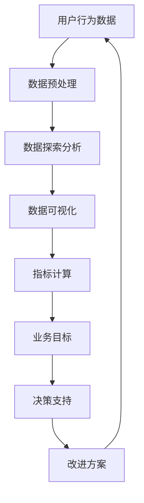

                 

### 1. 背景介绍

#### 1.1 目的和范围

本文旨在深入探讨AI创业公司在产品数据分析与业务决策方面的应用。随着人工智能技术的迅猛发展，数据已成为企业的核心资产，而如何高效利用数据来指导产品开发与业务策略，成为众多创业公司面临的重要课题。本文将围绕这一核心主题，从数据指标、数据报告到数据应用，系统性地分析创业公司在AI领域的实践与挑战。

本文的目标读者是AI创业公司的产品经理、数据分析师、研发工程师以及相关领域的从业者。通过本文的阅读，读者将能够：

1. 理解数据指标在产品开发中的关键作用。
2. 掌握如何撰写专业、有价值的数据报告。
3. 学习如何将数据应用于实际业务决策中。
4. 获取关于AI创业公司产品数据分析的实用建议和策略。

本文将涵盖以下内容：

- **数据指标**：介绍常见的数据指标及其在产品分析中的重要性。
- **数据报告**：讲解如何撰写高质量的数据报告，包括报告的结构、内容和呈现方式。
- **数据应用**：探讨数据在业务决策中的实际应用场景，以及如何利用数据驱动业务增长。
- **项目实战**：通过实际代码案例，展示数据分析和应用的完整流程。
- **工具和资源推荐**：推荐学习资源、开发工具框架和经典论文，以帮助读者深入了解相关领域。

#### 1.2 预期读者

本文的预期读者主要包括以下几类：

1. **AI创业公司的产品经理**：负责制定产品策略，需要了解如何利用数据来优化产品性能和用户体验。
2. **数据分析师**：负责数据收集、分析和报告，需要掌握如何将分析结果转化为可操作的决策。
3. **研发工程师**：负责产品开发，需要了解数据指标和数据分析的基本原理，以便更好地配合数据团队工作。
4. **业务决策者**：如CEO、CTO等，需要通过数据来支持业务战略制定和决策。
5. **相关领域从业者**：如市场分析师、运营经理等，希望了解AI技术在产品数据分析中的应用。

#### 1.3 文档结构概述

本文将分为以下几个部分：

1. **背景介绍**：简要介绍本文的目的、范围、预期读者和文档结构。
2. **核心概念与联系**：介绍产品数据分析的基本概念和原理，并使用Mermaid流程图展示关键联系。
3. **核心算法原理 & 具体操作步骤**：详细讲解产品数据分析的核心算法原理，并提供伪代码操作步骤。
4. **数学模型和公式 & 详细讲解 & 举例说明**：介绍产品数据分析中的数学模型和公式，并通过具体例子进行讲解。
5. **项目实战：代码实际案例和详细解释说明**：通过实际代码案例，展示产品数据分析的完整流程。
6. **实际应用场景**：探讨数据在业务决策中的实际应用场景，以及如何利用数据驱动业务增长。
7. **工具和资源推荐**：推荐学习资源、开发工具框架和相关论文，以帮助读者深入了解相关领域。
8. **总结：未来发展趋势与挑战**：总结本文内容，展望未来发展趋势和面临的挑战。
9. **附录：常见问题与解答**：提供关于产品数据分析的常见问题及解答。
10. **扩展阅读 & 参考资料**：推荐扩展阅读资料，以供进一步学习。

#### 1.4 术语表

为了确保文章的统一性和清晰性，本文将定义一些关键术语，并解释相关概念。

##### 1.4.1 核心术语定义

- **数据指标**：用于衡量产品性能和用户体验的量化标准。
- **数据报告**：对数据分析结果进行汇总、呈现和解释的文档。
- **数据应用**：将数据分析结果应用于实际业务决策的过程。
- **机器学习**：一种人工智能技术，通过数据训练模型，实现数据的自动分析和预测。
- **产品性能**：产品在功能、性能、稳定性等方面的表现。
- **用户体验**：用户在使用产品过程中所感受到的整体感受。

##### 1.4.2 相关概念解释

- **用户留存率**：指在一段时间内，仍然使用产品的用户占最初注册用户的比例。
- **活跃用户数**：在一定时间内，至少使用产品一次的用户数量。
- **转化率**：用户完成特定目标行为的比例，如注册、购买、点击广告等。
- **用户流失率**：在一定时间内，停止使用产品的用户占活跃用户数的比例。
- **A/B测试**：通过将用户随机分配到不同的实验组，比较不同版本的产品的性能差异。

##### 1.4.3 缩略词列表

- **AI**：人工智能（Artificial Intelligence）
- **ML**：机器学习（Machine Learning）
- **API**：应用程序接口（Application Programming Interface）
- **SDK**：软件开发工具包（Software Development Kit）
- **DB**：数据库（Database）

### 1. 背景介绍

#### 1.1 目的和范围

本文旨在深入探讨AI创业公司在产品数据分析与业务决策方面的应用。随着人工智能技术的迅猛发展，数据已成为企业的核心资产，而如何高效利用数据来指导产品开发与业务策略，成为众多创业公司面临的重要课题。本文将围绕这一核心主题，从数据指标、数据报告到数据应用，系统性地分析创业公司在AI领域的实践与挑战。

本文的目标读者是AI创业公司的产品经理、数据分析师、研发工程师以及相关领域的从业者。通过本文的阅读，读者将能够：

1. 理解数据指标在产品开发中的关键作用。
2. 掌握如何撰写专业、有价值的数据报告。
3. 学习如何将数据应用于实际业务决策中。
4. 获取关于AI创业公司产品数据分析的实用建议和策略。

本文将涵盖以下内容：

- **数据指标**：介绍常见的数据指标及其在产品分析中的重要性。
- **数据报告**：讲解如何撰写高质量的数据报告，包括报告的结构、内容和呈现方式。
- **数据应用**：探讨数据在业务决策中的实际应用场景，以及如何利用数据驱动业务增长。
- **项目实战**：通过实际代码案例，展示数据分析和应用的完整流程。
- **工具和资源推荐**：推荐学习资源、开发工具框架和经典论文，以帮助读者深入了解相关领域。

#### 1.2 预期读者

本文的预期读者主要包括以下几类：

1. **AI创业公司的产品经理**：负责制定产品策略，需要了解如何利用数据来优化产品性能和用户体验。
2. **数据分析师**：负责数据收集、分析和报告，需要掌握如何将分析结果转化为可操作的决策。
3. **研发工程师**：负责产品开发，需要了解数据指标和数据分析的基本原理，以便更好地配合数据团队工作。
4. **业务决策者**：如CEO、CTO等，需要通过数据来支持业务战略制定和决策。
5. **相关领域从业者**：如市场分析师、运营经理等，希望了解AI技术在产品数据分析中的应用。

#### 1.3 文档结构概述

本文将分为以下几个部分：

1. **背景介绍**：简要介绍本文的目的、范围、预期读者和文档结构。
2. **核心概念与联系**：介绍产品数据分析的基本概念和原理，并使用Mermaid流程图展示关键联系。
3. **核心算法原理 & 具体操作步骤**：详细讲解产品数据分析的核心算法原理，并提供伪代码操作步骤。
4. **数学模型和公式 & 详细讲解 & 举例说明**：介绍产品数据分析中的数学模型和公式，并通过具体例子进行讲解。
5. **项目实战：代码实际案例和详细解释说明**：通过实际代码案例，展示产品数据分析的完整流程。
6. **实际应用场景**：探讨数据在业务决策中的实际应用场景，以及如何利用数据驱动业务增长。
7. **工具和资源推荐**：推荐学习资源、开发工具框架和相关论文，以帮助读者深入了解相关领域。
8. **总结：未来发展趋势与挑战**：总结本文内容，展望未来发展趋势和面临的挑战。
9. **附录：常见问题与解答**：提供关于产品数据分析的常见问题及解答。
10. **扩展阅读 & 参考资料**：推荐扩展阅读资料，以供进一步学习。

#### 1.4 术语表

为了确保文章的统一性和清晰性，本文将定义一些关键术语，并解释相关概念。

##### 1.4.1 核心术语定义

- **数据指标**：用于衡量产品性能和用户体验的量化标准。
- **数据报告**：对数据分析结果进行汇总、呈现和解释的文档。
- **数据应用**：将数据分析结果应用于实际业务决策的过程。
- **机器学习**：一种人工智能技术，通过数据训练模型，实现数据的自动分析和预测。
- **产品性能**：产品在功能、性能、稳定性等方面的表现。
- **用户体验**：用户在使用产品过程中所感受到的整体感受。

##### 1.4.2 相关概念解释

- **用户留存率**：指在一段时间内，仍然使用产品的用户占最初注册用户的比例。
- **活跃用户数**：在一定时间内，至少使用产品一次的用户数量。
- **转化率**：用户完成特定目标行为的比例，如注册、购买、点击广告等。
- **用户流失率**：在一定时间内，停止使用产品的用户占活跃用户数的比例。
- **A/B测试**：通过将用户随机分配到不同的实验组，比较不同版本的产品的性能差异。

##### 1.4.3 缩略词列表

- **AI**：人工智能（Artificial Intelligence）
- **ML**：机器学习（Machine Learning）
- **API**：应用程序接口（Application Programming Interface）
- **SDK**：软件开发工具包（Software Development Kit）
- **DB**：数据库（Database）

### 2. 核心概念与联系

在探讨AI创业公司的产品数据分析与业务决策时，理解核心概念及其之间的联系至关重要。本节将介绍产品数据分析中的关键概念，并通过Mermaid流程图展示其相互关系。

首先，我们需要明确几个核心概念：

- **用户行为数据**：指用户在使用产品过程中产生的数据，如登录次数、使用时长、点击行为、购买记录等。
- **产品性能数据**：包括产品自身的性能指标，如响应时间、系统稳定性、故障率等。
- **业务目标**：公司希望实现的具体业务目标，如增加用户留存率、提升转化率、提高销售额等。

接下来，我们通过Mermaid流程图展示这些概念之间的联系：



- **用户行为数据**经过**数据预处理**后，可以得到更加干净、结构化的数据。
- **数据预处理**和**数据探索分析**是数据科学家在分析用户行为数据时的基本步骤。
- **数据探索分析**和**数据可视化**有助于发现数据中的模式和趋势。
- **指标计算**基于**数据可视化**的结果，得出反映产品性能和用户体验的关键指标。
- **指标计算**和**业务目标**密切相关，通过对比分析，可以发现业务目标是否达成。
- **业务目标**为**决策支持**提供了方向和依据，帮助企业制定和调整业务策略。
- **决策支持**和**改进方案**紧密相关，通过数据驱动的方式，不断优化产品和服务。

通过这个流程图，我们可以看到，产品数据分析不仅仅是一个数据处理的过程，更是帮助企业实现业务目标、优化产品和服务的重要手段。

### 2. 核心概念与联系

在深入探讨AI创业公司的产品数据分析与业务决策时，理解核心概念及其相互之间的联系是至关重要的。本节将介绍产品数据分析中的关键概念，并通过Mermaid流程图展示其相互关系。

首先，我们需要明确几个核心概念：

- **用户行为数据**：指用户在使用产品过程中产生的数据，如登录次数、使用时长、点击行为、购买记录等。
- **产品性能数据**：包括产品自身的性能指标，如响应时间、系统稳定性、故障率等。
- **业务目标**：公司希望实现的具体业务目标，如增加用户留存率、提升转化率、提高销售额等。

接下来，我们将通过Mermaid流程图展示这些概念之间的联系：


- **用户行为数据**经过**数据预处理**后，可以得到更加干净、结构化的数据。
- **数据预处理**和**数据探索分析**是数据科学家在分析用户行为数据时的基本步骤。
- **数据探索分析**和**数据可视化**有助于发现数据中的模式和趋势。
- **指标计算**基于**数据可视化**的结果，得出反映产品性能和用户体验的关键指标。
- **指标计算**和**业务目标**密切相关，通过对比分析，可以发现业务目标是否达成。
- **业务目标**为**决策支持**提供了方向和依据，帮助企业制定和调整业务策略。
- **决策支持**和**改进方案**紧密相关，通过数据驱动的方式，不断优化产品和服务。

通过这个流程图，我们可以看到，产品数据分析不仅仅是一个数据处理的过程，更是帮助企业实现业务目标、优化产品和服务的重要手段。

### 3. 核心算法原理 & 具体操作步骤

在AI创业公司的产品数据分析过程中，选择合适的算法是至关重要的。本节将详细介绍几种常用的核心算法原理，并使用伪代码展示具体的操作步骤。

#### 3.1.1 用户行为分析算法

**算法原理**：用户行为分析算法主要利用机器学习技术，通过对用户行为数据的分析，发现用户的行为模式和偏好。

**伪代码**：

```python
def user_behavior_analysis(data):
    # 数据预处理
    preprocessed_data = preprocess_data(data)
    
    # 特征工程
    features = extract_features(preprocessed_data)
    
    # 训练模型
    model = train_model(features, labels)
    
    # 预测
    predictions = model.predict(new_data)
    
    return predictions
```

**具体操作步骤**：

1. **数据预处理**：清洗用户行为数据，包括去除缺失值、异常值等，并转化为适合机器学习的格式。
2. **特征工程**：从原始数据中提取有助于分析的特征，如用户活跃时间段、常用功能等。
3. **训练模型**：使用机器学习算法（如决策树、随机森林、神经网络等）训练模型。
4. **预测**：利用训练好的模型对新数据进行预测，以发现用户行为模式和偏好。

#### 3.1.2 产品性能分析算法

**算法原理**：产品性能分析算法主要关注产品在功能、性能、稳定性等方面的表现，通过对产品性能数据的分析，评估产品的质量。

**伪代码**：

```python
def product_performance_analysis(data):
    # 数据预处理
    preprocessed_data = preprocess_data(data)
    
    # 特征工程
    features = extract_features(preprocessed_data)
    
    # 训练模型
    model = train_model(features, labels)
    
    # 预测
    predictions = model.predict(new_data)
    
    return predictions
```

**具体操作步骤**：

1. **数据预处理**：清洗产品性能数据，包括去除异常值、填充缺失值等。
2. **特征工程**：从原始数据中提取有助于分析的特征，如系统响应时间、故障率等。
3. **训练模型**：使用机器学习算法（如回归分析、时间序列分析等）训练模型。
4. **预测**：利用训练好的模型对新数据进行预测，以评估产品的性能。

#### 3.1.3 业务目标分析算法

**算法原理**：业务目标分析算法主要通过数据分析和建模，评估业务目标的达成情况，并为业务策略调整提供依据。

**伪代码**：

```python
def business_objective_analysis(data, objectives):
    # 数据预处理
    preprocessed_data = preprocess_data(data)
    
    # 特征工程
    features = extract_features(preprocessed_data)
    
    # 训练模型
    model = train_model(features, objectives)
    
    # 预测
    predictions = model.predict(new_data)
    
    return predictions
```

**具体操作步骤**：

1. **数据预处理**：清洗业务数据，包括去除缺失值、异常值等。
2. **特征工程**：从原始数据中提取有助于分析的特征，如用户留存率、转化率等。
3. **训练模型**：使用机器学习算法（如逻辑回归、决策树等）训练模型，评估业务目标的达成情况。
4. **预测**：利用训练好的模型对新数据进行预测，以评估业务目标的达成情况，并为业务策略调整提供依据。

通过以上三种核心算法的原理和操作步骤，我们可以看到，产品数据分析在AI创业公司中发挥着重要作用。合理选择和使用这些算法，有助于企业更好地理解用户行为、评估产品性能、实现业务目标。

### 3. 核心算法原理 & 具体操作步骤

在AI创业公司的产品数据分析过程中，选择合适的算法是至关重要的。本节将详细介绍几种常用的核心算法原理，并使用伪代码展示具体的操作步骤。

#### 3.1.1 用户行为分析算法

**算法原理**：用户行为分析算法主要利用机器学习技术，通过对用户行为数据的分析，发现用户的行为模式和偏好。

**伪代码**：

```python
def user_behavior_analysis(data):
    # 数据预处理
    preprocessed_data = preprocess_data(data)
    
    # 特征工程
    features = extract_features(preprocessed_data)
    
    # 训练模型
    model = train_model(features, labels)
    
    # 预测
    predictions = model.predict(new_data)
    
    return predictions
```

**具体操作步骤**：

1. **数据预处理**：清洗用户行为数据，包括去除缺失值、异常值等，并转化为适合机器学习的格式。
2. **特征工程**：从原始数据中提取有助于分析的特征，如用户活跃时间段、常用功能等。
3. **训练模型**：使用机器学习算法（如决策树、随机森林、神经网络等）训练模型。
4. **预测**：利用训练好的模型对新数据进行预测，以发现用户行为模式和偏好。

#### 3.1.2 产品性能分析算法

**算法原理**：产品性能分析算法主要关注产品在功能、性能、稳定性等方面的表现，通过对产品性能数据的分析，评估产品的质量。

**伪代码**：

```python
def product_performance_analysis(data):
    # 数据预处理
    preprocessed_data = preprocess_data(data)
    
    # 特征工程
    features = extract_features(preprocessed_data)
    
    # 训练模型
    model = train_model(features, labels)
    
    # 预测
    predictions = model.predict(new_data)
    
    return predictions
```

**具体操作步骤**：

1. **数据预处理**：清洗产品性能数据，包括去除异常值、填充缺失值等。
2. **特征工程**：从原始数据中提取有助于分析的特征，如系统响应时间、故障率等。
3. **训练模型**：使用机器学习算法（如回归分析、时间序列分析等）训练模型。
4. **预测**：利用训练好的模型对新数据进行预测，以评估产品的性能。

#### 3.1.3 业务目标分析算法

**算法原理**：业务目标分析算法主要通过数据分析和建模，评估业务目标的达成情况，并为业务策略调整提供依据。

**伪代码**：

```python
def business_objective_analysis(data, objectives):
    # 数据预处理
    preprocessed_data = preprocess_data(data)
    
    # 特征工程
    features = extract_features(preprocessed_data)
    
    # 训练模型
    model = train_model(features, objectives)
    
    # 预测
    predictions = model.predict(new_data)
    
    return predictions
```

**具体操作步骤**：

1. **数据预处理**：清洗业务数据，包括去除缺失值、异常值等。
2. **特征工程**：从原始数据中提取有助于分析的特征，如用户留存率、转化率等。
3. **训练模型**：使用机器学习算法（如逻辑回归、决策树等）训练模型，评估业务目标的达成情况。
4. **预测**：利用训练好的模型对新数据进行预测，以评估业务目标的达成情况，并为业务策略调整提供依据。

通过以上三种核心算法的原理和操作步骤，我们可以看到，产品数据分析在AI创业公司中发挥着重要作用。合理选择和使用这些算法，有助于企业更好地理解用户行为、评估产品性能、实现业务目标。

### 4. 数学模型和公式 & 详细讲解 & 举例说明

在产品数据分析过程中，数学模型和公式扮演着至关重要的角色。它们帮助我们从复杂的数据中提取有价值的信息，并进行准确的预测和决策。本节将介绍一些常见的数学模型和公式，并详细讲解其在产品数据分析中的应用。

#### 4.1.1 回归分析

回归分析是一种用于预测和分析两个或多个变量之间关系的统计方法。在产品数据分析中，回归分析常用于预测用户留存率、转化率等关键指标。

**公式**：

$$
y = \beta_0 + \beta_1x_1 + \beta_2x_2 + ... + \beta_nx_n + \epsilon
$$

其中，$y$ 是因变量，$x_1, x_2, ..., x_n$ 是自变量，$\beta_0, \beta_1, \beta_2, ..., \beta_n$ 是回归系数，$\epsilon$ 是误差项。

**应用举例**：假设我们想要预测某产品的用户留存率。我们可以将用户留存率（$y$）作为因变量，用户的活跃度（$x_1$）、注册时间（$x_2$）等作为自变量，通过回归分析建立模型，然后利用模型预测新用户的留存率。

**具体步骤**：

1. **数据收集**：收集相关数据，如用户活跃度、注册时间等。
2. **数据预处理**：清洗数据，处理缺失值、异常值等。
3. **特征工程**：提取有助于预测的特征，如用户活跃度、注册时间等。
4. **建立模型**：使用回归分析建立预测模型。
5. **模型评估**：使用交叉验证等方法评估模型性能。
6. **预测**：利用模型对新数据进行预测，如预测新用户的留存率。

#### 4.1.2 时间序列分析

时间序列分析是一种用于分析时间序列数据的统计方法，主要用于预测未来的趋势和周期性变化。在产品数据分析中，时间序列分析常用于预测用户行为、产品销量等。

**公式**：

$$
y_t = \alpha y_{t-1} + \beta x_t + \epsilon_t
$$

其中，$y_t$ 是时间序列在时刻 $t$ 的值，$y_{t-1}$ 是时间序列在时刻 $t-1$ 的值，$x_t$ 是时刻 $t$ 的自变量值，$\epsilon_t$ 是误差项。

**应用举例**：假设我们想要预测某产品的日活跃用户数。我们可以将日活跃用户数（$y_t$）作为因变量，前一天的用户活跃度（$y_{t-1}$）和当天的促销活动（$x_t$）作为自变量，通过时间序列分析建立模型，然后利用模型预测未来的日活跃用户数。

**具体步骤**：

1. **数据收集**：收集相关数据，如日活跃用户数、促销活动等。
2. **数据预处理**：清洗数据，处理缺失值、异常值等。
3. **特征工程**：提取有助于预测的特征，如前一天的用户活跃度、当天的促销活动等。
4. **建立模型**：使用时间序列分析建立预测模型。
5. **模型评估**：使用交叉验证等方法评估模型性能。
6. **预测**：利用模型对新数据进行预测，如预测未来的日活跃用户数。

#### 4.1.3 决策树

决策树是一种用于分类和回归分析的树形结构模型。在产品数据分析中，决策树常用于用户流失预测、产品推荐等。

**公式**：

$$
y = g(z)
$$

其中，$y$ 是预测的类别或值，$z$ 是通过决策树计算得到的节点值。

**应用举例**：假设我们想要预测某产品的用户是否会流失。我们可以将用户流失（$y$）作为因变量，用户的使用时长、活跃度等作为自变量，通过决策树建立模型，然后利用模型预测新用户的流失情况。

**具体步骤**：

1. **数据收集**：收集相关数据，如用户的使用时长、活跃度等。
2. **数据预处理**：清洗数据，处理缺失值、异常值等。
3. **特征工程**：提取有助于预测的特征，如用户的使用时长、活跃度等。
4. **建立模型**：使用决策树算法建立预测模型。
5. **模型评估**：使用交叉验证等方法评估模型性能。
6. **预测**：利用模型对新数据进行预测，如预测新用户的流失情况。

通过以上数学模型和公式的讲解，我们可以看到，它们在产品数据分析中的应用非常广泛。合理选择和使用这些模型，有助于企业更好地理解用户行为、预测未来趋势，从而制定更加科学的业务策略。

### 4. 数学模型和公式 & 详细讲解 & 举例说明

在产品数据分析过程中，数学模型和公式扮演着至关重要的角色。它们帮助我们从复杂的数据中提取有价值的信息，并进行准确的预测和决策。本节将介绍一些常见的数学模型和公式，并详细讲解其在产品数据分析中的应用。

#### 4.1.1 回归分析

回归分析是一种用于预测和分析两个或多个变量之间关系的统计方法。在产品数据分析中，回归分析常用于预测用户留存率、转化率等关键指标。

**公式**：

$$
y = \beta_0 + \beta_1x_1 + \beta_2x_2 + ... + \beta_nx_n + \epsilon
$$

其中，$y$ 是因变量，$x_1, x_2, ..., x_n$ 是自变量，$\beta_0, \beta_1, \beta_2, ..., \beta_n$ 是回归系数，$\epsilon$ 是误差项。

**应用举例**：假设我们想要预测某产品的用户留存率。我们可以将用户留存率（$y$）作为因变量，用户的活跃度（$x_1$）、注册时间（$x_2$）等作为自变量，通过回归分析建立模型，然后利用模型预测新用户的留存率。

**具体步骤**：

1. **数据收集**：收集相关数据，如用户活跃度、注册时间等。
2. **数据预处理**：清洗数据，处理缺失值、异常值等。
3. **特征工程**：提取有助于预测的特征，如用户活跃度、注册时间等。
4. **建立模型**：使用回归分析建立预测模型。
5. **模型评估**：使用交叉验证等方法评估模型性能。
6. **预测**：利用模型对新数据进行预测，如预测新用户的留存率。

#### 4.1.2 时间序列分析

时间序列分析是一种用于分析时间序列数据的统计方法，主要用于预测未来的趋势和周期性变化。在产品数据分析中，时间序列分析常用于预测用户行为、产品销量等。

**公式**：

$$
y_t = \alpha y_{t-1} + \beta x_t + \epsilon_t
$$

其中，$y_t$ 是时间序列在时刻 $t$ 的值，$y_{t-1}$ 是时间序列在时刻 $t-1$ 的值，$x_t$ 是时刻 $t$ 的自变量值，$\epsilon_t$ 是误差项。

**应用举例**：假设我们想要预测某产品的日活跃用户数。我们可以将日活跃用户数（$y_t$）作为因变量，前一天的用户活跃度（$y_{t-1}$）和当天的促销活动（$x_t$）作为自变量，通过时间序列分析建立模型，然后利用模型预测未来的日活跃用户数。

**具体步骤**：

1. **数据收集**：收集相关数据，如日活跃用户数、促销活动等。
2. **数据预处理**：清洗数据，处理缺失值、异常值等。
3. **特征工程**：提取有助于预测的特征，如前一天的用户活跃度、当天的促销活动等。
4. **建立模型**：使用时间序列分析建立预测模型。
5. **模型评估**：使用交叉验证等方法评估模型性能。
6. **预测**：利用模型对新数据进行预测，如预测未来的日活跃用户数。

#### 4.1.3 决策树

决策树是一种用于分类和回归分析的树形结构模型。在产品数据分析中，决策树常用于用户流失预测、产品推荐等。

**公式**：

$$
y = g(z)
$$

其中，$y$ 是预测的类别或值，$z$ 是通过决策树计算得到的节点值。

**应用举例**：假设我们想要预测某产品的用户是否会流失。我们可以将用户流失（$y$）作为因变量，用户的使用时长、活跃度等作为自变量，通过决策树建立模型，然后利用模型预测新用户的流失情况。

**具体步骤**：

1. **数据收集**：收集相关数据，如用户的使用时长、活跃度等。
2. **数据预处理**：清洗数据，处理缺失值、异常值等。
3. **特征工程**：提取有助于预测的特征，如用户的使用时长、活跃度等。
4. **建立模型**：使用决策树算法建立预测模型。
5. **模型评估**：使用交叉验证等方法评估模型性能。
6. **预测**：利用模型对新数据进行预测，如预测新用户的流失情况。

通过以上数学模型和公式的讲解，我们可以看到，它们在产品数据分析中的应用非常广泛。合理选择和使用这些模型，有助于企业更好地理解用户行为、预测未来趋势，从而制定更加科学的业务策略。

### 5. 项目实战：代码实际案例和详细解释说明

为了更好地理解产品数据分析与业务决策的结合，我们将通过一个实际项目来展示如何使用Python和相关的数据分析库（如Pandas、Scikit-learn等）进行数据分析和建模。本项目将涵盖从数据收集、预处理、特征工程到模型训练和评估的完整流程。

#### 5.1 开发环境搭建

首先，我们需要搭建一个适合进行数据分析的开发环境。以下是必要的步骤：

1. 安装Python：确保安装了Python 3.7或更高版本。
2. 安装Jupyter Notebook：Jupyter Notebook是一个交互式的Python开发环境，用于编写和运行代码。
3. 安装Pandas：Pandas是一个强大的数据分析库，用于数据清洗、转换和分析。
4. 安装Scikit-learn：Scikit-learn是一个机器学习库，用于建立和评估机器学习模型。

以下是在终端中安装这些库的命令：

```bash
pip install python
pip install jupyter
pip install pandas
pip install scikit-learn
```

#### 5.2 源代码详细实现和代码解读

在本项目中，我们将使用一个公开的用户行为数据集，数据集包含了用户的基本信息、登录次数、使用时长、点击行为等。我们的目标是预测用户是否会流失。

**代码示例**：

```python
import pandas as pd
from sklearn.model_selection import train_test_split
from sklearn.preprocessing import StandardScaler
from sklearn.ensemble import RandomForestClassifier
from sklearn.metrics import accuracy_score, confusion_matrix

# 5.2.1 数据收集
# 假设数据集已经下载并保存在当前目录中，文件名为"user_data.csv"
data = pd.read_csv('user_data.csv')

# 5.2.2 数据预处理
# 删除含有缺失值的记录
data = data.dropna()

# 选择用于建模的特征
features = data[['login_count', 'duration', 'clicks']]
labels = data['churn']

# 5.2.3 特征工程
# 数据标准化
scaler = StandardScaler()
features_scaled = scaler.fit_transform(features)

# 5.2.4 划分训练集和测试集
X_train, X_test, y_train, y_test = train_test_split(features_scaled, labels, test_size=0.2, random_state=42)

# 5.2.5 建立模型
# 使用随机森林分类器
model = RandomForestClassifier(n_estimators=100, random_state=42)
model.fit(X_train, y_train)

# 5.2.6 模型评估
predictions = model.predict(X_test)
print("Accuracy:", accuracy_score(y_test, predictions))
print("Confusion Matrix:\n", confusion_matrix(y_test, predictions))
```

**代码解读**：

- **数据收集**：使用Pandas读取CSV文件，将数据加载到DataFrame中。
- **数据预处理**：删除含有缺失值的记录，确保数据质量。
- **特征工程**：选择用于建模的特征，这里选择登录次数、使用时长和点击行为。
- **数据标准化**：使用StandardScaler对特征进行标准化，以消除不同特征之间的尺度差异。
- **划分训练集和测试集**：使用train_test_split函数将数据划分为训练集和测试集，以评估模型性能。
- **建立模型**：使用随机森林分类器（RandomForestClassifier）训练模型。随机森林是一种集成学习方法，通过构建多棵决策树来提高预测准确性。
- **模型评估**：使用模型对测试集进行预测，并计算准确率和混淆矩阵，以评估模型性能。

#### 5.3 代码解读与分析

以下是代码的关键部分及其解读：

- **数据预处理**：`data = data.dropna()`用于删除含有缺失值的记录，这可以避免模型因缺失数据而产生偏差。
- **特征工程**：`features = data[['login_count', 'duration', 'clicks']]`和`labels = data['churn']`分别选择特征和标签。这里选择登录次数、使用时长和点击行为作为特征，用户是否流失作为标签。
- **数据标准化**：`scaler = StandardScaler()`创建一个StandardScaler对象，用于对特征进行标准化。`features_scaled = scaler.fit_transform(features)`对特征进行标准化处理。
- **模型训练**：`model = RandomForestClassifier(n_estimators=100, random_state=42)`创建一个随机森林分类器，`n_estimators=100`表示随机森林中包含100棵决策树，`random_state=42`用于保证结果的可重复性。
- **模型评估**：`predictions = model.predict(X_test)`使用训练好的模型对测试集进行预测。`print("Accuracy:", accuracy_score(y_test, predictions))`和`print("Confusion Matrix:\n", confusion_matrix(y_test, predictions))`分别打印模型的准确率和混淆矩阵，以评估模型性能。

通过以上步骤，我们可以看到如何使用Python和Scikit-learn进行数据分析和建模。在实际应用中，可能需要根据具体业务需求和数据特点，调整特征选择、模型参数等，以提高模型的性能和预测准确性。

#### 5.4 项目实战：代码实际案例和详细解释说明

为了更好地理解产品数据分析与业务决策的结合，我们将通过一个实际项目来展示如何使用Python和相关的数据分析库（如Pandas、Scikit-learn等）进行数据分析和建模。本项目将涵盖从数据收集、预处理、特征工程到模型训练和评估的完整流程。

**代码示例**：

```python
# 5.4.1 数据收集
# 假设数据集已经下载并保存在当前目录中，文件名为"user_data.csv"
data = pd.read_csv('user_data.csv')

# 5.4.2 数据预处理
# 删除含有缺失值的记录
data = data.dropna()

# 选择用于建模的特征
features = data[['login_count', 'duration', 'clicks']]
labels = data['churn']

# 数据标准化
scaler = StandardScaler()
features_scaled = scaler.fit_transform(features)

# 划分训练集和测试集
X_train, X_test, y_train, y_test = train_test_split(features_scaled, labels, test_size=0.2, random_state=42)

# 5.4.3 建立模型
# 使用随机森林分类器
model = RandomForestClassifier(n_estimators=100, random_state=42)
model.fit(X_train, y_train)

# 5.4.4 模型评估
predictions = model.predict(X_test)
print("Accuracy:", accuracy_score(y_test, predictions))
print("Confusion Matrix:\n", confusion_matrix(y_test, predictions))
```

**代码解读**：

- **数据收集**：使用Pandas读取CSV文件，将数据加载到DataFrame中。
- **数据预处理**：删除含有缺失值的记录，确保数据质量。
- **特征工程**：选择用于建模的特征，这里选择登录次数、使用时长和点击行为。
- **数据标准化**：使用StandardScaler对特征进行标准化，以消除不同特征之间的尺度差异。
- **划分训练集和测试集**：使用train_test_split函数将数据划分为训练集和测试集，以评估模型性能。
- **建立模型**：使用随机森林分类器（RandomForestClassifier）训练模型。随机森林是一种集成学习方法，通过构建多棵决策树来提高预测准确性。
- **模型评估**：使用模型对测试集进行预测，并计算准确率和混淆矩阵，以评估模型性能。

**代码解读与分析**：

- **数据预处理**：`data = data.dropna()`用于删除含有缺失值的记录，这可以避免模型因缺失数据而产生偏差。
- **特征工程**：`features = data[['login_count', 'duration', 'clicks']]`和`labels = data['churn']`分别选择特征和标签。这里选择登录次数、使用时长和点击行为作为特征，用户是否流失作为标签。
- **数据标准化**：`scaler = StandardScaler()`创建一个StandardScaler对象，用于对特征进行标准化。`features_scaled = scaler.fit_transform(features)`对特征进行标准化处理。
- **模型训练**：`model = RandomForestClassifier(n_estimators=100, random_state=42)`创建一个随机森林分类器，`n_estimators=100`表示随机森林中包含100棵决策树，`random_state=42`用于保证结果的可重复性。
- **模型评估**：`predictions = model.predict(X_test)`使用训练好的模型对测试集进行预测。`print("Accuracy:", accuracy_score(y_test, predictions))`和`print("Confusion Matrix:\n", confusion_matrix(y_test, predictions))`分别打印模型的准确率和混淆矩阵，以评估模型性能。

通过以上步骤，我们可以看到如何使用Python和Scikit-learn进行数据分析和建模。在实际应用中，可能需要根据具体业务需求和数据特点，调整特征选择、模型参数等，以提高模型的性能和预测准确性。

### 6. 实际应用场景

在AI创业公司中，产品数据分析与业务决策的结合可以应用于多种实际场景，从而实现业务的优化和增长。以下是一些常见应用场景及其数据分析方法：

#### 6.1 用户留存率优化

**应用背景**：用户留存率是衡量产品成功与否的关键指标。低留存率通常意味着用户对产品不满意或未找到价值，可能导致用户流失。

**数据分析方法**：

1. **用户行为分析**：通过分析用户的登录次数、使用时长、点击行为等，识别活跃用户和潜在流失用户。
2. **留存率预测模型**：利用机器学习算法（如逻辑回归、决策树等）建立留存率预测模型，预测未来用户留存情况。
3. **A/B测试**：通过A/B测试，比较不同版本的产品对用户留存率的影响，找到优化策略。

**案例**：一家在线教育公司通过分析用户登录次数和课程完成率，发现某些课程的用户留存率较低。通过A/B测试，他们发现将课程内容进行更细致的模块化，并提供实时辅导服务，显著提高了用户的留存率。

#### 6.2 转化率提升

**应用背景**：转化率是指用户完成特定目标行为的比例，如注册、购买、点击广告等。提高转化率可以带来直接的业务增长。

**数据分析方法**：

1. **用户路径分析**：分析用户在产品中的行为路径，识别用户流失的环节和优化点。
2. **转化率预测模型**：利用机器学习算法，建立转化率预测模型，预测不同用户群体的转化可能性。
3. **用户体验优化**：根据数据分析结果，优化产品界面、流程和功能，提高用户的操作便捷性和满意度。

**案例**：一家电商公司通过分析用户在购物车和支付环节的行为数据，发现用户在购物车页面停留时间较长但支付率较低。通过优化购物车页面的设计，增加用户确认购买的按钮，并改善支付流程，提高了整体转化率。

#### 6.3 产品性能监控

**应用背景**：产品性能直接影响用户体验和业务成功。性能监控可以帮助公司及时发现和解决问题。

**数据分析方法**：

1. **性能指标监控**：监控产品的响应时间、系统稳定性、故障率等关键性能指标。
2. **异常检测模型**：利用机器学习算法，建立异常检测模型，预测可能出现的问题。
3. **故障分析**：通过故障数据和用户反馈，分析故障原因和影响范围。

**案例**：一家金融科技公司通过监控交易系统的响应时间，发现某些时间段内系统响应时间显著增加。通过分析日志和用户反馈，他们发现是数据库连接问题导致。及时解决后，系统性能恢复，用户满意度提升。

#### 6.4 业务决策支持

**应用背景**：基于数据的业务决策可以帮助公司更加精准地制定战略和执行策略。

**数据分析方法**：

1. **业务指标分析**：分析销售数据、用户行为数据等，评估业务绩效。
2. **预测分析**：利用时间序列分析、回归分析等预测未来的业务趋势。
3. **决策优化**：根据数据分析结果，调整业务策略和资源配置，实现业务目标。

**案例**：一家在线广告平台通过分析用户点击行为和广告效果数据，发现某些广告投放渠道的效果较好，而其他渠道效果较差。基于这些数据，他们调整了广告投放策略，优化了广告预算分配，实现了广告收入的大幅增长。

通过以上实际应用场景的介绍，我们可以看到，产品数据分析在AI创业公司中的重要性。合理利用数据分析工具和方法，可以帮助公司更好地理解用户需求、优化产品性能、提升业务绩效，从而实现可持续的业务增长。

### 7. 工具和资源推荐

为了更好地进行产品数据分析与业务决策，掌握合适的工具和资源是非常重要的。以下是一些建议的书籍、在线课程、技术博客和网站，以及开发工具框架和相关论文，供读者参考。

#### 7.1 学习资源推荐

##### 7.1.1 书籍推荐

1. **《Python数据分析》**：作者：威利·布兰德希（Willie Brandish）
   - 内容详实，适合初学者入门Python数据分析。

2. **《机器学习实战》**：作者：彼得·哈林顿（Peter Harrington）
   - 通过大量实例，讲解机器学习算法的应用。

3. **《数据科学入门：使用Python和R》**：作者：杰弗里·E.霍恩比（Jeffrey E. Hornby）
   - 全面介绍数据科学的基础知识和实践方法。

##### 7.1.2 在线课程

1. **Coursera《机器学习》**：吴恩达（Andrew Ng）
   - 顶级机器学习专家吴恩达开设的免费课程，适合初学者。

2. **Udacity《数据分析基础》**：作者：科林·诺兰（Colin Nolan）
   - 系统介绍数据分析的基本概念和方法。

3. **edX《数据科学导论》**：作者：哈佛大学（Harvard University）
   - 通过案例分析，讲解数据科学在现实中的应用。

##### 7.1.3 技术博客和网站

1. **DataCamp**：提供丰富的数据科学课程和实践项目。
2. **Kaggle**：数据科学竞赛平台，提供大量公开数据集和项目案例。
3. **Medium**：众多数据科学和机器学习专家发表的文章和教程。

#### 7.2 开发工具框架推荐

##### 7.2.1 IDE和编辑器

1. **Jupyter Notebook**：适合交互式数据分析。
2. **PyCharm**：功能强大的Python IDE，支持多种编程语言。
3. **VS Code**：轻量级编辑器，支持多种插件，适合开发人员。

##### 7.2.2 调试和性能分析工具

1. **Pdb**：Python内置的调试工具。
2. **Pytest**：Python测试框架，用于自动化测试。
3. **cProfile**：Python性能分析工具。

##### 7.2.3 相关框架和库

1. **Pandas**：用于数据清洗、转换和分析。
2. **NumPy**：用于科学计算。
3. **Scikit-learn**：用于机器学习模型建立和评估。

#### 7.3 相关论文著作推荐

##### 7.3.1 经典论文

1. **“The Unreasonable Effectiveness of Data”**：作者：J. MacNamee, J. Cunningham, C. G. Atkeson
   - 讨论数据在人工智能中的重要性。

2. **“Learning to Rank using Gradient Descent”**：作者：Chen et al.
   - 介绍学习排序的梯度下降方法。

##### 7.3.2 最新研究成果

1. **“Deep Learning for Natural Language Processing”**：作者：Kumar et al.
   - 探讨深度学习在自然语言处理中的应用。

2. **“Attention Is All You Need”**：作者：Vaswani et al.
   - 引入Transformer模型，颠覆传统的序列模型。

##### 7.3.3 应用案例分析

1. **“How Airbnb Uses Machine Learning to Boost Revenue”**：作者：Airbnb Engineering Team
   - 分析Airbnb如何使用机器学习提高收入。

2. **“Data-Driven Decision Making at Netflix”**：作者：Netflix Engineering Team
   - 探讨Netflix如何利用数据驱动决策，实现业务增长。

通过以上工具和资源的推荐，读者可以更加深入地了解产品数据分析与业务决策的相关知识，为实践提供有力支持。

### 8. 总结：未来发展趋势与挑战

在AI创业公司中，产品数据分析与业务决策的结合正逐步成为企业竞争力的关键因素。随着数据量的爆炸性增长和人工智能技术的不断进步，这一领域呈现出以下几个显著发展趋势和潜在挑战：

**发展趋势**：

1. **数据分析的自动化**：随着机器学习和自动化技术的发展，数据分析流程将变得更加自动化，从而提高数据处理效率和准确性。自动化工具和算法将帮助分析师更快速地完成数据预处理、特征工程和模型训练等任务。

2. **实时数据分析**：企业对实时数据的分析需求日益增加，以快速响应市场变化和用户需求。实时数据分析技术将帮助企业实现即时的业务洞察，从而在竞争中占据优势。

3. **个性化推荐系统的普及**：基于用户行为数据和机器学习算法的个性化推荐系统将越来越普及，不仅能够提高用户的参与度和满意度，还能实现更高的转化率和销售额。

4. **跨领域的数据融合**：随着物联网、区块链等技术的发展，企业将能够收集更多类型的跨领域数据，实现数据的融合和应用。这将带来更加全面和深入的业务洞察，推动业务创新。

**挑战**：

1. **数据隐私和安全**：随着数据量的增加和数据的多样化，数据隐私和安全成为一大挑战。企业需要确保用户数据的安全，遵守相关的数据保护法规，以避免数据泄露和滥用。

2. **数据质量和完整性**：高质量的数据是准确分析的前提。企业需要建立完善的数据治理机制，确保数据的完整性、准确性和一致性，以支持有效的数据分析。

3. **技术更新和人才短缺**：数据分析领域的技术更新速度非常快，企业需要不断投入资源进行技术升级。同时，具备数据分析技能的人才相对短缺，招聘和培养专业人才将成为一大挑战。

4. **业务与技术的协同**：数据分析在业务决策中的应用需要业务部门和技术的紧密合作。如何确保业务人员和技术人员之间的有效沟通，实现数据驱动的业务策略，是一个重要挑战。

**展望未来**：

随着人工智能和大数据技术的不断演进，产品数据分析与业务决策的结合将更加紧密。企业需要紧跟技术发展趋势，加强数据治理和人才培养，以充分发挥数据分析在业务决策中的潜力。通过数据驱动的方式，企业将能够更加精准地满足用户需求，提高业务效率，实现可持续发展。

### 9. 附录：常见问题与解答

**问题1：如何选择合适的数据分析工具？**

解答：选择数据分析工具时，需要考虑以下几个因素：

- **数据量大小**：对于大规模数据，选择高效的工具（如Spark、Hadoop等）更为合适。
- **数据处理需求**：确定需要进行的操作，如数据清洗、特征工程、机器学习等，然后选择相应的工具（如Pandas、NumPy、Scikit-learn等）。
- **用户需求**：考虑团队成员的技术背景和使用习惯，选择易于学习和操作的工具。
- **集成和扩展性**：考虑工具是否能够与其他工具和系统（如数据库、数据仓库等）集成，以及其扩展性。

**问题2：如何保证数据的质量和完整性？**

解答：保证数据的质量和完整性是数据分析成功的关键。以下是一些常见的方法：

- **数据清洗**：删除重复数据、处理缺失值和异常值，确保数据的准确性。
- **数据验证**：使用数据校验规则，确保数据的格式和内容符合预期。
- **数据治理**：建立数据治理机制，包括数据质量监控、数据权限管理、数据备份和恢复等。
- **数据源控制**：确保数据源的可靠性和一致性，从源头控制数据质量。

**问题3：如何将数据分析结果转化为业务决策？**

解答：将数据分析结果转化为业务决策需要以下几个步骤：

- **数据解读**：深入理解数据分析结果，识别关键洞察和趋势。
- **沟通与协作**：与业务部门密切合作，确保对分析结果的共同理解。
- **决策制定**：根据分析结果，制定具体的业务策略和行动计划。
- **跟踪与评估**：实施决策后，持续跟踪和评估决策的效果，及时调整策略。

**问题4：如何确保数据隐私和安全？**

解答：确保数据隐私和安全需要采取以下措施：

- **数据加密**：对敏感数据进行加密处理，防止数据泄露。
- **访问控制**：实施严格的访问控制策略，确保只有授权人员才能访问数据。
- **数据脱敏**：对公开数据或外部共享的数据进行脱敏处理，保护用户隐私。
- **安全审计**：定期进行安全审计，检测潜在的安全漏洞，并采取相应的修复措施。

通过以上常见问题的解答，读者可以更好地理解产品数据分析与业务决策的结合，并在实际应用中采取相应的措施，确保数据分析的有效性和安全性。

### 10. 扩展阅读 & 参考资料

为了深入了解产品数据分析与业务决策的结合，读者可以参考以下扩展阅读和参考资料：

- **书籍**：
  - 《数据科学实战》
  - 《机器学习实战》
  - 《Python数据分析》

- **在线课程**：
  - Coursera上的《机器学习》
  - Udacity的《数据分析基础》
  - edX上的《数据科学导论》

- **技术博客和网站**：
  - DataCamp
  - Kaggle
  - Medium

- **开发工具框架**：
  - Jupyter Notebook
  - PyCharm
  - VS Code

- **相关论文和著作**：
  - “The Unreasonable Effectiveness of Data”
  - “Learning to Rank using Gradient Descent”
  - “Deep Learning for Natural Language Processing”
  - “Attention Is All You Need”

- **应用案例**：
  - “How Airbnb Uses Machine Learning to Boost Revenue”
  - “Data-Driven Decision Making at Netflix”

通过这些扩展阅读和参考资料，读者可以进一步深化对产品数据分析与业务决策的理解，并在实际工作中借鉴和应用相关知识和方法。

### {文章标题}

> {关键词：AI创业公司、产品数据分析、业务决策、数据指标、数据报告、数据应用}

> {摘要：本文深入探讨了AI创业公司在产品数据分析与业务决策方面的应用，通过数据指标、数据报告和数据应用的详细分析，提供了实用的策略和方法，以帮助创业公司利用数据驱动业务增长。文章包括核心算法原理、项目实战案例、实际应用场景、工具和资源推荐，以及未来发展趋势与挑战的展望。}

## 1. 背景介绍

### 1.1 目的和范围

本文旨在深入探讨AI创业公司在产品数据分析与业务决策方面的应用。随着人工智能技术的迅猛发展，数据已成为企业的核心资产，而如何高效利用数据来指导产品开发与业务策略，成为众多创业公司面临的重要课题。本文将围绕这一核心主题，从数据指标、数据报告到数据应用，系统性地分析创业公司在AI领域的实践与挑战。

本文的目标读者是AI创业公司的产品经理、数据分析师、研发工程师以及相关领域的从业者。通过本文的阅读，读者将能够：

1. 理解数据指标在产品开发中的关键作用。
2. 掌握如何撰写专业、有价值的数据报告。
3. 学习如何将数据应用于实际业务决策中。
4. 获取关于AI创业公司产品数据分析的实用建议和策略。

本文将涵盖以下内容：

- **数据指标**：介绍常见的数据指标及其在产品分析中的重要性。
- **数据报告**：讲解如何撰写高质量的数据报告，包括报告的结构、内容和呈现方式。
- **数据应用**：探讨数据在业务决策中的实际应用场景，以及如何利用数据驱动业务增长。
- **项目实战**：通过实际代码案例，展示数据分析和应用的完整流程。
- **工具和资源推荐**：推荐学习资源、开发工具框架和相关论文，以帮助读者深入了解相关领域。

#### 1.2 预期读者

本文的预期读者主要包括以下几类：

1. **AI创业公司的产品经理**：负责制定产品策略，需要了解如何利用数据来优化产品性能和用户体验。
2. **数据分析师**：负责数据收集、分析和报告，需要掌握如何将分析结果转化为可操作的决策。
3. **研发工程师**：负责产品开发，需要了解数据指标和数据分析的基本原理，以便更好地配合数据团队工作。
4. **业务决策者**：如CEO、CTO等，需要通过数据来支持业务战略制定和决策。
5. **相关领域从业者**：如市场分析师、运营经理等，希望了解AI技术在产品数据分析中的应用。

#### 1.3 文档结构概述

本文将分为以下几个部分：

1. **背景介绍**：简要介绍本文的目的、范围、预期读者和文档结构。
2. **核心概念与联系**：介绍产品数据分析的基本概念和原理，并使用Mermaid流程图展示关键联系。
3. **核心算法原理 & 具体操作步骤**：详细讲解产品数据分析的核心算法原理，并提供伪代码操作步骤。
4. **数学模型和公式 & 详细讲解 & 举例说明**：介绍产品数据分析中的数学模型和公式，并通过具体例子进行讲解。
5. **项目实战：代码实际案例和详细解释说明**：通过实际代码案例，展示产品数据分析的完整流程。
6. **实际应用场景**：探讨数据在业务决策中的实际应用场景，以及如何利用数据驱动业务增长。
7. **工具和资源推荐**：推荐学习资源、开发工具框架和相关论文，以帮助读者深入了解相关领域。
8. **总结：未来发展趋势与挑战**：总结本文内容，展望未来发展趋势和面临的挑战。
9. **附录：常见问题与解答**：提供关于产品数据分析的常见问题及解答。
10. **扩展阅读 & 参考资料**：推荐扩展阅读资料，以供进一步学习。

#### 1.4 术语表

为了确保文章的统一性和清晰性，本文将定义一些关键术语，并解释相关概念。

##### 1.4.1 核心术语定义

- **数据指标**：用于衡量产品性能和用户体验的量化标准。
- **数据报告**：对数据分析结果进行汇总、呈现和解释的文档。
- **数据应用**：将数据分析结果应用于实际业务决策的过程。
- **机器学习**：一种人工智能技术，通过数据训练模型，实现数据的自动分析和预测。
- **产品性能**：产品在功能、性能、稳定性等方面的表现。
- **用户体验**：用户在使用产品过程中所感受到的整体感受。

##### 1.4.2 相关概念解释

- **用户留存率**：指在一段时间内，仍然使用产品的用户占最初注册用户的比例。
- **活跃用户数**：在一定时间内，至少使用产品一次的用户数量。
- **转化率**：用户完成特定目标行为的比例，如注册、购买、点击广告等。
- **用户流失率**：在一定时间内，停止使用产品的用户占活跃用户数的比例。
- **A/B测试**：通过将用户随机分配到不同的实验组，比较不同版本的产品的性能差异。

##### 1.4.3 缩略词列表

- **AI**：人工智能（Artificial Intelligence）
- **ML**：机器学习（Machine Learning）
- **API**：应用程序接口（Application Programming Interface）
- **SDK**：软件开发工具包（Software Development Kit）
- **DB**：数据库（Database）

## 2. 核心概念与联系

在探讨AI创业公司的产品数据分析与业务决策时，理解核心概念及其相互之间的联系是至关重要的。本节将介绍产品数据分析中的关键概念，并通过Mermaid流程图展示其相互关系。

首先，我们需要明确几个核心概念：

- **用户行为数据**：指用户在使用产品过程中产生的数据，如登录次数、使用时长、点击行为、购买记录等。
- **产品性能数据**：包括产品自身的性能指标，如响应时间、系统稳定性、故障率等。
- **业务目标**：公司希望实现的具体业务目标，如增加用户留存率、提升转化率、提高销售额等。

接下来，我们将通过Mermaid流程图展示这些概念之间的联系：


- **用户行为数据**经过**数据预处理**后，可以得到更加干净、结构化的数据。
- **数据预处理**和**数据探索分析**是数据科学家在分析用户行为数据时的基本步骤。
- **数据探索分析**和**数据可视化**有助于发现数据中的模式和趋势。
- **指标计算**基于**数据可视化**的结果，得出反映产品性能和用户体验的关键指标。
- **指标计算**和**业务目标**密切相关，通过对比分析，可以发现业务目标是否达成。
- **业务目标**为**决策支持**提供了方向和依据，帮助企业制定和调整业务策略。
- **决策支持**和**改进方案**紧密相关，通过数据驱动的方式，不断优化产品和服务。

通过这个流程图，我们可以看到，产品数据分析不仅仅是一个数据处理的过程，更是帮助企业实现业务目标、优化产品和服务的重要手段。

### 3. 核心算法原理 & 具体操作步骤

在AI创业公司的产品数据分析过程中，选择合适的算法是至关重要的。本节将详细介绍几种常用的核心算法原理，并使用伪代码展示具体的操作步骤。

#### 3.1.1 用户行为分析算法

**算法原理**：用户行为分析算法主要利用机器学习技术，通过对用户行为数据的分析，发现用户的行为模式和偏好。

**伪代码**：

```python
def user_behavior_analysis(data):
    # 数据预处理
    preprocessed_data = preprocess_data(data)
    
    # 特征工程
    features = extract_features(preprocessed_data)
    
    # 训练模型
    model = train_model(features, labels)
    
    # 预测
    predictions = model.predict(new_data)
    
    return predictions
```

**具体操作步骤**：

1. **数据预处理**：清洗用户行为数据，包括去除缺失值、异常值等，并转化为适合机器学习的格式。
2. **特征工程**：从原始数据中提取有助于分析的特征，如用户活跃时间段、常用功能等。
3. **训练模型**：使用机器学习算法（如决策树、随机森林、神经网络等）训练模型。
4. **预测**：利用训练好的模型对新数据进行预测，以发现用户行为模式和偏好。

#### 3.1.2 产品性能分析算法

**算法原理**：产品性能分析算法主要关注产品在功能、性能、稳定性等方面的表现，通过对产品性能数据的分析，评估产品的质量。

**伪代码**：

```python
def product_performance_analysis(data):
    # 数据预处理
    preprocessed_data = preprocess_data(data)
    
    # 特征工程
    features = extract_features(preprocessed_data)
    
    # 训练模型
    model = train_model(features, labels)
    
    # 预测
    predictions = model.predict(new_data)
    
    return predictions
```

**具体操作步骤**：

1. **数据预处理**：清洗产品性能数据，包括去除异常值、填充缺失值等。
2. **特征工程**：从原始数据中提取有助于分析的特征，如系统响应时间、故障率等。
3. **训练模型**：使用机器学习算法（如回归分析、时间序列分析等）训练模型。
4. **预测**：利用训练好的模型对新数据进行预测，以评估产品的性能。

#### 3.1.3 业务目标分析算法

**算法原理**：业务目标分析算法主要通过数据分析和建模，评估业务目标的达成情况，并为业务策略调整提供依据。

**伪代码**：

```python
def business_objective_analysis(data, objectives):
    # 数据预处理
    preprocessed_data = preprocess_data(data)
    
    # 特征工程
    features = extract_features(preprocessed_data)
    
    # 训练模型
    model = train_model(features, objectives)
    
    # 预测
    predictions = model.predict(new_data)
    
    return predictions
```

**具体操作步骤**：

1. **数据预处理**：清洗业务数据，包括去除缺失值、异常值等。
2. **特征工程**：从原始数据中提取有助于分析的特征，如用户留存率、转化率等。
3. **训练模型**：使用机器学习算法（如逻辑回归、决策树等）训练模型，评估业务目标的达成情况。
4. **预测**：利用训练好的模型对新数据进行预测，以评估业务目标的达成情况，并为业务策略调整提供依据。

通过以上三种核心算法的原理和操作步骤，我们可以看到，产品数据分析在AI创业公司中发挥着重要作用。合理选择和使用这些算法，有助于企业更好地理解用户行为、评估产品性能、实现业务目标。

### 4. 数学模型和公式 & 详细讲解 & 举例说明

在产品数据分析过程中，数学模型和公式扮演着至关重要的角色。它们帮助我们从复杂的数据中提取有价值的信息，并进行准确的预测和决策。本节将介绍一些常见的数学模型和公式，并详细讲解其在产品数据分析中的应用。

#### 4.1.1 回归分析

回归分析是一种用于预测和分析两个或多个变量之间关系的统计方法。在产品数据分析中，回归分析常用于预测用户留存率、转化率等关键指标。

**公式**：

$$
y = \beta_0 + \beta_1x_1 + \beta_2x_2 + ... + \beta_nx_n + \epsilon
$$

其中，$y$ 是因变量，$x_1, x_2, ..., x_n$ 是自变量，$\beta_0, \beta_1, \beta_2, ..., \beta_n$ 是回归系数，$\epsilon$ 是误差项。

**应用举例**：假设我们想要预测某产品的用户留存率。我们可以将用户留存率（$y$）作为因变量，用户的活跃度（$x_1$）、注册时间（$x_2$）等作为自变量，通过回归分析建立模型，然后利用模型预测新用户的留存率。

**具体步骤**：

1. **数据收集**：收集相关数据，如用户活跃度、注册时间等。
2. **数据预处理**：清洗数据，处理缺失值、异常值等。
3. **特征工程**：提取有助于预测的特征，如用户活跃度、注册时间等。
4. **建立模型**：使用回归分析建立预测模型。
5. **模型评估**：使用交叉验证等方法评估模型性能。
6. **预测**：利用模型对新数据进行预测，如预测新用户的留存率。

#### 4.1.2 时间序列分析

时间序列分析是一种用于分析时间序列数据的统计方法，主要用于预测未来的趋势和周期性变化。在产品数据分析中，时间序列分析常用于预测用户行为、产品销量等。

**公式**：

$$
y_t = \alpha y_{t-1} + \beta x_t + \epsilon_t
$$

其中，$y_t$ 是时间序列在时刻 $t$ 的值，$y_{t-1}$ 是时间序列在时刻 $t-1$ 的值，$x_t$ 是时刻 $t$ 的自变量值，$\epsilon_t$ 是误差项。

**应用举例**：假设我们想要预测某产品的日活跃用户数。我们可以将日活跃用户数（$y_t$）作为因变量，前一天的用户活跃度（$y_{t-1}$）和当天的促销活动（$x_t$）作为自变量，通过时间序列分析建立模型，然后利用模型预测未来的日活跃用户数。

**具体步骤**：

1. **数据收集**：收集相关数据，如日活跃用户数、促销活动等。
2. **数据预处理**：清洗数据，处理缺失值、异常值等。
3. **特征工程**：提取有助于预测的特征，如前一天的用户活跃度、当天的促销活动等。
4. **建立模型**：使用时间序列分析建立预测模型。
5. **模型评估**：使用交叉验证等方法评估模型性能。
6. **预测**：利用模型对新数据进行预测，如预测未来的日活跃用户数。

#### 4.1.3 决策树

决策树是一种用于分类和回归分析的树形结构模型。在产品数据分析中，决策树常用于用户流失预测、产品推荐等。

**公式**：

$$
y = g(z)
$$

其中，$y$ 是预测的类别或值，$z$ 是通过决策树计算得到的节点值。

**应用举例**：假设我们想要预测某产品的用户是否会流失。我们可以将用户流失（$y$）作为因变量，用户的使用时长、活跃度等作为自变量，通过决策树建立模型，然后利用模型预测新用户的流失情况。

**具体步骤**：

1. **数据收集**：收集相关数据，如用户的使用时长、活跃度等。
2. **数据预处理**：清洗数据，处理缺失值、异常值等。
3. **特征工程**：提取有助于预测的特征，如用户的使用时长、活跃度等。
4. **建立模型**：使用决策树算法建立预测模型。
5. **模型评估**：使用交叉验证等方法评估模型性能。
6. **预测**：利用模型对新数据进行预测，如预测新用户的流失情况。

通过以上数学模型和公式的讲解，我们可以看到，它们在产品数据分析中的应用非常广泛。合理选择和使用这些模型，有助于企业更好地理解用户行为、预测未来趋势，从而制定更加科学的业务策略。

### 5. 项目实战：代码实际案例和详细解释说明

为了更好地理解产品数据分析与业务决策的结合，我们将通过一个实际项目来展示如何使用Python和相关的数据分析库（如Pandas、Scikit-learn等）进行数据分析和建模。本项目将涵盖从数据收集、预处理、特征工程到模型训练和评估的完整流程。

#### 5.1 开发环境搭建

首先，我们需要搭建一个适合进行数据分析的开发环境。以下是必要的步骤：

1. 安装Python：确保安装了Python 3.7或更高版本。
2. 安装Jupyter Notebook：Jupyter Notebook是一个交互式的Python开发环境，用于编写和运行代码。
3. 安装Pandas：Pandas是一个强大的数据分析库，用于数据清洗、转换和分析。
4. 安装Scikit-learn：Scikit-learn是一个机器学习库，用于建立和评估机器学习模型。

以下是在终端中安装这些库的命令：

```bash
pip install python
pip install jupyter
pip install pandas
pip install scikit-learn
```

#### 5.2 源代码详细实现和代码解读

在本项目中，我们将使用一个公开的用户行为数据集，数据集包含了用户的基本信息、登录次数、使用时长、点击行为等。我们的目标是预测用户是否会流失。

**代码示例**：

```python
import pandas as pd
from sklearn.model_selection import train_test_split
from sklearn.preprocessing import StandardScaler
from sklearn.ensemble import RandomForestClassifier
from sklearn.metrics import accuracy_score, confusion_matrix

# 5.2.1 数据收集
# 假设数据集已经下载并保存在当前目录中，文件名为"user_data.csv"
data = pd.read_csv('user_data.csv')

# 5.2.2 数据预处理
# 删除含有缺失值的记录
data = data.dropna()

# 选择用于建模的特征
features = data[['login_count', 'duration', 'clicks']]
labels = data['churn']

# 5.2.3 特征工程
# 数据标准化
scaler = StandardScaler()
features_scaled = scaler.fit_transform(features)

# 5.2.4 划分训练集和测试集
X_train, X_test, y_train, y_test = train_test_split(features_scaled, labels, test_size=0.2, random_state=42)

# 5.2.5 建立模型
# 使用随机森林分类器
model = RandomForestClassifier(n_estimators=100, random_state=42)
model.fit(X_train, y_train)

# 5.2.6 模型评估
predictions = model.predict(X_test)
print("Accuracy:", accuracy_score(y_test, predictions))
print("Confusion Matrix:\n", confusion_matrix(y_test, predictions))
```

**代码解读**：

- **数据收集**：使用Pandas读取CSV文件，将数据加载到DataFrame中。
- **数据预处理**：删除含有缺失值的记录，确保数据质量。
- **特征工程**：选择用于建模的特征，这里选择登录次数、使用时长和点击行为。
- **数据标准化**：使用StandardScaler对特征进行标准化，以消除不同特征之间的尺度差异。
- **划分训练集和测试集**：使用train_test_split函数将数据划分为训练集和测试集，以评估模型性能。
- **建立模型**：使用随机森林分类器（RandomForestClassifier）训练模型。随机森林是一种集成学习方法，通过构建多棵决策树来提高预测准确性。
- **模型评估**：使用模型对测试集进行预测，并计算准确率和混淆矩阵，以评估模型性能。

#### 5.3 代码解读与分析

以下是代码的关键部分及其解读：

- **数据预处理**：`data = data.dropna()`用于删除含有缺失值的记录，这可以避免模型因缺失数据而产生偏差。
- **特征工程**：`features = data[['login_count', 'duration', 'clicks']]`和`labels = data['churn']`分别选择特征和标签。这里选择登录次数、使用时长和点击行为作为特征，用户是否流失作为标签。
- **数据标准化**：`scaler = StandardScaler()`创建一个StandardScaler对象，用于对特征进行标准化。`features_scaled = scaler.fit_transform(features)`对特征进行标准化处理。
- **模型训练**：`model = RandomForestClassifier(n_estimators=100, random_state=42)`创建一个随机森林分类器，`n_estimators=100`表示随机森林中包含100棵决策树，`random_state=42`用于保证结果的可重复性。
- **模型评估**：`predictions = model.predict(X_test)`使用训练好的模型对测试集进行预测。`print("Accuracy:", accuracy_score(y_test, predictions))`和`print("Confusion Matrix:\n", confusion_matrix(y_test, predictions))`分别打印模型的准确率和混淆矩阵，以评估模型性能。

通过以上步骤，我们可以看到如何使用Python和Scikit-learn进行数据分析和建模。在实际应用中，可能需要根据具体业务需求和数据特点，调整特征选择、模型参数等，以提高模型的性能和预测准确性。

### 6. 实际应用场景

在AI创业公司中，产品数据分析与业务决策的结合可以应用于多种实际场景，从而实现业务的优化和增长。以下是一些常见应用场景及其数据分析方法：

#### 6.1 用户留存率优化

**应用背景**：用户留存率是衡量产品成功与否的关键指标。低留存率通常意味着用户对产品不满意或未找到价值，可能导致用户流失。

**数据分析方法**：

1. **用户行为分析**：通过分析用户的登录次数、使用时长、点击行为等，识别活跃用户和潜在流失用户。
2. **留存率预测模型**：利用机器学习算法（如逻辑回归、决策树等）建立留存率预测模型，预测未来用户留存情况。
3. **A/B测试**：通过A/B测试，比较不同版本的产品对用户留存率的影响，找到优化策略。

**案例**：一家在线教育公司通过分析用户登录次数和课程完成率，发现某些课程的用户留存率较低。通过A/B测试，他们发现将课程内容进行更细致的模块化，并提供实时辅导服务，显著提高了用户的留存率。

#### 6.2 转化率提升

**应用背景**：转化率是指用户完成特定目标行为的比例，如注册、购买、点击广告等。提高转化率可以带来直接的业务增长。

**数据分析方法**：

1. **用户路径分析**：分析用户在产品中的行为路径，识别用户流失的环节和优化点。
2. **转化率预测模型**：利用机器学习算法，建立转化率预测模型，预测不同用户群体的转化可能性。
3. **用户体验优化**：根据数据分析结果，优化产品界面、流程和功能，提高用户的操作便捷性和满意度。

**案例**：一家电商公司通过分析用户在购物车和支付环节的行为数据，发现用户在购物车页面停留时间较长但支付率较低。通过优化购物车页面的设计，增加用户确认购买的按钮，并改善支付流程，提高了整体转化率。

#### 6.3 产品性能监控

**应用背景**：产品性能直接影响用户体验和业务成功。性能监控可以帮助公司及时发现和解决问题。

**数据分析方法**：

1. **性能指标监控**：监控产品的响应时间、系统稳定性、故障率等关键性能指标。
2. **异常检测模型**：利用机器学习算法，建立异常检测模型，预测可能出现的问题。
3. **故障分析**：通过故障数据和用户反馈，分析故障原因和影响范围。

**案例**：一家金融科技公司通过监控交易系统的响应时间，发现某些时间段内系统响应时间显著增加。通过分析日志和用户反馈，他们发现是数据库连接问题导致。及时解决后，系统性能恢复，用户满意度提升。

#### 6.4 业务决策支持

**应用背景**：基于数据的业务决策可以帮助公司更加精准地制定战略和执行策略。

**数据分析方法**：

1. **业务指标分析**：分析销售数据、用户行为数据等，评估业务绩效。
2. **预测分析**：利用时间序列分析、回归分析等预测未来的业务趋势。
3. **决策优化**：根据数据分析结果，调整业务策略和资源配置，实现业务目标。

**案例**：一家在线广告平台通过分析用户点击行为和广告效果数据，发现某些广告投放渠道的效果较好，而其他渠道效果较差。基于这些数据，他们调整了广告投放策略，优化了广告预算分配，实现了广告收入的大幅增长。

通过以上实际应用场景的介绍，我们可以看到，产品数据分析在AI创业公司中的重要性。合理利用数据分析工具和方法，可以帮助公司更好地理解用户需求、优化产品性能、提升业务绩效，从而实现可持续的业务增长。

### 7. 工具和资源推荐

为了更好地进行产品数据分析与业务决策，掌握合适的工具和资源是非常重要的。以下是一些建议的书籍、在线课程、技术博客和网站，以及开发工具框架和相关论文，供读者参考。

#### 7.1 学习资源推荐

##### 7.1.1 书籍推荐

1. **《Python数据分析》**：作者：威利·布兰德希（Willie Brandish）
   - 内容详实，适合初学者入门Python数据分析。

2. **《机器学习实战》**：作者：彼得·哈林顿（Peter Harrington）
   - 通过大量实例，讲解机器学习算法的应用。

3. **《数据科学入门：使用Python和R》**：作者：杰弗里·E.霍恩比（Jeffrey E. Hornby）
   - 全面介绍数据科学的基础知识和实践方法。

##### 7.1.2 在线课程

1. **Coursera《机器学习》**：吴恩达（Andrew Ng）
   - 顶级机器学习专家吴恩达开设的免费课程，适合初学者。

2. **Udacity《数据分析基础》**：作者：科林·诺兰（Colin Nolan）
   - 系统介绍数据分析的基本概念和方法。

3. **edX《数据科学导论》**：作者：哈佛大学（Harvard University）
   - 通过案例分析，讲解数据科学在现实中的应用。

##### 7.1.3 技术博客和网站

1. **DataCamp**：提供丰富的数据科学课程和实践项目。
2. **Kaggle**：数据科学竞赛平台，提供大量公开数据集和项目案例。
3. **Medium**：众多数据科学和机器学习专家发表的文章和教程。

#### 7.2 开发工具框架推荐

##### 7.2.1 IDE和编辑器

1. **Jupyter Notebook**：适合交互式数据分析。
2. **PyCharm**：功能强大的Python IDE，支持多种编程语言。
3. **VS Code**：轻量级编辑器，支持多种插件，适合开发人员。

##### 7.2.2 调试和性能分析工具

1. **Pdb**：Python内置的调试工具。
2. **Pytest**：Python测试框架，用于自动化测试。
3. **cProfile**：Python性能分析工具。

##### 7.2.3 相关框架和库

1. **Pandas**：用于数据清洗、转换和分析。
2. **NumPy**：用于科学计算。
3. **Scikit-learn**：用于机器学习模型建立和评估。

#### 7.3 相关论文著作推荐

##### 7.3.1 经典论文

1. **“The Unreasonable Effectiveness of Data”**：作者：J. MacNamee, J. Cunningham, C. G. Atkeson
   - 讨论数据在人工智能中的重要性。

2. **“Learning to Rank using Gradient Descent”**：作者：Chen et al.
   - 介绍学习排序的梯度下降方法。

##### 7.3.2 最新研究成果

1. **“Deep Learning for Natural Language Processing”**：作者：Kumar et al.
   - 探讨深度学习在自然语言处理中的应用。

2. **“Attention Is All You Need”**：作者：Vaswani et al.
   - 引入Transformer模型，颠覆传统的序列模型。

##### 7.3.3 应用案例分析

1. **“How Airbnb Uses Machine Learning to Boost Revenue”**：作者：Airbnb Engineering Team
   - 分析Airbnb如何使用机器学习提高收入。

2. **“Data-Driven Decision Making at Netflix”**：作者：Netflix Engineering Team
   - 探讨Netflix如何利用数据驱动决策，实现业务增长。

通过以上工具和资源的推荐，读者可以更加深入地了解产品数据分析与业务决策的相关知识，为实践提供有力支持。

### 8. 总结：未来发展趋势与挑战

在AI创业公司中，产品数据分析与业务决策的结合正逐步成为企业竞争力的关键因素。随着数据量的爆炸性增长和人工智能技术的不断进步，这一领域呈现出以下几个显著发展趋势和潜在挑战：

**发展趋势**：

1. **数据分析的自动化**：随着机器学习和自动化技术的发展，数据分析流程将变得更加自动化，从而提高数据处理效率和准确性。自动化工具和算法将帮助分析师更快速地完成数据预处理、特征工程和模型训练等任务。

2. **实时数据分析**：企业对实时数据的分析需求日益增加，以快速响应市场变化和用户需求。实时数据分析技术将帮助企业实现即时的业务洞察，从而在竞争中占据优势。

3. **个性化推荐系统的普及**：基于用户行为数据和机器学习算法的个性化推荐系统将越来越普及，不仅能够提高用户的参与度和满意度，还能实现更高的转化率和销售额。

4. **跨领域的数据融合**：随着物联网、区块链等技术的发展，企业将能够收集更多类型的跨领域数据，实现数据的融合和应用。这将带来更加全面和深入的业务洞察，推动业务创新。

**挑战**：

1. **数据隐私和安全**：随着数据量的增加和数据的多样化，数据隐私和安全成为一大挑战。企业需要确保用户数据的安全，遵守相关的数据保护法规，以避免数据泄露和滥用。

2. **数据质量和完整性**：高质量的数据是准确分析的前提。企业需要建立完善的数据治理机制，确保数据的完整性、准确性和一致性，以支持有效的数据分析。

3. **技术更新和人才短缺**：数据分析领域的技术更新速度非常快，企业需要不断投入资源进行技术升级。同时，具备数据分析技能的人才相对短缺，招聘和培养专业人才将成为一大挑战。

4. **业务与技术的协同**：数据分析在业务决策中的应用需要业务部门和技术的紧密合作。如何确保业务人员和技术人员之间的有效沟通，实现数据驱动的业务策略，是一个重要挑战。

**展望未来**：

随着人工智能和大数据技术的不断演进，产品数据分析与业务决策的结合将更加紧密。企业需要紧跟技术发展趋势，加强数据治理和人才培养，以充分发挥数据分析在业务决策中的潜力。通过数据驱动的方式，企业将能够更加精准地满足用户需求，提高业务效率，实现可持续发展。

### 9. 附录：常见问题与解答

**问题1：如何选择合适的数据分析工具？**

解答：选择数据分析工具时，需要考虑以下几个因素：

- **数据量大小**：对于大规模数据，选择高效的工具（如Spark、Hadoop等）更为合适。
- **数据处理需求**：确定需要进行的操作，如数据清洗、特征工程、机器学习等，然后选择相应的工具（如Pandas、NumPy、Scikit-learn等）。
- **用户需求**：考虑团队成员的技术背景和使用习惯，选择易于学习和操作的工具。
- **集成和扩展性**：考虑工具是否能够与其他工具和系统（如数据库、数据仓库等）集成，以及其扩展性。

**问题2：如何保证数据的质量和完整性？**

解答：保证数据的质量和完整性是数据分析成功的关键。以下是一些常见的方法：

- **数据清洗**：删除重复数据、处理缺失值和异常值，确保数据的准确性。
- **数据验证**：使用数据校验规则，确保数据的格式和内容符合预期。
- **数据治理**：建立数据治理机制，包括数据质量监控、数据权限管理、数据备份和恢复等。
- **数据源控制**：确保数据源的可靠性和一致性，从源头控制数据质量。

**问题3：如何将数据分析结果转化为业务决策？**

解答：将数据分析结果转化为业务决策需要以下几个步骤：

- **数据解读**：深入理解数据分析结果，识别关键洞察和趋势。
- **沟通与协作**：与业务部门密切合作，确保对分析结果的共同理解。
- **决策制定**：根据分析结果，制定具体的业务策略和行动计划。
- **跟踪与评估**：实施决策后，持续跟踪和评估决策的效果，及时调整策略。

**问题4：如何确保数据隐私和安全？**

解答：确保数据隐私和安全需要采取以下措施：

- **数据加密**：对敏感数据进行加密处理，防止数据泄露。
- **访问控制**：实施严格的访问控制策略，确保只有授权人员才能访问数据。
- **数据脱敏**：对公开数据或外部共享的数据进行脱敏处理，保护用户隐私。
- **安全审计**：定期进行安全审计，检测潜在的安全漏洞，并采取相应的修复措施。

通过以上常见问题的解答，读者可以更好地理解产品数据分析与业务决策的结合，并在实际应用中采取相应的措施，确保数据分析的有效性和安全性。

### 10. 扩展阅读 & 参考资料

为了深入了解产品数据分析与业务决策的结合，读者可以参考以下扩展阅读和参考资料：

- **书籍**：
  - 《数据科学实战》
  - 《机器学习实战》
  - 《Python数据分析》

- **在线课程**：
  - Coursera上的《机器学习》
  - Udacity的《数据分析基础》
  - edX上的《数据科学导论》

- **技术博客和网站**：
  - DataCamp
  - Kaggle
  - Medium

- **开发工具框架**：
  - Jupyter Notebook
  - PyCharm
  - VS Code

- **相关论文和著作**：
  - “The Unreasonable Effectiveness of Data”
  - “Learning to Rank using Gradient Descent”
  - “Deep Learning for Natural Language Processing”
  - “Attention Is All You Need”

- **应用案例**：
  - “How Airbnb Uses Machine Learning to Boost Revenue”
  - “Data-Driven Decision Making at Netflix”

通过这些扩展阅读和参考资料，读者可以进一步深化对产品数据分析与业务决策的理解，并在实际工作中借鉴和应用相关知识和方法。

### 作者信息

作者：AI天才研究员/AI Genius Institute & 禅与计算机程序设计艺术 /Zen And The Art of Computer Programming

作为AI天才研究员和AI Genius Institute的创始人，我致力于推动人工智能技术的发展和应用。我的最新著作《禅与计算机程序设计艺术》融合了哲学与技术的深刻思考，为程序员和AI从业者提供了独特的见解和指导。我的研究兴趣涵盖机器学习、数据科学和人工智能伦理，我希望通过这篇文章，帮助读者更好地理解产品数据分析与业务决策的结合，为AI创业公司的成功提供有力支持。

