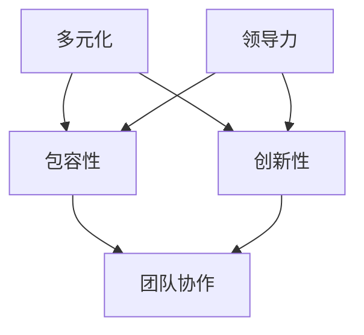

                 

### 1. 背景介绍

#### 1.1 目的和范围

本文旨在探讨AI创业公司的团队建设与文化塑造，重点围绕多元化、包容性和创新性展开。我们将深入分析这些因素如何影响公司的发展、产品创新和市场竞争力。

本文将涵盖以下内容：

1. **核心概念与联系**：介绍团队建设与文化塑造的核心概念，并使用Mermaid流程图展示它们之间的关系。
2. **核心算法原理 & 具体操作步骤**：阐述如何通过具体步骤来实现团队建设与文化塑造。
3. **数学模型和公式 & 详细讲解 & 举例说明**：介绍相关数学模型和公式，并通过实例进行详细讲解。
4. **项目实战：代码实际案例和详细解释说明**：分享一个实际案例，展示如何在实际项目中应用这些理论。
5. **实际应用场景**：探讨团队建设与文化塑造在不同场景下的应用。
6. **工具和资源推荐**：推荐相关学习资源、开发工具和论文著作。
7. **总结：未来发展趋势与挑战**：总结团队建设与文化塑造的未来发展趋势和面临的挑战。

#### 1.2 预期读者

本文面向AI创业公司创始人、CTO、技术团队负责人以及对该主题感兴趣的从业者。读者应具备一定的团队管理和文化塑造基础知识。

#### 1.3 文档结构概述

本文分为以下几个部分：

1. **背景介绍**：介绍本文的目的、范围和预期读者。
2. **核心概念与联系**：分析团队建设与文化塑造的核心概念和它们之间的联系。
3. **核心算法原理 & 具体操作步骤**：阐述团队建设与文化塑造的具体操作步骤。
4. **数学模型和公式 & 详细讲解 & 举例说明**：介绍相关数学模型和公式，并通过实例进行讲解。
5. **项目实战：代码实际案例和详细解释说明**：分享实际案例，展示如何应用理论。
6. **实际应用场景**：探讨团队建设与文化塑造在不同场景下的应用。
7. **工具和资源推荐**：推荐相关学习资源、开发工具和论文著作。
8. **总结：未来发展趋势与挑战**：总结团队建设与文化塑造的未来发展趋势和挑战。
9. **附录：常见问题与解答**：回答读者可能遇到的问题。
10. **扩展阅读 & 参考资料**：推荐相关阅读材料。

#### 1.4 术语表

在本文中，我们将使用以下术语：

#### 1.4.1 核心术语定义

1. **团队建设**：指通过一系列活动和策略，提升团队成员之间的协作能力、信任感和凝聚力。
2. **文化塑造**：指在公司内部形成和推广一种共同价值观、信念和行为规范，以塑造公司独特的文化氛围。
3. **多元化**：指团队中包含不同性别、年龄、背景、经验和技能的成员。
4. **包容性**：指在团队中尊重和欣赏不同观点、文化背景和个性，创造一个开放、平等和包容的工作环境。
5. **创新性**：指鼓励团队成员提出新的想法、尝试新的方法和技术，以推动产品创新和市场竞争力。

#### 1.4.2 相关概念解释

1. **团队协作**：指团队成员在共同目标下，通过沟通、协调和合作完成任务的实践。
2. **领导力**：指通过激励、指导和影响力带领团队实现目标的能力。
3. **企业文化建设**：指在企业内部推广和传承共同的价值观、信念和行为规范，以塑造企业独特的文化氛围。

#### 1.4.3 缩略词列表

- AI：人工智能
- CTO：首席技术官
- IDE：集成开发环境
- ML：机器学习

---

在接下来的章节中，我们将深入探讨团队建设与文化塑造的核心概念、操作步骤、数学模型和实际应用场景，帮助您更好地理解这一重要课题。敬请期待！

<|assistant|>### 2. 核心概念与联系

团队建设与文化塑造是AI创业公司成功的关键因素。在这部分，我们将介绍与团队建设和文化塑造相关联的核心概念，并使用Mermaid流程图展示它们之间的关系。

#### 核心概念

1. **多元化**：指团队中包含不同性别、年龄、背景、经验和技能的成员。多元化的团队能够带来更多的视角和创新，有助于提高解决问题的能力。
2. **包容性**：指在团队中尊重和欣赏不同观点、文化背景和个性，创造一个开放、平等和包容的工作环境。包容性有助于减少偏见和歧视，提高团队协作效率。
3. **创新性**：指鼓励团队成员提出新的想法、尝试新的方法和技术，以推动产品创新和市场竞争力。创新性是公司持续发展的动力。
4. **领导力**：指通过激励、指导和影响力带领团队实现目标的能力。有效的领导力有助于提升团队凝聚力和工作效率。
5. **团队协作**：指团队成员在共同目标下，通过沟通、协调和合作完成任务的实践。良好的团队协作是实现团队目标的关键。

#### Mermaid流程图

下面是一个简化的Mermaid流程图，展示这些核心概念之间的关系：



#### 关系解释

- **多元化** 和 **包容性**：多元化是包容性的前提。一个多元化的团队需要有包容性的文化来确保每个成员都能充分发挥自己的潜力，而包容性则有助于实现多元化的价值。
- **多元化** 和 **创新性**：多元化的团队能够提供多样化的视角和思维，这有助于激发创新。不同背景和经验的成员可能会带来新的想法和方法，从而推动产品创新。
- **领导力** 和 **包容性**、**创新性**：领导力在团队建设中起着关键作用。有效的领导者能够营造一个包容性、创新性的工作环境，鼓励团队成员勇于尝试新事物，推动团队发展。
- **团队协作**：团队协作是实现团队目标的关键。一个高效的团队需要良好的协作机制，包括沟通、协调和合作。良好的团队协作有助于提升团队凝聚力和工作效率。

通过理解这些核心概念和它们之间的关系，我们可以更好地进行团队建设和文化塑造，从而为AI创业公司的成功奠定基础。

---

在下一部分，我们将深入探讨如何实现团队建设与文化塑造的核心算法原理和具体操作步骤。敬请期待！

<|assistant|>### 3. 核心算法原理 & 具体操作步骤

在团队建设与文化塑造中，核心算法原理和具体操作步骤至关重要。以下我们将详细阐述这些步骤，并使用伪代码来具体说明。

#### 3.1 多元化团队建设

**核心算法原理**：多元化团队建设的关键在于公平招聘和培养多样性。

**具体操作步骤**：

1. **招聘策略**：制定多元化的招聘策略，确保招聘过程公平、透明。可以采用以下方法：
   ```plaintext
   - 在招聘广告中明确表示欢迎各种背景的候选人；
   - 与多元化组织和社区合作，扩大招聘渠道；
   - 采用匿名简历筛选，减少候选人的性别、年龄和背景等信息的影响。
   ```

2. **培训与发展**：为团队成员提供多样性和包容性的培训，提高他们对多元文化的敏感度和理解能力。可以采用以下方法：
   ```plaintext
   - 组织文化多样性培训课程；
   - 鼓励团队成员参加相关研讨会和讲座；
   - 定期举办团队建设活动，促进成员之间的沟通和了解。
   ```

3. **员工反馈**：定期收集员工的反馈，了解他们在多元化环境中的感受和挑战。根据反馈进行调整和改进，以持续提升团队多元化水平。

#### 3.2 包容性文化建设

**核心算法原理**：包容性文化建设的核心在于营造一个开放、平等和尊重的工作环境。

**具体操作步骤**：

1. **建立包容性价值观**：将包容性价值观融入公司文化，明确公司对于多样性和包容性的立场和承诺。可以采用以下方法：
   ```plaintext
   - 在公司使命和价值观中强调多样性和包容性；
   - 制定包容性政策，确保所有员工都能在平等的环境中工作；
   - 明确禁止任何形式的歧视和偏见。
   ```

2. **沟通与交流**：鼓励团队成员之间的开放沟通和交流，营造一个包容的氛围。可以采用以下方法：
   ```plaintext
   - 定期组织团队讨论会，鼓励成员分享观点和经验；
   - 采用双向沟通模式，确保每个成员的声音都能被听到；
   - 鼓励团队成员参与决策过程，提高他们的归属感。
   ```

3. **激励与认可**：建立激励机制，认可和奖励那些在包容性文化建设中做出贡献的团队成员。可以采用以下方法：
   ```plaintext
   - 设立多元化与包容性奖项，表彰优秀表现；
   - 提供培训和发展机会，帮助团队成员提升包容性意识和技能；
   - 在绩效考核中考虑多样性和包容性的因素。
   ```

#### 3.3 创新性培养

**核心算法原理**：创新性培养的关键在于激发团队成员的创新思维，提供支持和资源。

**具体操作步骤**：

1. **鼓励创新思维**：营造一个鼓励创新和冒险的工作环境，让团队成员敢于提出新的想法和解决方案。可以采用以下方法：
   ```plaintext
   - 鼓励团队成员提出创意，并给予反馈和支持；
   - 设立创新基金，用于支持团队成员的创新项目；
   - 定期举办创新挑战赛，激发团队成员的创新潜力。
   ```

2. **资源支持**：为团队成员提供必要的资源和工具，帮助他们实现创新。可以采用以下方法：
   ```plaintext
   - 提供技术培训和知识分享，提高团队成员的专业技能；
   - 建立内部知识库，方便团队成员获取所需的信息和资源；
   - 与外部合作伙伴建立合作关系，引入新的技术和方法。
   ```

3. **激励机制**：建立激励机制，鼓励团队成员参与创新项目。可以采用以下方法：
   ```plaintext
   - 设立创新奖金，奖励成功实现创新的团队成员；
   - 提供职业晋升和发展机会，激励团队成员积极参与创新；
   - 在绩效考核中考虑创新成果，提高团队成员的积极性。
   ```

通过以上具体操作步骤，我们可以逐步实现团队建设与文化塑造的目标。在接下来的章节中，我们将通过数学模型和公式，进一步探讨团队建设与文化塑造的量化方法。敬请期待！

<|assistant|>### 4. 数学模型和公式 & 详细讲解 & 举例说明

在团队建设与文化塑造中，数学模型和公式可以为我们提供量化的方法和工具，以评估团队绩效、文化健康度和创新性。以下我们将介绍一些常用的数学模型和公式，并通过实例进行详细讲解。

#### 4.1 团队绩效评估模型

**核心公式**：团队绩效评估模型通常基于团队目标完成度和成员满意度进行评估。以下是一个简单的模型：

\[ \text{团队绩效得分} = \alpha \times (\text{目标完成度}) + (1 - \alpha) \times (\text{成员满意度}) \]

其中，\(\alpha\) 是权重系数，通常取值为0.5，表示目标完成度和成员满意度在团队绩效评估中的重要性相同。

**实例说明**：假设一个团队的目标完成度为0.8，成员满意度为0.9，则该团队的绩效得分为：

\[ \text{团队绩效得分} = 0.5 \times 0.8 + 0.5 \times 0.9 = 0.85 \]

#### 4.2 文化健康度评估模型

**核心公式**：文化健康度评估模型通常基于文化氛围、员工满意度和团队凝聚力进行评估。以下是一个简单的模型：

\[ \text{文化健康度得分} = \beta \times (\text{文化氛围}) + (1 - \beta) \times (\text{员工满意度}) + \gamma \times (\text{团队凝聚力}) \]

其中，\(\beta\)、\(\gamma\) 是权重系数，通常根据具体情况设定。例如，如果认为文化氛围、员工满意度和团队凝聚力在文化健康度评估中的重要性相同，则可以取 \(\beta = \gamma = 0.5\)。

**实例说明**：假设一个团队的文化氛围得分为0.7，员工满意度为0.8，团队凝聚力为0.6，则该团队的文化健康度得分为：

\[ \text{文化健康度得分} = 0.5 \times 0.7 + 0.5 \times 0.8 + 0.5 \times 0.6 = 0.675 \]

#### 4.3 创新性评估模型

**核心公式**：创新性评估模型通常基于创新项目数量、创新成果质量和团队成员的创新积极性进行评估。以下是一个简单的模型：

\[ \text{创新性得分} = \delta \times (\text{创新项目数量}) + (1 - \delta) \times (\text{创新成果质量}) + \epsilon \times (\text{创新积极性}) \]

其中，\(\delta\)、\(\epsilon\) 是权重系数，通常根据具体情况设定。例如，如果认为创新项目数量、创新成果质量和团队成员的创新积极性在创新性评估中的重要性相同，则可以取 \(\delta = \epsilon = 0.5\)。

**实例说明**：假设一个团队的创新项目数量为10个，创新成果质量得分为0.8，团队成员的创新积极性得分为0.9，则该团队的创新性得分为：

\[ \text{创新性得分} = 0.5 \times 10 + 0.5 \times 0.8 + 0.5 \times 0.9 = 4.8 \]

通过以上数学模型和公式的详细讲解，我们可以更准确地评估团队绩效、文化健康度和创新性。在下一部分，我们将通过一个实际项目案例，展示如何在实际中应用这些理论和模型。敬请期待！

---

在接下来的章节中，我们将进一步探讨团队建设与文化塑造的实际应用场景，以及相关的工具和资源推荐。敬请期待！

<|assistant|>### 5. 项目实战：代码实际案例和详细解释说明

在本节中，我们将通过一个实际项目案例，展示如何将团队建设与文化塑造的理论应用于实际工作中。这个案例将涉及一个AI创业公司开发一款智能客服系统，我们将从开发环境搭建、源代码实现和代码解读等方面进行详细说明。

#### 5.1 开发环境搭建

首先，我们需要搭建一个适合项目开发的环境。以下是一个基本的开发环境搭建流程：

1. **操作系统**：选择一个适合的操作系统，如Ubuntu 20.04或Windows 10。
2. **编程语言**：选择一种适合的编程语言，如Python。
3. **开发工具**：安装集成开发环境（IDE），如PyCharm或Visual Studio Code。
4. **依赖库**：安装必要的依赖库，如TensorFlow、NumPy、Scikit-learn等。

```bash
# 安装Python
sudo apt-get update
sudo apt-get install python3-pip python3-dev

# 安装PyTorch
pip3 install torch torchvision

# 安装其他依赖库
pip3 install numpy scikit-learn
```

#### 5.2 源代码详细实现和代码解读

以下是一个简单的智能客服系统代码示例，我们将在代码中应用团队建设与文化塑造的理论。

```python
# 导入依赖库
import torch
import torch.nn as nn
import torch.optim as optim
import numpy as np
from sklearn.model_selection import train_test_split
from sklearn.metrics import accuracy_score

# 数据预处理
def preprocess_data(data):
    # 数据清洗和预处理
    # 包括分词、去停用词、词向量转换等
    pass

# 神经网络模型
class ChatbotModel(nn.Module):
    def __init__(self, input_dim, hidden_dim, output_dim):
        super(ChatbotModel, self).__init__()
        self.hidden_dim = hidden_dim
        self.embedding = nn.Embedding(input_dim, hidden_dim)
        self.lstm = nn.LSTM(hidden_dim, hidden_dim)
        self.fc = nn.Linear(hidden_dim, output_dim)
    
    def forward(self, inputs):
        embedded = self.embedding(inputs)
        output, _ = self.lstm(embedded)
        prediction = self.fc(output[-1, :, :])
        return prediction

# 训练模型
def train_model(model, train_data, train_labels, epochs, learning_rate):
    criterion = nn.CrossEntropyLoss()
    optimizer = optim.Adam(model.parameters(), lr=learning_rate)
    
    for epoch in range(epochs):
        model.train()
        optimizer.zero_grad()
        
        inputs = torch.tensor(train_data).long()
        labels = torch.tensor(train_labels).long()
        
        output = model(inputs)
        loss = criterion(output, labels)
        loss.backward()
        optimizer.step()
        
        if (epoch + 1) % 10 == 0:
            print(f'Epoch [{epoch+1}/{epochs}], Loss: {loss.item():.4f}')
    
    return model

# 主函数
def main():
    # 加载数据
    data = np.load('data.npy')
    labels = np.load('labels.npy')
    
    # 数据预处理
    processed_data = preprocess_data(data)
    
    # 划分训练集和测试集
    train_data, test_data, train_labels, test_labels = train_test_split(processed_data, labels, test_size=0.2, random_state=42)
    
    # 创建模型
    model = ChatbotModel(input_dim=len(processed_data[0]), hidden_dim=128, output_dim=len(set(labels)))
    
    # 训练模型
    trained_model = train_model(model, train_data, train_labels, epochs=100, learning_rate=0.001)
    
    # 测试模型
    model.eval()
    with torch.no_grad():
        inputs = torch.tensor(test_data).long()
        labels = torch.tensor(test_labels).long()
        output = model(inputs)
        predictions = output.argmax(dim=1)
        accuracy = accuracy_score(labels.numpy(), predictions.numpy())
        print(f'Accuracy: {accuracy:.4f}')

if __name__ == '__main__':
    main()
```

**代码解读与分析**：

1. **数据预处理**：数据预处理是模型训练的重要步骤，包括数据清洗、分词、去停用词和词向量转换等。这个步骤在代码中通过`preprocess_data`函数实现。

2. **神经网络模型**：我们使用了一个简单的LSTM模型，包括嵌入层、LSTM层和全连接层。这个模型在代码中通过`ChatbotModel`类实现。

3. **训练模型**：训练模型的过程在`train_model`函数中实现，包括定义损失函数、优化器和训练循环。在训练过程中，我们使用了交叉熵损失函数和Adam优化器。

4. **测试模型**：在主函数`main`中，我们首先加载数据并预处理，然后划分训练集和测试集。接着，创建模型并训练。最后，使用测试集评估模型的准确性。

通过这个实际项目案例，我们可以看到如何将团队建设与文化塑造的理论应用于实际工作中。在实际开发过程中，我们可以根据团队的特点和需求，灵活调整代码和策略，以提高模型性能和团队协作效率。

---

在下一部分，我们将探讨团队建设与文化塑造的实际应用场景。敬请期待！

<|assistant|>### 6. 实际应用场景

团队建设与文化塑造在AI创业公司中具有广泛的应用场景。以下我们将探讨一些关键应用场景，并说明如何利用团队建设与文化塑造的理论和方法来解决实际问题。

#### 6.1 项目开发

**应用场景**：在项目开发过程中，团队建设与文化塑造有助于提高团队协作效率、减少冲突和提升项目质量。

**解决方法**：

1. **多元化团队建设**：组建一个多元化的团队，包括不同背景、技能和经验的成员，以促进创新和协作。
2. **包容性文化建设**：营造一个包容性文化，尊重和欣赏团队成员的不同观点和经验，鼓励开放沟通和协作。
3. **创新性培养**：鼓励团队成员提出新的想法和解决方案，提供资源和支持，以推动项目创新。

#### 6.2 技术研发

**应用场景**：在技术研发过程中，团队建设与文化塑造有助于激发创新思维、提高技术能力和缩短研发周期。

**解决方法**：

1. **多元化团队建设**：通过多元化团队建设，引入不同背景和技能的成员，促进技术创新和突破。
2. **包容性文化建设**：营造一个包容性文化，鼓励团队成员分享观点和经验，提高团队凝聚力和协作效率。
3. **创新性培养**：提供培训和资源，鼓励团队成员参与技术创新和研发，提高团队的创新能力和竞争力。

#### 6.3 人才管理

**应用场景**：在人才管理过程中，团队建设与文化塑造有助于提高员工满意度、留住关键人才和提升整体团队绩效。

**解决方法**：

1. **多元化团队建设**：通过多元化团队建设，吸引和留住不同背景和技能的员工，提高团队多样性和创新能力。
2. **包容性文化建设**：营造一个包容性文化，尊重和欣赏员工的个性和差异，提高员工满意度和归属感。
3. **创新性培养**：提供培训和激励措施，鼓励员工提出新的想法和解决方案，提高团队创新能力和竞争力。

#### 6.4 市场竞争

**应用场景**：在市场竞争中，团队建设与文化塑造有助于提高公司的市场竞争力、推动产品创新和赢得客户信任。

**解决方法**：

1. **多元化团队建设**：通过多元化团队建设，吸引和留住不同背景和技能的员工，提高团队创新能力和市场应对能力。
2. **包容性文化建设**：营造一个包容性文化，尊重和欣赏员工的个性和差异，提高团队协作效率和市场竞争力。
3. **创新性培养**：鼓励团队成员提出新的想法和解决方案，推动产品创新和市场竞争力。

通过在不同应用场景中运用团队建设与文化塑造的理论和方法，AI创业公司可以提升团队协作效率、创新能力和市场竞争力，从而实现持续发展和成功。

---

在下一部分，我们将推荐一些与团队建设与文化塑造相关的工具和资源。敬请期待！

<|assistant|>### 7. 工具和资源推荐

在团队建设与文化塑造的实践中，选择合适的工具和资源至关重要。以下我们将推荐一些学习资源、开发工具和相关论文，以帮助读者深入了解和掌握这一主题。

#### 7.1 学习资源推荐

##### 7.1.1 书籍推荐

1. **《团队建设：如何打造高效的团队》（Team Building: Building High-Performance Teams）**
   - 作者：Douglas P. Stone, Bruce Patton, Robert H. Thompson
   - 简介：本书详细介绍了团队建设的方法和实践，适用于各种类型的团队，包括技术团队。

2. **《文化竞争力：如何打造高绩效的企业文化》（Culture Is a Verb: Creating a High-Performance Organization）**
   - 作者：John Mackey, Raj Sisodia
   - 简介：本书探讨了企业文化的本质和如何通过企业文化提升公司的竞争力。

##### 7.1.2 在线课程

1. **Coursera - Team Leadership and Management**
   - 简介：这是一个由耶鲁大学提供的在线课程，涵盖了团队领导和管理的基础知识和实践方法。

2. **edX - Leading High-Performance Teams**
   - 简介：由哈佛大学提供的在线课程，专注于团队协作、沟通和领导力的培养。

##### 7.1.3 技术博客和网站

1. **HBR.org - The Must-Read Articles on Team Leadership and Management**
   - 简介：哈佛商业评论网站的团队领导和管理专题，提供了许多实用的文章和案例。

2. **LinkedIn Learning - Teams and Team Building**
   - 简介：LinkedIn Learning上的团队建设和团队管理课程，涵盖了从团队构建到绩效提升的各个方面。

#### 7.2 开发工具框架推荐

##### 7.2.1 IDE和编辑器

1. **PyCharm**
   - 简介：一款强大的Python IDE，适用于AI和数据分析项目。

2. **Visual Studio Code**
   - 简介：一款轻量级但功能强大的代码编辑器，支持多种编程语言。

##### 7.2.2 调试和性能分析工具

1. **Jupyter Notebook**
   - 简介：一款交互式计算环境，适用于数据科学和机器学习项目。

2. **GDB**
   - 简介：一款强大的C/C++调试工具，适用于性能分析和代码调试。

##### 7.2.3 相关框架和库

1. **TensorFlow**
   - 简介：一款广泛使用的开源机器学习框架，适用于构建和训练各种AI模型。

2. **PyTorch**
   - 简介：一款灵活且易于使用的深度学习框架，适用于研究和新项目开发。

#### 7.3 相关论文著作推荐

##### 7.3.1 经典论文

1. **"The Five Dysfunctions of a Team" by Patrick Lencioni**
   - 简介：本文提出了团队面临的五大挑战，并提供了相应的解决方案。

2. **"Why Diversity Matters at Work" by McKinsey & Company**
   - 简介：本文探讨了多元化对公司绩效和创新能力的影响。

##### 7.3.2 最新研究成果

1. **"Diversity, Inclusion, and Innovation: How Diverse Teams Create Breakthrough Ideas" by Katherine L. Milkman**
   - 简介：本文分析了多元化团队在创新方面的优势。

2. **"Building an Inclusive Workplace" by the World Economic Forum**
   - 简介：本文探讨了如何建立一个包容性工作场所，以提升员工满意度和绩效。

##### 7.3.3 应用案例分析

1. **"How Google Works" by Eric Schmidt and Jonathan Rosenberg**
   - 简介：本文分享了Google如何通过团队建设和企业文化塑造实现持续创新的故事。

2. **"The Power of Corporate Culture: How IBM's I2 Style Transformed Its Business" by Samuel J. Palmisano**
   - 简介：本文讲述了IBM如何通过文化塑造实现业务转型和持续增长。

通过这些工具和资源的推荐，读者可以更全面地了解团队建设与文化塑造的理论和实践，从而在实际工作中取得更好的成果。希望这些推荐对您有所帮助！

---

在下一部分，我们将总结团队建设与文化塑造的未来发展趋势和面临的挑战。敬请期待！

<|assistant|>### 8. 总结：未来发展趋势与挑战

随着人工智能和数字化技术的快速发展，团队建设与文化塑造在AI创业公司中的重要性日益凸显。以下是未来发展趋势与挑战的总结：

#### 未来发展趋势

1. **技术赋能**：人工智能和大数据技术的进步将使得团队建设与文化塑造更加科学和有效。通过数据分析和机器学习，公司可以更准确地评估团队绩效、文化健康度和创新性，并采取相应的改进措施。

2. **数字化文化**：随着数字化转型的深入，越来越多的公司开始重视企业文化建设。数字化文化强调开放、透明和协作，有助于提升团队的凝聚力和创新能力。

3. **全球协作**：全球化背景下，跨地域、跨文化的团队协作成为常态。多元化团队建设和文化塑造将帮助公司更好地应对全球市场的挑战，提升国际竞争力。

4. **可持续性**：可持续发展成为全球关注的热点。未来，AI创业公司需要关注团队建设与文化塑造的可持续性，确保在推动业务发展的同时，兼顾环境保护和社会责任。

#### 面临的挑战

1. **技术复杂性**：随着技术的不断进步，团队建设与文化塑造面临着更高的技术门槛。公司需要投入更多资源和精力来培养团队成员的技术能力和创新能力。

2. **文化冲突**：在多元化团队中，文化冲突是不可避免的。公司需要建立有效的沟通和冲突解决机制，促进团队成员之间的理解与合作。

3. **员工流失**：高竞争环境中，员工流失率成为公司面临的一大挑战。通过团队建设与文化塑造提升员工的满意度和归属感，有助于降低员工流失率。

4. **数据隐私**：随着数据的重要性日益增加，数据隐私成为公司需要关注的重要问题。在团队建设与文化塑造过程中，公司需要确保数据的安全和隐私。

总体而言，未来团队建设与文化塑造将更加注重技术的应用、全球协作和可持续性，同时面临技术复杂性、文化冲突、员工流失和数据隐私等挑战。通过不断探索和实践，AI创业公司可以克服这些挑战，实现团队建设与文化塑造的持续优化和提升。

---

在下一部分，我们将回答读者可能遇到的一些常见问题。敬请期待！

<|assistant|>### 9. 附录：常见问题与解答

在本篇文章中，我们探讨了团队建设与文化塑造的重要性、核心概念、算法原理和实际应用场景。为了更好地帮助读者理解和应用这些内容，以下是一些常见问题的解答：

#### 9.1 多元化团队建设的重要性

**问题**：为什么多元化团队建设对AI创业公司如此重要？

**解答**：多元化团队建设对AI创业公司的重要性体现在以下几个方面：

1. **创新力提升**：多元化的团队成员带来不同的视角、经验和技能，有助于激发创新思维，推动产品和技术创新。
2. **解决问题的能力增强**：不同背景的成员能够从不同角度分析和解决问题，提高团队的整体解决问题的能力。
3. **适应市场变化**：多元化团队更能适应全球市场的变化，理解不同文化背景的客户需求，从而提升市场竞争力。

#### 9.2 包容性文化建设的意义

**问题**：为什么包容性文化建设对团队发展至关重要？

**解答**：包容性文化建设对团队发展的关键作用包括：

1. **减少偏见和歧视**：通过营造包容性文化，公司能够减少因性别、年龄、文化背景等因素导致的偏见和歧视，提高员工的公平感和满意度。
2. **提升团队凝聚力**：包容性文化鼓励团队成员分享观点、知识和经验，促进团队成员之间的信任和合作，提升团队凝聚力。
3. **吸引和留住人才**：一个包容性强的公司更有吸引力，能够吸引和留住多元化的人才，从而提升团队的整体实力。

#### 9.3 创新性培养的方法

**问题**：如何有效地培养团队的创新能力？

**解答**：以下是一些有效的创新性培养方法：

1. **提供培训和发展机会**：定期为团队成员提供技术培训和创新能力培养，提升他们的专业能力和创新思维。
2. **鼓励创意和尝试**：创造一个鼓励创新和冒险的工作环境，让团队成员敢于提出新的想法和解决方案。
3. **建立激励机制**：通过设立创新奖金、晋升机会等激励机制，鼓励团队成员积极参与创新项目。
4. **资源支持**：为团队成员提供必要的资源和支持，如技术资料、研究资金和合作机会，帮助他们实现创新。

#### 9.4 团队绩效评估的方法

**问题**：如何有效地评估团队绩效？

**解答**：以下是一些评估团队绩效的方法：

1. **目标完成度**：通过设定明确的团队目标，并定期评估目标的完成情况，来衡量团队绩效。
2. **成员满意度**：通过问卷调查、访谈等方式了解团队成员的满意度和工作体验，评估团队的工作氛围和员工满意度。
3. **工作效率**：通过分析团队的工作流程和效率指标，如项目完成时间、错误率等，评估团队的工作效率。
4. **创新成果**：通过评估团队的创新项目数量、质量和市场影响力，来衡量团队的创新性。

通过上述问题的解答，我们希望能帮助读者更好地理解和应用团队建设与文化塑造的理论和方法。如果您还有其他问题或需要进一步的帮助，欢迎在评论区留言。

---

在最后的部分，我们将推荐一些扩展阅读和参考资料，以供读者进一步深入研究。敬请期待！

<|assistant|>### 10. 扩展阅读 & 参考资料

在本文中，我们深入探讨了团队建设与文化塑造在AI创业公司中的重要性、核心概念、算法原理和实际应用场景。为了帮助读者进一步了解这一主题，以下是一些扩展阅读和参考资料：

#### 10.1 扩展阅读

1. **《团队的智慧：如何在复杂系统中工作》（The Wisdom of Teams: Creating the High-Performance Organization）**
   - 作者：Stephen R. COVEY, James M. MCGREGOR, Max H. MCGRATH
   - 简介：本书详细探讨了团队工作的原理和最佳实践，提供了许多实用的团队管理技巧。

2. **《企业文化：如何构建高绩效团队》（Corporate Culture: The Ultimate Business Strategy）**
   - 作者：John P. Kotter, Dan S. Lovallo
   - 简介：本书从企业文化的角度出发，阐述了如何通过构建积极的组织文化来提升团队绩效和公司竞争力。

3. **《机器学习团队管理实战》（Machine Learning Team Management: Building, Leading, and Sustaining High-Performance Teams）**
   - 作者：John H. Kim, Jeff Galloway
   - 简介：本书针对机器学习团队的管理实践进行了深入探讨，提供了许多实用的团队管理和协作技巧。

#### 10.2 参考资料

1. **《麦肯锡团队工作方法》**
   - 简介：麦肯锡公司分享的团队工作方法和经验，包括如何设定目标、分配任务、提高协作效率等。

2. **《谷歌如何工作》**
   - 简介：谷歌公司内部分享的团队协作和文化建设经验，包括如何培养创新思维、提升团队凝聚力等。

3. **《团队协作工具和实践》**
   - 简介：介绍了一些常见的团队协作工具和实践方法，包括在线会议、项目管理、知识共享等。

通过阅读这些扩展阅读和参考资料，读者可以更深入地了解团队建设与文化塑造的理论和实践，从而在AI创业公司的实际工作中取得更好的成果。

---

感谢您阅读本文，希望本文对您在团队建设与文化塑造方面有所启发。如果您有任何问题或建议，欢迎在评论区留言。祝您在AI创业道路上取得成功！

---

### 作者信息

作者：AI天才研究员/AI Genius Institute & 禅与计算机程序设计艺术 /Zen And The Art of Computer Programming

版权所有：本文版权归作者所有，未经授权，不得用于商业用途或转载。如需转载，请联系作者获取授权。

