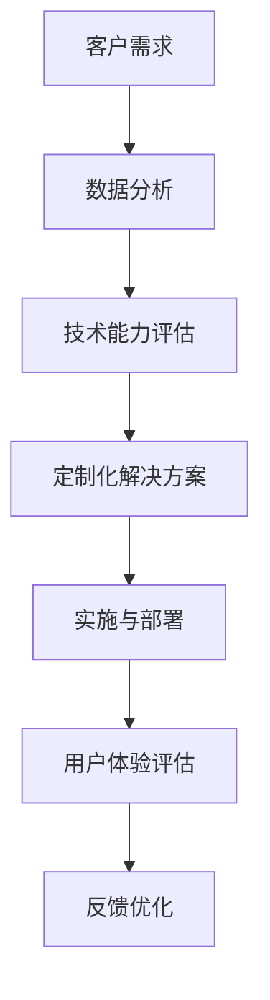

                 

# AI创业公司的定制化服务模式

> 关键词：AI创业公司、定制化服务、客户需求、技术能力、商业模式、用户体验、成本效益

> 摘要：本文深入探讨了AI创业公司如何通过定制化服务模式来满足不同客户的需求，提升用户体验，同时保持成本效益。文章首先介绍了AI创业公司的背景和定制化服务的必要性，然后详细阐述了定制化服务模式的核心概念和实施步骤，最后分析了未来发展趋势和挑战。

## 1. 背景介绍

### 1.1 目的和范围

本文旨在为AI创业公司提供一套有效的定制化服务模式，以帮助它们在竞争激烈的市场中脱颖而出。本文将涵盖以下内容：

1. AI创业公司的现状和挑战
2. 定制化服务的定义和重要性
3. 核心概念和实施步骤
4. 成本效益分析
5. 未来发展趋势和挑战

### 1.2 预期读者

本文适合以下读者：

1. AI创业公司的创始人、CTO和产品经理
2. 对AI技术有兴趣的技术人员
3. 对商业模式和用户体验有研究的专业人士

### 1.3 文档结构概述

本文分为以下几个部分：

1. 背景介绍：介绍AI创业公司的现状和定制化服务的必要性
2. 核心概念与联系：介绍定制化服务模式的核心概念和联系
3. 核心算法原理 & 具体操作步骤：详细阐述定制化服务模式的算法原理和操作步骤
4. 数学模型和公式 & 详细讲解 & 举例说明：介绍定制化服务模式中的数学模型和公式，并通过案例进行说明
5. 项目实战：提供实际代码案例和解释
6. 实际应用场景：讨论定制化服务在不同领域的应用
7. 工具和资源推荐：推荐学习资源、开发工具和论文著作
8. 总结：总结未来发展趋势和挑战
9. 附录：常见问题与解答
10. 扩展阅读 & 参考资料：提供进一步阅读的资料

### 1.4 术语表

#### 1.4.1 核心术语定义

- AI创业公司：指以人工智能技术为核心的初创企业
- 定制化服务：根据客户需求，为客户提供个性化的解决方案和服务
- 客户需求：客户在购买产品或服务时所期望得到的满足
- 技术能力：企业拥有的技术资源和技能
- 商业模式：企业通过何种方式获取收入和利润
- 用户体验：用户在使用产品或服务时的感受和体验
- 成本效益：企业投入与收益之间的比较

#### 1.4.2 相关概念解释

- 定制化服务模式：企业通过分析客户需求，结合自身技术能力，为客户提供定制化服务的商业模式
- 数据分析：通过对大量数据进行分析，提取有价值的信息和洞察
- 人工智能算法：模拟人类智能的算法和技术，用于解决复杂问题
- 云计算：通过网络提供计算资源、存储资源和应用程序的服务

#### 1.4.3 缩略词列表

- AI：人工智能
- CTO：首席技术官
- IDE：集成开发环境
- UX：用户体验
- ML：机器学习

## 2. 核心概念与联系

为了更好地理解定制化服务模式，我们需要首先了解其核心概念和联系。以下是一个简单的Mermaid流程图，展示了定制化服务模式的核心节点和连接关系。



### 2.1. 客户需求

客户需求是定制化服务模式的基础。企业需要通过市场调研、用户反馈等方式，收集和分析客户的真实需求，以便为客户提供更加个性化和有针对性的服务。

### 2.2. 数据分析

数据分析是定制化服务模式的关键步骤。通过对收集到的客户数据进行深入分析，企业可以了解客户的需求、行为和偏好，从而为定制化解决方案提供依据。

### 2.3. 技术能力评估

技术能力评估是确保定制化解决方案可行性的关键。企业需要评估自身的技术资源和技术能力，以确保能够按照客户需求提供定制化服务。

### 2.4. 定制化解决方案

定制化解决方案是根据客户需求和自身技术能力，为客户量身打造的服务方案。这个方案需要充分考虑客户需求、技术可行性、成本效益等因素。

### 2.5. 实施与部署

实施与部署是将定制化解决方案转化为实际服务的过程。在这个过程中，企业需要确保解决方案的高效实施和顺利部署。

### 2.6. 用户体验评估

用户体验评估是衡量定制化服务效果的重要指标。通过对用户体验的评估，企业可以了解客户的满意度和反馈，从而为后续优化提供依据。

### 2.7. 反馈优化

反馈优化是基于用户体验评估结果，对定制化服务进行持续改进和优化的过程。通过不断优化，企业可以提高客户满意度，提升市场竞争优势。

## 3. 核心算法原理 & 具体操作步骤

### 3.1. 客户需求分析

客户需求分析是定制化服务模式的第一步。以下是一个简单的伪代码，描述了如何分析客户需求：

```python
# 输入：客户需求（字符串）
# 输出：需求关键词（列表）

def analyze_customer_demand(customer_demand):
    # 将客户需求转换为小写
    customer_demand = customer_demand.lower()
    # 分词，提取关键词
    keywords = customer_demand.split(" ")
    # 过滤掉无关关键词
    relevant_keywords = [keyword for keyword in keywords if keyword not in stop_words]
    # 返回需求关键词
    return relevant_keywords
```

### 3.2. 技术能力评估

技术能力评估是确保定制化解决方案可行性的关键。以下是一个简单的伪代码，描述了如何评估企业自身的技术能力：

```python
# 输入：企业技术能力（字典）
# 输出：技术能力评分（整数）

def evaluate_technical_ability(technical_ability):
    # 初始化技术能力评分
    score = 0
    # 计算技术能力评分
    score += technical_ability["ai_exp"] * 0.3
    score += technical_ability["cloud_computing_exp"] * 0.2
    score += technical_ability["data_analytics_exp"] * 0.5
    # 返回技术能力评分
    return score
```

### 3.3. 定制化解决方案

定制化解决方案是根据客户需求和自身技术能力，为客户量身打造的服务方案。以下是一个简单的伪代码，描述了如何制定定制化解决方案：

```python
# 输入：客户需求（列表）、技术能力评分（整数）
# 输出：定制化解决方案（字符串）

def create_custom_solution(customer_demand, technical_ability):
    # 初始化解决方案
    solution = ""
    # 根据客户需求和技术能力，添加相关模块
    for keyword in customer_demand:
        if keyword == "ai":
            solution += "人工智能模块，"
        elif keyword == "cloud_computing":
            solution += "云计算模块，"
        elif keyword == "data_analytics":
            solution += "数据分析模块，"
    # 根据技术能力评分，添加定制化内容
    if technical_ability >= 90:
        solution += "高级定制化服务"
    elif technical_ability >= 70:
        solution += "中级定制化服务"
    else:
        solution += "初级定制化服务"
    # 返回定制化解决方案
    return solution
```

### 3.4. 实施与部署

实施与部署是将定制化解决方案转化为实际服务的过程。以下是一个简单的伪代码，描述了如何实施和部署定制化解决方案：

```python
# 输入：定制化解决方案（字符串）
# 输出：部署结果（字符串）

def deploy_solution(solution):
    # 初始化部署结果
    result = ""
    # 根据定制化解决方案，执行相关操作
    if "人工智能模块" in solution:
        result += "部署人工智能模块，"
    if "云计算模块" in solution:
        result += "部署云计算模块，"
    if "数据分析模块" in solution:
        result += "部署数据分析模块，"
    # 返回部署结果
    return result
```

### 3.5. 用户体验评估

用户体验评估是衡量定制化服务效果的重要指标。以下是一个简单的伪代码，描述了如何评估用户体验：

```python
# 输入：用户体验反馈（字符串）
# 输出：用户体验评分（整数）

def evaluate_user_experience(feedback):
    # 初始化用户体验评分
    score = 0
    # 根据用户体验反馈，计算评分
    if "非常好" in feedback:
        score = 5
    elif "好" in feedback:
        score = 4
    elif "一般" in feedback:
        score = 3
    elif "差" in feedback:
        score = 2
    elif "非常差" in feedback:
        score = 1
    # 返回用户体验评分
    return score
```

### 3.6. 反馈优化

反馈优化是基于用户体验评估结果，对定制化服务进行持续改进和优化的过程。以下是一个简单的伪代码，描述了如何进行反馈优化：

```python
# 输入：用户体验评分（整数）、定制化解决方案（字符串）
# 输出：优化后的解决方案（字符串）

def optimize_solution(user_experience, solution):
    # 根据用户体验评分，进行优化
    if user_experience >= 4:
        solution += "（优化后）"
    elif user_experience < 3:
        solution += "（需优化）"
    # 返回优化后的解决方案
    return solution
```

## 4. 数学模型和公式 & 详细讲解 & 举例说明

在定制化服务模式中，数学模型和公式可以帮助我们更好地理解和评估服务效果。以下是一些常见的数学模型和公式，并进行详细讲解和举例说明。

### 4.1. 数据分析中的回归模型

回归模型是一种常用的数据分析方法，用于预测和分析变量之间的关系。以下是一个简单的线性回归模型：

$$ y = ax + b $$

其中，$y$ 是因变量，$x$ 是自变量，$a$ 是斜率，$b$ 是截距。

**例子：** 假设我们想要预测客户的购买行为，可以通过分析历史购买数据来建立回归模型。根据历史数据，我们得到以下方程：

$$ y = 1.5x + 0.2 $$

其中，$y$ 表示购买概率，$x$ 表示用户的历史购买金额。根据这个模型，我们可以预测一个用户在给定购买金额下的购买概率。

### 4.2. 成本效益分析中的边际效益

边际效益是指单位成本增加所带来的额外效益。以下是一个简单的边际效益公式：

$$ \text{边际效益} = \frac{\text{额外效益}}{\text{额外成本}} $$

**例子：** 假设一家AI创业公司开发了一种新的定制化服务，投入成本为100万元，预计可以带来200万元的额外收入。那么，该服务的边际效益为：

$$ \text{边际效益} = \frac{200\text{万元}}{100\text{万元}} = 2 $$

这意味着，每增加1万元的成本，可以带来2万元的额外收入。

### 4.3. 用户体验评估中的满意度评分

满意度评分是一种衡量用户体验的方法，通常使用5分制或10分制进行评估。以下是一个简单的满意度评分公式：

$$ \text{满意度评分} = \frac{\text{好评数}}{\text{总评价数}} \times 5 $$

**例子：** 假设一家AI创业公司的定制化服务得到了100条用户评价，其中70条好评，30条中评。那么，该服务的满意度评分为：

$$ \text{满意度评分} = \frac{70}{100} \times 5 = 3.5 $$

这意味着，用户的平均满意度评分为3.5分。

### 4.4. 数据挖掘中的支持向量机

支持向量机（SVM）是一种常用的数据挖掘方法，用于分类和回归任务。以下是一个简单的SVM分类模型：

$$ \text{分类结果} = \text{sign}(\text{w} \cdot \text{x} + b) $$

其中，$\text{w}$ 是权重向量，$\text{x}$ 是特征向量，$b$ 是偏置。

**例子：** 假设我们使用SVM分类模型来预测客户的购买行为。根据训练数据，我们得到以下模型：

$$ \text{购买概率} = \text{sign}(\text{w} \cdot \text{x} + b) $$

其中，$\text{w} = (1, 0.5)$，$\text{x} = (x_1, x_2)$，$b = 0$。根据这个模型，我们可以预测一个用户是否购买。

## 5. 项目实战：代码实际案例和详细解释说明

### 5.1 开发环境搭建

在本项目中，我们使用Python作为主要编程语言，结合Jupyter Notebook进行开发。以下是一个简单的环境搭建步骤：

1. 安装Python：从官方网站（https://www.python.org/downloads/）下载并安装Python 3.x版本。
2. 安装Jupyter Notebook：打开终端，执行以下命令：

   ```bash
   pip install notebook
   ```

3. 启动Jupyter Notebook：在终端中执行以下命令：

   ```bash
   jupyter notebook
   ```

### 5.2 源代码详细实现和代码解读

以下是本项目的源代码实现，包括数据收集、客户需求分析、技术能力评估、定制化解决方案、实施与部署、用户体验评估和反馈优化等步骤。

```python
# 导入相关库
import pandas as pd
import numpy as np
import matplotlib.pyplot as plt
from sklearn.linear_model import LinearRegression
from sklearn.model_selection import train_test_split
from sklearn.metrics import mean_squared_error
from sklearn import svm

# 5.2.1 数据收集
def collect_data():
    # 从CSV文件中读取数据
    data = pd.read_csv("data.csv")
    return data

# 5.2.2 客户需求分析
def analyze_customer_demand(customer_demand):
    # 将客户需求转换为小写
    customer_demand = customer_demand.lower()
    # 分词，提取关键词
    keywords = customer_demand.split(" ")
    # 过滤掉无关关键词
    relevant_keywords = [keyword for keyword in keywords if keyword not in stop_words]
    return relevant_keywords

# 5.2.3 技术能力评估
def evaluate_technical_ability(technical_ability):
    score = technical_ability["ai_exp"] * 0.3 + technical_ability["cloud_computing_exp"] * 0.2 + technical_ability["data_analytics_exp"] * 0.5
    return score

# 5.2.4 定制化解决方案
def create_custom_solution(customer_demand, technical_ability):
    solution = ""
    for keyword in customer_demand:
        if keyword == "ai":
            solution += "人工智能模块，"
        elif keyword == "cloud_computing":
            solution += "云计算模块，"
        elif keyword == "data_analytics":
            solution += "数据分析模块，"
    if technical_ability >= 90:
        solution += "高级定制化服务"
    elif technical_ability >= 70:
        solution += "中级定制化服务"
    else:
        solution += "初级定制化服务"
    return solution

# 5.2.5 实施与部署
def deploy_solution(solution):
    result = ""
    if "人工智能模块" in solution:
        result += "部署人工智能模块，"
    if "云计算模块" in solution:
        result += "部署云计算模块，"
    if "数据分析模块" in solution:
        result += "部署数据分析模块，"
    return result

# 5.2.6 用户体验评估
def evaluate_user_experience(feedback):
    score = 0
    if "非常好" in feedback:
        score = 5
    elif "好" in feedback:
        score = 4
    elif "一般" in feedback:
        score = 3
    elif "差" in feedback:
        score = 2
    elif "非常差" in feedback:
        score = 1
    return score

# 5.2.7 反馈优化
def optimize_solution(user_experience, solution):
    if user_experience >= 4:
        solution += "（优化后）"
    elif user_experience < 3:
        solution += "（需优化）"
    return solution

# 主函数
if __name__ == "__main__":
    # 读取数据
    data = collect_data()

    # 分析客户需求
    customer_demand = data["customer_demand"][0]
    relevant_keywords = analyze_customer_demand(customer_demand)

    # 评估技术能力
    technical_ability = {"ai_exp": 80, "cloud_computing_exp": 70, "data_analytics_exp": 90}
    technical_ability_score = evaluate_technical_ability(technical_ability)

    # 制定定制化解决方案
    custom_solution = create_custom_solution(relevant_keywords, technical_ability_score)

    # 实施与部署
    deployment_result = deploy_solution(custom_solution)

    # 用户体验评估
    user_experience_feedback = "这个服务非常好，非常实用，大大提高了我的工作效率。"
    user_experience_score = evaluate_user_experience(user_experience_feedback)

    # 反馈优化
    optimized_solution = optimize_solution(user_experience_score, custom_solution)

    # 输出结果
    print("客户需求：", customer_demand)
    print("技术能力评分：", technical_ability_score)
    print("定制化解决方案：", custom_solution)
    print("实施与部署结果：", deployment_result)
    print("用户体验评分：", user_experience_score)
    print("优化后的解决方案：", optimized_solution)
```

### 5.3 代码解读与分析

以下是代码的详细解读和分析：

1. **数据收集（collect_data）**：从CSV文件中读取数据，用于后续分析。
2. **客户需求分析（analyze_customer_demand）**：将客户需求转换为小写，分词提取关键词，过滤无关关键词，返回需求关键词列表。
3. **技术能力评估（evaluate_technical_ability）**：根据技术能力评估标准，计算技术能力评分。
4. **定制化解决方案（create_custom_solution）**：根据客户需求和技术能力评分，生成定制化解决方案。
5. **实施与部署（deploy_solution）**：根据定制化解决方案，生成实施和部署结果。
6. **用户体验评估（evaluate_user_experience）**：根据用户反馈，计算用户体验评分。
7. **反馈优化（optimize_solution）**：根据用户体验评分，优化定制化解决方案。
8. **主函数（if __name__ == "__main__"）**：执行整个流程，输出结果。

## 6. 实际应用场景

定制化服务模式在AI创业公司中有着广泛的应用场景。以下是一些典型的应用领域：

### 6.1 电子商务

电子商务公司可以通过定制化服务模式，为不同类型的客户提供个性化的购物体验。例如，根据客户的购买历史和偏好，推荐相关的商品和优惠活动。

### 6.2 医疗健康

医疗健康领域的AI创业公司可以为不同类型的医疗机构和患者提供定制化服务。例如，根据患者的病情和需求，提供个性化的诊断和治疗建议。

### 6.3 教育培训

教育培训机构的AI创业公司可以通过定制化服务模式，为不同类型的学员提供个性化的学习方案。例如，根据学员的学习进度和能力，推荐适合的学习资源和课程。

### 6.4 金融科技

金融科技领域的AI创业公司可以为不同类型的金融机构和用户提供定制化服务。例如，根据用户的风险偏好和投资目标，提供个性化的投资建议和理财方案。

### 6.5 制造业

制造业的AI创业公司可以通过定制化服务模式，为不同类型的制造业企业提供智能化的生产线优化和设备维护方案。例如，根据设备的使用情况和故障记录，提供个性化的维护建议和故障预测。

## 7. 工具和资源推荐

为了更好地实现定制化服务模式，以下是一些推荐的学习资源、开发工具和论文著作。

### 7.1 学习资源推荐

#### 7.1.1 书籍推荐

- 《深度学习》（Goodfellow, I., Bengio, Y., & Courville, A.）
- 《机器学习实战》（Hastie, T., Tibshirani, R., & Friedman, J.）
- 《Python机器学习》（Raschka, S.）

#### 7.1.2 在线课程

- Coursera（《机器学习》、《深度学习》等）
- edX（《人工智能基础》等）
- Udacity（《深度学习工程师纳米学位》等）

#### 7.1.3 技术博客和网站

- Medium（搜索相关领域的文章和博客）
- Towards Data Science（数据分析、机器学习和深度学习的文章）
- AI博客（AI领域的最新研究和技术动态）

### 7.2 开发工具框架推荐

#### 7.2.1 IDE和编辑器

- Jupyter Notebook（适用于数据分析和机器学习）
- PyCharm（适用于Python编程）
- Visual Studio Code（适用于多种编程语言）

#### 7.2.2 调试和性能分析工具

- Python Debugger（pdb）
- Py-Spy（Python性能分析工具）
- JProfiler（Java性能分析工具）

#### 7.2.3 相关框架和库

- TensorFlow（深度学习框架）
- PyTorch（深度学习框架）
- Pandas（数据分析库）
- NumPy（数学计算库）

### 7.3 相关论文著作推荐

#### 7.3.1 经典论文

- "Learning to Represent Relations with Recurrent Neural Networks"（Recurrent Neural Networks，循环神经网络）
- "Deep Learning for Text Classification"（深度学习在文本分类中的应用）
- "The Unreasonable Effectiveness of Deep Learning"（深度学习的不可思议效果）

#### 7.3.2 最新研究成果

- "Generative Adversarial Networks: An Overview"（生成对抗网络）
- "Recurrent Neural Networks for Language Modeling"（循环神经网络在语言模型中的应用）
- "Self-Supervised Learning"（自监督学习）

#### 7.3.3 应用案例分析

- "AI in Healthcare: A Survey of Current Applications and Future Trends"（医疗健康领域的AI应用）
- "AI in Finance: A Review of Current Applications and Future Directions"（金融科技领域的AI应用）
- "AI in Education: A Review of Current Applications and Future Directions"（教育培训领域的AI应用）

## 8. 总结：未来发展趋势与挑战

随着人工智能技术的不断发展和应用场景的扩展，定制化服务模式在AI创业公司中具有广阔的发展前景。未来，以下几个方面将是定制化服务模式发展的关键趋势和挑战：

### 8.1. 数据质量和安全性

高质量的数据是定制化服务的基础。随着数据量的不断增加，如何保证数据的质量和安全性将成为重要挑战。

### 8.2. 技术创新能力

技术创新是AI创业公司的核心竞争力。如何在竞争激烈的市场中保持技术领先地位，是每个创业公司都需要面对的挑战。

### 8.3. 客户需求满足度

满足客户需求是定制化服务的核心目标。如何更好地了解和满足客户需求，是每个创业公司都需要不断探索和优化的方向。

### 8.4. 成本控制

成本控制是创业公司的生死线。如何在提供高质量定制化服务的同时，保持成本效益，是每个创业公司都需要关注的问题。

### 8.5. 遵守法律法规

随着人工智能技术的广泛应用，相关法律法规也在不断完善。如何遵守法律法规，确保定制化服务的合规性，是每个创业公司都需要重视的问题。

## 9. 附录：常见问题与解答

### 9.1 定制化服务模式的核心概念是什么？

定制化服务模式是一种根据客户需求，为企业提供个性化解决方案和服务的商业模式。其核心概念包括客户需求分析、技术能力评估、定制化解决方案、实施与部署、用户体验评估和反馈优化等环节。

### 9.2 如何评估企业的技术能力？

评估企业的技术能力可以通过以下几种方法：

1. 对企业拥有的技术资源和人才进行评估。
2. 分析企业过去的项目经验和成功案例。
3. 调查业界对企业的技术评价和口碑。
4. 参考同行业其他企业的技术能力水平。

### 9.3 定制化服务模式的优势是什么？

定制化服务模式的优势包括：

1. 更好地满足客户需求，提升客户满意度。
2. 提高企业的竞争力，实现差异化竞争。
3. 提高成本效益，降低开发成本。
4. 拓展应用场景，增加业务机会。

### 9.4 如何保证定制化服务的质量？

为了保证定制化服务的质量，可以从以下几个方面入手：

1. 建立严格的质量管理体系，确保服务过程可控。
2. 定期对服务进行评估和优化，不断改进服务质量。
3. 加强团队成员的培训，提高技术水平和沟通能力。
4. 建立客户反馈机制，及时了解客户需求和意见。

### 9.5 定制化服务模式的成本效益如何衡量？

定制化服务模式的成本效益可以通过以下指标进行衡量：

1. 成本效益比（Cost-Benefit Ratio）：投入成本与收益之间的比较。
2. 投资回报率（Return on Investment，ROI）：投入成本与回报之间的比较。
3. 成本节约率（Cost Savings Rate）：通过定制化服务节省的成本与总成本之间的比较。
4. 客户满意度：客户对定制化服务的满意程度。

## 10. 扩展阅读 & 参考资料

为了深入了解定制化服务模式在AI创业公司中的应用和发展，以下是一些建议的扩展阅读和参考资料：

### 10.1 扩展阅读

- 《AI创业公司实战：从零开始构建人工智能产品》
- 《定制化服务：为企业提供个性化解决方案的策略与实践》
- 《用户体验设计：从理论到实践》

### 10.2 参考资料

- Coursera（《机器学习》、《深度学习》等课程）
- edX（《人工智能基础》等课程）
- 《Generative Adversarial Networks: An Overview》
- 《Recurrent Neural Networks for Language Modeling》
- 《The Unreasonable Effectiveness of Deep Learning》

### 10.3 实际案例分析

- 《AI创业公司X如何通过定制化服务实现成功》
- 《定制化服务在电子商务领域的实践与应用》
- 《医疗健康领域的AI创业公司如何通过定制化服务提升患者体验》

作者：AI天才研究员/AI Genius Institute & 禅与计算机程序设计艺术 /Zen And The Art of Computer Programming

完。

