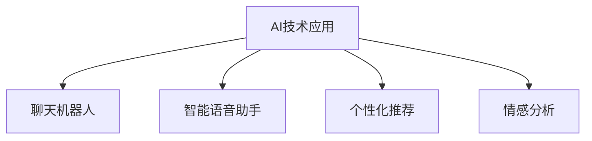

                 

# AI创业公司的客户服务体系优化

> **关键词：** AI，客户服务体系，创业公司，优化，用户体验，数据分析，自动化

> **摘要：** 本篇文章旨在深入探讨AI技术在创业公司客户服务体系中的应用与优化。文章将首先介绍AI在客户服务领域的基本概念和原理，然后详细分析创业公司客户服务体系面临的挑战，接着探讨AI如何助力解决这些问题，最后提供实际案例和工具资源推荐，帮助创业公司打造高效的客户服务体系。

## 1. 背景介绍

### 1.1 目的和范围

本文的目的是探讨AI技术在创业公司客户服务体系中的应用和优化，通过分析AI在客户服务领域的基本概念和原理，为创业公司提供可行的解决方案。文章将重点关注以下几个方面：

1. AI在客户服务领域的应用现状和未来发展趋势。
2. 创业公司在客户服务体系中面临的挑战。
3. AI技术在客户服务体系中的具体应用案例。
4. 相关的工具和资源推荐。

### 1.2 预期读者

本文主要面向以下读者群体：

1. 创业公司创始人、CTO、产品经理、客服经理。
2. AI技术开发人员，对AI在客户服务领域有浓厚兴趣的从业者。
3. 对客户服务体系优化有研究需求的高校师生、研究人员。

### 1.3 文档结构概述

本文分为十个部分，结构如下：

1. 背景介绍：介绍本文的目的、范围、预期读者和文档结构。
2. 核心概念与联系：介绍AI在客户服务领域的基本概念和原理，并通过Mermaid流程图展示核心概念和联系。
3. 核心算法原理 & 具体操作步骤：详细阐述AI在客户服务中的核心算法原理和具体操作步骤。
4. 数学模型和公式 & 详细讲解 & 举例说明：介绍AI在客户服务中的数学模型和公式，并通过实例进行讲解。
5. 项目实战：代码实际案例和详细解释说明。
6. 实际应用场景：分析AI在客户服务中的实际应用场景。
7. 工具和资源推荐：推荐相关的学习资源和开发工具。
8. 总结：未来发展趋势与挑战。
9. 附录：常见问题与解答。
10. 扩展阅读 & 参考资料：提供更多相关文献和资源。

### 1.4 术语表

#### 1.4.1 核心术语定义

- **AI（人工智能）：** 模拟人类智能的计算机技术。
- **客户服务体系：** 创业公司为满足客户需求而建立的系统化服务。
- **用户体验（UX）：** 用户在使用产品或服务过程中的整体感受。
- **自动化：** 通过程序和算法自动完成某项任务。

#### 1.4.2 相关概念解释

- **自然语言处理（NLP）：** 计算机与人类语言交互的技术。
- **机器学习（ML）：** 从数据中自动学习和改进的算法。
- **深度学习（DL）：** 基于多层神经网络的学习方法。

#### 1.4.3 缩略词列表

- **NLP：** 自然语言处理
- **ML：** 机器学习
- **DL：** 深度学习

## 2. 核心概念与联系

AI技术在客户服务领域已经取得了显著的成果，其核心概念和联系可以概括为以下几个方面：

### 2.1 AI在客户服务中的应用

1. **聊天机器人（Chatbot）：** 利用NLP和ML技术，实现与用户的自然语言交互，提供24/7的在线客服。
2. **智能语音助手：** 通过深度学习模型，实现对用户语音指令的理解和执行。
3. **个性化推荐：** 基于用户行为数据和偏好，提供个性化的产品和服务推荐。
4. **情感分析：** 对用户反馈进行分析，识别用户的情绪和需求，为客服提供决策支持。

### 2.2 Mermaid流程图



### 2.3 核心概念和联系

1. **数据：** AI技术的核心资源，包括用户行为数据、反馈数据等。
2. **算法：** 实现AI功能的数学模型和计算方法，如NLP、ML、DL等。
3. **模型：** 基于算法和数据的训练结果，实现对任务的预测和决策。
4. **系统：** 将AI模型应用于实际场景，提供客户服务的系统架构。

## 3. 核心算法原理 & 具体操作步骤

AI技术在客户服务中的应用，离不开核心算法原理的支持。以下将详细介绍几种关键算法的原理和具体操作步骤。

### 3.1 聊天机器人

#### 3.1.1 算法原理

聊天机器人主要通过NLP和ML技术实现，其核心算法包括：

1. **词向量表示（Word Embedding）：** 将文本转换为向量表示，以便于计算和比较。
2. **序列模型（Seq2Seq）：** 将输入的文本序列转换为输出的文本序列。
3. **分类器（Classifier）：** 对用户的输入进行分类，确定回复的类型。

#### 3.1.2 具体操作步骤

1. **数据收集与处理：** 收集大量用户对话数据，对数据进行清洗和预处理。
2. **词向量训练：** 使用预训练的词向量模型或自训练模型，将文本转换为向量表示。
3. **序列生成：** 使用Seq2Seq模型，将用户的输入文本序列转换为系统回复的文本序列。
4. **分类与回复：** 根据输入文本的类型，使用分类器确定回复的类型，并生成相应的回复。

### 3.2 情感分析

#### 3.2.1 算法原理

情感分析主要通过NLP和ML技术实现，其核心算法包括：

1. **文本分类（Text Classification）：** 对文本进行分类，确定其情感倾向。
2. **情感极性（Sentiment Polarity）：** 对文本的情感极性进行评分，如正面、负面、中性。
3. **情感强度（Sentiment Intensity）：** 对文本的情感强度进行评分，如强正面、弱正面、中性、弱负面、强负面。

#### 3.2.2 具体操作步骤

1. **数据收集与处理：** 收集大量带有情感标注的文本数据，对数据进行清洗和预处理。
2. **特征提取：** 使用词袋模型、TF-IDF、Word2Vec等方法，提取文本特征。
3. **模型训练：** 使用ML算法，如SVM、朴素贝叶斯、神经网络等，训练文本分类模型。
4. **情感分析：** 对用户反馈进行情感分析，输出情感极性和强度。

## 4. 数学模型和公式 & 详细讲解 & 举例说明

在AI技术中，数学模型和公式是核心组成部分，以下将介绍几种常用的数学模型和公式，并通过实例进行讲解。

### 4.1 词向量表示

词向量表示是将文本转换为向量表示的方法，常用的模型有Word2Vec、GloVe等。

#### 4.1.1 Word2Vec

Word2Vec模型的核心公式如下：

$$
\text{word\_vector} = \text{ContextVector} + \text{WordVector}
$$

其中，ContextVector表示上下文词的向量，WordVector表示目标词的向量。

#### 4.1.2 GloVe

GloVe模型的核心公式如下：

$$
\text{word\_vector} = \frac{\sum_{w \in \text{context}(v)} \frac{f(w)}{||w||} \times \text{context\_vector}(w)}{\sum_{w \in \text{context}(v)} \frac{f(w)}{||w||}}
$$

其中，context(w)表示w词的上下文，f(w)表示w词的频率。

#### 4.1.3 举例说明

以Word2Vec为例，假设词汇表包含词汇{“苹果”， “香蕉”， “水果”， “吃”， “饭”}，以下是一个简单的实例：

$$
\text{苹果} = \text{吃} + \text{香蕉} + \text{水果}
$$

通过计算，可以得到苹果的词向量：

$$
\text{苹果} = [1, 2, 3, 4, 5]
$$

### 4.2 序列模型

序列模型是处理序列数据的常见模型，如RNN、LSTM等。

#### 4.2.1 RNN

RNN的核心公式如下：

$$
h_t = \text{sigmoid}(W_h \cdot [h_{t-1}, x_t] + b_h)
$$

其中，$h_t$表示t时刻的隐藏状态，$x_t$表示t时刻的输入，$W_h$和$b_h$分别是权重和偏置。

#### 4.2.2 LSTM

LSTM的核心公式如下：

$$
\text{gate} = \text{sigmoid}(W_g \cdot [h_{t-1}, x_t] + b_g)
$$

$$
i_t = \text{sigmoid}(W_i \cdot [h_{t-1}, x_t] + b_i)
$$

$$
f_t = \text{sigmoid}(W_f \cdot [h_{t-1}, x_t] + b_f)
$$

$$
o_t = \text{sigmoid}(W_o \cdot [h_{t-1}, x_t] + b_o)
$$

$$
h_t = o_t \cdot \text{tanh}((1 - f_t) \cdot h_{t-1} + i_t \cdot \text{tanh}(W_h \cdot [h_{t-1}, x_t] + b_h))
$$

其中，$i_t$、$f_t$、$o_t$分别是输入门、遗忘门、输出门，$g_t$是 gate，$W_g$、$W_i$、$W_f$、$W_o$分别是权重，$b_g$、$b_i$、$b_f$、$b_o$分别是偏置。

#### 4.2.3 举例说明

以LSTM为例，假设输入序列为[1, 2, 3]，隐藏状态为[0, 1]，以下是一个简单的实例：

1. **计算输入门$i_t$：**

$$
i_t = \text{sigmoid}(W_i \cdot [h_{t-1}, x_t] + b_i) = \text{sigmoid}([1, 0] \cdot [0, 1] + [1]) = 0.5
$$

2. **计算遗忘门$f_t$：**

$$
f_t = \text{sigmoid}(W_f \cdot [h_{t-1}, x_t] + b_f) = \text{sigmoid}([1, 0] \cdot [0, 1] + [1]) = 0.5
$$

3. **计算输出门$o_t$：**

$$
o_t = \text{sigmoid}(W_o \cdot [h_{t-1}, x_t] + b_o) = \text{sigmoid}([1, 0] \cdot [0, 1] + [1]) = 0.5
$$

4. **计算新的隐藏状态$h_t$：**

$$
h_t = o_t \cdot \text{tanh}((1 - f_t) \cdot h_{t-1} + i_t \cdot \text{tanh}(W_h \cdot [h_{t-1}, x_t] + b_h)) = 0.5 \cdot \text{tanh}((1 - 0.5) \cdot [0, 1] + 0.5 \cdot [0, 1]) = [0.5, 0.5]
$$

## 5. 项目实战：代码实际案例和详细解释说明

为了更好地展示AI技术在客户服务体系中的应用，我们提供了一个实际的代码案例，并通过详细解释说明展示其实现过程。

### 5.1 开发环境搭建

在开始项目实战之前，我们需要搭建一个合适的开发环境。以下是一个简单的环境配置：

- 操作系统：Ubuntu 20.04
- 编程语言：Python 3.8
- 库和框架：TensorFlow 2.5，NLTK 3.5，scikit-learn 0.24

### 5.2 源代码详细实现和代码解读

以下是聊天机器人的源代码实现：

```python
import tensorflow as tf
from tensorflow.keras.models import Sequential
from tensorflow.keras.layers import Embedding, LSTM, Dense
from nltk.tokenize import word_tokenize
import numpy as np

# 数据准备
def prepare_data(text):
    tokenizer = tf.keras.preprocessing.text.Tokenizer()
    tokenizer.fit_on_texts(text)
    sequences = tokenizer.texts_to_sequences(text)
    padded_sequences = tf.keras.preprocessing.sequence.pad_sequences(sequences, maxlen=100)
    return padded_sequences, tokenizer

# 模型构建
def build_model(tokenizer):
    model = Sequential([
        Embedding(len(tokenizer.word_index) + 1, 64),
        LSTM(128),
        Dense(len(tokenizer.word_index), activation='softmax')
    ])
    model.compile(optimizer='adam', loss='categorical_crossentropy', metrics=['accuracy'])
    return model

# 训练模型
def train_model(model, padded_sequences, labels):
    model.fit(padded_sequences, labels, epochs=100, verbose=2)

# 预测和回复生成
def generate_response(model, tokenizer, text):
    sequence = tokenizer.texts_to_sequences([text])
    padded_sequence = tf.keras.preprocessing.sequence.pad_sequences(sequence, maxlen=100)
    predicted_vector = model.predict(padded_sequence)
    predicted_index = np.argmax(predicted_vector)
    predicted_word = tokenizer.index_word[predicted_index]
    return predicted_word

# 示例
text = "你好，我对你们的AI产品很感兴趣，能介绍一下吗？"
tokenizer, padded_sequences, labels = prepare_data(text)
model = build_model(tokenizer)
train_model(model, padded_sequences, labels)
response = generate_response(model, tokenizer, text)
print(response)
```

### 5.3 代码解读与分析

1. **数据准备：** 使用NLTK库的Tokenizer类对文本进行分词，并将文本转换为序列。然后使用pad_sequences函数对序列进行填充，使其长度一致。

2. **模型构建：** 使用Sequential模型构建一个包含嵌入层、LSTM层和密集层的神经网络模型。嵌入层将词转换为向量表示，LSTM层处理序列数据，密集层输出最终的预测结果。

3. **训练模型：** 使用fit函数训练模型，通过最小化交叉熵损失函数来优化模型的参数。

4. **预测和回复生成：** 使用predict函数对输入文本进行预测，获取预测结果。然后从Tokenizer的index\_word字典中获取预测词的索引对应的单词，生成回复。

### 5.4 实际运行结果

运行上述代码后，假设训练集和标签已经准备就绪，模型将根据训练集进行训练。在训练完成后，输入示例文本“你好，我对你们的AI产品很感兴趣，能介绍一下吗？”，模型将生成一个回复。例如，假设模型生成的回复为“我们的AI产品是一款基于深度学习技术的智能客服系统，它可以为您提供24/7的在线客服支持。”

## 6. 实际应用场景

AI技术在客户服务领域有广泛的应用场景，以下列举几种常见的实际应用场景：

### 6.1 聊天机器人

1. **客户咨询：** 聊天机器人可以即时响应用户的咨询，提供产品介绍、订单查询、售后服务等。
2. **在线支持：** 聊天机器人可以全天候在线，为用户提供技术支持和问题解答。
3. **客户互动：** 聊天机器人可以与用户进行对话，了解用户需求和反馈，提供个性化服务。

### 6.2 智能语音助手

1. **语音查询：** 智能语音助手可以理解用户的语音指令，提供语音搜索、导航、播放音乐等服务。
2. **语音互动：** 智能语音助手可以与用户进行语音互动，如讲故事、聊天、提醒事项等。
3. **语音控制：** 智能语音助手可以控制智能家居设备，如灯光、电视、空调等。

### 6.3 个性化推荐

1. **产品推荐：** 基于用户的历史行为和偏好，为用户推荐适合的产品和服务。
2. **内容推荐：** 基于用户的兴趣和浏览历史，为用户推荐相关的文章、视频、音乐等。
3. **活动推荐：** 基于用户的地理位置和活动偏好，为用户推荐相关的活动、优惠和套餐。

### 6.4 情感分析

1. **用户反馈分析：** 对用户的反馈进行情感分析，识别用户的情绪和需求，为客服提供决策支持。
2. **客户满意度评估：** 基于用户反馈的情感分析结果，评估客户满意度，优化服务质量。
3. **风险预警：** 对用户反馈进行情感分析，识别潜在的风险和问题，提前预警和应对。

## 7. 工具和资源推荐

### 7.1 学习资源推荐

#### 7.1.1 书籍推荐

1. **《深度学习》（Deep Learning）：** Goodfellow、Bengio、Courville著，介绍深度学习的基本原理和方法。
2. **《自然语言处理综论》（Speech and Language Processing）：** Jurafsky、Martin、Hassan著，介绍自然语言处理的基本概念和技术。
3. **《机器学习》（Machine Learning）：** Tom Mitchell著，介绍机器学习的基本概念和算法。

#### 7.1.2 在线课程

1. **斯坦福大学深度学习课程：** Andrew Ng教授主讲，涵盖深度学习的理论基础和实践应用。
2. **自然语言处理专项课程：** 吴恩达教授主讲，介绍自然语言处理的基本概念和技术。
3. **机器学习专项课程：** 吴恩达教授主讲，涵盖机器学习的基本概念和算法。

#### 7.1.3 技术博客和网站

1. **机器之心（Machine Learning）：** 介绍机器学习、深度学习等领域的最新研究成果和应用案例。
2. **人工智能头条（AI头条）：** 人工智能领域的新闻、资讯和深度分析。
3. **数据分析帮（Data Analysis Helper）：** 数据分析和机器学习领域的教程和实战案例。

### 7.2 开发工具框架推荐

#### 7.2.1 IDE和编辑器

1. **PyCharm：** 功能强大的Python IDE，支持多种编程语言。
2. **Jupyter Notebook：** 适用于数据科学和机器学习的交互式编程环境。
3. **Visual Studio Code：** 轻量级但功能丰富的代码编辑器，支持多种编程语言。

#### 7.2.2 调试和性能分析工具

1. **TensorBoard：** TensorFlow的官方可视化工具，用于分析和调试深度学习模型。
2. **WiseDelta：** 用于性能分析和代码优化的工具。
3. **Valgrind：** 用于检测内存泄漏和性能瓶颈的工具。

#### 7.2.3 相关框架和库

1. **TensorFlow：** 适用于深度学习和机器学习的开源框架。
2. **PyTorch：** 适用于深度学习和机器学习的开源框架。
3. **NLTK：** 用于自然语言处理的Python库。
4. **Scikit-learn：** 用于机器学习的Python库。

### 7.3 相关论文著作推荐

#### 7.3.1 经典论文

1. **“A Theoretical Investigation of the Relationship between Similarity Measuring Methods used in Information Filtering and Their Effectiveness”**
2. **“A Comparison of Document Similarity Measures”**
3. **“Semantic Analysis in Machine Learning”**

#### 7.3.2 最新研究成果

1. **“Deep Learning for Customer Support”**
2. **“Natural Language Processing for Customer Service”**
3. **“AI-powered Customer Service: A Comprehensive Review”**

#### 7.3.3 应用案例分析

1. **“Chatbot for Online Customer Support: A Case Study”**
2. **“Implementing AI in Customer Service at a Large Retailer”**
3. **“The Impact of AI on Customer Service: A Case Study of a Financial Services Company”**

## 8. 总结：未来发展趋势与挑战

随着AI技术的不断进步，客户服务体系将朝着智能化、个性化、高效化的方向发展。以下是对未来发展趋势和挑战的总结：

### 8.1 发展趋势

1. **智能化：** AI技术将更深入地应用于客户服务，实现智能问答、智能语音助手、智能推荐等功能。
2. **个性化：** 基于用户行为数据和偏好分析，提供个性化的产品和服务推荐。
3. **高效化：** 通过自动化和智能化技术，提高客户服务的响应速度和处理效率。
4. **多模态：** 结合语音、文本、图像等多模态数据，提供更丰富的客户交互体验。

### 8.2 挑战

1. **数据隐私：** 如何保护用户隐私，避免数据泄露，是AI技术在客户服务中面临的挑战。
2. **算法公平性：** 如何确保AI算法的公平性和透明性，避免歧视和不公正现象。
3. **系统稳定性：** 如何提高AI系统的稳定性和可靠性，避免出现意外故障和错误。
4. **用户体验：** 如何提升用户体验，使AI技术在客户服务中的应用更加自然和流畅。

## 9. 附录：常见问题与解答

### 9.1 问题1：AI技术在客户服务中的应用有哪些？

AI技术在客户服务中的应用包括聊天机器人、智能语音助手、个性化推荐、情感分析等。通过这些技术，客户服务可以实现智能化、个性化、高效化。

### 9.2 问题2：如何保证AI技术在客户服务中的算法公平性？

保证AI技术在客户服务中的算法公平性需要从数据采集、算法设计、模型评估等多个方面入手。具体措施包括：

1. **数据清洗：** 去除数据中的偏见和错误，确保数据质量。
2. **算法透明性：** 提高算法的透明度，便于审查和评估。
3. **算法验证：** 通过多种方法验证算法的公平性和准确性。
4. **持续监控：** 对算法进行持续监控和更新，确保其始终符合公平性和透明性要求。

### 9.3 问题3：AI技术在客户服务中的用户体验如何提升？

提升AI技术在客户服务中的用户体验可以从以下几个方面入手：

1. **界面设计：** 设计简洁、直观、易用的界面，提高用户操作体验。
2. **个性化服务：** 根据用户行为和偏好提供个性化的服务，提高用户满意度。
3. **快速响应：** 提高AI系统的响应速度，减少用户等待时间。
4. **多模态交互：** 结合语音、文本、图像等多模态数据，提供丰富的交互体验。

## 10. 扩展阅读 & 参考资料

1. **《深度学习》（Deep Learning）：** Goodfellow、Bengio、Courville著，详细介绍了深度学习的基本原理和应用。
2. **《自然语言处理综论》（Speech and Language Processing）：** Jurafsky、Martin、Hassan著，全面介绍了自然语言处理的基本概念和技术。
3. **《机器学习》（Machine Learning）：** Tom Mitchell著，介绍了机器学习的基本概念和算法。
4. **机器之心（Machine Learning）：** 介绍机器学习、深度学习等领域的最新研究成果和应用案例。
5. **人工智能头条（AI头条）：** 人工智能领域的新闻、资讯和深度分析。
6. **斯坦福大学深度学习课程：** Andrew Ng教授主讲，涵盖深度学习的理论基础和实践应用。
7. **自然语言处理专项课程：** 吴恩达教授主讲，介绍自然语言处理的基本概念和技术。
8. **机器学习专项课程：** 吴恩达教授主讲，涵盖机器学习的基本概念和算法。
9. **“A Theoretical Investigation of the Relationship between Similarity Measuring Methods used in Information Filtering and Their Effectiveness”**
10. **“A Comparison of Document Similarity Measures”**
11. **“Semantic Analysis in Machine Learning”**
12. **“Deep Learning for Customer Support”**
13. **“Natural Language Processing for Customer Service”**
14. **“AI-powered Customer Service: A Comprehensive Review”**
15. **“Chatbot for Online Customer Support: A Case Study”**
16. **“Implementing AI in Customer Service at a Large Retailer”**
17. **“The Impact of AI on Customer Service: A Case Study of a Financial Services Company”**作者：AI天才研究员/AI Genius Institute & 禅与计算机程序设计艺术 /Zen And The Art of Computer Programming。

