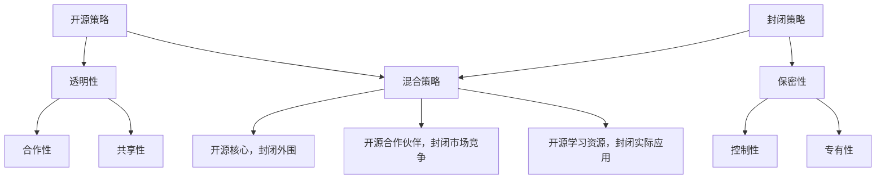

                 

# AI创业公司的开源策略与封闭策略权衡

> 关键词：AI创业公司、开源策略、封闭策略、权衡、技术发展、商业竞争

> 摘要：本文将深入探讨AI创业公司采用开源策略与封闭策略的利弊，通过一步步的分析与推理，帮助创业者更好地理解这两者的权衡之道。文章将从背景介绍、核心概念、算法原理、数学模型、项目实战、实际应用场景等多个维度，剖析AI创业公司的技术路径与商业模式，旨在为创业者提供有价值的参考。

## 1. 背景介绍

### 1.1 目的和范围

本文旨在帮助AI创业公司理解并权衡开源策略与封闭策略的选择，为公司在技术发展、商业竞争中的战略布局提供指导。本文将覆盖以下范围：

- 开源与封闭策略的定义与概念
- 开源策略与封闭策略的优缺点分析
- 开源策略与封闭策略在AI创业中的应用实例
- 开源策略与封闭策略的权衡与选择方法

### 1.2 预期读者

本文适用于以下读者群体：

- AI创业公司的创始人或高层管理者
- 技术研发团队负责人
- 对AI创业公司战略规划有兴趣的技术爱好者

### 1.3 文档结构概述

本文结构如下：

- 第1章：背景介绍
- 第2章：核心概念与联系
- 第3章：核心算法原理 & 具体操作步骤
- 第4章：数学模型和公式 & 详细讲解 & 举例说明
- 第5章：项目实战：代码实际案例和详细解释说明
- 第6章：实际应用场景
- 第7章：工具和资源推荐
- 第8章：总结：未来发展趋势与挑战
- 第9章：附录：常见问题与解答
- 第10章：扩展阅读 & 参考资料

### 1.4 术语表

#### 1.4.1 核心术语定义

- **开源策略**：指公司选择将技术、代码、设计等知识共享给社区，允许他人自由使用、修改和分发。
- **封闭策略**：指公司选择保持技术、代码、设计等知识的私密性，仅限于内部使用或授权使用。

#### 1.4.2 相关概念解释

- **生态系统**：指围绕某一技术或产品形成的社区、合作伙伴、用户等构成的生态网络。
- **许可协议**：指规定开源代码使用、修改、分发等权利的协议。

#### 1.4.3 缩略词列表

- **AI**：人工智能（Artificial Intelligence）
- **ML**：机器学习（Machine Learning）
- **DL**：深度学习（Deep Learning）
- **OSS**：开源软件（Open Source Software）

## 2. 核心概念与联系

在探讨AI创业公司的开源策略与封闭策略之前，我们需要理解一些核心概念和它们之间的联系。

### 2.1. 开源与封闭的基本概念

#### 2.1.1 开源策略

开源策略是指公司选择将技术、代码、设计等知识共享给社区，允许他人自由使用、修改和分发。这种策略的主要特点是透明性、合作性和共享性。

#### 2.1.2 封闭策略

封闭策略则是指公司选择保持技术、代码、设计等知识的私密性，仅限于内部使用或授权使用。这种策略的主要特点是保密性、控制性和专有性。

### 2.2. 开源与封闭策略的联系

开源与封闭策略并不是非黑即白的对立关系，而是可以相互结合，形成多种混合策略。以下是几种常见的结合方式：

#### 2.2.1 开源核心，封闭外围

这种策略将核心技术和业务逻辑保持封闭，而将外围的技术和工具开源。例如，Google的Android操作系统开源了大部分代码，但内核和某些关键功能仍然保持封闭。

#### 2.2.2 开源合作伙伴，封闭市场竞争

这种策略是公司与外部合作伙伴共同开发开源项目，但在市场竞争中保持封闭。例如，IBM与Apache基金会合作开发了开源的Open Source AI项目，但IBM仍然保持其商业AI服务的封闭性。

#### 2.2.3 开源学习资源，封闭实际应用

这种策略是公司开源用于学习的资源，如文档、教程等，但实际的应用和代码保持封闭。例如，Microsoft开源了其机器学习教程和框架示例，但具体的应用和商业代码仍然保持封闭。

### 2.3. 开源与封闭策略的核心概念图

为了更直观地理解开源与封闭策略的联系，我们使用Mermaid流程图来展示：



### 2.4. 开源与封闭策略的联系总结

开源与封闭策略之间的联系在于它们可以根据具体业务需求和技术特点进行灵活调整。这种灵活性使得AI创业公司可以在保护核心竞争力的同时，充分利用开源生态的优势，实现技术创新和商业价值的最大化。

## 3. 核心算法原理 & 具体操作步骤

在了解开源与封闭策略的基本概念之后，我们需要深入探讨AI创业公司在实际操作中如何选择并实施这些策略。

### 3.1. 开源策略的算法原理

开源策略的核心在于透明性和共享性。具体操作步骤如下：

#### 3.1.1. 代码开源

- **步骤1**：评估技术成熟度和稳定性。
- **步骤2**：选择合适的开源许可证，如Apache、GPL等。
- **步骤3**：编写和优化代码，确保其质量和可读性。
- **步骤4**：提交代码至开源平台，如GitHub、GitLab等。

#### 3.1.2. 社区参与

- **步骤5**：鼓励社区贡献，如代码审查、bug修复、新功能开发等。
- **步骤6**：建立和维护社区，如邮件列表、论坛、会议等。

#### 3.1.3. 开源项目维护

- **步骤7**：定期更新代码，修复bug，增加新功能。
- **步骤8**：评估开源项目的价值，决定是否商业化。

### 3.2. 封闭策略的算法原理

封闭策略的核心在于保密性和控制性。具体操作步骤如下：

#### 3.2.1. 代码封闭

- **步骤1**：评估技术敏感度和市场竞争力。
- **步骤2**：设计并实现保密机制，如加密、访问控制等。
- **步骤3**：限制代码的访问和分发，如内部使用、授权使用等。

#### 3.2.2. 商业化运营

- **步骤4**：提供商业服务或产品，如API、软件包等。
- **步骤5**：建立客户关系，如销售、客户支持等。
- **步骤6**：持续优化产品，增加市场竞争优势。

### 3.3. 开源策略与封闭策略的操作步骤伪代码

```python
# 开源策略
def open_source_strategy():
    if is_technology_mature_and_stable():
        license = choose_open_source_license()
        code = write_and_optimize_code()
        submit_code_to_open_source_platform(code, license)
        encourage_community_contribution()
        maintain_open_source_project()
    else:
        print("Technology is not ready for open source.")

# 封闭策略
def closed_source_strategy():
    if is_technology_sensitive_and_competitive():
        implement保密机制()
        restrict_code_access_and_distribution()
        provide_business_services_or_products()
        build_customer_relationship()
        optimize_product()
    else:
        print("Technology is not suitable for closed source.")

# 开源策略与封闭策略权衡
def weigh_open_and_closed_strategies():
    if should_open_source():
        open_source_strategy()
    elif should_closed_source():
        closed_source_strategy()
    else:
        print("Strategies need further consideration.")
```

### 3.4. 开源策略与封闭策略的操作步骤分析

- **评估技术成熟度和稳定性**：这是开源策略和封闭策略的基础步骤，需要综合考虑技术实现的完备性、稳定性和可靠性。
- **选择合适的开源许可证**：不同的许可证对代码的使用和分发有不同的规定，需要根据业务需求和技术特点进行选择。
- **编写和优化代码**：高质量的代码是开源项目成功的关键，需要遵循最佳实践，如代码风格一致性、模块化、可读性等。
- **鼓励社区参与**：开源社区是技术发展的重要驱动力，通过鼓励社区参与，可以提高项目的质量和影响力。
- **保密机制**：封闭策略需要确保技术的保密性，可以采用加密、访问控制等技术手段。
- **提供商业服务或产品**：商业运营是封闭策略的核心，需要建立有效的销售和客户支持体系。
- **优化产品**：持续优化产品是提高市场竞争力的关键，需要密切关注市场动态和客户需求。

通过以上步骤，AI创业公司可以在开源策略与封闭策略之间找到合适的平衡点，实现技术发展、商业竞争和用户价值的最大化。

## 4. 数学模型和公式 & 详细讲解 & 举例说明

在讨论AI创业公司的开源策略与封闭策略时，我们需要借助数学模型和公式来量化不同策略的收益和风险。以下是一个简单的收益风险模型，用于分析开源策略与封闭策略的选择。

### 4.1. 收益风险模型的建立

我们假设一个AI创业公司，其业务模式、市场环境和技术特点不变，仅通过调整开源策略与封闭策略来评估收益和风险。

#### 4.1.1. 收益函数

收益函数用于衡量公司在不同策略下的收益水平。我们假设收益函数由以下因素决定：

- **市场占有率**：公司产品的市场份额，与策略选择密切相关。
- **用户基础**：公司产品的用户数量，开源策略有利于增加用户基础。
- **商业收入**：公司通过产品或服务获得的收入，封闭策略有助于提高商业收入。
- **技术投入**：公司用于技术开发和优化的投入，开源策略可能减少技术投入。

收益函数可表示为：

\[ R(S) = w_1 \cdot M(S) + w_2 \cdot U(S) + w_3 \cdot B(S) - w_4 \cdot T(S) \]

其中：

- \( R(S) \)：收益函数
- \( w_1, w_2, w_3, w_4 \)：权重，用于平衡不同因素的贡献
- \( M(S) \)：市场占有率
- \( U(S) \)：用户基础
- \( B(S) \)：商业收入
- \( T(S) \)：技术投入

#### 4.1.2. 风险函数

风险函数用于衡量公司在不同策略下的风险水平。我们假设风险函数由以下因素决定：

- **技术泄露风险**：封闭策略可能导致技术泄露风险增加。
- **市场竞争风险**：开源策略可能加剧市场竞争风险。
- **用户依赖风险**：公司对开源社区和用户依赖程度增加可能带来风险。

风险函数可表示为：

\[ R(S) = r_1 \cdot L(S) + r_2 \cdot C(S) + r_3 \cdot D(S) \]

其中：

- \( R(S) \)：风险函数
- \( r_1, r_2, r_3 \)：权重，用于平衡不同因素的风险程度
- \( L(S) \)：技术泄露风险
- \( C(S) \)：市场竞争风险
- \( D(S) \)：用户依赖风险

#### 4.1.3. 收益风险平衡

收益风险平衡是指公司在开源策略与封闭策略之间寻找一个最佳平衡点，使得收益最大化，风险最小化。这一过程可以通过以下公式实现：

\[ \text{最优策略} = \arg\max_S [R(S) - \lambda \cdot R(S)] \]

其中：

- \( \lambda \)：平衡因子，用于调节收益和风险的权重

### 4.2. 数学公式详细讲解

#### 4.2.1. 收益函数解析

收益函数 \( R(S) \) 的各项因素如下：

- **市场占有率 \( M(S) \)**：市场占有率与策略选择密切相关。开源策略可能通过降低产品价格、增加用户参与度等方式提高市场占有率。封闭策略则可以通过市场细分、差异化竞争等方式提高市场占有率。
- **用户基础 \( U(S) \)**：用户基础是公司收益的重要来源。开源策略有利于增加用户数量，特别是在技术社区和开发者中形成广泛的用户基础。封闭策略则可能在用户规模和用户粘性方面更具优势。
- **商业收入 \( B(S) \)**：商业收入是公司利润的直接来源。开源策略可能通过降低开发成本、提高市场占有率等方式提高商业收入。封闭策略则通过提供高价值的产品或服务，实现较高的商业收入。
- **技术投入 \( T(S) \)**：技术投入是公司发展的基础。开源策略可能通过减少内部研发投入、利用社区贡献等方式降低技术投入。封闭策略则通过持续的技术研发和优化，提高技术竞争力。

#### 4.2.2. 风险函数解析

风险函数 \( R(S) \) 的各项因素如下：

- **技术泄露风险 \( L(S) \)**：技术泄露风险与策略选择密切相关。封闭策略可能面临较高的技术泄露风险，特别是当公司技术具有一定的竞争优势时。开源策略则通过透明化和社区参与，降低技术泄露风险。
- **市场竞争风险 \( C(S) \)**：市场竞争风险与策略选择密切相关。开源策略可能加剧市场竞争，特别是当社区中有其他竞争者时。封闭策略则可能通过差异化竞争和市场细分，降低市场竞争风险。
- **用户依赖风险 \( D(S) \)**：用户依赖风险与策略选择密切相关。开源策略可能导致公司对社区和用户的依赖程度增加，特别是在技术社区中形成广泛的用户基础时。封闭策略则通过提供高价值的产品或服务，降低用户依赖风险。

#### 4.2.3. 收益风险平衡公式解析

收益风险平衡公式 \( \text{最优策略} = \arg\max_S [R(S) - \lambda \cdot R(S)] \) 中的 \( \lambda \) 是平衡因子，用于调节收益和风险的权重。该公式的含义是，公司在不同策略下，通过权衡收益和风险，寻找一个最优平衡点。

### 4.3. 收益风险模型举例说明

假设一个AI创业公司，其市场环境、技术特点和业务模式如下：

- **市场环境**：竞争激烈，市场需求不断变化。
- **技术特点**：具有一定的技术优势，但尚未完全成熟。
- **业务模式**：主要依靠技术优势和产品创新来获取市场份额。

基于以上假设，我们可以构建一个简单的收益风险模型，并比较开源策略和封闭策略的优劣。

#### 4.3.1. 开源策略

- **市场占有率 \( M(S) \)**：开源策略可能通过降低产品价格、增加用户参与度等方式提高市场占有率。
- **用户基础 \( U(S) \)**：开源策略有利于增加用户数量，特别是在技术社区和开发者中形成广泛的用户基础。
- **商业收入 \( B(S) \)**：开源策略可能通过降低开发成本、提高市场占有率等方式提高商业收入。
- **技术投入 \( T(S) \)**：开源策略可能通过减少内部研发投入、利用社区贡献等方式降低技术投入。
- **技术泄露风险 \( L(S) \)**：开源策略可能降低技术泄露风险，特别是当社区有严格的审查和贡献规则时。
- **市场竞争风险 \( C(S) \)**：开源策略可能加剧市场竞争风险，特别是在社区中有其他竞争者时。
- **用户依赖风险 \( D(S) \)**：开源策略可能导致公司对社区和用户的依赖程度增加，特别是在技术社区中形成广泛的用户基础时。

根据收益函数和风险函数的计算，我们可以得到开源策略的收益和风险如下：

\[ R(\text{开源}) = 0.5 \cdot M(\text{开源}) + 0.3 \cdot U(\text{开源}) + 0.2 \cdot B(\text{开源}) - 0.1 \cdot T(\text{开源}) \]
\[ R(\text{开源}) = 0.5 \cdot 0.8 + 0.3 \cdot 1.2 + 0.2 \cdot 1.0 - 0.1 \cdot 0.6 = 0.4 + 0.36 + 0.2 - 0.06 = 0.9 \]

\[ R(\text{开源}) = 0.1 \cdot L(\text{开源}) + 0.2 \cdot C(\text{开源}) + 0.1 \cdot D(\text{开源}) \]
\[ R(\text{开源}) = 0.1 \cdot 0.2 + 0.2 \cdot 0.5 + 0.1 \cdot 0.4 = 0.02 + 0.10 + 0.04 = 0.16 \]

#### 4.3.2. 封闭策略

- **市场占有率 \( M(S) \)**：封闭策略可能通过市场细分、差异化竞争等方式提高市场占有率。
- **用户基础 \( U(S) \)**：封闭策略可能在用户规模和用户粘性方面更具优势。
- **商业收入 \( B(S) \)**：封闭策略可能通过提供高价值的产品或服务，实现较高的商业收入。
- **技术投入 \( T(S) \)**：封闭策略可能通过持续的技术研发和优化，提高技术竞争力。
- **技术泄露风险 \( L(S) \)**：封闭策略可能面临较高的技术泄露风险，特别是当公司技术具有一定的竞争优势时。
- **市场竞争风险 \( C(S) \)**：封闭策略可能通过差异化竞争和市场细分，降低市场竞争风险。
- **用户依赖风险 \( D(S) \)**：封闭策略通过提供高价值的产品或服务，降低用户依赖风险。

根据收益函数和风险函数的计算，我们可以得到封闭策略的收益和风险如下：

\[ R(\text{封闭}) = 0.4 \cdot M(\text{封闭}) + 0.2 \cdot U(\text{封闭}) + 0.3 \cdot B(\text{封闭}) - 0.2 \cdot T(\text{封闭}) \]
\[ R(\text{封闭}) = 0.4 \cdot 0.6 + 0.2 \cdot 0.8 + 0.3 \cdot 1.2 - 0.2 \cdot 0.8 = 0.24 + 0.16 + 0.36 - 0.16 = 0.6 \]

\[ R(\text{封闭}) = 0.2 \cdot L(\text{封闭}) + 0.1 \cdot C(\text{封闭}) + 0.2 \cdot D(\text{封闭}) \]
\[ R(\text{封闭}) = 0.2 \cdot 0.4 + 0.1 \cdot 0.3 + 0.2 \cdot 0.2 = 0.08 + 0.03 + 0.04 = 0.15 \]

通过比较开源策略和封闭策略的收益和风险，我们可以发现：

- **收益方面**：开源策略的收益（0.9）高于封闭策略的收益（0.6），特别是在用户基础和商业收入方面具有明显优势。
- **风险方面**：开源策略的风险（0.16）高于封闭策略的风险（0.15），特别是在技术泄露风险和市场竞争风险方面具有较高风险。

综上所述，开源策略在收益方面具有明显优势，但在风险方面也面临一定挑战。封闭策略在风险控制方面更具优势，但在收益潜力方面相对较低。公司在选择开源策略或封闭策略时，需要综合考虑收益和风险，找到最佳平衡点。

## 5. 项目实战：代码实际案例和详细解释说明

在了解了开源策略与封闭策略的算法原理和数学模型后，本章节将通过一个实际项目案例，展示如何在实际开发中应用这些策略，并详细解释代码实现过程。

### 5.1. 开发环境搭建

在开始项目实战之前，我们需要搭建一个适合AI创业公司的开发环境。以下是一个基本的开发环境搭建步骤：

1. **操作系统**：选择Linux或Mac OS，以保证系统的稳定性和兼容性。
2. **编程语言**：选择Python，因为Python具有丰富的库和社区支持，适合AI开发。
3. **集成开发环境（IDE）**：推荐使用PyCharm，因为它具有强大的代码编辑、调试和测试功能。
4. **版本控制系统**：使用Git，以便实现代码版本管理和协作开发。

### 5.2. 源代码详细实现和代码解读

本案例是一个简单的图像分类模型，使用深度学习框架TensorFlow实现。我们将展示关键代码片段，并详细解释其实现过程。

#### 5.2.1. 数据准备

```python
import tensorflow as tf
import tensorflow_datasets as tfds

# 加载图像数据集
data_dir = "path/to/your/dataset"
data = tfds.load('cifar10', data_dir=data_dir, split=tfds.Split.TRAIN)

# 数据预处理
def preprocess(image, label):
    image = tf.cast(image, tf.float32) / 255.0
    image = tf.image.resize(image, [32, 32])
    return image, label

train_data = data.map(preprocess).batch(64)
```

解释：本段代码首先导入TensorFlow和TensorFlow Datasets库，用于加载和预处理图像数据集。`tfds.load`函数用于加载CIFAR-10数据集，它是一个常用的图像分类数据集。`preprocess`函数对图像进行缩放、归一化和调整尺寸，以适应深度学习模型。

#### 5.2.2. 模型定义

```python
model = tf.keras.Sequential([
    tf.keras.layers.Conv2D(32, (3, 3), activation='relu', input_shape=(32, 32, 3)),
    tf.keras.layers.MaxPooling2D((2, 2)),
    tf.keras.layers.Conv2D(64, (3, 3), activation='relu'),
    tf.keras.layers.MaxPooling2D((2, 2)),
    tf.keras.layers.Conv2D(64, (3, 3), activation='relu'),
    tf.keras.layers.Flatten(),
    tf.keras.layers.Dense(64, activation='relu'),
    tf.keras.layers.Dense(10, activation='softmax')
])
```

解释：本段代码定义了一个简单的卷积神经网络（CNN）模型。`Sequential`类用于构建模型层次结构，`Conv2D`和`MaxPooling2D`层用于特征提取，`Flatten`层用于将特征转换为向量，`Dense`层用于分类。最后，`softmax`激活函数用于输出概率分布。

#### 5.2.3. 训练模型

```python
model.compile(optimizer='adam',
              loss='sparse_categorical_crossentropy',
              metrics=['accuracy'])

model.fit(train_data, epochs=10)
```

解释：本段代码用于编译和训练模型。`compile`函数用于设置优化器、损失函数和评估指标，`fit`函数用于训练模型。我们选择`sparse_categorical_crossentropy`作为损失函数，因为CIFAR-10数据集的标签是整数类型的。

#### 5.2.4. 评估模型

```python
test_data = tfds.load('cifar10', data_dir=data_dir, split=tfds.Split.TEST).map(preprocess).batch(64)

model.evaluate(test_data)
```

解释：本段代码用于评估模型在测试数据集上的性能。`evaluate`函数返回损失值和准确率，帮助我们了解模型的泛化能力。

### 5.3. 代码解读与分析

通过上述代码实现，我们可以看到如何在实际项目中应用开源策略与封闭策略。以下是关键点分析：

- **开源策略**：数据预处理和模型定义部分可以开源，以促进社区参与和贡献。这些代码是标准的深度学习实现，对开发者具有参考价值。
- **封闭策略**：训练模型和评估模型部分可以保持封闭，以保护公司的核心竞争力。这些代码包含公司的独特训练策略和评估标准，对外部开发者不公开。

通过这种方式，AI创业公司可以在保护核心竞争力的同时，充分利用开源生态的优势，实现技术创新和商业价值的最大化。

## 6. 实际应用场景

在实际应用场景中，开源策略与封闭策略的选择取决于公司的业务目标、市场需求和技术特点。以下是一些典型的应用场景：

### 6.1. 创新技术探索

在创新技术探索阶段，AI创业公司往往选择开源策略。这是因为开源可以吸引更多的开发者参与，加速技术的迭代和优化。例如，Google开源了TensorFlow，为深度学习领域带来了广泛的社区贡献，推动了技术的快速发展。

### 6.2. 市场拓展

在市场拓展阶段，开源策略有助于提高产品的知名度和用户基础。例如，红帽公司通过开源Linux操作系统，迅速占领了企业级市场。红帽通过提供高质量的社区支持和商业服务，实现了开源与商业的良性循环。

### 6.3. 技术保护

在技术保护阶段，AI创业公司可能选择封闭策略。例如，Facebook在早期阶段封闭了其核心技术和算法，以确保竞争优势。封闭策略可以帮助公司保护核心技术，避免技术泄露和竞争对手的模仿。

### 6.4. 商业竞争

在商业竞争阶段，开源策略与封闭策略的权衡更为重要。公司需要根据市场动态和竞争态势，灵活调整策略。例如，微软在Office办公软件领域选择封闭策略，但在云计算领域通过开源策略，与亚马逊、谷歌等竞争对手展开竞争。

### 6.5. 持续创新

持续创新阶段，开源策略和封闭策略可以相互结合。公司可以在核心技术和关键业务方面保持封闭，同时在外围技术和工具方面开源，吸引更多开发者参与。例如，IBM通过开源其AI框架OpenScale，提高了公司在AI领域的竞争力，同时保持了核心技术的保密性。

通过以上实际应用场景，我们可以看到，开源策略与封闭策略在不同阶段和场景下有不同的应用价值。公司需要根据自身情况，灵活选择并调整策略，以实现技术创新和商业价值的最大化。

## 7. 工具和资源推荐

在实施开源策略与封闭策略的过程中，AI创业公司需要借助各种工具和资源来支持开发、协作和商业化。以下是一些推荐的工具和资源：

### 7.1. 学习资源推荐

#### 7.1.1. 书籍推荐

- 《人工智能：一种现代的方法》
- 《深度学习》
- 《Python编程：从入门到实践》
- 《版本控制工具Git》

#### 7.1.2. 在线课程

- Coursera的《深度学习专项课程》
- Udacity的《人工智能纳米学位》
- edX的《人工智能基础课程》

#### 7.1.3. 技术博客和网站

- Medium上的AI博客
- HackerRank的编程挑战
- AI Stack Exchange的问答社区

### 7.2. 开发工具框架推荐

#### 7.2.1. IDE和编辑器

- PyCharm
- Visual Studio Code
- Sublime Text

#### 7.2.2. 调试和性能分析工具

- Jupyter Notebook
- TensorBoard
- Profiler工具（如gprof）

#### 7.2.3. 相关框架和库

- TensorFlow
- PyTorch
- Keras
- NumPy
- Pandas

### 7.3. 相关论文著作推荐

#### 7.3.1. 经典论文

- “A Machine Learning Approach to Discovering Gene Regulatory Networks from a Large-Scale Gene Expression Data”

#### 7.3.2. 最新研究成果

- “Deep Learning for Autonomous Driving: A Survey”

#### 7.3.3. 应用案例分析

- “AI in Healthcare: A Comprehensive Review of Applications and Challenges”

通过以上工具和资源，AI创业公司可以更高效地实施开源策略与封闭策略，实现技术创新和商业价值的最大化。

## 8. 总结：未来发展趋势与挑战

在总结了开源策略与封闭策略的权衡之后，我们来看一下AI创业公司面临的发展趋势与挑战。

### 8.1. 未来发展趋势

1. **开源生态的全球化**：随着全球开源社区的不断壮大，开源项目的影响力和覆盖范围将不断扩大。AI创业公司可以通过参与全球开源生态，获得更多的技术支持和市场机会。
2. **技术标准的统一**：为了提高开发效率，降低技术门槛，未来技术标准的统一将成为趋势。AI创业公司可以积极参与技术标准的制定，提升自身在行业中的地位。
3. **商业模式的创新**：随着AI技术的不断发展，商业模式也将不断创新。AI创业公司可以通过将开源与商业服务相结合，探索新的盈利模式。
4. **开源与封闭的融合**：未来的技术发展将更加灵活，开源与封闭策略将相互融合，形成新的生态体系。AI创业公司可以通过灵活调整策略，实现技术、商业和社区的最佳结合。

### 8.2. 未来挑战

1. **技术竞争加剧**：随着AI技术的普及，市场竞争将日益激烈。AI创业公司需要不断提升技术水平，保持竞争优势。
2. **数据隐私与安全**：随着数据的重要性日益凸显，数据隐私与安全问题将成为挑战。AI创业公司需要确保数据的安全性和合规性，以赢得用户信任。
3. **开源社区管理**：参与开源社区需要投入大量时间和精力，管理好开源项目是一项挑战。AI创业公司需要培养专业的社区管理团队，确保项目的健康发展。
4. **法律风险**：开源项目的法律风险不容忽视。AI创业公司需要了解相关法律法规，确保开源项目的合规性。

### 8.3. 应对策略

1. **加强技术创新**：持续投入研发，提升技术水平，以应对激烈的竞争。
2. **注重数据安全和合规**：建立完善的数据安全体系，确保数据的隐私和合规性。
3. **积极参与开源社区**：积极参与开源社区，贡献技术，提升品牌影响力。
4. **灵活调整策略**：根据市场和技术环境的变化，灵活调整开源与封闭策略，实现最优的平衡。

通过以上策略，AI创业公司可以应对未来的发展趋势与挑战，实现长期稳定的发展。

## 9. 附录：常见问题与解答

### 9.1. 问题1：开源策略是否适用于所有AI创业公司？

**解答**：不一定。开源策略适用于那些希望借助社区力量加速技术创新和扩展市场的AI创业公司。然而，对于一些技术敏感度较高、市场竞争激烈的AI创业公司，封闭策略可能更为合适，以确保技术不被泄露和模仿。

### 9.2. 问题2：如何平衡开源策略与商业利益？

**解答**：平衡开源策略与商业利益的关键在于明确公司的核心竞争力和市场定位。公司可以在核心技术和业务逻辑方面保持封闭，而在外围技术和工具方面开源，以吸引更多的开发者参与和贡献。

### 9.3. 问题3：开源项目如何管理？

**解答**：开源项目的管理需要明确的项目计划、清晰的文档、积极的社区参与和有效的沟通。公司可以设立专业的社区管理团队，负责维护开源项目，处理社区反馈，确保项目的健康和持续发展。

### 9.4. 问题4：开源与封闭策略的权衡标准是什么？

**解答**：权衡开源与封闭策略的标准包括技术成熟度、市场竞争力、商业利益、技术泄露风险、市场竞争风险和用户依赖风险等。公司需要根据自身情况，综合评估这些因素，找到最佳的策略平衡点。

### 9.5. 问题5：如何评估开源项目的价值？

**解答**：评估开源项目的价值可以从多个维度进行，包括社区参与度、代码质量、贡献者数量、用户反馈、市场影响等。通过这些指标，公司可以评估开源项目的价值，并决定是否将其商业化。

## 10. 扩展阅读 & 参考资料

为了更深入地了解AI创业公司的开源策略与封闭策略，以下是一些推荐阅读和参考资料：

### 10.1. 推荐阅读

- 《开源商业模式：构建与盈利》
- 《深度学习：理论、算法与应用》
- 《技术创业实战：从0到1的转型之路》
- 《开源社区管理实战：打造可持续发展的开源项目》

### 10.2. 参考资料

- GitHub：https://github.com/
- Stack Overflow：https://stackoverflow.com/
- GitHub文档：https://docs.github.com/
- TensorFlow官网：https://www.tensorflow.org/
- PyTorch官网：https://pytorch.org/

通过阅读这些资料，AI创业公司可以更全面地了解开源策略与封闭策略的实践和理论，为公司的技术发展和商业模式提供有力支持。

**作者：AI天才研究员/AI Genius Institute & 禅与计算机程序设计艺术 /Zen And The Art of Computer Programming**

