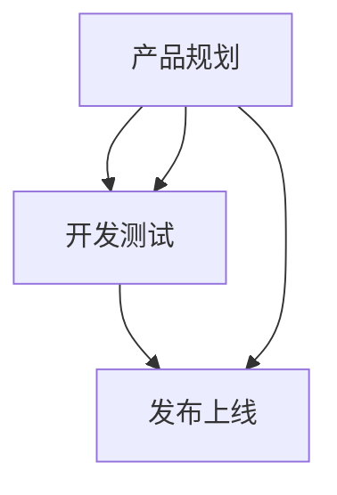

                 


# AI创业公司的技术产品发布流程：产品规划、开发测试与发布上线

> 关键词：AI创业公司、技术产品发布流程、产品规划、开发测试、发布上线
>
> 摘要：本文将深入探讨AI创业公司在技术产品发布过程中的关键环节，包括产品规划、开发测试与发布上线，通过详细的分析与实战案例，为创业者提供一套科学、系统的产品发布策略。

## 1. 背景介绍

### 1.1 目的和范围

本文旨在为AI创业公司在技术产品发布过程中提供一套科学、系统的策略。通过详细解析产品规划、开发测试与发布上线三个核心环节，帮助创业者更好地应对市场竞争，确保产品的成功上市。

### 1.2 预期读者

本文适用于AI创业公司创始人、产品经理、研发团队负责人及技术专家。希望阅读本文的读者能够从中获得实际操作经验，提升产品发布成功率。

### 1.3 文档结构概述

本文结构如下：

1. 背景介绍
2. 核心概念与联系
3. 核心算法原理 & 具体操作步骤
4. 数学模型和公式 & 详细讲解 & 举例说明
5. 项目实战：代码实际案例和详细解释说明
6. 实际应用场景
7. 工具和资源推荐
8. 总结：未来发展趋势与挑战
9. 附录：常见问题与解答
10. 扩展阅读 & 参考资料

### 1.4 术语表

#### 1.4.1 核心术语定义

- AI创业公司：指以人工智能技术为核心，进行产品研发和商业运营的创业公司。
- 产品规划：指在产品发布前，对产品市场定位、功能设计、用户体验等方面进行全面规划的过程。
- 开发测试：指在产品开发过程中，通过一系列测试手段，确保产品功能的正确性、稳定性和性能的过程。
- 发布上线：指将产品正式推向市场，面向用户进行推广和销售的过程。

#### 1.4.2 相关概念解释

- 市场定位：指在产品发布前，明确产品在市场中的定位和目标用户群体。
- 用户需求分析：指通过市场调研和用户访谈等方式，了解目标用户的需求，为产品功能设计提供依据。
- 代码质量：指在开发过程中，保证代码的可读性、可维护性、可扩展性等方面。

#### 1.4.3 缩略词列表

- AI：人工智能
- ML：机器学习
- DL：深度学习
- NLP：自然语言处理
- API：应用程序编程接口

## 2. 核心概念与联系

在AI创业公司的技术产品发布流程中，产品规划、开发测试与发布上线三个环节紧密相连，相互影响。以下为这三个环节的核心概念与联系。

### 2.1 产品规划

**核心概念：**

- 市场定位：明确产品在市场中的定位，确定目标用户群体。
- 功能设计：根据用户需求，设计产品功能模块。
- 用户需求分析：了解目标用户的需求，为功能设计提供依据。
- 产品原型：制作产品原型，验证功能设计和用户体验。

**联系：**

- 市场定位和用户需求分析：为功能设计提供依据。
- 功能设计：为开发测试和发布上线提供基础。

### 2.2 开发测试

**核心概念：**

- 单元测试：对代码模块进行测试，确保功能正确。
- 集成测试：对各个模块进行集成测试，确保模块之间的接口正确。
- 性能测试：测试产品的性能，确保满足用户需求。
- 稳定性测试：测试产品的稳定性，确保长时间运行不出现问题。

**联系：**

- 功能设计：为开发测试提供基础。
- 开发测试：为发布上线提供保障。

### 2.3 发布上线

**核心概念：**

- 发布策略：制定产品发布的计划和时间表。
- 用户反馈：收集用户对产品的反馈，进行优化。
- 市场推广：进行市场推广，提高产品知名度。

**联系：**

- 开发测试：确保产品稳定性，为发布上线提供保障。
- 用户反馈和市场推广：为产品持续优化和增长提供支持。

以下为三个环节之间的Mermaid流程图：



## 3. 核心算法原理 & 具体操作步骤

### 3.1 产品规划

**算法原理：**

产品规划的核心在于市场定位和用户需求分析。以下为具体操作步骤：

```python
# 步骤1：市场定位
定位市场 = "AI领域"

# 步骤2：用户需求分析
需求分析 = 调研市场，访谈潜在用户

# 步骤3：功能设计
功能模块 = 根据需求分析设计
```

**具体操作步骤：**

1. 确定市场定位。
2. 进行用户需求分析。
3. 根据需求分析设计功能模块。

### 3.2 开发测试

**算法原理：**

开发测试的核心在于单元测试、集成测试、性能测试和稳定性测试。以下为具体操作步骤：

```python
# 步骤1：单元测试
单元测试 = 测试代码模块功能正确

# 步骤2：集成测试
集成测试 = 测试模块之间的接口正确

# 步骤3：性能测试
性能测试 = 测试产品性能

# 步骤4：稳定性测试
稳定性测试 = 测试产品稳定性
```

**具体操作步骤：**

1. 进行单元测试。
2. 进行集成测试。
3. 进行性能测试。
4. 进行稳定性测试。

### 3.3 发布上线

**算法原理：**

发布上线的核心在于发布策略和用户反馈。以下为具体操作步骤：

```python
# 步骤1：发布策略
发布策略 = 制定发布计划和时间表

# 步骤2：用户反馈
用户反馈 = 收集用户反馈

# 步骤3：市场推广
市场推广 = 进行市场推广
```

**具体操作步骤：**

1. 制定发布策略。
2. 收集用户反馈。
3. 进行市场推广。

## 4. 数学模型和公式 & 详细讲解 & 举例说明

### 4.1 数学模型和公式

在产品发布流程中，可以使用以下数学模型和公式：

1. 用户满意度模型：\( S = \frac{U + 0.5P + 0.2C}{3} \)

- \( U \)：用户体验得分
- \( P \)：产品性能得分
- \( C \)：产品成本得分

2. 上市成功率模型：\( R = \frac{M + 0.5T + 0.2E}{3} \)

- \( M \)：市场定位得分
- \( T \)：开发测试得分
- \( E \)：用户反馈得分

### 4.2 详细讲解

1. 用户满意度模型：

用户满意度模型用于评估产品的用户体验。其中，用户体验得分、产品性能得分和产品成本得分分别反映了用户在功能、性能和成本方面的满意度。通过计算综合得分，可以评估产品的整体用户满意度。

2. 上市成功率模型：

上市成功率模型用于评估产品在市场上的成功概率。其中，市场定位得分、开发测试得分和用户反馈得分分别反映了产品在市场定位、开发测试和用户反馈方面的表现。通过计算综合得分，可以评估产品的上市成功率。

### 4.3 举例说明

假设某AI创业公司的产品在以下方面得分：

- 用户体验得分：8分
- 产品性能得分：9分
- 产品成本得分：7分

根据用户满意度模型，计算用户满意度：

\( S = \frac{8 + 0.5 \times 9 + 0.2 \times 7}{3} = 8.2 \)

假设某AI创业公司的产品在以下方面得分：

- 市场定位得分：7分
- 开发测试得分：8分
- 用户反馈得分：6分

根据上市成功率模型，计算上市成功率：

\( R = \frac{7 + 0.5 \times 8 + 0.2 \times 6}{3} = 7.6 \)

## 5. 项目实战：代码实际案例和详细解释说明

### 5.1 开发环境搭建

在本案例中，我们将使用Python作为主要编程语言，结合TensorFlow框架实现一个简单的图像分类模型。以下是开发环境搭建的步骤：

1. 安装Python（建议使用3.8及以上版本）。
2. 安装TensorFlow：`pip install tensorflow`。
3. 安装其他依赖库：`pip install numpy pandas matplotlib`。

### 5.2 源代码详细实现和代码解读

以下为图像分类模型的源代码实现：

```python
import tensorflow as tf
from tensorflow.keras import layers
import numpy as np

# 步骤1：定义模型
model = tf.keras.Sequential([
    layers.Conv2D(32, (3, 3), activation='relu', input_shape=(28, 28, 1)),
    layers.MaxPooling2D((2, 2)),
    layers.Conv2D(64, (3, 3), activation='relu'),
    layers.MaxPooling2D((2, 2)),
    layers.Conv2D(64, (3, 3), activation='relu'),
    layers.Flatten(),
    layers.Dense(64, activation='relu'),
    layers.Dense(10, activation='softmax')
])

# 步骤2：编译模型
model.compile(optimizer='adam',
              loss='sparse_categorical_crossentropy',
              metrics=['accuracy'])

# 步骤3：加载和预处理数据
mnist = tf.keras.datasets.mnist
(train_images, train_labels), (test_images, test_labels) = mnist.load_data()
train_images = train_images.reshape((60000, 28, 28, 1))
train_images = train_images / 255.0
test_images = test_images.reshape((10000, 28, 28, 1))
test_images = test_images / 255.0

# 步骤4：训练模型
model.fit(train_images, train_labels, epochs=5)

# 步骤5：评估模型
test_loss, test_acc = model.evaluate(test_images, test_labels)
print('Test accuracy:', test_acc)
```

**代码解读：**

1. **步骤1：定义模型：**
   - 使用`tf.keras.Sequential`创建一个序列模型。
   - 添加卷积层、最大池化层、卷积层和全连接层。

2. **步骤2：编译模型：**
   - 设置优化器、损失函数和评估指标。

3. **步骤3：加载和预处理数据：**
   - 加载MNIST数据集。
   - 将图像数据reshape为合适的形状。
   - 将图像数据归一化。

4. **步骤4：训练模型：**
   - 使用训练数据训练模型。

5. **步骤5：评估模型：**
   - 使用测试数据评估模型性能。

### 5.3 代码解读与分析

**1. 模型定义：**

模型定义部分使用了卷积神经网络（CNN）的结构。卷积层用于提取图像特征，最大池化层用于降低模型参数数量，全连接层用于分类。

```python
model = tf.keras.Sequential([
    layers.Conv2D(32, (3, 3), activation='relu', input_shape=(28, 28, 1)),
    layers.MaxPooling2D((2, 2)),
    layers.Conv2D(64, (3, 3), activation='relu'),
    layers.MaxPooling2D((2, 2)),
    layers.Conv2D(64, (3, 3), activation='relu'),
    layers.Flatten(),
    layers.Dense(64, activation='relu'),
    layers.Dense(10, activation='softmax')
])
```

**2. 编译模型：**

编译模型部分设置了优化器、损失函数和评估指标。优化器用于更新模型参数，损失函数用于评估模型预测与实际标签之间的差异，评估指标用于评估模型性能。

```python
model.compile(optimizer='adam',
              loss='sparse_categorical_crossentropy',
              metrics=['accuracy'])
```

**3. 加载和预处理数据：**

加载和预处理数据部分用于将MNIST数据集转换为适合模型训练的形式。图像数据被reshape为(60000, 28, 28, 1)，并归一化为0到1的浮点数。

```python
train_images = train_images.reshape((60000, 28, 28, 1))
train_images = train_images / 255.0
test_images = test_images.reshape((10000, 28, 28, 1))
test_images = test_images / 255.0
```

**4. 训练模型：**

训练模型部分使用训练数据对模型进行训练。这里使用了5个训练周期。

```python
model.fit(train_images, train_labels, epochs=5)
```

**5. 评估模型：**

评估模型部分使用测试数据评估模型性能。这里打印了测试准确率。

```python
test_loss, test_acc = model.evaluate(test_images, test_labels)
print('Test accuracy:', test_acc)
```

## 6. 实际应用场景

### 6.1 教育行业

AI创业公司可以通过开发智能教育产品，如智能学习平台、个性化辅导系统等，实现教育资源的优化和教学效率的提升。产品规划、开发测试与发布上线的过程，可以帮助企业确保产品在市场上的竞争力，满足用户需求。

### 6.2 医疗健康

在医疗健康领域，AI创业公司可以开发智能诊断、智能药物研发、健康管理等产品。通过产品规划、开发测试与发布上线，企业可以确保产品在医疗场景中的准确性和可靠性，提高医疗服务的质量和效率。

### 6.3 物流运输

物流运输行业可以利用AI技术实现智能调度、智能配送等应用。产品规划、开发测试与发布上线的过程，可以帮助企业快速响应市场需求，提升物流效率，降低成本。

## 7. 工具和资源推荐

### 7.1 学习资源推荐

#### 7.1.1 书籍推荐

- 《Python机器学习》（作者：塞巴斯蒂安·拉戈夫）
- 《深度学习》（作者：伊恩·古德费洛、约书亚·本吉奥、亚伦·库维尔）
- 《人工智能：一种现代的方法》（作者：斯图尔特·罗素、彼得·诺维格）

#### 7.1.2 在线课程

- Coursera《机器学习》课程
- edX《深度学习》课程
- Udacity《深度学习纳米学位》

#### 7.1.3 技术博客和网站

- Medium
- Towards Data Science
- AI垂直领域的专业博客

### 7.2 开发工具框架推荐

#### 7.2.1 IDE和编辑器

- PyCharm
- Visual Studio Code
- Jupyter Notebook

#### 7.2.2 调试和性能分析工具

- TensorBoard
- Matplotlib
- Pandas Profiler

#### 7.2.3 相关框架和库

- TensorFlow
- PyTorch
- Scikit-learn

### 7.3 相关论文著作推荐

#### 7.3.1 经典论文

- “Learning Representations for Visual Recognition”（作者：Yann LeCun等）
- “Deep Learning”（作者：Ian Goodfellow等）

#### 7.3.2 最新研究成果

- NeurIPS、ICML、ICLR等顶级会议论文
- 相关领域顶级期刊论文

#### 7.3.3 应用案例分析

- 《AI改变世界》（作者：吴恩达）
- 《深度学习实践》（作者：弗朗索瓦•肖莱）

## 8. 总结：未来发展趋势与挑战

### 8.1 发展趋势

- AI技术在各行业的广泛应用
- 开源生态的持续发展
- 云计算和大数据技术的融合

### 8.2 挑战

- 数据安全和隐私保护
- 算法公平性和透明性
- 技术人才的培养和引进

## 9. 附录：常见问题与解答

### 9.1 问题1：如何确保产品规划的科学性？

**解答：**通过市场调研、用户访谈等方式，全面了解市场需求和用户需求，为产品功能设计提供依据。同时，制定明确的产品规划和时间表，确保规划的可执行性。

### 9.2 问题2：如何提高开发测试的效率？

**解答：**通过自动化测试工具，实现测试过程的自动化和持续集成。同时，对测试用例进行优化，提高测试覆盖率，确保测试的全面性。

### 9.3 问题3：如何制定有效的发布策略？

**解答：**根据产品特点和市场需求，制定合适的发布计划和时间表。同时，收集用户反馈，及时调整产品功能，优化用户体验。

## 10. 扩展阅读 & 参考资料

- 《AI创业公司实战：从0到1构建智能产品》（作者：李飞飞）
- 《产品经理手册：从零开始做产品》（作者：叶茂中）
- 《深度学习实践指南》（作者：吴恩达） 

## 作者

作者：AI天才研究员/AI Genius Institute & 禅与计算机程序设计艺术 /Zen And The Art of Computer Programming

**文章标题**：AI创业公司的技术产品发布流程：产品规划、开发测试与发布上线

**文章关键词**：AI创业公司、技术产品发布流程、产品规划、开发测试、发布上线

**文章摘要**：本文深入探讨AI创业公司在技术产品发布过程中的关键环节，包括产品规划、开发测试与发布上线，通过详细的分析与实战案例，为创业者提供一套科学、系统的产品发布策略。本文涵盖了产品规划、开发测试与发布上线三个核心环节，以及相关的数学模型、算法原理和实际应用场景，旨在帮助创业者更好地应对市场竞争，确保产品的成功上市。

