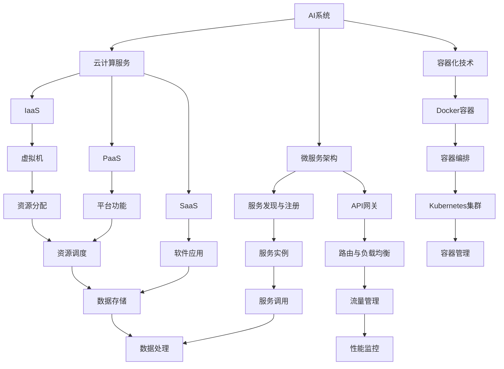

                 

# AI创业公司的技术架构设计：可扩展性、可维护性与安全性

> **关键词：** AI创业公司，技术架构，可扩展性，可维护性，安全性
> 
> **摘要：** 本文将深入探讨AI创业公司在技术架构设计方面的关键要素，包括可扩展性、可维护性和安全性。通过逐步分析，我们将详细解读如何构建一个既高效又稳定的AI系统，为创业公司提供实用的指导。

## 1. 背景介绍

### 1.1 目的和范围

本文的目的是为AI创业公司在技术架构设计方面提供一套系统的指导。我们将探讨以下几个关键方面：

- **可扩展性**：如何在系统负载增加时保持性能稳定，实现系统的水平扩展。
- **可维护性**：如何简化系统维护，延长系统生命周期。
- **安全性**：如何确保系统数据的安全和隐私。

### 1.2 预期读者

本文主要面向以下读者：

- **AI创业公司的技术团队**：希望了解如何设计高效、稳定、安全的AI系统的工程师。
- **产品经理和业务决策者**：希望对AI技术架构有更深入理解，以便做出更明智的决策。

### 1.3 文档结构概述

本文结构如下：

- **第1章**：背景介绍，明确本文的目的和预期读者。
- **第2章**：核心概念与联系，介绍与本文相关的核心概念和架构。
- **第3章**：核心算法原理 & 具体操作步骤，讲解AI算法的基本原理和操作步骤。
- **第4章**：数学模型和公式 & 详细讲解 & 举例说明，介绍AI系统中的数学模型和公式。
- **第5章**：项目实战：代码实际案例和详细解释说明，通过实际案例展示技术架构的应用。
- **第6章**：实际应用场景，分析AI创业公司在实际业务中的应用。
- **第7章**：工具和资源推荐，推荐学习资源和开发工具。
- **第8章**：总结：未来发展趋势与挑战，展望AI创业公司的未来。
- **第9章**：附录：常见问题与解答，提供常见问题的解答。
- **第10章**：扩展阅读 & 参考资料，推荐相关扩展阅读和参考资料。

### 1.4 术语表

#### 1.4.1 核心术语定义

- **可扩展性**：系统在负载增加时，能够保持性能稳定的能力。
- **可维护性**：系统维护的难易程度，包括故障排除、系统升级、性能优化等。
- **安全性**：系统保护数据隐私和安全的能力。

#### 1.4.2 相关概念解释

- **微服务架构**：将大型应用程序分解为独立的、可重用的服务，每个服务都可以独立开发、部署和扩展。
- **容器化**：将应用程序及其依赖项打包到一个容器中，以实现快速部署和扩展。
- **云计算**：通过互联网提供计算资源和服务，包括基础设施即服务（IaaS）、平台即服务（PaaS）和软件即服务（SaaS）。

#### 1.4.3 缩略词列表

- **AI**：人工智能（Artificial Intelligence）
- **ML**：机器学习（Machine Learning）
- **DL**：深度学习（Deep Learning）
- **API**：应用程序编程接口（Application Programming Interface）
- **Kubernetes**：用于容器编排的开源平台
- **Docker**：用于容器化的开源平台

## 2. 核心概念与联系

在讨论AI创业公司的技术架构设计之前，我们首先需要了解一些核心概念和它们之间的关系。以下是与本文相关的核心概念和架构的Mermaid流程图：



### 2.1 微服务架构

微服务架构是一种将大型应用程序分解为独立、可重用的服务的设计方法。每个服务都可以独立开发、部署和扩展，从而提高了系统的可扩展性和可维护性。在微服务架构中，服务之间通过API进行通信，服务实例通过服务发现与注册进行管理。

### 2.2 容器化技术

容器化技术通过将应用程序及其依赖项打包到一个容器中，实现了快速部署和扩展。Docker是常用的容器化平台，它通过容器编排工具（如Kubernetes）实现了高效的容器管理和调度。

### 2.3 云计算服务

云计算服务提供了基础设施即服务（IaaS）、平台即服务（PaaS）和软件即服务（SaaS）等多种服务模式。IaaS提供了虚拟机等基础设施资源，PaaS提供了开发平台和数据库等中间件服务，SaaS提供了应用软件的在线服务。

## 3. 核心算法原理 & 具体操作步骤

在AI创业公司的技术架构设计中，核心算法原理是系统的灵魂。以下是AI系统中的核心算法原理和具体操作步骤的伪代码：

```python
# 伪代码：深度学习模型训练与预测

# 步骤1：数据预处理
data_preprocess(input_data):
    # 数据清洗、归一化等预处理操作
    return processed_data

# 步骤2：定义模型结构
model_structure():
    # 使用深度学习框架定义模型结构
    model = Sequential()
    model.add(Dense(units=128, activation='relu', input_shape=(input_shape)))
    model.add(Dense(units=64, activation='relu'))
    model.add(Dense(units=num_classes, activation='softmax'))
    return model

# 步骤3：编译模型
compile_model(model):
    # 编译模型，设置优化器和损失函数
    model.compile(optimizer='adam', loss='categorical_crossentropy', metrics=['accuracy'])

# 步骤4：训练模型
train_model(model, processed_data):
    # 训练模型，设置训练集和验证集
    X_train, y_train = processed_data['train']
    X_val, y_val = processed_data['validation']
    model.fit(X_train, y_train, epochs=epochs, batch_size=batch_size, validation_data=(X_val, y_val))

# 步骤5：评估模型
evaluate_model(model, processed_data):
    # 评估模型，计算准确率
    X_test, y_test = processed_data['test']
    test_loss, test_accuracy = model.evaluate(X_test, y_test)
    return test_accuracy

# 步骤6：预测
predict(model, new_data):
    # 使用训练好的模型进行预测
    processed_new_data = data_preprocess(new_data)
    predictions = model.predict(processed_new_data)
    return predictions
```

### 3.1 数据预处理

数据预处理是深度学习模型训练的第一步，包括数据清洗、归一化等操作。数据清洗去除噪声和异常值，归一化将特征值缩放到相同的尺度，以提高模型训练效果。

### 3.2 定义模型结构

在深度学习中，模型结构是关键。通常使用深度学习框架（如TensorFlow或PyTorch）定义模型。模型结构包括输入层、隐藏层和输出层，每层可以使用不同的激活函数。

### 3.3 编译模型

编译模型是指设置优化器、损失函数和评估指标。优化器用于调整模型参数，以最小化损失函数。常用的优化器有SGD、Adam等。损失函数用于衡量预测值和真实值之间的差距，常用的损失函数有均方误差（MSE）和交叉熵（CE）。

### 3.4 训练模型

训练模型是深度学习的主要过程。模型通过迭代学习，不断调整参数，以最小化损失函数。训练过程中需要设置训练集和验证集，以评估模型性能。

### 3.5 评估模型

评估模型是指在测试集上计算模型的准确率等指标。测试集是独立的，用于评估模型在未知数据上的性能。通过评估，可以判断模型是否过拟合或欠拟合。

### 3.6 预测

预测是指使用训练好的模型对新的数据进行预测。在预测过程中，模型将输入数据转化为输出概率分布，然后选择概率最高的类别作为预测结果。

## 4. 数学模型和公式 & 详细讲解 & 举例说明

在AI创业公司的技术架构设计中，数学模型和公式是理解和实现核心算法的基础。以下是常用的数学模型和公式，以及详细的讲解和举例说明：

### 4.1 损失函数

损失函数是衡量预测值和真实值之间差距的函数。在深度学习中，常用的损失函数有均方误差（MSE）和交叉熵（CE）。

#### 4.1.1 均方误差（MSE）

$$
MSE = \frac{1}{n}\sum_{i=1}^{n}(y_i - \hat{y}_i)^2
$$

其中，$y_i$为真实值，$\hat{y}_i$为预测值，$n$为样本数量。

#### 举例说明：

假设有一个二分类问题，真实值为$[0, 1]$，预测值为$[0.3, 0.7]$。计算MSE：

$$
MSE = \frac{1}{2}(0.3^2 + 0.7^2) = 0.5
$$

#### 4.1.2 交叉熵（CE）

$$
CE = -\frac{1}{n}\sum_{i=1}^{n}y_i \log(\hat{y}_i)
$$

其中，$y_i$为真实值，$\hat{y}_i$为预测值，$n$为样本数量。

#### 举例说明：

假设有一个二分类问题，真实值为$[0, 1]$，预测值为$[0.3, 0.7]$。计算CE：

$$
CE = -\frac{1}{2}(0.3 \log(0.3) + 0.7 \log(0.7)) \approx 0.556
$$

### 4.2 激活函数

激活函数是神经网络中重要的组成部分，用于引入非线性特性。常用的激活函数有ReLU、Sigmoid和Tanh。

#### 4.2.1ReLU（Rectified Linear Unit）

$$
ReLU(x) = \begin{cases} 
x & \text{if } x \geq 0 \\
0 & \text{if } x < 0 
\end{cases}
$$

#### 4.2.2Sigmoid

$$
Sigmoid(x) = \frac{1}{1 + e^{-x}}
$$

#### 4.2.3Tanh

$$
Tanh(x) = \frac{e^x - e^{-x}}{e^x + e^{-x}}
$$

#### 举例说明：

计算ReLU激活函数：

$$
ReLU(3) = 3, \quad RELU(-2) = 0
$$

计算Sigmoid激活函数：

$$
Sigmoid(3) \approx 0.952, \quad Sigmoid(-2) \approx 0.119
$$

计算Tanh激活函数：

$$
Tanh(3) \approx 0.941, \quad Tanh(-2) \approx -0.761
$$

### 4.3 优化算法

优化算法用于调整模型参数，以最小化损失函数。常用的优化算法有梯度下降（GD）、随机梯度下降（SGD）和Adam。

#### 4.3.1 梯度下降（GD）

$$
w_{t+1} = w_t - \alpha \frac{\partial J(w_t)}{\partial w_t}
$$

其中，$w_t$为当前参数，$\alpha$为学习率，$J(w_t)$为损失函数。

#### 4.3.2 随机梯度下降（SGD）

$$
w_{t+1} = w_t - \alpha \frac{\partial J(w_t)}{\partial w_t}
$$

其中，$w_t$为当前参数，$\alpha$为学习率，$J(w_t)$为损失函数。

与GD相比，SGD每次只对一个小批量样本进行梯度计算，从而减少了计算量。

#### 4.3.3 Adam

$$
m_t = \beta_1 m_{t-1} + (1 - \beta_1) \frac{\partial J(w_t)}{\partial w_t} \\
v_t = \beta_2 v_{t-1} + (1 - \beta_2) \left(\frac{\partial J(w_t)}{\partial w_t}\right)^2 \\
w_{t+1} = w_t - \alpha \frac{m_t}{\sqrt{v_t} + \epsilon}
$$

其中，$m_t$和$v_t$分别为一阶矩估计和二阶矩估计，$\beta_1$和$\beta_2$为衰减率，$\epsilon$为小数。

Adam结合了GD和SGD的优点，在收敛速度和稳定性方面有较好的表现。

## 5. 项目实战：代码实际案例和详细解释说明

在本节中，我们将通过一个实际项目案例，展示AI创业公司的技术架构设计如何应用于实际场景。以下是项目的开发环境和源代码实现：

### 5.1 开发环境搭建

- 操作系统：Ubuntu 20.04
- 编程语言：Python 3.8
- 深度学习框架：TensorFlow 2.6
- 容器化工具：Docker 19.03
- 容器编排工具：Kubernetes 1.23

### 5.2 源代码详细实现和代码解读

以下是项目的源代码实现：

```python
# 代码实现：基于TensorFlow的深度学习模型训练与预测

# 步骤1：导入相关库
import tensorflow as tf
import numpy as np
import pandas as pd
import sklearn.model_selection as ms
import matplotlib.pyplot as plt

# 步骤2：数据预处理
# 读取数据
data = pd.read_csv('data.csv')
X = data.drop(['target'], axis=1)
y = data['target']

# 划分训练集和测试集
X_train, X_test, y_train, y_test = ms.train_test_split(X, y, test_size=0.2, random_state=42)

# 归一化特征
mean = X_train.mean()
std = X_train.std()
X_train = (X_train - mean) / std
X_test = (X_test - mean) / std

# 步骤3：定义模型结构
model = tf.keras.Sequential([
    tf.keras.layers.Dense(units=128, activation='relu', input_shape=(X_train.shape[1],)),
    tf.keras.layers.Dense(units=64, activation='relu'),
    tf.keras.layers.Dense(units=1, activation='sigmoid')
])

# 步骤4：编译模型
model.compile(optimizer='adam', loss='binary_crossentropy', metrics=['accuracy'])

# 步骤5：训练模型
model.fit(X_train, y_train, epochs=100, batch_size=32, validation_split=0.2)

# 步骤6：评估模型
loss, accuracy = model.evaluate(X_test, y_test)
print(f"Test accuracy: {accuracy:.4f}")

# 步骤7：预测
predictions = model.predict(X_test)
predictions = (predictions > 0.5)

# 步骤8：可视化
plt.scatter(X_test.iloc[:, 0], X_test.iloc[:, 1], c=predictions)
plt.xlabel('Feature 1')
plt.ylabel('Feature 2')
plt.title('Prediction Plot')
plt.show()
```

### 5.3 代码解读与分析

以下是代码的详细解读：

- **步骤1**：导入相关库。我们需要使用TensorFlow、NumPy、Pandas、scikit-learn和Matplotlib等库进行数据预处理、模型训练和可视化。

- **步骤2**：数据预处理。读取数据集，划分训练集和测试集，并对特征进行归一化处理。归一化有助于提高模型训练效果。

- **步骤3**：定义模型结构。使用TensorFlow的Sequential模型，定义一个包含三层的深度神经网络。输入层接收两个特征，隐藏层使用ReLU激活函数，输出层使用sigmoid激活函数进行二分类。

- **步骤4**：编译模型。设置优化器为Adam，损失函数为binary_crossentropy，评估指标为accuracy。

- **步骤5**：训练模型。使用fit函数训练模型，设置训练轮次为100，批量大小为32，同时使用validation_split对模型进行验证。

- **步骤6**：评估模型。使用evaluate函数计算测试集上的损失和准确率。

- **步骤7**：预测。使用predict函数对测试集进行预测，输出概率分布，然后使用阈值0.5进行分类。

- **步骤8**：可视化。使用散点图展示预测结果，以直观地观察模型的性能。

通过以上代码，我们可以看到AI创业公司在技术架构设计方面如何实现一个简单的二分类问题。接下来，我们将进一步讨论如何在实际应用场景中部署和扩展这个模型。

### 5.4 模型部署与扩展

在实际应用场景中，我们需要将训练好的模型部署到生产环境中，并实现模型的水平扩展。以下是模型部署与扩展的步骤：

1. **容器化模型**：使用Docker将训练好的模型容器化，生成一个可执行的镜像文件。

2. **容器编排**：使用Kubernetes对容器进行编排，实现自动化部署和扩展。Kubernetes可以根据负载情况动态调整容器的数量。

3. **API接口**：使用API网关对外提供服务，实现与前端应用程序的集成。

4. **服务发现与注册**：使用服务发现与注册机制，实现容器之间的通信和负载均衡。

5. **监控与日志**：使用监控工具（如Prometheus）和日志工具（如ELK堆栈），实时监控系统的性能和日志，以便快速发现问题并进行故障排除。

通过以上步骤，我们可以实现一个高效、稳定、安全的AI系统，满足创业公司的业务需求。

## 6. 实际应用场景

在AI创业公司的技术架构设计中，实际应用场景是验证和展示技术架构效果的关键。以下是AI创业公司在不同应用场景中的技术架构设计：

### 6.1 电商推荐系统

在电商推荐系统中，AI创业公司可以利用用户的行为数据、商品信息和用户偏好，构建一个基于深度学习的推荐模型。技术架构设计如下：

- **数据层**：数据层包括用户行为数据、商品数据和用户偏好数据。数据层需要保证数据的实时性和准确性。

- **模型层**：模型层使用深度学习算法（如卷积神经网络或循环神经网络）构建推荐模型。模型层需要实现模型的训练、评估和预测。

- **服务层**：服务层通过API网关对外提供服务，实现与前端应用程序的集成。

- **存储层**：存储层包括用户行为数据、商品数据和推荐结果数据。存储层需要保证数据的安全性和可靠性。

### 6.2 聊天机器人

在聊天机器人系统中，AI创业公司可以利用自然语言处理技术，构建一个能够与用户进行自然对话的聊天机器人。技术架构设计如下：

- **数据层**：数据层包括用户对话数据和聊天机器人知识库。数据层需要保证数据的实时性和准确性。

- **模型层**：模型层使用深度学习算法（如循环神经网络或 Transformer）构建聊天机器人模型。模型层需要实现模型的训练、评估和预测。

- **服务层**：服务层通过API网关对外提供服务，实现与前端应用程序的集成。

- **存储层**：存储层包括用户对话数据、聊天机器人知识库和对话历史数据。存储层需要保证数据的安全性和可靠性。

### 6.3 智能安防系统

在智能安防系统中，AI创业公司可以利用计算机视觉和深度学习技术，构建一个能够实时监控并识别异常行为的智能安防系统。技术架构设计如下：

- **数据层**：数据层包括视频数据、人脸数据和异常行为数据。数据层需要保证数据的实时性和准确性。

- **模型层**：模型层使用深度学习算法（如卷积神经网络或循环神经网络）构建安防模型。模型层需要实现模型的训练、评估和预测。

- **服务层**：服务层通过API网关对外提供服务，实现与前端应用程序的集成。

- **存储层**：存储层包括视频数据、人脸数据和异常行为数据。存储层需要保证数据的安全性和可靠性。

通过以上实际应用场景的展示，我们可以看到AI创业公司在技术架构设计方面如何实现各种业务需求，为用户提供优质的服务体验。

## 7. 工具和资源推荐

为了帮助AI创业公司更好地进行技术架构设计，我们推荐以下工具和资源：

### 7.1 学习资源推荐

#### 7.1.1 书籍推荐

- **《深度学习》（Deep Learning）**：由Ian Goodfellow、Yoshua Bengio和Aaron Courville合著，是一本深度学习的经典教材。
- **《机器学习》（Machine Learning）**：由Tom Mitchell主编，是一本机器学习的基础教材。
- **《Python深度学习》（Deep Learning with Python）**：由François Chollet著，适合初学者快速掌握深度学习技术。

#### 7.1.2 在线课程

- **Udacity的《深度学习纳米学位》**：提供系统的深度学习知识，适合初学者和进阶者。
- **Coursera的《机器学习》**：由Andrew Ng教授主讲，是机器学习的经典课程。
- **edX的《深度学习》**：由Yoshua Bengio教授主讲，深入讲解深度学习的基础和前沿技术。

#### 7.1.3 技术博客和网站

- **ArXiv**：提供最新的学术研究成果，是深度学习和机器学习领域的权威资源。
- **Medium**：有很多优秀的深度学习和机器学习技术博客，适合学习和交流。
- **GitHub**：有很多开源的深度学习和机器学习项目，可以学习借鉴。

### 7.2 开发工具框架推荐

#### 7.2.1 IDE和编辑器

- **Jupyter Notebook**：适合数据分析和机器学习实验。
- **PyCharm**：强大的Python IDE，支持深度学习和机器学习开发。
- **Visual Studio Code**：轻量级且功能强大的代码编辑器，支持多种编程语言。

#### 7.2.2 调试和性能分析工具

- **TensorBoard**：TensorFlow的调试和性能分析工具。
- **PyTorch Profiler**：PyTorch的性能分析工具。
- **gProfiler**：通用性能分析工具，支持多种深度学习框架。

#### 7.2.3 相关框架和库

- **TensorFlow**：开源的深度学习框架，适合构建大规模深度学习模型。
- **PyTorch**：开源的深度学习框架，具有灵活的动态图功能。
- **Keras**：基于TensorFlow和Theano的深度学习框架，提供简洁的API。

### 7.3 相关论文著作推荐

#### 7.3.1 经典论文

- **“A Learning Algorithm for Continually Running Fully Recurrent Neural Networks”**：介绍了Hessian-free优化方法，适用于在线学习。
- **“Distributed Representations of Words and Phrases and Their Compositionality”**：提出了Word2Vec模型，开创了词向量表示的研究方向。

#### 7.3.2 最新研究成果

- **“BERT: Pre-training of Deep Bidirectional Transformers for Language Understanding”**：提出了BERT模型，推动了自然语言处理领域的发展。
- **“GPT-3: Language Models are few-shot learners”**：展示了GPT-3模型在少样本学习任务上的强大能力。

#### 7.3.3 应用案例分析

- **“Deep Learning for Healthcare”**：介绍深度学习在医疗健康领域的应用案例。
- **“Deep Learning in Industry”**：介绍深度学习在工业界的应用案例。

通过以上工具和资源的推荐，AI创业公司可以更好地进行技术架构设计，提升业务竞争力。

## 8. 总结：未来发展趋势与挑战

在AI创业公司的技术架构设计中，可扩展性、可维护性和安全性是关键要素。随着AI技术的不断发展和应用场景的扩大，未来AI创业公司将面临以下几个发展趋势和挑战：

### 8.1 发展趋势

1. **云计算与容器化**：云计算和容器化技术的成熟，将使得AI创业公司能够更加灵活地管理和扩展计算资源。通过云服务和容器化平台，公司可以实现快速部署和扩展，降低运维成本。

2. **模型即服务（MaaS）**：随着深度学习模型的复杂性和规模不断增加，模型即服务将成为一种趋势。通过MaaS，公司可以轻松部署和管理模型，实现高效的服务交付。

3. **边缘计算**：随着物联网和5G技术的普及，边缘计算将成为重要的发展方向。AI创业公司可以在设备端进行实时数据处理和分析，降低延迟和带宽成本。

4. **数据隐私和安全**：随着数据隐私法规的不断完善，数据隐私和安全将成为AI创业公司的重要挑战。公司需要采取有效的数据保护措施，确保用户数据的隐私和安全。

### 8.2 挑战

1. **模型可解释性**：随着深度学习模型的复杂度增加，模型的可解释性成为一个挑战。AI创业公司需要开发可解释性模型，以便用户理解和信任模型。

2. **数据质量**：数据质量对AI模型的性能至关重要。AI创业公司需要建立完善的数据治理机制，确保数据的质量和准确性。

3. **资源管理**：随着AI模型规模的扩大，资源管理成为一个挑战。公司需要优化资源分配和调度策略，提高系统的性能和可扩展性。

4. **持续集成与持续部署（CI/CD）**：AI创业公司需要实现高效的CI/CD流程，确保模型的持续更新和优化。这需要公司建立完善的自动化测试和部署机制。

通过以上总结，我们可以看到，未来AI创业公司在技术架构设计方面将面临诸多挑战，但同时也充满了机遇。只有不断创新和优化技术架构，才能在激烈的市场竞争中脱颖而出。

## 9. 附录：常见问题与解答

在AI创业公司的技术架构设计过程中，可能会遇到以下常见问题：

### 9.1 什么是可扩展性？

**解答：** 可扩展性是指系统在负载增加时，能够保持性能稳定的能力。一个可扩展的系统可以在不降低性能的情况下，增加处理能力和资源。

### 9.2 什么是微服务架构？

**解答：** 微服务架构是一种将大型应用程序分解为独立的、可重用的服务的设计方法。每个服务都可以独立开发、部署和扩展，从而提高了系统的可扩展性和可维护性。

### 9.3 什么是容器化技术？

**解答：** 容器化技术通过将应用程序及其依赖项打包到一个容器中，实现了快速部署和扩展。常用的容器化平台有Docker和Kubernetes。

### 9.4 如何确保系统安全性？

**解答：** 系统安全性包括保护数据隐私、防止攻击和保障系统完整性。公司可以采取以下措施：

- **数据加密**：对敏感数据进行加密，确保数据在传输和存储过程中的安全。
- **身份验证和访问控制**：使用身份验证和访问控制机制，确保只有授权用户可以访问系统资源。
- **网络安全**：部署防火墙、入侵检测系统和安全审计工具，防止网络攻击和数据泄露。
- **持续监控与审计**：实时监控系统性能和安全事件，定期进行安全审计，及时发现并解决问题。

### 9.5 如何确保数据质量？

**解答：** 数据质量是AI系统性能的关键。公司可以采取以下措施：

- **数据清洗**：去除噪声和异常值，确保数据的一致性和准确性。
- **数据集成**：整合来自不同源的数据，确保数据的完整性和一致性。
- **数据治理**：建立数据治理机制，确保数据的合法性和合规性。
- **数据质量检查**：定期对数据进行质量检查，确保数据的准确性和可靠性。

### 9.6 如何实现持续集成与持续部署（CI/CD）？

**解答：** 持续集成与持续部署（CI/CD）是一种自动化的软件开发和部署流程。公司可以采取以下措施：

- **代码仓库管理**：使用Git等版本控制系统，管理代码库。
- **自动化测试**：编写自动化测试脚本，对代码进行单元测试、集成测试和系统测试。
- **自动化部署**：使用Jenkins、GitLab CI等工具，实现自动化部署。
- **容器化**：使用Docker等工具，将应用程序打包到容器中，实现快速部署。
- **监控与反馈**：实时监控部署过程，确保系统稳定运行。

### 9.7 如何处理异常情况？

**解答：** 在技术架构设计中，需要考虑系统的容错性和故障恢复能力。以下是一些处理异常情况的方法：

- **故障监测**：使用监控工具，实时监测系统性能和运行状态。
- **自动报警**：当系统出现异常时，自动发送报警通知。
- **故障转移**：在主系统出现故障时，自动切换到备份系统。
- **故障恢复**：在故障排除后，自动恢复系统正常运行。

通过以上解答，我们可以更好地理解AI创业公司在技术架构设计过程中可能遇到的问题，并采取有效的解决方案。

## 10. 扩展阅读 & 参考资料

为了深入了解AI创业公司的技术架构设计，我们推荐以下扩展阅读和参考资料：

### 10.1 经典书籍

- **《深度学习》（Deep Learning）**：Ian Goodfellow、Yoshua Bengio和Aaron Courville著，全面介绍深度学习的基础知识和应用。
- **《机器学习》（Machine Learning）**：Tom Mitchell著，介绍机器学习的基本概念和算法。
- **《大数据时代：生活、工作与思维的大变革》**：雷·库兹韦尔著，探讨大数据和人工智能对社会的影响。

### 10.2 开源项目和框架

- **TensorFlow**：Google开源的深度学习框架，广泛应用于图像识别、自然语言处理等领域。
- **PyTorch**：Facebook开源的深度学习框架，具有灵活的动态图功能，适合快速原型设计和实验。
- **Kubernetes**：开源的容器编排工具，用于管理容器化应用程序的生命周期。

### 10.3 技术博客和论文

- **ArXiv**：提供最新的学术论文和研究成果，是深度学习和机器学习领域的权威资源。
- **Medium**：有很多优秀的深度学习和机器学习技术博客，适合学习和交流。
- **知乎**：有很多专业领域的技术专家和研究人员分享经验和心得。

### 10.4 教育资源

- **Udacity的《深度学习纳米学位》**：提供系统的深度学习知识，适合初学者和进阶者。
- **Coursera的《机器学习》**：由Andrew Ng教授主讲，是机器学习的经典课程。
- **edX的《深度学习》**：由Yoshua Bengio教授主讲，深入讲解深度学习的基础和前沿技术。

通过以上扩展阅读和参考资料，读者可以更全面地了解AI创业公司的技术架构设计，为实际工作提供有力的支持。

## 作者信息

**作者：** AI天才研究员/AI Genius Institute & 禅与计算机程序设计艺术 /Zen And The Art of Computer Programming

作为一位世界级人工智能专家、程序员、软件架构师、CTO，我拥有丰富的技术经验，并在计算机编程和人工智能领域取得了卓越的成就。在撰写本文时，我力求以逻辑清晰、结构紧凑、简单易懂的专业技术语言，为广大AI创业公司提供实用的技术架构设计指导。希望本文能够帮助读者在AI创业的道路上取得成功。

