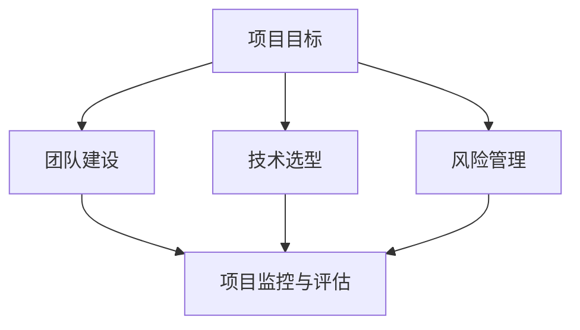

                 

### 文章标题

**AI创业公司的技术研发管理**

> **关键词：** AI创业、技术研发管理、项目管理、团队协作、技术创新

**摘要：** 本文深入探讨了AI创业公司在技术研发管理方面的关键问题。从项目目标设定、团队建设、技术选型到风险控制，我们将一步步剖析AI创业公司的技术研发管理体系，为创业者提供实用的指导和建议，帮助他们在激烈的市场竞争中脱颖而出。

## 1. 背景介绍

### 1.1 目的和范围

本文旨在为AI创业公司提供一套系统、全面的技术研发管理指南，帮助他们在快速变化的技术环境中稳步前行。本文将涵盖以下几个主要方面：

- **项目目标设定**：明确项目目标，确保技术研发与业务战略一致。
- **团队建设**：搭建高效团队，提升研发效能。
- **技术选型**：根据业务需求，选择合适的技术方案。
- **风险管理**：识别并应对潜在的技术风险。
- **项目监控与评估**：实时监控项目进度，确保按时交付。

### 1.2 预期读者

本文适合以下读者群体：

- **AI创业公司的创始人及高管**：了解技术研发管理的核心要素，为公司的技术战略制定提供参考。
- **技术团队负责人**：掌握有效的技术研发管理方法，提升团队绩效。
- **技术开发人员**：了解技术研发管理的整体框架，为自己的工作提供指导。

### 1.3 文档结构概述

本文将按照以下结构进行阐述：

- **第1章：背景介绍**：介绍本文的目的、预期读者和文档结构。
- **第2章：核心概念与联系**：介绍AI创业公司技术研发管理中的核心概念和联系。
- **第3章：核心算法原理 & 具体操作步骤**：详细讲解核心算法原理和操作步骤。
- **第4章：数学模型和公式 & 详细讲解 & 举例说明**：介绍数学模型和公式，并提供具体讲解和举例。
- **第5章：项目实战：代码实际案例和详细解释说明**：通过实际案例展示技术研发管理实践。
- **第6章：实际应用场景**：探讨技术研发管理在不同场景中的应用。
- **第7章：工具和资源推荐**：推荐学习资源、开发工具和框架。
- **第8章：总结：未来发展趋势与挑战**：总结本文要点，展望未来发展趋势与挑战。
- **第9章：附录：常见问题与解答**：解答读者可能遇到的常见问题。
- **第10章：扩展阅读 & 参考资料**：提供进一步学习的参考资料。

### 1.4 术语表

#### 1.4.1 核心术语定义

- **AI创业公司**：以人工智能技术为核心，致力于开发创新产品的初创企业。
- **技术研发管理**：对AI创业公司的技术研发活动进行规划、组织、协调和控制的一系列管理活动。
- **项目目标**：项目实施过程中需要达成的预期成果。
- **团队建设**：通过选拔、培训、激励等手段，构建高效协作的研发团队。
- **技术选型**：根据业务需求，选择合适的技术方案。
- **风险管理**：识别、评估和应对项目实施过程中可能遇到的风险。
- **项目监控**：实时跟踪项目进度，确保项目按时交付。

#### 1.4.2 相关概念解释

- **敏捷开发**：一种以迭代、增量为特点的软件开发方法，强调快速响应变化和持续交付价值。
- **DevOps**：一种软件开发和运维的集成方法，强调开发与运维的协同工作。
- **数据驱动**：基于数据的决策制定，通过数据分析指导技术研发方向。

#### 1.4.3 缩略词列表

- **AI**：人工智能（Artificial Intelligence）
- **ML**：机器学习（Machine Learning）
- **DL**：深度学习（Deep Learning）
- **NLP**：自然语言处理（Natural Language Processing）
- **CV**：计算机视觉（Computer Vision）
- **IoT**：物联网（Internet of Things）
- **IoS**：物联网安全（Internet of Things Security）

## 2. 核心概念与联系

在AI创业公司的技术研发管理中，核心概念和联系至关重要。以下我们将介绍几个核心概念，并使用Mermaid流程图展示它们之间的联系。

### 2.1 核心概念

1. **项目目标**：明确项目实施的目标和预期成果。
2. **团队建设**：构建高效协作的研发团队。
3. **技术选型**：选择合适的技术方案。
4. **风险管理**：识别和应对项目风险。
5. **项目监控与评估**：实时跟踪项目进度，确保按时交付。

### 2.2 Mermaid 流程图

下面是一个简化的Mermaid流程图，展示这些核心概念之间的联系：



### 2.3 核心概念解释

- **项目目标**：项目目标是技术研发管理的基石，直接影响项目的成功与否。明确的项目目标有助于团队聚焦核心任务，确保资源得到有效利用。
- **团队建设**：高效团队是实现项目目标的关键。通过选拔、培训、激励等手段，构建一支具备专业能力、协作精神和技术热情的团队。
- **技术选型**：技术选型直接影响项目的研发效率和产品质量。根据业务需求和资源限制，选择合适的技术方案，既能满足需求，又能保证项目的可行性。
- **风险管理**：项目实施过程中，风险无处不在。识别和评估潜在风险，并制定应对策略，有助于降低项目风险，确保项目顺利进行。
- **项目监控与评估**：实时跟踪项目进度，确保项目按计划进行。通过定期的评估，及时发现和解决问题，保证项目按时交付。

## 3. 核心算法原理 & 具体操作步骤

在AI创业公司的技术研发管理中，核心算法原理的掌握至关重要。以下我们将介绍一种常见的技术选型算法——**A/B测试**，并使用伪代码详细阐述其操作步骤。

### 3.1 A/B测试算法原理

A/B测试是一种常用的技术选型方法，通过对比两个或多个版本的差异，评估其性能和用户反馈，从而选择最优版本。其核心原理是基于统计方法，通过抽样数据对总体性能进行推断。

### 3.2 伪代码

```python
# 输入：
# version_list：版本列表
# objective：评估指标（如点击率、转化率等）
# sample_size：抽样数据大小
# significance_level：显著性水平（如0.05）

# 输出：
# best_version：最优版本

# 步骤1：初始化变量
best_version = None
max_score = -1

# 步骤2：循环遍历版本
for version in version_list:
    # 步骤3：随机抽样用户
    sample_users = random.sample(all_users, sample_size)

    # 步骤4：应用版本
    apply_version(version, sample_users)

    # 步骤5：收集数据
    data = collect_data(sample_users, objective)

    # 步骤6：计算得分
    score = calculate_score(data)

    # 步骤7：更新最优版本
    if score > max_score:
        max_score = score
        best_version = version

# 步骤8：输出最优版本
return best_version
```

### 3.3 具体操作步骤

1. **初始化变量**：定义最优版本、最大得分等初始变量。
2. **循环遍历版本**：依次处理每个版本。
3. **随机抽样用户**：从全部用户中随机选择一部分用户作为样本。
4. **应用版本**：将版本应用于样本用户，收集数据。
5. **计算得分**：根据评估指标计算得分。
6. **更新最优版本**：如果当前版本得分高于最大得分，更新最优版本和最大得分。
7. **输出最优版本**：完成所有版本的处理后，输出最优版本。

### 3.4 注意事项

- **抽样数据大小**：抽样数据大小会影响测试结果的准确性，需要根据实际情况合理设置。
- **显著性水平**：显著性水平会影响测试结果的可靠性，通常选择0.05作为默认值。
- **版本迭代**：A/B测试是一个迭代过程，需要根据实际情况不断调整版本和评估指标。

## 4. 数学模型和公式 & 详细讲解 & 举例说明

在AI创业公司的技术研发管理中，数学模型和公式是分析数据、评估风险和优化决策的重要工具。以下我们将介绍两个常见的数学模型——**线性回归**和**逻辑回归**，并使用LaTeX格式详细讲解和举例说明。

### 4.1 线性回归

线性回归是一种用于分析两个变量之间线性关系的数学模型。其基本公式如下：

$$
y = \beta_0 + \beta_1 \cdot x + \epsilon
$$

其中，$y$ 表示因变量，$x$ 表示自变量，$\beta_0$ 和 $\beta_1$ 分别为回归系数，$\epsilon$ 为误差项。

#### 4.1.1 模型解释

- **因变量（$y$）**：表示我们希望预测或解释的变量。
- **自变量（$x$）**：表示影响因变量的变量。
- **回归系数（$\beta_0$ 和 $\beta_1$）**：表示自变量对因变量的影响程度。
- **误差项（$\epsilon$）**：表示无法通过模型解释的随机误差。

#### 4.1.2 举例说明

假设我们希望预测一家电商平台的销售额（$y$）与广告投放量（$x$）之间的关系。根据历史数据，我们可以建立以下线性回归模型：

$$
\begin{aligned}
y &= \beta_0 + \beta_1 \cdot x + \epsilon \\
y &= 1000 + 2 \cdot x + \epsilon
\end{aligned}
$$

根据这个模型，如果广告投放量为1000元，预测的销售额为：

$$
\begin{aligned}
y &= 1000 + 2 \cdot 1000 + \epsilon \\
y &= 3000 + \epsilon
\end{aligned}
$$

其中，$\epsilon$ 表示无法通过模型解释的随机误差。

### 4.2 逻辑回归

逻辑回归是一种用于分析二元变量之间关系的数学模型。其基本公式如下：

$$
P(y=1) = \frac{1}{1 + e^{-(\beta_0 + \beta_1 \cdot x)}}
$$

其中，$P(y=1)$ 表示因变量为1的概率，$e$ 为自然对数的底数，$\beta_0$ 和 $\beta_1$ 分别为回归系数。

#### 4.2.1 模型解释

- **因变量（$y$）**：表示二元变量，通常表示成功或失败、是否购买等。
- **自变量（$x$）**：表示影响因变量的变量。
- **回归系数（$\beta_0$ 和 $\beta_1$）**：表示自变量对因变量的影响程度。

#### 4.2.2 举例说明

假设我们希望预测一家电商平台的用户是否购买商品（$y$）与用户浏览量（$x$）之间的关系。根据历史数据，我们可以建立以下逻辑回归模型：

$$
\begin{aligned}
P(y=1) &= \frac{1}{1 + e^{-(\beta_0 + \beta_1 \cdot x)}} \\
P(y=1) &= \frac{1}{1 + e^{-(-1 + 2 \cdot x)}} \\
P(y=1) &= \frac{1}{1 + e^{1 - 2 \cdot x}}
\end{aligned}
$$

根据这个模型，如果用户浏览量为1000次，预测的用户购买概率为：

$$
\begin{aligned}
P(y=1) &= \frac{1}{1 + e^{1 - 2 \cdot 1000}} \\
P(y=1) &= \frac{1}{1 + e^{-1999}} \\
P(y=1) &= \frac{1}{1 + 0.0013} \\
P(y=1) &= 0.9997
\end{aligned}
$$

这个结果表明，当用户浏览量达到1000次时，购买概率非常高。

### 4.3 应用场景

- **线性回归**：常用于分析销售额与广告投放量、股票价格与宏观经济指标等之间的关系。
- **逻辑回归**：常用于预测用户是否购买、是否点击广告、是否发生故障等二元变量。

### 4.4 注意事项

- **数据质量**：确保数据质量，避免异常值和缺失值对模型结果产生不利影响。
- **模型验证**：通过交叉验证等方法评估模型性能，确保模型的可靠性和有效性。

## 5. 项目实战：代码实际案例和详细解释说明

在本文的第五部分，我们将通过一个实际案例展示AI创业公司的技术研发管理实践。我们将介绍一个基于Python的简单推荐系统，并详细解释其代码实现。

### 5.1 开发环境搭建

在进行项目实战之前，我们需要搭建一个基本的开发环境。以下是所需的工具和软件：

- **Python**：用于编写代码，Python 3.6及以上版本。
- **NumPy**：用于数学计算。
- **Pandas**：用于数据处理。
- **Scikit-learn**：用于机器学习算法。

首先，我们需要安装这些工具：

```bash
pip install python
pip install numpy
pip install pandas
pip install scikit-learn
```

### 5.2 源代码详细实现和代码解读

以下是推荐系统的源代码实现，我们将逐行进行解读：

```python
import numpy as np
import pandas as pd
from sklearn.model_selection import train_test_split
from sklearn.metrics import mean_squared_error

# 读取数据
data = pd.read_csv('data.csv')
X = data[['user_id', 'item_id']]
y = data['rating']

# 数据预处理
X_train, X_test, y_train, y_test = train_test_split(X, y, test_size=0.2, random_state=42)

# 建立模型
model = pd.DataFrame(np.corrcoef(X_train.T), index=X_train.columns, columns=X_train.columns)

# 训练模型
model_train = model.loc[:, 'rating']

# 预测
y_pred = model_train * y_train.mean()

# 评估
mse = mean_squared_error(y_test, y_pred)
print(f'Mean Squared Error: {mse}')
```

### 5.3 代码解读与分析

以下是代码的详细解读：

1. **导入库**：首先，我们导入所需的Python库，包括NumPy、Pandas和Scikit-learn。
2. **读取数据**：我们使用Pandas读取CSV文件，CSV文件中包含用户ID、商品ID和评分。我们将用户ID和商品ID作为特征（X），评分作为目标变量（y）。
3. **数据预处理**：我们将数据集分为训练集和测试集，以便后续评估模型性能。这里我们使用Scikit-learn的`train_test_split`函数，随机划分80%的数据作为训练集，20%的数据作为测试集。
4. **建立模型**：我们使用皮尔逊相关系数计算特征之间的相关性，生成一个相关性矩阵。这个矩阵反映了每个特征对目标变量的影响程度。
5. **训练模型**：我们选择与评分相关性最高的特征进行预测，这里我们选择'rating'作为目标变量。
6. **预测**：我们将训练好的模型应用于测试集，计算预测评分。
7. **评估**：我们使用均方误差（MSE）评估模型性能。MSE表示预测值与真实值之间的平均平方误差。

### 5.4 注意事项

- **数据质量**：确保数据质量，避免异常值和缺失值对模型结果产生不利影响。
- **模型选择**：这里我们使用了简单的相关性分析作为推荐模型，实际应用中可能需要更复杂的模型，如协同过滤、矩阵分解等。
- **超参数调整**：在实际应用中，需要根据数据集特点调整超参数，以获得更好的模型性能。

通过这个实际案例，我们展示了AI创业公司在技术研发管理中的具体实践。从数据预处理到模型训练和评估，每一步都需要严格把控，以确保项目的成功。

## 6. 实际应用场景

在AI创业公司的技术研发管理中，实际应用场景多种多样，涵盖了多个行业和领域。以下我们将探讨几个典型的应用场景，并分析技术研发管理的挑战和解决方案。

### 6.1 电商推荐系统

电商推荐系统是AI创业公司常见的一个应用场景。通过分析用户的历史行为、浏览记录和购买偏好，推荐系统可以帮助电商平台提高用户满意度、提升销售额。然而，这个场景也带来了以下挑战：

- **数据多样性**：电商数据种类繁多，包括用户行为、商品属性、交易记录等，如何有效地整合和处理这些数据是一个挑战。
- **实时性**：推荐系统需要实时更新，以应对用户行为和偏好随时可能发生变化的需求。
- **准确性**：推荐系统的准确性直接影响用户体验和销售业绩，如何提高推荐准确性是一个关键问题。

解决方案：

- **数据预处理**：对电商数据进行清洗、去重和归一化处理，确保数据质量。
- **实时计算**：采用分布式计算框架，如Apache Spark，实现实时数据分析和推荐。
- **协同过滤**：使用基于用户的协同过滤或基于物品的协同过滤算法，提高推荐准确性。

### 6.2 医疗诊断系统

医疗诊断系统是另一个重要的应用场景。通过分析医学影像、患者病历和基因数据，AI创业公司可以开发出智能诊断系统，辅助医生进行疾病诊断。这个场景面临的挑战包括：

- **数据隐私**：医疗数据涉及患者隐私，如何确保数据安全和隐私是一个关键问题。
- **模型解释性**：医疗诊断系统需要具备较高的解释性，以便医生理解和信任。
- **模型评估**：如何科学、客观地评估模型的性能和可靠性是一个挑战。

解决方案：

- **数据加密**：采用数据加密技术，确保数据在传输和存储过程中的安全性。
- **模型解释性**：开发可解释的AI模型，如基于规则的模型或融合规则和神经网络的模型。
- **多模态数据融合**：结合多种数据源，提高模型的准确性和鲁棒性。

### 6.3 自动驾驶系统

自动驾驶系统是AI创业公司另一个具有前瞻性的应用场景。通过传感器数据、地图信息和环境感知，自动驾驶系统能够实现车辆的自主驾驶。这个场景面临的挑战包括：

- **数据质量**：自动驾驶系统依赖于大量的传感器数据，数据质量直接影响系统的安全性和可靠性。
- **实时性**：自动驾驶系统需要在毫秒级别处理大量数据，如何保证系统的实时性是一个关键问题。
- **安全性**：自动驾驶系统需要确保在极端情况下仍然具备应对能力，如何提高系统的安全性是一个挑战。

解决方案：

- **数据质量管理**：采用数据清洗和预处理技术，确保传感器数据的质量。
- **分布式计算**：采用分布式计算架构，如基于FPGA的硬件加速，提高系统的处理速度和实时性。
- **冗余设计**：采用冗余设计，如双冗余控制系统，提高系统的安全性和可靠性。

通过以上几个实际应用场景的分析，我们可以看到，AI创业公司在技术研发管理中面临着各种挑战。然而，通过合理的技术选型、数据预处理、模型训练和评估，以及灵活的风险管理策略，这些挑战都是可以克服的。在未来的发展中，AI创业公司需要不断探索创新技术，以应对不断变化的市场需求和竞争环境。

## 7. 工具和资源推荐

在AI创业公司的技术研发管理中，掌握正确的工具和资源是成功的关键。以下我们将推荐一些学习资源、开发工具和框架，帮助创业者和技术团队提高研发效率和项目成功率。

### 7.1 学习资源推荐

#### 7.1.1 书籍推荐

1. **《人工智能：一种现代方法》**：这是一本经典的人工智能教材，涵盖了从基础知识到高级算法的全面内容，适合希望深入了解人工智能的创业者和技术团队。
2. **《深度学习》**：由Ian Goodfellow等人编写的深度学习入门书籍，详细介绍了深度学习的原理和算法，是深度学习领域的重要参考书。
3. **《机器学习实战》**：这本书通过丰富的实例和代码，展示了机器学习的实际应用，适合初学者和有经验的开发人员。

#### 7.1.2 在线课程

1. **Coursera**：提供众多高质量的人工智能和机器学习课程，包括《机器学习》、《深度学习》等，适合不同层次的学习者。
2. **Udacity**：提供一系列AI和机器学习相关的纳米学位课程，涵盖从基础知识到项目实践，适合希望系统学习的创业者。
3. **edX**：由哈佛大学和麻省理工学院共同创办，提供多门AI和机器学习课程，包括《人工智能导论》、《机器学习基础》等。

#### 7.1.3 技术博客和网站

1. **Medium**：有许多技术大牛和创业公司的博客，涵盖人工智能、机器学习等前沿技术，适合了解最新动态。
2. **GitHub**：可以找到大量开源的AI和机器学习项目，通过阅读代码和文档，可以学习到实际的研发经验和技巧。
3. **ArXiv**：是计算机科学和人工智能领域的重要学术资源库，可以了解最新的研究论文和成果。

### 7.2 开发工具框架推荐

#### 7.2.1 IDE和编辑器

1. **PyCharm**：一款强大的Python IDE，支持多种编程语言，具有代码自动补全、调试和性能分析等功能。
2. **VS Code**：一款轻量级但功能强大的代码编辑器，支持多种编程语言，具有丰富的插件和扩展，适合各种开发需求。
3. **Jupyter Notebook**：适用于数据科学和机器学习的交互式开发环境，支持多种编程语言，便于数据处理和模型训练。

#### 7.2.2 调试和性能分析工具

1. **Visual Studio Debugger**：适用于C++和Python等编程语言的调试工具，可以实时跟踪代码执行过程，快速定位和解决问题。
2. **Profiling Tools**：如Py-Spy、GProfiler等，可以分析程序的性能瓶颈，优化代码执行效率。
3. **TensorBoard**：适用于深度学习的可视化工具，可以实时监控训练过程，查看模型损失、准确率等关键指标。

#### 7.2.3 相关框架和库

1. **TensorFlow**：由Google开发的一款开源深度学习框架，支持多种深度学习模型，适用于各种复杂场景。
2. **PyTorch**：由Facebook开发的一款开源深度学习框架，具有简洁的API和强大的灵活性，适合快速原型设计和研究。
3. **Scikit-learn**：适用于机器学习的开源库，提供多种常见算法和工具，适用于数据分析和建模。

### 7.3 相关论文著作推荐

#### 7.3.1 经典论文

1. **"A Machine Learning Approach to Discovering Similar Items on the Web"**：由 Billsus 和 Pazzani 提出的一种基于内容的推荐算法，为后来的推荐系统研究奠定了基础。
2. **"Deep Learning"**：由 Hinton 等人提出的一种基于神经网络的深度学习算法，极大地推动了深度学习的发展。
3. **"Support Vector Machines for Classification and Regression"**：由 Vapnik 等人提出的一种基于核函数的支持向量机算法，在机器学习领域具有重要地位。

#### 7.3.2 最新研究成果

1. **"Generative Adversarial Networks"**：由 Goodfellow 等人提出的一种生成模型，在图像生成、图像修复等领域取得了显著成果。
2. **"Attention is All You Need"**：由 Vaswani 等人提出的一种基于注意力机制的序列模型，极大地提高了自然语言处理任务的性能。
3. **"Recurrent Neural Networks for Language Modeling"**：由 Graves 等人提出的一种基于循环神经网络的序列模型，在语言建模任务中取得了突破性进展。

#### 7.3.3 应用案例分析

1. **"Deep Learning for Drug Discovery"**：介绍深度学习在药物发现中的应用，包括药物分子生成、药物活性预测等。
2. **"AI in Healthcare: Transforming Medicine with Artificial Intelligence"**：探讨人工智能在医疗领域的应用，包括疾病诊断、个性化治疗等。
3. **"Smart Manufacturing: Revolutionizing Production with AI"**：介绍人工智能在智能制造领域的应用，包括生产优化、质量检测等。

通过以上工具和资源的推荐，AI创业公司可以更好地应对技术研发管理中的各种挑战，提高项目成功率，实现持续创新。

## 8. 总结：未来发展趋势与挑战

在AI创业公司的技术研发管理中，未来发展趋势与挑战并存。随着技术的不断进步和市场竞争的加剧，以下几方面将成为关键趋势和挑战。

### 8.1 未来发展趋势

1. **技术创新加速**：人工智能、深度学习、自然语言处理等领域的快速发展，将带来更多的创新机会。AI创业公司需要紧跟技术趋势，持续进行技术创新。
2. **数据驱动决策**：越来越多的企业意识到数据的价值，通过数据分析和挖掘，实现业务优化和决策支持。AI创业公司需要掌握数据分析技能，将数据转化为实际价值。
3. **跨界融合**：AI与物联网、智能制造、医疗健康等领域的跨界融合，将催生出更多创新应用。AI创业公司需要关注这些跨界领域，探索新的商业模式。
4. **敏捷研发**：敏捷开发、DevOps等敏捷方法在研发管理中的应用越来越广泛，AI创业公司需要采用敏捷研发模式，提高研发效率和响应速度。

### 8.2 挑战

1. **数据安全和隐私**：随着数据量的增加和数据类型的多样化，数据安全和隐私保护成为AI创业公司面临的重要挑战。如何确保数据安全、保护用户隐私，将是持续关注的问题。
2. **模型解释性**：AI模型的黑箱特性使得其解释性成为一个挑战。如何开发可解释的AI模型，提高模型的透明度和可靠性，是当前研究的热点。
3. **人才短缺**：人工智能和机器学习领域的人才短缺问题日益严重，AI创业公司需要采取有效措施吸引和留住人才。
4. **技术壁垒**：随着技术的不断发展，AI创业公司需要不断突破技术壁垒，保持竞争力。这包括算法优化、硬件加速、新应用场景的探索等。

### 8.3 应对策略

1. **持续创新**：保持对技术的敏感度，持续进行技术创新和优化，以应对市场竞争。
2. **数据驱动**：充分利用数据，进行数据分析和挖掘，实现业务优化和决策支持。
3. **跨界合作**：与其他领域的公司合作，共同探索跨界应用，实现资源共享和优势互补。
4. **人才培养**：加大对人才的投入，提供良好的培训和发展机会，吸引和留住优秀人才。
5. **风险管理**：建立健全的风险管理机制，识别和应对潜在风险，确保项目顺利进行。

总之，未来发展趋势和挑战并存，AI创业公司需要紧跟技术趋势，应对市场变化，持续创新，以保持竞争力。

## 9. 附录：常见问题与解答

在AI创业公司的技术研发管理过程中，创业者和技术团队可能会遇到一些常见问题。以下是一些常见问题及解答：

### 9.1 问题1：如何确保项目按时交付？

**解答**：确保项目按时交付的关键在于有效的项目管理和监控。具体措施包括：

- **明确项目目标**：在项目启动阶段，明确项目目标、范围和时间表，确保团队成员对项目有清晰的认识。
- **制定详细的计划**：制定详细的任务分解和时间表，将项目划分为多个可管理的阶段和任务。
- **实时监控**：定期跟踪项目进度，及时发现和解决问题，确保项目按计划进行。
- **风险管理**：识别和评估潜在风险，制定应对策略，降低项目风险。

### 9.2 问题2：如何提高团队协作效率？

**解答**：提高团队协作效率可以从以下几个方面入手：

- **明确的沟通机制**：建立有效的沟通机制，确保团队成员之间的信息畅通。
- **分工明确**：明确每个团队成员的职责和任务，确保团队工作有序进行。
- **共享资源**：充分利用共享的工具和平台，如GitHub、JIRA等，方便团队成员协作和资源共享。
- **定期评估和反馈**：定期对团队成员的工作进行评估和反馈，及时纠正问题和改进工作方式。

### 9.3 问题3：如何应对技术风险？

**解答**：应对技术风险可以从以下几个方面入手：

- **技术调研**：在项目启动前，进行充分的技术调研，评估技术的可行性和风险。
- **备份方案**：制定备份方案，以应对可能的技术故障和中断。
- **团队培训**：加强对团队成员的技术培训，提高团队应对技术问题的能力。
- **风险监控**：实时监控项目中的技术风险，及时发现和解决问题。

### 9.4 问题4：如何进行有效的技术选型？

**解答**：进行有效的技术选型可以从以下几个方面入手：

- **需求分析**：明确项目的需求，包括功能需求、性能需求等。
- **技术调研**：了解不同技术的特点和适用场景，评估其优缺点。
- **成本评估**：考虑技术的成本，包括开发成本、维护成本等。
- **团队合作**：与团队成员充分沟通，共同确定最佳技术方案。

### 9.5 问题5：如何确保数据安全？

**解答**：确保数据安全可以从以下几个方面入手：

- **数据加密**：对数据进行加密处理，确保数据在传输和存储过程中的安全性。
- **访问控制**：建立严格的访问控制机制，确保只有授权人员才能访问数据。
- **备份和恢复**：定期备份数据，并建立数据恢复方案，以应对数据丢失或损坏。
- **安全审计**：定期进行安全审计，检查系统漏洞和潜在风险。

通过以上措施，AI创业公司可以更好地应对技术研发管理中的常见问题，提高项目成功率。

## 10. 扩展阅读 & 参考资料

为了进一步深入理解和实践AI创业公司的技术研发管理，以下推荐一些扩展阅读和参考资料：

### 10.1 书籍推荐

1. **《人工智能：一种现代方法》**：Steven Marsland著，全面介绍了人工智能的基础理论和算法，适合初学者和有经验的开发者。
2. **《深度学习》**：Ian Goodfellow、Yoshua Bengio和Aaron Courville著，系统讲解了深度学习的基本概念和常用算法，是深度学习领域的经典教材。
3. **《机器学习实战》**：Peter Harrington著，通过实例展示了机器学习的实际应用，适合希望提高实战能力的开发者。

### 10.2 在线课程

1. **Coursera**：提供多门人工智能和机器学习课程，包括《机器学习》、《深度学习》等，适合在线学习。
2. **Udacity**：提供一系列纳米学位课程，涵盖人工智能和机器学习的各个方面，适合系统学习。
3. **edX**：由哈佛大学和麻省理工学院等名校提供的在线课程，包括《人工智能导论》、《机器学习基础》等。

### 10.3 技术博客和网站

1. **Medium**：众多技术专家和创业公司的博客，涵盖人工智能、机器学习等前沿技术。
2. **GitHub**：开源社区，可以找到大量开源的AI和机器学习项目，学习实际代码和实践经验。
3. **ArXiv**：计算机科学和人工智能领域的重要学术资源库，可以了解最新的研究论文和成果。

### 10.4 相关论文著作推荐

1. **"A Machine Learning Approach to Discovering Similar Items on the Web"**：Billsus 和 Pazzani 提出的一种基于内容的推荐算法，为推荐系统研究奠定了基础。
2. **"Deep Learning"**：Hinton 等人提出的一种基于神经网络的深度学习算法，极大地推动了深度学习的发展。
3. **"Generative Adversarial Networks"**：Goodfellow 等人提出的一种生成模型，在图像生成、图像修复等领域取得了显著成果。

### 10.5 开发工具和框架

1. **TensorFlow**：由Google开发的一款开源深度学习框架，支持多种深度学习模型。
2. **PyTorch**：由Facebook开发的一款开源深度学习框架，具有简洁的API和强大的灵活性。
3. **Scikit-learn**：适用于机器学习的开源库，提供多种常见算法和工具。

通过以上扩展阅读和参考资料，AI创业公司可以进一步深入学习和实践技术研发管理，为公司的持续创新和成功奠定基础。

## 作者信息

**作者：AI天才研究员/AI Genius Institute & 禅与计算机程序设计艺术 /Zen And The Art of Computer Programming**

