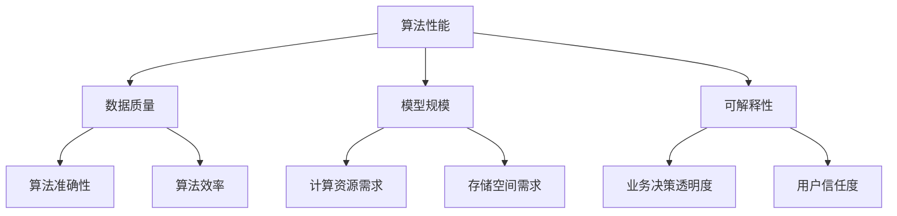
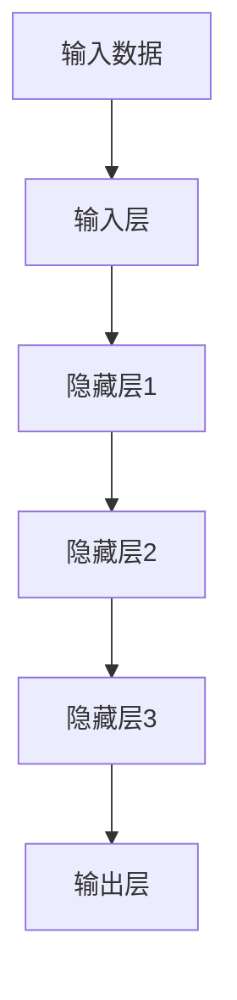

                 

# AI创业公司的技术路线选择

> **关键词：** AI创业、技术路线、核心算法、项目实战、实际应用场景、未来趋势

> **摘要：** 本文旨在为AI创业公司提供一套系统化的技术路线选择方案，从核心算法原理、项目实战到实际应用场景进行详细分析，帮助创业公司在激烈的市场竞争中找到适合自己的技术发展方向。文章还将探讨未来发展趋势与挑战，为创业公司提供有价值的参考。

## 1. 背景介绍

### 1.1 目的和范围

本文旨在为AI创业公司提供一套系统化的技术路线选择方案，帮助创业公司在AI技术飞速发展的背景下，找到适合自己的发展方向。文章将涵盖以下几个方面：

- **核心算法原理**：介绍常见的AI算法原理，帮助创业公司了解和选择适合自己业务的算法。
- **项目实战**：通过实际代码案例，展示如何将核心算法应用到实际项目中。
- **实际应用场景**：分析AI技术在不同领域的应用案例，帮助创业公司找到适合自己的市场切入点。
- **未来发展趋势与挑战**：探讨AI技术的未来发展方向，以及创业公司可能面临的挑战。

### 1.2 预期读者

本文预期读者为：

- **AI创业公司的创始人**：希望了解如何选择适合自己业务的技术路线。
- **技术团队负责人**：希望提高对AI技术的理解和应用能力。
- **技术爱好者**：希望了解AI技术在实际应用中的具体实现和案例分析。

### 1.3 文档结构概述

本文分为以下几个部分：

1. 背景介绍
2. 核心概念与联系
3. 核心算法原理与具体操作步骤
4. 数学模型和公式
5. 项目实战：代码实际案例和详细解释说明
6. 实际应用场景
7. 工具和资源推荐
8. 总结：未来发展趋势与挑战
9. 附录：常见问题与解答
10. 扩展阅读与参考资料

### 1.4 术语表

#### 1.4.1 核心术语定义

- **AI创业公司**：指专注于人工智能领域的初创企业。
- **核心算法**：指在特定应用场景下具有高效性能和普适性的算法。
- **技术路线**：指企业在研发过程中选择的技术发展方向和策略。

#### 1.4.2 相关概念解释

- **深度学习**：一种基于人工神经网络的机器学习技术，通过多层神经网络模拟人脑学习过程，实现特征提取和模式识别。
- **强化学习**：一种基于试错和反馈的机器学习技术，通过不断尝试和优化策略，实现智能决策和行为优化。

#### 1.4.3 缩略词列表

- **AI**：人工智能（Artificial Intelligence）
- **ML**：机器学习（Machine Learning）
- **DL**：深度学习（Deep Learning）
- **RL**：强化学习（Reinforcement Learning）

## 2. 核心概念与联系

### 2.1 核心概念

在AI创业公司的技术路线选择中，以下几个核心概念至关重要：

- **算法性能**：指算法在特定任务上的表现，包括准确性、效率、鲁棒性等。
- **可解释性**：指算法的可理解性和透明度，对于业务决策和用户信任具有重要意义。
- **模型规模**：指模型的大小，对于计算资源和存储空间的需求有重要影响。
- **数据质量**：指数据的质量和完整性，对于模型训练和预测性能有直接影响。

### 2.2 概念联系

为了更好地理解这些核心概念之间的联系，我们可以用以下Mermaid流程图表示：



从图中可以看出，算法性能与数据质量、模型规模、可解释性密切相关。一个优秀的算法需要在多个维度上达到平衡，以满足不同业务需求。

## 3. 核心算法原理 & 具体操作步骤

### 3.1 深度学习算法原理

深度学习是一种基于多层神经网络的机器学习技术，其基本原理是通过训练多层神经网络来模拟人脑的学习过程，从而实现特征提取和模式识别。以下是一个简单的深度学习算法原理图：



在深度学习算法中，每个神经元都会接收来自前一层神经元的输入，通过激活函数进行非线性变换，然后传递给下一层神经元。整个过程可以通过以下伪代码表示：

```python
# 输入数据
input_data = ...

# 定义神经网络结构
input_layer = ...
hidden_layer1 = ...
hidden_layer2 = ...
hidden_layer3 = ...
output_layer = ...

# 前向传播
output = forward_propagation(input_data, input_layer, hidden_layer1, hidden_layer2, hidden_layer3, output_layer)

# 计算损失函数
loss = calculate_loss(output, target)

# 反向传播
backpropagation(hidden_layer1, hidden_layer2, hidden_layer3, output_layer, input_data, target, loss)

# 更新权重
update_weights(hidden_layer1, hidden_layer2, hidden_layer3, output_layer, loss)
```

### 3.2 强化学习算法原理

强化学习是一种基于试错和反馈的机器学习技术，其基本原理是通过不断尝试和优化策略，实现智能决策和行为优化。以下是一个简单的强化学习算法原理图：


在强化学习算法中，智能体（agent）通过与环境（environment）交互，不断调整策略（policy），以获得最大化的奖励（reward）。整个过程可以通过以下伪代码表示：

```python
# 初始化智能体
agent = ...

# 初始化环境
environment = ...

# 迭代尝试
while not done:
    # 执行行动
    action = agent.select_action(state)
    
    # 接收环境反馈
    next_state, reward, done = environment.step(action)
    
    # 更新智能体策略
    agent.update_policy(state, action, reward, next_state, done)
    
    # 更新状态
    state = next_state
```

## 4. 数学模型和公式 & 详细讲解 & 举例说明

### 4.1 深度学习数学模型

深度学习算法的核心是多层神经网络，其数学模型可以通过以下公式表示：

$$
y = \sigma(z) = \frac{1}{1 + e^{-z}}
$$

其中，$y$表示输出，$z$表示输入，$\sigma$表示Sigmoid激活函数。

### 4.2 强化学习数学模型

强化学习算法的核心是策略优化，其数学模型可以通过以下公式表示：

$$
Q(s, a) = r + \gamma \max_{a'} Q(s', a')
$$

其中，$Q(s, a)$表示状态$s$下采取行动$a$的预期奖励，$r$表示即时奖励，$\gamma$表示折扣因子，$s'$和$a'$分别表示下一个状态和行动。

### 4.3 举例说明

假设我们有一个深度学习模型，用于对图像进行分类。输入层有100个神经元，隐藏层有500个神经元，输出层有10个神经元。训练数据集包含10000张图像和对应的标签。我们使用交叉熵损失函数来衡量模型的准确性。

首先，我们初始化权重和偏置，然后进行前向传播，计算输出层的概率分布。接着，计算损失函数，并使用反向传播算法更新权重和偏置。以下是具体的伪代码实现：

```python
# 初始化权重和偏置
weights = ...
biases = ...

# 前向传播
input_data = ...
hidden_layer1 = ...
hidden_layer2 = ...
output_layer = ...

output = forward_propagation(input_data, weights, biases)
probabilities = softmax(output)

# 计算损失函数
predicted_label = argmax(probabilities)
target_label = ...

loss = calculate_cross_entropy_loss(probabilities, target_label)

# 反向传播
d_weights = ...
d_biases = ...

backpropagation(input_data, weights, biases, d_weights, d_biases, output_layer, probabilities, target_label)

# 更新权重和偏置
weights += d_weights
biases += d_biases
```

## 5. 项目实战：代码实际案例和详细解释说明

### 5.1 开发环境搭建

为了进行深度学习和强化学习的项目实战，我们需要搭建一个合适的开发环境。以下是具体的步骤：

1. 安装Python环境（建议使用Python 3.8及以上版本）。
2. 安装深度学习框架（如TensorFlow或PyTorch）。
3. 安装强化学习库（如Gym）。
4. 安装必要的依赖库（如NumPy、Pandas等）。

### 5.2 源代码详细实现和代码解读

以下是一个简单的深度学习项目案例，使用TensorFlow框架实现一个简单的图像分类模型：

```python
import tensorflow as tf
from tensorflow.keras import layers

# 加载训练数据集
(x_train, y_train), (x_test, y_test) = tf.keras.datasets.cifar10.load_data()

# 数据预处理
x_train = x_train / 255.0
x_test = x_test / 255.0

# 构建深度学习模型
model = tf.keras.Sequential([
    layers.Conv2D(32, (3, 3), activation='relu', input_shape=(32, 32, 3)),
    layers.MaxPooling2D((2, 2)),
    layers.Conv2D(64, (3, 3), activation='relu'),
    layers.MaxPooling2D((2, 2)),
    layers.Conv2D(64, (3, 3), activation='relu'),
    layers.Flatten(),
    layers.Dense(64, activation='relu'),
    layers.Dense(10, activation='softmax')
])

# 编译模型
model.compile(optimizer='adam',
              loss='sparse_categorical_crossentropy',
              metrics=['accuracy'])

# 训练模型
model.fit(x_train, y_train, epochs=10)

# 评估模型
test_loss, test_acc = model.evaluate(x_test, y_test)
print(f'测试集准确性：{test_acc:.2f}')
```

### 5.3 代码解读与分析

1. **数据加载与预处理**：首先加载CIFAR-10数据集，并将其归一化到[0, 1]范围内。这是为了提高模型训练的稳定性。
2. **构建深度学习模型**：使用TensorFlow的Sequential模型，定义了一个简单的卷积神经网络（CNN）。模型包含两个卷积层、一个池化层和一个全连接层。卷积层用于提取图像特征，池化层用于减小特征图的尺寸，全连接层用于分类。
3. **编译模型**：指定优化器、损失函数和评估指标，准备训练模型。
4. **训练模型**：使用训练数据集训练模型，指定训练轮数。
5. **评估模型**：使用测试数据集评估模型的准确性。

通过这个简单的案例，我们可以看到如何使用TensorFlow框架实现一个深度学习模型，并将其应用于图像分类任务。类似地，我们也可以使用PyTorch框架实现强化学习项目，通过不断尝试和优化策略，实现智能决策。

## 6. 实际应用场景

### 6.1 医疗健康

AI技术在医疗健康领域具有广泛的应用前景。例如，利用深度学习算法，可以对医学图像进行自动化诊断，提高疾病检测的准确性和效率。此外，强化学习算法可以用于药物设计，通过不断尝试和优化，筛选出具有潜在疗效的化合物。

### 6.2 自动驾驶

自动驾驶是AI技术的另一个重要应用领域。通过深度学习和强化学习算法，可以实现车辆的自动驾驶功能。例如，利用深度学习算法，可以实现对周围环境的感知和理解，识别道路标志和行人。而强化学习算法则可以用于优化车辆的行驶策略，提高行驶的安全性和效率。

### 6.3 金融服务

在金融服务领域，AI技术可以用于风险评估、欺诈检测和个性化推荐等任务。例如，利用深度学习算法，可以构建复杂的信用评分模型，提高信用评估的准确性。而强化学习算法则可以用于优化投资组合，实现风险收益的最佳平衡。

### 6.4 人工智能助手

人工智能助手是AI技术在家居、办公等领域的典型应用。通过深度学习算法，可以实现对用户语音、文字的智能识别和响应，提供个性化服务。例如，智能音箱、智能客服等。

## 7. 工具和资源推荐

### 7.1 学习资源推荐

#### 7.1.1 书籍推荐

- **《深度学习》（Goodfellow, Bengio, Courville）**：深度学习的经典教材，适合初学者和进阶者。
- **《强化学习：原理与Python实战》（Rummukainen）**：全面介绍强化学习的基本原理和实践应用。

#### 7.1.2 在线课程

- **《深度学习专项课程》（吴恩达）**：由深度学习领域的权威专家吴恩达主讲，适合初学者和进阶者。
- **《强化学习专项课程》（吴恩达）**：深入讲解强化学习的基本原理和应用。

#### 7.1.3 技术博客和网站

- **TensorFlow官网（tensorflow.org）**：TensorFlow官方文档和教程，适合学习TensorFlow框架。
- **PyTorch官网（pytorch.org）**：PyTorch官方文档和教程，适合学习PyTorch框架。

### 7.2 开发工具框架推荐

#### 7.2.1 IDE和编辑器

- **Visual Studio Code**：强大的开源IDE，支持多种编程语言和框架。
- **PyCharm**：专业的Python IDE，提供丰富的功能和工具。

#### 7.2.2 调试和性能分析工具

- **TensorBoard**：TensorFlow官方的性能分析和调试工具。
- **PyTorch Profiler**：PyTorch官方的性能分析工具。

#### 7.2.3 相关框架和库

- **TensorFlow**：广泛使用的深度学习框架。
- **PyTorch**：流行的深度学习框架，易于使用和扩展。

### 7.3 相关论文著作推荐

#### 7.3.1 经典论文

- **"A Learning Algorithm for Continually Running Fully Recurrent Neural Networks"（1986）**：深度学习的基础论文之一。
- **"Reinforcement Learning: An Introduction"（1998）**：强化学习的经典教材。

#### 7.3.2 最新研究成果

- **"Transformers: State-of-the-Art Model for Language Processing"（2020）**：Transformer模型在自然语言处理领域的突破性研究成果。
- **"Deep Reinforcement Learning for Continuous Control"（2016）**：深度强化学习在连续控制任务中的应用。

#### 7.3.3 应用案例分析

- **"Deep Learning for Autonomous Driving"（2018）**：自动驾驶领域的深度学习应用案例。
- **"AI in Medicine: A Brief Overview of AI Applications in Healthcare"（2021）**：医疗健康领域的AI应用案例。

## 8. 总结：未来发展趋势与挑战

### 8.1 发展趋势

- **算法性能提升**：随着硬件性能的提升和算法的优化，AI算法的性能将持续提升。
- **跨学科融合**：AI技术与其他领域的结合，如生物医学、金融、智能制造等，将推动产业创新。
- **人工智能伦理**：随着AI技术的应用，伦理问题日益凸显，企业和社会需要共同关注和解决。

### 8.2 挑战

- **数据质量与隐私**：高质量的数据是AI算法训练的基础，但数据隐私和保护问题亟待解决。
- **算法可解释性**：提高算法的可解释性，增强用户信任，是未来发展的关键挑战。
- **计算资源需求**：深度学习和强化学习模型对计算资源的需求巨大，如何优化资源利用是重要课题。

## 9. 附录：常见问题与解答

### 9.1 AI创业公司如何选择合适的技术路线？

**解答**：首先，需要对业务需求和市场趋势进行深入分析，明确公司的核心价值。然后，根据业务需求选择合适的算法和技术框架，如深度学习、强化学习等。最后，进行技术验证和迭代优化，确保技术路线的可行性和有效性。

### 9.2 如何评估AI算法的性能？

**解答**：评估AI算法的性能可以从多个维度进行，包括准确性、效率、鲁棒性等。常用的评估指标有准确率、召回率、F1值等。同时，还需要关注算法的可解释性，确保其在实际应用中的可靠性和透明度。

## 10. 扩展阅读 & 参考资料

- **《深度学习》（Goodfellow, Bengio, Courville）**
- **《强化学习：原理与Python实战》（Rummukainen）**
- **TensorFlow官网（tensorflow.org）**
- **PyTorch官网（pytorch.org）**
- **吴恩达的深度学习专项课程（https://www.coursera.org/learn/deep-learning）**
- **吴恩达的强化学习专项课程（https://www.coursera.org/learn/reinforcement-learning）**
- **《A Learning Algorithm for Continually Running Fully Recurrent Neural Networks》（1986）**
- **《Reinforcement Learning: An Introduction》（1998）**
- **《Transformers: State-of-the-Art Model for Language Processing》（2020）**
- **《Deep Reinforcement Learning for Continuous Control》（2016）**
- **《Deep Learning for Autonomous Driving》（2018）**
- **《AI in Medicine: A Brief Overview of AI Applications in Healthcare》（2021）**

