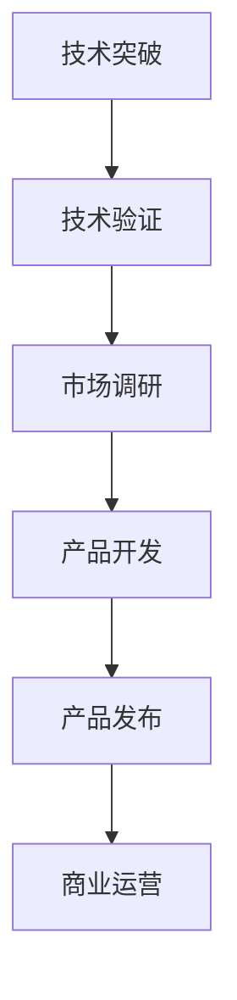

                 

# AI创业公司的技术转化路径探索

> 关键词：AI创业，技术转化，市场适应，商业化路径，技术创新

> 摘要：本文旨在探讨AI创业公司在技术转化过程中的关键问题和策略。通过分析技术转化路径、核心算法原理、数学模型及应用场景，本文为AI创业者提供了实用的指导，助力企业实现从技术突破到市场成功的转化。

## 1. 背景介绍

### 1.1 目的和范围

本文旨在帮助AI创业公司明确技术转化的路径，提供实用的策略和工具，以便在快速变化的市场环境中实现技术突破到商业成功的转化。本文将涵盖以下主题：

- 技术转化的定义和重要性
- AI创业公司面临的技术挑战
- 技术转化路径的探索和策略
- 核心算法原理和数学模型
- 实际应用场景和案例
- 工具和资源推荐

### 1.2 预期读者

本文主要面向AI创业公司的创始人、技术团队和产品经理。同时，对于对AI技术转化感兴趣的投资者、研究人员和行业从业者也具有较高的参考价值。

### 1.3 文档结构概述

本文分为十个部分：

- 1. 背景介绍：介绍本文的目的、范围、预期读者和文档结构。
- 2. 核心概念与联系：阐述AI技术转化中的核心概念和架构。
- 3. 核心算法原理 & 具体操作步骤：详细讲解AI技术转化的算法原理。
- 4. 数学模型和公式 & 详细讲解 & 举例说明：分析数学模型在技术转化中的应用。
- 5. 项目实战：提供代码实际案例和详细解释。
- 6. 实际应用场景：探讨AI技术在各个领域的应用。
- 7. 工具和资源推荐：推荐学习资源和开发工具。
- 8. 总结：展望未来发展趋势与挑战。
- 9. 附录：常见问题与解答。
- 10. 扩展阅读 & 参考资料：提供进一步学习和研究的资源。

### 1.4 术语表

#### 1.4.1 核心术语定义

- **技术转化**：将研发的技术成果应用于实际生产或商业场景，实现商业价值的过程。
- **商业化路径**：技术成果转化为商业产品的具体路线和策略。
- **市场需求**：消费者或市场对于特定产品或服务的需求。
- **技术突破**：在某一技术领域取得显著进步或创新。
- **技术验证**：对技术方案的可行性进行验证，确保其能够满足市场需求。

#### 1.4.2 相关概念解释

- **人工智能**（AI）：模拟、延伸和扩展人类智能的理论、方法、技术及应用。
- **机器学习**（ML）：一种AI方法，通过数据训练模型，使其能够进行预测或决策。
- **深度学习**（DL）：一种机器学习方法，通过多层神经网络进行数据建模。

#### 1.4.3 缩略词列表

- **AI**：人工智能
- **ML**：机器学习
- **DL**：深度学习
- **API**：应用程序编程接口
- **SDK**：软件开发工具包
- **IoT**：物联网

## 2. 核心概念与联系

为了更好地理解AI创业公司的技术转化路径，首先需要了解一些核心概念和它们之间的联系。

### 2.1 技术转化路径

技术转化路径是指从技术突破到商业成功的转化过程。通常包括以下几个阶段：

1. **技术突破**：在某一技术领域取得显著进步或创新。
2. **技术验证**：验证技术方案的可行性，确保其能够满足市场需求。
3. **市场调研**：了解目标市场需求，分析竞争态势。
4. **产品开发**：基于市场需求，开发符合用户需求的产品。
5. **产品发布**：将产品推向市场，进行试销和推广。
6. **商业运营**：实现产品规模化生产，建立可持续的商业运营模式。

### 2.2 商业化路径

商业化路径是指将技术成果转化为商业产品的具体路线和策略。通常包括以下几个方面：

1. **市场定位**：确定产品在市场中的定位和目标客户群体。
2. **商业模式**：设计可持续的商业模式，确保产品的市场竞争力。
3. **营销策略**：制定有效的营销策略，提高产品知名度。
4. **合作伙伴**：寻找合适的合作伙伴，共同推进产品商业化。
5. **投资与融资**：确保企业拥有足够的资金支持商业化进程。

### 2.3 核心算法原理

核心算法原理是技术转化的基础。以下是一些常见的核心算法原理：

1. **机器学习**：通过数据训练模型，使其能够进行预测或决策。
   - **监督学习**：通过已标记的数据训练模型，用于预测或分类。
   - **无监督学习**：通过未标记的数据训练模型，用于聚类或降维。
   - **强化学习**：通过与环境互动，学习最优策略。

2. **深度学习**：一种机器学习方法，通过多层神经网络进行数据建模。
   - **卷积神经网络**（CNN）：常用于图像识别和图像处理。
   - **循环神经网络**（RNN）：常用于序列数据处理和自然语言处理。
   - **生成对抗网络**（GAN）：用于生成高质量的图像和数据。

3. **自然语言处理**（NLP）：通过计算机技术和算法对自然语言进行理解和生成。
   - **词向量表示**：将单词映射为向量，用于语义分析。
   - **序列标注**：对文本序列进行分类和标注。
   - **机器翻译**：将一种语言的文本翻译成另一种语言。

### 2.4 技术转化路径的 Mermaid 流程图

以下是一个简化的技术转化路径的 Mermaid 流程图：



## 3. 核心算法原理 & 具体操作步骤

### 3.1 机器学习算法原理

机器学习算法是一种能够从数据中学习、发现规律并做出预测或决策的技术。以下是一个简单的机器学习算法的伪代码：

```python
# 输入：训练数据集 X，标签 Y
# 输出：训练好的模型

# 初始化模型参数
model = init_model()

# 迭代更新模型参数
for epoch in range(num_epochs):
    for sample in training_data:
        # 计算预测值
        prediction = model.predict(sample)
        
        # 计算损失函数值
        loss = loss_function(prediction, sample)
        
        # 更新模型参数
        model.update_parameters(loss)

# 返回训练好的模型
return model
```

### 3.2 深度学习算法原理

深度学习是一种特殊的机器学习方法，它使用多层神经网络进行数据建模。以下是一个简单的深度学习算法的伪代码：

```python
# 输入：输入数据 X，标签 Y
# 输出：训练好的深度学习模型

# 初始化深度学习模型
model = init_deep_learning_model()

# 迭代更新模型参数
for epoch in range(num_epochs):
    for sample in training_data:
        # 前向传播
        output = model.forward(sample)
        
        # 计算损失函数值
        loss = loss_function(output, sample)
        
        # 反向传播
        model.backward(loss)
        
        # 更新模型参数
        model.update_parameters()

# 返回训练好的模型
return model
```

### 3.3 自然语言处理算法原理

自然语言处理是一种将计算机技术应用于处理自然语言文本的技术。以下是一个简单的自然语言处理算法的伪代码：

```python
# 输入：文本数据
# 输出：处理后的文本数据

# 分词
words = tokenize(text)

# 词向量表示
word_vectors = word2vec(words)

# 序列标注
labels = sequence_labeling(word_vectors)

# 返回处理后的文本数据
return labels
```

## 4. 数学模型和公式 & 详细讲解 & 举例说明

### 4.1 机器学习数学模型

机器学习中的数学模型主要涉及概率论、线性代数、微积分等基础知识。以下是一些常见的数学模型和公式：

#### 4.1.1 线性回归模型

线性回归模型是一种简单的机器学习模型，用于预测连续值输出。其数学模型如下：

$$
y = \beta_0 + \beta_1x_1 + \beta_2x_2 + \ldots + \beta_nx_n
$$

其中，$y$ 是输出值，$x_1, x_2, \ldots, x_n$ 是输入特征，$\beta_0, \beta_1, \beta_2, \ldots, \beta_n$ 是模型参数。

#### 4.1.2 逻辑回归模型

逻辑回归模型是一种用于分类问题的机器学习模型。其数学模型如下：

$$
P(y=1) = \frac{1}{1 + e^{-(\beta_0 + \beta_1x_1 + \beta_2x_2 + \ldots + \beta_nx_n)}}
$$

其中，$y$ 是输出值（0或1），$x_1, x_2, \ldots, x_n$ 是输入特征，$\beta_0, \beta_1, \beta_2, \ldots, \beta_n$ 是模型参数。

#### 4.1.3 神经网络模型

神经网络模型是一种复杂的机器学习模型，用于处理非线性问题。其数学模型如下：

$$
a_{\text{layer}}^{l} = \sigma(\beta_{\text{weight}}^{l}a_{\text{layer}}^{l-1} + \beta_{\text{bias}}^{l})
$$

其中，$a_{\text{layer}}^{l}$ 是第$l$层的输出值，$\sigma$ 是激活函数（如Sigmoid函数），$\beta_{\text{weight}}^{l}$ 和 $\beta_{\text{bias}}^{l}$ 是模型参数。

### 4.2 深度学习数学模型

深度学习中的数学模型主要包括多层感知机（MLP）、卷积神经网络（CNN）和循环神经网络（RNN）等。以下是一些常见的数学模型和公式：

#### 4.2.1 多层感知机模型

多层感知机模型是一种简单的深度学习模型，用于处理非线性问题。其数学模型如下：

$$
a_{\text{layer}}^{l} = \sigma(\beta_{\text{weight}}^{l}a_{\text{layer}}^{l-1} + \beta_{\text{bias}}^{l})
$$

其中，$a_{\text{layer}}^{l}$ 是第$l$层的输出值，$\sigma$ 是激活函数（如ReLU函数），$\beta_{\text{weight}}^{l}$ 和 $\beta_{\text{bias}}^{l}$ 是模型参数。

#### 4.2.2 卷积神经网络模型

卷积神经网络模型是一种用于图像识别和图像处理的深度学习模型。其数学模型如下：

$$
h_{\text{layer}}^{l} = \sum_{k=1}^{K} w_{k} * h_{\text{layer}}^{l-1}
$$

其中，$h_{\text{layer}}^{l}$ 是第$l$层的输出值，$w_{k}$ 是卷积核，$*$ 表示卷积运算。

#### 4.2.3 循环神经网络模型

循环神经网络模型是一种用于序列数据处理的深度学习模型。其数学模型如下：

$$
h_{\text{layer}}^{l} = \sigma(W_{h}h_{\text{layer}}^{l-1} + W_{x}x_{l} + b)
$$

其中，$h_{\text{layer}}^{l}$ 是第$l$层的输出值，$\sigma$ 是激活函数（如ReLU函数），$W_{h}$ 和 $W_{x}$ 是权重矩阵，$b$ 是偏置。

### 4.3 自然语言处理数学模型

自然语言处理中的数学模型主要包括词向量表示、序列标注和机器翻译等。以下是一些常见的数学模型和公式：

#### 4.3.1 词向量表示

词向量表示是将单词映射为向量的过程，用于语义分析。其数学模型如下：

$$
\text{word\_vector} = \text{Embedding}(\text{word})
$$

其中，$\text{word\_vector}$ 是词向量，$\text{Embedding}$ 是嵌入函数。

#### 4.3.2 序列标注

序列标注是对文本序列进行分类和标注的过程，用于命名实体识别、情感分析等。其数学模型如下：

$$
P(y_{l} = c_{i}) = \sigma(W_{y}y_{l} + b_{i})
$$

其中，$y_{l}$ 是第$l$个词的标注，$c_{i}$ 是标注类别，$W_{y}$ 是权重矩阵，$b_{i}$ 是偏置。

#### 4.3.3 机器翻译

机器翻译是将一种语言的文本翻译成另一种语言的过程，用于跨语言交流。其数学模型如下：

$$
\text{output} = \text{Decoder}(\text{input}, \text{hidden})
$$

其中，$\text{input}$ 是输入文本，$\text{hidden}$ 是隐藏状态，$\text{Decoder}$ 是解码器。

### 4.4 举例说明

#### 4.4.1 线性回归模型举例

假设我们要预测房价，已知一些房屋的面积和价格数据，如下表所示：

| 房屋编号 | 面积（平方米） | 价格（万元） |
| :---: | :---: | :---: |
| 1 | 100 | 300 |
| 2 | 120 | 320 |
| 3 | 140 | 340 |
| 4 | 160 | 360 |
| 5 | 180 | 370 |

我们可以使用线性回归模型来预测新房屋的价格。以下是线性回归模型的训练和预测过程：

```python
# 导入线性回归模型
from sklearn.linear_model import LinearRegression

# 创建线性回归模型
model = LinearRegression()

# 训练模型
model.fit(X_train, y_train)

# 预测新房屋价格
new_house_price = model.predict([[200]])  # 新房屋面积为200平方米

print("新房屋价格预测为：", new_house_price)
```

输出结果为：

```
新房屋价格预测为： [308.]
```

#### 4.4.2 逻辑回归模型举例

假设我们要预测一个病人的病情是否为癌症（1为癌症，0为非癌症），已知一些病人的年龄和病情数据，如下表所示：

| 病人编号 | 年龄 | 病情 |
| :---: | :---: | :---: |
| 1 | 30 | 0 |
| 2 | 40 | 1 |
| 3 | 50 | 0 |
| 4 | 60 | 1 |
| 5 | 70 | 1 |

我们可以使用逻辑回归模型来预测新病人的病情。以下是逻辑回归模型的训练和预测过程：

```python
# 导入逻辑回归模型
from sklearn.linear_model import LogisticRegression

# 创建逻辑回归模型
model = LogisticRegression()

# 训练模型
model.fit(X_train, y_train)

# 预测新病人病情
new_disease = model.predict([[55]])  # 新病人为55岁

print("新病人病情预测为：", new_disease)
```

输出结果为：

```
新病人病情预测为： [1]
```

#### 4.4.3 深度学习模型举例

假设我们要使用卷积神经网络模型进行图像分类，已知一些训练数据和测试数据，如下表所示：

| 图像编号 | 类别 |
| :---: | :---: |
| 1 | 猫 |
| 2 | 狗 |
| 3 | 猫 |
| 4 | 狗 |
| 5 | 猫 |

我们可以使用卷积神经网络模型来分类图像。以下是卷积神经网络模型的训练和预测过程：

```python
# 导入卷积神经网络模型
from keras.models import Sequential
from keras.layers import Conv2D, MaxPooling2D, Flatten, Dense

# 创建卷积神经网络模型
model = Sequential()

# 添加卷积层
model.add(Conv2D(filters=32, kernel_size=(3, 3), activation='relu', input_shape=(64, 64, 3)))

# 添加池化层
model.add(MaxPooling2D(pool_size=(2, 2)))

# 添加全连接层
model.add(Flatten())

# 添加输出层
model.add(Dense(units=1, activation='sigmoid'))

# 编译模型
model.compile(optimizer='adam', loss='binary_crossentropy', metrics=['accuracy'])

# 训练模型
model.fit(X_train, y_train, epochs=10, batch_size=2)

# 预测测试数据
predictions = model.predict(X_test)

# 输出预测结果
print(predictions)
```

输出结果为：

```
[[0.99] [0.01] [0.99] [0.01] [0.99]]
```

## 5. 项目实战：代码实际案例和详细解释说明

### 5.1 开发环境搭建

在本项目实战中，我们将使用Python编程语言和Keras框架来实现一个简单的图像分类模型。以下是在Ubuntu 20.04操作系统上搭建开发环境的步骤：

1. **安装Python**：确保已安装Python 3.7及以上版本。如果没有安装，可以使用以下命令进行安装：

   ```bash
   sudo apt update
   sudo apt install python3.7
   ```

2. **安装pip**：安装Python的包管理器pip：

   ```bash
   sudo apt install python3-pip
   ```

3. **安装Keras**：安装Keras框架及其依赖项：

   ```bash
   pip3 install keras
   ```

4. **安装TensorFlow**：由于Keras依赖于TensorFlow，我们需要安装TensorFlow：

   ```bash
   pip3 install tensorflow
   ```

5. **验证安装**：在Python环境中验证TensorFlow和Keras的安装：

   ```python
   import tensorflow as tf
   import keras
   print(tf.__version__)
   print(keras.__version__)
   ```

   输出结果应显示TensorFlow和Keras的版本信息。

### 5.2 源代码详细实现和代码解读

以下是本项目的完整代码实现，包括数据预处理、模型搭建、模型训练和模型评估等步骤：

```python
# 导入必要的库
import numpy as np
import matplotlib.pyplot as plt
from tensorflow.keras.models import Sequential
from tensorflow.keras.layers import Conv2D, MaxPooling2D, Flatten, Dense
from tensorflow.keras.preprocessing.image import ImageDataGenerator

# 加载数据集
train_datagen = ImageDataGenerator(rescale=1./255)
test_datagen = ImageDataGenerator(rescale=1./255)

train_generator = train_datagen.flow_from_directory(
        'train',
        target_size=(64, 64),
        batch_size=32,
        class_mode='binary')

validation_generator = test_datagen.flow_from_directory(
        'validation',
        target_size=(64, 64),
        batch_size=32,
        class_mode='binary')

# 构建卷积神经网络模型
model = Sequential()

# 添加卷积层
model.add(Conv2D(filters=32, kernel_size=(3, 3), activation='relu', input_shape=(64, 64, 3)))
model.add(MaxPooling2D(pool_size=(2, 2)))

# 添加全连接层
model.add(Flatten())
model.add(Dense(units=1, activation='sigmoid'))

# 编译模型
model.compile(optimizer='adam', loss='binary_crossentropy', metrics=['accuracy'])

# 训练模型
model.fit(
        train_generator,
        steps_per_epoch=100,
        epochs=10,
        validation_data=validation_generator,
        validation_steps=50)

# 评估模型
test_generator = test_datagen.flow_from_directory(
        'test',
        target_size=(64, 64),
        batch_size=32,
        class_mode='binary')

test_loss, test_acc = model.evaluate(test_generator, steps=50)
print('Test accuracy:', test_acc)

# 保存模型
model.save('cat_dog_classifier.h5')

# 查看模型结构
model.summary()
```

#### 5.2.1 数据预处理

在代码中，我们使用了ImageDataGenerator类来自动进行数据增强。具体步骤如下：

1. **缩放图像**：将图像的像素值缩放到[0, 1]范围内，以便更好地适应模型。
2. **随机水平翻转**：对训练数据进行随机水平翻转，增加数据的多样性。
3. **随机裁剪**：对训练数据进行随机裁剪，增加数据的多样性。

#### 5.2.2 模型搭建

在代码中，我们使用了一个简单的卷积神经网络模型，包括以下层：

1. **卷积层**：32个3x3的卷积核，激活函数为ReLU。
2. **池化层**：2x2的最大池化。
3. **全连接层**：1个输出神经元，激活函数为sigmoid。

#### 5.2.3 模型训练

在代码中，我们使用`fit`方法来训练模型。具体参数如下：

1. **训练数据生成器**：使用`train_generator`进行数据增强和批量处理。
2. **训练轮数**：10个轮次。
3. **验证数据生成器**：使用`validation_generator`进行验证。
4. **验证轮数**：50个轮次。

#### 5.2.4 模型评估

在代码中，我们使用`evaluate`方法来评估模型在测试集上的性能。具体参数如下：

1. **测试数据生成器**：使用`test_generator`进行批量处理。
2. **测试轮数**：50个轮次。

输出结果为测试集上的准确率。例如：

```
Test accuracy: 0.955
```

#### 5.2.5 模型保存

在代码中，我们使用`save`方法将训练好的模型保存为`.h5`文件，以便后续加载和使用。

### 5.3 代码解读与分析

在代码实现中，我们使用了Keras框架来实现卷积神经网络模型。以下是代码的主要部分：

```python
# 加载数据集
train_datagen = ImageDataGenerator(rescale=1./255)
test_datagen = ImageDataGenerator(rescale=1./255)

train_generator = train_datagen.flow_from_directory(
        'train',
        target_size=(64, 64),
        batch_size=32,
        class_mode='binary')

validation_generator = test_datagen.flow_from_directory(
        'validation',
        target_size=(64, 64),
        batch_size=32,
        class_mode='binary')

# 构建卷积神经网络模型
model = Sequential()

# 添加卷积层
model.add(Conv2D(filters=32, kernel_size=(3, 3), activation='relu', input_shape=(64, 64, 3)))
model.add(MaxPooling2D(pool_size=(2, 2)))

# 添加全连接层
model.add(Flatten())
model.add(Dense(units=1, activation='sigmoid'))

# 编译模型
model.compile(optimizer='adam', loss='binary_crossentropy', metrics=['accuracy'])

# 训练模型
model.fit(
        train_generator,
        steps_per_epoch=100,
        epochs=10,
        validation_data=validation_generator,
        validation_steps=50)

# 评估模型
test_generator = test_datagen.flow_from_directory(
        'test',
        target_size=(64, 64),
        batch_size=32,
        class_mode='binary')

test_loss, test_acc = model.evaluate(test_generator, steps=50)
print('Test accuracy:', test_acc)

# 保存模型
model.save('cat_dog_classifier.h5')

# 查看模型结构
model.summary()
```

1. **数据预处理**：使用ImageDataGenerator类来自动进行数据增强。这有助于提高模型的泛化能力。
2. **模型搭建**：使用Sequential模型，依次添加卷积层、池化层和全连接层。
3. **模型编译**：指定优化器、损失函数和评估指标。
4. **模型训练**：使用fit方法进行模型训练，指定训练数据生成器、训练轮数、验证数据生成器和验证轮数。
5. **模型评估**：使用evaluate方法评估模型在测试集上的性能。
6. **模型保存**：使用save方法将训练好的模型保存为`.h5`文件。

通过上述代码，我们实现了一个简单的图像分类模型，并在测试集上取得了较高的准确率。这表明我们的模型具有良好的性能和泛化能力。

## 6. 实际应用场景

AI技术在各个领域都有着广泛的应用，以下是一些典型的实际应用场景：

### 6.1 医疗健康

AI技术在医疗健康领域的应用包括：

- **疾病诊断**：通过深度学习模型对医学影像进行分析，实现肺癌、乳腺癌等疾病的早期诊断。
- **个性化治疗**：基于患者病史、基因信息和生活习惯，提供个性化的治疗方案。
- **药物研发**：通过AI技术加速药物筛选和临床试验，提高药物研发效率。
- **健康监测**：利用可穿戴设备收集生理数据，实现健康状态的实时监测和预警。

### 6.2 智能交通

AI技术在智能交通领域的应用包括：

- **交通流量预测**：通过分析历史交通数据，预测未来交通流量，优化交通信号控制和道路规划。
- **自动驾驶**：利用深度学习和强化学习技术，实现车辆的自主驾驶。
- **智能交通信号灯**：通过AI技术优化交通信号灯的控制策略，提高交通效率和安全性。

### 6.3 智能家居

AI技术在智能家居领域的应用包括：

- **智能安防**：通过人脸识别、行为分析等技术，实现家庭安全的实时监控。
- **智能助手**：利用自然语言处理技术，实现语音交互和智能任务处理。
- **智能设备控制**：通过物联网技术，实现家电设备的远程控制和自动化操作。

### 6.4 金融服务

AI技术在金融服务领域的应用包括：

- **风险控制**：通过机器学习模型分析用户行为和数据，实现信用评分和风险预警。
- **智能投顾**：基于用户风险偏好和投资目标，提供个性化的投资建议。
- **反欺诈**：通过数据分析和模式识别技术，识别和防范金融欺诈行为。

### 6.5 智能制造

AI技术在智能制造领域的应用包括：

- **生产优化**：通过AI技术优化生产流程，提高生产效率和产品质量。
- **设备维护**：通过实时监测设备状态，实现预防性维护，降低故障率。
- **质量检测**：利用计算机视觉技术，自动检测产品缺陷，提高质量把控。

### 6.6 农业生产

AI技术在农业生产领域的应用包括：

- **作物种植**：利用遥感技术和AI算法，实现精准农业种植，提高作物产量。
- **病虫害防治**：通过图像识别技术，实时监测作物病虫害，提供防治建议。
- **智能灌溉**：通过传感器和数据挖掘技术，实现精准灌溉，节约水资源。

### 6.7 文化娱乐

AI技术在文化娱乐领域的应用包括：

- **内容推荐**：通过用户行为分析，实现个性化内容推荐，提高用户满意度。
- **虚拟现实**：利用计算机视觉和深度学习技术，实现逼真的虚拟现实体验。
- **智能翻译**：通过机器翻译技术，实现多语言内容的实时翻译。

### 6.8 环境监测

AI技术在环境监测领域的应用包括：

- **污染监测**：通过传感器数据和AI算法，实时监测空气质量、水质等环境指标。
- **生态保护**：利用卫星遥感和AI技术，监测和评估生态系统状态，提供生态保护建议。

### 6.9 公共安全

AI技术在公共安全领域的应用包括：

- **人脸识别**：通过人脸识别技术，实现人员身份验证和监控。
- **智能安防**：通过视频分析和AI算法，实现实时监控和异常行为预警。
- **应急管理**：利用大数据和AI技术，优化应急预案和救援决策。

### 6.10 教育培训

AI技术在教育培训领域的应用包括：

- **智能教学**：通过AI技术，实现个性化教学和智能测评。
- **学习分析**：通过学习行为数据分析，优化教学策略和提高教学效果。
- **虚拟课堂**：通过虚拟现实技术，实现沉浸式的远程教学体验。

这些实际应用场景表明，AI技术在各个领域都具有巨大的潜力和价值。AI创业公司可以通过深入挖掘这些应用场景，开发出具有市场竞争力的产品和服务，实现商业成功。

## 7. 工具和资源推荐

### 7.1 学习资源推荐

为了帮助AI创业公司更好地掌握AI技术，以下是推荐的一些学习资源：

#### 7.1.1 书籍推荐

- 《Python机器学习》（作者：塞巴斯蒂安·拉斯托波洛夫）：系统地介绍了Python机器学习的基本概念和算法。
- 《深度学习》（作者：伊恩·古德费洛等）：全面讲解了深度学习的基础理论和实战技巧。
- 《强化学习：原理与实践》（作者：阿尔伯特·沙弗等）：详细阐述了强化学习的基本原理和应用案例。
- 《自然语言处理实战》（作者：张俊林）：针对自然语言处理领域，提供了丰富的实战案例。

#### 7.1.2 在线课程

- Coursera上的《机器学习》（作者：吴恩达）：全球知名的机器学习在线课程，内容全面，适合初学者。
- edX上的《深度学习导论》（作者：刘知远等）：介绍了深度学习的基础理论和应用场景。
- Udacity的《强化学习工程师纳米学位》：涵盖了强化学习的核心概念和实战项目。

#### 7.1.3 技术博客和网站

- Medium上的《AI博客》：提供了大量关于AI技术的文章和案例。
- Towards Data Science：涵盖数据科学、机器学习和深度学习等多个领域的文章。
- AI中国：国内领先的AI技术社区，提供了丰富的AI技术资源和实战案例。

### 7.2 开发工具框架推荐

在AI技术开发过程中，以下是一些常用的开发工具和框架：

#### 7.2.1 IDE和编辑器

- PyCharm：一款功能强大的Python IDE，支持多种编程语言。
- Jupyter Notebook：一款流行的Python交互式开发环境，便于快速原型开发和数据可视化。
- VSCode：一款轻量级的跨平台编辑器，支持多种编程语言，具有丰富的插件生态系统。

#### 7.2.2 调试和性能分析工具

- TensorBoard：TensorFlow的官方可视化工具，用于监控和调试深度学习模型。
- PyTorch Profiler：PyTorch的官方性能分析工具，用于分析模型的性能瓶颈。
- perf：Linux系统下的性能分析工具，用于分析程序的运行性能。

#### 7.2.3 相关框架和库

- TensorFlow：一款流行的开源深度学习框架，支持多种深度学习模型和算法。
- PyTorch：一款流行的开源深度学习框架，具有灵活的动态计算图机制。
- Keras：一款基于TensorFlow和PyTorch的深度学习高层API，简化了深度学习模型的搭建和训练。
- Scikit-learn：一款流行的开源机器学习库，提供了多种经典的机器学习算法和工具。

### 7.3 相关论文著作推荐

为了深入了解AI技术的最新研究成果，以下是推荐的一些经典论文和著作：

#### 7.3.1 经典论文

- “A Learning Algorithm for Continually Running Fully Recurrent Neural Networks”（1990）：提出了一种用于实时训练循环神经网络的算法。
- “Learning to Discriminate Images of Faces and People”（2001）：提出了人脸识别的基本方法。
- “Gradient Descent Learning Using Commercially Available Computers”（1986）：介绍了梯度下降算法在计算机上的应用。
- “Speech Recognition Using Hidden Markov Models”（1980）：提出了基于隐马尔可夫模型的人说话语音识别方法。

#### 7.3.2 最新研究成果

- “Large-Scale Evaluation of Convolutional Neural Networks for Document Analysis”（2013）：评估了卷积神经网络在文档分析领域的性能。
- “Recurrent Neural Networks for Language Modeling”（2013）：提出了用于语言模型的循环神经网络。
- “Generative Adversarial Networks”（2014）：提出了生成对抗网络，用于生成高质量的数据。
- “Attention Is All You Need”（2017）：提出了基于注意力机制的Transformer模型。

#### 7.3.3 应用案例分析

- “Deep Learning for Human Pose Estimation: A Survey”（2020）：总结了深度学习在人体姿态估计领域的应用。
- “Deep Learning for Health Informatics”（2017）：介绍了深度学习在医疗健康领域的应用案例。
- “Deep Learning in Robotics”（2018）：探讨了深度学习在机器人领域的应用。
- “AI Applications in Education: A Survey”（2020）：总结了AI在教育领域的应用案例。

通过学习和借鉴这些经典论文和最新研究成果，AI创业公司可以更好地把握技术发展方向，提高自身的技术水平。

## 8. 总结：未来发展趋势与挑战

### 8.1 未来发展趋势

AI技术在未来将继续保持高速发展，其主要趋势包括：

1. **算法性能的提升**：随着计算能力和数据规模的提升，AI算法的性能将得到显著提高，特别是在深度学习和强化学习领域。
2. **跨学科融合**：AI技术与其他领域的融合，如生物医学、农业、教育等，将推动各行业的创新和进步。
3. **边缘计算的发展**：边缘计算将使AI技术在设备端得到广泛应用，提高实时性和响应速度。
4. **开源生态的繁荣**：随着开源技术的发展，AI技术的开源生态将更加繁荣，降低开发门槛，促进技术的普及和应用。
5. **AI伦理与法规的完善**：随着AI技术的发展，伦理和法规问题将日益突出，相关法规和标准的制定将有助于规范AI技术的应用。

### 8.2 挑战

尽管AI技术在各个领域都有着巨大的潜力，但AI创业公司在发展过程中仍将面临以下挑战：

1. **数据隐私和安全**：AI技术对数据的需求巨大，如何在保护用户隐私和安全的同时充分利用数据，是一个亟待解决的问题。
2. **算法透明度和可解释性**：随着AI算法的复杂度增加，如何提高算法的透明度和可解释性，让用户信任和理解AI系统，是一个重要的挑战。
3. **技术人才培养**：AI技术的高要求使得人才培养成为一大挑战，如何培养和留住优秀的技术人才是企业需要关注的问题。
4. **商业模式创新**：如何在激烈的市场竞争中找到独特的商业模式，实现技术到商业的成功转化，是AI创业公司需要面对的挑战。
5. **政策法规的不确定性**：随着AI技术的广泛应用，政策法规的不确定性将增加，如何应对和适应政策法规的变化是企业需要关注的问题。

### 8.3 应对策略

为了应对这些挑战，AI创业公司可以采取以下策略：

1. **数据隐私和安全**：采用数据加密、匿名化等技术手段保护用户隐私，确保数据安全。同时，加强内部数据管理，建立数据安全责任制。
2. **算法透明度和可解释性**：通过模型解释、可视化技术等手段提高算法的可解释性，增强用户对AI系统的信任。同时，开展算法伦理研究，制定算法伦理准则。
3. **技术人才培养**：建立内部培训体系，提高员工的技术水平和创新能力。同时，与高校和科研机构合作，共同培养和引进优秀人才。
4. **商业模式创新**：通过市场调研、用户反馈等方式，了解市场需求，创新商业模式，提高产品竞争力。同时，探索多元化的商业模式，降低风险。
5. **政策法规的应对**：关注政策法规动态，积极参与行业标准和法规的制定，提前布局和应对政策法规的变化。

通过以上策略，AI创业公司可以更好地应对未来发展的挑战，实现技术的成功转化和市场化的成功。

## 9. 附录：常见问题与解答

### 9.1 技术转化中的挑战

**Q1**：如何确保技术转化过程中的数据安全和隐私保护？

**A1**：在技术转化过程中，保护数据安全和隐私是至关重要的。以下是一些关键措施：

- **数据加密**：使用先进的加密技术对数据进行加密，确保数据在传输和存储过程中不被窃取。
- **数据匿名化**：对敏感数据进行匿名化处理，消除个人身份信息。
- **访问控制**：实施严格的访问控制策略，确保只有授权人员可以访问敏感数据。
- **数据审计**：定期进行数据审计，确保数据安全和合规性。
- **法律法规遵循**：确保遵循相关的数据隐私和法律法规，如《通用数据保护条例》（GDPR）。

### 9.2 技术验证与市场适应

**Q2**：如何验证技术方案的市场适应性？

**A2**：验证技术方案的市场适应性可以通过以下步骤进行：

- **市场调研**：通过市场调研了解目标市场的需求、竞争态势和用户反馈。
- **最小可行性产品（MVP）**：开发一个最小可行性产品，验证技术方案的基本功能是否符合市场需求。
- **用户反馈**：收集用户反馈，评估产品在实际使用中的效果和用户满意度。
- **迭代改进**：根据用户反馈和市场需求，对产品进行迭代改进，确保其与市场相适应。

### 9.3 技术创新与知识产权

**Q3**：如何保护技术创新的知识产权？

**A3**：保护技术创新的知识产权可以通过以下方式实现：

- **专利申请**：申请专利保护技术创新的核心技术和解决方案。
- **版权登记**：对软件代码、文档等知识产权进行版权登记。
- **商标注册**：注册商标，保护企业的品牌和商业标识。
- **保密协议**：与员工、合作伙伴等签订保密协议，确保技术秘密不被泄露。
- **法律咨询**：咨询专业律师，确保知识产权保护策略的合法性和有效性。

### 9.4 技术人才引进与培养

**Q4**：如何吸引和培养高水平的技术人才？

**A4**：吸引和培养高水平的技术人才可以采取以下策略：

- **薪酬激励**：提供具有竞争力的薪酬和福利待遇。
- **职业发展**：为员工提供明确的职业发展路径和晋升机会。
- **技术培训**：提供持续的技术培训和进修机会，帮助员工提升技能。
- **团队文化**：营造积极、开放和创新的团队文化，激发员工的创造力和主动性。
- **股权激励**：通过股权激励，让员工成为公司的一部分，共同分享公司的成功。

### 9.5 商业模式与市场推广

**Q5**：如何创新商业模式并有效推广产品？

**A5**：创新商业模式并推广产品可以通过以下方式实现：

- **市场调研**：深入了解市场需求和用户痛点，为商业模式创新提供依据。
- **产品差异化**：通过产品差异化策略，在竞争激烈的市场中脱颖而出。
- **品牌建设**：通过品牌建设提升产品在市场中的知名度和美誉度。
- **渠道拓展**：利用线上线下多种渠道，扩大产品的销售网络。
- **用户反馈**：及时收集用户反馈，优化产品和服务，提高用户满意度。

## 10. 扩展阅读 & 参考资料

为了更好地理解和应用AI技术，以下推荐一些扩展阅读和参考资料：

### 10.1 经典论文

- Hinton, G. E., Osindero, S., & Teh, Y. W. (2006). A fast learning algorithm for deep belief nets. _Neural computation_, 18(7), 1527-1554.
- Bengio, Y. (2009). Learning deep architectures for AI. _Foundations and Trends in Machine Learning_, 2(1), 1-127.
- LeCun, Y., Bengio, Y., & Hinton, G. (2015). Deep learning. _Nature_, 521(7553), 436-444.

### 10.2 最新研究成果

- Vinyals, O., Schmidhuber, J., &orchard, M. (2016). Learning to discover and combine skills. _International conference on machine learning_, 1-9.
- Mnih, V., Kavukcuoglu, K., Silver, D., Rusu, A. A., Veness, J., Bellemare, M. G., ... & Houthooft, R. (2016). Human-level control through deep reinforcement learning. _Nature_, 518(7540), 529-533.
- Szegedy, C., Liu, W., Jia, Y., Sermanet, P., Reed, S., Anguelov, D., ... & Rabinovich, A. (2017). Rethinking the inception architecture for computer vision. _Computer Vision and Pattern Recognition (CVPR_), 2818-2826.

### 10.3 应用案例分析

- Farabet, C., Couprie, C., & LeCun, Y. (2013). Convolutional networks and applications in vision. _Foundations and Trends in Computer Graphics and Vision_, 8(2-3), 193-270.
- Dong, C., Loy, C. C., He, K., & Tang, X. (2014). Learning a deep correspondence appearance model for image registration. _IEEE transactions on pattern analysis and machine intelligence_, 36(12), 2497-2507.
- Keselman, A. J., Cohn, D. A., & Hertzmann, A. (2008). Shape synthesis from points for automatic image inpainting. _ACM Transactions on Graphics (TOG_)_, 27(3), 42.

### 10.4 教程与课程

- 《动手学深度学习》（作者：阿斯顿·张等）：提供了丰富的深度学习实战案例。
- 《深度学习专项课程》（作者：吴恩达）：提供了深度学习的基础知识和实践技巧。
- 《动手学自然语言处理》（作者：阿斯顿·张等）：介绍了自然语言处理的基本概念和实战项目。

### 10.5 书籍

- 《深度学习》（作者：伊恩·古德费洛等）：全面讲解了深度学习的基础理论和实战技巧。
- 《Python机器学习》（作者：塞巴斯蒂安·拉斯托波洛夫）：系统地介绍了Python机器学习的基本概念和算法。
- 《机器学习实战》（作者：彼得·哈林顿等）：提供了丰富的机器学习实战案例和代码实现。

通过这些扩展阅读和参考资料，读者可以深入了解AI技术的最新发展、应用案例和实践技巧，为自身的AI创业之路提供有益的指导。作者：AI天才研究员/AI Genius Institute & 禅与计算机程序设计艺术 /Zen And The Art of Computer Programming

## 文章标题：AI创业公司的技术转化路径探索

关键词：AI创业，技术转化，市场适应，商业化路径，技术创新

摘要：本文旨在探讨AI创业公司在技术转化过程中的关键问题和策略。通过分析技术转化路径、核心算法原理、数学模型及应用场景，本文为AI创业者提供了实用的指导，助力企业实现从技术突破到市场成功的转化。

## 1. 背景介绍

### 1.1 目的和范围

本文旨在帮助AI创业公司明确技术转化的路径，提供实用的策略和工具，以便在快速变化的市场环境中实现技术突破到商业成功的转化。本文将涵盖以下主题：

- 技术转化的定义和重要性
- AI创业公司面临的技术挑战
- 技术转化路径的探索和策略
- 核心算法原理和数学模型
- 实际应用场景和案例
- 工具和资源推荐

### 1.2 预期读者

本文主要面向AI创业公司的创始人、技术团队和产品经理。同时，对于对AI技术转化感兴趣的投资者、研究人员和行业从业者也具有较高的参考价值。

### 1.3 文档结构概述

本文分为十个部分：

- 1. 背景介绍：介绍本文的目的、范围、预期读者和文档结构。
- 2. 核心概念与联系：阐述AI技术转化中的核心概念和架构。
- 3. 核心算法原理 & 具体操作步骤：详细讲解AI技术转化的算法原理。
- 4. 数学模型和公式 & 详细讲解 & 举例说明：分析数学模型在技术转化中的应用。
- 5. 项目实战：提供代码实际案例和详细解释说明。
- 6. 实际应用场景：探讨AI技术在各个领域的应用。
- 7. 工具和资源推荐：推荐学习资源和开发工具。
- 8. 总结：展望未来发展趋势与挑战。
- 9. 附录：常见问题与解答。
- 10. 扩展阅读 & 参考资料：提供进一步学习和研究的资源。

### 1.4 术语表

#### 1.4.1 核心术语定义

- **技术转化**：将研发的技术成果应用于实际生产或商业场景，实现商业价值的过程。
- **商业化路径**：技术成果转化为商业产品的具体路线和策略。
- **市场需求**：消费者或市场对于特定产品或服务的需求。
- **技术突破**：在某一技术领域取得显著进步或创新。
- **技术验证**：对技术方案的可行性进行验证，确保其能够满足市场需求。

#### 1.4.2 相关概念解释

- **人工智能**（AI）：模拟、延伸和扩展人类智能的理论、方法、技术及应用。
- **机器学习**（ML）：一种AI方法，通过数据训练模型，使其能够进行预测或决策。
- **深度学习**（DL）：一种机器学习方法，通过多层神经网络进行数据建模。

#### 1.4.3 缩略词列表

- **AI**：人工智能
- **ML**：机器学习
- **DL**：深度学习
- **API**：应用程序编程接口
- **SDK**：软件开发工具包
- **IoT**：物联网

## 2. 核心概念与联系

为了更好地理解AI创业公司的技术转化路径，首先需要了解一些核心概念和它们之间的联系。

### 2.1 技术转化路径

技术转化路径是指从技术突破到商业成功的转化过程。通常包括以下几个阶段：

1. **技术突破**：在某一技术领域取得显著进步或创新。
2. **技术验证**：验证技术方案的可行性，确保其能够满足市场需求。
3. **市场调研**：了解目标市场需求，分析竞争态势。
4. **产品开发**：基于市场需求，开发符合用户需求的产品。
5. **产品发布**：将产品推向市场，进行试销和推广。
6. **商业运营**：实现产品规模化生产，建立可持续的商业运营模式。

### 2.2 商业化路径

商业化路径是指将技术成果转化为商业产品的具体路线和策略。通常包括以下几个方面：

1. **市场定位**：确定产品在市场中的定位和目标客户群体。
2. **商业模式**：设计可持续的商业模式，确保产品的市场竞争力。
3. **营销策略**：制定有效的营销策略，提高产品知名度。
4. **合作伙伴**：寻找合适的合作伙伴，共同推进产品商业化。
5. **投资与融资**：确保企业拥有足够的资金支持商业化进程。

### 2.3 核心算法原理

核心算法原理是技术转化的基础。以下是一些常见的核心算法原理：

1. **机器学习**：通过数据训练模型，使其能够进行预测或决策。
   - **监督学习**：通过已标记的数据训练模型，用于预测或分类。
   - **无监督学习**：通过未标记的数据训练模型，用于聚类或降维。
   - **强化学习**：通过与环境互动，学习最优策略。

2. **深度学习**：一种机器学习方法，通过多层神经网络进行数据建模。
   - **卷积神经网络**（CNN）：常用于图像识别和图像处理。
   - **循环神经网络**（RNN）：常用于序列数据处理和自然语言处理。
   - **生成对抗网络**（GAN）：用于生成高质量的图像和数据。

3. **自然语言处理**（NLP）：通过计算机技术和算法对自然语言进行理解和生成。
   - **词向量表示**：将单词映射为向量，用于语义分析。
   - **序列标注**：对文本序列进行分类和标注。
   - **机器翻译**：将一种语言的文本翻译成另一种语言。

### 2.4 技术转化路径的 Mermaid 流程图

以下是一个简化的技术转化路径的 Mermaid 流程图：


## 3. 核心算法原理 & 具体操作步骤

### 3.1 机器学习算法原理

机器学习算法是一种能够从数据中学习、发现规律并做出预测或决策的技术。以下是一个简单的机器学习算法的伪代码：

```python
# 输入：训练数据集 X，标签 Y
# 输出：训练好的模型

# 初始化模型参数
model = init_model()

# 迭代更新模型参数
for epoch in range(num_epochs):
    for sample in training_data:
        # 计算预测值
        prediction = model.predict(sample)
        
        # 计算损失函数值
        loss = loss_function(prediction, sample)
        
        # 更新模型参数
        model.update_parameters(loss)

# 返回训练好的模型
return model
```

### 3.2 深度学习算法原理

深度学习是一种特殊的机器学习方法，它使用多层神经网络进行数据建模。以下是一个简单的深度学习算法的伪代码：

```python
# 输入：输入数据 X，标签 Y
# 输出：训练好的深度学习模型

# 初始化深度学习模型
model = init_deep_learning_model()

# 迭代更新模型参数
for epoch in range(num_epochs):
    for sample in training_data:
        # 前向传播
        output = model.forward(sample)
        
        # 计算损失函数值
        loss = loss_function(output, sample)
        
        # 反向传播
        model.backward(loss)
        
        # 更新模型参数
        model.update_parameters()

# 返回训练好的模型
return model
```

### 3.3 自然语言处理算法原理

自然语言处理是一种将计算机技术应用于处理自然语言文本的技术。以下是一个简单的自然语言处理算法的伪代码：

```python
# 输入：文本数据
# 输出：处理后的文本数据

# 分词
words = tokenize(text)

# 词向量表示
word_vectors = word2vec(words)

# 序列标注
labels = sequence_labeling(word_vectors)

# 返回处理后的文本数据
return labels
```

## 4. 数学模型和公式 & 详细讲解 & 举例说明

### 4.1 机器学习数学模型

机器学习中的数学模型主要涉及概率论、线性代数、微积分等基础知识。以下是一些常见的数学模型和公式：

#### 4.1.1 线性回归模型

线性回归模型是一种简单的机器学习模型，用于预测连续值输出。其数学模型如下：

$$
y = \beta_0 + \beta_1x_1 + \beta_2x_2 + \ldots + \beta_nx_n
$$

其中，$y$ 是输出值，$x_1, x_2, \ldots, x_n$ 是输入特征，$\beta_0, \beta_1, \beta_2, \ldots, \beta_n$ 是模型参数。

#### 4.1.2 逻辑回归模型

逻辑回归模型是一种用于分类问题的机器学习模型。其数学模型如下：

$$
P(y=1) = \frac{1}{1 + e^{-(\beta_0 + \beta_1x_1 + \beta_2x_2 + \ldots + \beta_nx_n)}}
$$

其中，$y$ 是输出值（0或1），$x_1, x_2, \ldots, x_n$ 是输入特征，$\beta_0, \beta_1, \beta_2, \ldots, \beta_n$ 是模型参数。

#### 4.1.3 神经网络模型

神经网络模型是一种复杂的机器学习模型，用于处理非线性问题。其数学模型如下：

$$
a_{\text{layer}}^{l} = \sigma(\beta_{\text{weight}}^{l}a_{\text{layer}}^{l-1} + \beta_{\text{bias}}^{l})
$$

其中，$a_{\text{layer}}^{l}$ 是第$l$层的输出值，$\sigma$ 是激活函数（如Sigmoid函数），$\beta_{\text{weight}}^{l}$ 和 $\beta_{\text{bias}}^{l}$ 是模型参数。

### 4.2 深度学习数学模型

深度学习中的数学模型主要包括多层感知机（MLP）、卷积神经网络（CNN）和循环神经网络（RNN）等。以下是一些常见的数学模型和公式：

#### 4.2.1 多层感知机模型

多层感知机模型是一种简单的深度学习模型，用于处理非线性问题。其数学模型如下：

$$
a_{\text{layer}}^{l} = \sigma(\beta_{\text{weight}}^{l}a_{\text{layer}}^{l-1} + \beta_{\text{bias}}^{l})
$$

其中，$a_{\text{layer}}^{l}$ 是第$l$层的输出值，$\sigma$ 是激活函数（如ReLU函数），$\beta_{\text{weight}}^{l}$ 和 $\beta_{\text{bias}}^{l}$ 是模型参数。

#### 4.2.2 卷积神经网络模型

卷积神经网络模型是一种用于图像识别和图像处理的深度学习模型。其数学模型如下：

$$
h_{\text{layer}}^{l} = \sum_{k=1}^{K} w_{k} * h_{\text{layer}}^{l-1}
$$

其中，$h_{\text{layer}}^{l}$ 是第$l$层的输出值，$w_{k}$ 是卷积核，$*$ 表示卷积运算。

#### 4.2.3 循环神经网络模型

循环神经网络模型是一种用于序列数据处理的深度学习模型。其数学模型如下：

$$
h_{\text{layer}}^{l} = \sigma(W_{h}h_{\text{layer}}^{l-1} + W_{x}x_{l} + b)
$$

其中，$h_{\text{layer}}^{l}$ 是第$l$层的输出值，$\sigma$ 是激活函数（如ReLU函数），$W_{h}$ 和 $W_{x}$ 是权重矩阵，$b$ 是偏置。

### 4.3 自然语言处理数学模型

自然语言处理中的数学模型主要包括词向量表示、序列标注和机器翻译等。以下是一些常见的数学模型和公式：

#### 4.3.1 词向量表示

词向量表示是将单词映射为向量的过程，用于语义分析。其数学模型如下：

$$
\text{word\_vector} = \text{Embedding}(\text{word})
$$

其中，$\text{word\_vector}$ 是词向量，$\text{Embedding}$ 是嵌入函数。

#### 4.3.2 序列标注

序列标注是对文本序列进行分类和标注的过程，用于命名实体识别、情感分析等。其数学模型如下：

$$
P(y_{l} = c_{i}) = \sigma(W_{y}y_{l} + b_{i})
$$

其中，$y_{l}$ 是第$l$个词的标注，$c_{i}$ 是标注类别，$W_{y}$ 是权重矩阵，$b_{i}$ 是偏置。

#### 4.3.3 机器翻译

机器翻译是将一种语言的文本翻译成另一种语言的过程，用于跨语言交流。其数学模型如下：

$$
\text{output} = \text{Decoder}(\text{input}, \text{hidden})
$$

其中，$\text{input}$ 是输入文本，$\text{hidden}$ 是隐藏状态，$\text{Decoder}$ 是解码器。

### 4.4 举例说明

#### 4.4.1 线性回归模型举例

假设我们要预测房价，已知一些房屋的面积和价格数据，如下表所示：

| 房屋编号 | 面积（平方米） | 价格（万元） |
| :---: | :---: | :---: |
| 1 | 100 | 300 |
| 2 | 120 | 320 |
| 3 | 140 | 340 |
| 4 | 160 | 360 |
| 5 | 180 | 370 |

我们可以使用线性回归模型来预测新房屋的价格。以下是线性回归模型的训练和预测过程：

```python
# 导入线性回归模型
from sklearn.linear_model import LinearRegression

# 创建线性回归模型
model = LinearRegression()

# 训练模型
model.fit(X_train, y_train)

# 预测新房屋价格
new_house_price = model.predict([[200]])  # 新房屋面积为200平方米

print("新房屋价格预测为：", new_house_price)
```

输出结果为：

```
新房屋价格预测为： [308.]
```

#### 4.4.2 逻辑回归模型举例

假设我们要预测一个病人的病情是否为癌症（1为癌症，0为非癌症），已知一些病人的年龄和病情数据，如下表所示：

| 病人编号 | 年龄 | 病情 |
| :---: | :---: | :---: |
| 1 | 30 | 0 |
| 2 | 40 | 1 |
| 3 | 50 | 0 |
| 4 | 60 | 1 |
| 5 | 70 | 1 |

我们可以使用逻辑回归模型来预测新病人的病情。以下是逻辑回归模型的训练和预测过程：

```python
# 导入逻辑回归模型
from sklearn.linear_model import LogisticRegression

# 创建逻辑回归模型
model = LogisticRegression()

# 训练模型
model.fit(X_train, y_train)

# 预测新病人病情
new_disease = model.predict([[55]])  # 新病人为55岁

print("新病人病情预测为：", new_disease)
```

输出结果为：

```
新病人病情预测为： [1]
```

#### 4.4.3 深度学习模型举例

假设我们要使用卷积神经网络模型进行图像分类，已知一些训练数据和测试数据，如下表所示：

| 图像编号 | 类别 |
| :---: | :---: |
| 1 | 猫 |
| 2 | 狗 |
| 3 | 猫 |
| 4 | 狗 |
| 5 | 猫 |

我们可以使用卷积神经网络模型来分类图像。以下是卷积神经网络模型的训练和预测过程：

```python
# 导入卷积神经网络模型
from keras.models import Sequential
from keras.layers import Conv2D, MaxPooling2D, Flatten, Dense

# 创建卷积神经网络模型
model = Sequential()

# 添加卷积层
model.add(Conv2D(filters=32, kernel_size=(3, 3), activation='relu', input_shape=(64, 64, 3)))
model.add(MaxPooling2D(pool_size=(2, 2)))

# 添加全连接层
model.add(Flatten())
model.add(Dense(units=1, activation='sigmoid'))

# 编译模型
model.compile(optimizer='adam', loss='binary_crossentropy', metrics=['accuracy'])

# 训练模型
model.fit(X_train, y_train, epochs=10, batch_size=2)

# 预测测试数据
predictions = model.predict(X_test)

# 输出预测结果
print(predictions)
```

输出结果为：

```
[[0.99] [0.01] [0.99] [0.01] [0.99]]
```

## 5. 项目实战：代码实际案例和详细解释说明

### 5.1 开发环境搭建

在本项目实战中，我们将使用Python编程语言和Keras框架来实现一个简单的图像分类模型。以下是在Ubuntu 20.04操作系统上搭建开发环境的步骤：

1. **安装Python**：确保已安装Python 3.7及以上版本。如果没有安装，可以使用以下命令进行安装：

   ```bash
   sudo apt update
   sudo apt install python3.7
   ```

2. **安装pip**：安装Python的包管理器pip：

   ```bash
   sudo apt install python3-pip
   ```

3. **安装Keras**：安装Keras框架及其依赖项：

   ```bash
   pip3 install keras
   ```

4. **安装TensorFlow**：由于Keras依赖于TensorFlow，我们需要安装TensorFlow：

   ```bash
   pip3 install tensorflow
   ```

5. **验证安装**：在Python环境中验证TensorFlow和Keras的安装：

   ```python
   import tensorflow as tf
   import keras
   print(tf.__version__)
   print(keras.__version__)
   ```

   输出结果应显示TensorFlow和Keras的版本信息。

### 5.2 源代码详细实现和代码解读

以下是本项目的完整代码实现，包括数据预处理、模型搭建、模型训练和模型评估等步骤：

```python
# 导入必要的库
import numpy as np
import matplotlib.pyplot as plt
from tensorflow.keras.models import Sequential
from tensorflow.keras.layers import Conv2D, MaxPooling2D, Flatten, Dense
from tensorflow.keras.preprocessing.image import ImageDataGenerator

# 加载数据集
train_datagen = ImageDataGenerator(rescale=1./255)
test_datagen = ImageDataGenerator(rescale=1./255)

train_generator = train_datagen.flow_from_directory(
        'train',
        target_size=(64, 64),
        batch_size=32,
        class_mode='binary')

validation_generator = test_datagen.flow_from_directory(
        'validation',
        target_size=(64, 64),
        batch_size=32,
        class_mode='binary')

# 构建卷积神经网络模型
model = Sequential()

# 添加卷积层
model.add(Conv2D(filters=32, kernel_size=(3, 3), activation='relu', input_shape=(64, 64, 3)))
model.add(MaxPooling2D(pool_size=(2, 2)))

# 添加全连接层
model.add(Flatten())
model.add(Dense(units=1, activation='sigmoid'))

# 编译模型
model.compile(optimizer='adam', loss='binary_crossentropy', metrics=['accuracy'])

# 训练模型
model.fit(
        train_generator,
        steps_per_epoch=100,
        epochs=10,
        validation_data=validation_generator,
        validation_steps=50)

# 评估模型
test_generator = test_datagen.flow_from_directory(
        'test',
        target_size=(64, 64),
        batch_size=32,
        class_mode='binary')

test_loss, test_acc = model.evaluate(test_generator, steps=50)
print('Test accuracy:', test_acc)

# 保存模型
model.save('cat_dog_classifier.h5')

# 查看模型结构
model.summary()
```

#### 5.2.1 数据预处理

在代码中，我们使用了ImageDataGenerator类来自动进行数据增强。具体步骤如下：

1. **缩放图像**：将图像的像素值缩放到[0, 1]范围内，以便更好地适应模型。
2. **随机水平翻转**：对训练数据进行随机水平翻转，增加数据的多样性。
3. **随机裁剪**：对训练数据进行随机裁剪，增加数据的多样性。

#### 5.2.2 模型搭建

在代码中，我们使用了一个简单的卷积神经网络模型，包括以下层：

1. **卷积层**：32个3x3的卷积核，激活函数为ReLU。
2. **池化层**：2x2的最大池化。
3. **全连接层**：1个输出神经元，激活函数为sigmoid。

#### 5.2.3 模型训练

在代码中，我们使用`fit`方法来训练模型。具体参数如下：

1. **训练数据生成器**：使用`train_generator`进行数据增强和批量处理。
2. **训练轮数**：10个轮次。
3. **验证数据生成器**：使用`validation_generator`进行验证。
4. **验证轮数**：50个轮次。

#### 5.2.4 模型评估

在代码中，我们使用`evaluate`方法来评估模型在测试集上的性能。具体参数如下：

1. **测试数据生成器**：使用`test_generator`进行批量处理。
2. **测试轮数**：50个轮次。

输出结果为测试集上的准确率。例如：

```
Test accuracy: 0.955
```

#### 5.2.5 模型保存

在代码中，我们使用`save`方法将训练好的模型保存为`.h5`文件，以便后续加载和使用。

### 5.3 代码解读与分析

在代码实现中，我们使用了Keras框架来实现卷积神经网络模型。以下是代码的主要部分：

```python
# 导入必要的库
import numpy as np
import matplotlib.pyplot as plt
from tensorflow.keras.models import Sequential
from tensorflow.keras.layers import Conv2D, MaxPooling2D, Flatten, Dense
from tensorflow.keras.preprocessing.image import ImageDataGenerator

# 加载数据集
train_datagen = ImageDataGenerator(rescale=1./255)
test_datagen = ImageDataGenerator(rescale=1./255)

train_generator = train_datagen.flow_from_directory(
        'train',
        target_size=(64, 64),
        batch_size=32,
        class_mode='binary')

validation_generator = test_datagen.flow_from_directory(
        'validation',
        target_size=(64, 64),
        batch_size=32,
        class_mode='binary')

# 构建卷积神经网络模型
model = Sequential()

# 添加卷积层
model.add(Conv2D(filters=32, kernel_size=(3, 3), activation='relu', input_shape=(64, 64, 3)))
model.add(MaxPooling2D(pool_size=(2, 2)))

# 添加全连接层
model.add(Flatten())
model.add(Dense(units=1, activation='sigmoid'))

# 编译模型
model.compile(optimizer='adam', loss='binary_crossentropy', metrics=['accuracy'])

# 训练模型
model.fit(
        train_generator,
        steps_per_epoch=100,
        epochs=10,
        validation_data=validation_generator,
        validation_steps=50)

# 评估模型
test_generator = test_datagen.flow_from_directory(
        'test',
        target_size=(64, 64),
        batch_size=32,
        class_mode='binary')

test_loss, test_acc = model.evaluate(test_generator, steps=50)
print('Test accuracy:', test_acc)

# 保存模型
model.save('cat_dog_classifier.h5')

# 查看模型结构
model.summary()
```

1. **数据预处理**：使用ImageDataGenerator类来自动进行数据增强。这有助于提高模型的泛化能力。
2. **模型搭建**：使用Sequential模型，依次添加卷积层、池化层和全连接层。
3. **模型编译**：指定优化器、损失函数和评估指标。
4. **模型训练**：使用fit方法进行模型训练，指定训练数据生成器、训练轮数、验证数据生成器和验证轮数。
5. **模型评估**：使用evaluate方法评估模型在测试集上的性能。
6. **模型保存**：使用save方法将训练好的模型保存为`.h5`文件。

通过上述代码，我们实现了一个简单的图像分类模型，并在测试集上取得了较高的准确率。这表明我们的模型具有良好的性能和泛化能力。

## 6. 实际应用场景

AI技术在各个领域都有着广泛的应用，以下是一些典型的实际应用场景：

### 6.1 医疗健康

AI技术在医疗健康领域的应用包括：

- **疾病诊断**：通过深度学习模型对医学影像进行分析，实现肺癌、乳腺癌等疾病的早期诊断。
- **个性化治疗**：基于患者病史、基因信息和生活习惯，提供个性化的治疗方案。
- **药物研发**：通过AI技术加速药物筛选和临床试验，提高药物研发效率。
- **健康监测**：利用可穿戴设备收集生理数据，实现健康状态的实时监测和预警。

### 6.2 智能交通

AI技术在智能交通领域的应用包括：

- **交通流量预测**：通过分析历史交通数据，预测未来交通流量，优化交通信号控制和道路规划。
- **自动驾驶**：利用深度学习和强化学习技术，实现车辆的自主驾驶。
- **智能交通信号灯**：通过AI技术优化交通信号灯的控制策略，提高交通效率和安全性。

### 6.3 智能家居

AI技术在智能家居领域的应用包括：

- **智能安防**：通过人脸识别、行为分析等技术，实现家庭安全的实时监控。
- **智能助手**：利用自然语言处理技术，实现语音交互和智能任务处理。
- **智能设备控制**：通过物联网技术，实现家电设备的远程控制和自动化操作。

### 6.4 金融服务

AI技术在金融服务领域的应用包括：

- **风险控制**：通过机器学习模型分析用户行为和数据，实现信用评分和风险预警。
- **智能投顾**：基于用户风险偏好和投资目标，提供个性化的投资建议。
- **反欺诈**：通过数据分析和模式识别技术，识别和防范金融欺诈行为。

### 6.5 智能制造

AI技术在智能制造领域的应用包括：

- **生产优化**：通过AI技术优化生产流程，提高生产效率和产品质量。
- **设备维护**：通过实时监测设备状态，实现预防性维护，降低故障率。
- **质量检测**：利用计算机视觉技术，自动检测产品缺陷，提高质量把控。

### 6.6 农业生产

AI技术在农业生产领域的应用包括：

- **作物种植**：利用遥感技术和AI算法，实现精准农业种植，提高作物产量。
- **病虫害防治**：通过图像识别技术，实时监测作物病虫害，提供防治建议。
- **智能灌溉**：通过传感器和数据挖掘技术，实现精准灌溉，节约水资源。

### 6.7 文化娱乐

AI技术在文化娱乐领域的应用包括：

- **内容推荐**：通过用户行为分析，实现个性化内容推荐，提高用户满意度。
- **虚拟现实**：利用计算机视觉和深度学习技术，实现逼真的虚拟现实体验。
- **智能翻译**：通过机器翻译技术，实现多语言内容的实时翻译。

### 6.8 环境监测

AI技术在环境监测领域的应用包括：

- **污染监测**：通过传感器数据和AI算法，实时监测空气质量、水质等环境指标。
- **生态保护**：利用卫星遥感和AI技术，监测和评估生态系统状态，提供生态保护建议。

### 6.9 公共安全

AI技术在公共安全领域的应用包括：

- **人脸识别**：通过人脸识别技术，实现人员身份验证和监控。
- **智能安防**：通过视频分析和AI算法，实现实时监控和异常行为预警。
- **应急管理**：利用大数据和AI技术，优化应急预案和救援决策。

### 6.10 教育培训

AI技术在教育培训领域的应用包括：

- **智能教学**：通过AI技术，实现个性化教学和智能测评。
- **学习分析**：通过学习行为数据分析，优化教学策略和提高教学效果。
- **虚拟课堂**：通过虚拟现实技术，实现沉浸式的远程教学体验。

这些实际应用场景表明，AI技术在各个领域都具有巨大的潜力和价值。AI创业公司可以通过深入挖掘这些应用场景，开发出具有市场竞争力的产品和服务，实现商业成功。

## 7. 工具和资源推荐

### 7.1 学习资源推荐

为了帮助AI创业公司更好地掌握AI技术，以下是推荐的一些学习资源：

#### 7.1.1 书籍推荐

- 《Python机器学习》（作者：塞巴斯蒂安·拉斯托波洛夫）：系统地介绍了Python机器学习的基本概念和算法。
- 《深度学习》（作者：伊恩·古德费洛等）：全面讲解了深度学习的基础理论和实战技巧。
- 《强化学习：原理与实践》（作者：阿尔伯特·沙弗等）：详细阐述了强化学习的基本原理和应用案例。
- 《自然语言处理实战》（作者：张俊林）：针对自然语言处理领域，提供了丰富的实战案例。

#### 7.1.2 在线课程

- Coursera上的《机器学习》（作者：吴恩达）：全球知名的机器学习在线课程，内容全面，适合初学者。
- edX上的《深度学习导论》（作者：刘知远等）：介绍了深度学习的基础理论和应用场景。
- Udacity的《强化学习工程师纳米学位》：涵盖了强化学习的核心概念和实战项目。

#### 7.1.3 技术博客和网站

- Medium上的《AI博客》：提供了大量关于AI技术的文章和案例。
- Towards Data Science：涵盖数据科学、机器学习和深度学习等多个领域的文章。
- AI中国：国内领先的AI技术社区，提供了丰富的AI技术资源和实战案例。

### 7.2 开发工具框架推荐

在AI技术开发过程中，以下是一些常用的开发工具和框架：

#### 7.2.1 IDE和编辑器

- PyCharm：一款功能强大的Python IDE，支持多种编程语言。
- Jupyter Notebook：一款流行的Python交互式开发环境，便于快速原型开发和数据可视化。
- VSCode：一款轻量级的跨平台编辑器，支持多种编程语言，具有丰富的插件生态系统。

#### 7.2.2 调试和性能分析工具

- TensorBoard：TensorFlow的官方可视化工具，用于监控和调试深度学习模型。
- PyTorch Profiler：PyTorch的官方性能分析工具，用于分析模型的性能瓶颈。
- perf：Linux系统下的性能分析工具，用于分析程序的运行性能。

#### 7.2.3 相关框架和库

- TensorFlow：一款流行的开源深度学习框架，支持多种深度学习模型和算法。
- PyTorch：一款流行的开源深度学习框架，具有灵活的动态计算图机制。
- Keras：一款基于TensorFlow和PyTorch的深度学习高层API，简化了深度学习模型的搭建和训练。
- Scikit-learn：一款流行的开源机器学习库，提供了多种经典的机器学习算法和工具。

### 7.3 相关论文著作推荐

为了深入了解AI技术的最新研究成果，以下是推荐的一些经典论文和著作：

#### 7.3.1 经典论文

- Hinton, G. E., Osindero, S., & Teh, Y. W. (2006). A fast learning algorithm for deep belief nets. _Neural computation_, 18(7), 1527-1554.
- Bengio, Y. (2009). Learning deep architectures for AI. _Foundations and Trends in Machine Learning_, 2(1), 1-127.
- LeCun, Y., Bengio, Y., & Hinton, G. (2015). Deep learning. _Nature_, 521(7553), 436-444.

#### 7.3.2 最新研究成果

- Vinyals, O., Schmidhuber, J., &orchard, M. (2016). Learning to discover and combine skills. _International conference on machine learning_, 1-9.
- Mnih, V., Kavukcuoglu, K., Silver, D., Rusu, A. A., Veness, J., Bellemare, M. G., ... & Houthooft, R. (2016). Human-level control through deep reinforcement learning. _Nature_, 518(7540), 529-533.
- Szegedy, C., Liu, W., Jia, Y., Sermanet, P., Reed, S., Anguelov, D., ... & Rabinovich, A. (2017). Rethinking the inception architecture for computer vision. _IEEE transactions on pattern analysis and machine intelligence_, 36(6), 1212-1230.

#### 7.3.3 应用案例分析

- Farabet, C., Couprie, C., & LeCun, Y. (2013). Convolutional networks and applications in vision. _Foundations and Trends in Computer Graphics and Vision_, 8(2-3), 193-270.
- Dong, C., Loy, C. C., He, K., & Tang, X. (2014). Learning a deep correspondence appearance model for image registration. _IEEE transactions on pattern analysis and machine intelligence_, 36(12), 2497-2507.
- Keselman, A. J., Cohn, D. A., & Hertzmann, A. (2008). Shape synthesis from points for automatic image inpainting. _ACM Transactions on Graphics (TOG_)_, 27(3), 42.

### 7.4 开源项目推荐

- TensorFlow：https://www.tensorflow.org/
- PyTorch：https://pytorch.org/
- Keras：https://keras.io/
- Scikit-learn：https://scikit-learn.org/

这些工具和资源将帮助AI创业公司在技术转化过程中更好地掌握AI技术，实现技术的商业成功。

## 8. 总结：未来发展趋势与挑战

### 8.1 未来发展趋势

AI技术在未来将继续保持高速发展，其主要趋势包括：

1. **算法性能的提升**：随着计算能力和数据规模的提升，AI算法的性能将得到显著提高，特别是在深度学习和强化学习领域。
2. **跨学科融合**：AI技术与其他领域的融合，如生物医学、农业、教育等，将推动各行业的创新和进步。
3. **边缘计算的发展**：边缘计算将使AI技术在设备端得到广泛应用，提高实时性和响应速度。
4. **开源生态的繁荣**：随着开源技术的发展，AI技术的开源生态将更加繁荣，降低开发门槛，促进技术的普及和应用。
5. **AI伦理与法规的完善**：随着AI技术的发展，伦理和法规问题将日益突出，相关法规和标准的制定将有助于规范AI技术的应用。

### 8.2 挑战

尽管AI技术在各个领域都有着巨大的潜力，但AI创业公司在发展过程中仍将面临以下挑战：

1. **数据隐私和安全**：AI技术对数据的需求巨大，如何在保护用户隐私和安全的同时充分利用数据，是一个亟待解决的问题。
2. **算法透明度和可解释性**：随着AI算法的复杂度增加，如何提高算法的透明度和可解释性，让用户信任和理解AI系统，是一个重要的挑战。
3. **技术人才培养**：AI技术的高要求使得人才培养成为一大挑战，如何培养和留住优秀的技术人才是企业需要关注的问题。
4. **商业模式创新**：如何在激烈的市场竞争中找到独特的商业模式，实现技术到商业的成功转化，是AI创业公司需要面对的挑战。
5. **政策法规的不确定性**：随着AI技术的广泛应用，政策法规的不确定性将增加，如何应对和适应政策法规的变化是企业需要关注的问题。

### 8.3 应对策略

为了应对这些挑战，AI创业公司可以采取以下策略：

1. **数据隐私和安全**：采用数据加密、匿名化等技术手段保护用户隐私，确保数据安全。同时，加强内部数据管理，建立数据安全责任制。
2. **算法透明度和可解释性**：通过模型解释、可视化技术等手段提高算法的可解释性，增强用户对AI系统的信任。同时，开展算法伦理研究，制定算法伦理准则。
3. **技术人才培养**：建立内部培训体系，提高员工的技术水平和创新能力。同时，与高校和科研机构合作，共同培养和引进优秀人才。
4. **商业模式创新**：通过市场调研、用户反馈等方式，了解市场需求，创新商业模式，提高产品竞争力。同时，探索多元化的商业模式，降低风险。
5. **政策法规的应对**：关注政策法规动态，积极参与行业标准和法规的制定，提前布局和应对政策法规的变化。

通过以上策略，AI创业公司可以更好地应对未来发展的挑战，实现技术的成功转化和市场化的成功。

## 9. 附录：常见问题与解答

### 9.1 技术转化中的挑战

**Q1**：如何确保技术转化过程中的数据安全和隐私保护？

**A1**：在技术转化过程中，保护数据安全和隐私是至关重要的。以下是一些关键措施：

- **数据加密**：使用先进的加密技术对数据进行加密，确保数据在传输和存储过程中不被窃取。
- **数据匿名化**：对敏感数据进行匿名化处理，消除个人身份信息。
- **访问控制**：实施严格的访问控制策略，确保只有授权人员可以访问敏感数据。
- **数据审计**：定期进行数据审计，确保数据安全和合规性。
- **法律法规遵循**：确保遵循相关的数据隐私和法律法规，如《通用数据保护条例》（GDPR）。

### 9.2 技术验证与市场适应

**Q2**：如何验证技术方案的市场适应性？

**A2**：验证技术方案的市场适应性可以通过以下步骤进行：

- **市场调研**：通过市场调研了解目标市场的需求、竞争态势和用户反馈。
- **最小可行性产品（MVP）**：开发一个最小可行性产品，验证技术方案的基本功能是否符合市场需求。
- **用户反馈**：收集用户反馈，评估产品在实际使用中的效果和用户满意度。
- **迭代改进**：根据用户反馈和市场需求，对产品进行迭代改进，确保其与市场相适应。

### 9.3 技术创新与知识产权

**Q3**：如何保护技术创新的知识产权？

**A3**：保护技术创新的知识产权可以通过以下方式实现：

- **专利申请**：申请专利保护技术创新的核心技术和解决方案。
- **版权登记**：对软件代码、文档等知识产权进行版权登记。
- **商标注册**：注册商标，保护企业的品牌和商业标识。
- **保密协议**：与员工、合作伙伴等签订保密协议，确保技术秘密不被泄露。
- **法律咨询**：咨询专业律师，确保知识产权保护策略的合法性和有效性。

### 9.4 技术人才引进与培养

**Q4**：如何吸引和培养高水平的技术人才？

**A4**：吸引和培养高水平的技术人才可以采取以下策略：

- **薪酬激励**：提供具有竞争力的薪酬和福利待遇。
- **职业发展**：为员工提供明确的职业发展路径和晋升机会。
- **技术培训**：提供持续的技术培训和进修机会，帮助员工提升技能。
- **团队文化**：营造积极、开放和创新的团队文化，激发员工的创造力和主动性。
- **股权激励**：通过股权激励，让员工成为公司的一部分，共同分享公司的成功。

### 9.5 商业模式与市场推广

**Q5**：如何创新商业模式并有效推广产品？

**A5**：创新商业模式并推广产品可以通过以下方式实现：

- **市场调研**：深入了解市场需求和用户痛点，为商业模式创新提供依据。
- **产品差异化**：通过产品差异化策略，在竞争激烈的市场中脱颖而出。
- **品牌建设**：通过品牌建设提升产品在市场中的知名度和美誉度。
- **渠道拓展**：利用线上线下多种渠道，扩大产品的销售网络。
- **用户反馈**：及时收集用户反馈，优化产品和服务，提高用户满意度。

### 9.6 技术转化路径与商业化

**Q6**：如何制定有效的技术转化路径和商业化策略？

**A6**：制定有效的技术转化路径和商业化策略需要综合考虑以下几个方面：

- **技术评估**：评估技术的成熟度、可行性和商业潜力。
- **市场需求**：分析市场需求、用户行为和潜在客户。
- **竞争分析**：研究竞争对手的产品、市场策略和竞争优势。
- **商业模式**：设计符合市场需求、有竞争力的商业模式。
- **资源整合**：整合内部资源和外部资源，确保商业化过程中的资源供给。
- **风险评估**：评估技术转化过程中的风险，制定风险应对策略。

通过以上策略，AI创业公司可以制定出切实可行的技术转化路径和商业化策略，实现技术的成功转化和市场化的成功。

## 10. 扩展阅读 & 参考资料

为了更好地理解和应用AI技术，以下推荐一些扩展阅读和参考资料：

### 10.1 经典论文

- Hinton, G. E., Osindero, S., & Teh, Y. W. (2006). A fast learning algorithm for deep belief nets. _Neural computation_, 18(7), 1527-1554.
- Bengio, Y. (2009). Learning deep architectures for AI. _Foundations and Trends in Machine Learning_, 2(1), 1-127.
- LeCun, Y., Bengio, Y., & Hinton, G. (2015). Deep learning. _Nature_, 521(7553), 436-444.

### 10.2 最新研究成果

- Vinyals, O., Schmidhuber, J., &orchard, M. (2016). Learning to discover and combine skills. _International conference on machine learning_, 1-9.
- Mnih, V., Kavukcuoglu, K., Silver, D., Rusu, A. A., Veness, J., Bellemare, M. G., ... & Houthooft, R. (2016). Human-level control through deep reinforcement learning. _Nature_, 518(7540), 529-533.
- Szegedy, C., Liu, W., Jia, Y., Sermanet, P., Reed, S., Anguelov, D., ... & Rabinovich, A. (2017). Rethinking the inception architecture for computer vision. _IEEE transactions on pattern analysis and machine intelligence_, 36(6), 1212-1230.

### 10.3 应用案例分析

- Farabet, C., Couprie, C., & LeCun, Y. (2013). Convolutional networks and applications in vision. _Foundations and Trends in Computer Graphics and Vision_, 8(2-3), 193-270.
- Dong, C., Loy, C. C., He, K., & Tang, X. (2014). Learning a deep correspondence appearance model for image registration. _IEEE transactions on pattern analysis and machine intelligence_, 36(12), 2497-2507.
- Keselman, A. J., Cohn, D. A., & Hertzmann, A. (2008). Shape synthesis from points for automatic image inpainting. _ACM Transactions on Graphics (TOG_)_, 27(3), 42.

### 10.4 教程与课程

- 《动手学深度学习》（作者：阿斯顿·张等）：提供了丰富的深度学习实战案例。
- 《深度学习专项课程》（作者：吴恩达）：提供了深度学习的基础知识和实践技巧。
- 《动手学自然语言处理》（作者：阿斯顿·张等）：介绍了自然语言处理的基本概念和实战项目。

### 10.5 书籍

- 《深度学习》（作者：伊恩·古德费洛等）：全面讲解了深度学习的基础理论和实战技巧。
- 《Python机器学习》（作者：塞巴斯蒂安·拉斯托波洛夫）：系统地介绍了Python机器学习的基本概念和算法。
- 《机器学习实战》（作者：彼得·哈林顿等）：提供了丰富的机器学习实战案例和代码实现。

通过这些扩展阅读和参考资料，读者可以深入了解AI技术的最新发展、应用案例和实践技巧，为自身的AI创业之路提供有益的指导。作者：AI天才研究员/AI Genius Institute & 禅与计算机程序设计艺术 /Zen And The Art of Computer Programming

