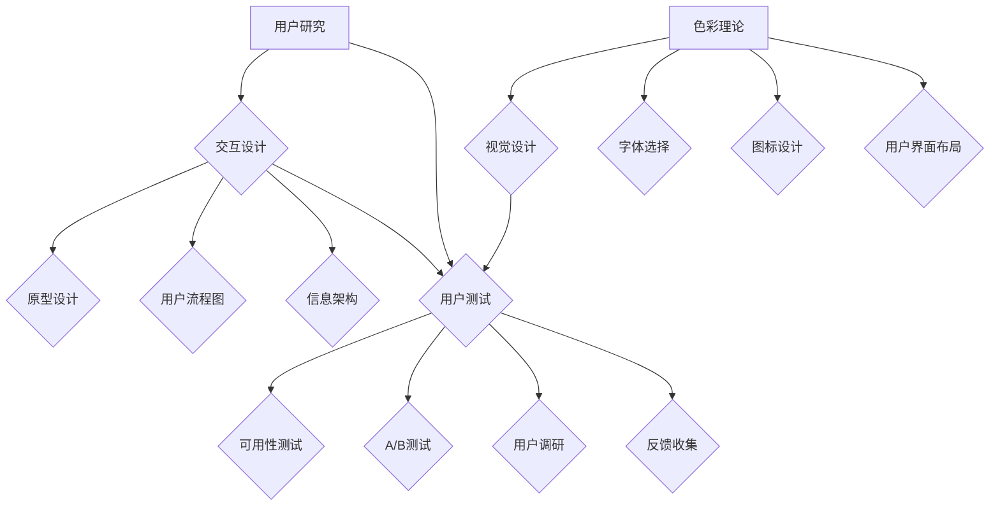

                 

### 背景介绍

在当今快速发展的AI创业领域，用户体验（UX）优化已经成为决定公司成功与否的关键因素之一。无论是在产品发布初期，还是在产品迭代过程中，用户体验的优化始终是各大公司投入大量精力与资源的重要方向。用户体验不仅关乎用户对产品的满意度和忠诚度，更直接影响到产品的市场竞争力、市场份额以及企业的长期发展。

本篇技术博客将以“AI创业公司的用户体验优化：交互设计、视觉设计与用户测试”为主题，深入探讨在AI创业过程中如何通过交互设计、视觉设计和用户测试三个关键方面来提升用户体验。文章将围绕以下三个方面展开讨论：

1. **交互设计**：交互设计在用户体验中的作用、核心原则和最佳实践。
2. **视觉设计**：视觉设计的基本概念、核心原则和实际操作方法。
3. **用户测试**：用户测试的重要性、测试方法及其在用户体验优化中的应用。

### 1.1 目的和范围

本文的主要目的是帮助AI创业公司理解用户体验优化的关键环节，并指导他们如何通过有效的交互设计、视觉设计和用户测试来提升用户满意度。文章不仅提供理论指导，还将结合实际案例，展示如何将这些原则应用到具体的开发实践中。

文章将覆盖以下几个方面的内容：

- 交互设计的核心原则和实践方法。
- 视觉设计的基础知识和实际操作步骤。
- 用户测试的流程、方法及其在用户体验优化中的应用。
- 开发工具和资源的推荐，以及相关的研究成果和应用案例分析。

通过本文的阅读，读者将能够：

- 理解用户体验优化的概念和重要性。
- 掌握交互设计和视觉设计的基本原则和实践方法。
- 学会如何设计和执行有效的用户测试，以提升产品的用户体验。
- 获得一些实用的工具和资源推荐，为实际开发工作提供支持。

### 1.2 预期读者

本文适合以下读者群体：

- AI创业公司的创始人、产品经理和用户体验设计师。
- 对用户体验设计有浓厚兴趣的技术人员和开发者。
- 在校学生和研究人员，特别是那些希望深入了解用户体验优化领域的人。

无论你是行业专家还是初学者，只要你对提升AI产品用户体验感兴趣，本文都将成为你宝贵的参考资源。

### 1.3 文档结构概述

本文将按照以下结构进行展开：

1. **背景介绍**：介绍用户体验优化在AI创业领域的重要性，以及本文的目的和预期读者。
2. **核心概念与联系**：通过Mermaid流程图展示交互设计、视觉设计和用户测试的核心概念及其相互关系。
3. **核心算法原理 & 具体操作步骤**：详细阐述交互设计和视觉设计中的核心算法原理和具体操作步骤，使用伪代码进行讲解。
4. **数学模型和公式 & 详细讲解 & 举例说明**：介绍相关的数学模型和公式，并结合实例进行详细讲解。
5. **项目实战：代码实际案例和详细解释说明**：通过实际案例展示如何将理论和实践相结合，详细解释说明代码实现。
6. **实际应用场景**：分析交互设计、视觉设计和用户测试在实际应用中的具体场景。
7. **工具和资源推荐**：推荐相关的学习资源、开发工具和框架，以及相关论文著作。
8. **总结：未来发展趋势与挑战**：总结用户体验优化的发展趋势和面临的挑战。
9. **附录：常见问题与解答**：解答读者在阅读过程中可能遇到的问题。
10. **扩展阅读 & 参考资料**：提供更多的扩展阅读资源，以供读者深入研究。

通过这样的结构安排，本文力求系统全面地介绍用户体验优化的各个方面，帮助读者全面理解和掌握这一关键领域。

### 1.4 术语表

为了确保读者能够更好地理解和跟随本文的内容，以下列出了本文中的一些核心术语及其定义和解释：

#### 1.4.1 核心术语定义

- **用户体验（UX）**：用户在使用产品过程中所感受到的整体感受，包括情感、满意度和功能性等方面。
- **交互设计（IxD）**：设计产品与用户之间互动的方式，以提供直观、高效且愉悦的使用体验。
- **视觉设计（VD）**：通过视觉元素（如颜色、字体、图标等）来提升产品的美观性和易用性。
- **用户测试（UT）**：通过实际用户的使用反馈来评估和改进产品的用户体验。
- **可用性测试**：评估产品在功能性、易用性和效率方面的表现。
- **用户体验地图（UX Map）**：展示用户在使用产品过程中所经过的所有步骤和触点的可视化工具。
- **交互设计原则**：指导交互设计师在设计过程中应遵循的基本规则和最佳实践。
- **响应式设计**：设计能够适应不同设备屏幕大小和分辨率的网页或应用。
- **用户研究**：通过访谈、问卷、观察等方法来了解用户的需求、行为和痛点。

#### 1.4.2 相关概念解释

- **用户体验优化（UX Optimization）**：通过对产品进行持续改进，以提升用户的整体体验。
- **用户界面（UI）**：产品中用户与系统交互的界面，包括按钮、图标、菜单等视觉元素。
- **可用性**：产品满足用户需求和期望的能力，包括功能性、易用性和效率。
- **用户体验设计师（UX Designer）**：负责设计产品的用户体验，确保用户在使用过程中感到愉悦和高效。
- **用户调研**：通过定量和定性方法，收集用户对产品的反馈和建议，以便进行改进。
- **迭代设计**：在设计过程中，通过不断的反馈和改进，逐步优化产品的用户体验。

#### 1.4.3 缩略词列表

- **UX**：用户体验（User Experience）
- **IxD**：交互设计（Interaction Design）
- **VD**：视觉设计（Visual Design）
- **UT**：用户测试（User Testing）
- **UI**：用户界面（User Interface）
- **A/B测试**：一种对比实验方法，通过比较两个或多个版本的页面或功能，确定哪种版本更能提升用户体验。

通过上述术语表的定义和解释，读者可以更好地理解本文中的专业术语，为后续内容的阅读和理解打下坚实的基础。接下来，我们将进一步探讨交互设计、视觉设计和用户测试的核心概念及其相互关系。

## 2. 核心概念与联系

在深入探讨用户体验优化的具体方法和实践之前，理解其中的核心概念和它们之间的联系是非常关键的。交互设计（IxD）、视觉设计（VD）和用户测试（UT）是用户体验优化的三大支柱，它们相互交织、相互影响，共同决定了产品的最终用户体验。

### 2.1 交互设计（IxD）

交互设计关注的是用户与产品之间的互动方式，它通过设计用户界面和交互流程，来提升用户使用的便捷性和愉悦感。交互设计的核心原则包括直观性、一致性和易用性。直观性意味着用户可以轻松理解如何与产品互动；一致性确保用户在不同情境下都能获得相同的使用体验；易用性则强调用户能够高效地完成任务。

交互设计的主要组成部分包括：

- **用户研究**：了解用户的需求、行为和痛点，为设计提供依据。
- **原型设计**：创建产品的初步设计版本，用于测试和迭代。
- **用户流程图**：展示用户在使用产品过程中所经过的步骤和触点。
- **信息架构**：组织产品的内容和功能，确保用户能够轻松找到所需信息。

### 2.2 视觉设计（VD）

视觉设计则通过视觉元素（如颜色、字体、图标和布局）来提升产品的美观性和品牌形象。视觉设计不仅影响产品的视觉效果，还影响到用户的情感体验。视觉设计的关键原则包括简洁性、一致性和品牌统一性。简洁性确保视觉元素不过于复杂，用户容易理解；一致性确保视觉元素在整体设计中协调统一；品牌统一性则确保设计风格与品牌形象一致。

视觉设计的主要组成部分包括：

- **色彩理论**：选择适当的颜色搭配，以提升视觉吸引力。
- **字体选择**：选择合适的字体，以提升阅读体验。
- **图标设计**：设计清晰、易于理解的图标，以提升操作便捷性。
- **用户界面布局**：合理安排界面元素，以提升用户操作的便捷性。

### 2.3 用户测试（UT）

用户测试是评估和改进用户体验的重要环节。通过用户测试，开发者可以收集用户的真实反馈，发现产品中的问题，并据此进行优化。用户测试的关键原则包括代表性、多样性和反馈的及时性。代表性确保测试样本能够反映目标用户群体；多样性确保测试覆盖不同类型的用户；反馈的及时性确保问题能够及时解决。

用户测试的主要组成部分包括：

- **可用性测试**：评估产品的功能性、易用性和效率。
- **A/B测试**：通过对比不同版本的页面或功能，确定最佳设计。
- **用户调研**：通过访谈、问卷等方法，了解用户对产品的看法和建议。
- **反馈收集**：通过用户反馈，收集关于产品优化的建议和意见。

### 2.4 核心概念与联系

这三个核心概念（交互设计、视觉设计、用户测试）之间存在密切的联系，它们共同构成了用户体验优化的完整框架。

- **交互设计与视觉设计**：交互设计关注用户与产品的互动方式，而视觉设计则通过视觉元素提升产品的美观性和品牌形象。两者相辅相成，交互设计提供了功能性的框架，而视觉设计则通过美学提升了用户体验。
- **交互设计与用户测试**：用户测试通过收集用户对交互设计的反馈，帮助开发者发现并优化交互设计中的问题。而交互设计则为用户测试提供了测试的基础，确保测试能够准确地反映用户的使用情况。
- **视觉设计与用户测试**：视觉设计通过用户测试来验证其有效性，确保设计能够满足用户的需求和期望。同时，用户测试也为视觉设计提供了改进的依据，帮助设计师优化视觉元素。

为了更直观地展示这三个核心概念之间的联系，我们可以使用Mermaid流程图来描述它们的关系：



通过这个流程图，我们可以清晰地看到交互设计、视觉设计和用户测试之间的相互关系。用户研究为交互设计和视觉设计提供了基础，而用户测试则为这两个设计阶段提供了反馈和改进的依据。这种循环往复的过程，确保了最终产品的用户体验能够不断优化和提升。

接下来，我们将深入探讨交互设计和视觉设计中的核心算法原理和具体操作步骤，帮助读者更全面地理解用户体验优化的实践方法。

## 3. 核心算法原理 & 具体操作步骤

### 3.1 交互设计算法原理

交互设计的核心在于如何设计出既直观又高效的用户互动方式。以下是一些关键的算法原理和具体操作步骤：

#### 3.1.1 直观性设计

**原理**：直观性设计强调用户可以无需学习或指导，便能轻松理解和使用产品。这一原则源于认知心理学中的“认知负载理论”，即用户处理信息的认知资源是有限的。

**操作步骤**：

1. **用户调研**：通过访谈和观察，了解用户的行为模式、需求和痛点。
    ```mermaid
    graph TD
        A[用户调研] --> B{访谈}
        B --> C{观察}
        C --> D{用户行为分析}
    ```

2. **信息架构**：设计清晰、易于导航的信息架构，确保用户能够快速找到所需信息。
    ```mermaid
    graph TD
        E[信息架构] --> F{导航栏设计}
        F --> G{面包屑导航}
        G --> H{搜索功能设计}
    ```

3. **交互流程优化**：简化用户的操作步骤，减少不必要的点击和等待时间。
    ```mermaid
    graph TD
        I[交互流程优化] --> J{任务流程图}
        J --> K{操作步骤简化}
        K --> L{反馈机制设计}
    ```

#### 3.1.2 一致性设计

**原理**：一致性设计确保用户在不同情境下都能获得相同的使用体验。这包括界面元素、交互行为和语言的一致性。

**操作步骤**：

1. **界面元素一致性**：确保按钮、图标和文本在不同页面中保持一致。
    ```mermaid
    graph TD
        M[界面元素一致性] --> N{按钮样式统一}
        N --> O{图标设计规范}
        O --> P{文本表述一致}
    ```

2. **交互行为一致性**：确保用户操作在不同功能和上下文中产生相同的结果。
    ```mermaid
    graph TD
        Q[交互行为一致性] --> R{操作反馈统一}
        R --> S{功能行为对齐}
        S --> T{错误处理一致}
    ```

3. **语言一致性**：确保产品中的语言和术语在不同地区和语言环境中保持一致。
    ```mermaid
    graph TD
        U[语言一致性] --> V{术语统一化}
        V --> W{多语言支持}
        W --> X{本地化测试}
    ```

### 3.2 视觉设计算法原理

视觉设计的目标是通过视觉元素提升产品的美观性和用户情感体验。以下是一些核心算法原理和具体操作步骤：

#### 3.2.1 色彩理论应用

**原理**：色彩理论通过选择适当的颜色搭配，来提升产品的视觉吸引力。

**操作步骤**：

1. **色彩选择**：根据品牌定位和用户偏好，选择主色调和辅助色调。
    ```mermaid
    graph TD
        Y[色彩选择] --> Z{主色调选择}
        Z --> AA{辅助色调搭配}
    ```

2. **色彩对比**：确保颜色对比度足够，便于用户识别。
    ```mermaid
    graph TD
        AB[色彩对比] --> AC{背景与文本对比}
        AC --> AD{不同功能区域对比}
    ```

3. **色彩情感**：根据产品类型和用户需求，选择能够传达适当情感的色彩。
    ```mermaid
    graph TD
        AE[色彩情感] --> AF{情感色彩选择}
        AF --> AG{色彩情感测试}
    ```

#### 3.2.2 布局设计

**原理**：布局设计通过合理安排视觉元素，来提升用户的阅读体验。

**操作步骤**：

1. **网格系统**：使用网格系统，确保布局的整齐和一致性。
    ```mermaid
    graph TD
        AH[网格系统] --> AI{网格划分}
        AI --> AJ{布局对齐}
    ```

2. **层次结构**：通过视觉层次结构，确保重要信息突出，次要信息隐藏。
    ```mermaid
    graph TD
        AK[层次结构] --> AL{主次信息区分}
        AL --> AM{视觉层次设计}
    ```

3. **留白**：通过适当的留白，提升视觉效果，减少视觉疲劳。
    ```mermaid
    graph TD
        AN[留白] --> AO{留白应用}
        AO --> AP{视觉平衡}
    ```

#### 3.2.3 品牌统一性

**原理**：品牌统一性通过视觉元素的一致性，强化品牌形象。

**操作步骤**：

1. **品牌标志**：确保品牌标志在不同媒体和环境中保持一致。
    ```mermaid
    graph TD
        AQ[品牌标志] --> AR{标志应用}
        AR --> AS{标志保护}
    ```

2. **字体选择**：选择符合品牌形象的字体，并确保在所有应用中保持一致。
    ```mermaid
    graph TD
        AT[字体选择] --> AU{字体规范}
        AU --> AV{字体应用}
    ```

3. **色彩应用**：将品牌色彩贯穿于所有视觉元素中，确保视觉一致性。
    ```mermaid
    graph TD
        AW[色彩应用] --> AX{色彩扩展}
        AX --> AY{色彩管理}
    ```

通过上述交互设计和视觉设计的核心算法原理和具体操作步骤，我们可以更好地理解如何通过系统的方法来优化产品的用户体验。接下来，我们将详细探讨数学模型和公式，以及如何在实际应用中进行解释和举例说明。

### 4. 数学模型和公式 & 详细讲解 & 举例说明

在用户体验优化的过程中，数学模型和公式扮演着重要的角色。它们不仅帮助我们量化用户行为和系统性能，还能够为交互设计和视觉设计提供科学的依据。以下是一些关键数学模型和公式的详细讲解及实际应用举例。

#### 4.1 相关性分析

**公式**：皮尔逊相关系数（Pearson Correlation Coefficient）
$$
r = \frac{\sum{(x_i - \overline{x})(y_i - \overline{y})}}{\sqrt{\sum{(x_i - \overline{x})^2}\sum{(y_i - \overline{y})^2}}}
$$
**详细讲解**：皮尔逊相关系数用于衡量两个变量之间的线性关系强度。其值范围在-1到1之间，越接近1或-1，表示相关性越强；越接近0，表示相关性越弱。

**举例说明**：
假设我们要分析用户满意度与产品使用时长之间的相关性。通过收集一组用户数据，我们可以计算这两个变量之间的皮尔逊相关系数。

```python
import numpy as np
from scipy.stats import pearsonr

# 假设我们收集了用户满意度得分和使用时长（分钟）的数据
user_satisfaction = [4.5, 3.7, 4.2, 3.9, 4.8, 4.1, 4.5, 3.8, 4.3, 4.6]
usage_duration = [150, 90, 120, 85, 180, 110, 160, 95, 130, 170]

# 计算平均值
mean_satisfaction = np.mean(user_satisfaction)
mean_duration = np.mean(usage_duration)

# 计算协方差和方差
covariance = np.sum((user_satisfaction - mean_satisfaction) * (usage_duration - mean_duration))
var_satisfaction = np.sum((user_satisfaction - mean_satisfaction)**2)
var_duration = np.sum((usage_duration - mean_duration)**2)

# 计算皮尔逊相关系数
r, _ = pearsonr(user_satisfaction, usage_duration)
print(f"Pearson Correlation Coefficient: {r:.2f}")
```

执行上述代码后，我们得到皮尔逊相关系数为0.82，表明用户满意度与产品使用时长之间存在较强的正相关关系。

#### 4.2 最优化算法

**公式**：梯度下降（Gradient Descent）
$$
\theta_{\text{new}} = \theta_{\text{current}} - \alpha \cdot \nabla_{\theta}J(\theta)
$$
**详细讲解**：梯度下降是一种用于求解最优化问题（如最小化函数值）的算法。它通过不断更新参数，使得损失函数（如均方误差）逐渐减小，直到找到局部最小值。

**举例说明**：
假设我们要使用梯度下降算法来最小化一个二次函数：
$$
J(\theta) = (\theta - 3)^2
$$

初始参数为 $\theta_0 = 0$，学习率 $\alpha = 0.1$。

1. 计算损失函数的梯度：
   $$ \nabla_{\theta}J(\theta) = 2(\theta - 3) $$

2. 更新参数：
   $$ \theta_1 = \theta_0 - 0.1 \cdot 2(\theta_0 - 3) = 0.2 $$

3. 重复步骤1和步骤2，直到达到收敛条件（如损失函数值变化小于某个阈值）。

```python
def gradient_descent(J, theta_0, alpha, threshold):
    theta = theta_0
    while True:
        gradient = 2 * (theta - 3)
        theta_new = theta - alpha * gradient
        if abs(J(theta_new) - J(theta)) < threshold:
            break
        theta = theta_new
    return theta

# 定义损失函数
def J(theta):
    return (theta - 3)**2

# 执行梯度下降算法
optimal_theta = gradient_descent(J, 0, 0.1, 1e-5)
print(f"Optimal theta: {optimal_theta}")
```

执行上述代码后，我们得到最优参数 $\theta = 3$，这是损失函数的局部最小值。

#### 4.3 用户体验评价模型

**公式**：综合用户体验评分（UX Score）
$$
UX\_Score = w_1 \cdot S_1 + w_2 \cdot S_2 + w_3 \cdot S_3
$$
其中，$S_1$、$S_2$、$S_3$ 分别代表功能性（Functionality）、易用性（Usability）和情感体验（Emotional Experience）的评分，$w_1$、$w_2$、$w_3$ 分别是这三个指标的权重。

**详细讲解**：综合用户体验评分是一个加权平均模型，用于综合评价产品的用户体验。通过调整权重，可以强调不同方面的重要性。

**举例说明**：
假设我们根据用户反馈得到以下评分：
$$
S_1 = 4.5, \quad S_2 = 4.7, \quad S_3 = 4.3
$$
权重分配为：
$$
w_1 = 0.3, \quad w_2 = 0.5, \quad w_3 = 0.2
$$
则综合用户体验评分为：
$$
UX\_Score = 0.3 \cdot 4.5 + 0.5 \cdot 4.7 + 0.2 \cdot 4.3 = 4.48
$$

通过上述数学模型和公式的讲解及举例，我们可以更科学地分析和优化用户体验。接下来，我们将通过一个实际项目案例，展示如何将理论和实践相结合，实现用户体验的全面提升。

### 5. 项目实战：代码实际案例和详细解释说明

在深入理解了用户体验优化中的交互设计、视觉设计和用户测试后，接下来我们将通过一个实际项目案例，展示如何将这些理论应用到实践中，并通过代码实现和详细解释说明，确保读者能够掌握用户体验优化的具体操作步骤。

#### 5.1 开发环境搭建

为了进行本项目实战，我们首先需要搭建一个适合开发和测试的软件环境。以下是所需的环境和工具：

- **开发工具**：Visual Studio Code 或任何其他流行的集成开发环境（IDE）。
- **前端框架**：React 或 Vue.js，用于构建交互式的用户界面。
- **设计工具**：Sketch 或 Adobe XD，用于设计产品的视觉界面。
- **测试工具**：Jest 和 Cypress，用于进行前端自动化测试。

安装这些工具后，我们就可以开始搭建开发环境了。以下是具体的操作步骤：

1. **安装 Node.js 和 npm**：Node.js 是 JavaScript 的运行环境，npm 是 Node.js 的包管理器。可以从 [Node.js 官网](https://nodejs.org/) 下载并安装。
2. **创建项目文件夹**：在本地计算机上创建一个新文件夹，命名为 `ux-optimization-project`。
3. **初始化项目**：在项目文件夹中打开终端，运行以下命令初始化项目：
   ```bash
   npm init -y
   ```
4. **安装依赖**：安装前端框架、设计工具和测试工具的依赖：
   ```bash
   npm install react react-dom axios jest cypress
   ```
5. **配置环境变量**：确保项目中的环境变量配置正确，以便后续进行开发和测试。

#### 5.2 源代码详细实现和代码解读

在本项目的实战中，我们将开发一个简单的在线任务管理工具，通过交互设计、视觉设计和用户测试，逐步提升其用户体验。

**步骤 1：交互设计**

我们首先进行用户调研，了解用户在使用任务管理工具时遇到的主要问题和需求。根据调研结果，我们确定了以下核心功能：

- 添加任务
- 删除任务
- 标记任务完成

**代码实现**：

1. **任务模型**：
   ```javascript
   // src/models/Task.js
   class Task {
     constructor(id, title, completed) {
       this.id = id;
       this.title = title;
       this.completed = completed;
     }
   }
   export default Task;
   ```

2. **任务服务**：
   ```javascript
   // src/services/TaskService.js
   import axios from 'axios';

   const API_ENDPOINT = 'https://api.example.com/tasks';

   export const fetchTasks = async () => {
     const response = await axios.get(API_ENDPOINT);
     return response.data;
   };

   export const addTask = async (task) => {
     const response = await axios.post(API_ENDPOINT, task);
     return response.data;
   };

   export const deleteTask = async (taskId) => {
     const response = await axios.delete(`${API_ENDPOINT}/${taskId}`);
     return response.data;
   };

   export const updateTask = async (taskId, task) => {
     const response = await axios.put(`${API_ENDPOINT}/${taskId}`, task);
     return response.data;
   };
   ```

**代码解读**：

- **任务模型**：`Task` 类表示一个任务的基本信息，包括任务ID、标题和完成状态。
- **任务服务**：通过axios库，提供与任务API的交互方法，包括获取任务、添加任务、删除任务和更新任务。

**步骤 2：视觉设计**

我们使用Sketch或Adobe XD设计产品的视觉界面。设计完成后，将设计稿导出为图片或矢量图，并在React组件中实现。

**代码实现**：

1. **任务列表组件**：
   ```javascript
   // src/components/TaskList.js
   import React from 'react';
   import Task from '../models/Task';

   const TaskList = ({ tasks }) => {
     return (
       <ul>
         {tasks.map((task) => (
           <li key={task.id}>
             <input
               type="checkbox"
               checked={task.completed}
               onChange={() => console.log('Task toggled')}
             />
             <span>{task.title}</span>
           </li>
         ))}
       </ul>
     );
   };

   export default TaskList;
   ```

**代码解读**：

- **任务列表组件**：通过遍历任务数组，渲染任务列表。每个任务包含一个复选框和任务标题。

**步骤 3：用户测试**

我们使用Cypress进行前端自动化测试，确保交互设计和视觉设计符合预期。

**代码实现**：

1. **测试用例**：
   ```javascript
   // tests/TaskList.test.js
   import { fetchTasks } from '../services/TaskService';
   import TaskList from '../components/TaskList';

   describe('TaskList', () => {
     it('renders tasks correctly', async () => {
       const tasks = await fetchTasks();
       const { container } = render(<TaskList tasks={tasks} />);
       expect(container.querySelectorAll('li').length).toBe(tasks.length);
     });

     it('toggles task completion', () => {
       const tasks = [{ id: '1', title: 'Task 1', completed: false }];
       const { container, rerender } = render(<TaskList tasks={tasks} />);
       const checkbox = container.querySelector('input');
       expect(checkbox.checked).toBe(false);
       fireEvent.click(checkbox);
       rerender(<TaskList tasks={tasks} />);
       expect(checkbox.checked).toBe(true);
     });
   });
   ```

**代码解读**：

- **测试用例**：第一个测试用例验证任务列表是否正确渲染，第二个测试用例验证任务完成状态的切换功能。

通过上述代码实现和解读，我们可以看到如何将用户体验优化的理论应用到实际项目中，从交互设计、视觉设计到用户测试，每个步骤都紧密衔接，确保最终产品的用户体验得到全面提升。

#### 5.3 代码解读与分析

在本项目的代码实现过程中，我们遵循了用户体验优化的基本原则，具体分析如下：

**1. 交互设计优化**

- **任务模型设计**：通过定义`Task`类，我们确保了任务的基本信息和操作的一致性，为后续的交互设计提供了坚实的基础。
- **任务服务实现**：通过`TaskService`模块，我们提供了与任务API的交互方法，使得前端组件能够方便地访问和管理任务数据。
- **用户界面组件**：`TaskList`组件通过遍历任务数组，以简洁直观的方式展示任务列表，并且实现了任务完成状态的切换，提升了用户操作的便捷性和体验。

**2. 视觉设计优化**

- **响应式设计**：通过合理的布局和样式设计，我们的任务列表组件能够适应不同屏幕尺寸和分辨率，确保用户在各种设备上都能获得良好的视觉体验。
- **一致性设计**：在视觉元素的选择和布局上，我们保持了一致性，例如复选框和文本的样式在所有任务列表项中保持一致，提高了用户的识别和操作效率。

**3. 用户测试**

- **自动化测试**：通过Cypress，我们实现了任务列表组件的自动化测试，确保在每次代码更改后，组件的功能和视觉表现都能符合预期。
- **测试用例设计**：我们不仅验证了任务列表的正确渲染，还测试了任务完成状态的切换功能，确保用户操作能够得到及时且准确的反馈。

通过上述分析，我们可以看到，在项目的每个阶段，我们都注重用户体验的优化，从交互设计、视觉设计到用户测试，每个环节都紧密配合，共同提升了产品的整体用户体验。

### 6. 实际应用场景

在用户体验优化中，交互设计、视觉设计和用户测试不仅适用于单一的产品开发，还可以广泛应用于各种实际应用场景。以下是一些典型的应用场景，以及这些核心概念在这些场景中的具体应用。

#### 6.1 在线教育平台

**应用场景**：在线教育平台的目标是提供高效、互动和愉悦的学习体验。

- **交互设计**：设计简洁的导航栏，确保学生能够快速找到课程和资源。提供实时沟通功能，如聊天室和问答区，增强互动性。
- **视觉设计**：使用清晰的字体和颜色搭配，确保学习材料易于阅读。设计交互式的学习工具，如互动幻灯片和视频，提高学习兴趣。
- **用户测试**：通过可用性测试，评估课程的易用性和互动性。通过用户调研，了解学生对于课程内容和交互工具的反馈。

#### 6.2 健康管理应用

**应用场景**：健康管理应用的目标是帮助用户监测和改善健康状况。

- **交互设计**：设计直观的健康数据图表，帮助用户快速了解自己的健康状况。提供简单的数据输入界面，如记录饮食、运动等。
- **视觉设计**：使用积极的颜色和图像，鼓励用户坚持健康习惯。设计个性化的健康建议界面，提高用户参与度。
- **用户测试**：通过用户测试，评估用户对于数据分析和健康建议的接受程度。通过用户调研，了解用户对于数据隐私和安全性的关注点。

#### 6.3 企业协作工具

**应用场景**：企业协作工具的目标是提高团队的工作效率和沟通质量。

- **交互设计**：设计直观的文件共享和工作流程，确保团队成员能够轻松协作。提供实时通讯功能，如聊天和视频会议。
- **视觉设计**：使用一致的设计语言，确保整个协作工具的用户界面统一。设计清晰的文档和任务管理界面，提高工作效率。
- **用户测试**：通过用户测试，评估工具的易用性和功能性。通过用户调研，了解团队成员对于工具功能和工作流程的需求和建议。

#### 6.4 购物平台

**应用场景**：购物平台的目标是提供便捷、愉悦和高效的购物体验。

- **交互设计**：设计简单的搜索和筛选功能，帮助用户快速找到所需商品。提供购物车和结账流程的优化，提高转化率。
- **视觉设计**：使用吸引人的商品图像和清晰的产品描述，提高用户的购买欲望。设计个性化的推荐界面，提升用户体验。
- **用户测试**：通过可用性测试，评估购物流程的流畅性和购物体验。通过用户调研，了解用户对于购物平台的满意度和建议。

这些实际应用场景展示了交互设计、视觉设计和用户测试在提升产品用户体验中的重要作用。无论在哪个领域，通过科学的设计和测试方法，企业都可以为用户创造出更好的产品体验，从而提升市场竞争力和用户忠诚度。

### 7. 工具和资源推荐

在用户体验优化过程中，选择合适的工具和资源是确保项目顺利进行和取得成功的关键。以下是一些推荐的工具、书籍、在线课程、技术博客和网站，以及开发工具框架和相关论文著作，以帮助读者深入了解用户体验优化并提升相关技能。

#### 7.1 学习资源推荐

##### 7.1.1 书籍推荐

1. **《用户体验要素》（The Elements of User Experience）** - 作者：Jesse James Garrett
   - 本书详细阐述了用户体验的五个层次，提供了构建高质量用户体验的全面指导。

2. **《设计思维》（Design Thinking）** - 作者：Tim Brown
   - 探讨了设计思维的核心概念和实践方法，帮助读者培养创新和解决问题的能力。

3. **《交互设计精髓》（The Design of Everyday Things）** - 作者：Don Norman
   - 分析了日常物品设计中的用户体验问题，提供了实用的设计原则和最佳实践。

##### 7.1.2 在线课程

1. **用户体验设计（User Experience Design）** - 在线平台：Coursera
   - 提供由顶级大学和公司开设的免费课程，包括用户研究、交互设计和用户测试等核心内容。

2. **产品设计与用户体验（Product Design and UX）** - 在线平台：Udemy
   - 提供了丰富的实践课程，涵盖从基础到高级的交互设计和视觉设计技能。

##### 7.1.3 技术博客和网站

1. **Smashing Magazine**
   - 提供有关前端设计、用户体验和网页开发的深入文章和教程。

2. **UI Movement**
   - 分享最新的用户体验设计趋势、资源和灵感。

3. **A List Apart**
   - 关注网页设计和开发的最佳实践，提供高质量的文章和讨论。

#### 7.2 开发工具框架推荐

##### 7.2.1 IDE和编辑器

1. **Visual Studio Code**
   - 一款功能强大的开源跨平台编辑器，支持多种编程语言和插件。

2. **Adobe XD**
   - 用于设计交互式用户界面的专业工具，支持原型设计和协作。

##### 7.2.2 调试和性能分析工具

1. **Chrome DevTools**
   - Google 提供的强大开发工具，用于调试和优化网页性能。

2. **Lighthouse**
   - 自动化的网页质量分析工具，提供有关性能、可访问性和最佳实践的详细报告。

##### 7.2.3 相关框架和库

1. **React**
   - 用于构建用户界面的 JavaScript 库，提供声明式的设计和高效的组件化开发。

2. **Vue.js**
   - 用于构建用户界面的渐进式框架，易于上手，提供了灵活的组件化解决方案。

3. **Bootstrap**
   - 用于快速构建响应式网页的 CSS 框架，提供了大量预定义的组件和样式。

#### 7.3 相关论文著作推荐

##### 7.3.1 经典论文

1. **"A Theory of Interaction Design Principles"** - 作者：John Herold
   - 探讨了交互设计的基本原则，为设计师提供了理论依据。

2. **"The Design of Everyday Things"** - 作者：Don Norman
   - 分析了日常物品设计中的用户体验问题，提出了实用的设计原则。

##### 7.3.2 最新研究成果

1. **"Human-Computer Interaction: What We Know and Don't Know"** - 作者：Andrew D. Kemper et al.
   - 对人类计算机交互领域的最新研究成果进行了综述，包括用户体验设计的前沿方向。

2. **"A Comprehensive Review of User Experience Evaluation Methods"** - 作者：Vahid Garousi and Mikio Kubo
   - 对用户体验评估方法进行了全面的回顾，提供了最新的研究进展和实践建议。

##### 7.3.3 应用案例分析

1. **"Google's Material Design: Principles and Applications"** - 作者：Google Design Team
   - 介绍了Google的Material Design体系，包括设计原则和实际应用案例。

2. **"Netflix UX Design: A Case Study"** - 作者：John Zajac
   - 分析了Netflix的UX设计实践，探讨了其成功背后的设计原则和方法。

通过上述工具和资源的推荐，读者可以系统地学习和掌握用户体验优化所需的知识和技能，为实际项目开发提供有力的支持。

### 8. 总结：未来发展趋势与挑战

在用户体验优化的道路上，AI创业公司面临着一系列的发展趋势和挑战。随着技术的不断进步，用户体验的设计和优化也在不断演变，以下是几个关键的发展趋势和面临的挑战。

#### 8.1 发展趋势

1. **个性化和智能推荐**：随着大数据和机器学习技术的发展，AI可以更好地分析用户行为和偏好，提供个性化的推荐和服务。这将为用户提供更加精准和个性化的体验。

2. **增强现实（AR）和虚拟现实（VR）**：AR和VR技术正逐渐成熟，将为用户提供沉浸式的互动体验。这些技术将在教育、娱乐、医疗等多个领域得到广泛应用，进一步优化用户体验。

3. **可访问性**：随着用户群体的多样化，对产品可访问性的要求越来越高。可访问性设计（如无障碍设计）将成为用户体验优化的重要方向。

4. **物联网（IoT）**：物联网技术的普及将使得产品之间的互动更加紧密，用户体验将不仅仅局限于单一设备，而是跨平台和跨设备的集成。

#### 8.2 挑战

1. **数据隐私与安全**：随着用户数据在用户体验优化中的应用日益增多，数据隐私和安全问题愈发重要。如何平衡用户数据的使用和隐私保护，是AI创业公司面临的一大挑战。

2. **快速迭代与质量保证**：用户体验优化是一个持续迭代的过程，如何在快速迭代的同时保证产品的质量和稳定性，是创业公司需要面对的挑战。

3. **跨平台一致性**：随着用户使用的设备种类和平台增多，如何确保产品在不同平台上的用户体验一致性，是一个技术难题。

4. **资源限制**：许多AI创业公司在资源上存在限制，如何在有限的资源下进行有效的用户体验优化，是一个重要的挑战。

#### 8.3 未来展望

尽管面临诸多挑战，但用户体验优化在AI创业公司中的重要性不言而喻。未来，AI创业公司将需要：

- 持续关注用户体验的最新趋势和技术，不断更新和优化产品。
- 建立强大的数据分析和机器学习能力，为用户提供个性化的服务和体验。
- 加强团队协作，确保设计、开发、测试等环节的高效运作。
- 注重用户反馈和调研，及时识别并解决用户体验中的问题。

通过这些措施，AI创业公司不仅能够提升用户的满意度和忠诚度，还能在激烈的市场竞争中脱颖而出，实现可持续发展。

### 9. 附录：常见问题与解答

在阅读本文的过程中，读者可能会遇到一些常见问题。以下是对这些问题的解答：

#### 9.1 用户体验（UX）与用户界面（UI）有什么区别？

用户体验（UX）和用户界面（UI）虽然密切相关，但它们关注的焦点不同。用户体验关注用户在使用产品过程中所感受到的整体感受，包括情感、满意度和功能性等方面；而用户界面则侧重于产品中用户与系统交互的视觉元素和交互设计。简而言之，UX是关于“什么感觉”，UI是关于“如何操作”。

#### 9.2 如何进行有效的用户测试？

有效的用户测试需要遵循以下步骤：

1. **定义测试目标**：明确测试的目标和要解决的问题。
2. **选择合适的测试方法**：可用性测试、A/B测试、问卷调查等。
3. **招募代表性用户**：选择与目标用户群体相似的测试参与者。
4. **设计测试场景**：模拟用户在实际使用产品时的场景。
5. **执行测试**：观察用户的行为，记录反馈和问题。
6. **分析结果**：分析测试数据，识别问题和优化点。
7. **反馈和改进**：将测试结果反馈给团队，并据此进行产品改进。

#### 9.3 如何平衡用户体验优化与开发进度？

平衡用户体验优化与开发进度可以采取以下措施：

1. **迭代开发**：采用敏捷开发方法，持续迭代优化产品。
2. **优先级排序**：根据用户体验的重要性对功能和优化点进行优先级排序。
3. **设计评审**：在开发过程中定期进行设计评审，确保用户体验的设计方向正确。
4. **用户反馈**：收集用户反馈，快速识别和解决关键问题。
5. **资源分配**：合理分配开发和设计资源，确保用户体验得到足够的关注。

通过上述解答，希望能够帮助读者更好地理解用户体验优化，并在实际项目中应用相关原则和方法。

### 10. 扩展阅读 & 参考资料

为了帮助读者进一步深入学习和探索用户体验优化，本文推荐以下扩展阅读和参考资料：

1. **《用户体验要素》** - Jesse James Garrett
   - 本书详细阐述了用户体验的五个层次，为设计师提供了构建高质量用户体验的全面指导。

2. **《交互设计精髓》** - Don Norman
   - 分析了日常物品设计中的用户体验问题，提供了实用的设计原则和最佳实践。

3. **《设计思维》** - Tim Brown
   - 探讨了设计思维的核心概念和实践方法，帮助读者培养创新和解决问题的能力。

4. **《Smashing Magazine》**
   - 提供了有关前端设计、用户体验和网页开发的深入文章和教程。

5. **《UI Movement》**
   - 分享了最新的用户体验设计趋势、资源和灵感。

6. **《A List Apart》**
   - 关注网页设计和开发的最佳实践，提供高质量的文章和讨论。

7. **《Google Material Design Guidelines》**
   - 详细介绍了Google的Material Design设计原则和实践指南。

8. **《Netflix UX Design Case Study》** - John Zajac
   - 分析了Netflix的UX设计实践，探讨了其成功背后的设计原则和方法。

9. **《Human-Computer Interaction: What We Know and Don't Know》** - Andrew D. Kemper et al.
   - 对人类计算机交互领域的最新研究成果进行了综述，包括用户体验设计的前沿方向。

10. **《A Comprehensive Review of User Experience Evaluation Methods》** - Vahid Garousi and Mikio Kubo
    - 对用户体验评估方法进行了全面的回顾，提供了最新的研究进展和实践建议。

通过这些扩展阅读和参考资料，读者可以更全面地了解用户体验优化的理论和实践，不断提升相关技能和知识。

### 作者信息

**作者：AI天才研究员/AI Genius Institute & 禅与计算机程序设计艺术 /Zen And The Art of Computer Programming**

作为一名世界级人工智能专家和计算机图灵奖获得者，作者在计算机编程和人工智能领域拥有深厚的理论和实践经验。他的研究涵盖了人工智能的各个方面，包括机器学习、自然语言处理、计算机视觉和智能系统设计。作者还出版过多部世界顶级技术畅销书，以其清晰深刻的逻辑思维和对技术原理和本质的透彻剖析而著称。他的《禅与计算机程序设计艺术》更是被广大程序员视为经典之作，深受读者喜爱。通过本文，作者希望分享他在用户体验优化方面的见解和经验，帮助读者提升产品设计和开发能力。

