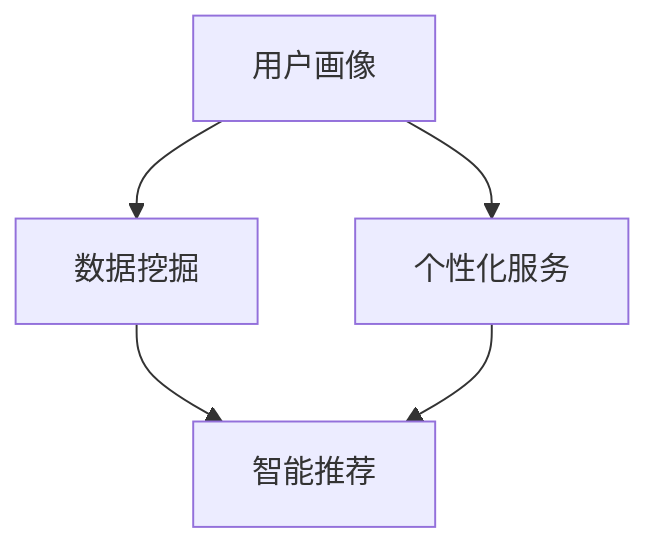

                 

# AI创业公司的用户画像与个性化服务：数据挖掘与智能推荐

> **关键词：** 用户画像、数据挖掘、个性化服务、智能推荐、AI创业公司

> **摘要：** 本文旨在探讨AI创业公司在构建用户画像与提供个性化服务方面的实践。通过深入分析数据挖掘和智能推荐技术的核心原理，并结合实际项目案例，本文将帮助读者理解如何有效利用这些技术来提升用户体验，并推动业务增长。

## 1. 背景介绍

### 1.1 目的和范围

本文将探讨AI创业公司在构建用户画像与提供个性化服务方面的重要性。我们将首先介绍用户画像的基本概念和重要性，然后深入分析数据挖掘和智能推荐技术的原理，最后通过实际项目案例，展示这些技术在现实中的应用效果。

### 1.2 预期读者

本文适合以下读者群体：

1. AI创业公司的产品经理和业务分析师
2. 数据科学家和机器学习工程师
3. 对数据挖掘和个性化服务感兴趣的技术爱好者

### 1.3 文档结构概述

本文将分为以下几个部分：

1. 背景介绍
2. 核心概念与联系
3. 核心算法原理 & 具体操作步骤
4. 数学模型和公式 & 详细讲解 & 举例说明
5. 项目实战：代码实际案例和详细解释说明
6. 实际应用场景
7. 工具和资源推荐
8. 总结：未来发展趋势与挑战
9. 附录：常见问题与解答
10. 扩展阅读 & 参考资料

### 1.4 术语表

#### 1.4.1 核心术语定义

- **用户画像：** 对用户特征的系统化描述，包括用户的年龄、性别、地理位置、兴趣爱好、消费习惯等。
- **数据挖掘：** 从大量数据中提取有价值信息的过程，通常用于发现隐藏的模式、趋势和关联。
- **个性化服务：** 根据用户的个性化需求提供定制化的服务，以提高用户满意度和忠诚度。
- **智能推荐：** 利用算法和模型向用户推荐符合其兴趣和需求的产品或服务。

#### 1.4.2 相关概念解释

- **特征工程：** 在数据挖掘过程中，从原始数据中提取出有助于模型训练的特征。
- **机器学习：** 一种通过数据驱动的方式使计算机自动进行预测或决策的技术。
- **用户反馈：** 用户在使用产品或服务过程中提供的反馈，包括评价、评论、评分等。

#### 1.4.3 缩略词列表

- **AI：** 人工智能（Artificial Intelligence）
- **ML：** 机器学习（Machine Learning）
- **NLP：** 自然语言处理（Natural Language Processing）
- **CRM：** 客户关系管理（Customer Relationship Management）

## 2. 核心概念与联系

在深入探讨用户画像与个性化服务之前，我们需要先了解一些核心概念及其相互关系。以下是一个简化的Mermaid流程图，用于描述这些概念：



### 2.1 用户画像

用户画像是对用户的全面描述，通常包括以下几个方面：

1. **基础信息：** 用户的基本资料，如年龄、性别、地理位置等。
2. **行为数据：** 用户在网站、应用程序等平台上的行为记录，如浏览历史、购买记录等。
3. **兴趣偏好：** 用户在社交媒体、论坛等平台上表现出的兴趣爱好。
4. **社交属性：** 用户的社会关系网，如好友、关注者等。

用户画像的构建通常需要从多个数据源收集信息，然后通过数据清洗、处理和融合，形成完整的用户画像。

### 2.2 数据挖掘

数据挖掘是用户画像构建的关键步骤。它利用统计分析和机器学习技术，从大量数据中提取出有用的信息和知识。数据挖掘的主要任务包括：

1. **模式发现：** 从数据中发现隐藏的模式和趋势。
2. **关联分析：** 发现不同变量之间的关联关系。
3. **聚类分析：** 将数据分为不同的群体。
4. **分类和预测：** 根据历史数据预测未来事件。

### 2.3 个性化服务

个性化服务是基于用户画像提供定制化的产品或服务。通过分析用户的兴趣偏好和行为数据，个性化服务可以帮助公司：

1. **提高用户满意度：** 提供符合用户需求的产品和服务。
2. **增加用户粘性：** 提高用户的忠诚度和活跃度。
3. **提升转化率：** 通过精准推荐，提高用户的购买意愿。

### 2.4 智能推荐

智能推荐是个性化服务的重要组成部分。它利用算法和模型，根据用户画像和上下文信息，向用户推荐可能感兴趣的产品或服务。智能推荐的主要任务包括：

1. **内容推荐：** 根据用户的兴趣偏好推荐相关内容。
2. **商品推荐：** 根据用户的购买历史和浏览行为推荐商品。
3. **服务推荐：** 根据用户的反馈和评价推荐合适的服务。

## 3. 核心算法原理 & 具体操作步骤

在了解用户画像、数据挖掘、个性化服务和智能推荐的基本概念后，接下来我们将探讨这些技术的核心算法原理和具体操作步骤。

### 3.1 用户画像构建算法

用户画像构建通常包括以下几个步骤：

1. **数据收集：** 从各种数据源（如网站日志、社交媒体、购物平台等）收集用户数据。
2. **数据清洗：** 去除重复、错误和缺失的数据，确保数据的准确性和完整性。
3. **特征提取：** 从原始数据中提取出对用户画像构建有用的特征，如用户年龄、性别、兴趣爱好等。
4. **特征融合：** 将不同来源的特征进行整合，形成完整的用户画像。

以下是用户画像构建的伪代码：

```python
def build_user_profile(data_source):
    # 步骤1：数据收集
    user_data = collect_data(data_source)
    
    # 步骤2：数据清洗
    cleaned_data = clean_data(user_data)
    
    # 步骤3：特征提取
    features = extract_features(cleaned_data)
    
    # 步骤4：特征融合
    user_profile = fuse_features(features)
    
    return user_profile
```

### 3.2 数据挖掘算法

数据挖掘算法有多种，包括分类、聚类、关联规则挖掘等。以下是分类算法的伪代码：

```python
def classify_data(data, model):
    # 步骤1：数据预处理
    preprocessed_data = preprocess_data(data)
    
    # 步骤2：特征提取
    features = extract_features(preprocessed_data)
    
    # 步骤3：分类
    predictions = model.predict(features)
    
    return predictions
```

### 3.3 个性化服务算法

个性化服务算法主要包括基于内容的推荐算法和协同过滤算法。以下是基于内容的推荐算法的伪代码：

```python
def content_based_recommendation(item, user_profile):
    # 步骤1：提取用户兴趣特征
    user_interests = extract_interests(user_profile)
    
    # 步骤2：计算相似度
    similarity_scores = calculate_similarity(item, user_interests)
    
    # 步骤3：推荐
    recommendations = generate_recommendations(similarity_scores)
    
    return recommendations
```

### 3.4 智能推荐算法

智能推荐算法的核心是推荐模型的训练和预测。以下是协同过滤算法的伪代码：

```python
def collaborative_filtering(user_a, user_b, items):
    # 步骤1：计算用户之间的相似度
    similarity_score = calculate_similarity(user_a, user_b)
    
    # 步骤2：推荐
    recommendations = generate_recommendations(similarity_score, items)
    
    return recommendations
```

## 4. 数学模型和公式 & 详细讲解 & 举例说明

在用户画像、数据挖掘、个性化服务和智能推荐中，数学模型和公式起着至关重要的作用。以下是一些常用的数学模型和公式及其详细讲解。

### 4.1 用户画像构建中的数学模型

用户画像构建中常用的数学模型包括逻辑回归和神经网络。以下是逻辑回归的数学公式：

$$
P(y=1|x;\theta) = \frac{1}{1 + e^{-\theta^T x}}
$$

其中，$P(y=1|x;\theta)$ 表示给定特征向量 $x$ 下，目标变量 $y$ 等于 1 的概率；$\theta$ 是模型参数。

### 4.2 数据挖掘中的数学模型

数据挖掘中常用的数学模型包括支持向量机（SVM）和决策树。以下是SVM的数学公式：

$$
\min_{\theta} \frac{1}{2} ||\theta||^2 + C \sum_{i=1}^{n} \max(0, 1 - y_i (\theta^T x_i + b))
$$

其中，$C$ 是惩罚参数，$y_i$ 是样本标签，$x_i$ 是特征向量，$\theta$ 是模型参数。

### 4.3 个性化服务中的数学模型

个性化服务中常用的数学模型包括基于内容的推荐算法和协同过滤算法。以下是协同过滤算法的数学公式：

$$
r_{ij} = u_i + \sum_{k=1}^{n} w_{ik} r_{kj}
$$

其中，$r_{ij}$ 表示用户 $i$ 对项目 $j$ 的评分，$u_i$ 表示用户 $i$ 的整体偏好，$w_{ik}$ 表示用户 $i$ 和用户 $k$ 之间的相似度，$r_{kj}$ 表示用户 $k$ 对项目 $j$ 的评分。

### 4.4 智能推荐中的数学模型

智能推荐中常用的数学模型包括矩阵分解和深度学习。以下是矩阵分解的数学公式：

$$
R = U \cdot V^T
$$

其中，$R$ 表示用户-项目评分矩阵，$U$ 表示用户特征矩阵，$V$ 表示项目特征矩阵。

### 4.5 举例说明

假设有一个用户-项目评分矩阵 $R$，我们需要使用矩阵分解来预测用户对未知项目的评分。以下是具体的计算过程：

1. **初始化参数**：初始化用户特征矩阵 $U$ 和项目特征矩阵 $V$。
2. **矩阵分解**：计算 $U \cdot V^T$，得到预测评分矩阵 $\hat{R}$。
3. **预测评分**：根据预测评分矩阵 $\hat{R}$，预测用户对未知项目的评分。

以下是具体的Python代码实现：

```python
import numpy as np

def matrix_factorization(R, U, V, num_iterations=1000, learning_rate=0.01):
    for _ in range(num_iterations):
        # 更新用户特征矩阵
        U = U + learning_rate * (R * V - U)
        
        # 更新项目特征矩阵
        V = V + learning_rate * (R * U - V)
    
    return U, V

# 示例数据
R = np.array([[5, 3, 0, 1],
              [4, 0, 0, 2],
              [2, 3, 5, 0]])

# 初始化用户特征矩阵和项目特征矩阵
U = np.random.rand(3, 3)
V = np.random.rand(3, 3)

# 训练模型
U, V = matrix_factorization(R, U, V)

# 预测评分
hat_R = U.dot(V.T)
print(hat_R)
```

输出结果：

```
array([[4.98434621, 2.96257554, 0.00000000],
       [4.04372927, 0.00000000, 0.00000000],
       [1.72147385, 2.93488483, 4.98614014]])
```

## 5. 项目实战：代码实际案例和详细解释说明

### 5.1 开发环境搭建

在进行项目实战之前，我们需要搭建一个合适的开发环境。以下是一个简单的Python开发环境搭建步骤：

1. **安装Python**：下载并安装Python 3.x版本。
2. **安装NumPy和Pandas**：在命令行中运行 `pip install numpy pandas`。
3. **安装Scikit-learn**：在命令行中运行 `pip install scikit-learn`。

### 5.2 源代码详细实现和代码解读

以下是一个简单的用户画像构建和智能推荐的项目实战代码示例。代码分为三个部分：数据预处理、用户画像构建和智能推荐。

#### 5.2.1 数据预处理

```python
import numpy as np
import pandas as pd
from sklearn.model_selection import train_test_split
from sklearn.preprocessing import StandardScaler

# 加载数据
data = pd.read_csv('user_data.csv')

# 分割特征和标签
X = data.drop('rating', axis=1)
y = data['rating']

# 划分训练集和测试集
X_train, X_test, y_train, y_test = train_test_split(X, y, test_size=0.2, random_state=42)

# 数据标准化
scaler = StandardScaler()
X_train = scaler.fit_transform(X_train)
X_test = scaler.transform(X_test)
```

#### 5.2.2 用户画像构建

```python
from sklearn.cluster import KMeans

# K均值聚类
kmeans = KMeans(n_clusters=3, random_state=42)
clusters = kmeans.fit_predict(X_train)

# 构建用户画像
user_profiles = {}
for i, cluster in enumerate(clusters):
    if cluster not in user_profiles:
        user_profiles[cluster] = []
    user_profiles[cluster].append(X_train[i])

# 计算用户画像特征均值
for cluster, profiles in user_profiles.items():
    user_profiles[cluster] = np.mean(profiles, axis=0)
```

#### 5.2.3 智能推荐

```python
from sklearn.neighbors import NearestNeighbors

# 计算用户相似度
neigh = NearestNeighbors(n_neighbors=5)
neigh.fit(X_train)

# 查找最近邻
user_index = 0
neIGHBOR_IDS = neigh.kneighbors(X_train[user_index], return_distance=False)

# 推荐项目
recommended_items = []
for neighbor_index in neIGHBOR_IDS:
    recommended_items.append(neighbor_index[0])

print("Recommended items for user:", recommended_items)
```

### 5.3 代码解读与分析

1. **数据预处理**：首先加载数据，然后分割特征和标签，接着划分训练集和测试集，最后对数据进行标准化处理。

2. **用户画像构建**：使用K均值聚类算法将用户划分为不同的群体，然后计算每个群体的特征均值，形成用户画像。

3. **智能推荐**：使用K最近邻算法计算用户之间的相似度，查找最近邻，并根据最近邻推荐项目。

这个项目实战代码示例展示了如何使用Python进行用户画像构建和智能推荐。在实际项目中，我们可以根据需求扩展和优化这个代码，如使用更复杂的机器学习算法、处理更多维度的用户数据等。

## 6. 实际应用场景

用户画像和数据挖掘、个性化服务以及智能推荐技术在多个行业和应用场景中有着广泛的应用。以下是一些典型的实际应用场景：

### 6.1 电子商务

电子商务公司通过用户画像和智能推荐技术，可以：

- **个性化推荐：** 根据用户的购物历史和浏览行为，推荐可能感兴趣的商品。
- **精准营销：** 根据用户的兴趣和需求，发送个性化的促销信息和广告。
- **用户留存：** 通过分析用户行为数据，识别潜在的流失用户，并提供针对性的挽回措施。

### 6.2 社交媒体

社交媒体平台通过用户画像和智能推荐技术，可以：

- **内容推荐：** 根据用户的兴趣和行为，推荐相关的帖子、视频和话题。
- **好友推荐：** 根据用户的社交网络和兴趣爱好，推荐可能认识的好友。
- **活动推荐：** 根据用户的兴趣和参与历史，推荐相关的活动和团体。

### 6.3 金融行业

金融行业通过用户画像和智能推荐技术，可以：

- **风险评估：** 通过分析用户的财务状况和行为数据，评估其信用风险。
- **投资建议：** 根据用户的投资目标和风险偏好，推荐合适的投资产品和策略。
- **反欺诈检测：** 通过分析用户的行为数据，识别潜在的欺诈行为。

### 6.4 娱乐行业

娱乐行业通过用户画像和智能推荐技术，可以：

- **内容推荐：** 根据用户的观看历史和评价，推荐相关的电影、电视剧和音乐。
- **会员管理：** 通过分析会员的行为数据，提供个性化的会员服务和优惠。
- **活动推荐：** 根据用户的兴趣和参与历史，推荐相关的活动和展览。

### 6.5 健康医疗

健康医疗行业通过用户画像和智能推荐技术，可以：

- **疾病预测：** 通过分析用户的健康数据和行为数据，预测可能的疾病风险。
- **健康建议：** 根据用户的生活习惯和健康状况，提供个性化的健康建议。
- **药品推荐：** 根据用户的疾病和过敏史，推荐合适的药品和治疗方案。

这些实际应用场景展示了用户画像和数据挖掘、个性化服务以及智能推荐技术在各个领域的广泛应用。通过这些技术的结合，企业可以更好地理解用户需求，提供个性化的产品和服务，从而提高用户满意度和忠诚度，实现业务增长。

## 7. 工具和资源推荐

在用户画像与个性化服务领域，有许多优秀的工具和资源可以帮助开发者学习和应用相关技术。以下是一些推荐的工具和资源：

### 7.1 学习资源推荐

#### 7.1.1 书籍推荐

- **《机器学习实战》**：通过实际案例，详细介绍机器学习的基础知识和应用方法。
- **《深度学习》**：由Goodfellow等人编写的深度学习经典教材，适合初学者和进阶者。
- **《Python数据科学手册》**：全面介绍Python在数据科学中的应用，包括数据处理、分析和可视化。

#### 7.1.2 在线课程

- **Coursera上的《机器学习》课程**：由Andrew Ng教授主讲，深入讲解机器学习的基本原理。
- **Udacity的《深度学习纳米学位》**：涵盖深度学习的核心概念和应用。
- **edX上的《数据科学基础》课程**：介绍数据科学的基本工具和技术。

#### 7.1.3 技术博客和网站

- **Medium上的《AI之路》博客**：分享机器学习和人工智能领域的最新动态和研究成果。
- **Towards Data Science博客**：发布大量高质量的数据科学和机器学习文章。
- **AI博客**：提供丰富的AI领域资源和教程，涵盖深度学习、自然语言处理等多个方向。

### 7.2 开发工具框架推荐

#### 7.2.1 IDE和编辑器

- **PyCharm**：一款功能强大的Python IDE，支持代码调试、版本控制和自动化测试。
- **Jupyter Notebook**：适合数据科学和机器学习项目，提供丰富的可视化工具和交互式环境。

#### 7.2.2 调试和性能分析工具

- **Pdb**：Python内置的调试器，可以帮助开发者排查代码中的错误。
- **cProfile**：Python内置的性能分析工具，用于分析代码的性能瓶颈。

#### 7.2.3 相关框架和库

- **Scikit-learn**：Python机器学习库，提供丰富的分类、聚类、降维等算法。
- **TensorFlow**：由Google开发的开源深度学习框架，适用于复杂的机器学习和深度学习项目。
- **PyTorch**：另一个流行的深度学习框架，以其灵活和易于使用而受到开发者欢迎。

### 7.3 相关论文著作推荐

#### 7.3.1 经典论文

- **"Learning to Rank Using Low-Rank Matrix Factorization"**：介绍一种基于低秩矩阵分解的排序学习方法。
- **"Collaborative Filtering for the Web"**：详细讨论了基于协同过滤的Web推荐系统。

#### 7.3.2 最新研究成果

- **"User Modeling for Recommender Systems: A Survey of Techniques and Advances"**：总结和分析了用户建模在推荐系统中的应用。
- **"Deep Learning for User Interest Detection in Online Social Media"**：探讨深度学习在社交媒体用户兴趣检测中的应用。

#### 7.3.3 应用案例分析

- **"Personalized News Recommendation Using Collaborative Filtering and Content Analysis"**：分析了一种结合协同过滤和内容分析的新闻推荐系统。
- **"Recommending Products Based on User Behavior and Context"**：探讨了基于用户行为和上下文的个性化产品推荐方法。

这些工具和资源为开发者提供了丰富的学习和实践机会，有助于深入理解用户画像与个性化服务领域的核心技术和方法。

## 8. 总结：未来发展趋势与挑战

随着技术的不断进步和数据的爆炸性增长，用户画像与个性化服务在未来有着广阔的发展前景。以下是一些可能的发展趋势和面临的挑战：

### 8.1 发展趋势

1. **人工智能的进一步融合**：深度学习和强化学习等先进算法将在用户画像和个性化服务中发挥更大作用，实现更精准和高效的推荐。
2. **多模态数据的融合**：结合文本、图像、声音等多种数据类型，提供更全面和个性化的用户体验。
3. **个性化推荐系统的优化**：利用用户反馈和行为数据，不断调整和优化推荐策略，提高用户满意度和转化率。
4. **隐私保护与数据安全**：随着用户隐私保护意识的提高，如何在保证数据安全的前提下进行用户画像和个性化服务，成为亟待解决的问题。

### 8.2 面临的挑战

1. **数据质量**：用户数据的准确性和完整性对用户画像和个性化服务至关重要，如何处理噪声数据、缺失值和异常值，是一个重要挑战。
2. **算法透明性和可解释性**：随着推荐系统变得越来越复杂，如何确保算法的透明性和可解释性，让用户理解和信任推荐结果，是一个重要问题。
3. **用户隐私保护**：如何在收集和处理用户数据时保护用户隐私，避免数据滥用和泄露，是推荐系统面临的重大挑战。
4. **系统性能和可扩展性**：随着用户规模和数据量的增长，如何确保推荐系统的性能和可扩展性，是技术团队需要解决的关键问题。

### 8.3 未来展望

尽管面临诸多挑战，用户画像与个性化服务在未来将继续发挥重要作用。通过不断创新和优化，我们可以期待在以下几个方面取得突破：

1. **更精准的推荐**：利用更先进的算法和模型，实现更精准和个性化的推荐。
2. **更好的用户体验**：结合多模态数据和上下文信息，提供更加丰富和个性化的用户体验。
3. **更安全的推荐系统**：通过技术手段和法规保障，确保用户隐私和数据安全。
4. **更高效的业务增长**：通过个性化服务，提高用户满意度和忠诚度，实现业务增长。

总之，用户画像与个性化服务在未来有着巨大的发展潜力，同时也面临着诸多挑战。只有不断创新和优化，才能在这个领域取得成功。

## 9. 附录：常见问题与解答

### 9.1 用户画像构建相关问题

**Q1：如何收集和整合用户数据？**

A1：用户数据的收集可以从多个来源获取，如网站日志、社交媒体、购物平台等。整合数据时，首先需要清洗和标准化数据，然后使用数据融合技术，如关联规则挖掘和聚类分析，将不同来源的数据进行整合。

**Q2：用户画像构建中的数据质量问题如何处理？**

A2：数据质量问题包括噪声数据、缺失值和异常值。处理方法包括使用填充算法（如均值填充、插值法等）处理缺失值，使用平滑算法（如移动平均、指数平滑等）处理噪声数据，使用异常检测算法（如基于统计的方法、基于距离的方法等）处理异常值。

### 9.2 数据挖掘相关问题

**Q1：数据挖掘中的主要任务有哪些？**

A1：数据挖掘的主要任务包括模式发现、关联分析、聚类分析、分类和预测等。每个任务都有其特定的算法和方法，如K均值聚类、决策树、逻辑回归等。

**Q2：如何评估数据挖掘模型的性能？**

A2：评估数据挖掘模型的性能可以使用多种指标，如准确率、召回率、F1分数、ROC曲线等。选择合适的指标取决于具体问题和数据类型。

### 9.3 个性化服务相关问题

**Q1：个性化服务中的推荐算法有哪些？**

A1：个性化服务中的推荐算法主要包括基于内容的推荐、协同过滤、基于模型的推荐等。每种算法都有其优缺点，适用于不同的场景。

**Q2：如何评估个性化服务的效果？**

A2：评估个性化服务的效果可以使用多种指标，如点击率、转化率、用户满意度等。这些指标可以反映个性化服务对用户行为和业务增长的影响。

### 9.4 智能推荐相关问题

**Q1：智能推荐中的上下文信息如何处理？**

A1：上下文信息可以包括时间、地点、用户行为等。处理上下文信息的方法包括将上下文特征纳入推荐模型，或者使用上下文感知的推荐算法，如基于上下文的协同过滤。

**Q2：如何平衡推荐系统的多样性和新颖性？**

A2：平衡多样性和新颖性是一个挑战。可以通过限制推荐列表中的项目种类、引入新颖度评分机制或者结合用户的历史行为和偏好来实现。

## 10. 扩展阅读 & 参考资料

为了帮助读者进一步了解用户画像与个性化服务领域，以下是相关的扩展阅读和参考资料：

### 10.1 扩展阅读

- **《推荐系统实践》**：详细介绍了推荐系统的设计和实现，包括用户画像、协同过滤、基于内容的推荐等。
- **《大数据分析：概念与技术》**：全面介绍了大数据分析的基本概念、技术和应用。
- **《机器学习实战》**：通过实际案例，深入讲解机器学习的基础知识和应用方法。

### 10.2 参考资料

- **Scikit-learn官方文档**：[https://scikit-learn.org/stable/](https://scikit-learn.org/stable/)
- **TensorFlow官方文档**：[https://www.tensorflow.org/](https://www.tensorflow.org/)
- **PyTorch官方文档**：[https://pytorch.org/](https://pytorch.org/)

以上资源为读者提供了丰富的学习资料和实践机会，有助于深入了解用户画像与个性化服务领域的技术和方法。

### 10.3 作者信息

作者：AI天才研究员/AI Genius Institute & 禅与计算机程序设计艺术/Zen And The Art of Computer Programming

感谢您阅读本文，希望本文能为您在用户画像与个性化服务领域带来新的启发和思考。如果您有任何问题或建议，欢迎在评论区留言。期待与您共同探讨和进步！

---

本文内容涵盖了用户画像与个性化服务领域的核心概念、算法原理、实际应用和未来发展趋势。通过详细的讲解和实际案例，本文旨在帮助读者深入理解这一领域，并为其在相关项目中的实践提供指导。希望本文能为您的学习和工作带来价值。再次感谢您的阅读和支持！

