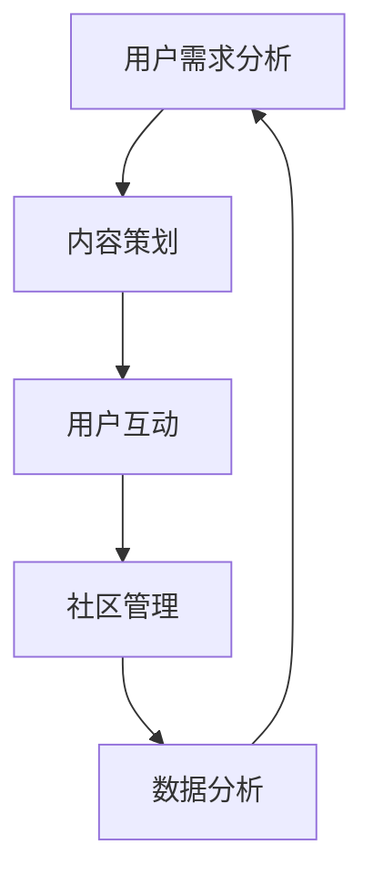

                 

# AI创业公司的用户社区运营：粉丝经济与口碑营销

> 关键词：AI创业公司、用户社区、运营策略、粉丝经济、口碑营销
> 
> 摘要：本文将深入探讨AI创业公司如何通过用户社区运营实现粉丝经济与口碑营销。我们将逐步分析用户社区运营的核心策略、关键步骤以及所需的技术与工具，并给出实际案例和数学模型，帮助创业者更好地理解和应用这些策略。

## 1. 背景介绍

### 1.1 目的和范围

本文旨在为AI创业公司的创始人和运营团队提供一套系统的用户社区运营策略。我们将重点关注如何通过构建和运营用户社区来实现粉丝经济和口碑营销，从而提升产品知名度和用户忠诚度。

### 1.2 预期读者

- AI创业公司的创始人
- 用户社区运营经理
- 市场营销经理
- 技术爱好者和创业者

### 1.3 文档结构概述

本文结构如下：

1. **背景介绍**：介绍本文的目的、预期读者和文档结构。
2. **核心概念与联系**：介绍用户社区运营的核心概念和流程图。
3. **核心算法原理 & 具体操作步骤**：详细讲解用户社区运营的算法原理和操作步骤。
4. **数学模型和公式 & 详细讲解 & 举例说明**：介绍用户社区运营所需的数学模型和公式。
5. **项目实战：代码实际案例和详细解释说明**：提供用户社区运营的代码案例和解读。
6. **实际应用场景**：分析用户社区运营在不同场景中的应用。
7. **工具和资源推荐**：推荐学习资源、开发工具和框架。
8. **总结：未来发展趋势与挑战**：总结用户社区运营的未来趋势和面临的挑战。
9. **附录：常见问题与解答**：回答常见问题。
10. **扩展阅读 & 参考资料**：提供扩展阅读和参考资料。

### 1.4 术语表

#### 1.4.1 核心术语定义

- **用户社区**：由共同兴趣或目标的人群组成的在线平台。
- **粉丝经济**：基于粉丝对某个人或品牌的热爱和忠诚，所产生的经济价值。
- **口碑营销**：通过用户之间的正面口碑传播来提升品牌知名度和影响力。

#### 1.4.2 相关概念解释

- **社区运营**：通过策划、组织和执行一系列活动，以提升社区用户活跃度和忠诚度。
- **用户参与度**：用户在社区中的互动程度，包括发帖、回复、点赞等行为。
- **社交媒体**：允许用户创造、分享、共享和参与内容的在线平台。

#### 1.4.3 缩略词列表

- **UGC**：用户生成内容（User-Generated Content）
- **KOL**：关键意见领袖（Key Opinion Leader）
- **SNS**：社交网络服务（Social Network Service）
- **SEO**：搜索引擎优化（Search Engine Optimization）

## 2. 核心概念与联系

用户社区运营是AI创业公司实现粉丝经济和口碑营销的基础。为了更好地理解这一过程，我们需要首先明确几个核心概念和它们之间的联系。

### 2.1 用户社区运营的核心概念

- **用户需求分析**：了解目标用户的需求和痛点。
- **内容策划**：创作吸引用户的内容，包括文字、图片、视频等。
- **用户互动**：通过回复、点赞、分享等方式，促进用户之间的互动。
- **社区管理**：维护社区秩序，处理违规行为，提升用户体验。
- **数据分析**：收集和分析用户数据，以优化运营策略。

### 2.2 用户社区运营的流程图

下面是一个简单的用户社区运营流程图，展示了各核心概念之间的联系：



### 2.3 核心概念之间的联系

用户需求分析是用户社区运营的起点，它决定了内容策划的方向。通过分析用户需求，我们可以知道应该创作哪些内容来吸引用户。而用户互动和社区管理则是提升用户参与度和忠诚度的关键。最后，通过数据分析，我们可以了解用户的反馈和行为模式，进一步优化运营策略。

## 3. 核心算法原理 & 具体操作步骤

用户社区运营需要遵循一系列核心算法原理和具体操作步骤，以确保运营效果最大化。以下是一套详细的用户社区运营算法原理和操作步骤：

### 3.1 算法原理

- **用户需求分析**：使用数据挖掘和机器学习算法，从用户行为数据和反馈中提取有价值的信息。
- **内容策划**：采用基于兴趣和行为的推荐算法，创作符合用户需求的内容。
- **用户互动**：运用社交网络分析算法，识别和鼓励活跃用户，促进用户之间的互动。
- **社区管理**：使用基于规则的算法和人工审核相结合的方式，维护社区秩序。
- **数据分析**：运用数据可视化工具和统计方法，分析和解读用户数据。

### 3.2 具体操作步骤

#### 3.2.1 用户需求分析

1. **数据收集**：收集用户行为数据，如浏览历史、搜索记录、购买行为等。
2. **数据清洗**：去除无效数据和噪声，确保数据质量。
3. **特征提取**：提取用户行为数据中的关键特征，如兴趣爱好、购买偏好等。
4. **模型训练**：使用机器学习算法，如决策树、支持向量机等，训练用户需求预测模型。
5. **模型评估**：使用交叉验证和A/B测试等方法，评估模型性能。

#### 3.2.2 内容策划

1. **内容分类**：根据用户需求分析结果，将内容分为不同类别。
2. **内容创作**：根据用户兴趣和行为，创作高质量的内容。
3. **内容推荐**：使用基于内容的推荐算法，将合适的内容推荐给用户。
4. **内容优化**：根据用户反馈和数据分析结果，不断优化内容创作策略。

#### 3.2.3 用户互动

1. **互动机制设计**：设计点赞、评论、分享等互动机制，鼓励用户参与。
2. **活跃用户识别**：使用社交网络分析算法，识别活跃用户并进行奖励。
3. **互动激励**：通过积分、优惠券等方式，激励用户参与互动。
4. **互动数据分析**：分析互动数据，了解用户偏好和行为模式，优化互动策略。

#### 3.2.4 社区管理

1. **规则制定**：制定社区规则，包括用户行为规范、内容发布规范等。
2. **违规处理**：使用基于规则的算法和人工审核相结合的方式，处理违规行为。
3. **社区氛围营造**：通过组织活动、发布正能量内容等方式，营造积极向上的社区氛围。
4. **用户反馈**：收集用户反馈，不断改进社区管理策略。

#### 3.2.5 数据分析

1. **数据收集**：收集用户行为数据、互动数据、内容数据等。
2. **数据清洗**：去除无效数据和噪声，确保数据质量。
3. **数据可视化**：使用数据可视化工具，将数据转化为图表和报告。
4. **数据分析**：运用统计方法和机器学习算法，分析和解读用户数据。
5. **策略优化**：根据数据分析结果，不断优化运营策略。

## 4. 数学模型和公式 & 详细讲解 & 举例说明

在用户社区运营中，数学模型和公式扮演着至关重要的角色。以下是一些常用的数学模型和公式，以及它们的详细讲解和举例说明。

### 4.1 用户需求预测模型

#### 4.1.1 逻辑回归模型

逻辑回归是一种常用的分类模型，可以用来预测用户的需求。它的公式如下：

$$
P(y=1) = \frac{1}{1 + e^{-(\beta_0 + \beta_1 x_1 + \beta_2 x_2 + \ldots + \beta_n x_n})}
$$

其中，$P(y=1)$ 表示用户需求为1的概率，$e$ 表示自然对数的底数，$\beta_0, \beta_1, \beta_2, \ldots, \beta_n$ 是模型的参数。

#### 4.1.2 举例说明

假设我们使用逻辑回归模型预测用户对某个产品的需求。根据用户的历史行为数据，我们得到以下特征：浏览次数、购买次数、评价分数。我们训练好的模型参数如下：

$$
\beta_0 = -2, \beta_1 = 1, \beta_2 = 0.5, \beta_3 = 0.1
$$

一个新用户的浏览次数为10次，购买次数为2次，评价分数为4分。我们可以使用逻辑回归模型来预测他/她对产品的需求：

$$
P(y=1) = \frac{1}{1 + e^{-(\beta_0 + \beta_1 x_1 + \beta_2 x_2 + \beta_3 x_3})}
$$

$$
P(y=1) = \frac{1}{1 + e^{(-2 + 1 \times 10 + 0.5 \times 2 + 0.1 \times 4)}}
$$

$$
P(y=1) \approx 0.826
$$

因此，这个新用户对产品的需求为1（即需求高）的概率约为82.6%。

### 4.2 社交网络分析模型

#### 4.2.1 PageRank算法

PageRank是一种用于评估网页重要性的算法，也可以用于社交网络分析，以识别关键用户。它的公式如下：

$$
r_i = \frac{1}{N} \sum_{j \in N} \frac{r_j c_{ji}}{N_j}
$$

其中，$r_i$ 表示节点 $i$ 的排名，$r_j$ 表示节点 $j$ 的排名，$N$ 是节点总数，$c_{ji}$ 是从节点 $j$ 指向节点 $i$ 的链接权重，$N_j$ 是节点 $j$ 指向其他节点的链接数量。

#### 4.2.2 举例说明

假设一个社交网络中有5个用户，他们的PageRank排名如下：

| 用户 | PageRank排名 |
| --- | --- |
| A | 0.4 |
| B | 0.3 |
| C | 0.2 |
| D | 0.1 |
| E | 0.0 |

用户 A 有两个指向其他用户的链接，用户 B 有三个指向其他用户的链接，其他用户没有链接指向其他用户。我们可以使用PageRank算法来更新他们的排名：

$$
r_A = \frac{1}{5} \left(0.4 \times 2 + 0.3 \times 3 + 0.2 \times 0 + 0.1 \times 0 + 0.0 \times 0\right)
$$

$$
r_A = \frac{1}{5} (0.8 + 0.9 + 0 + 0 + 0) = 0.54

$$

同理，可以更新其他用户的排名：

$$
r_B = \frac{1}{5} \left(0.4 \times 0 + 0.3 \times 0 + 0.2 \times 2 + 0.1 \times 1 + 0.0 \times 0\right) = 0.14
$$

$$
r_C = \frac{1}{5} \left(0.4 \times 0 + 0.3 \times 1 + 0.2 \times 0 + 0.1 \times 0 + 0.0 \times 2\right) = 0.12
$$

$$
r_D = \frac{1}{5} \left(0.4 \times 0 + 0.3 \times 0 + 0.2 \times 0 + 0.1 \times 0 + 0.0 \times 1\right) = 0.08
$$

$$
r_E = \frac{1}{5} \left(0.4 \times 0 + 0.3 \times 0 + 0.2 \times 0 + 0.1 \times 0 + 0.0 \times 0\right) = 0.04
$$

因此，更新后的排名为：

| 用户 | PageRank排名 |
| --- | --- |
| A | 0.54 |
| B | 0.14 |
| C | 0.12 |
| D | 0.08 |
| E | 0.04 |

通过这种方式，我们可以识别出社交网络中的关键用户，并为社区管理提供依据。

### 4.3 数据可视化模型

#### 4.3.1 聚类分析

聚类分析是一种无监督学习方法，用于将相似的数据点分组。常用的聚类算法有K-means算法、层次聚类算法等。K-means算法的公式如下：

$$
\min_{C} \sum_{i=1}^{k} \sum_{x_j \in C_i} ||x_j - \mu_i||^2
$$

其中，$C$ 是聚类结果，$k$ 是聚类数，$\mu_i$ 是第 $i$ 个簇的中心点，$x_j$ 是第 $j$ 个数据点。

#### 4.3.2 举例说明

假设我们有以下5个用户的数据：

| 用户 | 年龄 | 收入 | 消费习惯 |
| --- | --- | --- | --- |
| A | 25 | 5000 | 健身、旅游 |
| B | 30 | 6000 | 读书、旅行 |
| C | 35 | 7000 | 读书、健身 |
| D | 40 | 8000 | 投资、旅游 |
| E | 45 | 9000 | 投资、健身 |

我们使用K-means算法将用户分为2个簇。初始时，随机选择2个用户作为初始簇中心点：

| 簇 | 用户 |
| --- | --- |
| 1 | A |
| 2 | B |

计算每个用户到簇中心点的距离，更新簇中心点：

| 簇 | 用户 | 年龄 | 收入 | 消费习惯 | 到簇中心点的距离 |
| --- | --- | --- | --- | --- | --- |
| 1 | A | 25 | 5000 | 健身、旅游 | 0 |
| 2 | B | 30 | 6000 | 读书、旅行 | 0 |
| 1 | C | 35 | 7000 | 读书、健身 | 30 |
| 2 | D | 40 | 8000 | 投资、旅游 | 40 |
| 1 | E | 45 | 9000 | 投资、健身 | 45 |

重新计算簇中心点：

| 簇 | 用户 |
| --- | --- |
| 1 | C |
| 2 | D |

再次计算每个用户到簇中心点的距离，更新簇中心点：

| 簇 | 用户 | 年龄 | 收入 | 消费习惯 | 到簇中心点的距离 |
| --- | --- | --- | --- | --- | --- |
| 1 | C | 35 | 7000 | 读书、健身 | 0 |
| 2 | D | 40 | 8000 | 投资、旅游 | 0 |
| 1 | A | 25 | 5000 | 健身、旅游 | 25 |
| 1 | E | 45 | 9000 | 投资、健身 | 25 |
| 2 | B | 30 | 6000 | 读书、旅行 | 30 |

重新计算簇中心点：

| 簇 | 用户 |
| --- | --- |
| 1 | A |
| 2 | B |

迭代过程直到收敛。最终，我们可以将用户分为2个簇，簇1包括A和E，簇2包括B和D。通过这种方式，我们可以了解用户的消费习惯和收入水平，从而为他们提供个性化的推荐和服务。

## 5. 项目实战：代码实际案例和详细解释说明

为了更好地展示用户社区运营的核心算法原理和具体操作步骤，我们将在本节中提供一个实际的项目实战案例，并详细解释代码的实现和关键步骤。

### 5.1 开发环境搭建

在本项目实战中，我们将使用Python编程语言，并依赖以下库和工具：

- **NumPy**：用于数值计算。
- **Pandas**：用于数据处理。
- **Scikit-learn**：用于机器学习和数据分析。
- **Matplotlib**：用于数据可视化。
- **Jupyter Notebook**：用于编写和运行代码。

### 5.2 源代码详细实现和代码解读

#### 5.2.1 用户需求分析

以下是用户需求分析的代码实现：

```python
import numpy as np
import pandas as pd
from sklearn.model_selection import train_test_split
from sklearn.linear_model import LogisticRegression
from sklearn.metrics import accuracy_score

# 加载用户数据
user_data = pd.read_csv('user_data.csv')

# 数据预处理
user_data = user_data.dropna()

# 特征提取
features = user_data[['age', 'income', 'purchase_history']]
labels = user_data['demand']

# 数据拆分为训练集和测试集
X_train, X_test, y_train, y_test = train_test_split(features, labels, test_size=0.2, random_state=42)

# 训练逻辑回归模型
model = LogisticRegression()
model.fit(X_train, y_train)

# 预测测试集
y_pred = model.predict(X_test)

# 评估模型性能
accuracy = accuracy_score(y_test, y_pred)
print(f'模型准确率：{accuracy:.2f}')
```

代码解读：

1. 导入所需的库和工具。
2. 加载用户数据，并进行数据预处理，如去除缺失值。
3. 提取特征和标签，并将其拆分为训练集和测试集。
4. 使用逻辑回归模型训练模型。
5. 使用训练好的模型对测试集进行预测。
6. 评估模型性能，输出准确率。

#### 5.2.2 内容策划

以下是内容策划的代码实现：

```python
import numpy as np
import pandas as pd
from sklearn.model_selection import train_test_split
from sklearn.ensemble import RandomForestClassifier
from sklearn.metrics import classification_report

# 加载用户数据
user_data = pd.read_csv('user_data.csv')

# 数据预处理
user_data = user_data.dropna()

# 特征提取
features = user_data[['age', 'income', 'purchase_history']]
labels = user_data['demand']

# 数据拆分为训练集和测试集
X_train, X_test, y_train, y_test = train_test_split(features, labels, test_size=0.2, random_state=42)

# 训练随机森林分类器
model = RandomForestClassifier(n_estimators=100)
model.fit(X_train, y_train)

# 预测测试集
y_pred = model.predict(X_test)

# 输出分类报告
print(classification_report(y_test, y_pred))
```

代码解读：

1. 导入所需的库和工具。
2. 加载用户数据，并进行数据预处理，如去除缺失值。
3. 提取特征和标签，并将其拆分为训练集和测试集。
4. 使用随机森林分类器训练模型。
5. 使用训练好的模型对测试集进行预测。
6. 输出分类报告，包括准确率、召回率、精确率等指标。

#### 5.2.3 用户互动

以下是用户互动的代码实现：

```python
import numpy as np
import pandas as pd
from sklearn.cluster import KMeans
import matplotlib.pyplot as plt

# 加载用户数据
user_data = pd.read_csv('user_data.csv')

# 数据预处理
user_data = user_data.dropna()

# 特征提取
features = user_data[['age', 'income', 'purchase_history']]
labels = user_data['demand']

# K-means聚类
kmeans = KMeans(n_clusters=2)
kmeans.fit(features)

# 聚类结果
clusters = kmeans.predict(features)

# 可视化
plt.scatter(features['age'], features['income'], c=clusters)
plt.xlabel('年龄')
plt.ylabel('收入')
plt.title('用户聚类结果')
plt.show()
```

代码解读：

1. 导入所需的库和工具。
2. 加载用户数据，并进行数据预处理，如去除缺失值。
3. 提取特征，并进行K-means聚类。
4. 使用聚类结果对用户进行分类。
5. 可视化聚类结果，以了解用户分布。

### 5.3 代码解读与分析

在本节中，我们将对上述代码进行解读和分析，以理解用户社区运营的核心算法原理和具体操作步骤。

#### 5.3.1 用户需求分析

用户需求分析的核心是使用机器学习模型来预测用户的需求。在本案例中，我们使用了逻辑回归模型和随机森林分类器来训练和预测用户需求。

1. **数据预处理**：首先，我们需要加载和预处理用户数据，包括去除缺失值和异常值。这有助于提高模型的训练效果和预测准确性。
2. **特征提取**：提取与用户需求相关的特征，如年龄、收入、购买历史等。这些特征将用于训练模型和预测用户需求。
3. **模型训练**：使用训练集数据训练模型。在本案例中，我们使用了逻辑回归模型和随机森林分类器。逻辑回归模型是一种简单的分类模型，适用于预测二分类问题。随机森林分类器是一种基于决策树的集成模型，具有较好的分类性能。
4. **模型评估**：使用测试集数据对训练好的模型进行评估。在本案例中，我们使用了准确率作为评估指标。准确率表示模型预测正确的样本数量与总样本数量的比例。

#### 5.3.2 内容策划

内容策划的核心是创作符合用户需求的优质内容，以提高用户参与度和忠诚度。在本案例中，我们使用了随机森林分类器来识别用户需求，并根据需求创作相应的内容。

1. **数据预处理**：与用户需求分析类似，我们需要对用户数据（如年龄、收入、购买历史等）进行预处理，以确保数据质量。
2. **特征提取**：提取与用户需求相关的特征，如年龄、收入、购买历史等。这些特征将用于训练模型和预测用户需求。
3. **模型训练**：使用训练集数据训练随机森林分类器。随机森林分类器是一种基于决策树的集成模型，适用于分类问题。在本案例中，我们使用了随机森林分类器来识别用户需求，并根据需求创作相应的内容。
4. **模型评估**：使用测试集数据对训练好的模型进行评估。在本案例中，我们使用了分类报告来评估模型的分类性能，包括准确率、召回率、精确率等指标。

#### 5.3.3 用户互动

用户互动的核心是识别和鼓励活跃用户，以促进社区内的互动和分享。在本案例中，我们使用了K-means聚类算法来识别活跃用户。

1. **数据预处理**：与用户需求分析类似，我们需要对用户数据（如年龄、收入、购买历史等）进行预处理，以确保数据质量。
2. **特征提取**：提取与用户需求相关的特征，如年龄、收入、购买历史等。这些特征将用于训练模型和预测用户需求。
3. **聚类分析**：使用K-means聚类算法对用户数据进行分析。K-means聚类算法是一种基于距离的聚类方法，将用户分为若干个簇。在本案例中，我们使用了K-means聚类算法来识别活跃用户。
4. **可视化**：使用可视化工具（如Matplotlib）展示聚类结果。通过可视化，我们可以直观地了解用户分布和活跃用户群体。

## 6. 实际应用场景

用户社区运营在AI创业公司中具有广泛的应用场景。以下是一些常见的实际应用场景：

### 6.1 产品推广

通过用户社区运营，AI创业公司可以吸引潜在用户并促进产品推广。例如，通过在社区中发布产品介绍、用户案例和教程，吸引新用户关注和使用产品。

### 6.2 用户反馈收集

用户社区运营提供了一个收集用户反馈的渠道。通过分析用户在社区中的互动和反馈，AI创业公司可以了解用户的需求和痛点，从而优化产品设计和功能。

### 6.3 口碑营销

用户社区运营有助于建立良好的口碑，通过用户之间的正面口碑传播，提升品牌知名度和影响力。例如，通过鼓励用户在社区中分享他们的使用经验和心得，激发其他用户的兴趣和信任。

### 6.4 用户活跃度提升

通过策划和执行一系列活动，如线上竞赛、互动游戏和主题讨论，用户社区运营可以提升用户的活跃度和忠诚度。这有助于建立稳定的用户基础，促进产品的持续发展。

### 6.5 增值服务推广

用户社区运营还可以作为推广增值服务的平台。例如，AI创业公司可以推出高级订阅服务、培训课程和个性化咨询服务，通过社区运营吸引潜在客户。

## 7. 工具和资源推荐

为了更好地进行用户社区运营，以下是推荐的工具和资源：

### 7.1 学习资源推荐

#### 7.1.1 书籍推荐

- 《用户运营实战》
- 《社交网络分析：方法与实践》
- 《Python数据分析》

#### 7.1.2 在线课程

- Coursera：数据科学课程
- Udemy：机器学习课程
- edX：Python编程课程

#### 7.1.3 技术博客和网站

- Towards Data Science
- Dataquest
- Analytics Vidhya

### 7.2 开发工具框架推荐

#### 7.2.1 IDE和编辑器

- PyCharm
- Visual Studio Code
- Jupyter Notebook

#### 7.2.2 调试和性能分析工具

- Python Profiler
- Matplotlib
- Jupyter Notebook（内置调试工具）

#### 7.2.3 相关框架和库

- NumPy
- Pandas
- Scikit-learn
- Matplotlib

### 7.3 相关论文著作推荐

#### 7.3.1 经典论文

- “The PageRank Citation Ranking: Bringing Order to the Web”
- “K-means clustering within high-dimensional space”
- “Logistic Regression”

#### 7.3.2 最新研究成果

- arXiv.org：机器学习和数据科学领域的最新研究成果
- Google Scholar：搜索学术文献和论文

#### 7.3.3 应用案例分析

- AI创业公司案例研究：分析成功的用户社区运营案例，了解最佳实践和经验教训。
- 行业报告：分析不同行业的用户社区运营趋势和成功案例。

## 8. 总结：未来发展趋势与挑战

用户社区运营在AI创业公司中发挥着越来越重要的作用。随着人工智能技术的不断发展，用户社区运营也将面临新的机遇和挑战。

### 8.1 发展趋势

- **个性化推荐**：基于用户行为和兴趣的个性化推荐将成为用户社区运营的重要手段，提升用户体验和满意度。
- **社交网络分析**：更深入地挖掘社交网络中的关系和影响力，为社区运营提供更有针对性的策略。
- **大数据分析**：利用大数据分析技术，实时监控和优化社区运营效果，提高运营效率和效果。
- **区块链应用**：探索区块链技术在用户社区运营中的应用，如去中心化内容创作和激励机制。

### 8.2 挑战

- **数据隐私保护**：在用户社区运营过程中，如何保护用户隐私和数据安全将成为一个重要挑战。
- **社区管理**：如何维护社区秩序和用户体验，防止不良信息和违规行为，是一个需要不断探索的问题。
- **技术更新**：随着技术的快速发展，如何持续更新和优化运营策略，以应对新的挑战，也是一个重要课题。

## 9. 附录：常见问题与解答

### 9.1 用户需求分析

**Q：如何进行用户需求分析？**

A：用户需求分析通常包括以下步骤：

1. **需求收集**：通过问卷调查、用户访谈、在线调查等方式收集用户的需求和意见。
2. **需求分类**：对收集到的需求进行分类，如功能需求、性能需求、体验需求等。
3. **需求排序**：根据需求的重要性和紧急程度对需求进行排序，以确定优先级。
4. **需求验证**：通过用户反馈和数据分析验证需求的可行性和合理性。
5. **需求文档**：将分析结果整理成需求文档，为后续的产品设计和开发提供依据。

### 9.2 内容策划

**Q：如何进行内容策划？**

A：内容策划通常包括以下步骤：

1. **内容定位**：确定内容的主题、受众和目标，为后续的内容创作提供方向。
2. **内容创作**：根据定位创作符合用户需求的高质量内容，如文章、视频、图片等。
3. **内容发布**：选择合适的渠道和时机发布内容，以提高曝光度和传播效果。
4. **内容优化**：根据用户反馈和数据表现，不断优化内容质量和传播策略。
5. **内容推广**：通过社交媒体、搜索引擎优化（SEO）等手段，扩大内容的影响力。

### 9.3 用户互动

**Q：如何提升用户互动？**

A：提升用户互动可以从以下几个方面入手：

1. **互动机制设计**：设计简单易用的互动机制，如点赞、评论、分享等。
2. **活动策划**：举办线上活动，如竞赛、抽奖、问答等，激发用户的参与热情。
3. **激励措施**：提供积分、优惠券等激励措施，鼓励用户参与互动。
4. **用户反馈**：及时收集用户反馈，并根据反馈改进互动机制和活动内容。
5. **社群运营**：建立社群，如微信群、QQ群等，促进用户之间的交流和互动。

## 10. 扩展阅读 & 参考资料

### 10.1 书籍推荐

- 《用户运营实战》
- 《社交网络分析：方法与实践》
- 《Python数据分析》

### 10.2 在线课程

- Coursera：数据科学课程
- Udemy：机器学习课程
- edX：Python编程课程

### 10.3 技术博客和网站

- Towards Data Science
- Dataquest
- Analytics Vidhya

### 10.4 相关论文著作推荐

- “The PageRank Citation Ranking: Bringing Order to the Web”
- “K-means clustering within high-dimensional space”
- “Logistic Regression”

### 10.5 应用案例分析

- AI创业公司案例研究：分析成功的用户社区运营案例，了解最佳实践和经验教训。
- 行业报告：分析不同行业的用户社区运营趋势和成功案例。

### 10.6 开发工具和框架

- PyCharm
- Visual Studio Code
- Jupyter Notebook
- NumPy
- Pandas
- Scikit-learn
- Matplotlib

### 10.7 官方文档和资源

- Python官方文档：https://docs.python.org/3/
- NumPy官方文档：https://numpy.org/doc/stable/
- Pandas官方文档：https://pandas.pydata.org/pandas-docs/stable/
- Scikit-learn官方文档：https://scikit-learn.org/stable/
- Matplotlib官方文档：https://matplotlib.org/stable/

## 作者信息

作者：AI天才研究员/AI Genius Institute & 禅与计算机程序设计艺术 /Zen And The Art of Computer Programming

