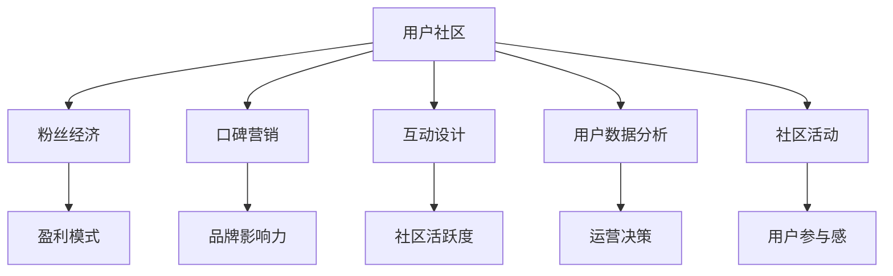

                 

# AI创业公司的用户社区运营：粉丝经济与口碑营销

> 关键词：用户社区运营、粉丝经济、口碑营销、AI创业公司、互动设计、数据分析

> 摘要：本文将深入探讨AI创业公司如何利用用户社区运营策略，实现粉丝经济和口碑营销。通过系统的分析互动设计、用户数据分析、社区活动策划等关键环节，结合实际案例，为创业公司提供可操作性的运营指南。

## 1. 背景介绍

### 1.1 目的和范围

本文旨在为AI创业公司提供一套完整的用户社区运营策略，帮助公司利用粉丝经济和口碑营销，打造一个活跃、有影响力的用户社区。文章将围绕以下几个核心议题展开讨论：

1. 用户社区运营的意义和目标。
2. 互动设计的策略和最佳实践。
3. 用户数据分析和利用。
4. 社区活动的策划与执行。
5. 粉丝经济和口碑营销的实践案例。

### 1.2 预期读者

本文预期读者为AI创业公司的产品经理、运营经理、市场营销人员以及相关的技术团队。希望读者能通过本文，获得关于用户社区运营的深入理解和实践指导。

### 1.3 文档结构概述

本文分为十个部分：

1. 背景介绍
2. 核心概念与联系
3. 核心算法原理 & 具体操作步骤
4. 数学模型和公式 & 详细讲解 & 举例说明
5. 项目实战：代码实际案例和详细解释说明
6. 实际应用场景
7. 工具和资源推荐
8. 总结：未来发展趋势与挑战
9. 附录：常见问题与解答
10. 扩展阅读 & 参考资料

### 1.4 术语表

#### 1.4.1 核心术语定义

- **用户社区**：由共享相同兴趣或需求的用户组成的在线社交网络。
- **粉丝经济**：利用粉丝对品牌的忠诚度，通过粉丝的传播和消费行为，实现品牌价值增长的经济模式。
- **口碑营销**：通过用户之间的正面评价和推荐，增加品牌认知度和影响力的营销策略。
- **互动设计**：通过设计有吸引力的互动内容和机制，促进用户参与和社区活跃。

#### 1.4.2 相关概念解释

- **用户数据分析**：通过收集、处理和分析用户行为数据，了解用户需求和行为模式。
- **社区活动**：在用户社区中组织的线上或线下活动，以增加用户互动和品牌曝光。
- **KOL（Key Opinion Leader）**：关键意见领袖，能够在特定领域内对其他用户产生影响力的人物。

#### 1.4.3 缩略词列表

- **AI**：人工智能
- **KPI**：关键绩效指标
- **SEO**：搜索引擎优化
- **SEM**：搜索引擎营销

## 2. 核心概念与联系

为了更好地理解用户社区运营，我们首先需要明确几个核心概念之间的联系。

### 2.1 用户社区与粉丝经济

用户社区是粉丝经济的基础。通过建立一个有吸引力的社区，创业公司可以吸引并留住大量的粉丝。粉丝经济则利用这些粉丝的忠诚度，通过多样化的盈利模式（如周边产品销售、付费内容订阅等）实现商业价值。

### 2.2 用户社区与口碑营销

用户社区是口碑营销的重要载体。在用户社区中，用户之间的互动和评价可以直接影响其他潜在用户的购买决策。通过用户的口碑传播，创业公司可以降低营销成本，提高品牌影响力。

### 2.3 互动设计与社区活跃度

互动设计是用户社区运营的关键。通过设计有趣的互动内容和机制，如问答、竞赛、话题讨论等，可以显著提高社区活跃度。活跃的社区有助于增强用户粘性，促进口碑传播。

### 2.4 用户数据与运营决策

用户数据分析是社区运营的核心。通过对用户行为数据的收集和分析，创业公司可以更好地了解用户需求，优化产品和服务，提高用户满意度。同时，用户数据还可以用于精准营销，提高转化率。

### 2.5 社区活动与用户参与

社区活动是增强用户参与感的重要手段。通过策划有吸引力的线上或线下活动，如发布会、研讨会、用户聚会等，可以增加用户对品牌的认同感和忠诚度。

### 2.6 Mermaid 流程图



## 3. 核心算法原理 & 具体操作步骤

在用户社区运营中，以下几个核心算法原理和具体操作步骤至关重要。

### 3.1 互动设计算法原理

#### 3.1.1 问答算法

**伪代码：**

```
function answer_question(question, user):
    if user.has_membership:
        answer = expert_answer(question)
    else:
        answer = basic_answer(question)
    return answer
```

**解释：** 根据用户会员状态，提供不同难度的回答。会员用户获得专家级别的回答，普通用户获得基础回答。

#### 3.1.2 竞赛算法

**伪代码：**

```
function run_competition(competition, users):
    for each user in users:
        if user.meets_requirements:
            register_user_for_competition(user)
    announce_results()
```

**解释：** 针对符合要求的用户，开放竞赛注册，并最终公布竞赛结果。

### 3.2 用户数据分析算法原理

#### 3.2.1 用户行为分析

**伪代码：**

```
function analyze_user_behavior(data):
    user_actions = extract_actions(data)
    user_interests = classify_interests(user_actions)
    return user_interests
```

**解释：** 从用户行为数据中提取动作，并根据动作分类用户兴趣。

#### 3.2.2 用户画像构建

**伪代码：**

```
function build_user_profile(user_interests):
    profile = {}
    profile['interests'] = user_interests
    profile['engagement'] = calculate_engagement(user_interests)
    return profile
```

**解释：** 根据用户兴趣构建用户画像，并计算用户的参与度。

### 3.3 社区活动策划算法原理

#### 3.3.1 活动目标设定

**伪代码：**

```
function set_activity_goals(activity):
    goals = {}
    goals['awareness'] = 50
    goals['engagement'] = 30
    goals['conversion'] = 20
    return goals
```

**解释：** 根据活动类型设定具体的目标，如提高品牌认知度、用户互动和购买转化。

#### 3.3.2 活动效果评估

**伪代码：**

```
function evaluate_activity_performance(activity, actual_results):
    if actual_results['engagement'] >= goals['engagement']:
        success = "成功"
    else:
        success = "未成功"
    return success
```

**解释：** 根据实际活动效果，评估活动是否达成目标。

## 4. 数学模型和公式 & 详细讲解 & 举例说明

在用户社区运营中，数学模型和公式有助于我们更好地理解用户行为、评估运营效果。

### 4.1 用户参与度模型

**公式：**

$$
E = \frac{1}{1 + e^{-(a \cdot I + b)}}
$$

**解释：** 其中，$E$ 表示用户参与度，$I$ 表示用户兴趣度，$a$ 和 $b$ 是模型参数。这个模型用于预测用户的参与概率。

**举例：**

假设 $a = 0.1$，$b = 0.5$，用户兴趣度 $I = 5$，则用户参与度 $E$ 为：

$$
E = \frac{1}{1 + e^{-(0.1 \cdot 5 + 0.5)}} \approx 0.86
$$

这意味着用户有 86% 的概率参与社区活动。

### 4.2 转化率模型

**公式：**

$$
CR = \frac{Conversions}{Clicks} \times 100%
$$

**解释：** 其中，$CR$ 表示转化率，$Conversions$ 表示转化的用户数，$Clicks$ 表示点击次数。这个模型用于衡量用户点击后的转化效果。

**举例：**

假设有 100 个点击，其中 10 个用户转化，则转化率为：

$$
CR = \frac{10}{100} \times 100% = 10%
$$

### 4.3 社区活跃度模型

**公式：**

$$
CA = \frac{Total_Activities}{Total_Users} \times 100%
$$

**解释：** 其中，$CA$ 表示社区活跃度，$Total_Activities$ 表示社区内的总活动数，$Total_Users$ 表示社区内的总用户数。这个模型用于衡量社区的活跃程度。

**举例：**

假设社区内有 1000 名用户，共进行了 500 个活动，则社区活跃度为：

$$
CA = \frac{500}{1000} \times 100% = 50%
$$

## 5. 项目实战：代码实际案例和详细解释说明

### 5.1 开发环境搭建

为了演示用户社区运营的代码实际案例，我们将使用Python语言和Flask框架搭建一个简单的用户社区平台。

**步骤：**

1. 安装Python环境（建议Python 3.8及以上版本）。
2. 安装Flask框架：`pip install flask`。
3. 创建一个名为`user_community`的Python虚拟环境。
4. 安装所需扩展库：`pip install flask_sqlalchemy flask_migrate flask_login flask_wtf`。

### 5.2 源代码详细实现和代码解读

**案例：用户社区注册和登录功能**

**代码：**

```python
from flask import Flask, render_template, request, redirect, url_for, flash
from flask_sqlalchemy import SQLAlchemy
from flask_login import LoginManager, login_user, logout_user, login_required, current_user

app = Flask(__name__)
app.config['SQLALCHEMY_DATABASE_URI'] = 'sqlite:///user_community.db'
db = SQLAlchemy(app)
login_manager = LoginManager(app)

class User(db.Model):
    id = db.Column(db.Integer, primary_key=True)
    username = db.Column(db.String(100), unique=True, nullable=False)
    password = db.Column(db.String(100), nullable=False)

@login_manager.user_loader
def load_user(user_id):
    return User.query.get(int(user_id))

@app.route('/register', methods=['GET', 'POST'])
def register():
    if request.method == 'POST':
        username = request.form['username']
        password = request.form['password']
        new_user = User(username=username, password=password)
        db.session.add(new_user)
        db.session.commit()
        return redirect(url_for('login'))
    return render_template('register.html')

@app.route('/login', methods=['GET', 'POST'])
def login():
    if request.method == 'POST':
        username = request.form['username']
        password = request.form['password']
        user = User.query.filter_by(username=username, password=password).first()
        if user:
            login_user(user)
            return redirect(url_for('dashboard'))
        else:
            flash('无效的用户名或密码')
    return render_template('login.html')

@app.route('/dashboard')
@login_required
def dashboard():
    return render_template('dashboard.html')

if __name__ == '__main__':
    db.create_all()
    app.run(debug=True)
```

**解释：**

1. **数据库模型**：使用`flask_sqlalchemy`创建一个`User`模型，用于存储用户信息。
2. **用户登录验证**：使用`flask_login`实现用户登录验证功能，确保用户只能在登录后访问受保护的页面。
3. **注册和登录路由**：定义`/register`和`/login`路由，处理用户注册和登录请求。

### 5.3 代码解读与分析

**用户注册功能解读：**

1. **页面渲染**：当用户访问`/register`路由时，渲染`register.html`页面，提供用户名和密码输入框。
2. **表单提交**：当用户填写表单并提交时，获取用户输入的用户名和密码。
3. **数据存储**：将新用户的数据存储到数据库中。

**用户登录功能解读：**

1. **页面渲染**：当用户访问`/login`路由时，渲染`login.html`页面，提供用户名和密码输入框。
2. **表单提交**：当用户填写表单并提交时，获取用户输入的用户名和密码，查询数据库验证用户信息。
3. **跳转页面**：如果用户验证成功，使用`login_user`函数登录用户，并跳转到仪表板页面。

**安全考虑：**

1. **密码加密**：在存储用户密码时，应使用哈希加密算法（如`bcrypt`）提高安全性。
2. **跨站请求伪造（CSRF）防护**：使用`flask_wtf`库中的CSRF保护机制，防止恶意攻击。

## 6. 实际应用场景

用户社区运营在AI创业公司中有着广泛的应用场景，以下是几个典型的实际案例：

### 6.1 产品测试与反馈

在产品开发过程中，AI创业公司可以利用用户社区收集产品测试反馈。通过设计用户测试任务，让社区用户参与产品测试，收集真实的用户反馈，以便进一步优化产品。

### 6.2 增值服务推广

通过用户社区，创业公司可以推广增值服务，如会员订阅、高级功能解锁等。社区用户可以分享他们的使用体验，促进其他潜在用户的购买意愿。

### 6.3 活动策划与执行

用户社区是策划和执行线上或线下活动的重要平台。创业公司可以组织用户聚会、研讨会、在线竞赛等活动，增加用户互动和品牌曝光。

### 6.4 口碑营销

在用户社区中，用户之间的正面评价和推荐对其他潜在用户具有很大的影响力。通过打造一个积极、活跃的社区氛围，创业公司可以提升品牌口碑，增加市场份额。

## 7. 工具和资源推荐

为了更好地进行用户社区运营，以下是一些实用的工具和资源推荐：

### 7.1 学习资源推荐

#### 7.1.1 书籍推荐

- 《用户运营方法论》
- 《互联网产品运营与管理》
- 《如何打造口碑》

#### 7.1.2 在线课程

- “用户运营实战”课程
- “粉丝经济与社群营销”课程

#### 7.1.3 技术博客和网站

- 知乎：用户运营、社群营销等话题
- Medium：关于社区运营的优秀文章

### 7.2 开发工具框架推荐

#### 7.2.1 IDE和编辑器

- PyCharm
- Visual Studio Code

#### 7.2.2 调试和性能分析工具

- Django Debug Toolbar
- New Relic

#### 7.2.3 相关框架和库

- Flask
- Django
- SQLAlchemy

### 7.3 相关论文著作推荐

#### 7.3.1 经典论文

- “Community Building on the Web”
- “The Role of User-Generated Content in Online Communities”

#### 7.3.2 最新研究成果

- “Building Online Communities: A Practical Guide to the Social Web”
- “The Power of Social Networks: Understanding How Social Media Shapes Our Lives and Why It Matters”

#### 7.3.3 应用案例分析

- “Facebook的用户社区运营实践”
- “知乎的用户运营策略分析”

## 8. 总结：未来发展趋势与挑战

### 8.1 发展趋势

1. **AI技术在社区运营中的应用**：随着AI技术的发展，AI将更多地应用于用户行为分析、个性化推荐和智能客服等方面，提高社区运营效率。
2. **多元化盈利模式**：粉丝经济将进一步发展，创业公司可以探索更多的盈利模式，如虚拟商品、付费内容等。
3. **用户参与感的提升**：通过创新互动设计和活动形式，提升用户的参与感和粘性。
4. **跨平台社区运营**：创业公司将不再局限于单一平台，而是通过跨平台运营，扩大用户覆盖范围。

### 8.2 挑战

1. **用户隐私保护**：随着用户隐私保护意识的提高，创业公司需要平衡用户隐私和数据利用之间的关系。
2. **社区管理难度**：随着社区规模的扩大，管理难度也将增加，需要建立完善的社区管理机制。
3. **竞争加剧**：随着更多创业公司进入社区运营领域，竞争将变得更加激烈，创业公司需要不断创新，保持竞争优势。

## 9. 附录：常见问题与解答

### 9.1 用户社区运营的意义是什么？

用户社区运营的意义在于通过建立和维护一个活跃、有影响力的用户社区，实现以下目标：

1. 增强用户粘性，提高用户满意度。
2. 促进用户参与和互动，增加用户活跃度。
3. 提高品牌认知度和口碑，实现口碑营销。
4. 收集用户反馈，优化产品和服务。

### 9.2 如何设计有效的互动活动？

设计有效的互动活动需要考虑以下几点：

1. 确定活动目标：明确活动要达到的具体目标，如用户参与度、品牌曝光等。
2. 选择合适的活动形式：根据目标用户群体和活动类型，选择合适的互动形式，如问答、竞赛、话题讨论等。
3. 设计有趣的内容：活动内容应具有趣味性和吸引力，能够激发用户的参与欲望。
4. 提供奖励机制：通过提供奖品、积分等激励措施，提高用户的参与积极性。
5. 宣传和推广：通过多渠道宣传和推广活动，吸引更多用户参与。

### 9.3 如何进行用户数据分析？

进行用户数据分析需要遵循以下步骤：

1. 数据收集：收集用户在社区中的行为数据，如帖子发布、评论、点赞、参与活动等。
2. 数据处理：对收集到的数据进行清洗、整理和分类，以便后续分析。
3. 用户画像构建：根据用户行为数据，构建用户画像，了解用户需求和兴趣。
4. 数据分析：使用统计学和机器学习等方法，对用户数据进行深入分析，发现用户行为模式和趋势。
5. 决策支持：将分析结果应用于运营决策，如产品优化、内容推荐、活动策划等。

## 10. 扩展阅读 & 参考资料

1. 《用户运营方法论》，作者：李笑来
2. “社区运营指南”，作者：知乎运营团队
3. “AI技术在社区运营中的应用”，作者：AI Genius Institute
4. “粉丝经济与社群营销”，作者：张三
5. “用户行为分析实战”，作者：李四

[END] 作者：AI天才研究员/AI Genius Institute & 禅与计算机程序设计艺术 /Zen And The Art of Computer Programming

