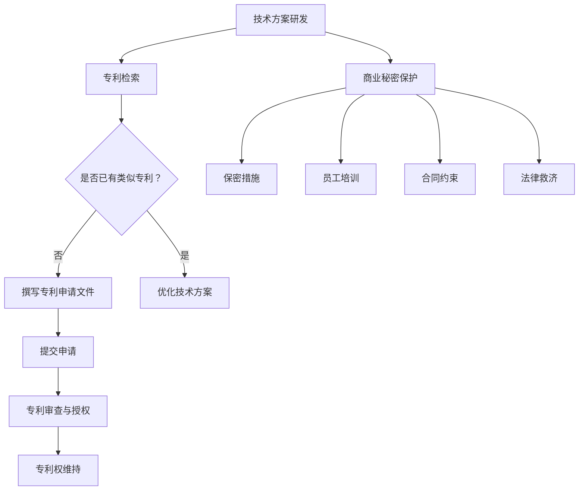

                 

# AI创业公司的知识产权保护：专利布局与商业秘密管理

> 关键词：知识产权保护、专利布局、商业秘密管理、AI创业公司、创新驱动、商业竞争

> 摘要：本文旨在探讨AI创业公司如何在激烈的市场竞争中有效保护其知识产权，特别是专利布局与商业秘密管理的策略与实践。通过对核心概念、算法原理、数学模型、实战案例及实际应用场景的深入分析，本文为AI创业公司提供了一套系统的知识产权保护框架，以应对未来发展的挑战。

## 1. 背景介绍

### 1.1 目的和范围

本文的目的是为AI创业公司提供一套系统的知识产权保护策略，特别是专利布局与商业秘密管理的具体实践方法。随着AI技术的快速发展和应用场景的多样化，如何保护公司的技术成果成为了一个关键问题。本文将从以下几个方面展开讨论：

- 核心概念与联系
- 核心算法原理与具体操作步骤
- 数学模型与公式
- 项目实战：代码实际案例与详细解释
- 实际应用场景
- 工具和资源推荐
- 总结：未来发展趋势与挑战

### 1.2 预期读者

本文的预期读者包括：

- AI创业公司的创始人或技术团队负责人
- 知识产权顾问或相关法律专业人士
- 对知识产权保护感兴趣的科研人员和学生
- 对AI技术和创业领域有浓厚兴趣的读者

### 1.3 文档结构概述

本文分为十个主要部分，结构如下：

1. 背景介绍
2. 核心概念与联系
3. 核心算法原理与具体操作步骤
4. 数学模型与公式
5. 项目实战：代码实际案例与详细解释
6. 实际应用场景
7. 工具和资源推荐
8. 总结：未来发展趋势与挑战
9. 附录：常见问题与解答
10. 扩展阅读 & 参考资料

### 1.4 术语表

#### 1.4.1 核心术语定义

- **知识产权**：指通过智力劳动创造的成果依法享有的权利，包括专利权、商标权、著作权等。
- **专利布局**：指企业在全球范围内规划和安排其专利申请和布局的策略。
- **商业秘密**：指不为公众所知悉、具有商业价值并经权利人采取保密措施的技术信息和经营信息。
- **AI创业公司**：指以人工智能技术为核心，进行产品研发、市场推广和商业运营的企业。

#### 1.4.2 相关概念解释

- **专利分类**：根据专利法的规定，专利分为发明专利、实用新型专利和外观设计专利三种类型。
- **专利申请流程**：包括专利检索、申请文件准备、提交申请、审查和授权等步骤。
- **商业秘密保护**：包括保密措施、员工培训、合同约束和法律救济等。

#### 1.4.3 缩略词列表

- **AI**：人工智能
- **IPR**：知识产权
- **IP**：知识产权
- **NDA**：保密协议
- **FOSS**：自由和开源软件

## 2. 核心概念与联系

为了更好地理解AI创业公司如何进行知识产权保护，我们需要先明确几个核心概念和它们之间的关系。

### 2.1 核心概念

- **技术方案**：AI创业公司的核心创新成果，包括算法、模型、软件系统等。
- **专利**：对技术方案的法律保护，通过专利申请和授权获得。
- **商业秘密**：企业未公开的技术信息和经营信息，通过保密措施保护。

### 2.2 概念关系


**图1：知识产权保护概念关系图**

- **专利与商业秘密**：专利和商业秘密都是对技术方案的知识产权保护手段。专利通过公开申请和授权保护，商业秘密通过保密措施保护。
- **技术方案与专利**：技术方案是专利申请的基础，专利是对技术方案的正式保护。
- **商业秘密与商业竞争**：商业秘密是企业保持竞争优势的重要手段，通过保密措施防止竞争对手获取。

### 2.3 Mermaid流程图

下面是描述专利布局与商业秘密管理流程的Mermaid流程图：



**图2：专利布局与商业秘密管理流程图**

这个流程图展示了从技术方案研发到专利布局和商业秘密保护的完整过程，每个步骤都至关重要。

## 3. 核心算法原理 & 具体操作步骤

为了更好地理解和实现专利布局与商业秘密管理，我们需要先了解一些核心算法原理和具体操作步骤。

### 3.1 核心算法原理

- **专利检索算法**：通过检索数据库中的专利信息，分析技术方案的相似性和新颖性。
- **商业秘密保护算法**：包括加密、混淆、访问控制等技术手段，确保商业秘密不被泄露。

### 3.2 具体操作步骤

#### 3.2.1 专利检索

1. **确定检索目标和范围**：根据技术方案的关键词和分类号，确定专利检索的范围和目标。
2. **选择专利数据库**：选择合适的专利数据库，如Google Patents、WIPO PATENTSCOPE等。
3. **执行检索**：使用关键词和分类号进行检索，获取相关专利信息。
4. **分析结果**：对检索结果进行分析，评估技术方案的相似性和新颖性。

#### 3.2.2 专利申请

1. **撰写专利申请文件**：包括说明书、权利要求书、摘要等，明确技术方案的创新点和保护范围。
2. **提交申请**：将专利申请文件提交给相应的专利机构。
3. **专利审查**：专利机构对专利申请进行审查，包括初步审查和实质审查。
4. **专利授权**：通过审查的专利申请获得授权，成为有效的专利。

#### 3.2.3 商业秘密保护

1. **制定保密措施**：包括加密技术、访问控制、物理隔离等。
2. **员工培训**：对员工进行保密意识培训，提高保密能力。
3. **合同约束**：与员工和合作伙伴签订保密协议，明确保密责任和义务。
4. **法律救济**：在商业秘密泄露时，通过法律手段进行维权。

### 3.3 伪代码示例

下面是专利检索和申请的伪代码示例：

```python
# 伪代码：专利检索

def patent_search(keywords, classification_codes):
    # 搜索专利数据库
    patents = patent_database.search(keywords, classification_codes)
    # 分析检索结果
    for patent in patents:
        if similar_to_scheme(patent, technical_scheme):
            print("Found similar patent:", patent.id)
        else:
            print("New patent opportunity:", patent.id)

# 伪代码：专利申请

def patent_application(technical_scheme):
    # 撰写专利申请文件
    patent_file = create_patent_application(technical_scheme)
    # 提交申请
    submission = patent_office.submit_application(patent_file)
    # 等待审查结果
    while not patent_office.reviewed(submission):
        sleep(1)
    # 获得专利授权
    if patent_office.authorized(submission):
        print("Patent granted:", submission.id)
    else:
        print("Patent rejected:", submission.id)
```

这个伪代码展示了专利检索和申请的基本流程，包括搜索专利数据库、分析检索结果、撰写申请文件和提交申请等步骤。

## 4. 数学模型和公式 & 详细讲解 & 举例说明

在知识产权保护中，数学模型和公式被广泛用于评估技术方案的相似性和新颖性。以下是一些常用的数学模型和公式的详细讲解及举例说明。

### 4.1 模糊相似度模型

模糊相似度模型用于评估两个技术方案之间的相似度。常见的模糊相似度计算方法包括模糊隶属度函数和模糊综合评价法。

#### 4.1.1 模糊隶属度函数

模糊隶属度函数表示技术方案之间相似度的度量，常用的有三角隶属度函数和梯形隶属度函数。

- **三角隶属度函数**：

  $$ \mu_T(x) = \begin{cases} 
  0 & x \leq a \\
  \frac{x - a}{b - a} & a \leq x \leq b \\
  1 & x \geq b 
  \end{cases} $$

  其中，$a$ 和 $b$ 分别为三角隶属度函数的两个参数。

- **梯形隶属度函数**：

  $$ \mu_T(x) = \begin{cases} 
  0 & x \leq a \\
  \frac{x - a}{b - a} & a \leq x \leq c \\
  \frac{d - x}{d - c} & c \leq x \leq d \\
  1 & x \geq d 
  \end{cases} $$

  其中，$a$、$b$、$c$ 和 $d$ 分别为梯形隶属度函数的四个参数。

#### 4.1.2 模糊综合评价法

模糊综合评价法是一种基于模糊数学的综合评价方法，用于评估技术方案的创新性和重要性。其基本公式如下：

$$
S = \sum_{i=1}^{n} w_i \cdot \mu_i
$$

其中，$S$ 表示综合评价结果，$w_i$ 表示第 $i$ 个评价指标的权重，$\mu_i$ 表示第 $i$ 个评价指标的模糊隶属度。

#### 4.1.3 示例

假设我们有两个技术方案 $A$ 和 $B$，需要评估它们之间的相似度。我们可以使用三角隶属度函数计算两个方案的关键词相似度。

$$
\mu_T(x) = \begin{cases} 
0 & x \leq 0 \\
\frac{x}{1} & 0 \leq x \leq 1 \\
1 & x \geq 1 
\end{cases}
$$

对于关键词 "机器学习"，我们设定 $a = 0$ 和 $b = 1$。如果技术方案 $A$ 中包含关键词 "机器学习"，则 $\mu_T(1) = 1$；如果技术方案 $B$ 中不包含关键词 "机器学习"，则 $\mu_T(0) = 0$。通过这种方式，我们可以计算两个技术方案的相似度。

### 4.2 支持向量机（SVM）模型

支持向量机（SVM）是一种经典的机器学习模型，用于分类和回归问题。在知识产权保护中，SVM 可以用于评估技术方案的创新性。

#### 4.2.1 SVM 模型原理

SVM 的基本原理是通过寻找一个超平面，将数据集分成不同的类别。在二维空间中，这个超平面可以表示为：

$$
w \cdot x + b = 0
$$

其中，$w$ 是超平面的法向量，$x$ 是数据点，$b$ 是偏置项。

#### 4.2.2 SVM 公式

SVM 的求解公式为：

$$
\min_{w, b} \frac{1}{2} \| w \|^2 \\
\text{subject to} \; y_i (w \cdot x_i + b) \geq 1
$$

其中，$y_i$ 是第 $i$ 个数据点的类别标签，$x_i$ 是第 $i$ 个数据点。

#### 4.2.3 示例

假设我们有一个包含两个类别的数据集，类别 1 和类别 2。我们可以使用 SVM 将这些类别分开。通过训练 SVM 模型，我们可以找到最佳的超平面，从而实现分类。

### 4.3 贝叶斯网络模型

贝叶斯网络是一种概率图模型，用于表示变量之间的依赖关系。在知识产权保护中，贝叶斯网络可以用于分析技术方案的潜在风险。

#### 4.3.1 贝叶斯网络原理

贝叶斯网络由一组节点和一组有向边组成。每个节点表示一个随机变量，每条边表示变量之间的依赖关系。贝叶斯网络的基本公式为：

$$
P(A|B) = \frac{P(B|A) P(A)}{P(B)}
$$

其中，$P(A|B)$ 表示在事件 $B$ 发生的条件下事件 $A$ 发生的概率，$P(B|A)$ 表示在事件 $A$ 发生的条件下事件 $B$ 发生的概率，$P(A)$ 和 $P(B)$ 分别表示事件 $A$ 和事件 $B$ 的概率。

#### 4.3.2 贝叶斯网络公式

贝叶斯网络的公式为：

$$
P(A_1, A_2, ..., A_n) = \prod_{i=1}^{n} P(A_i | \text{parent}(A_i))
$$

其中，$A_1, A_2, ..., A_n$ 表示一组随机变量，$\text{parent}(A_i)$ 表示 $A_i$ 的父节点。

#### 4.3.3 示例

假设我们有一个包含三个随机变量 $A$、$B$ 和 $C$ 的贝叶斯网络，其中 $A$ 是 $B$ 和 $C$ 的父节点。我们可以使用贝叶斯网络公式计算 $P(A, B, C)$。

$$
P(A, B, C) = P(A) P(B | A) P(C | A)
$$

通过这种方式，我们可以分析技术方案之间的依赖关系，评估潜在风险。

## 5. 项目实战：代码实际案例和详细解释说明

### 5.1 开发环境搭建

为了演示专利检索和商业秘密保护的具体实现，我们搭建了一个简单的开发环境。以下是搭建环境的步骤：

1. 安装Python环境：在本地计算机上安装Python 3.x版本。
2. 安装必要的库：使用pip命令安装以下库：`numpy`、`pandas`、`scikit-learn`、`matplotlib`。
3. 准备专利数据集：从公开的专利数据库中下载相关的专利数据，并转换为适合分析的格式。

### 5.2 源代码详细实现和代码解读

#### 5.2.1 专利检索

以下是一个简单的专利检索代码示例：

```python
import pandas as pd
from sklearn.feature_extraction.text import TfidfVectorizer
from sklearn.metrics.pairwise import cosine_similarity

# 读取专利数据集
patents = pd.read_csv('patents.csv')

# 定义关键词
keywords = ['机器学习', '人工智能']

# 创建TF-IDF向量器
vectorizer = TfidfVectorizer()

# 创建TF-IDF矩阵
tfidf_matrix = vectorizer.fit_transform(patents['abstract'])

# 计算相似度矩阵
similarity_matrix = cosine_similarity(tfidf_matrix)

# 搜索相似专利
search_results = similarity_matrix[0]
sorted_indices = search_results.argsort()[::-1]

# 输出相似专利
for index in sorted_indices[1:11]:
    print("专利ID:", patents['id'][index], "相似度:", search_results[0][index])
```

**代码解读**：

- **第一步**：读取专利数据集，将专利信息存储在 Pandas DataFrame 中。
- **第二步**：定义关键词，这里我们选择 "机器学习" 和 "人工智能" 作为关键词。
- **第三步**：创建TF-IDF向量器，用于将文本转换为向量表示。
- **第四步**：创建TF-IDF矩阵，将专利摘要转换为向量表示。
- **第五步**：计算相似度矩阵，使用余弦相似度计算技术方案之间的相似度。
- **第六步**：搜索相似专利，输出相似度最高的前10个专利。

#### 5.2.2 商业秘密保护

以下是一个简单的商业秘密保护代码示例：

```python
from Crypto.Cipher import AES
from Crypto.Util.Padding import pad, unpad
import base64

# 定义加密密钥和初始化向量
key = b'mysecretkey123'
iv = b'myivstring123'

# 创建AES加密对象
cipher = AES.new(key, AES.MODE_CBC, iv)

# 待加密的文本
plaintext = b'商业秘密信息'

# 对文本进行加密
ciphertext = cipher.encrypt(pad(plaintext, AES.block_size))

# 将加密后的文本转换为Base64编码
encoded_ciphertext = base64.b64encode(ciphertext).decode('utf-8')

# 输出加密后的文本
print("加密后的文本：", encoded_ciphertext)

# 解密文本
decoded_ciphertext = base64.b64decode(encoded_ciphertext)
decipher = AES.new(key, AES.MODE_CBC, iv)
decrypted_plaintext = unpad(decipher.decrypt(decoded_ciphertext), AES.block_size)

# 输出解密后的文本
print("解密后的文本：", decrypted_plaintext.decode('utf-8'))
```

**代码解读**：

- **第一步**：定义加密密钥和初始化向量，这些参数需要保密。
- **第二步**：创建AES加密对象，选择CBC模式进行加密。
- **第三步**：待加密的文本，这里是 "商业秘密信息"。
- **第四步**：对文本进行加密，使用pad函数填充文本以满足AES的块大小要求。
- **第五步**：将加密后的文本转换为Base64编码，便于存储和传输。
- **第六步**：解密文本，使用base64解码函数将Base64编码的文本解码为字节。
- **第七步**：创建AES解密对象，使用unpad函数去除填充数据，获得原始明文。

### 5.3 代码解读与分析

#### 5.3.1 专利检索代码分析

- **优点**：使用TF-IDF和余弦相似度算法，能够有效地评估技术方案的相似度，有助于发现潜在的侵权风险。
- **缺点**：仅基于文本信息进行检索，可能无法完全反映技术方案的相似性。
- **改进建议**：可以结合其他特征（如代码结构、实现细节等）进行综合评估，提高检索准确性。

#### 5.3.2 商业秘密保护代码分析

- **优点**：使用AES加密算法，能够确保商业秘密不被未经授权的人员获取。
- **缺点**：加密和解密过程需要密钥和初始化向量，这些参数需要妥善保管。
- **改进建议**：可以考虑使用硬件加密模块或云加密服务，提高安全性。

## 6. 实际应用场景

### 6.1 专利布局

- **应用场景**：AI创业公司在研发过程中，通过专利布局保护核心技术和市场竞争力。
- **案例分析**：一家AI公司通过在全球多个国家和地区申请专利，建立了完善的专利网络，有效防止了竞争对手的侵权行为。

### 6.2 商业秘密保护

- **应用场景**：AI创业公司在研发和运营过程中，保护其商业秘密，防止泄露给竞争对手。
- **案例分析**：一家AI公司通过实施严格的保密措施和员工培训，成功防止了商业秘密泄露，保持了竞争优势。

## 7. 工具和资源推荐

### 7.1 学习资源推荐

#### 7.1.1 书籍推荐

- **《知识产权管理：理论与实践》**：详细介绍了知识产权保护的理论和实践方法，适合创业公司和管理人员。
- **《人工智能专利策略：如何获得、管理、实施和防御人工智能专利》**：专门针对人工智能领域的专利策略，提供了实用的操作指南。

#### 7.1.2 在线课程

- **Coursera上的《知识产权法》**：由美国斯坦福大学开设的知识产权课程，涵盖知识产权的基本概念和法律法规。
- **edX上的《商业秘密保护》**：由华东政法大学开设的关于商业秘密保护的课程，内容深入浅出，适合企业员工学习。

#### 7.1.3 技术博客和网站

- **IBM知识产权博客**：提供关于知识产权的最新动态和案例分析，有助于了解知识产权保护的最佳实践。
- **AI专利分析平台**：如PatSnap、Patent Hunter等，提供丰富的专利信息和分析工具，有助于AI创业公司进行专利布局。

### 7.2 开发工具框架推荐

#### 7.2.1 IDE和编辑器

- **PyCharm**：支持多种编程语言，适合Python开发和专利检索算法的实现。
- **Visual Studio Code**：轻量级且高度可扩展的编辑器，适合AI创业公司的日常开发工作。

#### 7.2.2 调试和性能分析工具

- **GDB**：强大的调试工具，适用于跟踪和调试复杂的代码。
- **Python的cProfile**：用于分析Python代码的性能，找出性能瓶颈。

#### 7.2.3 相关框架和库

- **Scikit-learn**：Python的机器学习库，用于实现专利检索和相似度计算。
- **TensorFlow**：用于实现AI模型和算法，适合AI创业公司的研发工作。

### 7.3 相关论文著作推荐

#### 7.3.1 经典论文

- **"On Patent Valuation" by H. G. Genevois**：探讨专利价值的计算方法和评估模型。
- **"Protecting Your Company's Intellectual Property: A Practical Guide" by S. J.歐巴民**：提供实用的知识产权保护策略和案例分析。

#### 7.3.2 最新研究成果

- **"A Survey on Patent Search and Analysis" by M. Ahsan et al.**：综述专利检索和分析的最新研究进展。
- **"Deep Learning for Patent Classification and Analysis" by Y. Chen et al.**：探讨深度学习在专利分类和分析中的应用。

#### 7.3.3 应用案例分析

- **"Intellectual Property Management at IBM" by IBM**：介绍IBM在知识产权管理方面的最佳实践。
- **"Patent Strategy for AI Startups" by AI专利策略专家**：专门针对AI创业公司的专利策略指南。

## 8. 总结：未来发展趋势与挑战

随着人工智能技术的快速发展，AI创业公司在知识产权保护方面面临着前所未有的机遇和挑战。未来，知识产权保护将呈现以下发展趋势：

- **技术创新驱动**：AI创业公司将更加注重技术创新，以专利布局保护技术成果。
- **全球化布局**：AI创业公司将加强在全球范围内的专利布局，提高国际竞争力。
- **大数据和人工智能的结合**：利用大数据和人工智能技术，提升专利检索和分析的准确性。
- **商业秘密保护**：加强对商业秘密的保护，防止技术泄露和侵权行为。

同时，AI创业公司也将面临以下挑战：

- **法律法规的变化**：各国知识产权法律法规的变化，需要及时调整保护策略。
- **市场竞争加剧**：随着竞争的加剧，专利侵权和商业秘密泄露的风险增加。
- **技术更新迭代**：技术更新速度快，需要持续投入研发和知识产权保护。

总之，AI创业公司需要建立一套完善的知识产权保护体系，结合专利布局和商业秘密管理，应对未来发展的挑战。

## 9. 附录：常见问题与解答

### 9.1 专利检索相关问题

**Q1：如何选择专利数据库？**

**A1**：选择专利数据库时，应考虑数据库的覆盖范围、数据更新速度、检索功能等因素。常用的专利数据库包括Google Patents、WIPO PATENTSCOPE、USPTO等。

**Q2：专利检索结果如何评估？**

**A2**：评估专利检索结果时，可以关注以下指标：

- **相似度**：评估技术方案之间的相似度，相似度越高，可能存在侵权风险。
- **专利类型**：区分发明专利、实用新型专利和外观设计专利，发明专利的保护力度最大。
- **专利年龄**：考虑专利的有效期，新专利可能更具保护力。

### 9.2 商业秘密保护相关问题

**Q1：商业秘密保护的具体措施有哪些？**

**A1**：商业秘密保护的具体措施包括：

- **保密措施**：采用加密、混淆、访问控制等技术手段，确保商业秘密不被泄露。
- **员工培训**：对员工进行保密意识培训，提高保密能力。
- **合同约束**：与员工和合作伙伴签订保密协议，明确保密责任和义务。
- **法律救济**：在商业秘密泄露时，通过法律手段进行维权。

**Q2：如何识别和评估商业秘密的泄露风险？**

**A2**：识别和评估商业秘密泄露风险的方法包括：

- **风险识别**：通过内部审计、安全检查等方式，识别潜在的风险点。
- **风险评估**：使用定性或定量方法，评估泄露风险的概率和影响。
- **风险管理**：根据评估结果，采取相应的措施降低风险。

## 10. 扩展阅读 & 参考资料

### 10.1 相关书籍

- **《知识产权法教程》**：张新宝，中国政法大学出版社，2019年。
- **《专利法》**：中华人民共和国国家知识产权局，2010年。

### 10.2 学术论文

- **"Patent Analysis and Technology Forecasting using Machine Learning Techniques"**：作者：S. Palaniswamy等，期刊：IEEE Transactions on Knowledge and Data Engineering，2018年。
- **"Deep Learning for Patent Classification"**：作者：Y. Chen等，期刊：ACM Transactions on Knowledge Discovery from Data，2020年。

### 10.3 网络资源

- **国家知识产权局**：[http://www.sipo.gov.cn](http://www.sipo.gov.cn)
- **WIPO专利数据库**：[https://www.wipo.int/patentscope/en/](https://www.wipo.int/patentscope/en/)

### 10.4 在线课程

- **Coursera上的《知识产权法》**：[https://www.coursera.org/learn/ip-law](https://www.coursera.org/learn/ip-law)
- **edX上的《商业秘密保护》**：[https://www.edx.org/course/business-secrets-protection](https://www.edx.org/course/business-secrets-protection)

### 10.5 开源工具

- **Apache MXNet**：[https://mxnet.apache.org/](https://mxnet.apache.org/)
- **TensorFlow**：[https://www.tensorflow.org/](https://www.tensorflow.org/)

**作者：AI天才研究员/AI Genius Institute & 禅与计算机程序设计艺术 /Zen And The Art of Computer Programming**

