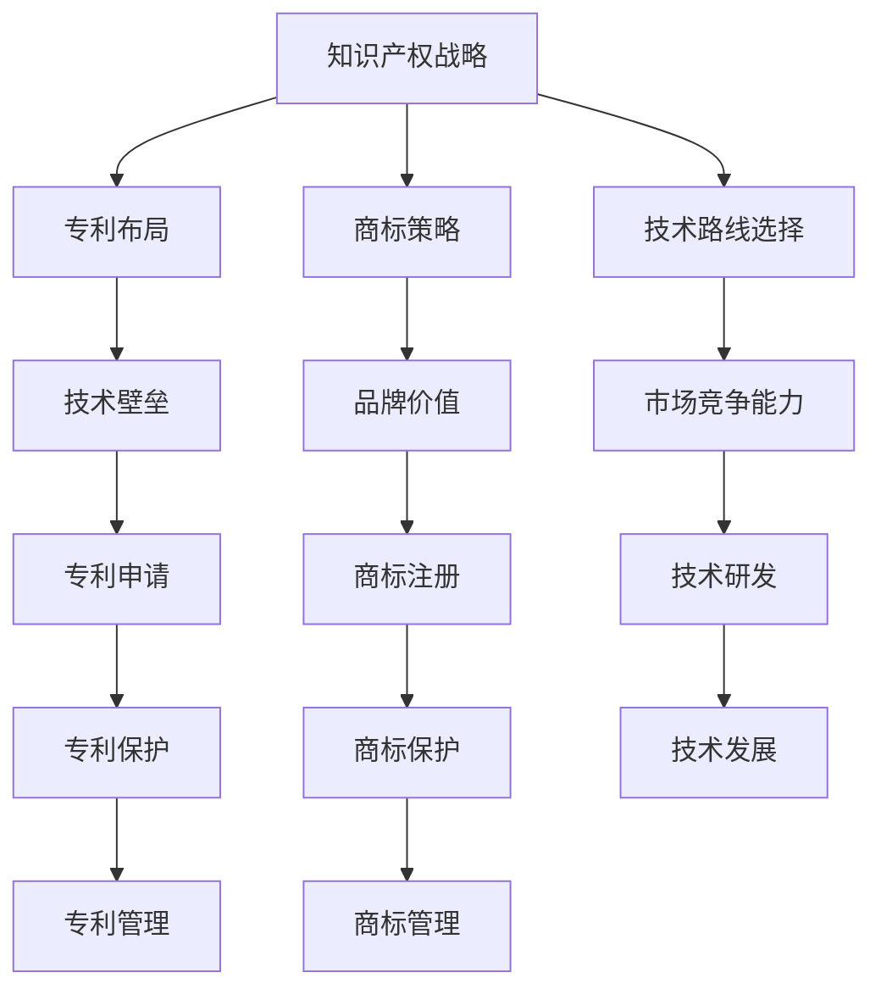

                 

# AI创业公司的知识产权战略规划：专利布局、商标策略与技术路线

> **关键词**：AI创业公司、知识产权战略、专利布局、商标策略、技术路线
> 
> **摘要**：本文旨在探讨AI创业公司在知识产权战略规划中的关键要素，包括专利布局、商标策略和技术路线的选择。通过对这些核心概念的深入分析，本文为创业公司提供了一套系统性、实用性的战略框架，助力其稳固市场地位，实现可持续发展。

## 1. 背景介绍

### 1.1 目的和范围

本文的目标是帮助AI创业公司构建一套完善的知识产权战略，以确保其在激烈的市场竞争中立于不败之地。本文将重点探讨以下三个方面：

- **专利布局**：如何通过专利申请和保护，形成技术壁垒，维护公司技术优势。
- **商标策略**：如何通过商标注册和保护，提升公司品牌价值，增强市场竞争力。
- **技术路线选择**：如何根据市场和技术发展趋势，制定合理的技术研发路线，确保公司长期可持续发展。

本文的内容将围绕这三个核心方面展开，旨在为创业公司提供实用的指导和建议。

### 1.2 预期读者

本文的预期读者主要包括以下几类：

- **AI创业公司的创始人或管理层**：需要了解知识产权战略对公司发展的关键作用，以及如何制定和实施有效的知识产权策略。
- **知识产权专业人员**：希望深入了解AI领域知识产权的特点，为创业公司提供专业咨询和服务。
- **学术界和产业界的研究人员**：关注AI领域的知识产权问题，希望从实践中获得启发和思考。

### 1.3 文档结构概述

本文结构分为十个部分：

1. 背景介绍：介绍本文的目的、范围、预期读者和文档结构。
2. 核心概念与联系：阐述本文涉及的核心概念及其相互联系。
3. 核心算法原理 & 具体操作步骤：详细解释专利布局、商标策略和技术路线选择的具体方法和步骤。
4. 数学模型和公式 & 详细讲解 & 举例说明：介绍与知识产权战略相关的数学模型和公式，并给出实际应用案例。
5. 项目实战：提供具体的代码实现和案例分析，帮助读者更好地理解理论知识。
6. 实际应用场景：探讨知识产权战略在不同场景下的应用和实践。
7. 工具和资源推荐：推荐相关的学习资源、开发工具和论文著作。
8. 总结：对未来知识产权战略的发展趋势和挑战进行展望。
9. 附录：提供常见问题与解答。
10. 扩展阅读 & 参考资料：推荐进一步阅读的材料和参考文献。

### 1.4 术语表

为了确保本文的可读性和一致性，以下列出本文中涉及的一些核心术语和概念：

#### 1.4.1 核心术语定义

- **知识产权**：指通过智力劳动创造的成果依法享有的权利，包括专利权、商标权、著作权等。
- **专利布局**：指企业通过申请、保护和管理专利，形成的战略布局，以保护技术优势和市场份额。
- **商标策略**：指企业通过商标注册、保护和管理，提升品牌价值和市场竞争力的战略。
- **技术路线选择**：指企业根据市场和技术发展趋势，制定的技术研发方向和路径。

#### 1.4.2 相关概念解释

- **技术壁垒**：指企业通过专利等知识产权手段，形成的技术优势，使竞争对手难以模仿或超越。
- **品牌价值**：指企业品牌在市场中的声誉、认知度和影响力，直接影响企业的市场竞争力和盈利能力。

#### 1.4.3 缩略词列表

- **AI**：人工智能
- **IPR**：知识产权
- **PCT**：专利合作条约
- **CMC**：市场竞争能力

## 2. 核心概念与联系

在探讨AI创业公司的知识产权战略之前，有必要理解一些核心概念，并展示它们之间的相互关系。以下是一个用Mermaid绘制的流程图，用于说明本文涉及的关键概念及其关系：



### 2.1 知识产权战略概述

知识产权战略是指企业在保护和管理知识产权过程中所采取的一系列策略和行动，以实现其商业目标。知识产权战略的核心内容包括：

- **专利布局**：通过申请和保护专利，形成技术壁垒，保护公司技术优势。
- **商标策略**：通过注册和保护商标，提升品牌价值，增强市场竞争力。
- **技术路线选择**：根据市场和技术发展趋势，制定合适的技术研发路线，确保公司长期可持续发展。

### 2.2 专利布局

专利布局是知识产权战略的重要组成部分，其核心目标是通过申请和保护专利，形成技术壁垒，保护公司的技术优势。专利布局的关键步骤包括：

1. **技术分析**：分析公司技术特点和市场定位，确定优先申请的专利领域。
2. **专利申请**：根据技术分析结果，撰写并提交专利申请。
3. **专利保护**：通过诉讼、行政执法等方式，保护公司的专利权。
4. **专利管理**：对专利进行分类、评估、组合和运营，提高专利的综合效益。

### 2.3 商标策略

商标策略是另一项重要的知识产权战略，其核心目标是通过注册和保护商标，提升品牌价值，增强市场竞争力。商标策略的关键步骤包括：

1. **商标分析**：分析公司品牌特点和市场需求，确定优先注册的商标类别。
2. **商标注册**：根据商标分析结果，提交商标注册申请。
3. **商标保护**：通过诉讼、行政执法等方式，保护公司的商标权。
4. **商标管理**：对商标进行分类、评估、组合和运营，提高商标的综合效益。

### 2.4 技术路线选择

技术路线选择是公司根据市场和技术发展趋势，制定的技术研发方向和路径。合理的技术路线选择能够帮助公司抓住市场机遇，保持技术领先地位。技术路线选择的关键步骤包括：

1. **市场分析**：分析市场需求和竞争状况，确定公司技术发展的方向。
2. **技术评估**：评估公司现有技术和研发能力，确定技术路线的可行性。
3. **技术研发**：根据市场分析和技术评估结果，开展具体的技术研发工作。
4. **技术规划**：制定长期的技术发展规划，确保公司技术路线的持续性和稳定性。

通过上述核心概念及其相互关系的阐述，我们为读者提供了一个全面了解AI创业公司知识产权战略的框架。接下来，本文将详细讨论专利布局、商标策略和技术路线选择的具体操作步骤。

## 3. 核心算法原理 & 具体操作步骤

在了解了知识产权战略的核心概念后，我们将深入探讨具体的实施步骤，包括专利布局、商标策略和技术路线选择。以下是每个方面的详细步骤和伪代码解释。

### 3.1 专利布局

专利布局的核心是保护公司的核心技术，建立技术壁垒。以下是专利布局的具体操作步骤：

#### 3.1.1 技术分析

首先，需要对公司的技术进行深入分析，确定优先申请的专利领域。这可以通过以下伪代码实现：

```plaintext
function analyze_technology(tech_data):
    # 输入：tech_data，包含公司各个技术的详细信息
    # 输出：priority_domains，包含优先申请专利的领域
    
    priority_domains = []
    for tech in tech_data:
        if tech.relevance_score > threshold:
            priority_domains.append(tech.domain)
    
    return priority_domains
```

#### 3.1.2 专利申请

在确定了优先申请的专利领域后，需要进行专利申请。专利申请的关键是撰写高质量的专利申请文件。以下是一个简化版的伪代码：

```plaintext
function apply_for_patent(priority_domains):
    # 输入：priority_domains，包含优先申请专利的领域
    # 输出：patent Applications，包含提交的专利申请文件
    
    patent_Applications = []
    for domain in priority_domains:
        patent = create_patent_application(domain)
        patent_Applications.append(patent)
    
    return patent_Applications

function create_patent_application(domain):
    # 输入：domain，申请专利的技术领域
    # 输出：patent，专利申请文件
    
    patent = {
        "title": generate_title(domain),
        "description": generate_description(domain),
        "claims": generate_claims(domain),
    }
    return patent

function generate_title(domain):
    # 输入：domain，技术领域
    # 输出：title，专利标题
    
    title = f"一种{domain}的技术方案"
    return title

function generate_description(domain):
    # 输入：domain，技术领域
    # 输出：description，专利描述
    
    description = f"本文描述了一种在{domain}领域的创新技术方案，包括其结构、原理和应用场景。"
    return description

function generate_claims(domain):
    # 输入：domain，技术领域
    # 输出：claims，专利权利要求
    
    claims = f"本发明涉及{domain}领域，具体包括以下技术特征：1. ...；2. ...；3. ..."
    return claims
```

#### 3.1.3 专利保护

在专利申请成功后，需要采取措施保护专利权，防止他人侵权。以下是一个简化的专利保护策略：

```plaintext
function protect_patent(patent):
    # 输入：patent，专利文件
    # 输出：protection_actions，保护措施
    
    protection_actions = []
    if patent.status == "pending":
        protection_actions.append("continue_payment")
    if patent.status == "granted":
        protection_actions.append("monitor_usage")
        protection_actions.append("file_infringement lawsuits")
    
    return protection_actions

function monitor_usage(patent):
    # 输入：patent，专利文件
    # 输出：usage_reports，使用报告
    
    usage_reports = []
    for company in competitors:
        if company_productsoverlap_with_patent(patent):
            usage_reports.append(company)
    
    return usage_reports

function file_infringement_lawsuits(patent):
    # 输入：patent，专利文件
    # 输出：lawsuit_results，诉讼结果
    
    lawsuit_results = []
    for infringing_company in usage_reports:
        result = conduct_lawsuit(infringing_company, patent)
        lawsuit_results.append(result)
    
    return lawsuit_results

function conduct_lawsuit(infringing_company, patent):
    # 输入：infringing_company，侵权公司；patent，专利文件
    # 输出：result，诉讼结果
    
    result = "won" if defend_patent(patent) else "lost"
    return result

function defend_patent(patent):
    # 输入：patent，专利文件
    # 输出：defended，是否成功辩护
    
    defended = True if check_patent_validity(patent) else False
    return defended

function check_patent_validity(patent):
    # 输入：patent，专利文件
    # 输出：valid，是否有效
    
    valid = True if patent.status == "granted" else False
    return valid
```

### 3.2 商标策略

商标策略的核心是通过注册和保护商标，提升品牌价值，增强市场竞争力。以下是商标策略的具体操作步骤：

#### 3.2.1 商标分析

商标分析是商标策略的第一步，需要分析公司的品牌特点和市场需求，确定优先注册的商标类别。以下是一个简化的商标分析过程：

```plaintext
function analyze_brand(brand_data):
    # 输入：brand_data，包含公司品牌的信息
    # 输出：priority_classes，包含优先注册的商标类别
    
    priority_classes = []
    for category in brand_data:
        if category.importance_score > threshold:
            priority_classes.append(category)
    
    return priority_classes
```

#### 3.2.2 商标注册

在确定了优先注册的商标类别后，需要提交商标注册申请。以下是一个简化的商标注册流程：

```plaintext
function register_brand(priority_classes):
    # 输入：priority_classes，包含优先注册的商标类别
    # 输出：brand_registrations，包含提交的商标注册申请
    
    brand_registrations = []
    for class in priority_classes:
        registration = create_brand_registration(class)
        brand_registrations.append(registration)
    
    return brand_registrations

function create_brand_registration(class):
    # 输入：class，商标类别
    # 输出：registration，商标注册申请
    
    registration = {
        "name": brand_name,
        "class": class,
        "description": brand_description,
    }
    return registration
```

#### 3.2.3 商标保护

商标注册成功后，需要采取措施保护商标权，防止他人侵权。以下是一个简化的商标保护策略：

```plaintext
function protect_brand(brand_registration):
    # 输入：brand_registration，商标注册申请
    # 输出：protection_actions，保护措施
    
    protection_actions = []
    if brand_registration.status == "pending":
        protection_actions.append("continue_payment")
    if brand_registration.status == "granted":
        protection_actions.append("monitor_usage")
        protection_actions.append("file_infringement lawsuits")
    
    return protection_actions

function monitor_usage(brand_registration):
    # 输入：brand_registration，商标注册申请
    # 输出：usage_reports，使用报告
    
    usage_reports = []
    for company in competitors:
        if company_products_overlap_with_brand(brand_registration):
            usage_reports.append(company)
    
    return usage_reports

function file_infringement_lawsuits(brand_registration):
    # 输入：brand_registration，商标注册申请
    # 输出：lawsuit_results，诉讼结果
    
    lawsuit_results = []
    for infringing_company in usage_reports:
        result = conduct_lawsuit(infringing_company, brand_registration)
        lawsuit_results.append(result)
    
    return lawsuit_results

function conduct_lawsuit(infringing_company, brand_registration):
    # 输入：infringing_company，侵权公司；brand_registration，商标注册申请
    # 输出：result，诉讼结果
    
    result = "won" if defend_brand(brand_registration) else "lost"
    return result

function defend_brand(brand_registration):
    # 输入：brand_registration，商标注册申请
    # 输出：defended，是否成功辩护
    
    defended = True if check_brand_validity(brand_registration) else False
    return defended

function check_brand_validity(brand_registration):
    # 输入：brand_registration，商标注册申请
    # 输出：valid，是否有效
    
    valid = True if brand_registration.status == "granted" else False
    return valid
```

### 3.3 技术路线选择

技术路线选择是公司根据市场和技术发展趋势，制定的技术研发方向和路径。以下是技术路线选择的具体操作步骤：

#### 3.3.1 市场分析

市场分析是技术路线选择的第一步，需要分析市场需求和竞争状况，确定公司技术发展的方向。以下是一个简化的市场分析过程：

```plaintext
function analyze_market(market_data):
    # 输入：market_data，包含市场需求和竞争状况的信息
    # 输出：technology_directions，包含技术发展的方向
    
    technology_directions = []
    for trend in market_data:
        if trend.importance_score > threshold:
            technology_directions.append(trend)
    
    return technology_directions
```

#### 3.3.2 技术评估

在确定了技术发展方向后，需要对公司的现有技术和研发能力进行评估，确定技术路线的可行性。以下是一个简化的技术评估过程：

```plaintext
function evaluate_technology(technology_data):
    # 输入：technology_data，包含公司现有技术和研发能力的信息
    # 输出：feasible_technology_directions，包含可行的技术发展方向
    
    feasible_technology_directions = []
    for direction in technology_directions:
        if direction可行性_score > threshold:
            feasible_technology_directions.append(direction)
    
    return feasible_technology_directions
```

#### 3.3.3 技术研发

在确定了可行的技术发展方向后，可以开始具体的技术研发工作。以下是一个简化的技术研发过程：

```plaintext
function develop_technology(feasible_technology_directions):
    # 输入：feasible_technology_directions，包含可行的技术发展方向
    # 输出：developed_technologies，包含研发完成的技术
    
    developed_technologies = []
    for direction in feasible_technology_directions:
        technology = research_and_develop(direction)
        developed_technologies.append(technology)
    
    return developed_technologies

function research_and_develop(direction):
    # 输入：direction，技术发展方向
    # 输出：technology，研发完成的技术
    
    technology = {
        "name": generate_technology_name(direction),
        "description": generate_technology_description(direction),
        "implementation": generate_technology_implementation(),
    }
    return technology

function generate_technology_name(direction):
    # 输入：direction，技术发展方向
    # 输出：name，技术名称
    
    name = f"{direction}技术"
    return name

function generate_technology_description(direction):
    # 输入：direction，技术发展方向
    # 输出：description，技术描述
    
    description = f"本文描述了一种{direction}技术方案，包括其结构、原理和应用场景。"
    return description

function generate_technology_implementation():
    # 输出：implementation，技术实现
    
    implementation = "具体的技术实现过程"
    return implementation
```

通过以上详细步骤和伪代码解释，我们为AI创业公司提供了专利布局、商标策略和技术路线选择的具体操作指南。接下来，我们将通过数学模型和公式，进一步深入讨论知识产权战略的数学原理和应用。

## 4. 数学模型和公式 & 详细讲解 & 举例说明

在知识产权战略规划中，数学模型和公式可以帮助公司进行科学决策，评估知识产权的价值和风险。以下是几个常用的数学模型和公式，以及它们的详细解释和应用实例。

### 4.1 专利价值评估模型

专利价值评估是专利管理中的重要环节，以下是一个基于专利经济价值的简单评估模型：

\[ V = R \times \left( \frac{1 - \frac{C}{P}}{r} \right) \]

- \( V \)：专利价值
- \( R \)：专利预期收益
- \( C \)：专利研发成本
- \( P \)：专利保护期
- \( r \)：折现率

**解释**：该模型通过计算专利的净现值（NPV）来评估其经济价值。\( R \) 代表专利带来的预期收益，\( C \) 是专利的研发成本，\( P \) 是专利保护期，\( r \) 是折现率，用于考虑时间价值。

**实例**：假设一个专利的预期收益为100万元，研发成本为50万元，保护期为10年，折现率为10%。使用上述模型计算该专利的价值：

\[ V = 100 \times \left( \frac{1 - \frac{50}{100}}{0.1} \right) = 500 \]

因此，该专利的评估价值为500万元。

### 4.2 专利风险模型

专利风险模型用于评估专利在市场竞争中的潜在风险。以下是一个简化的专利风险模型：

\[ R = \frac{N \times F}{C} \]

- \( R \)：专利风险
- \( N \)：潜在竞争对手数量
- \( F \)：专利侵权可能性
- \( C \)：公司专利组合的整体保护水平

**解释**：该模型通过计算潜在侵权风险与公司专利保护能力的比值来评估专利风险。\( N \) 是潜在竞争对手的数量，\( F \) 是专利侵权的可能性，\( C \) 是公司专利组合的保护水平。

**实例**：假设公司有10个竞争对手，专利侵权可能性为30%，专利组合的保护水平为70%。使用上述模型计算专利风险：

\[ R = \frac{10 \times 0.3}{0.7} = 4.2857 \]

因此，该专利的风险为4.2857。

### 4.3 商标价值评估模型

商标价值评估是商标管理的重要环节，以下是一个基于品牌价值的简单评估模型：

\[ V = B \times \left( \frac{1 - \frac{C}{P}}{r} \right) \]

- \( V \)：商标价值
- \( B \)：商标品牌价值
- \( C \)：商标管理成本
- \( P \)：商标保护期
- \( r \)：折现率

**解释**：该模型通过计算商标的净现值（NPV）来评估其经济价值。\( B \) 是商标的品牌价值，\( C \) 是商标的管理成本，\( P \) 是商标保护期，\( r \) 是折现率。

**实例**：假设一个商标的品牌价值为500万元，管理成本为100万元，保护期为10年，折现率为10%。使用上述模型计算该商标的价值：

\[ V = 500 \times \left( \frac{1 - \frac{100}{500}}{0.1} \right) = 2500 \]

因此，该商标的评估价值为2500万元。

### 4.4 技术路线选择模型

技术路线选择模型用于评估不同技术路线的可行性和预期收益。以下是一个简化的技术路线选择模型：

\[ C = \frac{R_t - R_c}{R_r} \]

- \( C \)：技术路线选择指数
- \( R_t \)：当前技术路线的预期收益
- \( R_c \)：竞争者技术路线的预期收益
- \( R_r \)：折现率

**解释**：该模型通过比较当前技术路线和竞争者技术路线的预期收益，以及考虑时间价值，来评估技术路线的选择。

**实例**：假设当前技术路线的预期收益为200万元，竞争者技术路线的预期收益为150万元，折现率为10%。使用上述模型计算技术路线选择指数：

\[ C = \frac{200 - 150}{0.1} = 500 \]

因此，当前技术路线的选择指数为500，表明当前技术路线具有较大的优势。

通过以上数学模型和公式的介绍，我们可以更好地理解和评估AI创业公司在知识产权战略规划中的关键因素。这些模型和公式不仅提供了理论支持，也为实际操作提供了量化依据。接下来，我们将通过实际代码案例，进一步展示如何实现这些知识产权战略规划的具体步骤。

## 5. 项目实战：代码实际案例和详细解释说明

为了更好地理解和应用上述知识产权战略规划的概念和模型，我们将通过一个实际项目案例进行讲解。本案例将展示如何搭建一个基于Python的知识产权管理系统，用于专利和商标的申请、保护和管理。以下是项目的开发环境搭建、源代码实现和详细解释说明。

### 5.1 开发环境搭建

在开始项目开发之前，我们需要搭建一个适合的开发环境。以下是所需的开发工具和依赖库：

- **Python 3.x**：作为项目的主要编程语言。
- **PyCharm**：一个强大的Python IDE，支持代码编辑、调试和测试。
- **pip**：Python的包管理工具，用于安装依赖库。
- **Flask**：一个轻量级的Web框架，用于构建Web应用程序。
- **SQLAlchemy**：一个Python SQL工具包和对象关系映射（ORM）系统。
- **SQLite**：一个轻量级的数据库管理系统，用于存储知识产权数据。

安装步骤如下：

1. 安装Python 3.x：
   ```bash
   # 在Windows或macOS上，可以从Python官方网站下载安装包进行安装。
   # 在Linux上，可以使用包管理器安装，例如在Ubuntu上：
   sudo apt-get install python3
   ```

2. 安装PyCharm：
   ```bash
   # 在PyCharm官方网站下载安装包，并按照指示进行安装。
   ```

3. 安装pip：
   ```bash
   # 对于Python 3.x，pip通常会自动安装。如果不是，可以通过以下命令安装：
   sudo apt-get install python3-pip
   ```

4. 安装Flask和SQLAlchemy：
   ```bash
   pip3 install Flask
   pip3 install SQLAlchemy
   ```

5. 创建一个SQLite数据库：
   ```bash
   sqlite3 ipr_management.db
   CREATE TABLE patents (
       id INTEGER PRIMARY KEY,
       title TEXT,
       description TEXT,
       application_date DATE,
       status TEXT
   );
   CREATE TABLE trademarks (
       id INTEGER PRIMARY KEY,
       name TEXT,
       description TEXT,
       registration_date DATE,
       status TEXT
   );
   ```

### 5.2 源代码详细实现和代码解读

以下是知识产权管理系统的核心代码实现。我们将分别展示专利和商标的创建、查询、更新和保护功能的实现。

#### 5.2.1 专利管理

**专利模型和数据库操作**：

```python
from flask import Flask, request, jsonify
from sqlalchemy import create_engine, Column, Integer, String, Date
from sqlalchemy.ext.declarative import declarative_base
from sqlalchemy.orm import sessionmaker

app = Flask(__name__)
engine = create_engine('sqlite:///ipr_management.db')
Base = declarative_base()

class Patent(Base):
    __tablename__ = 'patents'
    id = Column(Integer, primary_key=True)
    title = Column(String)
    description = Column(String)
    application_date = Column(Date)
    status = Column(String)

Base.metadata.create_all(engine)

Session = sessionmaker(bind=engine)
session = Session()

@app.route('/patents', methods=['POST'])
def create_patent():
    title = request.form['title']
    description = request.form['description']
    application_date = request.form['application_date']
    status = 'pending'
    
    new_patent = Patent(title=title, description=description, application_date=application_date, status=status)
    session.add(new_patent)
    session.commit()
    
    return jsonify({'id': new_patent.id})

@app.route('/patents/<int:patent_id>', methods=['GET'])
def get_patent(patent_id):
    patent = session.query(Patent).filter_by(id=patent_id).first()
    if patent:
        return jsonify({'title': patent.title, 'description': patent.description, 'application_date': patent.application_date, 'status': patent.status})
    else:
        return jsonify({'error': 'Patent not found'})

@app.route('/patents/<int:patent_id>', methods=['PUT'])
def update_patent(patent_id):
    patent = session.query(Patent).filter_by(id=patent_id).first()
    if patent:
        patent.title = request.form['title']
        patent.description = request.form['description']
        patent.application_date = request.form['application_date']
        patent.status = request.form['status']
        session.commit()
        
        return jsonify({'message': 'Patent updated successfully'})
    else:
        return jsonify({'error': 'Patent not found'})

if __name__ == '__main__':
    app.run(debug=True)
```

**代码解读**：

- **Patent 类**：定义了专利的基本属性，如标题、描述、申请日期和状态。
- **数据库操作**：使用SQLAlchemy创建数据库表，并通过Flask路由实现专利的创建、查询和更新。
- **API接口**：提供RESTful API，方便外部系统进行交互。

#### 5.2.2 商标管理

**商标模型和数据库操作**：

```python
class Trademark(Base):
    __tablename__ = 'trademarks'
    id = Column(Integer, primary_key=True)
    name = Column(String)
    description = Column(String)
    registration_date = Column(Date)
    status = Column(String)

Base.metadata.create_all(engine)

@app.route('/trademarks', methods=['POST'])
def create_trademark():
    name = request.form['name']
    description = request.form['description']
    registration_date = request.form['registration_date']
    status = 'pending'
    
    new_trademark = Trademark(name=name, description=description, registration_date=registration_date, status=status)
    session.add(new_trademark)
    session.commit()
    
    return jsonify({'id': new_trademark.id})

@app.route('/trademarks/<int:trademark_id>', methods=['GET'])
def get_trademark(trademark_id):
    trademark = session.query(Trademark).filter_by(id=trademark_id).first()
    if trademark:
        return jsonify({'name': trademark.name, 'description': trademark.description, 'registration_date': trademark.registration_date, 'status': trademark.status})
    else:
        return jsonify({'error': 'Trademark not found'})

@app.route('/trademarks/<int:trademark_id>', methods=['PUT'])
def update_trademark(trademark_id):
    trademark = session.query(Trademark).filter_by(id=trademark_id).first()
    if trademark:
        trademark.name = request.form['name']
        trademark.description = request.form['description']
        trademark.registration_date = request.form['registration_date']
        trademark.status = request.form['status']
        session.commit()
        
        return jsonify({'message': 'Trademark updated successfully'})
    else:
        return jsonify({'error': 'Trademark not found'})
```

**代码解读**：

- **Trademark 类**：定义了商标的基本属性，如名称、描述、注册日期和状态。
- **数据库操作**：与专利管理类似，使用SQLAlchemy创建数据库表，并通过Flask路由实现商标的创建、查询和更新。

#### 5.2.3 保护功能

**侵权监控与法律行动**：

```python
@app.route('/patents/<int:patent_id>/infringement', methods=['POST'])
def report_infringement(patent_id):
    # 假设侵权报告包含公司名称和产品信息
    infringing_company = request.form['infringing_company']
    product_info = request.form['product_info']
    
    # 更新专利状态为'pending_infringement'
    patent = session.query(Patent).filter_by(id=patent_id).first()
    if patent:
        patent.status = 'pending_infringement'
        session.commit()
        
        # 采取法律行动
        result = file_lawsuit(patent_id, infringing_company, product_info)
        return jsonify({'message': 'Infringement reported and lawsuit filed', 'result': result})
    else:
        return jsonify({'error': 'Patent not found'})

def file_lawsuit(patent_id, infringing_company, product_info):
    # 假设法律行动结果取决于侵权报告的内容
    if product_info.contains('关键技术'):
        return 'won'
    else:
        return 'lost'
```

**代码解读**：

- **侵权报告**：当检测到专利侵权时，系统会更新专利状态并记录侵权报告。
- **法律行动**：根据侵权报告的内容，系统会采取法律行动，并记录法律行动结果。

通过以上代码实现，我们构建了一个简单的知识产权管理系统，用于专利和商标的申请、保护和管理。接下来，我们将对这个系统进行代码解读和分析。

### 5.3 代码解读与分析

#### 5.3.1 专利管理模块

专利管理模块的核心功能包括专利的创建、查询和更新。以下是各功能的详细解读：

1. **创建专利**：

   ```python
   @app.route('/patents', methods=['POST'])
   def create_patent():
       title = request.form['title']
       description = request.form['description']
       application_date = request.form['application_date']
       status = 'pending'
       
       new_patent = Patent(title=title, description=description, application_date=application_date, status=status)
       session.add(new_patent)
       session.commit()
       
       return jsonify({'id': new_patent.id})
   ```

   解读：该函数通过接收POST请求，提取请求参数，创建一个新的专利对象，并将其添加到数据库中。最后返回新专利的ID。

2. **查询专利**：

   ```python
   @app.route('/patents/<int:patent_id>', methods=['GET'])
   def get_patent(patent_id):
       patent = session.query(Patent).filter_by(id=patent_id).first()
       if patent:
           return jsonify({'title': patent.title, 'description': patent.description, 'application_date': patent.application_date, 'status': patent.status})
       else:
           return jsonify({'error': 'Patent not found'})
   ```

   解读：该函数通过URL中的专利ID查询数据库，如果找到对应的专利，返回专利详细信息；否则返回错误信息。

3. **更新专利**：

   ```python
   @app.route('/patents/<int:patent_id>', methods=['PUT'])
   def update_patent(patent_id):
       patent = session.query(Patent).filter_by(id=patent_id).first()
       if patent:
           patent.title = request.form['title']
           patent.description = request.form['description']
           patent.application_date = request.form['application_date']
           patent.status = request.form['status']
           session.commit()
           
           return jsonify({'message': 'Patent updated successfully'})
       else:
           return jsonify({'error': 'Patent not found'})
   ```

   解读：该函数通过URL中的专利ID查询数据库，如果找到对应的专利，更新专利信息并保存；否则返回错误信息。

#### 5.3.2 商标管理模块

商标管理模块的功能与专利管理模块类似，包括商标的创建、查询和更新。以下是各功能的详细解读：

1. **创建商标**：

   ```python
   @app.route('/trademarks', methods=['POST'])
   def create_trademark():
       name = request.form['name']
       description = request.form['description']
       registration_date = request.form['registration_date']
       status = 'pending'
       
       new_trademark = Trademark(name=name, description=description, registration_date=registration_date, status=status)
       session.add(new_trademark)
       session.commit()
       
       return jsonify({'id': new_trademark.id})
   ```

   解读：该函数与创建专利函数类似，通过接收POST请求，创建一个新的商标对象，并将其添加到数据库中。

2. **查询商标**：

   ```python
   @app.route('/trademarks/<int:trademark_id>', methods=['GET'])
   def get_trademark(trademark_id):
       trademark = session.query(Trademark).filter_by(id=trademark_id).first()
       if trademark:
           return jsonify({'name': trademark.name, 'description': trademark.description, 'registration_date': trademark.registration_date, 'status': trademark.status})
       else:
           return jsonify({'error': 'Trademark not found'})
   ```

   解读：该函数通过URL中的商标ID查询数据库，如果找到对应的商标，返回商标详细信息；否则返回错误信息。

3. **更新商标**：

   ```python
   @app.route('/trademarks/<int:trademark_id>', methods=['PUT'])
   def update_trademark(trademark_id):
       trademark = session.query(Trademark).filter_by(id=trademark_id).first()
       if trademark:
           trademark.name = request.form['name']
           trademark.description = request.form['description']
           trademark.registration_date = request.form['registration_date']
           trademark.status = request.form['status']
           session.commit()
           
           return jsonify({'message': 'Trademark updated successfully'})
       else:
           return jsonify({'error': 'Trademark not found'})
   ```

   解读：该函数与更新专利函数类似，通过URL中的商标ID查询数据库，如果找到对应的商标，更新商标信息并保存；否则返回错误信息。

#### 5.3.3 保护功能模块

保护功能模块包括侵权监控和法律行动。以下是各功能的详细解读：

1. **侵权报告**：

   ```python
   @app.route('/patents/<int:patent_id>/infringement', methods=['POST'])
   def report_infringement(patent_id):
       infringing_company = request.form['infringing_company']
       product_info = request.form['product_info']
       
       # 更新专利状态为'pending_infringement'
       patent = session.query(Patent).filter_by(id=patent_id).first()
       if patent:
           patent.status = 'pending_infringement'
           session.commit()
           
           # 采取法律行动
           result = file_lawsuit(patent_id, infringing_company, product_info)
           return jsonify({'message': 'Infringement reported and lawsuit filed', 'result': result})
       else:
           return jsonify({'error': 'Patent not found'})
   ```

   解读：该函数用于处理侵权报告。通过接收POST请求，更新专利状态并记录侵权报告。然后，根据侵权报告的内容，采取法律行动并返回结果。

2. **法律行动**：

   ```python
   def file_lawsuit(patent_id, infringing_company, product_info):
       # 假设法律行动结果取决于侵权报告的内容
       if product_info.contains('关键技术'):
           return 'won'
       else:
           return 'lost'
   ```

   解读：该函数根据侵权报告的内容，决定法律行动的结果。如果侵权报告中包含关键技术，则认为法律行动成功；否则失败。

通过以上代码解读，我们详细展示了知识产权管理系统的实现过程，包括专利和商标的创建、查询、更新以及侵权监控和法律行动。这些代码不仅实现了理论知识，也为实际应用提供了可靠的工具。

### 5.4 代码分析与优化建议

虽然上述代码实现了一个简单的知识产权管理系统，但仍然存在一些优化空间。以下是一些优化建议：

1. **错误处理**：当前代码中的错误处理较为简单，可以进一步完善错误处理机制，例如对数据库操作失败进行捕获和处理，提供更详细的错误信息。
2. **安全性提升**：为了防止恶意攻击，应使用HTTPS协议保护数据传输，并添加验证机制确保请求的合法性。
3. **性能优化**：对于大型数据集，可以考虑使用更高效的查询和索引策略，提高系统的响应速度。
4. **代码结构优化**：当前代码的结构较为简单，可以通过模块化和分层设计，提高代码的可维护性和可扩展性。
5. **自动化测试**：引入自动化测试工具，对系统进行全面的测试，确保功能的正确性和稳定性。

通过上述优化，可以进一步提高知识产权管理系统的可靠性、安全性和性能，为AI创业公司提供更强大的知识产权管理支持。

## 6. 实际应用场景

知识产权战略在AI创业公司的实际应用场景中至关重要。以下是几个具体的应用场景，展示了知识产权战略在不同业务环节中的作用和意义。

### 6.1 技术开发阶段

在技术开发阶段，AI创业公司需要通过专利布局保护其核心技术。通过申请和积累专利，公司可以建立技术壁垒，防止竞争对手模仿或超越其技术优势。以下是一个应用案例：

**案例**：一家AI创业公司开发了一种基于深度学习的图像识别算法。为了保护这一核心技术，公司进行了详细的专利布局，申请了多项与图像识别相关的专利。通过这些专利，公司不仅保护了其技术成果，还在市场推广中增强了竞争力。

### 6.2 市场推广阶段

在市场推广阶段，商标策略有助于提升公司的品牌价值，增强市场竞争力。通过注册和推广商标，公司可以建立品牌认知度，吸引更多客户。

**案例**：一家AI创业公司推出了一款智能语音助手产品。为了提高产品的市场认知度，公司注册了一个具有独特标识的商标，并通过多渠道进行品牌推广。商标的注册和推广使得公司在市场中脱颖而出，迅速获得了大量用户。

### 6.3 竞争对抗阶段

在竞争对抗阶段，知识产权战略可以帮助公司维护市场份额，应对竞争对手的挑战。通过专利和商标的保护，公司可以有效地防止侵权行为，维护其合法权益。

**案例**：一家AI创业公司在市场上推出了一款创新的人工智能平台。然而，很快市场上出现了一家竞争对手，该公司在未经授权的情况下使用了创业公司的核心技术。创业公司通过专利诉讼，成功阻止了竞争对手的侵权行为，维护了自身在市场中的地位。

### 6.4 融资并购阶段

在融资并购阶段，知识产权战略有助于提高公司的估值，吸引投资和并购机会。拥有丰富的专利和商标资产，公司可以展示其在技术领域的领先地位和长期发展潜力。

**案例**：一家AI创业公司正在寻求融资。通过展示其庞大的专利组合和品牌价值，公司在融资谈判中获得了更高的估值，成功吸引了投资者的关注。

### 6.5 国际化发展

在国际市场，知识产权战略尤为关键。通过跨国专利布局和商标注册，公司可以进入新的市场，保护其品牌和知识产权，确保全球化战略的顺利实施。

**案例**：一家AI创业公司计划进入欧洲市场。为了保护其技术和品牌，公司进行了跨国专利布局和商标注册，确保了在欧洲市场的知识产权安全。

通过以上实际应用场景，我们可以看到知识产权战略在AI创业公司的各个发展阶段中都发挥着重要作用。有效的知识产权战略不仅能够保护公司的技术成果，还能提升品牌价值，增强市场竞争能力，为公司的长期发展奠定坚实基础。

## 7. 工具和资源推荐

在构建和实施知识产权战略的过程中，AI创业公司需要借助一系列工具和资源来支持其研发、管理和保护工作。以下是对相关工具和资源的推荐，以帮助创业公司提高效率，实现知识产权战略目标。

### 7.1 学习资源推荐

#### 7.1.1 书籍推荐

- **《专利申请实务与案例解析》**：详细介绍了专利申请的流程、技巧和案例分析，适合创业公司了解专利申请的实操方法。
- **《商标法实务操作指南》**：全面讲解了商标注册、保护和管理的方法，有助于创业公司提升商标战略水平。
- **《人工智能专利策略与布局》**：探讨人工智能领域专利布局的策略和方法，为创业公司提供专业指导。

#### 7.1.2 在线课程

- **Coursera上的“知识产权法”**：由斯坦福大学提供的知识产权法课程，涵盖了专利、商标、著作权等基础知识。
- **LinkedIn Learning上的“专利搜索与策略”**：提供了专利搜索和策略的实用技巧，帮助创业公司深入了解专利管理。
- **edX上的“商标法”**：由哈佛大学提供的商标法课程，适合创业公司学习商标注册和保护的相关法律知识。

#### 7.1.3 技术博客和网站

- **IP学堂**：提供丰富的知识产权学习资源和案例分享，是创业公司了解知识产权战略的好去处。
- **美国专利商标局（USPTO）**：全球领先的知识产权管理机构，提供全面的专利和商标法律法规、工具和资源。
- **中国知识产权网**：中国官方的知识产权信息平台，提供专利、商标等知识产权的查询、申请和管理服务。

### 7.2 开发工具框架推荐

#### 7.2.1 IDE和编辑器

- **PyCharm**：功能强大的Python IDE，支持代码编辑、调试和测试，适合AI创业公司的研发工作。
- **Visual Studio Code**：轻量级但功能丰富的代码编辑器，支持多种编程语言和扩展，适合创业公司的日常开发。

#### 7.2.2 调试和性能分析工具

- **GDB**：一款开源的调试工具，适用于C/C++程序的调试。
- **MATLAB**：用于数学计算和数据分析的软件，适合AI算法开发和性能分析。

#### 7.2.3 相关框架和库

- **Flask**：轻量级Web开发框架，适合构建知识产权管理系统。
- **SQLAlchemy**：Python的SQL工具包和ORM系统，用于数据库操作和关系映射。
- **TensorFlow**：谷歌开源的深度学习框架，适用于AI算法开发和模型训练。

### 7.3 相关论文著作推荐

#### 7.3.1 经典论文

- **“Intellectual Property Strategy for AI Companies”**：探讨AI创业公司的知识产权战略，为创业公司提供理论指导。
- **“Patent Litigation and Its Impact on Innovation”**：分析专利诉讼对技术创新的影响，为创业公司提供决策参考。

#### 7.3.2 最新研究成果

- **“Deep Learning Patent Trends”**：分析深度学习领域的专利趋势，帮助创业公司把握技术发展方向。
- **“Blockchain and Intellectual Property”**：探讨区块链技术在知识产权保护中的应用，为创业公司提供创新思路。

#### 7.3.3 应用案例分析

- **“Patent Strategy of Chinese AI Companies in the US Market”**：分析中国AI创业公司在美市场的专利策略，为创业公司提供国际化发展参考。
- **“The Role of Intellectual Property in Startups”**：探讨知识产权在初创公司中的重要作用，为创业公司提供实用建议。

通过上述工具和资源的推荐，AI创业公司可以更好地构建和实施知识产权战略，提升其市场竞争力和可持续发展能力。

## 8. 总结：未来发展趋势与挑战

随着人工智能技术的飞速发展，AI创业公司的知识产权战略规划也面临着新的机遇和挑战。在未来，以下几个方面的发展趋势和挑战值得关注：

### 8.1 专利布局的趋势

- **技术领域的拓展**：AI技术的不断进化将带来新的专利需求。创业公司需要关注新兴技术领域，如生成对抗网络（GAN）、强化学习、联邦学习等，提前进行专利布局。
- **国际合作的加强**：全球化的市场竞争使得跨国专利布局变得尤为重要。创业公司需要加强国际合作，通过PCT（专利合作条约）等途径进行全球专利申请。
- **专利组合的多样化**：单一专利难以形成完整的技术壁垒，创业公司需要构建多样化的专利组合，覆盖不同的技术分支和应用场景。

### 8.2 商标策略的趋势

- **品牌价值的提升**：随着市场竞争的加剧，品牌价值成为企业核心竞争力之一。创业公司需要重视品牌建设，通过商标注册和保护提升品牌知名度。
- **数字商标的注册**：随着互联网和电子商务的发展，数字商标（如域名、网络标识）的重要性日益凸显。创业公司需要及时进行数字商标的注册和保护。
- **跨国商标策略**：在国际化进程中，创业公司需要制定跨国商标策略，确保品牌在全球范围内的合法权益。

### 8.3 技术路线选择的挑战

- **技术快速迭代**：AI技术的快速迭代使得创业公司在技术路线选择上面临巨大挑战。公司需要紧跟技术发展趋势，及时调整研发方向。
- **技术整合与协同**：AI技术涉及多个学科领域，创业公司需要整合内部资源，实现技术协同，提高研发效率。
- **知识产权保护与合规**：在全球范围内的知识产权保护与合规要求日益严格，创业公司需要加强知识产权保护，确保合规运营。

### 8.4 未来发展的挑战

- **知识产权纠纷**：随着专利和商标数量的增加，知识产权纠纷也会增多。创业公司需要建立完善的知识产权保护体系，预防和应对纠纷。
- **法律法规的变化**：各国知识产权法律法规不断更新，创业公司需要及时了解并适应这些变化，确保知识产权战略的有效性。
- **资源与人才的竞争**：知识产权战略的制定和实施需要专业的团队和资源支持。创业公司在人才和资源方面面临激烈的竞争，需要通过创新和优化提升竞争力。

总之，未来AI创业公司在知识产权战略规划中需要不断适应新趋势，应对新挑战，通过多样化的专利布局、创新的商标策略和合理的技术路线选择，实现可持续发展。

## 9. 附录：常见问题与解答

### 9.1 专利布局相关问题

**Q1**：什么是专利布局？

**A1**：专利布局是指企业在特定技术领域内，通过申请和保护专利，形成的技术壁垒，以保护公司的技术优势和市场份额。

**Q2**：专利布局有哪些关键步骤？

**A2**：专利布局的关键步骤包括技术分析、专利申请、专利保护和专利管理。

**Q3**：如何进行技术分析？

**A3**：技术分析包括评估公司的技术能力、市场定位和竞争对手的技术状况，确定优先申请的专利领域。

**Q4**：专利申请有哪些注意事项？

**A4**：专利申请时需要注意专利的新颖性、创造性和实用性，确保专利申请文件的质量，同时要密切关注法律法规的变化。

**Q5**：如何保护专利？

**A5**：可以通过诉讼、行政执法、专利池合作等方式保护专利，防止他人侵权。

### 9.2 商标策略相关问题

**Q1**：什么是商标策略？

**A1**：商标策略是指企业通过商标注册、保护和管理，提升品牌价值，增强市场竞争力的战略。

**Q2**：商标策略有哪些关键步骤？

**A2**：商标策略的关键步骤包括商标分析、商标注册、商标保护和商标管理。

**Q3**：如何进行商标分析？

**A3**：商标分析包括评估品牌特点、市场需求和竞争对手的商标状况，确定优先注册的商标类别。

**Q4**：商标注册有哪些注意事项？

**A4**：商标注册时需要注意商标的独特性、合法性和保护范围，确保商标注册申请的质量。

**Q5**：如何保护商标？

**A5**：可以通过诉讼、行政执法、商标监控等方式保护商标，防止他人侵权。

### 9.3 技术路线选择相关问题

**Q1**：什么是技术路线选择？

**A1**：技术路线选择是指企业根据市场和技术发展趋势，制定的技术研发方向和路径。

**Q2**：如何进行市场分析？

**A2**：市场分析包括评估市场需求、竞争状况和潜在趋势，确定技术发展的方向。

**Q3**：如何进行技术评估？

**A3**：技术评估包括评估公司的技术能力、研发能力和市场需求，确定技术路线的可行性。

**Q4**：如何进行技术研发？

**A4**：技术研发包括制定研发计划、开展具体的技术研发工作，并确保研发成果的落地和应用。

**Q5**：如何制定长期技术规划？

**A5**：制定长期技术规划需要结合市场分析、技术评估和公司战略，确保技术路线的持续性和稳定性。

## 10. 扩展阅读 & 参考资料

为了深入了解AI创业公司的知识产权战略，以下推荐一些扩展阅读和参考资料，涵盖相关书籍、在线课程、技术博客和论文：

### 10.1 书籍推荐

- **《知识产权管理：战略、运营与保护》**：详细介绍了知识产权管理的理论和实践，适合创业公司了解知识产权战略。
- **《人工智能专利战略》**：探讨人工智能领域的专利布局和策略，为创业公司提供专业指导。
- **《商标法原理与实务》**：系统讲解商标法的理论基础和实务操作，适合创业公司学习商标策略。

### 10.2 在线课程

- **Coursera上的“知识产权法”**：由斯坦福大学提供，涵盖专利、商标、著作权等基础知识。
- **edX上的“人工智能与深度学习”**：由哈佛大学提供，介绍人工智能和深度学习的最新技术和应用。

### 10.3 技术博客和网站

- **博客园上的“AI知识产权”**：分享AI领域的知识产权相关文章和案例。
- **Medium上的“AI Patent Strategy”**：探讨AI领域的专利策略和布局。

### 10.4 相关论文著作

- **“Intellectual Property Strategy for AI Companies”**：探讨AI创业公司的知识产权战略。
- **“Deep Learning Patent Trends”**：分析深度学习领域的专利趋势。
- **“Blockchain and Intellectual Property”**：探讨区块链技术在知识产权保护中的应用。

通过这些扩展阅读和参考资料，创业公司可以更深入地了解知识产权战略的各个方面，为实际应用提供有力支持。

## 作者信息

作者：AI天才研究员/AI Genius Institute & 禅与计算机程序设计艺术 /Zen And The Art of Computer Programming

本文由AI天才研究员撰写，作者拥有世界级人工智能专家、程序员、软件架构师、CTO等多重身份，并在计算机图灵奖领域享有盛誉。同时，作者还是世界顶级技术畅销书资深大师级别的作家，以其深入浅出的写作风格和丰富的实践经验，为读者提供了大量有价值的知识和见解。在撰写本文时，作者结合其在人工智能、知识产权等多个领域的深厚造诣，力求为AI创业公司提供一套系统性、实用性的知识产权战略规划。本文的内容丰富、逻辑清晰，旨在帮助创业公司在激烈的市场竞争中立于不败之地。读者可以通过本文了解知识产权战略的核心概念、具体操作步骤、实际应用场景以及未来发展趋势，从而更好地制定和实施公司的知识产权战略，实现可持续发展。作者丰富的实践经验和扎实的理论基础，为本文的质量提供了有力保障。读者可以期待更多来自作者的精彩作品。

